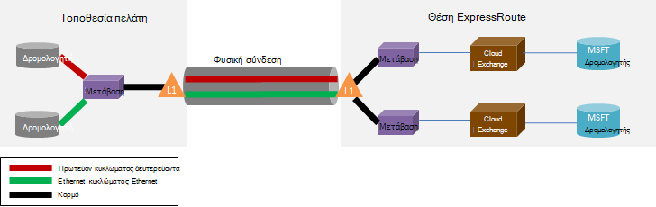

<properties
   pageTitle="ExpressRoute συνήθεις Ερωτήσεις"
   description="Συνήθεις Ερωτήσεις του ExpressRoute περιέχει πληροφορίες σχετικά με υποστηρίζονται υπηρεσιών Azure, κόστος, δεδομένων και συνδέσεις, SLA, υπηρεσίες παροχής και θέσεις, το εύρος ζώνης και πρόσθετες τεχνικές λεπτομέρειες."
   documentationCenter="na"
   services="expressroute"
   authors="cherylmc"
   manager="carmonm"
   editor=""/>
<tags
   ms.service="expressroute"
   ms.devlang="na"
   ms.topic="article" 
   ms.tgt_pltfrm="na"
   ms.workload="infrastructure-services"
   ms.date="10/10/2016"
   ms.author="cherylmc"/>

# ExpressRoute συνήθεις Ερωτήσεις

## Τι είναι το ExpressRoute;
ExpressRoute είναι μια υπηρεσία Azure που σας επιτρέπει να δημιουργήσετε ιδιωτικές συνδέσεις μεταξύ των Microsoft κέντρα δεδομένων και την υποδομή που είναι στις εγκαταστάσεις σας ή σε παράθεση εγκατάσταση. ExpressRoute συνδέσεις δεν μεταβείτε μέσω του δημόσιου Internet και, προσφέρουν μεγαλύτερη ασφάλεια, αξιοπιστία και ταχύτητες με κάτω των αδρανειών από τις τυπικές συνδέσεις μέσω του Internet.

### Ποια είναι τα πλεονεκτήματα της χρήσης ExpressRoute και συνδέσεις ιδιωτικού δικτύου;
Συνδέσεις ExpressRoute δεν μεταβείτε μέσω του δημόσιου Internet και, προσφέρουν μεγαλύτερη ασφάλεια, αξιοπιστία και ταχύτητες με κάτω και συνεπή των αδρανειών από τις τυπικές συνδέσεις μέσω του Internet. Σε ορισμένες περιπτώσεις, χρησιμοποιούν συνδέσεις ExpressRoute για τη μεταφορά δεδομένων μεταξύ της εσωτερικής συσκευές και Azure μπορεί να αποφέρει οφέλη σημαντική κόστος.

### Ποιες υπηρεσίες cloud της Microsoft που υποστηρίζονται μέσω ExpressRoute;
ExpressRoute υποστηρίζει περισσότερες υπηρεσίες του Microsoft Azure σήμερα όπως Office 365.  Αναζητήστε ενημερώσεις στο ιστολόγιο γενικής διαθεσιμότητας σύντομα.

### Πού είναι διαθέσιμη η υπηρεσία;
Ανατρέξτε στο θέμα αυτήν τη σελίδα για τη θέση της υπηρεσίας και τη διαθεσιμότητα: [ExpressRoute συνεργάτες και τις θέσεις](expressroute-locations.md).

### Πώς μπορώ να χρησιμοποιήσω ExpressRoute για να συνδεθείτε στη Microsoft, εάν δεν έχω εταιρικές σχέσεις με έναν από τους συνεργάτες ExpressRoute συλλαβισμού;
Μπορείτε να επιλέξετε μια τοπικές συλλαβισμού και να ξεκινάτε συνδέσεις Ethernet σε μία από το exchange υποστηριζόμενη υπηρεσία παροχής θέσεις. Μπορείτε, στη συνέχεια, να ομότιμη με τη Microsoft στην υπηρεσία παροχής θέση. Επιλέξτε το τελευταίο τμήμα [ExpressRoute συνεργάτες και τις θέσεις](expressroute-locations.md) για να δείτε εάν η υπηρεσία παροχής είναι παρόντες σε οποιαδήποτε από τις θέσεις του exchange. Στη συνέχεια, μπορείτε να παραγγείλετε ένα κύκλωμα ExpressRoute μέσω της υπηρεσίας παροχής για να συνδεθείτε με Azure.

### Πόσος χρόνος ExpressRoute κόστος;
Ελέγξτε [τις τιμές λεπτομερειών](https://azure.microsoft.com/pricing/details/expressroute/) για τις πληροφορίες τιμολόγησης.

### Εάν να πληρώσετε για ένα κύκλωμα ExpressRoute από μια δεδομένη εύρους ζώνης, η σύνδεση VPN να αγοράσετε από την υπηρεσία παροχής δικτύου πρέπει να είναι η ίδια ταχύτητα;
Όχι. Μπορείτε να αγοράσετε μια σύνδεση VPN από οποιαδήποτε ταχύτητα από την υπηρεσία παροχής. Ωστόσο, Azure τη σύνδεσή σας θα είναι υποχρεωμένοι να το εύρος ζώνης κυκλώματος ExpressRoute που αγοράσατε.

### Εάν να πληρώσετε για ένα κύκλωμα ExpressRoute από μια δεδομένη εύρους ζώνης, έχω τη δυνατότητα να καταιγισμού έως και υψηλότερες ταχύτητες εάν απαιτείται;
Ναι. Κυκλώματα ExpressRoute έχουν ρυθμιστεί για την υποστήριξη περιπτώσεις όπου μπορείτε να καταιγισμού έως και δύο φορές το όριο εύρους ζώνης που μεσολάβησε χωρίς πρόσθετο κόστος. Επικοινωνήστε με την υπηρεσία παροχής εάν που υποστηρίζουν αυτήν τη δυνατότητα.

### Μπορώ να χρησιμοποιήσω την ίδια σύνδεση ιδιωτικού δικτύου με εικονικού δικτύου και άλλες υπηρεσίες του Azure ταυτόχρονα;
Ναι. Ένα κύκλωμα ExpressRoute, μία φορά το πρόγραμμα εγκατάστασης θα σας επιτρέψει να πρόσβαση σε υπηρεσίες μέσα σε ένα εικονικό δίκτυο και άλλες υπηρεσίες του Azure ταυτόχρονα. Θα συνδέεστε με εικονικών δικτύων επάνω από τη διαδρομή του ιδιωτικού peering και άλλες υπηρεσίες μέσω της δημόσιας peering διαδρομής.

### ExpressRoute προσφέρει μια υπηρεσία σύμβαση (SLA);
Ανατρέξτε στη [σελίδα ExpressRoute SLA](https://azure.microsoft.com/support/legal/sla/) για περισσότερες πληροφορίες.

## Υποστηριζόμενες υπηρεσίες
Υποστηρίζονται πιο Azure υπηρεσίες μέσω ExpressRoute.

- Συνδεσιμότητα σε εικονικές μηχανές και τις υπηρεσίες cloud αναπτυχθεί στο εικονικών δικτύων υποστηρίζονται επάνω από τη διαδρομή ιδιωτικό peering.
- Azure τοποθεσίες Web που υποστηρίζονται επάνω από τη δημόσια peering διαδρομή.
- Ενότητα IoT υποστηρίζεται επάνω από τη δημόσια peering διαδρομή.
- Office 365 υποστηρίζεται στη διαδρομή peering της Microsoft.
- Όλες οι άλλες υπηρεσίες είναι προσβάσιμα μέσω της δημόσιας peering διαδρομής. Εξαιρέσεις είναι ως εξής.

    **Δεν υποστηρίζονται οι παρακάτω υπηρεσίες:**

    - CDN
    - Δοκιμές φόρτωσης των υπηρεσιών Visual Studio ομάδας
    - Έλεγχος ταυτότητας πολλών παραγόντων
    - Διαχείριση κίνηση

## Συνδέσεις και δεδομένων

### Υπάρχουν όρια για την ποσότητα των δεδομένων που να μπορεί να μεταφέρετε χρησιμοποιώντας ExpressRoute;
Δεν μπορούμε να εγκαταστήσουμε όριο στην ποσότητα μεταφορά δεδομένων. Ανατρέξτε στο [τις τιμές λεπτομερειών](https://azure.microsoft.com/pricing/details/expressroute/) για πληροφορίες σχετικά με το εύρος ζώνης χρεώσεων.

### Τι ταχύτητες σύνδεσης υποστηρίζονται από ExpressRoute;
Υποστηριζόμενες προσφορές εύρους ζώνης:

| 50 Mbp, 100 Mbp, 200 Mbps, 500 Mbps, 1Gbps, 2 Gbps, 5 Gbps, 10Gbps |

### Ποιες υπηρεσίες παροχής είναι διαθέσιμες;
Ανατρέξτε στο θέμα [ExpressRoute συνεργάτες και τις θέσεις](expressroute-locations.md) για τη λίστα των υπηρεσιών παροχής και τις θέσεις.

## Τεχνικές λεπτομέρειες

### Τι είναι οι τεχνικές απαιτήσεις για τη σύνδεση μου θέση εσωτερικής Azure;
Ανατρέξτε στο θέμα [ExpressRoute σελίδα προαπαιτούμενα στοιχεία](expressroute-prerequisites.md) για τις απαιτήσεις.

### Είναι περιττές συνδέσεις για να ExpressRoute;
Ναι. Κάθε κύκλωμα Express δρομολόγηση έχει ένα πλεονάζοντα ζεύγος διασταύρωσης συνδέσεις που έχουν ρυθμιστεί για την παροχή υψηλής διαθεσιμότητας.

### Θα να χάσετε τη σύνδεση εάν αποτύχει μία από τις συνδέσεις ExpressRoute μου;
Δεν θα χάσετε τη σύνδεση εάν αποτύχει η μία από τις συνδέσεις διασταύρωσης. Πλεονάζοντα σύνδεσης είναι διαθέσιμη για την υποστήριξη η φόρτωση του δικτύου σας. Επιπλέον, μπορείτε να δημιουργήσετε πολλές κυκλώματα σε διαφορετική θέση peering για να επιτύχετε την αποτυχία ανθεκτικότητα.

### Εάν δεν είμαι από κοινού βρίσκεται στη μια ανταλλαγή cloud και την υπηρεσία παροχής προσφέρει από σημείο σε σημείο σύνδεσης, πρέπει να τη διάταξη δύο φυσικών συνδέσεων με το δίκτυο εσωτερικής εγκατάστασης και Microsoft; 
Όχι, χρειάζεστε μόνο μία φυσική σύνδεση Εάν η υπηρεσία παροχής να δημιουργήσετε δύο εικονικού κυκλώματα Ethernet μέσω της φυσικής σύνδεσης. Η φυσική σύνδεση (π.χ. μια οπτική ίνα) τερματίζεται σε ένα επίπεδο 1 (L1) συσκευή (ανατρέξτε στην παρακάτω εικόνα). Τα δύο εικονικού κυκλώματα Ethernet έχουν ετικέτα με διαφορετικό VLAN αναγνωριστικά, μία για το πρωτεύον κύκλωμα και μία για τη δευτερεύουσα. Αυτά τα αναγνωριστικά VLAN είναι με το εξωτερικό 802.1Q κεφαλίδα Ethernet. Το εσωτερικό 802.1Q κεφαλίδα Ethernet (δεν εμφανίζεται) έχει αντιστοιχιστεί σε ένα συγκεκριμένο [τομέα δρομολόγησης ExpressRoute](expressroute-circuit-peerings.md). 

### Μπορεί να εκτείνονται μία από μου VLAN Azure χρησιμοποιώντας ExpressRoute;
Όχι. Δεν υποστηρίζουμε επιπέδου 2 συνδεσιμότητας επεκτάσεις σε Azure.

### Μπορώ να έχω περισσότερα από ένα ExpressRoute κυκλώματος στη συνδρομή μου;
Ναι. Μπορείτε να έχετε περισσότερες από μία ExpressRoute κυκλώματος στη συνδρομή σας. Το προεπιλεγμένο όριο στον αριθμό των αποκλειστικό κυκλώματα έχει οριστεί σε 10. Μπορείτε να επικοινωνήσετε υποστήριξης της Microsoft για να αυξήσετε το όριο, εάν είναι απαραίτητο.

### Μπορώ να έχω κυκλώματα ExpressRoute από διαφορετικές υπηρεσίες παροχής;
Ναι. Μπορείτε να έχετε ExpressRoute κυκλώματα με πολλές υπηρεσίες παροχής. Κάθε κύκλωμα ExpressRoute θα συσχετιστεί με μια υπηρεσία παροχής μόνο.

### Πώς να συνδεθώ με το εικονικό δίκτυα ένα κύκλωμα ExpressRoute
Βασικά βήματα που περιγράφονται παρακάτω.

- Πρέπει να δημιουργήσετε ένα κύκλωμα ExpressRoute και να έχετε την ενεργοποιήσετε την υπηρεσία παροχής.
- Μπορείτε ή η υπηρεσία παροχής που πρέπει να ρυθμίσετε το πρωτόκολλο BGP peering (s).
- Μπορείτε να συνδέσετε το εικονικό δίκτυο με το κύκλωμα ExpressRoute.

Για περισσότερες πληροφορίες, ανατρέξτε στο θέμα [ροές εργασίας ExpressRoute για προμήθεια κυκλώματος και κυκλώματος μέλη](expressroute-workflows.md) .

### Υπάρχουν όρια συνδεσιμότητας για μου κύκλωμα ExpressRoute;
Ναι. Στη σελίδα [ExpressRoute συνεργάτες και θέσεις](expressroute-locations.md) παρέχει μια επισκόπηση των τα όρια συνδεσιμότητας για ένα κύκλωμα ExpressRoute. Σύνδεση για ένα κύκλωμα ExpressRoute περιορίζεται σε μία μόνο περιοχή γεωπολιτική. Συνδεσιμότητα μπορούν να αναπτυχθούν να διασταυρώνεται γεωπολιτική περιοχές κατά την ενεργοποίηση της δυνατότητας premium ExpressRoute.

### Να συνδέσετε σε περισσότερες από μία εικονικού δικτύου για ένα κύκλωμα ExpressRoute;
Ναι. Μπορείτε να συνδέσετε έως και 10 εικονικών δικτύων σε ένα κύκλωμα ExpressRoute.

### Έχω πολλές συνδρομές Azure που περιέχουν εικονικού δίκτυα. Μπορώ να συνδεθώ εικονικού δίκτυα που βρίσκονται σε ξεχωριστά συνδρομές σε ένα μεμονωμένο κύκλωμα ExpressRoute;
Ναι. Μπορείτε να εξουσιοδοτήσετε έως και 10 άλλες Azure συνδρομές για να χρησιμοποιήσετε ένα μεμονωμένο κύκλωμα ExpressRoute. Αυτό το όριο μπορεί να αυξάνεται κατά την ενεργοποίηση της δυνατότητας premium ExpressRoute.

Για περισσότερες λεπτομέρειες, ανατρέξτε στο θέμα [κοινή χρήση ενός κυκλώματος ExpressRoute σε πολλές συνδρομές](expressroute-howto-linkvnet-arm.md).

### Είστε εικονικών δικτύων συνδεδεμένοι με το ίδιο κύκλωμα απομονωμένες μεταξύ τους;
Όχι. Όλα τα δίκτυα εικονικού συνδεδεμένο με το ίδιο κύκλωμα ExpressRoute είναι τμήμα του ίδιου δρομολόγηση τομέα και δεν είναι απομόνωσης μεταξύ τους, από μια προοπτική δρομολόγησης. Εάν χρειάζεστε απομόνωσης δρομολόγηση, θα χρειαστεί να δημιουργήσετε ένα ξεχωριστό κύκλωμα ExpressRoute.

### Μπορώ να έχω ένα εικονικό δίκτυο συνδεδεμένο με περισσότερες από μία ExpressRoute κυκλώματος;
Ναι. Μπορείτε να συνδέσετε ένα μεμονωμένο εικονικό δίκτυο με έως και 4 κυκλώματα ExpressRoute. Πρέπει να παραγγελθούν έως 4 διαφορετικές [θέσεις ExpressRoute](expressroute-locations.md).

### Μπορώ να αποκτήσω πρόσβαση στο internet από μου εικονικού δίκτυα συνδεδεμένοι κυκλώματα ExpressRoute;
Ναι. Εάν που δεν έχουν κοινοποιείται προεπιλεγμένη δρομολογεί (0.0.0.0/0) ή προθέματα δρομολόγηση internet μέσω της περιόδου λειτουργίας το πρωτόκολλο BGP, θα μπορείτε να συνδεθείτε στο Internet από ένα εικονικό δίκτυο συνδεδεμένο με ένα κύκλωμα ExpressRoute.

### Μπορώ να αποκλείσω σύνδεσης στο internet σε εικονικό δίκτυα συνδεδεμένοι κυκλώματα ExpressRoute;
Ναι. Μπορείτε να κοινοποιήσετε προεπιλεγμένη δρομολογεί (0.0.0.0/0) για να αποκλείσετε όλα σύνδεσης στο internet σε εικονικές μηχανές αναπτυχθεί μέσα σε ένα εικονικό δίκτυο και να δρομολογήσετε όλη την κυκλοφορία ανάληψη έως το κύκλωμα ExpressRoute. Λάβετε υπόψη ότι εάν μπορείτε να κοινοποιήσετε προεπιλεγμένες διαδρομές, θα σας θα επιβάλει την κυκλοφορία με τις υπηρεσίες που προσφέρουν τα δημόσια πίσω διεισδύουν (όπως Azure χώρου αποθήκευσης και SQL DB) για την εσωτερική εγκατάσταση. Θα πρέπει να ρυθμίσετε τις παραμέτρους δρομολογητές για να επιστρέψετε κίνηση Azure μέσω της διαδρομής της δημόσιας peering ή μέσω του internet.

### Να εικονικού δίκτυα που συνδέονται με το ίδιο κύκλωμα ExpressRoute μιλήσετε μεταξύ τους;
Ναι. Εικονικές μηχανές αναπτυχθεί στο εικονικών δικτύων συνδεδεμένο με το ίδιο κύκλωμα ExpressRoute μπορούν να επικοινωνούν μεταξύ τους.

### Μπορώ να χρησιμοποιήσω τη σύνδεση τοποθεσίας σε τοποθεσία για εικονικού δίκτυα σε συνδυασμό με ExpressRoute;
Ναι. ExpressRoute να συνυπάρχουν με VPN-τοποθεσίας.

### Μπορώ να μετακινήσω ένα εικονικό δίκτυο από τις ρυθμίσεις παραμέτρων τοποθεσίας σε τοποθεσία / σημείου σε τοποθεσία για να χρησιμοποιήσετε ExpressRoute;
Ναι. Θα πρέπει να δημιουργήσετε μια πύλη ExpressRoute εικονικό δίκτυο σας. Θα υπάρξει ένα μικρό χρόνου εκτός λειτουργίας που σχετίζεται με τη διαδικασία.

### Τι πρέπει να συνδεθείτε με το χώρο αποθήκευσης Azure μέσω ExpressRoute;
Πρέπει να δημιουργήσετε ένα κύκλωμα ExpressRoute και να ρυθμίσετε τις παραμέτρους διαδρομές για δημόσια διεισδύουν.

### Υπάρχουν όρια για τον αριθμό των διαδρομών που να κοινοποιήσετε;
Ναι. Θα σας αποδοχή έως 4000 δρομολόγηση προθέματα για ιδιωτικό διεισδύουν και 200 κάθε για δημόσια διεισδύουν και διεισδύουν της Microsoft. Μπορείτε να αυξήσετε αυτό να 10.000 διαδρομές για ιδιωτικό διεισδύουν Εάν ενεργοποιήσετε τη δυνατότητα premium ExpressRoute.

### Υπάρχουν περιορισμοί για να να κοινοποιήσετε πάνω από την περίοδο λειτουργίας το πρωτόκολλο BGP περιοχές διευθύνσεων IP;
Θα σας να μην γίνεται αποδοχή ιδιωτικό προθέματα (RFC1918) στη δημόσια και Microsoft peering το πρωτόκολλο BGP περίοδο λειτουργίας.

### Τι συμβαίνει εάν να υπερβαίνει το πρωτόκολλο BGP τα όρια;
Περίοδοι λειτουργίας το πρωτόκολλο BGP θα καταργηθεί. Θα γίνει επαναφορά μόλις κλείσει το πλήθος πρόθεμα κάτω από το όριο.

### Τι είναι ο χρόνος διατήρησης το πρωτόκολλο BGP ExpressRoute; Το ρυθμίζεται;
Ο χρόνος διατήρησης είναι 180. Τα μηνύματα ενεργών αποστέλλονται ανά 60 δευτερόλεπτα. Αυτά είναι σταθερό ρυθμίσεις στην πλευρά της Microsoft που δεν μπορεί να αλλάξει.

### Αφού να κοινοποιήσετε την προεπιλεγμένη δρομολόγηση (0.0.0.0/0) σε μου εικονικού δίκτυα, να δεν είναι δυνατό να ενεργοποιήσω το προϊόν Windows που εκτελείται στον μου ΣΠΣ Azure. Τρόπος για να διορθώσετε αυτό το πρόβλημα;
Ακολουθήστε τα παρακάτω βήματα θα σας βοηθήσουν Azure αναγνωρίζουν την αίτηση ενεργοποίησης:

1. Δημιουργήστε τη δημόσια διεισδύουν για το κύκλωμα ExpressRoute.
2. Εκτέλεση μιας αναζήτησης DNS και να βρείτε τη διεύθυνση IP του **kms.core.windows.net**
3. Στη συνέχεια, κάντε ένα από τα ακόλουθα δύο στοιχεία, έτσι ώστε η υπηρεσία διαχείρισης κλειδιών θα αναγνωρίσει ότι η αίτηση ενεργοποίησης συνοδεύεται από το Azure και θα εκτελέσει την αίτηση.
    - Στο δίκτυό σας στην εσωτερική εγκατάσταση, δρομολογήσετε την κυκλοφορία που προορίζονται για τη διεύθυνση IP (προέκυψε στο βήμα 2) προς Azure μέσω του δημόσια διεισδύουν.
    - Έχετε το pin τρίχωμα παροχής Παρατηρήσεις την κυκλοφορία ξανά στην Azure μέσω του δημόσια διεισδύουν.

### Μπορώ να αλλάξω το εύρος ζώνης του ένα κύκλωμα ExpressRoute;
Ναι. Μπορείτε να αυξήσετε το εύρος ζώνης του ένα κύκλωμα ExpressRoute χωρίς να χρειάζεται να δημιουργήσετε το προς τα κάτω. Θα πρέπει να υπενθύμισης με την υπηρεσία παροχής σύνδεσης για να βεβαιωθείτε ότι ο χρήστης ενημερώνει το περιορισμοί εντός τους δίκτυα ώστε να υποστηρίζει την αύξηση εύρους ζώνης. Ωστόσο, δεν θα μπορείτε να μειώσετε το εύρος ζώνης του ένα κύκλωμα ExpressRoute. Χρειάζεται να κάτω το εύρος ζώνης που θα σημαίνει ότι ένα δακρυγόνα προς τα κάτω και του συνόλου των ένα κύκλωμα ExpressRoute.

### Πώς μπορώ να αλλάξω το εύρος ζώνης του ένα κύκλωμα ExpressRoute;
Μπορείτε να ενημερώσετε το εύρος ζώνης του κυκλώματος ExpressRoute χρησιμοποιώντας το cmdlet ενημέρωση αφοσιωμένη κυκλώματος API και PowerShell.

## ExpressRoute Premium

### Τι είναι η ExpressRoute premium;
ExpressRoute premium είναι μια συλλογή των δυνατοτήτων που παρατίθενται παρακάτω.

 - Αυξημένη δρομολόγησης πίνακα όριο από 4000 δρομολογεί 10.000 διαδρομές για διεισδύουν ιδιωτικό.
 - Αυξημένη αριθμό VNets που μπορεί να συνδεθεί με το κύκλωμα ExpressRoute (η προεπιλογή είναι 10). Δείτε παρακάτω πίνακα για περισσότερες λεπτομέρειες.
 - Καθολική σύνδεση μέσω του δικτύου Microsoft core. Τώρα θα μπορείτε να συνδέσετε ένα VNet σε μία περιοχή γεωπολιτική με ένα κύκλωμα ExpressRoute σε μια άλλη περιοχή. **Παράδειγμα:** Μπορείτε να συνδέσετε ένα VNet που έχουν δημιουργηθεί με Δυτική Ευρώπη ένα κύκλωμα ExpressRoute που έχουν δημιουργηθεί με κοίλο πυριτίου.
 - Συνδεσιμότητα με υπηρεσίες του Office 365 και CRM Online.

### Πόσες VNets να να συνδέσετε με ένα κύκλωμα ExpressRoute εάν να ενεργοποιήσει ExpressRoute premium;
Οι παρακάτω πίνακες εμφανίζουν τα όρια ExpressRoute και τον αριθμό των VNets ανά ExpressRoute κυκλώματος.

[AZURE.INCLUDE [expressroute-limits](../../includes/expressroute-limits.md)]

### Πώς μπορώ να ενεργοποιήσω ExpressRoute premium;
ExpressRoute κορυφαίες δυνατότητες μπορεί να ενεργοποιηθεί όταν η δυνατότητα είναι ενεργοποιημένη και είναι δυνατή η απενεργοποίηση προς τα κάτω, ενημερώνοντας το μέλος κυκλώματος. Μπορείτε να ενεργοποιήσετε ExpressRoute premium κατά τη δημιουργία κυκλώματος ή να καλέσετε το κύκλωμα ενημέρωση αφοσιωμένη API / cmdlet του PowerShell για να ενεργοποιήσετε την ExpressRoute premium.

### Πώς μπορώ να απενεργοποιήσω ExpressRoute premium;
Μπορείτε να απενεργοποιήσετε την ExpressRoute premium καλώντας την ενημέρωση αφοσιωμένη κυκλώματος API / cmdlet του PowerShell που θα πρέπει να βεβαιωθείτε ότι έχετε κλιμάκωση τη σύνδεσή σας πρέπει να πληροί τα προεπιλεγμένα όρια πριν να απενεργοποιήσετε ExpressRoute premium. Θα σας θα αποτύχει αίτηση απενεργοποίησης ExpressRoute premium Εάν σας χρήση κλίμακες πέρα από τα όρια προεπιλογή.

### Να επιλέξτε να τις δυνατότητες που θέλετε από το σύνολο των δυνατοτήτων premium;
Όχι. Δεν θα μπορείτε να επιλέξετε τις δυνατότητες που χρειάζεστε. Θα σας Ενεργοποίηση όλων των δυνατοτήτων όταν ενεργοποιείτε ExpressRoute premium.

### Πόσο σημαίνει ExpressRoute premium κόστος;
Ανατρέξτε στην [τις τιμές λεπτομερειών](https://azure.microsoft.com/pricing/details/expressroute/) για το κόστος.

### Πληρωμή για premium ExpressRoute εκτός από την τυπική ExpressRoute χρεώσεων;
Ναι. Ισχύουν χρεώσεις premium ExpressRoute επάνω σε ExpressRoute κυκλώματος χρεώσεις και χρεώσεις που απαιτούνται από την υπηρεσία παροχής σύνδεσης.

## ExpressRoute και υπηρεσίες του Office 365 και CRM Online

[AZURE.INCLUDE [expressroute-office365-include](../../includes/expressroute-office365-include.md)]

### Πώς μπορώ να δημιουργήσω ένα κύκλωμα ExpressRoute για να συνδεθείτε με υπηρεσίες του Office 365 και CRM Online;

1. Ελέγξτε τη σελίδα [ExpressRoute προαπαιτούμενα στοιχεία σελίδας](expressroute-prerequisites.md) για να βεβαιωθείτε ότι πληροί τις απαιτήσεις.
2. Εξετάστε τη λίστα των υπηρεσιών παροχής και πληρούνται οι θέσεις στην [ExpressRoute συνεργάτες και τις θέσεις](expressroute-locations.md) για να βεβαιωθείτε ότι η σύνδεσή σας χρειάζεται.
3. Σχεδιασμός σας δυναμικότητας ανατρέχοντας στο [θέμα Σχεδιασμός και ρύθμιση επιδόσεων για το Office 365](http://aka.ms/tune/).
4. Ακολουθήστε τα βήματα που αναφέρονται σε ροές εργασίας παρακάτω ρύθμισης συνδεσιμότητας [ροές εργασίας ExpressRoute για προμήθεια κυκλώματος και κυκλώματος μέλη](expressroute-workflows.md).

>[AZURE.IMPORTANT] Βεβαιωθείτε ότι έχετε ενεργοποιήσει το πρόσθετο premium ExpressRoute κατά τη ρύθμιση παραμέτρων συνδεσιμότητας με υπηρεσίες του Office 365 και CRM Online.

### Πρέπει να ενεργοποιήσετε Azure δημόσια διεισδύουν για να συνδεθείτε με υπηρεσίες του Office 365 και CRM Online;
Όχι, μόνο πρέπει να ενεργοποιήσετε την Peering της Microsoft. Κυκλοφορία ελέγχου ταυτότητας για να Azure AD θα αποστέλλονται μέσω του Microsoft Peering. 

### Το υπάρχον κυκλώματα ExpressRoute μπορεί να υποστηρίξει συνδεσιμότητα με υπηρεσίες του Office 365 και CRM Online;
Ναι. Το υπάρχον κυκλώματος ExpressRoute μπορεί να ρυθμιστεί για την υποστήριξη συνδέσεων σε υπηρεσίες του Office 365. Βεβαιωθείτε ότι έχετε επαρκή χωρητικότητα για να συνδεθείτε σε υπηρεσίες του Office 365 και βεβαιωθείτε ότι έχετε ενεργοποιήσει το πρόσθετο premium. [Σχεδιασμός δικτύου και ρύθμιση επιδόσεων για το Office 365](http://aka.ms/tune/) θα σας βοηθήσει να σχεδιάσετε τις ανάγκες σας συνδεσιμότητας. Επίσης, ανατρέξτε στο θέμα [Δημιουργία και τροποποίηση ενός κυκλώματος ExpressRoute](expressroute-howto-circuit-classic.md).

### Τι Office 365 τις υπηρεσίες είναι δυνατή η πρόσβαση μέσω σύνδεσης ExpressRoute;

Ανατρέξτε στο [Office 365 URL και περιοχές διευθύνσεων IP](http://aka.ms/o365endpoints) σελίδας για μια λίστα ενημερωμένα με τις υπηρεσίες υποστηρίζεται μέσω ExpressRoute.

### Πόσο κάνει ExpressRoute για τις υπηρεσίες του Office 365 και το κόστος CRM Online;
Υπηρεσίες του Office 365 και CRM Online απαιτεί να ενεργοποιηθεί το πρόσθετο premium. Η [Τιμολόγηση σελίδα λεπτομερειών](https://azure.microsoft.com/pricing/details/expressroute/) παρέχει λεπτομέρειες κόστους για ExpressRoute.

### Ποιες περιοχές ExpressRoute για Office 365 υποστηρίζεται στο;
Ανατρέξτε [ExpressRoute συνεργάτες και τις θέσεις](expressroute-locations.md) για περισσότερες πληροφορίες σχετικά με τη λίστα των συνεργατών και τις θέσεις όπου υποστηρίζεται το ExpressRoute.

### Μπορώ να έχω πρόσβαση Office 365 στο Internet, ακόμα και αν έχουν ρυθμιστεί οι παράμετροι ExpressRoute για την εταιρεία μου;
Ναι. Τελικά σημεία του Office 365 υπηρεσίας είναι προσβάσιμος μέσω του internet, ακόμα και αν έχει ρυθμιστεί ExpressRoute για το δίκτυό σας. Εάν είστε σε θέση που έχει ρυθμιστεί για να συνδεθείτε με υπηρεσίες του Office 365 μέσω ExpressRoute, θα συνδεθείτε μέσω ExpressRoute.

### Dynamics AX Online είναι δυνατή η πρόσβαση μέσω σύνδεσης ExpressRoute;
Όχι, δεν υποστηρίζεται.
