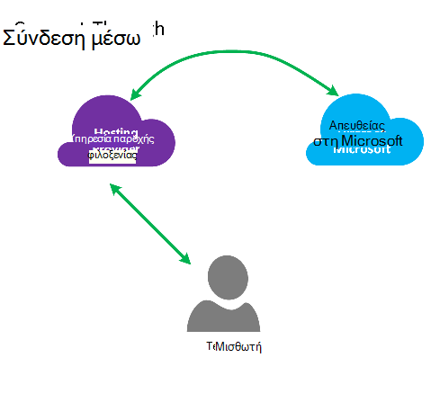
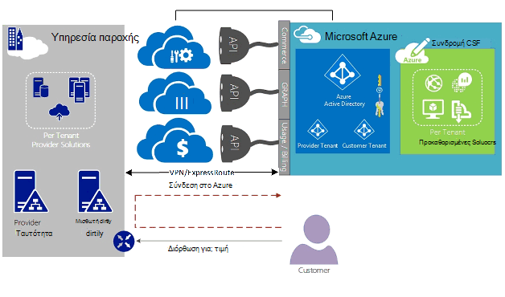
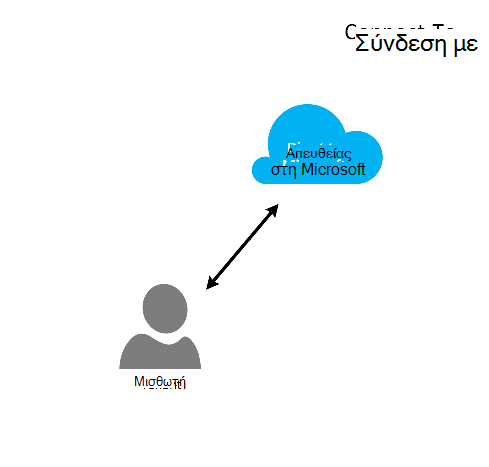
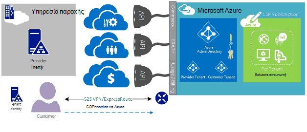
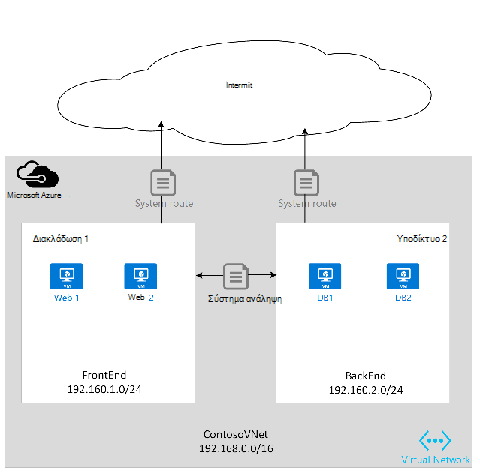

<properties
   pageTitle="Azure ExpressRoute για υπηρεσίες παροχής λύσεων Cloud | Microsoft Azure"
   description="Σε αυτό το άρθρο παρέχει πληροφορίες για το Cloud υπηρεσίες παροχής που θέλετε να ενσωματώσετε Azure υπηρεσιών και ExpressRoute σε προσφορές τους."
   documentationCenter="na"
   services="expressroute"
   authors="richcar"
   manager="carmonm"
   editor=""/>
<tags
   ms.service="expressroute"
   ms.devlang="na"
   ms.topic="get-started-article"
   ms.tgt_pltfrm="na"
   ms.workload="infrastructure-services"
   ms.date="10/10/2016"
   ms.author="richcar"/>

# ExpressRoute για υπηρεσίες παροχής λύσεων Cloud (υπηρεσία παροχής Κρυπτογράφησης)

Η Microsoft παρέχει υπηρεσίες Hyper-κλίμακα για παραδοσιακή μεταπωλητές και διανομείς (υπηρεσία παροχής Κρυπτογράφησης) να μπορούν να προμηθεύσουν γρήγορα νέων υπηρεσιών και λύσεις για τους πελάτες σας χωρίς να χρειάζεται να αφιερώσει στην ανάπτυξη αυτών των νέων υπηρεσιών. Για να επιτρέψετε την παροχής λύσεων Cloud (CSP) τη δυνατότητα να διαχειρίζεστε απευθείας αυτών των νέων υπηρεσιών, η Microsoft παρέχει προγράμματα και API που επιτρέπει η υπηρεσία παροχής Κρυπτογράφησης για να διαχειριστείτε πόρους Microsoft Azure εκ μέρους τους πελάτες σας. Ένα από αυτούς τους πόρους είναι ExpressRoute. ExpressRoute επιτρέπει η υπηρεσία παροχής Κρυπτογράφησης για να συνδεθείτε υπαρχόντων πελατών πόρων στο Azure υπηρεσίες. ExpressRoute είναι μια σύνδεση υψηλής ταχύτητας ιδιωτικό επικοινωνίας με τις υπηρεσίες στο Azure. 

ExpresRoute αποτελείται από ένα ζεύγος κυκλώματα για υψηλή διαθεσιμότητα που είναι συνημμένα σε ένα μεμονωμένο πελάτη εγγραφών στο και δεν μπορεί να είναι κοινόχρηστη με πολλούς πελάτες. Κάθε κύκλωμα πρέπει να τερματιστεί σε ένα διαφορετικό δρομολογητή για να διατηρήσετε την υψηλή διαθεσιμότητα.

>[AZURE.NOTE] Υπάρχουν caps εύρους ζώνης και σύνδεση στον ExpressRoute, γεγονός που σημαίνει ότι μεγάλο/μιγαδικών υλοποιήσεις θα απαιτεί πολλά κυκλώματα ExpressRoute για έναν πελάτη.

Microsoft Azure παρέχει αυξανόμενες πολλά των υπηρεσιών που μπορείτε να προσφέρετε στους πελάτες σας.  Για βέλτιστη λήψη επωφεληθείτε από αυτές τις υπηρεσίες θα απαιτούν τη χρήση συνδέσεων ExpressRoute για την παροχή υψηλής ταχύτητας χαμηλή λανθάνων χρόνος πρόσβασης για το Microsoft Azure περιβάλλον.

## Διαχείριση Microsoft Azure
Η Microsoft παρέχει CSP με API για να διαχειριστείτε τις συνδρομές Azure πελατών, επιτρέποντας προγραμματισμού ενοποίηση με το δικό σας συστημάτων διαχείρισης υπηρεσίας. Μπορείτε να βρείτε δυνατότητες διαχείρισης υποστηριζόμενες [εδώ](https://msdn.microsoft.com/library/partnercenter/dn974944.aspx).

## Διαχείριση πόρων Microsoft Azure
Ανάλογα με το συμβόλαιο που έχετε με τον πελάτη σας θα καθορίζουν πώς θα γίνεται η διαχείριση της συνδρομής. Η υπηρεσία παροχής Κρυπτογράφησης απευθείας μπορούν να διαχειριστούν τη δημιουργία και συντήρηση των πόρων ή τον πελάτη να τον έλεγχο της συνδρομής του Microsoft Azure και να δημιουργήσετε το Azure πόρους σύμφωνα με τις ανάγκες. Εάν ο πελάτης διαχειρίζεται τη δημιουργία πόρων σε της συνδρομής του Microsoft Azure θα χρησιμοποιήσουν μία από δύο μοντέλων: μοντέλο "Σύνδεση μέσω" ή "Απευθείας σε" μοντέλο. Αυτά τα μοντέλα περιγράφονται αναλυτικά στις ενότητες που ακολουθούν.  

### Σύνδεση μέσω μοντέλο

  

Στο μοντέλο σύνδεση μέσω, η υπηρεσία παροχής Κρυπτογράφησης δημιουργεί μια απευθείας σύνδεση μεταξύ του κέντρου δεδομένων και Azure συνδρομή του πελάτη σας. Γίνεται η απευθείας σύνδεση με χρήση ExpressRoute, τη σύνδεση δικτύου σας με το Azure. Στη συνέχεια, ο πελάτης συνδέεται με το δίκτυό σας. Αυτό το σενάριο απαιτεί ότι ο πελάτης διέρχεται από την υπηρεσία παροχής Κρυπτογράφησης δικτύου για να αποκτήσετε πρόσβαση σε υπηρεσίες Azure. 

Εάν ο πελάτης έχει άλλες συνδρομές Azure δεν ελέγχονται από το να, θα χρησιμοποιούν δημόσια στο Internet ή το δικό τους ιδιωτικής σύνδεσης για να συνδεθείτε με την παροχή της υπηρεσίας κάτω από τη συνδρομή στην υπηρεσία παροχής Κρυπτογράφησης μη αυτών των υπηρεσιών. 

Για την υπηρεσία παροχής Κρυπτογράφησης τη διαχείριση των υπηρεσιών Azure, θεωρείται ότι η υπηρεσία παροχής Κρυπτογράφησης έχει μια store ταυτότητας προηγουμένως υπάρχοντα πελάτη, η οποία θα, στη συνέχεια, να αναπαραχθούν σε Azure Active Directory για τη διαχείριση της συνδρομής τους υπηρεσία παροχής Κρυπτογράφησης μέσω Administrate-On-Behalf-Of (AOBO). Πλήκτρο προγράμματα οδήγησης για αυτό το σενάριο περιλαμβάνουν όπου μια δεδομένη συνεργάτη ή η υπηρεσία παροχής μια σχέσεις που δημιουργήθηκαν με τον πελάτη, ο πελάτης καταναλώνει υπηρεσίες παροχής τη συγκεκριμένη στιγμή ή συνεργάτη έχει μια το ενδιαφέρον για την παροχή ένα συνδυασμό των λύσεων φιλοξενούνται υπηρεσία παροχής και φιλοξενείται Azure για την παροχή ευελιξία και διεύθυνση πελάτη προκλήσεις που δεν είναι δυνατό να πληρούνται από την υπηρεσία παροχής Κρυπτογράφησης από μόνο του. Αυτό το μοντέλο απεικονίζεται στην **εικόνα**, κάτω από το στοιχείο.

### Σύνδεση με το μοντέλο

Στο μοντέλο σε σύνδεση, η υπηρεσία παροχής δημιουργεί μια απευθείας σύνδεση μεταξύ του κέντρου δεδομένων του πελάτη τους και η υπηρεσία παροχής Κρυπτογράφησης παρασχεθεί Azure συνδρομή χρήση ExpressRoute μέσω του πελάτη (πελάτη) δικτύου.

>[AZURE.NOTE] Για ExpressRoute ο πελάτης θα πρέπει να δημιουργήσετε και να διατηρήσετε το κύκλωμα ExpressRoute.  

Αυτό το σενάριο συνδεσιμότητας απαιτεί ότι ο πελάτης συνδέεται απευθείας από ένα δίκτυο πελατών για πρόσβαση σε διαχειριζόμενη υπηρεσία παροχής Κρυπτογράφησης Azure συνδρομή, χρησιμοποιώντας μια απευθείας σύνδεση δικτύου που δημιουργήσατε, ανήκει και διαχειριζόμενων μερικώς ή σε ένα τμήμα από τον πελάτη. Για αυτούς τους πελάτες θεωρείται ότι η υπηρεσία παροχής που δεν έχει αυτήν τη στιγμή εγκατεστημένος χώρου αποθήκευσης ταυτότητας πελατών και η υπηρεσία παροχής θα σας βοηθήσουν στον πελάτη για την αναπαραγωγή τους τρέχουσα χώρο αποθήκευσης αναγνώριση σε Azure Active Directory για τη διαχείριση της συνδρομής τους μέσω AOBO. Βασικές προγραμμάτων οδήγησης για αυτό το σενάριο περιλαμβάνει όπου μια δεδομένη συνεργάτη ή η υπηρεσία παροχής έχει μια σχέσεις που δημιουργήθηκαν με τον πελάτη, ο πελάτης καταναλώνει υπηρεσίες παροχής αυτήν τη στιγμή ή ο συνεργάτης διαθέτει μια το ενδιαφέρον για την παροχή υπηρεσιών που βασίζονται μόνο σε Azure που φιλοξενείται λύσεις χωρίς να χρειάζεται μια υπάρχουσα υπηρεσία παροχής κέντρο δεδομένων ή την υποδομή.

Η επιλογή μεταξύ αυτών των δύο επιλογή βασίζονται στις ανάγκες του πελάτη σας και την τρέχουσα πρέπει να παρέχουν υπηρεσίες Azure. Ελέγχετε τις λεπτομέρειες του αυτά τα μοντέλα και το σχετικό πρόσβασης βάσει ρόλων, τη δικτύωση και την ταυτότητα σχεδίαση μοτίβα καλύπτονται στις λεπτομέρειες στις παρακάτω συνδέσεις:
-   **Έλεγχος πρόσβασης βάσει ρόλων (RBAC)** – RBAC βασίζεται σε Azure Active Directory.  Για περισσότερες πληροφορίες σχετικά με Azure RBAC ανατρέξτε [εδώ](../active-directory/role-based-access-control-configure.md).
-   **Δίκτυο** – καλύπτει τα διάφορα θέματα της δικτύωσης στο Microsoft Azure.
-   **Azure Active Directory (AAD)** – AAD παρέχει τη Διαχείριση ταυτότητας για το Microsoft Azure και εφαρμογές άλλων κατασκευαστών ΑΔΑ. Για περισσότερες πληροφορίες σχετικά με το Azure AD ανατρέξτε [εδώ](https://azure.microsoft.com/documentation/services/active-directory/).  

## Ταχύτητες δικτύου
ExpressRoute υποστηρίζει ταχύτητες δικτύου από 50 Mb/s σε 10Gb/s. Αυτό σας επιτρέπει στους πελάτες να αγοράσετε το ποσό του εύρους ζώνης δικτύου που χρειάζονται για τις μοναδικές περιβάλλον.

>[AZURE.NOTE] Εύρος ζώνης δικτύου μπορεί να αυξάνεται ανάλογα με τις ανάγκες χωρίς να διακόψετε τις επικοινωνίες, αλλά για να μειώσετε το δίκτυο ταχύτητα απαιτεί σχίσιμο προς τα κάτω το κύκλωμα και εκ νέου δημιουργία στο κάτω την ταχύτητα του δικτύου.  

ExpressRoute υποστηρίζει τη σύνδεση του πολλών vNets σε ένα μεμονωμένο κύκλωμα ExpressRoute για καλύτερη αξιοποίηση των συνδέσεων υψηλής ταχύτητας. Ένα μεμονωμένο κύκλωμα ExpressRoute μπορεί να είναι κοινόχρηστη μεταξύ πολλών Azure συνδρομές που ανήκει στον ίδιο πελάτη.

## Ρύθμιση παραμέτρων ExpressRoute
ExpressRoute μπορεί να ρυθμιστεί ώστε να υποστηρίζει τρεις τύπους κίνησης ([δρομολόγηση τομέων](#ExpressRoute-routing-domains)) πάνω από ένα μεμονωμένο κύκλωμα ExpressRoute. Αυτήν την κυκλοφορία είναι χωρίζονται σε Microsoft διεισδύουν, Azure διεισδύουν δημόσια και ιδιωτικά διεισδύουν. Μπορείτε να επιλέξετε μία ή όλες τύπους κίνησης να σταλεί πάνω από ένα μεμονωμένο κύκλωμα ExpressRoute ή να χρησιμοποιήσετε πολλά κυκλώματα ExpressRoute ανάλογα με το μέγεθος των ExpressRoute κυκλώματος και απομόνωσης που απαιτούνται από τον πελάτη σας. Η ασφάλεια στη στάση του πελάτη σας μπορεί να μην επιτρέπουν δημόσια κίνηση και της αλλαγής μέσω του ίδιου κυκλώματος ιδιωτικό κίνησης.

### Σύνδεση μέσω μοντέλο
Σε μια σύνδεση μέσω ρύθμιση παραμέτρων του θα είναι υπεύθυνη για όλα τα κοινωνικής δικτύωσης underpinnings για να συνδεθείτε τους πόρους σας στο κέντρο δεδομένων πελάτες με τις συνδρομές που φιλοξενούνται στο Azure. Κάθε μία από του πελάτη σας που θέλετε να χρησιμοποιήσετε Azure δυνατότητες θα χρειαστεί τις δικές τους σύνδεσης ExpressRoute, το οποίο θα γίνεται η διαχείριση από την εσάς. Το θα χρησιμοποιήσετε τις ίδιες μεθόδους που χρησιμοποιούνται για την προμήθεια του κυκλώματος ExpressRoute στον πελάτη. Το θα ακολουθήσετε τα ίδια βήματα που περιγράφονται στο άρθρο [ροές εργασίας ExpressRoute](./expressroute-workflows.md) για προμήθεια κυκλώματος και κυκλώματος μέλη. Το θα, στη συνέχεια, ρυθμίζετε το δρομολογεί το πρωτόκολλο πρωτόκολλο πύλης περίγραμμα (BGP) για να ελέγξετε την κυκλοφορία ροή μεταξύ της εσωτερικής εγκατάστασης δικτύου και Azure vNet.

### Σύνδεση με το μοντέλο
Σε μια σύνδεση για τη ρύθμιση, ο πελάτης ήδη έχει μια υπάρχουσα σύνδεση σε Azure ή θα ξεκινήσει μια σύνδεση με την υπηρεσία παροχής internet σύνδεση ExpressRoute από το κέντρο δεδομένων του πελάτη απευθείας στο Azure, αντί για το κέντρο δεδομένων. Για να ξεκινήσετε τη διαδικασία προετοιμασίας, ο πελάτης θα ακολουθήστε τα βήματα όπως περιγράφεται στο μοντέλο σύνδεση μέσω, παραπάνω. Αφού έχει δημιουργηθεί το κύκλωμα των πελατών σας θα πρέπει να ρυθμίσετε τις παραμέτρους των δρομολογητών εσωτερικής εγκατάστασης για να μπορέσετε να αποκτήσετε πρόσβαση τόσο δικτύου και το Azure vNets.

Μπορεί να σας βοηθήσει με την εγκατάσταση της σύνδεσης και τη ρύθμιση των παραμέτρων τις διαδρομές για να επιτρέψετε στους πόρους στην datacenter(s) σας να επικοινωνούν με τους πόρους του υπολογιστή-πελάτη στο κέντρο δεδομένων σας ή με τους πόρους που φιλοξενούνται στο Azure.

## ExpressRoute τομείς δρομολόγησης
ExpressRoute προσφέρει τρεις τομείς δρομολόγησης: δημόσια ιδιωτικό και διεισδύουν της Microsoft. Κάθε έναν από τους τομείς δρομολόγησης έχουν ρυθμιστεί με πανομοιότυπες δρομολογητές στη ρύθμιση παραμέτρων ενεργούς για υψηλή διαθεσιμότητα. Για περισσότερες λεπτομέρειες σχετικά με ExpressRoute τομείς δρομολόγησης αναζητήστε [εδώ](./expressroute-circuit-peerings.md).

Μπορείτε να ορίσετε προσαρμοσμένο δρομολογεί φίλτρα για να επιτρέψετε μόνο το route(s) που θέλετε να επιτρέψετε ή να χρειαστεί. Για περισσότερες πληροφορίες ή για να δείτε πώς μπορείτε να κάνετε αυτές τις αλλαγές, ανατρέξτε στο άρθρο: [Δημιουργία και τροποποίηση δρομολόγησης για ένα κύκλωμα ExpressRoute χρήση του PowerShell](./expressroute-howto-routing-classic.md) για περισσότερες λεπτομέρειες σχετικά με τη δρομολόγηση φίλτρα.

>[AZURE.NOTE] Για το Microsoft και δημόσια διεισδύουν συνδεσιμότητας πρέπει να είναι μέσω μια δημόσια διεύθυνση IP που ανήκει ο πελάτης ή η υπηρεσία παροχής Κρυπτογράφησης και πρέπει να συμμορφώνονται με όλους τους κανόνες καθορισμένο. Για περισσότερες πληροφορίες, ανατρέξτε στη σελίδα [ExpressRoute προϋποθέσεις](expressroute-prerequisites.md) .  

## Δρομολόγηση
ExpressRoute συνδέεται με τα δίκτυα Azure μέσω της πύλης Azure εικονικού δικτύου. Πύλες δικτύου παρέχουν δρομολόγησης για Azure εικονικού δίκτυα.

Δημιουργία εικονικών δικτύων Azure δημιουργεί επίσης έναν προεπιλεγμένο πίνακα δρομολόγησης για το vNet για να κατευθύνουν κυκλοφορία προς/από το δευτερεύοντα δίκτυα του vNet. Εάν ο προεπιλεγμένος πίνακας δρομολόγησης δεν επαρκεί για την προσαρμοσμένη λύση δρομολογεί μπορούν να δημιουργηθούν για να δρομολογήσετε την εξερχόμενη κυκλοφορία προσαρμοσμένο συσκευές ή για να δρομολογεί μπλοκ συγκεκριμένες δευτερεύοντα δίκτυα ή εξωτερικά δίκτυα.

### Προεπιλεγμένη δρομολόγηση
Ο προεπιλεγμένος πίνακας δρομολόγησης περιλαμβάνει τις ακόλουθες διαδρομές:

- Δρομολόγηση μέσα σε ένα υποδίκτυο
- Υποδικτύου-σε-υποδικτύου στο εσωτερικό του εικονικού δικτύου
- Στο Internet
- Εικονικό δικτύου-σε-εικονικού δικτύου χρησιμοποιώντας πύλης VPN
- Εικονικό δίκτυο-σε-εσωτερικής εγκατάστασης δικτύου με τη χρήση μιας πύλης VPN ή ExpressRoute

  

### Που ορίζονται από το χρήστη δρομολόγησης (UDR)
Δρομολογεί που ορίζονται από το χρήστη επιτρέπουν εξερχόμενες από το υποδίκτυο που του έχουν ανατεθεί σε άλλα δευτερεύοντα δίκτυα το εικονικό δίκτυο ή σε μία από τις άλλες προκαθορισμένες πύλες (ExpressRoute; internet ή VPN) το στοιχείο ελέγχου της κυκλοφορίας. Ο πίνακας δρομολόγησης προεπιλεγμένο σύστημα μπορεί να αντικατασταθεί με έναν πίνακα δρομολόγησης που ορίζονται από το χρήστη που αντικαθιστά την προεπιλεγμένη δρομολόγηση πίνακα με προσαρμοσμένο δρομολογεί. Με την καθορισμένη από το χρήστη δρομολόγηση, πελάτες μπορούν να δημιουργήσετε συγκεκριμένες διαδρομές για συσκευές όπως τα τείχη προστασίας ή συσκευές εντοπισμού προεξοχή ή αποκλεισμού της πρόσβασης σε συγκεκριμένες δευτερεύοντα δίκτυα από το υποδίκτυο φιλοξενίας τη διαδρομή που ορίζονται από το χρήστη. Για μια επισκόπηση των διαδρομών που ορίζονται από το χρήστη, δείτε [εδώ](../virtual-network/virtual-networks-udr-overview.md). 

## Ασφάλεια
Ανάλογα με το μοντέλο είναι σε χρήση, σε σύνδεση ή σύνδεση μέσω, των πελατών σας καθορίζει τις πολιτικές ασφαλείας στο τους vNet ή παρέχει ασφάλεια απαιτήσεις πολιτικής για την υπηρεσία παροχής Κρυπτογράφησης για να ορίσετε για να τους vNets. Τα ακόλουθα κριτήρια ασφαλείας μπορεί να οριστεί:

1.  **Απομόνωσης πελατών** — το Azure πλατφόρμας παρέχει απομόνωσης πελατών, αποθηκεύοντας Αναγνωριστικό πελάτη και vNet πληροφορίες σε μια ασφαλή βάση δεδομένων, που χρησιμοποιείται για τη συμπύκνωση κάθε πελάτη κίνηση σε μια διοχέτευση GRE.
2.  Οι κανόνες **Ομάδα ασφαλείας δικτύου (NSG)** είναι για τον ορισμό επιτρέπεται κίνηση σε και έξοδος από το δευτερεύοντα δίκτυα εντός vNets στο Azure. Από προεπιλογή, το NSG περιέχουν μπλοκ κανόνες για να αποκλείσετε κυκλοφορία από το Internet για να το vNet και να επιτρέψετε σε κανόνες για την κίνηση μέσα σε ένα vNet. Για περισσότερες πληροφορίες σχετικά με τις ομάδες ασφαλείας δικτύου είναι [εδώ](https://azure.microsoft.com/blog/network-security-groups/).
3.  **Διοχέτευση ισχύ** — αυτή είναι μια επιλογή για να ανακατευθύνετε την κίνηση internet δεσμευμένο καταγωγής Azure ανακατεύθυνση μέσω της σύνδεσης ExpressRoute για την ενεργοποίηση κέντρο δεδομένων εσωτερικής εγκατάστασης. Για περισσότερες πληροφορίες σχετικά με το προσαρμοσμένο διοχέτευση αναζητήστε [εδώ](./expressroute-routing.md#advertising-default-routes).  

4.  **Κρυπτογράφηση** , παρόλο που τα κυκλώματα ExpressRoute προορίζονται αποκλειστικά για ένα συγκεκριμένο πελάτη, υπάρχει η πιθανότητα εμφάνισης ότι η υπηρεσία παροχής δικτύου μπορεί να είναι υπονομευτεί, επιτρέποντάς εισβολέας να εξετάσετε την κυκλοφορία πακέτων. Για να αντιμετωπίσετε αυτό πιθανά, έναν πελάτη ή την υπηρεσία παροχής Κρυπτογράφησης να κρυπτογραφήσετε κίνηση μέσω της σύνδεσης ορίζοντας πολιτικές λειτουργία διοχέτευσης ασφαλείας IP για όλη την κυκλοφορία ροή μεταξύ του στην εσωτερική εγκατάσταση πόρων και Azure πόρων (ανατρέξτε στη λειτουργία προαιρετικό διοχέτευσης ασφαλείας IP για το 1 πελατών στο σχήμα 5: ExpressRoute ασφαλείας, παραπάνω). Η δεύτερη επιλογή θα ήταν να χρησιμοποιείτε μια συσκευή τείχους προστασίας σε κάθε το τελικό σημείο του κυκλώματος ExpressRoute. Αυτό θα απαιτήσει επιπλέον άλλων κατασκευαστών ΣΠΣ/συσκευές να έχει εγκατασταθεί και στα δύο άκρα για να κρυπτογραφήσετε την κίνηση μέσω του κυκλώματος ExpressRoute τείχους προστασίας.

  

## Επόμενα βήματα
Η υπηρεσία παροχής λύσεων Cloud παρέχει ένας τρόπος για να αυξήσετε την τιμή στους πελάτες σας χωρίς να χρειάζεται ακριβό αγορές υποδομής και τη δυνατότητα, διατηρώντας τη θέση σας ως την υπηρεσία παροχής του πρωτεύοντος ανάθεσης. Απρόσκοπτη ενοποίηση με το Microsoft Azure μπορεί να πραγματοποιηθεί μέσω του API υπηρεσία παροχής Κρυπτογράφησης, επιτρέποντάς σας να ενοποιήσετε διαχείρισης του Microsoft Azure εντός του υπάρχοντος πλαίσια διαχείρισης.  

Μπορείτε να βρείτε πρόσθετες πληροφορίες στο τις παρακάτω συνδέσεις:

[Υπηρεσίες παροχής λύσεων Cloud Microsoft πρόγραμμα](https://partner.microsoft.com/en-US/Solutions/cloud-reseller-overview).  
[Προετοιμασία για αλληλεπίδραση με μια υπηρεσία παροχής λύσεων Cloud](https://partner.microsoft.com/en-us/solutions/cloud-reseller-pre-launch).  
[Υπηρεσίες παροχής λύσεων Cloud Microsoft πόρους](https://partner.microsoft.com/en-us/solutions/cloud-reseller-resources).
