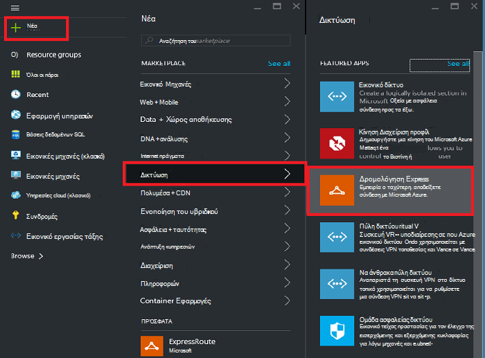
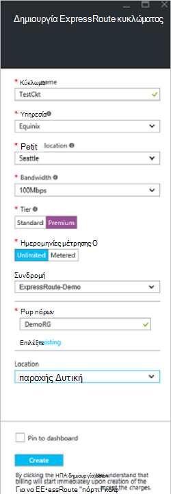
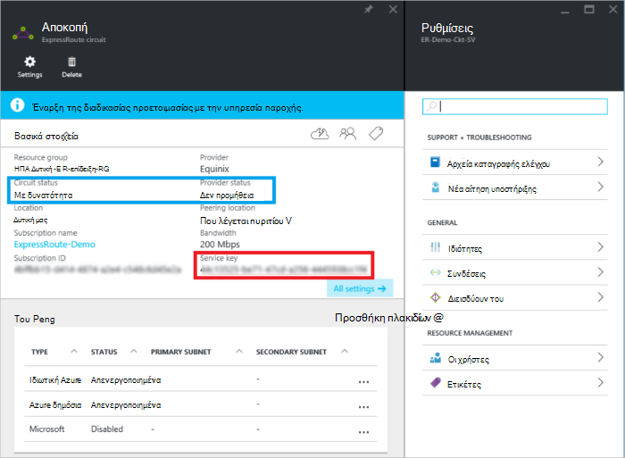
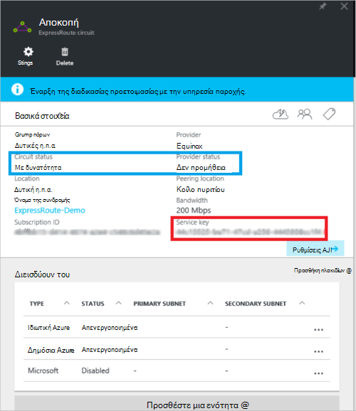
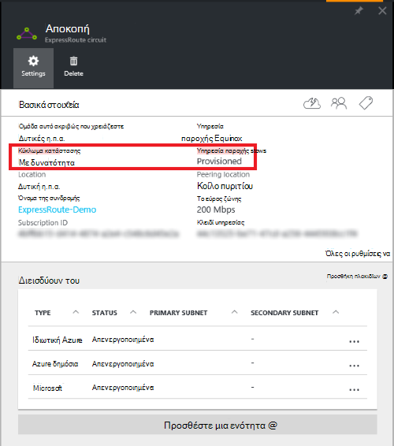

<properties
   pageTitle="Δημιουργία και τροποποίηση ένα κύκλωμα ExpressRoute με χρήση της διαχείρισης πόρων και την πύλη του Azure | Microsoft Azure"
   description="Σε αυτό το άρθρο περιγράφει πώς μπορείτε να δημιουργήσετε, προμήθεια, επαλήθευση, ενημέρωση, διαγραφή και deprovision ένα κύκλωμα ExpressRoute."
   documentationCenter="na"
   services="expressroute"
   authors="cherylmc"
   manager="carmonm"
   editor=""
   tags="azure-resource-manager"/>
<tags
   ms.service="expressroute"
   ms.devlang="na"
   ms.topic="article"
   ms.tgt_pltfrm="na"
   ms.workload="infrastructure-services"
   ms.date="10/10/2016"
   ms.author="cherylmc"/>

# Δημιουργία και τροποποίηση ενός κυκλώματος ExpressRoute

> [AZURE.SELECTOR]
[Azure πύλης - διαχείριση πόρων](expressroute-howto-circuit-portal-resource-manager.md)
[PowerShell - διαχείριση πόρων](expressroute-howto-circuit-arm.md)
[PowerShell - κλασικό](expressroute-howto-circuit-classic.md)

Σε αυτό το άρθρο περιγράφει τον τρόπο για να δημιουργήσετε ένα κύκλωμα Azure ExpressRoute χρησιμοποιώντας την πύλη του Azure και το μοντέλο ανάπτυξης Azure διαχείριση πόρων. Τα ακόλουθα βήματα σας δείχνουν πώς μπορείτε να ελέγξετε την κατάσταση του κυκλώματος, ενημέρωση, ή διαγραφή και deprovision το.

**Σχετικά με τα μοντέλα Azure ανάπτυξης**

[AZURE.INCLUDE [vpn-gateway-clasic-rm](../../includes/vpn-gateway-classic-rm-include.md)] 

## Πριν ξεκινήσετε

- Εξετάστε [τις προϋποθέσεις](expressroute-prerequisites.md) και [ροές εργασίας](expressroute-workflows.md) , πριν να ξεκινήσετε τη ρύθμιση των παραμέτρων.
- Βεβαιωθείτε ότι έχετε πρόσβαση στην [πύλη του Azure](https://portal.azure.com).
- Βεβαιωθείτε ότι έχετε δικαιώματα για τη δημιουργία νέων πόρων κοινωνικής δικτύωσης. Εάν δεν έχετε τα κατάλληλα δικαιώματα, επικοινωνήστε με το διαχειριστή του λογαριασμού σας.

## Δημιουργία και παροχή ένα κύκλωμα ExpressRoute

### 1. είσοδος στην πύλη του Azure

Από ένα πρόγραμμα περιήγησης, μεταβείτε στην [πύλη του Azure](http://portal.azure.com) και συνδεθείτε με το λογαριασμό Azure.

### 2. Δημιουργήστε ένα νέο κύκλωμα ExpressRoute

>[AZURE.IMPORTANT] Το κύκλωμα ExpressRoute θα χρεώνεστε από τη στιγμή που έχει εκδοθεί από έναν αριθμό-κλειδί υπηρεσίας. Βεβαιωθείτε ότι μπορείτε να εκτελέσετε αυτήν τη λειτουργία όταν είστε έτοιμοι να παρέχετε το κύκλωμα στην υπηρεσία παροχής σύνδεσης.

1. Μπορείτε να δημιουργήσετε ένα κύκλωμα ExpressRoute με την επιλογή για να δημιουργήσετε ένα νέο πόρο. Κάντε κλικ στην επιλογή **Δημιουργία** > **δίκτυο** > **ExpressRoute**, όπως φαίνεται στην παρακάτω εικόνα:

    

2. Αφού κάνετε κλικ **ExpressRoute**, θα δείτε τη **Δημιουργία ExpressRoute κυκλώματος** blade. Όταν συμπληρώσετε τις τιμές σε αυτό blade, βεβαιωθείτε ότι καθορίζετε το σωστό επίπεδο SKU και μέτρηση δεδομένων.

    - **Επίπεδο** Καθορίζει εάν είναι ενεργοποιημένη μια τυπική ExpressRoute ή ένα πρόσθετο premium ExpressRoute. Μπορείτε να καθορίσετε **Τυπική** για να λάβετε την τυπική SKU ή **Premium** για το πρόσθετο premium.

    - **Μέτρηση δεδομένων** καθορίζει τον τύπο χρέωσης. Μπορείτε να καθορίσετε **Ογκοχρέωσης** για το πρόγραμμα με βάση τη χρήση δεδομένων και **απεριόριστα** για απεριόριστο πρόγραμμα δεδομένων. Σημειώστε ότι μπορείτε να αλλάξετε τον τύπο χρεώσεων από **Ογκοχρέωσης** σε **απεριόριστα**, αλλά δεν μπορείτε να αλλάξετε τον τύπο από **απεριόριστα** να **Ογκοχρέωσης**.

    

>[AZURE.IMPORTANT] Λάβετε υπόψη ότι η θέση διεισδύουν υποδεικνύει τη [φυσική θέση](expressroute-locations.md) όπου διεισδύουν με τη Microsoft. Αυτό **δεν** είναι συνδεδεμένο με την ιδιότητα "Θέση", η οποία αναφέρεται σε τη Γεωγραφία όπου βρίσκεται η υπηρεσία παροχής Azure δικτύου πόρων. Ενώ δεν έχουν σχέση, είναι καλό να επιλέξετε μια υπηρεσία παροχής πόρων δικτύου γεωγραφικά κοντά στη θέση διεισδύουν του κυκλώματος. 

### 3. προβάλετε τα κυκλώματα και τις ιδιότητες

**Δείτε όλα τα κυκλώματα**

Μπορείτε να δείτε όλα τα κυκλώματα που δημιουργήσατε, επιλέγοντας **όλους τους πόρους** από το μενού αριστερή πλευρά.
    

**Προβάλετε τις ιδιότητες**

    You can view the properties of the circuit by selecting it. On this blade, note the service key for the circuit. You must copy the circuit key for your circuit and pass it down to the service provider to complete the provisioning process. The circuit key is specific to your circuit.

### 4. στείλτε το κλειδί υπηρεσίας στην υπηρεσία παροχής σύνδεσης για παροχή

Σε αυτό το blade, **κατάσταση υπηρεσίας παροχής** παρέχει πληροφορίες σχετικά με την τρέχουσα κατάσταση της προμήθειας στην υπηρεσία παροχής πλευρά. **Κατάσταση κυκλώματος** παρέχει την κατάσταση στην πλευρά της Microsoft. Για περισσότερες πληροφορίες σχετικά με την προμήθεια Πολιτείες κυκλώματος, ανατρέξτε στο άρθρο [ροές εργασίας](expressroute-workflows.md#expressroute-circuit-provisioning-states) .

Όταν δημιουργείτε ένα νέο κύκλωμα ExpressRoute, το κύκλωμα θα είναι σε κατάσταση παρακάτω:

Κατάσταση υπηρεσίας παροχής: δεν διαθέτει 
Κύκλωμα κατάσταση: ενεργοποιημένο

Το κύκλωμα θα αλλάξει στην παρακάτω κατάσταση όταν η υπηρεσία παροχής σύνδεσης είναι σε διαδικασία ενεργοποίησή του για να:

Κατάσταση υπηρεσίας παροχής: προμήθειας 
Κύκλωμα κατάσταση: ενεργοποιημένο

Για να μπορέσετε να χρησιμοποιήσετε ένα κύκλωμα ExpressRoute, πρέπει να είναι σε κατάσταση παρακάτω:

Κατάσταση υπηρεσίας παροχής: παροχή της υπηρεσίας 
Κύκλωμα κατάσταση: ενεργοποιημένο

### 5. περιοδικά Ελέγξτε την κατάσταση και την κατάσταση του αριθμού-κλειδιού κυκλώματος

Μπορείτε να προβάλετε τις ιδιότητες του κυκλώματος που σας ενδιαφέρει, επιλέγοντάς το. Ελέγξτε την **κατάσταση υπηρεσίας παροχής** και βεβαιωθείτε ότι αυτό μετακινείται στο **Provisioned** πριν να συνεχίσετε.

### 6. Δημιουργήστε τις παραμέτρους δρομολόγησης

Για οδηγίες βήμα προς βήμα, ανατρέξτε στο άρθρο [Ρύθμιση παραμέτρων δρομολόγησης κυκλώματος ExpressRoute](expressroute-howto-routing-portal-resource-manager.md) για να δημιουργήσετε και να τροποποιήσετε peerings κυκλώματος.

>[AZURE.IMPORTANT] Αυτές οι οδηγίες ισχύουν μόνο για κυκλώματα που έχουν δημιουργηθεί με υπηρεσίες παροχής που προσφέρουν υπηρεσίες επιπέδου 2 συνδεσιμότητας. Εάν χρησιμοποιείτε μια υπηρεσία παροχής που προσφέρει διαχειριζόμενων επιπέδου 3 υπηρεσιών (συνήθως ένα IP VPN, όπως MPLS), την υπηρεσία παροχής σύνδεσης θα ρυθμίσετε και να διαχειριστείτε τη δρομολόγηση για εσάς.

### 7. σύνδεση ένα εικονικό δίκτυο με ένα κύκλωμα ExpressRoute

Σύνδεση στη συνέχεια, ένα εικονικό δίκτυο με το κύκλωμα ExpressRoute. Χρησιμοποιήστε το άρθρο [Linking εικονικών δικτύων για κυκλώματα ExpressRoute](expressroute-howto-linkvnet-arm.md) κατά την εργασία με το μοντέλο ανάπτυξης διαχείρισης πόρων.

## Λήψη της κατάστασης μιας κυκλώματος ExpressRoute

Μπορείτε να προβάλετε την κατάσταση ενός κυκλώματος επιλέγοντάς το. 

## Τροποποίηση ενός κυκλώματος ExpressRoute

Μπορείτε να τροποποιήσετε ορισμένες ιδιότητες ενός κυκλώματος ExpressRoute χωρίς να επηρεάζονται συνδεσιμότητας. Προς το παρόν, δεν μπορείτε να τροποποιήσετε ιδιότητες κυκλώματος ExpressRoute, χρησιμοποιώντας την πύλη του Azure. Ωστόσο, μπορείτε να χρησιμοποιήσετε PowerShell για να τροποποιήσετε ιδιότητες κυκλώματος. Για περισσότερες πληροφορίες, ανατρέξτε στην ενότητα [Τροποποίηση ένα κύκλωμα ExpressRoute με χρήση του PowerShell](expressroute-howto-circuit-arm.md#modify).

Μπορείτε να κάνετε τα εξής με χωρίς χρόνου εκτός λειτουργίας:

- Ενεργοποίηση ή απενεργοποίηση ενός πρόσθετου premium ExpressRoute για το κύκλωμα ExpressRoute.

- Αυξήστε το εύρος ζώνης του σας κυκλώματος ExpressRoute. Σημειώστε ότι το εύρος ζώνης του ένα κύκλωμα υποβάθμιση δεν υποστηρίζεται. 

- Αλλάξτε το πρόγραμμα μέτρησης από τα δεδομένα με βάση τη χρήση απεριόριστες δεδομένα. Σημειώστε ότι μέτρησης στο πρόγραμμα από απεριόριστες δεδομένα με τα δεδομένα με βάση τη χρήση δεν υποστηρίζεται η αλλαγή.

-  Μπορείτε να ενεργοποιήσετε και να απενεργοποιήσετε **Επιτρέπουν κλασική λειτουργίες**.

Για περισσότερες πληροφορίες σχετικά με όρια και περιορισμούς, ανατρέξτε στο [ExpressRoute συνήθεις Ερωτήσεις](expressroute-faqs.md).

## Deprovisioning και τη διαγραφή ενός κυκλώματος ExpressRoute

Μπορείτε να διαγράψετε το κύκλωμα ExpressRoute κάνοντας κλικ στο εικονίδιο **Διαγραφή** . Λάβετε υπόψη τα εξής:

- Πρέπει να καταργήσετε τη σύνδεση όλα τα δίκτυα εικονικού από το κύκλωμα ExpressRoute. Εάν αυτή η λειτουργία αποτύχει, ελέγξτε εάν οποιοδήποτε εικονικού δίκτυα είναι συνδεδεμένες με το κύκλωμα.

- Εάν η κατάσταση παροχής ExpressRoute κυκλώματος υπηρεσία παροχής που χρησιμοποιείτε είναι **Provisioning** ή **Provisioned** πρέπει να εργαστείτε με την υπηρεσία παροχής για να deprovision το κύκλωμα στην πλευρά τους. Θα συνεχίσουμε να δεσμεύσετε πόρους και γραμματίου που μέχρι να ολοκληρωθεί deprovisioning το κύκλωμα την υπηρεσία παροχής και να ειδοποιεί μας.

- Εάν η υπηρεσία παροχής έχει κατάργηση του κυκλώματος (η κατάσταση παροχής υπηρεσίας παροχής έχει οριστεί σε **μην παρασχεθεί**), στη συνέχεια, μπορείτε να διαγράψετε το κύκλωμα. Αυτό θα σταματήσει χρέωση για το κύκλωμα

## Επόμενα βήματα

Αφού δημιουργήσετε το κύκλωμα, βεβαιωθείτε ότι κάνετε τα εξής:

- [Δημιουργία και τροποποίηση δρομολόγησης για το κύκλωμα ExpressRoute](expressroute-howto-routing-portal-resource-manager.md)
- [Σύνδεση εικονικού δικτύου σας για να σας κυκλώματος ExpressRoute](expressroute-howto-linkvnet-arm.md)
