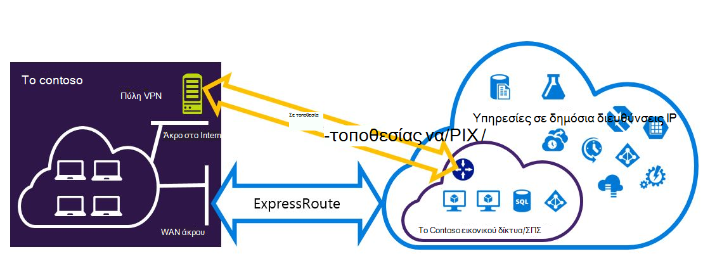
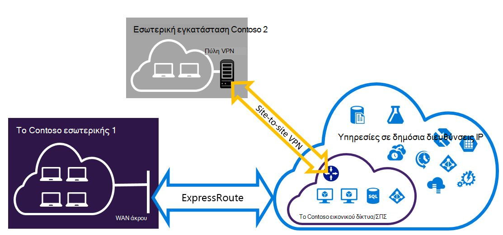

<properties
   pageTitle="Ρύθμιση παραμέτρων συνδέσεων VPN Expressroute και-τοποθεσίας που μπορούν να συνυπάρχουν | Microsoft Azure"
   description="Σε αυτό το άρθρο σάς καθοδηγεί σε ρύθμιση παραμέτρων ExpressRoute και μια σύνδεση VPN-τοποθεσίας που μπορούν να συνυπάρχουν για το μοντέλο κλασική ανάπτυξης."
   documentationCenter="na"
   services="expressroute"
   authors="charwen"
   manager="carmonm"
   editor=""
   tags="azure-service-management"/>
<tags
   ms.service="expressroute"
   ms.devlang="na"
   ms.topic="get-started-article"
   ms.tgt_pltfrm="na"
   ms.workload="infrastructure-services"
   ms.date="10/10/2016"
   ms.author="charwen"/>

# Ρύθμιση παραμέτρων συνδέσεων συνυπάρχουσες ExpressRoute και τοποθεσίας σε τοποθεσία για το μοντέλο κλασική ανάπτυξης

> [AZURE.SELECTOR]
- [PowerShell - διαχείριση πόρων](expressroute-howto-coexist-resource-manager.md)
- [PowerShell - κλασικό](expressroute-howto-coexist-classic.md)

Έχετε τη δυνατότητα να ρυθμίσετε τις παραμέτρους τοποθεσίας σε τοποθεσία VPN και ExpressRoute έχει αρκετά πλεονεκτήματα. Μπορείτε να ρύθμιση παραμέτρων--τοποθεσίας VPN ως διαδρομή ασφαλούς ανακατεύθυνσης για ExressRoute ή να χρησιμοποιήσετε VPN τοποθεσίας σε τοποθεσία για να συνδεθείτε με τοποθεσίες που δεν είστε συνδεδεμένοι μέσω ExpressRoute. Θα ασχοληθούμε με τα βήματα για να ρυθμίσετε τις παραμέτρους και τα δύο σενάρια σε αυτό το άρθρο. Σε αυτό το άρθρο ισχύει για το μοντέλο κλασική ανάπτυξης. Αυτή η ρύθμιση παραμέτρων δεν είναι διαθέσιμη στην πύλη.

**Σχετικά με τα μοντέλα Azure ανάπτυξης**

[AZURE.INCLUDE [vpn-gateway-clasic-rm](../../includes/vpn-gateway-classic-rm-include.md)] 

>[AZURE.IMPORTANT] Κυκλώματα ExpressRoute πρέπει να προ-ρυθμιστεί πριν να ακολουθήσετε τις παρακάτω οδηγίες. Βεβαιωθείτε ότι έχετε ακολουθήσει τους οδηγούς για να [δημιουργήσετε ένα κύκλωμα ExpressRoute](expressroute-howto-circuit-classic.md) και να [ρυθμίσετε τις παραμέτρους δρομολόγησης](expressroute-howto-routing-classic.md) πριν να ακολουθήσετε τα παρακάτω βήματα.

## Όρια και περιορισμοί

- **Δρομολόγηση τη μεταφορά δεν υποστηρίζεται.** Δεν μπορείτε να δρομολογήσετε (μέσω Azure) μεταξύ του τοπικού δικτύου σας συνδέονται μέσω VPN-τοποθεσίας και του τοπικού δικτύου που συνδέονται μέσω ExpressRoute.
- **Σημείο σε τοποθεσία δεν υποστηρίζεται.** Δεν είναι δυνατό να ενεργοποιήσετε τις συνδέσεις VPN σημείου σε τοποθεσία για την ίδια VNet που είναι συνδεδεμένα σε ExpressRoute. Σημείο σε τοποθεσία VPN και ExpressRoute δεν είναι δυνατό να συνυπάρχουν για το ίδιο VNet.
- **Εξαναγκασμένη διοχέτευση δεν μπορεί να ενεργοποιηθεί της πύλης VPN-τοποθεσίας.** Μπορείτε να μόνο "επιβάλετε" όλη την κυκλοφορία Internet συνδεδεμένων προς το δίκτυο εσωτερικής εγκατάστασης μέσω ExpressRoute.
- **Βασική SKU πύλης δεν υποστηρίζεται.** Πρέπει να χρησιμοποιήσετε μια πύλη μη - βασικές SKU για την [πύλη ExpressRoute](expressroute-about-virtual-network-gateways.md) και την [πύλη VPN](../vpn-gateway/vpn-gateway-about-vpngateways.md).
- **Υποστηρίζεται μόνο βάσει δρομολόγηση πύλη VPN.** Πρέπει να χρησιμοποιήσετε μια [Πύλη VPN](../vpn-gateway/vpn-gateway-about-vpngateways.md)βάσει δρομολόγηση.
- **Στατική διαδρομή πρέπει να ρυθμιστεί για την πύλη VPN.** Εάν τοπικού δικτύου σας είναι συνδεδεμένη με ExpressRoute και ένα VPN-τοποθεσίας, πρέπει να έχετε μια στατική διαδρομή έχει ρυθμιστεί στο τοπικό σας δίκτυο για να δρομολογήσετε η σύνδεση VPN-τοποθεσίας σε δημόσια στο Internet.
- **Πρώτα, πρέπει να ρυθμιστεί ExpressRoute πύλης.** Πρέπει πρώτα να δημιουργήσετε την πύλη ExpressRoute πριν από την προσθήκη της πύλης VPN-τοποθεσίας.

## Ρύθμιση παραμέτρων σχέδια

### Ρύθμιση παραμέτρων μιας τοποθεσίας σε τοποθεσία VPN ως διαδρομή ανακατεύθυνσης για ExpressRoute

Μπορείτε να ρυθμίσετε μια σύνδεση VPN-τοποθεσίας ως αντίγραφο ασφαλείας για ExpressRoute. Αυτό ισχύει μόνο για εικονικού δίκτυα που συνδέονται με το Azure ιδιωτικό peering path. Δεν υπάρχει λύση βάσει VPN ανακατεύθυνσης για τις υπηρεσίες προσβάσιμα μέσω Azure δημόσια και peerings της Microsoft. Το κύκλωμα ExpressRoute είναι πάντα η κύρια σύνδεση. Θα ροής δεδομένων μέσω της διαδρομής της τοποθεσίας σε τοποθεσία VPN μόνο εάν το κύκλωμα ExpressRoute αποτυγχάνει. 

### Ρύθμιση παραμέτρων ενός VPN τοποθεσίας σε τοποθεσία για να συνδεθείτε με τοποθεσίες που δεν συνδέονται μέσω ExpressRoute

Μπορείτε να ρυθμίσετε το δίκτυό σας όπου ορισμένες τοποθεσίες σύνδεσης απευθείας σε Azure μέσω VPN-τοποθεσίας και συνδέστε ορισμένες τοποθεσίες μέσω του ExpressRoute. 

>[AZURE.NOTE] Δεν μπορείτε να κάνετε μια ρύθμιση εικονικού δικτύου ως δρομολογητής τη μεταφορά.

## Επιλέγοντας τα βήματα για να χρησιμοποιήσετε

Υπάρχουν δύο διαφορετικά σύνολα διαδικασίες για να επιλέξετε για να ρυθμίσετε τις παραμέτρους συνδέσεων που μπορούν να συνυπάρχουν. Η διαδικασία ρύθμισης παραμέτρων που θα επιλέξετε θα εξαρτώνται από εάν έχετε ένα υπάρχον εικονικό δίκτυο που θέλετε να συνδεθείτε ή που θέλετε να δημιουργήσετε ένα νέο εικονικό δίκτυο.

- Που δεν έχουν μια VNet και πρέπει να δημιουργήσετε μία.
    
    Εάν δεν έχετε ήδη ένα εικονικό δίκτυο, αυτή η διαδικασία θα σας καθοδηγήσει τη δημιουργία ενός νέου εικονικού δικτύου με χρήση του μοντέλου κλασική ανάπτυξης και τη δημιουργία νέων συνδέσεων VPN ExpressRoute και τοποθεσίας σε τοποθεσία. Για να ρυθμίσετε τις παραμέτρους, ακολουθήστε τα βήματα στην ενότητα το άρθρο [για να δημιουργήσετε ένα νέο εικονικό δίκτυο και συνυπάρχουσες συνδέσεις](#new).

- Έχω ήδη ένα μοντέλο κλασική ανάπτυξης VNet.

    Ενδέχεται να έχετε ήδη ένα εικονικό δίκτυο στη θέση με μια υπάρχουσα σύνδεση VPN-τοποθεσίας ή ExpressRoute σύνδεσης. Στην ενότητα το άρθρο [για να ρυθμίσετε τις παραμέτρους coexsiting συνδέσεων για ένα ήδη υπάρχον VNet](#add) θα καθοδηγήσουμε τη διαγραφή της πύλης και, στη συνέχεια, τη δημιουργία νέων συνδέσεων VPN ExpressRoute και τοποθεσίας σε τοποθεσία. Σημειώστε ότι κατά τη δημιουργία του νέου συνδέσεις, τα βήματα πρέπει να ολοκληρωθεί σε μια πολύ συγκεκριμένη σειρά. Μην χρησιμοποιείτε τις οδηγίες που εμφανίζονται σε άλλα άρθρα για να δημιουργήσετε τις πύλες και τις συνδέσεις.

    Σε αυτήν τη διαδικασία, τη δημιουργία συνδέσεων που μπορούν να συνυπάρχουν θα απαιτούν να διαγράψετε την πύλη, και, στη συνέχεια, ρύθμιση παραμέτρων νέα πυλών. Αυτό σημαίνει ότι θα έχετε χρόνου εκτός λειτουργίας για τις συνδέσεις σας σταυρό εσωτερικής εγκατάστασης ενώ μπορείτε να διαγράψετε και να δημιουργήσετε ξανά την πύλη και τις συνδέσεις, αλλά δεν θα χρειαστεί να μετεγκαταστήσετε οποιαδήποτε ΣΠΣ ή τις υπηρεσίες σε νέο εικονικό δίκτυο. ΣΠΣ και των υπηρεσιών σας θα εξακολουθούν να μπορέσετε να επικοινωνείτε μέσω τη μονάδα εξισορρόπησης φόρτου κατά τη ρύθμιση παραμέτρων της πύλης εάν να έχουν ρυθμιστεί για να το κάνετε.

## Για να δημιουργήσετε ένα νέο εικονικό δίκτυο και συνυπάρχουσες συνδέσεις

Αυτή η διαδικασία θα θα σας καθοδηγήσουν για τη δημιουργία ενός VNet και δημιουργία τοποθεσίας σε τοποθεσία και ExpressRoute συνδέσεις που θα συνυπάρχουν.

1. Θα πρέπει να εγκαταστήσετε την πιο πρόσφατη έκδοση του τα cmdlet του Azure PowerShell. Για περισσότερες πληροφορίες σχετικά με την εγκατάσταση τα cmdlet του PowerShell, ανατρέξτε στο θέμα [Πώς να εγκαταστήσετε και να ρυθμίσετε τις παραμέτρους του PowerShell Azure](../powershell-install-configure.md) . Σημειώστε ότι μπορεί να είναι λίγο διαφορετικά από το τι θα μπορεί να είστε εξοικειωμένοι με τα cmdlet που θα χρησιμοποιήσετε αυτήν τη ρύθμιση παραμέτρων. Φροντίστε να χρησιμοποιήσετε τα cmdlet που καθορίζονται σε αυτές τις οδηγίες. 

2. Δημιουργήστε ένα σχήμα για το εικονικό δίκτυο. Για περισσότερες πληροφορίες σχετικά με το σχήμα ρύθμισης παραμέτρων, ανατρέξτε στο θέμα [σχήμα ρύθμισης παραμέτρων Azure εικονικού δικτύου](https://msdn.microsoft.com/library/azure/jj157100.aspx).

    Κατά τη δημιουργία του σχήματος, βεβαιωθείτε ότι μπορείτε να χρησιμοποιήσετε τις παρακάτω τιμές:

    - Το υποδίκτυο πύλης για το εικονικό δίκτυο πρέπει να είναι /27 ή μικρότερη πρόθεμα (όπως /26 ή /25).
    - Ο τύπος σύνδεσης πύλης είναι "αφοσιωμένη."

              <VirtualNetworkSite name="MyAzureVNET" Location="Central US">
                <AddressSpace>
                  <AddressPrefix>10.17.159.192/26</AddressPrefix>
                </AddressSpace>
                <Subnets>
                  <Subnet name="Subnet-1">
                    <AddressPrefix>10.17.159.192/27</AddressPrefix>
                  </Subnet>
                  <Subnet name="GatewaySubnet">
                    <AddressPrefix>10.17.159.224/27</AddressPrefix>
                  </Subnet>
                </Subnets>
                <Gateway>
                  <ConnectionsToLocalNetwork>
                    <LocalNetworkSiteRef name="MyLocalNetwork">
                      <Connection type="Dedicated" />
                    </LocalNetworkSiteRef>
                  </ConnectionsToLocalNetwork>
                </Gateway>
              </VirtualNetworkSite>

3. Μετά τη δημιουργία και τη ρύθμιση των παραμέτρων σας αρχείο σχήματος xml, αποστείλετε το αρχείο. Αυτό θα δημιουργήσει το εικονικό δίκτυο.

    Χρησιμοποιήστε το ακόλουθο cmdlet για να αποστείλετε το αρχείο σας, αντικαθιστώντας την τιμή με το δικό σας.

        Set-AzureVNetConfig -ConfigurationPath 'C:\NetworkConfig.xml'

4. Δημιουργήστε μια πύλη ExpressRoute. Φροντίστε να καθορίσετε το GatewaySKU ως *Τυπική*, *HighPerformance*, ή *UltraPerformance* και το GatewayType ως *DynamicRouting*.

    Χρησιμοποιήστε το παρακάτω παράδειγμα, αντικαθιστώντας τις τιμές για τη δική σας.

        New-AzureVNetGateway -VNetName MyAzureVNET -GatewayType DynamicRouting -GatewaySKU HighPerformance

5. Σύνδεση της πύλης ExpressRoute για να το κύκλωμα ExpressRoute. Αφού ολοκληρωθεί αυτό το βήμα, η σύνδεση μεταξύ το δίκτυο εσωτερικής εγκατάστασης και Azure, μέσω ExpressRoute, είναι εγκατεστημένος.

        New-AzureDedicatedCircuitLink -ServiceKey <service-key> -VNetName MyAzureVNET

6. Στη συνέχεια, δημιουργήστε την πύλη VPN-τοποθεσίας. Το GatewaySKU πρέπει να είναι *Τυπική*, *HighPerformance*, ή *UltraPerformance* και το GatewayType πρέπει να είναι *DynamicRouting*.

        New-AzureVirtualNetworkGateway -VNetName MyAzureVNET -GatewayName S2SVPN -GatewayType DynamicRouting -GatewaySKU  HighPerformance

    Για να ανακτήσετε τις ρυθμίσεις πύλης εικονικού δικτύου, όπως το Αναγνωριστικό πύλης και τη δημόσια IP, χρησιμοποιήστε το `Get-AzureVirtualNetworkGateway` cmdlet.

        Get-AzureVirtualNetworkGateway

        GatewayId            : 348ae011-ffa9-4add-b530-7cb30010565e
        GatewayName          : S2SVPN
        LastEventData        :
        GatewayType          : DynamicRouting
        LastEventTimeStamp   : 5/29/2015 4:41:41 PM
        LastEventMessage     : Successfully created a gateway for the following virtual network: GNSDesMoines
        LastEventID          : 23002
        State                : Provisioned
        VIPAddress           : 104.43.x.y
        DefaultSite          :
        GatewaySKU           : HighPerformance
        Location             :
        VnetId               : 979aabcf-e47f-4136-ab9b-b4780c1e1bd5
        SubnetId             :
        EnableBgp            : False
        OperationDescription : Get-AzureVirtualNetworkGateway
        OperationId          : 42773656-85e1-a6b6-8705-35473f1e6f6a
        OperationStatus      : Succeeded

7. Δημιουργία μιας τοπικής τοποθεσίας οντότητα πύλης VPN. Αυτή η εντολή δεν ρύθμιση παραμέτρων της πύλης VPN εσωτερικής εγκατάστασης. Προτιμάτε, σάς επιτρέπει να παρέχετε τις ρυθμίσεις της τοπικής πύλης, όπως το δημόσιο IP και την εσωτερική διευθύνσεων χώρο, ώστε να μπορούν να συνδεθούν στην πύλη Azure VPN σε αυτό.

    >[AZURE.IMPORTANT] Τοπική τοποθεσία για το VPN-τοποθεσίας δεν έχει οριστεί στο το netcfg. Αντί για αυτό, πρέπει να χρησιμοποιήσετε αυτό το cmdlet για να καθορίσετε τις παραμέτρους της τοπικής τοποθεσίας. Δεν μπορείτε να ορίσετε χρησιμοποιώντας πύλη ή το αρχείο netcfg.

    Χρησιμοποιήστε το παρακάτω παράδειγμα, αντικαθιστώντας τις τιμές με το δικό σας.

        New-AzureLocalNetworkGateway -GatewayName MyLocalNetwork -IpAddress <MyLocalGatewayIp> -AddressSpace <MyLocalNetworkAddress>

    > [AZURE.NOTE] Εάν το τοπικό δίκτυο έχει πολλές διαδρομές, μπορείτε να περάσετε τους από ως πίνακα.  $MyLocalNetworkAddress =@("10.1.2.0/24","10.1.3.0/24","10.2.1.0/24")  

    Για να ανακτήσετε τις ρυθμίσεις πύλης εικονικού δικτύου, όπως το Αναγνωριστικό πύλης και τη δημόσια IP, χρησιμοποιήστε το `Get-AzureVirtualNetworkGateway` cmdlet. Δείτε το παρακάτω παράδειγμα.

        Get-AzureLocalNetworkGateway

        GatewayId            : 532cb428-8c8c-4596-9a4f-7ae3a9fcd01b
        GatewayName          : MyLocalNetwork
        IpAddress            : 23.39.x.y
        AddressSpace         : {10.1.2.0/24}
        OperationDescription : Get-AzureLocalNetworkGateway
        OperationId          : ddc4bfae-502c-adc7-bd7d-1efbc00b3fe5
        OperationStatus      : Succeeded

8. Ρύθμιση παραμέτρων σας τοπική συσκευή VPN για να συνδεθείτε με τη νέα πύλη. Χρησιμοποιήστε τις πληροφορίες που θα ανακτηθεί στο βήμα 6 κατά τη ρύθμιση των παραμέτρων σας συσκευή VPN. Για περισσότερες πληροφορίες σχετικά με τις παραμέτρους της συσκευής VPN, ανατρέξτε στο θέμα [Ρύθμιση παραμέτρων συσκευή VPN](../vpn-gateway/vpn-gateway-about-vpn-devices.md).

9. Σύνδεση VPN-τοποθεσίας πύλης σε Azure στην τοπική πύλη.

    Σε αυτό το παράδειγμα, connectedEntityId είναι το Αναγνωριστικό τοπική πύλη, το οποίο μπορείτε να βρείτε, εκτελώντας `Get-AzureLocalNetworkGateway`. Μπορείτε να βρείτε virtualNetworkGatewayId χρησιμοποιώντας το `Get-AzureVirtualNetworkGateway` cmdlet. Μετά από αυτό το βήμα, της σύνδεσης μεταξύ του τοπικού δικτύου και Azure μέσω της σύνδεσης VPN-τοποθεσίας είναι εγκατεστημένος.

        New-AzureVirtualNetworkGatewayConnection -connectedEntityId <local-network-gateway-id> -gatewayConnectionName Azure2Local -gatewayConnectionType IPsec -sharedKey abc123 -virtualNetworkGatewayId <azure-s2s-vpn-gateway-id>

## Για να ρυθμίσετε τις παραμέτρους coexsiting συνδέσεων για ένα ήδη υπάρχον VNet

Εάν έχετε ένα υπάρχον εικονικό δίκτυο, ελέγξτε το μέγεθος υποδικτύου πύλης. Εάν η πύλη είναι /28 ή /29, πρέπει να πρώτα να διαγράψετε την πύλη εικονικού δικτύου και να αύξηση του μεγέθους υποδικτύου πύλης. Τα βήματα σε αυτήν την ενότητα θα σας δείξει πώς να το κάνετε.

Εάν η πύλη είναι /27 ή μεγαλύτερο και το εικονικό δίκτυο είναι συνδεδεμένο μέσω ExpressRoute, μπορείτε να παραλείψετε τα παρακάτω βήματα και να συνεχίσετε να ["Βήμα 6 - Δημιουργία μιας πύλης VPN-τοποθεσίας"](#vpngw) στην προηγούμενη ενότητα.

>[AZURE.NOTE] Όταν διαγράφετε την υπάρχουσα πύλη, το τοπικό εσωτερικής εγκατάστασης θα χάσετε τη σύνδεση με το δίκτυό σας εικονικού ενώ εργάζεστε σε αυτήν τη ρύθμιση παραμέτρων.

1. Θα πρέπει να εγκαταστήσετε την πιο πρόσφατη έκδοση του τα cmdlet του PowerShell για τη διαχείριση πόρων Azure. Για περισσότερες πληροφορίες σχετικά με την εγκατάσταση τα cmdlet του PowerShell, ανατρέξτε στο θέμα [Πώς να εγκαταστήσετε και να ρυθμίσετε τις παραμέτρους του PowerShell Azure](../powershell-install-configure.md) . Σημειώστε ότι μπορεί να είναι λίγο διαφορετικά από το τι θα μπορεί να είστε εξοικειωμένοι με τα cmdlet που θα χρησιμοποιήσετε αυτήν τη ρύθμιση παραμέτρων. Φροντίστε να χρησιμοποιήσετε τα cmdlet που καθορίζονται σε αυτές τις οδηγίες. 

2. Διαγραφή της υπάρχουσας τοποθεσίας σε τοποθεσία VPN ή ExpressRoute πύλης. Χρησιμοποιήστε το ακόλουθο cmdlet, αντικαθιστώντας τις τιμές με το δικό σας.

        Remove-AzureVNetGateway –VnetName MyAzureVNET

3. Εξαγωγή του σχήματος εικονικού δικτύου. Χρησιμοποιήστε το ακόλουθο cmdlet του PowerShell, αντικαθιστώντας τις τιμές με το δικό σας.

        Get-AzureVNetConfig –ExportToFile “C:\NetworkConfig.xml”

4. Επεξεργασία του σχήματος αρχείο ρύθμισης παραμέτρων δικτύου, έτσι ώστε το υποδίκτυο πύλης είναι /27 ή μικρότερη πρόθεμα (όπως /26 ή /25). Δείτε το παρακάτω παράδειγμα. 
>[AZURE.NOTE] Εάν δεν διαθέτετε αρκετές διευθύνσεις IP προς τα αριστερά στην εικονικού δικτύου σας για να αυξήσετε το μέγεθος της πύλης υποδίκτυο, πρέπει να προσθέσετε περισσότερο χώρο διευθύνσεων IP. Για περισσότερες πληροφορίες σχετικά με το σχήμα ρύθμισης παραμέτρων, ανατρέξτε στο θέμα [σχήμα ρύθμισης παραμέτρων Azure εικονικού δικτύου](https://msdn.microsoft.com/library/azure/jj157100.aspx).

          <Subnet name="GatewaySubnet">
            <AddressPrefix>10.17.159.224/27</AddressPrefix>
          </Subnet>

5. Εάν το προηγούμενο πύλης ήταν VPN-τοποθεσίας, πρέπει να επαναφέρετε τον τύπο σύνδεσης **Dedicated**επίσης.

                 <Gateway>
                  <ConnectionsToLocalNetwork>
                    <LocalNetworkSiteRef name="MyLocalNetwork">
                      <Connection type="Dedicated" />
                    </LocalNetworkSiteRef>
                  </ConnectionsToLocalNetwork>
                </Gateway>

6. Σε αυτό το σημείο, θα έχετε μια VNet με χωρίς πυλών. Για να δημιουργήσετε νέα πύλες και ολοκληρώστε τις συνδέσεις σας, μπορείτε να συνεχίσετε με το [βήμα 4 - Δημιουργία μιας πύλης ExpressRoute](#gw), βρίσκονται στο προηγούμενο σύνολο βημάτων.

## Επόμενα βήματα

Για περισσότερες πληροφορίες σχετικά με το ExpressRoute, ανατρέξτε στο θέμα [Συνήθεις Ερωτήσεις ExpressRoute](expressroute-faqs.md)
