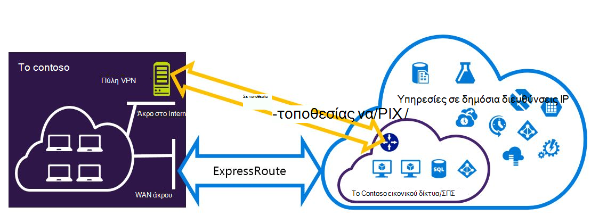
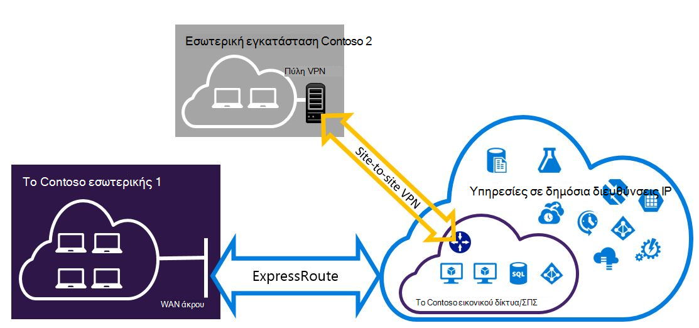

<properties
   pageTitle="Ρύθμιση παραμέτρων συνδέσεων VPN Expressroute και-τοποθεσίας που μπορούν να συνυπάρχουν για το μοντέλο ανάπτυξης διαχείρισης πόρων | Microsoft Azure"
   description="Σε αυτό το άρθρο σάς καθοδηγεί σε ρύθμιση παραμέτρων ExpressRoute και μια σύνδεση VPN-τοποθεσίας που μπορούν να συνυπάρχουν για μοντέλο διαχείρισης πόρων."
   documentationCenter="na"
   services="expressroute"
   authors="charwen"
   manager="carmonm"
   editor=""
   tags="azure-resource-manager"/>
<tags
   ms.service="expressroute"
   ms.devlang="na"
   ms.topic="get-started-article"
   ms.tgt_pltfrm="na"
   ms.workload="infrastructure-services"
   ms.date="10/10/2016"
   ms.author="charleywen"/>

# Ρύθμιση παραμέτρων συνδέσεων συνυπάρχουσες ExpressRoute και τοποθεσίας σε τοποθεσία για το μοντέλο ανάπτυξης για τη διαχείριση πόρων

> [AZURE.SELECTOR]
- [PowerShell - διαχείριση πόρων](expressroute-howto-coexist-resource-manager.md)
- [PowerShell - κλασικό](expressroute-howto-coexist-classic.md)

Έχετε τη δυνατότητα να ρυθμίσετε τις παραμέτρους τοποθεσίας σε τοποθεσία VPN και ExpressRoute έχει αρκετά πλεονεκτήματα. Μπορείτε να ρύθμιση παραμέτρων--τοποθεσίας VPN ως διαδρομή ασφαλούς ανακατεύθυνσης για ExressRoute ή να χρησιμοποιήσετε VPN τοποθεσίας σε τοποθεσία για να συνδεθείτε με τοποθεσίες που δεν είστε συνδεδεμένοι μέσω ExpressRoute. Θα ασχοληθούμε με τα βήματα για να ρυθμίσετε τις παραμέτρους και τα δύο σενάρια σε αυτό το άρθρο. Σε αυτό το άρθρο ισχύει για το μοντέλο ανάπτυξης διαχείρισης πόρων. Αυτή η ρύθμιση παραμέτρων δεν είναι διαθέσιμη στην πύλη του Azure.

**Σχετικά με τα μοντέλα Azure ανάπτυξης**

[AZURE.INCLUDE [vpn-gateway-clasic-rm](../../includes/vpn-gateway-classic-rm-include.md)] 

>[AZURE.IMPORTANT] Κυκλώματα ExpressRoute πρέπει να προ-ρυθμιστεί πριν να ακολουθήσετε τις παρακάτω οδηγίες. Βεβαιωθείτε ότι έχετε ακολουθήσει τους οδηγούς για να [δημιουργήσετε ένα κύκλωμα ExpressRoute](expressroute-howto-circuit-arm.md) και να [ρυθμίσετε τις παραμέτρους δρομολόγησης](expressroute-howto-routing-arm.md) πριν να ακολουθήσετε τα παρακάτω βήματα.

## Όρια και περιορισμοί

- **Δρομολόγηση τη μεταφορά δεν υποστηρίζεται.** Δεν μπορείτε να δρομολογήσετε (μέσω Azure) μεταξύ του τοπικού δικτύου σας συνδέονται μέσω VPN-τοποθεσίας και του τοπικού δικτύου που συνδέονται μέσω ExpressRoute.
- **Βασική SKU πύλης δεν υποστηρίζεται.** Πρέπει να χρησιμοποιήσετε μια πύλη μη - βασικές SKU για την [πύλη ExpressRoute](expressroute-about-virtual-network-gateways.md) και την [πύλη VPN](../vpn-gateway/vpn-gateway-about-vpngateways.md).
- **Υποστηρίζεται μόνο βάσει δρομολόγηση πύλη VPN.** Πρέπει να χρησιμοποιήσετε μια [Πύλη VPN](../vpn-gateway/vpn-gateway-about-vpngateways.md)βάσει δρομολόγηση.
- **Στατική διαδρομή πρέπει να ρυθμιστεί για την πύλη VPN.** Εάν τοπικού δικτύου σας είναι συνδεδεμένη με ExpressRoute και ένα VPN-τοποθεσίας, πρέπει να έχετε μια στατική διαδρομή έχει ρυθμιστεί στο τοπικό σας δίκτυο για να δρομολογήσετε η σύνδεση VPN-τοποθεσίας σε δημόσια στο Internet.
- **Πρώτα, πρέπει να ρυθμιστεί ExpressRoute πύλης.** Πρέπει πρώτα να δημιουργήσετε την πύλη ExpressRoute πριν από την προσθήκη της πύλης VPN-τοποθεσίας.

## Ρύθμιση παραμέτρων σχέδια

### Ρύθμιση παραμέτρων μιας τοποθεσίας σε τοποθεσία VPN ως διαδρομή ανακατεύθυνσης για ExpressRoute

Μπορείτε να ρυθμίσετε μια σύνδεση VPN-τοποθεσίας ως αντίγραφο ασφαλείας για ExpressRoute. Αυτό ισχύει μόνο για εικονικού δίκτυα που συνδέονται με το Azure ιδιωτικό peering path. Δεν υπάρχει λύση βάσει VPN ανακατεύθυνσης για τις υπηρεσίες προσβάσιμα μέσω Azure δημόσια και peerings της Microsoft. Το κύκλωμα ExpressRoute είναι πάντα η κύρια σύνδεση. Θα ροής δεδομένων μέσω της διαδρομής της τοποθεσίας σε τοποθεσία VPN μόνο εάν το κύκλωμα ExpressRoute αποτυγχάνει.
>[AZURE.NOTE] Ενώ ExpressRoute κύκλωμα είναι προτιμώμενο μέσω VPN-τοποθεσίας όταν δύο δρομολογεί είναι τα ίδια, Azure θα χρησιμοποιήσει τη συμφωνία προθέματος longuest για να επιλέξετε τη διαδρομή προς το πακέτο προορισμό.

### Ρύθμιση παραμέτρων ενός VPN τοποθεσίας σε τοποθεσία για να συνδεθείτε με τοποθεσίες που δεν συνδέονται μέσω ExpressRoute

Μπορείτε να ρυθμίσετε το δίκτυό σας όπου ορισμένες τοποθεσίες σύνδεσης απευθείας σε Azure μέσω VPN-τοποθεσίας και συνδέστε ορισμένες τοποθεσίες μέσω του ExpressRoute. 

>[AZURE.NOTE] Δεν μπορείτε να κάνετε μια ρύθμιση εικονικού δικτύου ως δρομολογητής τη μεταφορά.

## Επιλέγοντας τα βήματα για να χρησιμοποιήσετε

Υπάρχουν δύο διαφορετικά σύνολα διαδικασίες για να επιλέξετε για να ρυθμίσετε τις παραμέτρους συνδέσεων που μπορούν να συνυπάρχουν. Η διαδικασία ρύθμισης παραμέτρων που θα επιλέξετε θα εξαρτώνται από εάν έχετε ένα υπάρχον εικονικό δίκτυο που θέλετε να συνδεθείτε ή που θέλετε να δημιουργήσετε ένα νέο εικονικό δίκτυο.

- Που δεν έχουν μια VNet και πρέπει να δημιουργήσετε μία.
    
    Εάν δεν έχετε ήδη ένα εικονικό δίκτυο, αυτή η διαδικασία θα σας καθοδηγήσει τη δημιουργία ενός νέου εικονικού δικτύου χρήση μοντέλο ανάπτυξης διαχείρισης πόρων και τη δημιουργία νέων συνδέσεων VPN ExpressRoute και τοποθεσίας σε τοποθεσία. Για να ρυθμίσετε τις παραμέτρους, ακολουθήστε τα βήματα στην ενότητα το άρθρο [για να δημιουργήσετε ένα νέο εικονικό δίκτυο και συνυπάρχουσες συνδέσεις](#new).

- Έχω ήδη ένα μοντέλο ανάπτυξης για τη διαχείριση πόρων VNet.

    Ενδέχεται να έχετε ήδη ένα εικονικό δίκτυο στη θέση με μια υπάρχουσα σύνδεση VPN-τοποθεσίας ή ExpressRoute σύνδεσης. Στην ενότητα [για τη ρύθμιση παραμέτρων συνδέσεων coexsiting για ένα ήδη υπάρχον VNet](#add) θα καθοδηγήσουμε τη διαγραφή της πύλης και, στη συνέχεια, τη δημιουργία νέων συνδέσεων VPN ExpressRoute και τοποθεσίας σε τοποθεσία. Σημειώστε ότι κατά τη δημιουργία του νέου συνδέσεις, τα βήματα πρέπει να ολοκληρωθεί σε μια πολύ συγκεκριμένη σειρά. Μην χρησιμοποιείτε τις οδηγίες που εμφανίζονται σε άλλα άρθρα για να δημιουργήσετε τις πύλες και τις συνδέσεις.

    Σε αυτήν τη διαδικασία, τη δημιουργία συνδέσεων που μπορούν να συνυπάρχουν θα απαιτούν να διαγράψετε την πύλη, και, στη συνέχεια, ρύθμιση παραμέτρων νέα πυλών. Αυτό σημαίνει ότι θα έχετε χρόνου εκτός λειτουργίας για τις συνδέσεις σας σταυρό εσωτερικής εγκατάστασης ενώ μπορείτε να διαγράψετε και να δημιουργήσετε ξανά την πύλη και τις συνδέσεις, αλλά δεν θα χρειαστεί να μετεγκαταστήσετε οποιαδήποτε ΣΠΣ ή τις υπηρεσίες σε νέο εικονικό δίκτυο. ΣΠΣ και των υπηρεσιών σας θα εξακολουθούν να μπορέσετε να επικοινωνείτε μέσω τη μονάδα εξισορρόπησης φόρτου κατά τη ρύθμιση παραμέτρων της πύλης εάν να έχουν ρυθμιστεί για να το κάνετε.

## Για να δημιουργήσετε ένα νέο εικονικό δίκτυο και συνυπάρχουσες συνδέσεις

Αυτή η διαδικασία θα θα σας καθοδηγήσουν για τη δημιουργία ενός VNet και δημιουργία τοποθεσίας σε τοποθεσία και ExpressRoute συνδέσεις που θα συνυπάρχουν.
    
1. Θα πρέπει να εγκαταστήσετε την πιο πρόσφατη έκδοση του τα cmdlet του Azure PowerShell. Για περισσότερες πληροφορίες σχετικά με την εγκατάσταση τα cmdlet του PowerShell, ανατρέξτε στο θέμα [Πώς να εγκαταστήσετε και να ρυθμίσετε τις παραμέτρους του PowerShell Azure](../powershell-install-configure.md) . Σημειώστε ότι μπορεί να είναι λίγο διαφορετικά από το τι θα μπορεί να είστε εξοικειωμένοι με τα cmdlet που θα χρησιμοποιήσετε αυτήν τη ρύθμιση παραμέτρων. Φροντίστε να χρησιμοποιήσετε τα cmdlet που καθορίζονται σε αυτές τις οδηγίες.

2. Είσοδο με το λογαριασμό σας και ρύθμιση του περιβάλλοντος.
    
        login-AzureRmAccount
        Select-AzureRmSubscription -SubscriptionName 'yoursubscription'
        $location = "Central US"
        $resgrp = New-AzureRmResourceGroup -Name "ErVpnCoex" -Location $location

3. Δημιουργία ενός εικονικού δικτύου, συμπεριλαμβανομένων των υποδικτύου πύλης. Για περισσότερες πληροφορίες σχετικά με τη ρύθμιση παραμέτρων εικονικού δικτύου, ανατρέξτε στο θέμα [Ρύθμιση παραμέτρων Azure εικονικού δικτύου](../virtual-network/virtual-networks-create-vnet-arm-ps.md).

    >[AZURE.IMPORTANT] Το υποδίκτυο πύλης πρέπει να είναι /27 ή μικρότερη πρόθεμα (όπως /26 ή /25).
    
    Δημιουργήστε μια νέα VNet.

        $vnet = New-AzureRmVirtualNetwork -Name "CoexVnet" -ResourceGroupName $resgrp.ResourceGroupName -Location $location -AddressPrefix "10.200.0.0/16" 

    Προσθήκη δευτερεύοντα δίκτυα.

        Add-AzureRmVirtualNetworkSubnetConfig -Name "App" -VirtualNetwork $vnet -AddressPrefix "10.200.1.0/24"
        Add-AzureRmVirtualNetworkSubnetConfig -Name "GatewaySubnet" -VirtualNetwork $vnet -AddressPrefix "10.200.255.0/24"

    Αποθήκευση των παραμέτρων VNet.

        $vnet = Set-AzureRmVirtualNetwork -VirtualNetwork $vnet

4. Δημιουργήστε μια πύλη ExpressRoute. Για περισσότερες πληροφορίες σχετικά με τη ρύθμιση παραμέτρων της πύλης ExpressRoute, ανατρέξτε στο θέμα [Ρύθμιση πύλης ExpressRoute](expressroute-howto-add-gateway-resource-manager.md). Το GatewaySKU πρέπει να είναι *Τυπική*, *HighPerformance*ή *UltraPerformance*.

        $gwSubnet = Get-AzureRmVirtualNetworkSubnetConfig -Name "GatewaySubnet" -VirtualNetwork $vnet
        $gwIP = New-AzureRmPublicIpAddress -Name "ERGatewayIP" -ResourceGroupName $resgrp.ResourceGroupName -Location $location -AllocationMethod Dynamic
        $gwConfig = New-AzureRmVirtualNetworkGatewayIpConfig -Name "ERGatewayIpConfig" -SubnetId $gwSubnet.Id -PublicIpAddressId $gwIP.Id
        $gw = New-AzureRmVirtualNetworkGateway -Name "ERGateway" -ResourceGroupName $resgrp.ResourceGroupName -Location $location -IpConfigurations $gwConfig -GatewayType "ExpressRoute" -GatewaySku Standard 

5. Σύνδεση της πύλης ExpressRoute για να το κύκλωμα ExpressRoute. Αφού ολοκληρωθεί αυτό το βήμα, η σύνδεση μεταξύ το δίκτυο εσωτερικής εγκατάστασης και Azure, μέσω ExpressRoute, είναι εγκατεστημένος. Για περισσότερες πληροφορίες σχετικά με τη λειτουργία σύνδεσης, ανατρέξτε στο θέμα [Σύνδεση VNets να ExpressRoute](expressroute-howto-linkvnet-arm.md).

        $ckt = Get-AzureRmExpressRouteCircuit -Name "YourCircuit" -ResourceGroupName "YourCircuitResourceGroup"
        New-AzureRmVirtualNetworkGatewayConnection -Name "ERConnection" -ResourceGroupName $resgrp.ResourceGroupName -Location $location -VirtualNetworkGateway1 $gw -PeerId $ckt.Id -ConnectionType ExpressRoute

6. Στη συνέχεια, δημιουργήστε την πύλη VPN-τοποθεσίας. Για περισσότερες πληροφορίες σχετικά με τη ρύθμιση παραμέτρων της πύλης VPN, ανατρέξτε στο θέμα [Ρύθμιση παραμέτρων ενός VNet με μια σύνδεση τοποθεσίας σε τοποθεσία](../vpn-gateway/vpn-gateway-create-site-to-site-rm-powershell.md). Το GatewaySKU πρέπει να είναι *Τυπική*, *HighPerformance*ή *UltraPerformance*. Το VpnType πρέπει να *RouteBased*.

        $gwSubnet = Get-AzureRmVirtualNetworkSubnetConfig -Name "GatewaySubnet" -VirtualNetwork $vnet
        $gwIP = New-AzureRmPublicIpAddress -Name "VPNGatewayIP" -ResourceGroupName $resgrp.ResourceGroupName -Location $location -AllocationMethod Dynamic
        $gwConfig = New-AzureRmVirtualNetworkGatewayIpConfig -Name "VPNGatewayIpConfig" -SubnetId $gwSubnet.Id -PublicIpAddressId $gwIP.Id
        New-AzureRmVirtualNetworkGateway -Name "VPNGateway" -ResourceGroupName $resgrp.ResourceGroupName -Location $location -IpConfigurations $gwConfig -GatewayType "Vpn" -VpnType "RouteBased" -GatewaySku "Standard"

    Azure πύλης VPN υποστηρίζει το πρωτόκολλο BGP. Μπορείτε να καθορίσετε - EnableBgp στο την ακόλουθη εντολή.

        $azureVpn = New-AzureRmVirtualNetworkGateway -Name "VPNGateway" -ResourceGroupName $resgrp.ResourceGroupName -Location $location -IpConfigurations $gwConfig -GatewayType "Vpn" -VpnType "RouteBased" -GatewaySku "Standard" -EnableBgp $true

    Μπορείτε να βρείτε το πρωτόκολλο BGP διεισδύουν IP και ο αριθμός AS που χρησιμοποιεί το Azure για την πύλη VPN στο $azureVpn.BgpSettings.BgpPeeringAddress και $azureVpn.BgpSettings.Asn. Για περισσότερες πληροφορίες, ανατρέξτε στο θέμα [Ρύθμιση παραμέτρων πρωτόκολλο BGP](../vpn-gateway/vpn-gateway-bgp-resource-manager-ps.md) πύλης Azure VPN.

7. Δημιουργία μιας τοπικής τοποθεσίας οντότητα πύλης VPN. Αυτή η εντολή δεν ρύθμιση παραμέτρων της πύλης VPN εσωτερικής εγκατάστασης. Προτιμάτε, σάς επιτρέπει να παρέχετε τις ρυθμίσεις της τοπικής πύλης, όπως το δημόσιο IP και την εσωτερική διευθύνσεων χώρο, ώστε να μπορούν να συνδεθούν στην πύλη Azure VPN σε αυτό.

    Εάν η συσκευή σας τοπικό VPN υποστηρίζει μόνο στατική δρομολόγηση, μπορείτε να ρυθμίσετε το στατικές διαδρομές με τον εξής τρόπο.

        $MyLocalNetworkAddress = @("10.100.0.0/16","10.101.0.0/16","10.102.0.0/16")
        $localVpn = New-AzureRmLocalNetworkGateway -Name "LocalVPNGateway" -ResourceGroupName $resgrp.ResourceGroupName -Location $location -GatewayIpAddress *<Public IP>* -AddressPrefix $MyLocalNetworkAddress

    Εάν η συσκευή σας τοπικό VPN υποστηρίζει το πρωτόκολλο BGP και που θέλετε να ενεργοποιήσετε δυναμική δρομολόγηση, πρέπει να γνωρίζετε το πρωτόκολλο BGP διεισδύουν IP και τον αριθμό AS που χρησιμοποιεί την τοπική συσκευή VPN.

        $localVPNPublicIP = "<Public IP>"
        $localBGPPeeringIP = "<Private IP for the BGP session>"
        $localBGPASN = "<ASN>"
        $localAddressPrefix = $localBGPPeeringIP + "/32"
        $localVpn = New-AzureRmLocalNetworkGateway -Name "LocalVPNGateway" -ResourceGroupName $resgrp.ResourceGroupName -Location $location -GatewayIpAddress $localVPNPublicIP -AddressPrefix $localAddressPrefix -BgpPeeringAddress $localBGPPeeringIP -Asn $localBGPASN

8. Ρύθμιση παραμέτρων σας τοπική συσκευή VPN για να συνδεθείτε με τη νέα πύλη Azure VPN. Για περισσότερες πληροφορίες σχετικά με τις παραμέτρους της συσκευής VPN, ανατρέξτε στο θέμα [Ρύθμιση παραμέτρων συσκευή VPN](../vpn-gateway/vpn-gateway-about-vpn-devices.md).

9. Σύνδεση VPN-τοποθεσίας πύλης σε Azure στην τοπική πύλη.

        $azureVpn = Get-AzureRmVirtualNetworkGateway -Name "VPNGateway" -ResourceGroupName $resgrp.ResourceGroupName
        New-AzureRmVirtualNetworkGatewayConnection -Name "VPNConnection" -ResourceGroupName $resgrp.ResourceGroupName -Location $location -VirtualNetworkGateway1 $azureVpn -LocalNetworkGateway2 $localVpn -ConnectionType IPsec -SharedKey <yourkey>

## Για να ρυθμίσετε τις παραμέτρους coexsiting συνδέσεων για ένα ήδη υπάρχον VNet

Εάν έχετε ένα υπάρχον εικονικό δίκτυο, ελέγξτε το μέγεθος υποδικτύου πύλης. Εάν η πύλη είναι /28 ή /29, πρέπει να πρώτα να διαγράψετε την πύλη εικονικού δικτύου και να αύξηση του μεγέθους υποδικτύου πύλης. Τα βήματα σε αυτήν την ενότητα θα σας δείξει πώς να το κάνετε.

Εάν η πύλη είναι /27 ή μεγαλύτερο και το εικονικό δίκτυο είναι συνδεδεμένο μέσω ExpressRoute, μπορείτε να παραλείψετε τα παρακάτω βήματα και να συνεχίσετε να ["Βήμα 6 - Δημιουργία μιας πύλης VPN-τοποθεσίας"](#vpngw) στην προηγούμενη ενότητα. 

>[AZURE.NOTE] Όταν διαγράφετε την υπάρχουσα πύλη, το τοπικό εσωτερικής εγκατάστασης θα χάσετε τη σύνδεση με το δίκτυό σας εικονικού ενώ εργάζεστε σε αυτήν τη ρύθμιση παραμέτρων. 

1. Θα πρέπει να εγκαταστήσετε την πιο πρόσφατη έκδοση του τα cmdlet του Azure PowerShell. Για περισσότερες πληροφορίες σχετικά με την εγκατάσταση τα cmdlet του PowerShell, ανατρέξτε στο θέμα [Πώς να εγκαταστήσετε και να ρυθμίσετε τις παραμέτρους του PowerShell Azure](../powershell-install-configure.md) . Σημειώστε ότι μπορεί να είναι λίγο διαφορετικά από το τι θα μπορεί να είστε εξοικειωμένοι με τα cmdlet που θα χρησιμοποιήσετε αυτήν τη ρύθμιση παραμέτρων. Φροντίστε να χρησιμοποιήσετε τα cmdlet που καθορίζονται σε αυτές τις οδηγίες. 

2. Διαγραφή της υπάρχουσας τοποθεσίας σε τοποθεσία VPN ή ExpressRoute πύλης. 

        Remove-AzureRmVirtualNetworkGateway -Name <yourgatewayname> -ResourceGroupName <yourresourcegroup>

3. Διαγραφή υποδικτύου πύλης.
        
        $vnet = Get-AzureRmVirtualNetwork -Name <yourvnetname> -ResourceGroupName <yourresourcegroup> 
        Remove-AzureRmVirtualNetworkSubnetConfig -Name GatewaySubnet -VirtualNetwork $vnet

4. Προσθέστε ένα υποδίκτυο πύλη που είναι /27 ή μεγαλύτερο.
    >[AZURE.NOTE] Εάν δεν διαθέτετε αρκετές διευθύνσεις IP προς τα αριστερά στην εικονικού δικτύου σας για να αυξήσετε το μέγεθος της πύλης υποδίκτυο, πρέπει να προσθέσετε περισσότερο χώρο διευθύνσεων IP.

        $vnet = Get-AzureRmVirtualNetwork -Name <yourvnetname> -ResourceGroupName <yourresourcegroup>
        Add-AzureRmVirtualNetworkSubnetConfig -Name "GatewaySubnet" -VirtualNetwork $vnet -AddressPrefix "10.200.255.0/24"

    Αποθήκευση των παραμέτρων VNet.

        $vnet = Set-AzureRmVirtualNetwork -VirtualNetwork $vnet

5. Σε αυτό το σημείο, θα έχετε μια VNet με χωρίς πυλών. Για να δημιουργήσετε νέα πύλες και ολοκληρώστε τις συνδέσεις σας, μπορείτε να συνεχίσετε με το [βήμα 4 - Δημιουργία μιας πύλης ExpressRoute](#gw), βρίσκονται στο προηγούμενο σύνολο βημάτων.

## Για να προσθέσετε ρύθμισης παραμέτρων σημείου σε τοποθεσία για την πύλη VPN
Μπορείτε να ακολουθήσετε τα παρακάτω βήματα για να προσθέσετε ρύθμισης παραμέτρων σημείου σε τοποθεσία για την πύλη VPN σε μια ρύθμιση ύπαρξη από κοινού.

1. Προσθήκη χώρου συγκέντρωσης διεύθυνση υπολογιστή-πελάτη VPN. 

        $azureVpn = Get-AzureRmVirtualNetworkGateway -Name "VPNGateway" -ResourceGroupName $resgrp.ResourceGroupName
        Set-AzureRmVirtualNetworkGatewayVpnClientConfig -VirtualNetworkGateway $azureVpn -VpnClientAddressPool "10.251.251.0/24"

2. Αποστείλετε το πιστοποιητικό ρίζας VPN Azure για την πύλη VPN. Σε αυτό το παράδειγμα, θεωρείται ότι το πιστοποιητικό ρίζας είναι αποθηκευμένο στον τοπικό υπολογιστή όπου εκτελούνται τα παρακάτω cmdlet του PowerShell. 

        $p2sCertFullName = "RootErVpnCoexP2S.cer"
        $p2sCertMatchName = "RootErVpnCoexP2S"
        $p2sCertToUpload=get-childitem Cert:\CurrentUser\My | Where-Object {$_.Subject -match $p2sCertMatchName}
        if ($p2sCertToUpload.count -eq 1){
            write-host "cert found"
        } else {
            write-host "cert not found"
            exit
        } 
        $p2sCertData = [System.Convert]::ToBase64String($p2sCertToUpload.RawData)
        Add-AzureRmVpnClientRootCertificate -VpnClientRootCertificateName $p2sCertFullName -VirtualNetworkGatewayname $azureVpn.Name -ResourceGroupName $resgrp.ResourceGroupName -PublicCertData $p2sCertData

Για περισσότερες πληροφορίες σχετικά με το σημείο σε τοποθεσία VPN, ανατρέξτε στο θέμα [Ρύθμιση παραμέτρων σύνδεσης σημείου σε τοποθεσία](../vpn-gateway/vpn-gateway-howto-point-to-site-rm-ps.md).

## Επόμενα βήματα

Για περισσότερες πληροφορίες σχετικά με το ExpressRoute, ανατρέξτε στο θέμα [Συνήθεις Ερωτήσεις ExpressRoute](expressroute-faqs.md).
