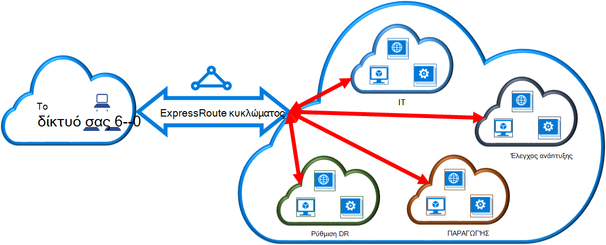

<properties
   pageTitle="Σύνδεση σε δίκτυο εικονικού με ένα κύκλωμα ExpressRoute χρησιμοποιώντας το μοντέλο κλασική ανάπτυξης και PowerShell | Microsoft Azure"
   description="Αυτό το έγγραφο παρέχει μια επισκόπηση των τη σύνδεση εικονικού δίκτυα (VNets) για να ExpressRoute κυκλώματα χρησιμοποιώντας το μοντέλο κλασική ανάπτυξης και PowerShell."
   services="expressroute"
   documentationCenter="na"
   authors="ganesr"
   manager="carmonm"
   editor=""
   tags="azure-service-management"/>
<tags
   ms.service="expressroute"
   ms.devlang="na"
   ms.topic="article"
   ms.tgt_pltfrm="na"
   ms.workload="infrastructure-services"
   ms.date="10/10/2016"
   ms.author="ganesr" />

# Σύνδεση σε δίκτυο εικονικού με ένα κύκλωμα ExpressRoute

> [AZURE.SELECTOR]
- [Azure πύλης - διαχείριση πόρων](expressroute-howto-linkvnet-portal-resource-manager.md)
- [PowerShell - διαχείριση πόρων](expressroute-howto-linkvnet-arm.md)
- [PowerShell - κλασικό](expressroute-howto-linkvnet-classic.md)

Σε αυτό το άρθρο θα σας βοηθήσει να συνδέσετε εικονικών δικτύων (VNets) κυκλώματα Azure ExpressRoute, χρησιμοποιώντας το μοντέλο κλασική ανάπτυξης και PowerShell. Εικονικό δίκτυα μπορεί να είναι στην ίδια συνδρομή ή μπορεί να είναι μέρος μια άλλη συνδρομή.

**Σχετικά με τα μοντέλα Azure ανάπτυξης**

[AZURE.INCLUDE [vpn-gateway-clasic-rm](../../includes/vpn-gateway-classic-rm-include.md)]

## Προαπαιτούμενα στοιχεία ρύθμισης παραμέτρων

1. Χρειάζεστε την πιο πρόσφατη έκδοση του PowerShell Azure λειτουργικές μονάδες. Μπορείτε να λάβετε την πιο πρόσφατη λειτουργικές μονάδες PowerShell από την ενότητα PowerShell από τη [σελίδα λήψεων του Azure](https://azure.microsoft.com/downloads/). Ακολουθήστε τις οδηγίες στο [πώς μπορείτε να εγκαταστήσετε και να ρυθμίσετε τις παραμέτρους του PowerShell Azure](../powershell-install-configure.md) για αναλυτικές οδηγίες σχετικά με τον τρόπο για να ρυθμίσετε τον υπολογιστή σας για να χρησιμοποιήσετε τις λειτουργικές μονάδες Azure PowerShell.
2. Πρέπει να εξετάσετε το [προαπαιτούμενα στοιχεία για τις](expressroute-prerequisites.md) [απαιτήσεις δρομολόγηση](expressroute-routing.md)και [ροές εργασίας](expressroute-workflows.md) πριν να ξεκινήσετε τη ρύθμιση των παραμέτρων.
3. Πρέπει να έχετε ένα ενεργό κύκλωμα ExpressRoute.
    - Ακολουθήστε τις οδηγίες για να [δημιουργήσετε ένα κύκλωμα ExpressRoute](expressroute-howto-circuit-classic.md) και έχετε ενεργοποιήσετε το κύκλωμα υπηρεσία παροχής σύνδεσης.
    - Βεβαιωθείτε ότι έχετε Azure ιδιωτικό διεισδύουν έχει ρυθμιστεί για το κύκλωμα. Ανατρέξτε στο άρθρο [Ρύθμιση παραμέτρων δρομολόγησης](expressroute-howto-routing-classic.md) για δρομολόγηση οδηγίες.
    - Βεβαιωθείτε ότι Azure ιδιωτικό διεισδύουν έχει ρυθμιστεί και το πρωτόκολλο BGP διεισδύουν μεταξύ του δικτύου και της Microsoft είναι προς τα επάνω, ώστε να έχετε τη δυνατότητα να ολοκληρωμένες συνδεσιμότητας.
    - Πρέπει να έχετε ένα εικονικό δίκτυο και μια πύλη εικονικού δικτύου δημιουργούνται και πλήρως παροχή της υπηρεσίας. Ακολουθήστε τις οδηγίες για να [ρυθμίσετε τις παραμέτρους ενός εικονικού δικτύου για ExpressRoute](expressroute-howto-vnet-portal-classic.md).

Μπορείτε να συνδέσετε έως και 10 εικονικών δικτύων σε ένα κύκλωμα ExpressRoute. Όλα τα δίκτυα εικονικού πρέπει να είναι στην ίδια περιοχή γεωπολιτική. Μπορείτε να συνδέσετε ένα μεγαλύτερο αριθμό εικονικών δικτύων σας κύκλωμα ExpressRoute ή σύνδεσης εικονικού δίκτυα που βρίσκονται σε άλλες περιοχές γεωπολιτική εάν έχετε ενεργοποιήσει το πρόσθετο premium ExpressRoute. Ανατρέξτε [στις συνήθεις Ερωτήσεις](expressroute-faqs.md) για περισσότερες λεπτομέρειες σχετικά με το πρόσθετο premium.

## Σύνδεση ενός εικονικού δικτύου στην ίδια συνδρομή σε ένα κύκλωμα

Μπορείτε να συνδέσετε ένα εικονικό δίκτυο με ένα κύκλωμα ExpressRoute χρησιμοποιώντας το ακόλουθο cmdlet. Βεβαιωθείτε ότι η πύλη εικονικού δικτύου δημιουργείται και είστε έτοιμοι για σύνδεση πριν να εκτελέσετε το cmdlet.

    New-AzureDedicatedCircuitLink -ServiceKey "*****************************" -VNetName "MyVNet"
    Provisioned

## Σύνδεση ενός εικονικού δικτύου σε μια διαφορετική συνδρομή σε ένα κύκλωμα

Μπορείτε να μοιραστείτε ένα κύκλωμα ExpressRoute σε πολλές συνδρομές. Η παρακάτω εικόνα εμφανίζει μια απλή σχηματική της λειτουργίας πως κοινής χρήσης για κυκλώματα ExpressRoute σε πολλές συνδρομές.

Κάθε μία από το μικρότερο σύννεφων μέσα στο μεγάλο cloud χρησιμοποιείται για την αναπαράσταση συνδρομές που ανήκουν σε διαφορετικά τμήματα ενός οργανισμού. Κάθε ένα από τα τμήματα της εταιρείας να χρησιμοποιήσετε τις δικές τους συνδρομή για την ανάπτυξη των υπηρεσιών--, αλλά οι υπηρεσίες να κάνετε κοινή χρήση ένα μεμονωμένο κύκλωμα ExpressRoute για να συνδεθείτε ξανά με το δίκτυο εσωτερικής εγκατάστασης. Ένα τμήμα (σε αυτό το παράδειγμα: IT) μπορούν να είναι κάτοχοι το κύκλωμα ExpressRoute. Άλλες συνδρομές εντός της εταιρείας να χρησιμοποιήσετε το κύκλωμα ExpressRoute.

>[AZURE.NOTE] Συνδεσιμότητα και το εύρος ζώνης χρεώσεων για το αποκλειστικό κύκλωμα θα εφαρμοστεί στον κάτοχο του κυκλώματος ExpressRoute. Όλα τα δίκτυα εικονικού μοιραστείτε το ίδιο εύρος ζώνης.

### Διαχείριση

Ο *κάτοχος κυκλώματος* είναι διαχειριστής/coadministrator από τη συνδρομή στην οποία δημιουργείται το κύκλωμα ExpressRoute. Ο κάτοχος κυκλώματος να εξουσιοδοτήσετε διαχειριστές/coadministrators από άλλες συνδρομές, γνωστή ως *χρήστες κυκλώματος*, για να χρησιμοποιήσετε το αποκλειστικό κύκλωμα που ανήκουν σε αυτές. Κύκλωμα τους χρήστες που είναι εξουσιοδοτημένοι να χρησιμοποιήσετε κυκλώματος ExpressRoute της εταιρείας να συνδέσετε το εικονικό δίκτυο στο της συνδρομής με το κύκλωμα ExpressRoute αφού αυτές είναι εξουσιοδοτημένοι.

Ο κάτοχος κυκλώματος έχει τη δυνατότητα να τροποποιήσετε και ανάκληση αδειών οποιαδήποτε στιγμή. Ανάκληση άδειας θα οδηγήσει σε όλες τις συνδέσεις που έχουν διαγραφεί από τη συνδρομή στην πρόσβαση των οποίων έχει ανακληθεί.

### Λειτουργίες κάτοχο κυκλώματος

#### Δημιουργία άδειας

Ο κάτοχος κυκλώματος επιτρέπει οι διαχειριστές άλλες συνδρομές για να χρησιμοποιήσετε το καθορισμένο κύκλωμα. Στο παρακάτω παράδειγμα, ο διαχειριστής του κυκλώματος (Contoso IT) επιτρέπει στο διαχειριστή από μια άλλη συνδρομή (αποκλίσεις έλεγχος) για να συνδέσετε δύο εικονικών δικτύων με το κύκλωμα. Ο διαχειριστής Contoso IT σας δίνει τη δυνατότητα αυτή, καθορίζοντας το αναγνωριστικό Microsoft αποκλίσεις έλεγχος. Το cmdlet δεν αποστολή μηνύματος ηλεκτρονικού ταχυδρομείου για το καθορισμένο αναγνωριστικό Microsoft. Ο κάτοχος κυκλώματος πρέπει να ρητά να ειδοποιήσετε άλλα κάτοχος της συνδρομής που έχει ολοκληρωθεί η άδεια.

    New-AzureDedicatedCircuitLinkAuthorization -ServiceKey "**************************" -Description "Dev-Test Links" -Limit 2 -MicrosoftIds 'devtest@contoso.com'

    Description         : Dev-Test Links
    Limit               : 2
    LinkAuthorizationId : **********************************
    MicrosoftIds        : devtest@contoso.com
    Used                : 0

#### Εξέταση των εγκρίσεων

Ο κάτοχος κυκλώματος να αναθεωρήσετε όλες τις άδειες που εκδίδονται σε συγκεκριμένο κύκλωμα, εκτελώντας το ακόλουθο cmdlet:

    Get-AzureDedicatedCircuitLinkAuthorization -ServiceKey: "**************************"

    Description         : EngineeringTeam
    Limit               : 3
    LinkAuthorizationId : ####################################
    MicrosoftIds        : engadmin@contoso.com
    Used                : 1

    Description         : MarketingTeam
    Limit               : 1
    LinkAuthorizationId : @@@@@@@@@@@@@@@@@@@@@@@@@@@@@@@@@@@@
    MicrosoftIds        : marketingadmin@contoso.com
    Used                : 0

    Description         : Dev-Test Links
    Limit               : 2
    LinkAuthorizationId : &&&&&&&&&&&&&&&&&&&&&&&&&&&&&&&&&&&&
    MicrosoftIds        : salesadmin@contoso.com
    Used                : 2

#### Ενημέρωση αδειών

Ο κάτοχος κυκλώματος να τροποποιήσετε άδειες, χρησιμοποιώντας το ακόλουθο cmdlet:

    Set-AzureDedicatedCircuitLinkAuthorization -ServiceKey "**************************" -AuthorizationId "&&&&&&&&&&&&&&&&&&&&&&&&&&&&"-Limit 5

    Description         : Dev-Test Links
    Limit               : 5
    LinkAuthorizationId : &&&&&&&&&&&&&&&&&&&&&&&&&&&&&&&&&&&&&&
    MicrosoftIds        : devtest@contoso.com
    Used                : 0

#### Διαγραφή αδειών

Ο κάτοχος κυκλώματος να revoke/διαγραφή αδειών στο χρήστη, εκτελώντας το ακόλουθο cmdlet:

    Remove-AzureDedicatedCircuitLinkAuthorization -ServiceKey "*****************************" -AuthorizationId "###############################"

### Κύκλωμα χρήστη λειτουργιών

#### Εξέταση των εγκρίσεων

Ο χρήστης κυκλώματος να αναθεωρήσετε άδειες, χρησιμοποιώντας το ακόλουθο cmdlet:

    Get-AzureAuthorizedDedicatedCircuit

    Bandwidth                        : 200
    CircuitName                      : ContosoIT
    Location                         : Washington DC
    MaximumAllowedLinks              : 2
    ServiceKey                       : &&&&&&&&&&&&&&&&&&&&&&&&&&&&&&&&&&&&
    ServiceProviderName              : equinix
    ServiceProviderProvisioningState : Provisioned
    Status                           : Enabled
    UsedLinks                        : 0

#### Εξαργύρωση άδειες σύνδεσης

Ο χρήστης κυκλώματος να εκτελέσετε το ακόλουθο cmdlet για την εξαγορά αδείας σύνδεση:

    New-AzureDedicatedCircuitLink –servicekey "&&&&&&&&&&&&&&&&&&&&&&&&&&" –VnetName 'SalesVNET1'

    State VnetName
    ----- --------
    Provisioned SalesVNET1

## Επόμενα βήματα

Για περισσότερες πληροφορίες σχετικά με το ExpressRoute, ανατρέξτε στο θέμα [Συνήθεις Ερωτήσεις ExpressRoute](expressroute-faqs.md).
