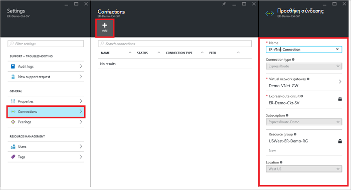
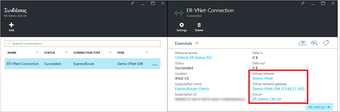

<properties
   pageTitle="Σύνδεση σε δίκτυο εικονικού με ένα κύκλωμα ExpressRoute, χρησιμοποιώντας το μοντέλο ανάπτυξης διαχείρισης πόρων και την πύλη του Azure | Microsoft Azure"
   description="Αυτό το έγγραφο παρέχει μια επισκόπηση του τρόπου να δημιουργήσετε τη σύνδεση εικονικού δίκτυα (VNets) ExpressRoute κυκλώματα."
   services="expressroute"
   documentationCenter="na"
   authors="cherylmc"
   manager="carmonm"
   editor=""
   tags="azure-resource-manager"/>
<tags
   ms.service="expressroute"
   ms.devlang="na"
   ms.topic="article"
   ms.tgt_pltfrm="na"
   ms.workload="infrastructure-services"
   ms.date="10/10/2016"
   ms.author="cherylmc" />

# Σύνδεση σε δίκτυο εικονικού με ένα κύκλωμα ExpressRoute

> [AZURE.SELECTOR]
- [Azure πύλης - διαχείριση πόρων](expressroute-howto-linkvnet-portal-resource-manager.md)
- [PowerShell - διαχείριση πόρων](expressroute-howto-linkvnet-arm.md)
- [PowerShell - κλασικό](expressroute-howto-linkvnet-classic.md)

Σε αυτό το άρθρο θα σας βοηθήσει να συνδέσετε εικονικών δικτύων (VNets) κυκλώματα Azure ExpressRoute, χρησιμοποιώντας το μοντέλο ανάπτυξης διαχείρισης πόρων και την πύλη του Azure. Εικονικό δίκτυα μπορεί να είναι στην ίδια συνδρομή ή μπορούν να ανήκουν σε μια άλλη συνδρομής.

**Σχετικά με τα μοντέλα Azure ανάπτυξης**

[AZURE.INCLUDE [vpn-gateway-clasic-rm](../../includes/vpn-gateway-classic-rm-include.md)]

## Προαπαιτούμενα στοιχεία ρύθμισης παραμέτρων

- Βεβαιωθείτε ότι ελέγξετε τα [προαπαιτούμενα στοιχεία για τις](expressroute-prerequisites.md) [απαιτήσεις για τη δρομολόγηση](expressroute-routing.md)και [ροές εργασίας](expressroute-workflows.md) πριν να ξεκινήσετε τη ρύθμιση των παραμέτρων.
- Πρέπει να έχετε ένα ενεργό κύκλωμα ExpressRoute.
    - Ακολουθήστε τις οδηγίες για να [δημιουργήσετε ένα κύκλωμα ExpressRoute](expressroute-howto-circuit-arm.md) και έχετε το κύκλωμα ενεργοποιημένη από την υπηρεσία παροχής σύνδεσης.

    - Βεβαιωθείτε ότι έχετε Azure ιδιωτικό διεισδύουν έχει ρυθμιστεί για το κύκλωμα. Ανατρέξτε στο άρθρο [Ρύθμιση παραμέτρων δρομολόγησης](expressroute-howto-routing-portal-resource-manager.md) για δρομολόγηση οδηγίες.

    - Βεβαιωθείτε ότι Azure ιδιωτικό διεισδύουν έχει ρυθμιστεί και το πρωτόκολλο BGP διεισδύουν μεταξύ του δικτύου και της Microsoft είναι προς τα επάνω, ώστε να έχετε τη δυνατότητα να ολοκληρωμένες συνδεσιμότητας.

    - Βεβαιωθείτε ότι έχετε ένα εικονικό δίκτυο και μια πύλη εικονικού δικτύου δημιουργούνται και πλήρως παροχή της υπηρεσίας. Ακολουθήστε τις οδηγίες για τη δημιουργία μιας [πύλης VPN](../articles/vpn-gateway/vpn-gateway-howto-site-to-site-resource-manager-portal.md) (ακολουθούν μόνο τα βήματα 1-5).

Μπορείτε να συνδέσετε έως και 10 εικονικών δικτύων σε ένα τυπικό κύκλωμα ExpressRoute. Όλα τα δίκτυα εικονικού πρέπει να είναι στην ίδια περιοχή γεωπολιτική όταν χρησιμοποιείτε ένα τυπικό κύκλωμα ExpressRoute. Μπορείτε να συνδέσετε μια εικονική δίκτυα εκτός της περιοχής γεωπολιτική του κυκλώματος ExpressRoute ή να συνδεθείτε μεγαλύτερο αριθμό εικονικών δικτύων σας κυκλώματος ExpressRoute εάν έχετε ενεργοποιήσει το πρόσθετο premium ExpressRoute. Ανατρέξτε [στις συνήθεις Ερωτήσεις](expressroute-faqs.md) για περισσότερες λεπτομέρειες σχετικά με το πρόσθετο premium.

## Σύνδεση ενός εικονικού δικτύου στην ίδια συνδρομή σε ένα κύκλωμα

### Για να δημιουργήσετε μια σύνδεση

1. Βεβαιωθείτε ότι το ExpressRoute κυκλώματος και Azure ιδιωτικό διεισδύουν έχουν ρυθμιστεί με επιτυχία. Ακολουθήστε τις οδηγίες στο θέμα [Δημιουργία μιας κυκλώματος ExpressRoute](expressroute-howto-circuit-arm.md) και [Ρύθμιση παραμέτρων δρομολόγησης](expressroute-howto-routing-arm.md). Το κύκλωμα ExpressRoute πρέπει να μοιάζει η παρακάτω εικόνα.

    

    >[AZURE.NOTE] Πληροφορίες για τις παραμέτρους το πρωτόκολλο BGP δεν θα εμφανιστούν εάν η υπηρεσία παροχής επιπέδου 3 ρυθμιστεί peerings σας. Εάν το κύκλωμα είναι σε κατάσταση προμήθεια του φακέλου, θα πρέπει να μπορούν να δημιουργούν συνδέσεις.

2. Τώρα, μπορείτε να ξεκινήσετε την προμήθεια μιας σύνδεσης για να συνδέσετε την πύλη εικονικού δικτύου για το κύκλωμα ExpressRoute. Κάντε κλικ στην επιλογή **σύνδεση** > **Προσθήκη** να ανοίξετε το blade **Προσθήκη σύνδεσης** και, στη συνέχεια, ρυθμίστε τις τιμές. Δείτε το παρακάτω παράδειγμα αναφοράς.

      

3. Μετά τη σύνδεσή σας έχει ρυθμιστεί με επιτυχία, το αντικείμενο σύνδεσης θα εμφανίζονται οι πληροφορίες για τη σύνδεση.

    

### Για να διαγράψετε μια σύνδεση

Μπορείτε να διαγράψετε μια σύνδεση, κάνοντας κλικ στο εικονίδιο **Διαγραφή** στην το blade για τη σύνδεσή σας.

## Σύνδεση ενός εικονικού δικτύου σε μια διαφορετική συνδρομή σε ένα κύκλωμα

Προς το παρόν, δεν μπορείτε να συνδεθείτε εικονικών δικτύων στις συνδρομές χρησιμοποιώντας την πύλη του Azure. Ωστόσο, μπορείτε να χρησιμοποιήσετε PowerShell για να το κάνετε αυτό. Ανατρέξτε στο άρθρο [του PowerShell](expressroute-howto-linkvnet-arm.md) για περισσότερες πληροφορίες.

## Επόμενα βήματα

Για περισσότερες πληροφορίες σχετικά με το ExpressRoute, ανατρέξτε στο θέμα [Συνήθεις Ερωτήσεις ExpressRoute](expressroute-faqs.md).
