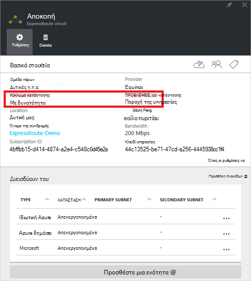
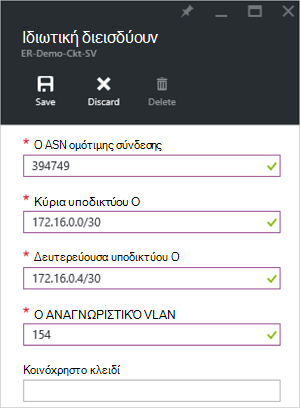
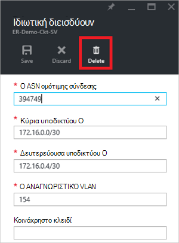
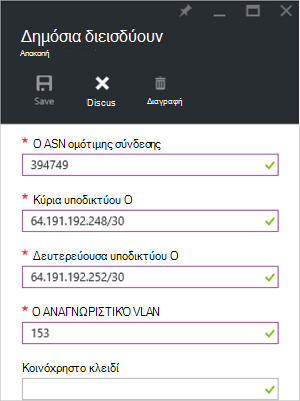
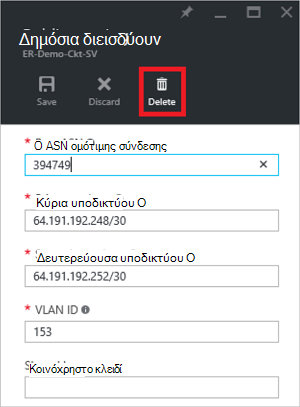
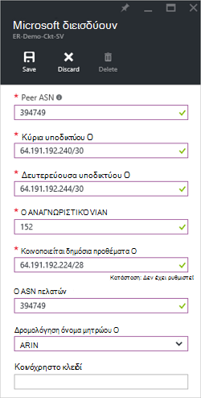
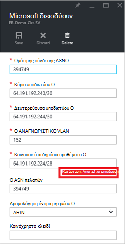
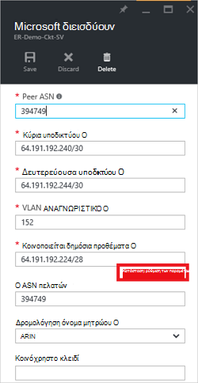
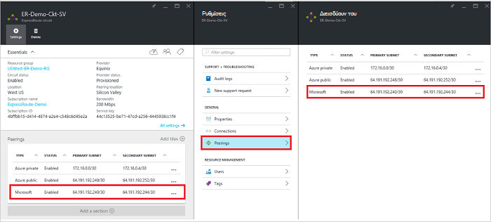
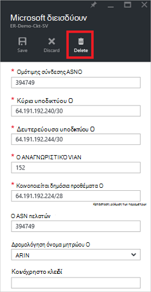

<properties
   pageTitle="Πώς μπορείτε να ρυθμίσετε τις παραμέτρους δρομολόγησης για ένα κύκλωμα ExpressRoute με την πύλη Azure | Microsoft Azure"
   description="Σε αυτό το άρθρο σάς καθοδηγεί στα βήματα για τη δημιουργία και την προμήθεια στο ιδιωτικό, δημόσιο και Microsoft διεισδύουν από ένα κύκλωμα ExpressRoute. Σε αυτό το άρθρο σας δείχνει επίσης πώς μπορείτε να ελέγξετε την κατάσταση, ενημέρωση ή διαγραφή peerings για το κύκλωμα."
   documentationCenter="na"
   services="expressroute"
   authors="cherylmc"
   manager="carmonm"
   editor=""
   tags="azure-resource-manager"/>
<tags
   ms.service="expressroute"
   ms.devlang="na"
   ms.topic="hero-article" 
   ms.tgt_pltfrm="na"
   ms.workload="infrastructure-services"
   ms.date="10/10/2016"
   ms.author="cherylmc"/>

# Δημιουργία και τροποποίηση δρομολόγησης για ένα κύκλωμα ExpressRoute

> [AZURE.SELECTOR]
[Azure πύλης - διαχείριση πόρων](expressroute-howto-routing-portal-resource-manager.md)
[PowerShell - διαχείριση πόρων](expressroute-howto-routing-arm.md)
[PowerShell - κλασικό](expressroute-howto-routing-classic.md)

Σε αυτό το άρθρο σάς καθοδηγεί σε τα βήματα για να δημιουργήσετε και να διαχειριστείτε τις παραμέτρους δρομολόγησης για ένα κύκλωμα ExpressRoute χρησιμοποιώντας την πύλη του Azure και το μοντέλο ανάπτυξης διαχείρισης πόρων.

**Σχετικά με τα μοντέλα Azure ανάπτυξης**

[AZURE.INCLUDE [vpn-gateway-clasic-rm](../../includes/vpn-gateway-classic-rm-include.md)] 

## Προαπαιτούμενα στοιχεία ρύθμισης παραμέτρων

- Βεβαιωθείτε ότι ελέγξετε στη σελίδα [τις προϋποθέσεις](expressroute-prerequisites.md) , τη σελίδα [δρομολόγηση απαιτήσεις](expressroute-routing.md) και τη σελίδα [ροές εργασίας](expressroute-workflows.md) πριν να ξεκινήσετε τη ρύθμιση των παραμέτρων.
- Πρέπει να έχετε ένα ενεργό κύκλωμα ExpressRoute. Ακολουθήστε τις οδηγίες στο θέμα [Δημιουργία μιας κυκλώματος ExpressRoute](expressroute-howto-circuit-arm.md) και έχετε το κύκλωμα ενεργοποιημένη από την υπηρεσία παροχής συνδεσιμότητας πριν να συνεχίσετε. Το κύκλωμα ExpressRoute πρέπει να είναι σε κατάσταση προμήθεια του φακέλου και να έχει ενεργοποιηθεί για να μπορέσετε να εκτελέσετε τα cmdlet που περιγράφεται παρακάτω.

Αυτές οι οδηγίες ισχύουν μόνο για κυκλώματα που δημιουργήθηκε με την υπηρεσία παροχής σας δίνει τη δυνατότητα υπηρεσιών συνδεσιμότητας επιπέδου 2. Εάν χρησιμοποιείτε μια υπηρεσία παροχής που παρέχουν υπηρεσίες διαχειριζόμενων Layer 3 (συνήθως ένα IPVPN, όπως MPLS), την υπηρεσία παροχής σύνδεσης θα ρύθμιση παραμέτρων και Διαχείριση δρομολόγησης για εσάς. 

>[AZURE.IMPORTANT] Θα σας αυτήν τη στιγμή δεν κοινοποίηση peerings έχει ρυθμιστεί από υπηρεσίες παροχής μέσω της πύλης διαχείρισης υπηρεσίας. Εργαζόμαστε για την ενεργοποίηση σύντομα αυτήν τη δυνατότητα. Επικοινωνήστε με την υπηρεσία παροχής πριν από τη ρύθμιση των παραμέτρων peerings το πρωτόκολλο BGP.

Μπορείτε να ρυθμίσετε μία, δύο ή όλα τρεις peerings (Azure ιδιωτικές, Azure δημόσιο και Microsoft) για ένα κύκλωμα ExpressRoute. Μπορείτε να ρυθμίσετε τις παραμέτρους peerings με οποιαδήποτε σειρά που επιλέγετε. Ωστόσο, πρέπει να βεβαιωθείτε ότι ολοκληρώσετε τη ρύθμιση παραμέτρων του κάθε peering μία κάθε φορά. 

## Azure ιδιωτικό διεισδύουν

Αυτή η ενότητα παρέχει οδηγίες σχετικά με τον τρόπο για να δημιουργήσετε, να, ενημέρωση και διαγραφή την Azure ιδιωτικό peering ρύθμιση των παραμέτρων για ένα κύκλωμα ExpressRoute. 

### Για να δημιουργήσετε Azure ιδιωτικό διεισδύουν

1. Ρυθμίστε τις παραμέτρους του κυκλώματος ExpressRoute. Βεβαιωθείτε ότι το κύκλωμα πλήρως παρέχεται από την υπηρεσία παροχής συνδεσιμότητας πριν να συνεχίσετε.

    

2. Ρύθμιση παραμέτρων Azure ιδιωτικό διεισδύουν για το κύκλωμα. Βεβαιωθείτε ότι έχετε τα ακόλουθα στοιχεία πριν να συνεχίσετε με τα επόμενα βήματα:

    - Μια /30 υποδικτύου για τη σύνδεση κύρια. Αυτό δεν πρέπει να είναι μέρος του οποιαδήποτε προορίζεται για δίκτυα εικονικό χώρο διευθύνσεων.
    - Μια /30 υποδικτύου για τη δευτερεύουσα σύνδεση. Αυτό δεν πρέπει να είναι μέρος του οποιαδήποτε προορίζεται για δίκτυα εικονικό χώρο διευθύνσεων.
    - Ένα έγκυρο Αναγνωριστικό VLAN για να δημιουργήσετε αυτό διεισδύουν σε. Βεβαιωθείτε ότι δεν υπάρχει άλλες διεισδύουν στο κύκλωμα χρησιμοποιεί το ίδιο αναγνωριστικό VLAN.
    - ΩΣ αριθμός για διεισδύουν. Μπορείτε να χρησιμοποιήσετε 2 byte και 4 byte με τη ΜΟΡΦΉ αριθμών. Μπορείτε να χρησιμοποιήσετε μια ιδιωτική ΩΣ αριθμός για αυτό διεισδύουν. Βεβαιωθείτε ότι δεν χρησιμοποιείτε 65515.
    - Μια κατακερματισμός MD5 Εάν επιλέξετε να χρησιμοποιήσετε ένα. **Αυτό είναι προαιρετικό**.

3. Επιλέξτε ιδιωτικό Azure peering γραμμή, όπως φαίνεται παρακάτω.
    
    
    

4. Ρύθμιση παραμέτρων διεισδύουν ιδιωτικό. Η παρακάτω εικόνα δείχνει ένα παράδειγμα ρύθμισης παραμέτρων.

    

    
5. Αποθήκευση των παραμέτρων αφού έχετε καθορίσει όλες τις παραμέτρους του. Όταν η ρύθμιση παραμέτρων έχει γίνει αποδεκτή με επιτυχία, θα δείτε κάτι παρόμοιο με το παρακάτω παράδειγμα.

    
    

### Για να προβάλετε Azure ιδιωτικό λεπτομέρειες διεισδύουν

Μπορείτε να προβάλετε τις ιδιότητες του Azure ιδιωτικό διεισδύουν, επιλέγοντας το διεισδύουν.

### Για να ενημερώσετε Azure προσωπική ρύθμιση παραμέτρων διεισδύουν

Μπορείτε να επιλέξετε τη γραμμή για διεισδύουν και να τροποποιήσετε τις ιδιότητες peering. 

### Για να διαγράψετε Azure ιδιωτικό διεισδύουν

Μπορείτε να καταργήσετε τη ρύθμιση των παραμέτρων σας peering κάνοντας κλικ στο εικονίδιο διαγραφής, όπως φαίνεται παρακάτω.

## Azure δημόσια διεισδύουν

Αυτή η ενότητα παρέχει οδηγίες σχετικά με τον τρόπο για να δημιουργήσετε, να, ενημέρωση και διαγραφή την Azure δημόσια peering ρύθμιση των παραμέτρων για ένα κύκλωμα ExpressRoute. 

### Για να δημιουργήσετε Azure δημόσια διεισδύουν

1. Ρύθμιση παραμέτρων ExpressRoute κυκλώματος. Βεβαιωθείτε ότι το κύκλωμα πλήρως παρέχεται από την υπηρεσία παροχής συνδεσιμότητας πριν να συνεχίσετε περαιτέρω.

    

2. Ρύθμιση παραμέτρων Azure δημόσια διεισδύουν για το κύκλωμα. Βεβαιωθείτε ότι έχετε τα ακόλουθα στοιχεία πριν να συνεχίσετε με τα επόμενα βήματα:

    - Μια /30 υποδικτύου για τη σύνδεση κύρια. 
    - Μια /30 υποδικτύου για τη δευτερεύουσα σύνδεση. 
    - Όλες οι διευθύνσεις IP που χρησιμοποιούνται για τη ρύθμιση αυτή διεισδύουν πρέπει να είναι έγκυρη δημόσιες διευθύνσεις IPv4.
    - Ένα έγκυρο Αναγνωριστικό VLAN για να δημιουργήσετε αυτό διεισδύουν σε. Βεβαιωθείτε ότι δεν υπάρχει άλλες διεισδύουν στο κύκλωμα χρησιμοποιεί το ίδιο αναγνωριστικό VLAN.
    - ΩΣ αριθμός για διεισδύουν. Μπορείτε να χρησιμοποιήσετε 2 byte και 4 byte με τη ΜΟΡΦΉ αριθμών.
    - Μια κατακερματισμός MD5 Εάν επιλέξετε να χρησιμοποιήσετε ένα. **Αυτό είναι προαιρετικό**.

3. Επιλέξτε το Azure δημόσια peering γραμμή, όπως φαίνεται παρακάτω.
    
    
    

4. Ρύθμιση παραμέτρων διεισδύουν δημόσια. Η παρακάτω εικόνα δείχνει ένα παράδειγμα ρύθμισης παραμέτρων.

    

    
5. Αποθήκευση των παραμέτρων αφού έχετε καθορίσει όλες τις παραμέτρους του. Όταν η ρύθμιση παραμέτρων έχει γίνει αποδεκτή με επιτυχία, θα δείτε κάτι παρόμοιο με το παρακάτω παράδειγμα.

    
    

### Για να προβάλετε Azure δημόσια λεπτομέρειες διεισδύουν

Μπορείτε να προβάλετε τις ιδιότητες του Azure δημόσια διεισδύουν, επιλέγοντας το διεισδύουν.

### Για να ενημερώσετε ρύθμισης παραμέτρων διεισδύουν Azure δημόσια

Μπορείτε να επιλέξετε τη γραμμή για διεισδύουν και να τροποποιήσετε τις ιδιότητες peering. 

### Για να διαγράψετε Azure δημόσια διεισδύουν

Μπορείτε να καταργήσετε τη ρύθμιση των παραμέτρων σας peering κάνοντας κλικ στο εικονίδιο διαγραφής, όπως φαίνεται παρακάτω.

## Microsoft διεισδύουν

Αυτή η ενότητα παρέχει οδηγίες σχετικά με τη δημιουργία, λήψη, ενημέρωση και διαγραφή τις παραμέτρους peering της Microsoft για ένα κύκλωμα ExpressRoute. 

### Για να δημιουργήσετε διεισδύουν Microsoft

1. Ρύθμιση παραμέτρων ExpressRoute κυκλώματος. Βεβαιωθείτε ότι το κύκλωμα πλήρως παρέχεται από την υπηρεσία παροχής συνδεσιμότητας πριν να συνεχίσετε περαιτέρω.

    

2. Ρύθμιση παραμέτρων του Microsoft διεισδύουν για το κύκλωμα. Βεβαιωθείτε ότι έχετε τις ακόλουθες πληροφορίες πριν να συνεχίσετε.

    - Μια /30 υποδικτύου για τη σύνδεση κύρια. Πρέπει να είναι έγκυρο δημόσια IPv4 πρόθεμα ανήκει σε εσάς και καταγραφεί σε ένα RIR / IRR.
    - Μια /30 υποδικτύου για τη δευτερεύουσα σύνδεση. Πρέπει να είναι έγκυρο δημόσια IPv4 πρόθεμα ανήκει σε εσάς και καταγραφεί σε ένα RIR / IRR.
    - Ένα έγκυρο Αναγνωριστικό VLAN για να δημιουργήσετε αυτό διεισδύουν σε. Βεβαιωθείτε ότι δεν υπάρχει άλλες διεισδύουν στο κύκλωμα χρησιμοποιεί το ίδιο αναγνωριστικό VLAN.
    - ΩΣ αριθμός για διεισδύουν. Μπορείτε να χρησιμοποιήσετε 2 byte και 4 byte με τη ΜΟΡΦΉ αριθμών.
    - **Κοινοποιείται προθέματα:** Πρέπει να δώσετε μια λίστα με όλα τα προθέματα σκοπεύετε να κοινοποιήσετε πάνω από την περίοδο λειτουργίας το πρωτόκολλο BGP. Γίνονται δεκτές μόνο από τα δημόσια προθέματα διευθύνσεων IP. Μπορείτε να στείλετε μια λίστα με τιμές διαχωρισμένες με κόμμα, εάν σκοπεύετε να στείλετε ένα σύνολο προθέματα. Αυτά τα προθέματα πρέπει να έχει εγγραφεί σε εσάς σε μια RIR / IRR.
    - **Πελατών ASN:** Εάν είστε προθέματα διαφημίσεις που δεν έχουν καταχωρηθεί για την διεισδύουν ΩΣ αριθμό, μπορείτε να καθορίσετε τον αριθμό AS στην οποία έχετε καταχωρήσει. **Αυτό είναι προαιρετικό**.
    - **Δρομολόγησης όνομα μητρώου:** Μπορείτε να καθορίσετε το RIR / IRR βάσει των οποίων τον αριθμό και στα προθέματα έχετε καταχωρήσει. **Αυτό είναι προαιρετικό.**
    - Μια κατακερματισμός MD5, εάν επιλέξετε να χρησιμοποιήσετε ένα. **Αυτό είναι προαιρετικό.**
    
3. Μπορείτε να επιλέξετε το διεισδύουν που θέλετε να ρυθμίσετε τις παραμέτρους όπως φαίνεται παρακάτω. Επιλέξτε τη γραμμή peering της Microsoft.
    
    
    

4.  Ρύθμιση παραμέτρων του Microsoft διεισδύουν. Η παρακάτω εικόνα δείχνει ένα παράδειγμα ρύθμισης παραμέτρων.

    

    
5. Αποθήκευση των παραμέτρων αφού έχετε καθορίσει όλες τις παραμέτρους του. 

    Εάν το κύκλωμα μπορεί να μια επικύρωση χρειάζεται κατάσταση (όπως φαίνεται παρακάτω), πρέπει να ανοίξετε ένα δελτίο υποστήριξης για να εμφανίσετε απόδειξη όσον αφορά την κατοχή τα προθέματα για την ομάδα υποστήριξής μας.  
    
    

    Μπορείτε να ανοίξετε ένα δελτίο υποστήριξης απευθείας από την πύλη, όπως φαίνεται παρακάτω   
    
    

6. Όταν η ρύθμιση παραμέτρων έχει γίνει αποδεκτή με επιτυχία, θα δείτε κάτι παρόμοιο με το παρακάτω παράδειγμα.

    
    

### Για να προβάλετε λεπτομέρειες διεισδύουν Microsoft

Μπορείτε να προβάλετε τις ιδιότητες του Azure δημόσια διεισδύουν, επιλέγοντας το διεισδύουν.

### Για να ενημερώσετε ρύθμισης παραμέτρων διεισδύουν Microsoft

Μπορείτε να επιλέξετε τη γραμμή για διεισδύουν και να τροποποιήσετε τις ιδιότητες peering. 

### Για να διαγράψετε διεισδύουν Microsoft

Μπορείτε να καταργήσετε τη ρύθμιση των παραμέτρων σας peering κάνοντας κλικ στο εικονίδιο διαγραφής, όπως φαίνεται παρακάτω.

## Επόμενα βήματα

Επόμενο βήμα, [σύνδεση ένα VNet σε ένα κύκλωμα ExpressRoute](expressroute-howto-linkvnet-arm.md).

-  Για περισσότερες πληροφορίες σχετικά με τις ροές εργασίας ExpressRoute, ανατρέξτε στο θέμα [ExpressRoute ροών εργασίας](expressroute-workflows.md).

-  Για περισσότερες πληροφορίες σχετικά με το κύκλωμα διεισδύουν, ανατρέξτε στο θέμα [ExpressRoute κυκλώματα και δρομολόγηση τομείς](expressroute-circuit-peerings.md).

-  Για περισσότερες πληροφορίες σχετικά με την εργασία με το εικονικό δίκτυα, ανατρέξτε στο θέμα [Επισκόπηση εικονικές δικτύου](../virtual-network/virtual-networks-overview.md).

