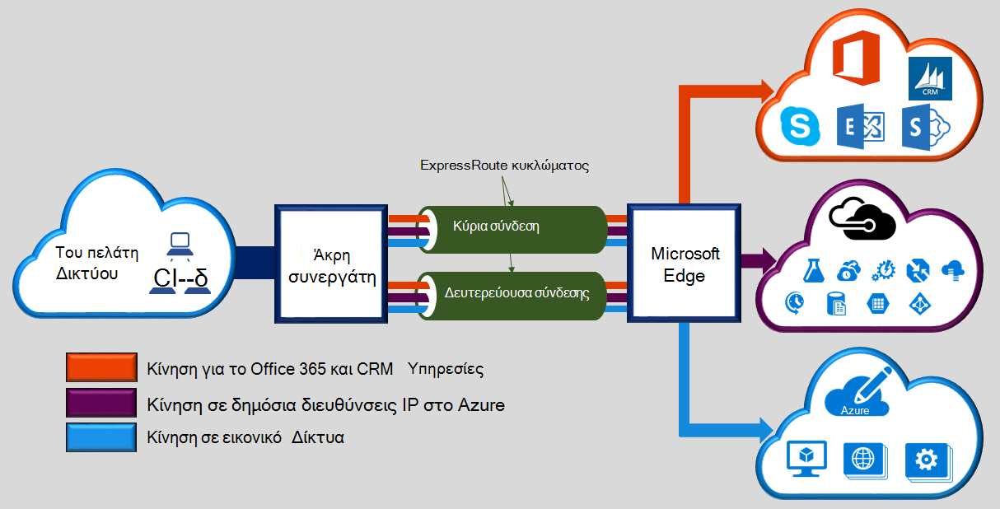
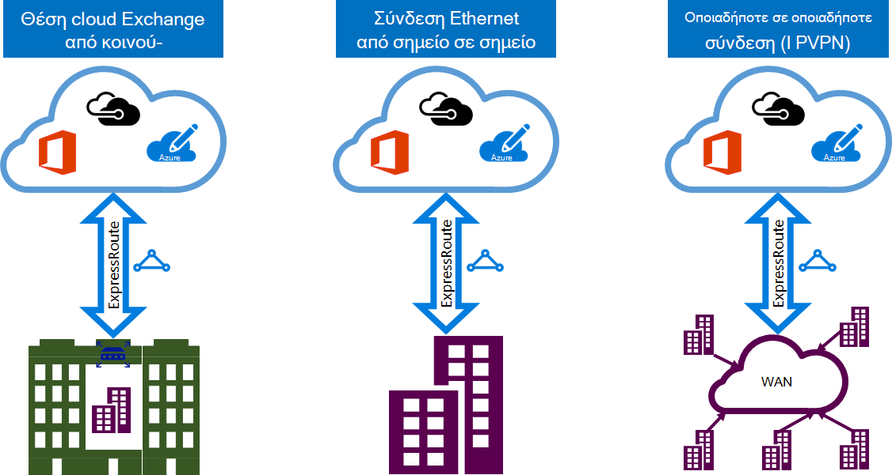

<properties 
   pageTitle="Εισαγωγή στις ExpressRoute | Microsoft Azure"
   description="Αυτή η σελίδα παρέχει μια επισκόπηση της υπηρεσίας ExpressRoute, συμπεριλαμβανομένων των πώς λειτουργεί η σύνδεση ExpressRoute."
   documentationCenter="na"
   services="expressroute"
   authors="cherylmc"
   manager="carmonm"
   editor=""/>
<tags 
   ms.service="expressroute"
   ms.devlang="na"
   ms.topic="get-started-article" 
   ms.tgt_pltfrm="na"
   ms.workload="infrastructure-services" 
   ms.date="10/10/2016"
   ms.author="cherylmc"/>

# Τεχνική επισκόπηση ExpressRoute

Microsoft Azure ExpressRoute σάς επιτρέπει να επεκτείνετε δίκτυά σας εσωτερικής εγκατάστασης στο cloud της Microsoft μέσω σύνδεσης αποκλειστικό ιδιωτικό διευκολυνθεί με μια υπηρεσία παροχής σύνδεσης. Με ExpressRoute, μπορείτε να δημιουργήσετε συνδέσεις με τις υπηρεσίες cloud της Microsoft, όπως το Windows Azure, Office 365 και CRM Online. Συνδεσιμότητα μπορεί να είναι από ένα οποιοδήποτε για οποιοδήποτε δίκτυο (IP VPN), το δίκτυο Ethernet από σημείο σε σημείο ή μια εικονική σταυρό σύνδεση μέσω μιας εταιρείας παροχής συνδεσιμότητας σε εγκατάσταση από κοινού θέση. ExpressRoute συνδέσεις δεν μεταβείτε μέσω του δημόσιου Internet. Αυτό σας επιτρέπει συνδέσεις ExpressRoute για να προσφέρουν περισσότερες αξιοπιστία, μεγαλύτερες ταχύτητες, των αδρανειών χαμηλότερη και υψηλότερη ασφάλεια από τις τυπικές συνδέσεις μέσω του Internet.

**Βασικά πλεονεκτήματα περιλαμβάνουν τα εξής:**

- Επιπέδου 3 τη σύνδεση μεταξύ του δικτύου σας εσωτερικής εγκατάστασης και Cloud της Microsoft μέσω μια υπηρεσία παροχής σύνδεσης. Συνδεσιμότητα μπορεί να είναι από ένα οποιοδήποτε για οποιοδήποτε δίκτυο (IPVPN), μια σύνδεση Ethernet από σημείο σε σημείο, ή μέσα από μια εικονική σταυρό σύνδεση μέσω ανταλλαγής Ethernet.
- Συνδεσιμότητα με υπηρεσίες cloud της Microsoft σε όλες τις περιοχές στην περιοχή γεωπολιτική.
- Καθολική σύνδεση με υπηρεσίες της Microsoft σε όλες τις περιοχές με πρόσθετο premium ExpressRoute.
- Δυναμική δρομολόγηση μεταξύ του δικτύου και της Microsoft μέσω κλάδο τυπικά πρωτόκολλα (πρωτόκολλο BGP).
- Ενσωματωμένη πλεονασμού σε κάθε peering θέση για μεγαλύτερη αξιοπιστία.
- Σύνδεση συνεχούς [SLA](https://azure.microsoft.com/support/legal/sla/).
- Υποστήριξη για πολλές κλάσεις της υπηρεσίας για ειδικές εφαρμογές, όπως το Skype για επιχειρήσεις και ποιότητας υπηρεσίας.

Ανατρέξτε στο θέμα [Συνήθεις Ερωτήσεις ExpressRoute](expressroute-faqs.md) για περισσότερες λεπτομέρειες.

## Πώς μπορώ να συνδεθώ με το δίκτυό μου Microsoft χρησιμοποιώντας ExpressRoute;

Μπορείτε να δημιουργήσετε μια σύνδεση μεταξύ του δικτύου σας εσωτερικής εγκατάστασης και cloud της Microsoft με τρεις διαφορετικούς τρόπους:

### Από κοινού βρίσκεται σε μια ανταλλαγή cloud

Αν βρίσκεστε από κοινού σε εγκατάσταση με μια ανταλλαγή cloud, μπορείτε να ταξινομήσετε εικονικές συνδέσεις ανεξαρτήτως στο cloud της Microsoft μέσω της υπηρεσίας παροχής από κοινού θέση Ethernet exchange. Υπηρεσίες παροχής από κοινού θέση μπορεί να προσφέρει σταυρό επιπέδου 2-συνδέσεις ή διαχειριζόμενων Layer 3 διασταυρούμενο-συνδέσεις μεταξύ υποδομής σας στη λειτουργία θέση από κοινού και του cloud της Microsoft.

### Συνδέσεις Ethernet από σημείο σε σημείο 

Μπορείτε να συνδέσετε τα κέντρα δεδομένων/γραφεία σας εσωτερικής εγκατάστασης στο cloud της Microsoft μέσω συνδέσεων από σημείο σε σημείο Ethernet. Υπηρεσίες παροχής Ethernet από σημείο σε σημείο μπορεί να προσφέρει συνδέσεις επιπέδου 2, ή διαχείριση επιπέδου 3 συνδέσεις μεταξύ την τοποθεσία σας και στο cloud της Microsoft.

### Οποιαδήποτε σε οποιαδήποτε δίκτυα (IPVPN)

Μπορείτε να ενοποιήσετε το WAN με το cloud της Microsoft. Υπηρεσίες παροχής IPVPN (συνήθως MPLS VPN) προσφέρουν οποιαδήποτε σε οποιαδήποτε συνδεσιμότητας μεταξύ σας γραφεία κλάδο και κέντρα δεδομένων. Cloud της Microsoft μπορούν να συνδέονται μεταξύ τους για να σας WAN ώστε να φαίνεται όπως οποιαδήποτε άλλα υποκατάστημα. WAN υπηρεσίες παροχής προσφέρουν συνήθως διαχειριζόμενων συνδεσιμότητας Layer 3. Δυνατότητες ExpressRoute είναι ταυτόσημες όλα σε όλα τα παραπάνω μοντέλα συνδεσιμότητας. 

Υπηρεσίες παροχής συνδεσιμότητας μπορούν να προσφέρουν ένα ή περισσότερα μοντέλα συνδεσιμότητας. Μπορείτε να εργαστείτε με την υπηρεσία παροχής σύνδεσης για να επιλέξετε το μοντέλο που είναι καλύτερη για εσάς.

## Δυνατότητες ExpressRoute

ExpressRoute υποστηρίζει τις παρακάτω δυνατότητες και τις δυνατότητες: 

### Συνδεσιμότητα επιπέδου 3

Δρομολογεί Microsoft χρησιμοποιεί κλάδο τυπική δυναμική πρωτόκολλο δρομολόγησης (το πρωτόκολλο BGP) για την ανταλλαγή μεταξύ του δικτύου σας στην εσωτερική εγκατάσταση, τις παρουσίες στο Azure και Microsoft δημόσιες διευθύνσεις.  Θα σας δημιουργούν πολλά πρωτόκολλο BGP περιόδους λειτουργίας με το δίκτυό σας για την κυκλοφορία διαφορετικό προφίλ. Περισσότερες λεπτομέρειες, μπορείτε να βρείτε στο άρθρο [ExpressRoute κυκλώματος και δρομολόγηση τομείς](expressroute-circuit-peerings.md) .

### Πλεονασμού

Κάθε κύκλωμα ExpressRoute αποτελείται από δύο συνδέσεις με δύο δρομολογητές άκρου της Microsoft για μεγάλες επιχειρήσεις (MSEEs) από την υπηρεσία παροχής συνδεσιμότητας / του δικτύου του άκρου. Microsoft θα απαιτούν διπλή το πρωτόκολλο BGP σύνδεσης από την υπηρεσία παροχής συνδεσιμότητας / σας πλευρά – ένα για κάθε MSEE. Μπορεί να επιλέξετε να μην ανάπτυξη πλεονάζοντα συσκευές / Ethernet κυκλώματα και στο τέλος του. Ωστόσο, υπηρεσίες παροχής συνδεσιμότητας χρησιμοποιεί πλεονάζοντα συσκευές για να βεβαιωθείτε ότι τις συνδέσεις σας είναι παραδοθεί στον Microsoft με πλεονάζοντα τρόπο. Μια πλεονάζοντα ρύθμιση παραμέτρων συνδεσιμότητας Layer 3 αποτελεί προϋπόθεση για μας [SLA](https://azure.microsoft.com/support/legal/sla/) να είναι έγκυρη. 

### Συνδεσιμότητα με υπηρεσίες cloud της Microsoft

[AZURE.INCLUDE [expressroute-office365-include](../../includes/expressroute-office365-include.md)]

Συνδέσεις ExpressRoute επιτρέπουν την πρόσβαση σε τις ακόλουθες υπηρεσίες:

- Υπηρεσίες Microsoft Azure
- Υπηρεσίες του Microsoft Office 365
- Υπηρεσίες του Microsoft CRM Online 
 
Μπορείτε να επισκεφθείτε τη σελίδα [ExpressRoute συνήθεις Ερωτήσεις](expressroute-faqs.md) για μια λεπτομερή λίστα των υπηρεσιών που υποστηρίζονται μέσω ExpressRoute.

### Σύνδεση με όλες τις περιοχές μέσα σε μια περιοχή γεωπολιτική

Μπορείτε να συνδεθείτε στη Microsoft στο μας [διεισδύουν θέσεις](expressroute-locations.md) και να έχετε πρόσβαση σε όλες τις περιοχές στο εσωτερικό της περιοχής γεωπολιτική. 

Για παράδειγμα, εάν ο συνδεδεμένος στη Microsoft στο Amsterdam έως ExpressRoute, θα έχετε πρόσβαση σε όλες τις υπηρεσίες cloud της Microsoft που φιλοξενούνται στο Βόρεια Ευρώπη και Δυτική Ευρώπη. Ανατρέξτε στο [ExpressRoute συνεργάτες και διεισδύουν θέσεις](expressroute-locations.md) άρθρο για μια επισκόπηση των γεωπολιτική περιοχές, σχετικές περιοχές cloud της Microsoft και αντίστοιχες ExpressRoute διεισδύουν θέσεις.

### Καθολικό συνδεσιμότητας με πρόσθετο premium ExpressRoute

Μπορείτε να ενεργοποιήσετε τη δυνατότητα ExpressRoute premium πρόσθετο για να επεκτείνετε τη σύνδεση μεταξύ γεωπολιτική ορίων. Για παράδειγμα, εάν είστε συνδεδεμένοι στη Microsoft στο Amsterdam έως ExpressRoute, θα έχετε πρόσβαση σε όλες τις υπηρεσίες cloud της Microsoft που φιλοξενούνται σε όλες τις περιοχές σε ολόκληρο τον κόσμο (εθνικό σύννεφων εξαιρούνται). Μπορείτε να αποκτήσετε πρόσβαση σε υπηρεσίες αναπτυχθεί σε Νότιας Αμερικής ή Αυστραλίας τον ίδιο τρόπο που έχετε πρόσβαση στις περιοχές βόρεια και Δυτική Ευρώπη.

### Εμπλουτισμένο συνδεσιμότητας συνεργάτη περιβάλλον εμπορικής προσαρμογής

ExpressRoute έχει μια συνεχώς αυξανόμενη περιβάλλον εμπορικής προσαρμογής των υπηρεσιών παροχής συνδεσιμότητας και των συνεργατών ΕΆΝ. Μπορείτε να ανατρέξετε στο άρθρο [υπηρεσίες παροχής ExpressRoute και τις θέσεις](expressroute-locations.md) για τις πιο πρόσφατες πληροφορίες.

### Σύνδεση με εθνικό σύννεφων

Microsoft συνεπάγεται περιβάλλοντα απομόνωσης cloud για ειδική γεωπολιτική περιοχές και τμήματα της αγοράς. Ανατρέξτε στη σελίδα [υπηρεσίες παροχής ExpressRoute και τις θέσεις](expressroute-locations.md) για μια λίστα των national σύννεφων και τις υπηρεσίες παροχής.

### Επιλογές υποστηριζόμενες εύρους ζώνης

Μπορείτε να αγοράσετε κυκλώματα ExpressRoute για ένα μεγάλο εύρος ζώνης. Λίστα υποστηριζόμενες ζώνης παρατίθεται πιο κάτω. Φροντίστε να επικοινωνήσετε με την υπηρεσία παροχής σύνδεσης για να καθορίσετε τη λίστα των υποστηριζόμενες εύρος ζώνης που παρέχουν.

- 50 Mbp
- 100 Mbps
- 200 Mbps
- 500 Mbps
- 1 Gbps
- 2 Gbps
- 5 Gbps
- 10 Gbps

### Δυναμική κλίμακας του εύρους ζώνης

Έχετε τη δυνατότητα να αυξήσετε το εύρος ζώνης κυκλώματος ExpressRoute (με βάση τη βέλτιστη προσπάθειας) χωρίς να χρειάζεται να καταργήσεις τις συνδέσεις σας. 

### Ευέλικτη μοντέλα χρεώσεων

Μπορείτε να επιλέξετε ένα μοντέλο χρέωσης που είναι καλύτερη για εσάς. Επιλέξτε μεταξύ των μοντέλων χρέωσης που παρατίθενται παρακάτω. Ανατρέξτε στη σελίδα [ExpressRoute συνήθεις Ερωτήσεις](expressroute-faqs.md) για περισσότερες λεπτομέρειες. 

- **Απεριόριστος χώρος δεδομένων**. Το κύκλωμα ExpressRoute θα χρεωθεί με βάση μια μηνιαία χρέωση και η μεταφορά όλων των εισερχόμενων και εξερχόμενων δεδομένων είναι περιλαμβάνονται δωρεάν. 
- **Δεδομένα Ογκοχρέωσης**. Το κύκλωμα ExpressRoute χρεώνεται με βάση μια μηνιαία χρέωση. Μεταφορά όλων των εισερχόμενων δεδομένων είναι δωρεάν. Μεταφορά δεδομένων εξερχομένων χρεώνεται ανά GB μεταφοράς δεδομένων. Ταχύτητες μεταφοράς δεδομένων διαφέρουν ανά περιοχή.
- **Πρόσθετο premium ExpressRoute**. Το premium ExpressRoute είναι ένα πρόσθετο μέσω του κυκλώματος ExpressRoute. Το πρόσθετο premium ExpressRoute παρέχει τις ακόλουθες δυνατότητες: 
    - Όρια αυξημένη δρομολόγηση του Azure δημόσια και Azure ιδιωτικό διεισδύουν από το όριο των 4.000 δρομολογεί να δρομολογεί 10.000.
    - Καθολική σύνδεση για τις υπηρεσίες. Ένα κύκλωμα ExpressRoute που δημιουργήθηκε σε οποιαδήποτε περιοχή (εκτός από εθνικό σύννεφων) θα έχουν πρόσβαση σε πόρους σε οποιαδήποτε άλλη περιοχή στον κόσμο. Για παράδειγμα, ένα εικονικό δίκτυο που δημιουργήθηκε σε Δυτική Ευρώπη είναι δυνατή η πρόσβαση μέσω ενός κυκλώματος ExpressRoute παρασχεθεί στο κοίλο πυριτίου.
    - Αυξημένη αριθμός συνδέσεων VNet ανά ExpressRoute κυκλώματος από 10 σε ένα όριο μεγαλύτερο, ανάλογα με το εύρος ζώνης του κυκλώματος.

## Επόμενα βήματα

- Μάθετε περισσότερα σχετικά με συνδέσεις ExpressRoute και δρομολόγηση τομείς. Ανατρέξτε στο θέμα [ExpressRoute κυκλώματα και δρομολόγηση τομείς](expressroute-circuit-peerings.md).
- Βρείτε μια υπηρεσία παροχής. Ανατρέξτε στο θέμα [ExpressRoute συνεργάτες και διεισδύουν θέσεις](expressroute-locations.md).
- Βεβαιωθείτε ότι πληρούνται όλες οι προϋποθέσεις. Ανατρέξτε στο θέμα [προαπαιτούμενα στοιχεία ExpressRoute](expressroute-prerequisites.md).
- Ανατρέξτε στις απαιτήσεις για [δρομολόγηση](expressroute-routing.md), [NAT](expressroute-nat.md) και [ποιότητας υπηρεσίας](expressroute-qos.md).
- Ρυθμίστε τις παραμέτρους της σύνδεσής σας ExpressRoute.
    - [Δημιουργήστε ένα κύκλωμα ExpressRoute](expressroute-howto-circuit-classic.md)
    - [Ρυθμίστε τις παραμέτρους δρομολόγησης](expressroute-howto-routing-classic.md)
    - [Σύνδεση ενός VNet με ένα κύκλωμα ExpressRoute](expressroute-howto-linkvnet-classic.md)
