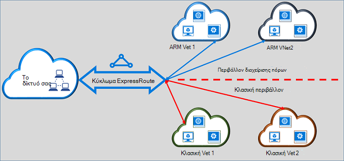

<properties
   pageTitle="Μετακίνηση κυκλώματα ExpressRoute από κλασική διαχείριση πόρων για να | Microsoft Azure"
   description="Αυτή η σελίδα παρέχει μια επισκόπηση του τι πρέπει να γνωρίζετε σχετικά με γεφύρωση το κλασικό και τα μοντέλα ανάπτυξης διαχείρισης πόρων."
   documentationCenter="na"
   services="expressroute"
   authors="ganesr"
   manager="carmonm"
   editor=""/>
<tags
   ms.service="expressroute"
   ms.devlang="na"
   ms.topic="get-started-article"
   ms.tgt_pltfrm="na"
   ms.workload="infrastructure-services"
   ms.date="10/10/2016"
   ms.author="ganesr"/>

# Μετακίνηση κυκλώματα ExpressRoute από το κλασικό στο μοντέλο ανάπτυξης για τη διαχείριση πόρων

Σε αυτό το άρθρο παρέχει μια επισκόπηση του τι σημαίνει αυτό για να μετακινήσετε ένα κύκλωμα Azure ExpressRoute από το κλασικό στο μοντέλο ανάπτυξης Azure διαχείριση πόρων.

[AZURE.INCLUDE [vpn-gateway-sm-rm](../../includes/vpn-gateway-classic-rm-include.md)]

Μπορείτε να χρησιμοποιήσετε ένα μεμονωμένο κύκλωμα ExpressRoute για να συνδεθείτε με εικονικού δίκτυα που έχουν αναπτυχθεί σε το κλασικό και τα μοντέλα ανάπτυξης διαχείρισης πόρων. Ένα κύκλωμα ExpressRoute, ανεξάρτητα από τον τρόπο αυτό δημιουργείται, να συνδέσετε τώρα εικονικών δικτύων σε δύο μοντέλα ανάπτυξης.

## Κυκλώματα ExpressRoute που έχουν δημιουργηθεί στο μοντέλο κλασική ανάπτυξης

Κυκλώματα ExpressRoute που έχουν δημιουργηθεί στο μοντέλο κλασική ανάπτυξης πρέπει να μετακινηθούν στο μοντέλο ανάπτυξης διαχείρισης πόρων πρώτα να ενεργοποιήσετε τη δυνατότητα σύνδεσης με το κλασικό και τα μοντέλα ανάπτυξης διαχείρισης πόρων. Δεν υπάρχει απώλεια σύνδεσης ή διακοπή κατά τη μετακίνηση μιας σύνδεσης. Διατηρούνται όλες τις συνδέσεις κυκλώματος-σε-εικονικού δικτύου στο μοντέλο κλασική ανάπτυξης (μέσα στην ίδια συνδρομή και διασταυρούμενο συνδρομής).

Μετά τη μετακίνηση ολοκληρώθηκε με επιτυχία, το κύκλωμα ExpressRoute έχει, εκτελεί και ακριβώς με ένα κύκλωμα ExpressRoute που δημιουργήθηκε στο μοντέλο ανάπτυξης διαχείρισης πόρων. Τώρα, μπορείτε να δημιουργήσετε συνδέσεις σε εικονικό δίκτυα στο μοντέλο ανάπτυξης διαχείρισης πόρων.

Μετά από ένα ExpressRoute κύκλωμα έχει μετακινηθεί στο μοντέλο ανάπτυξης για τη διαχείριση πόρων, μπορείτε να διαχειριστείτε τον κύκλο ζωής του κυκλώματος ExpressRoute μόνο με τη χρήση του μοντέλου ανάπτυξης διαχείρισης πόρων. Αυτό σημαίνει ότι μπορείτε να εκτελέσετε λειτουργίες όπως η προσθήκη/ενημέρωση/διαγραφή peerings, ενημέρωση ιδιότητες κυκλώματος (όπως το εύρος ζώνης, SKU και χρεώσεις τύπος) και η διαγραφή κυκλώματα μόνο στο μοντέλο ανάπτυξης διαχείρισης πόρων. Ανατρέξτε στην ενότητα κάτω από το στοιχείο σε κυκλώματα που έχουν δημιουργηθεί στο μοντέλο ανάπτυξης για τη διαχείριση πόρων για περαιτέρω πληροφορίες σχετικά με πώς μπορείτε να διαχειριστείτε την πρόσβαση σε δύο μοντέλα ανάπτυξης.

Δεν χρειάζεται να αφορούν την υπηρεσία παροχής σύνδεσης για να εκτελέσετε τη μετακίνηση.

## Κυκλώματα ExpressRoute που έχουν δημιουργηθεί στο μοντέλο ανάπτυξης για τη διαχείριση πόρων

Μπορείτε να ενεργοποιήσετε κυκλώματα ExpressRoute που έχουν δημιουργηθεί στο μοντέλο ανάπτυξης για τη διαχείριση πόρων για να είναι προσβάσιμα από δύο μοντέλα ανάπτυξης. Οποιαδήποτε κυκλώματος ExpressRoute στη συνδρομή σας μπορεί να ενεργοποιηθεί για να είναι προσβάσιμα από δύο μοντέλα ανάπτυξης.

- Κυκλώματα ExpressRoute που έχουν δημιουργηθεί στο μοντέλο ανάπτυξης διαχείρισης πόρων δεν έχουν πρόσβαση στο μοντέλο κλασική ανάπτυξης από προεπιλογή.
- Κυκλώματα ExpressRoute που έχουν μετακινηθεί από το μοντέλο κλασική ανάπτυξης στο μοντέλο ανάπτυξης διαχείρισης πόρων είναι προσβάσιμα από δύο μοντέλα ανάπτυξης από προεπιλογή.
- Ένα κύκλωμα ExpressRoute έχει πάντα πρόσβαση στο μοντέλο ανάπτυξης για τη διαχείριση πόρων, ανεξάρτητα από το αν έχει δημιουργηθεί στη Διαχείριση πόρων ή μοντέλο κλασική ανάπτυξης. Αυτό σημαίνει ότι μπορείτε να δημιουργήσετε συνδέσεις σε εικονικό δίκτυα που δημιουργήσατε στο μοντέλο ανάπτυξης διαχείρισης πόρων ακολουθώντας τις οδηγίες σχετικά με [τον τρόπο σύνδεσης εικονικού δίκτυα](expressroute-howto-linkvnet-arm.md).
- Πρόσβαση στο μοντέλο κλασική ανάπτυξης ελέγχεται από την παράμετρο **allowClassicOperations** στο κύκλωμα ExpressRoute.

>[AZURE.IMPORTANT] Όλα τα όρια που τεκμηριώνονται στη σελίδα [όρια υπηρεσίας](../azure-subscription-service-limits.md) εφαρμόζονται. Ως παράδειγμα, ένα τυπικό κύκλωμα μπορεί να έχει πολύ 10 εικονικού δικτύου συνδέσεις/συνδέσεις σε το κλασικό και τα μοντέλα ανάπτυξης διαχείρισης πόρων.

## Έλεγχος της πρόσβασης στο μοντέλο κλασική ανάπτυξης

Μπορείτε να ενεργοποιήσετε ένα μεμονωμένο κύκλωμα ExpressRoute για να συνδέσετε με εικονικών δικτύων σε δύο μοντέλα ανάπτυξης, ορίζοντας την παράμετρο **allowClassicOperations** του κυκλώματος ExpressRoute.

Ρύθμιση **allowClassicOperations** στην τιμή TRUE σάς επιτρέπει να συνδέσετε εικονικών δικτύων από δύο μοντέλα ανάπτυξης για να το κύκλωμα ExpressRoute. Μπορείτε να συνδέσετε σε εικονικό δίκτυα στο μοντέλο κλασική ανάπτυξης, ακολουθώντας οδηγίες σχετικά με [τον τρόπο σύνδεσης εικονικού δίκτυα στο μοντέλο κλασική ανάπτυξης](expressroute-howto-linkvnet-classic.md). Μπορείτε να συνδέσετε σε εικονικό δίκτυα στο μοντέλο ανάπτυξης για τη διαχείριση πόρων, ακολουθώντας οδηγίες σχετικά με [τον τρόπο σύνδεσης εικονικού δίκτυα στο μοντέλο ανάπτυξης διαχείρισης πόρων](expressroute-howto-linkvnet-arm.md).

Ρύθμιση **allowClassicOperations** σε FALSE αποκλείει την πρόσβαση στις το κύκλωμα από το μοντέλο κλασική ανάπτυξης. Ωστόσο, όλες οι συνδέσεις εικονικού δικτύου στο μοντέλο κλασική ανάπτυξης διατηρούνται. Σε αυτήν την περίπτωση, το κύκλωμα ExpressRoute δεν είναι ορατή στο μοντέλο κλασική ανάπτυξης.

## Υποστηριζόμενες λειτουργίες στο μοντέλο κλασική ανάπτυξης

Τις ακόλουθες λειτουργίες κλασική υποστηρίζονται σε ένα κύκλωμα ExpressRoute όταν **allowClassicOperations** έχει οριστεί στην τιμή TRUE:

 - Λήψη πληροφοριών κυκλώματος ExpressRoute
 - Δημιουργία/ενημέρωση/λήψη/διαγραφή εικονικού δικτύου συνδέσεις σε κλασική εικονικών δικτύων
 - Δημιουργία/ενημέρωση/λήψη/διαγραφή εικονικού δικτύου σύνδεση αδειών συνδεσιμότητας σταυρό συνδρομή

Δεν μπορείτε να εκτελέσετε τις ακόλουθες λειτουργίες κλασική όταν **allowClassicOperations** έχει οριστεί στην τιμή TRUE:

 - Δημιουργία/ενημέρωση/λήψη/διαγραφή peerings πρωτόκολλο πρωτόκολλο πύλης περίγραμμα (BGP) για το Azure δημόσια ιδιωτικές, Azure και Microsoft peerings
 - Διαγραφή κυκλώματα ExpressRoute

## Επικοινωνία μεταξύ το κλασικό και τα μοντέλα ανάπτυξης για τη διαχείριση πόρων

Το κύκλωμα ExpressRoute λειτουργεί ως γέφυρα μεταξύ το κλασικό και τα μοντέλα ανάπτυξης διαχείρισης πόρων. Κίνηση μεταξύ virtual machines στο εικονικών δικτύων στο μοντέλο κλασική ανάπτυξης και εκείνα εικονικού δικτύων των ροών μοντέλο ανάπτυξης διαχείρισης πόρων μέσω ExpressRoute εάν και τα δύο εικονικού δίκτυα είναι συνδεδεμένες με το ίδιο κύκλωμα ExpressRoute.

Συγκέντρωση μετάδοσης περιορίζεται από τη δυνατότητα μετάδοσης της πύλης εικονικού δικτύου. Κίνηση εισαγάγετε δίκτυα της υπηρεσίας παροχής συνδεσιμότητας ή τα δίκτυά σας σε αυτές τις περιπτώσεις. Ροή κυκλοφορίας μεταξύ των εικονικού δικτύων περιέχεται πλήρως το δίκτυο της Microsoft.

## Πρόσβαση σε δημόσια Azure και πόροι διεισδύουν της Microsoft

Μπορείτε να συνεχίσετε να αποκτήσετε πρόσβαση σε πόρους που είναι συνήθως προσβάσιμα μέσω Azure δημόσια διεισδύουν και Microsoft διεισδύουν χωρίς διακοπή.  

## Δυνατότητες που υποστηρίζονται

Αυτή η ενότητα περιγράφει τι υποστηρίζεται για κυκλώματα ExpressRoute:

 - Μπορείτε να χρησιμοποιήσετε ένα μεμονωμένο κύκλωμα ExpressRoute για να αποκτήσετε πρόσβαση εικονικού δίκτυα που έχουν αναπτυχθεί σε το κλασικό και τα μοντέλα ανάπτυξης διαχείρισης πόρων.
 - Μπορείτε να μετακινήσετε ένα κύκλωμα ExpressRoute από το κλασικό στο μοντέλο ανάπτυξης διαχείρισης πόρων. Αφού μετακινηθεί, το κύκλωμα ExpressRoute έχει την εντύπωση και εκτελεί όπως οποιαδήποτε κυκλώματος ExpressRoute που δημιουργείται στο μοντέλο ανάπτυξης διαχείρισης πόρων.
 - Μπορείτε να μετακινήσετε μόνο το κύκλωμα ExpressRoute. Κύκλωμα συνδέσεις, εικονικό δίκτυα και πύλες VPN δεν μπορεί να μετακινηθεί σε αυτήν τη λειτουργία.
 - Μετά από ένα ExpressRoute κύκλωμα έχει μετακινηθεί στο μοντέλο ανάπτυξης για τη διαχείριση πόρων, μπορείτε να διαχειριστείτε τον κύκλο ζωής του κυκλώματος ExpressRoute μόνο με τη χρήση του μοντέλου ανάπτυξης διαχείρισης πόρων. Αυτό σημαίνει ότι μπορείτε να εκτελέσετε λειτουργίες όπως η προσθήκη/ενημέρωση/διαγραφή peerings, ενημέρωση ιδιότητες κυκλώματος (όπως το εύρος ζώνης, SKU και χρεώσεις τύπος) και η διαγραφή κυκλώματα μόνο στο μοντέλο ανάπτυξης διαχείρισης πόρων.
 - Το κύκλωμα ExpressRoute λειτουργεί ως γέφυρα μεταξύ το κλασικό και τα μοντέλα ανάπτυξης διαχείρισης πόρων. Κίνηση μεταξύ virtual machines στο εικονικών δικτύων στο μοντέλο κλασική ανάπτυξης και εκείνα εικονικού δικτύων των ροών μοντέλο ανάπτυξης διαχείρισης πόρων μέσω ExpressRoute εάν και τα δύο εικονικού δίκτυα είναι συνδεδεμένες με το ίδιο κύκλωμα ExpressRoute.
 - Συνδεσιμότητα σταυρό συνδρομή υποστηρίζεται στο το κλασικό και τα μοντέλα ανάπτυξης διαχείρισης πόρων.

## Τι δεν υποστηρίζεται

Αυτή η ενότητα περιγράφει τι δεν υποστηρίζεται για κυκλώματα ExpressRoute:

 - Μετακίνηση κυκλώματος συνδέσεις, πύλες και εικονικών δικτύων από το κλασικό στο μοντέλο ανάπτυξης διαχείρισης πόρων.
 - Διαχείριση του κύκλου ζωής ενός κυκλώματος ExpressRoute από το μοντέλο κλασική ανάπτυξης.
 - Βάσει ρόλων υποστήριξη ελέγχου πρόσβασης (RBAC) για το μοντέλο κλασική ανάπτυξης. Δεν μπορείτε να εκτελέσετε ένα κύκλωμα των στοιχείων ελέγχου RBAC στο μοντέλο κλασική ανάπτυξης. Οποιαδήποτε διαχειριστή/coadministrator από τη συνδρομή να συνδέσετε ή να αποσυνδέσετε εικονικών δικτύων για να το κύκλωμα.

## Ρύθμιση παραμέτρων

Ακολουθήστε τις οδηγίες που περιγράφονται σε [Μετακίνηση ένα κύκλωμα ExpressRoute από το κλασικό στο μοντέλο ανάπτυξης διαχείρισης πόρων](expressroute-howto-move-arm.md).

## Επόμενα βήματα

- Για πληροφορίες ροής εργασίας, ανατρέξτε [κυκλώματος ExpressRoute προμήθεια καταστάσεις κυκλώματος και ροές εργασίας](expressroute-workflows.md).
- Για να ρυθμίσετε τη σύνδεση ExpressRoute:

    - [Δημιουργήστε ένα κύκλωμα ExpressRoute](expressroute-howto-circuit-arm.md)
    - [Ρυθμίστε τις παραμέτρους δρομολόγησης](expressroute-howto-routing-arm.md)
    - [Σύνδεση σε δίκτυο εικονικού με ένα κύκλωμα ExpressRoute](expressroute-howto-linkvnet-arm.md)
