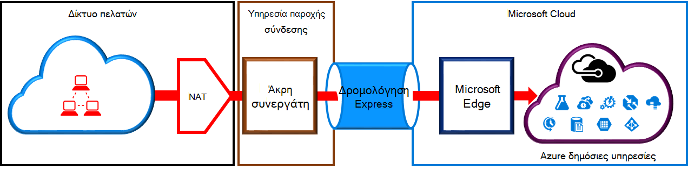
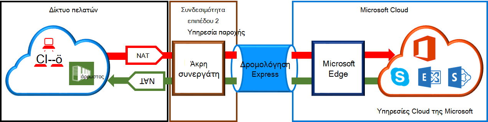

<properties
   pageTitle="Απαιτήσεις NAT για κυκλώματα ExpressRoute | Microsoft Azure"
   description="Αυτή η σελίδα παρέχει λεπτομερείς απαιτήσεις για τη ρύθμιση των παραμέτρων και τη Διαχείριση NAT για κυκλώματα ExpressRoute."
   documentationCenter="na"
   services="expressroute"
   authors="cherylmc"
   manager="carmonm"
   editor=""/>
<tags
   ms.service="expressroute"
   ms.devlang="na"
   ms.topic="get-started-article"
   ms.tgt_pltfrm="na"
   ms.workload="infrastructure-services"
   ms.date="10/10/2016"
   ms.author="cherylmc"/>

# Απαιτήσεις ExpressRoute NAT

Για να συνδεθείτε χρησιμοποιώντας ExpressRoute υπηρεσίες cloud της Microsoft, θα χρειαστεί να ρυθμίσετε και να διαχειριστείτε NAT. Ορισμένες υπηρεσίες παροχής συνδεσιμότητας προσφέρουν ρύθμιση και τη Διαχείριση NAT ως διαχειριζόμενη υπηρεσία. Επικοινωνήστε με την υπηρεσία παροχής σύνδεσης για να δείτε εάν παρέχουν μια τέτοια υπηρεσία. Εάν όχι, θα πρέπει να συμμορφώνονται με τις απαιτήσεις που περιγράφεται παρακάτω. 

Ελέγξτε τη σελίδα [ExpressRoute κυκλώματα και τομείς δρομολόγησης](expressroute-circuit-peerings.md) για μια επισκόπηση των διαφόρων δρομολόγησης τομέων. Για να πληροί τις δημόσια απαιτήσεις διεύθυνση IP για δημόσια Azure και Microsoft διεισδύουν, συνιστάται να ότι έχετε ορίσει NAT μεταξύ του δικτύου και της Microsoft. Αυτή η ενότητα παρέχει μια λεπτομερή περιγραφή της υποδομής του NAT που χρειάζεστε για να ρυθμίσετε.

## Απαιτήσεις NAT για Azure δημόσια διεισδύουν

Το Azure δημόσια peering διαδρομή σάς επιτρέπει να συνδεθείτε σε όλες τις υπηρεσίες που φιλοξενούνται στο Azure επάνω από τις δημόσιες διευθύνσεις IP. Αυτά περιλαμβάνουν υπηρεσίες που περιλαμβάνονται στο [ExpessRoute συνήθεις Ερωτήσεις](expressroute-faqs.md) και τις υπηρεσίες που φιλοξενούνται από ανεξάρτητους προμηθευτές λογισμικού στο Windows Azure. Σύνδεση με τις υπηρεσίες Microsoft Azure σε δημόσια διεισδύουν πάντα ξεκίνησε από το δίκτυό σας στο δίκτυο της Microsoft. Κίνηση που προορίζονται για Microsoft Azure σε δημόσια διεισδύουν πρέπει να SNATed έγκυρη δημόσιες διευθύνσεις IPv4 πριν αρχίσουν το δίκτυο της Microsoft. Η παρακάτω εικόνα παρέχει μια υψηλού επιπέδου εικόνα του πώς μπορεί να ρυθμιστεί ώστε να το NAT πληρούν τις απαιτήσεις παραπάνω.

 

### Διαφημίσεις χώρο συγκέντρωσης και δρομολόγηση NAT IP

Θα πρέπει να βεβαιωθείτε ότι κίνηση εισαγωγή της Azure δημόσια peering διαδρομής με έγκυρη δημόσια διεύθυνση IPv4. Πρέπει να είναι δυνατή η επαλήθευση της κατοχής το σύνολο διευθύνσεων IPv4 NAT σε τοπικές δρομολόγησης μητρώου Internet (RIR) ή σε ένα μητρώο δρομολόγησης Internet (συνάρτηση IRR) της Microsoft. Ένα σημάδι ελέγχου θα εκτελεστεί με βάση τον αριθμό AS που peered με και στις διευθύνσεις IP που χρησιμοποιούνται για το ΝΑΤ. Ανατρέξτε στη σελίδα [απαιτήσεις δρομολόγησης ExpressRoute](expressroute-routing.md) για πληροφορίες σχετικά με τα μητρώα δρομολόγησης.
 
Υπάρχουν περιορισμοί για το μήκος του προθέματος NAT IP κοινοποιείται μέσω αυτό διεισδύουν. Πρέπει να παρακολουθείτε το χώρο συγκέντρωσης NAT και βεβαιωθείτε ότι δεν είναι starved NAT περιόδων λειτουργίας.

>[AZURE.IMPORTANT] Δεν πρέπει να είναι κοινοποιείται το χώρο συγκέντρωσης NAT IP κοινοποιείται στη Microsoft στο Internet. Αυτό θα διακόψει τη σύνδεση με άλλες υπηρεσίες της Microsoft.

## Απαιτήσεις NAT για το Microsoft διεισδύουν

Η διαδρομή peering Microsoft σάς επιτρέπει να συνδέεστε με τις υπηρεσίες cloud της Microsoft που δεν υποστηρίζονται μέσω της Azure δημόσια peering διαδρομής. Στη λίστα υπηρεσιών περιλαμβάνει υπηρεσίες του Office 365, όπως το Exchange Online, του SharePoint Online, το Skype για επιχειρήσεις και CRM Online. Microsoft αναμένει για την υποστήριξη συνδέσεων διπλής κατεύθυνσης στο το Microsoft διεισδύουν. Κίνηση που προορίζονται για υπηρεσίες cloud της Microsoft, πρέπει να SNATed έγκυρη δημόσιες διευθύνσεις IPv4 πριν αρχίσουν το δίκτυο της Microsoft. Κίνηση που προορίζονται για το δίκτυό σας από τις υπηρεσίες cloud της Microsoft πρέπει να SNATed μπορεί να εισέλθει στο δίκτυό σας. Η παρακάτω εικόνα παρέχει μια υψηλού επιπέδου εικόνα του πώς το NAT πρέπει να είναι το πρόγραμμα εγκατάστασης για το Microsoft διεισδύουν.
 
 

#### Κίνηση που προέρχονται από το δίκτυό σας προορίζονται στη Microsoft

- Θα πρέπει να βεβαιωθείτε ότι κίνηση εισαγωγή της διαδρομής peering Microsoft με μια έγκυρη διεύθυνση IPv4 δημόσια. Microsoft πρέπει να είναι δυνατή η επικύρωση τον κάτοχο του το σύνολο διευθύνσεων IPv4 NAT σε τοπικές δρομολόγησης μητρώο internet (RIR) ή σε ένα μητρώο δρομολόγησης internet (συνάρτηση IRR). Ένα σημάδι ελέγχου θα εκτελεστεί με βάση τον αριθμό AS που peered με και στις διευθύνσεις IP που χρησιμοποιούνται για το ΝΑΤ. Ανατρέξτε στη σελίδα [απαιτήσεις δρομολόγησης ExpressRoute](expressroute-routing.md) για πληροφορίες σχετικά με τα μητρώα δρομολόγησης.

- Διευθύνσεις IP που χρησιμοποιούνται για τη δημόσια Azure peering διαμόρφωση και άλλες κυκλώματα ExpressRoute δεν πρέπει να κοινοποιείται στη Microsoft μέσω της περιόδου λειτουργίας πρωτόκολλο BGP. Δεν υπάρχει περιορισμός με το μήκος του προθέματος NAT IP κοινοποιείται μέσω αυτό διεισδύουν.

    >[AZURE.IMPORTANT] Δεν πρέπει να είναι κοινοποιείται το χώρο συγκέντρωσης NAT IP κοινοποιείται στη Microsoft στο Internet. Αυτό θα διακόψει τη σύνδεση με άλλες υπηρεσίες της Microsoft.

#### Κίνηση που προέρχονται από τη Microsoft που προορίζονται για το δίκτυό σας

- Ορισμένα σενάρια απαιτούν Microsoft για να ξεκινήσετε συνδεσιμότητας με τελικά σημεία υπηρεσίας που φιλοξενούνται στο δίκτυο σας. Ένα τυπικό παράδειγμα το σενάριο, θα ήταν σύνδεσης σε διακομιστές ADFS που φιλοξενούνται στο δίκτυό σας από το Office 365. Σε αυτές τις περιπτώσεις, που πρέπει να προκαλέσει απώλεια κατάλληλο προθέματα από το δίκτυό σας σε το Microsoft διεισδύουν. 

- Πρέπει να SNAT κίνηση που προορίζονται για διευθύνσεις IP στο δίκτυό σας από τη Microsoft. 

## Επόμενα βήματα

- Ανατρέξτε στις απαιτήσεις για [δρομολόγηση](expressroute-routing.md) και [ποιότητας υπηρεσίας](expressroute-qos.md).
- Για πληροφορίες ροής εργασίας, ανατρέξτε [κυκλώματος ExpressRoute προμήθεια καταστάσεις κυκλώματος και ροές εργασίας](expressroute-workflows.md).
- Ρυθμίστε τις παραμέτρους της σύνδεσής σας ExpressRoute.

    - [Δημιουργήστε ένα κύκλωμα ExpressRoute](expressroute-howto-circuit-classic.md)
    - [Ρυθμίστε τις παραμέτρους δρομολόγησης](expressroute-howto-routing-classic.md)
    - [Σύνδεση ενός VNet με ένα κύκλωμα ExpressRoute](expressroute-howto-linkvnet-classic.md)

