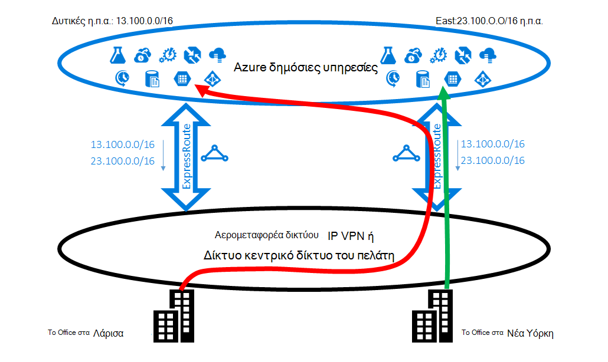
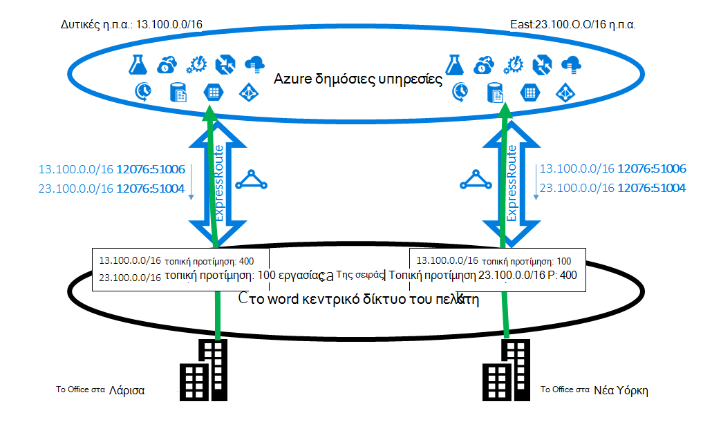
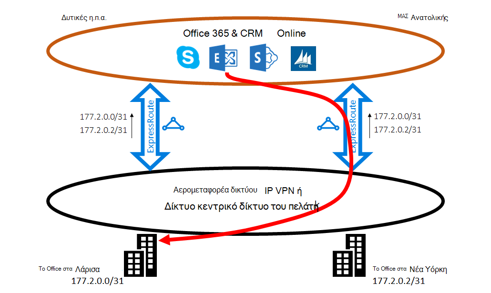
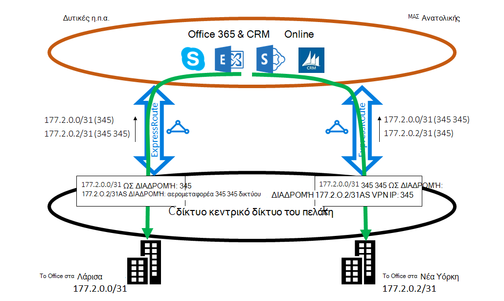

<properties
   pageTitle="Βελτιστοποίηση δρομολόγηση ExpressRoute | Microsoft Azure"
   description="Αυτή η σελίδα παρέχει λεπτομέρειες σχετικά με τον τρόπο βελτιστοποίησης δρομολόγηση όταν ένας πελάτης έχει περισσότερες από μία κυκλώματα ExpressRoute που συνδέονται μεταξύ της Microsoft και δικτύου corp του πελάτη."
   documentationCenter="na"
   services="expressroute"
   authors="charwen"
   manager="carmonm"
   editor=""/>
<tags
   ms.service="expressroute"
   ms.devlang="na"
   ms.topic="get-started-article"
   ms.tgt_pltfrm="na"
   ms.workload="infrastructure-services"
   ms.date="10/10/2016"
   ms.author="charwen"/>

# Βελτιστοποίηση ExpressRoute δρομολόγησης
Όταν έχετε πολλές ExpressRoute κυκλώματα, έχετε περισσότερες από μία διαδρομή για να συνδεθείτε στη Microsoft. Ως αποτέλεσμα, δευτερεύουσα προαιρετική δρομολόγηση μπορεί να συμβεί - δηλαδή, κυκλοφορία σας ενδέχεται να χρειαστούν μεγαλύτερη διαδρομή για την επίτευξη της Microsoft και της Microsoft για το δίκτυό σας. Όσο περισσότερο τη διαδρομή δικτύου, όσο υψηλότερη το λανθάνοντος χρόνου. Λανθάνων χρόνος έχει άμεση επίδραση εφαρμογή επιδόσεων και εμπειρία χρήστη. Σε αυτό το άρθρο θα απεικονίζουν αυτό το πρόβλημα και εξηγούν τον τρόπο για να βελτιστοποιήσετε τη δρομολόγηση χρησιμοποιώντας την τυπική δρομολόγησης τεχνολογίες.

## Δευτερεύουσα προαιρετική δρομολόγησης περίπτωση 1
Ας ρίξουμε μια κοντινή ματιά στην το πρόβλημα δρομολόγησης από ένα παράδειγμα. Φανταστείτε ότι έχετε δύο γραφεία στις Ηνωμένες Πολιτείες, ένα με Λάρισα και μία σε νέα Υόρκη. Τα γραφεία σας είναι συνδεδεμένοι σε μια μεγάλη περιοχή δικτύου (WAN), που μπορεί να είναι η υπηρεσία παροχής IP VPN ή το δικό σας κεντρικό δίκτυο. Έχετε δύο κυκλώματα ExpressRoute, μία στη δυτική ΜΑΣ και μία σε ΜΑΣ Ανατολή, που είναι συνδεδεμένοι επίσης στην το WAN. Εμφανώς, έχετε δύο διαδρομές για να συνδεθείτε στο δίκτυο της Microsoft. Τώρα φανταστείτε ότι έχετε Azure ανάπτυξης (π.χ. Azure εφαρμογής υπηρεσίας) στο ΜΑΣ δυτικές και Ανατολή ΜΑΣ. Πρόθεσή σας είναι να συνδέσετε τους χρήστες σας στο Λάρισα Δυτική Azure ΜΑΣ και τους χρήστες σας στη Νέα Υόρκη σε Ανατολική Azure ΜΑΣ επειδή το διαχειριστή υπηρεσίας κοινοποιείται ότι οι χρήστες στο office κάθε πρόσβαση κοντά Azure υπηρεσιών για βέλτιστη εμπειρία. Δυστυχώς, το πρόγραμμα λειτουργεί σωστά για τους χρήστες ανατολική ακτή, αλλά όχι για τους χρήστες δυτική ακτή. Η αιτία του προβλήματος είναι τα εξής. Σε κάθε κύκλωμα ExpressRoute, θα σας κοινοποίηση που το πρόθεμα στο Azure ΜΑΣ Ανατολή (23.100.0.0/16) και το πρόθεμα στο Azure ΜΑΣ δυτικές (13.100.0.0/16). Εάν δεν γνωρίζετε ποια πρόθεμα είναι από ποια περιοχή, δεν είστε σε θέση να το χρησιμοποιήσει διαφορετικά. WAN το δίκτυό σας μπορεί να πιστεύετε ότι και τα δύο από τα προθέματα είναι πιο κοντά στο Ανατολή ΜΑΣ από ΜΑΣ δυτικές και δρομολόγηση, επομένως, οι χρήστες του office και τα δύο στο του κυκλώματος ExpressRoute σε Ανατολή ΜΑΣ. Στο τέλος, θα έχετε πολλές Θλιμμένο χρηστών στο office Λάρισα.

### Λύση: Χρησιμοποιήστε το πρωτόκολλο BGP κοινότητες
Για να βελτιστοποιήσετε δρομολόγησης για χρήστες του office και τα δύο, πρέπει να γνωρίζετε ποια πρόθεμα είναι από Δυτική Azure ΜΑΣ και οι οποίες από Ανατολή Azure ΜΑΣ. Θα σας κωδικοποιήσετε αυτές τις πληροφορίες χρησιμοποιώντας [το πρωτόκολλο BGP Κοινότητας τιμές](expressroute-routing.md). Θα σας έχετε αναθέσει μια μοναδική τιμή πρωτόκολλο BGP Κοινότητας σε κάθε Azure περιοχής, π.χ., "12076:51004" για Ανατολική ΜΑΣ, "12076:51006" για τις δυτικές ΜΑΣ. Τώρα που γνωρίζετε ποιες πρόθεμα είναι από ποια περιοχή Azure, μπορείτε να ρυθμίσετε ποια κυκλώματος ExpressRoute πρέπει να είναι προτιμώμενη. Επειδή μπορούμε να χρησιμοποιήσουμε το πρωτόκολλο BGP για να ανταλλάσσετε πληροφορίες δρομολόγησης, μπορείτε να χρησιμοποιήσετε το πρωτόκολλο BGP του τοπικού προτίμηση να επηρεάσει τη δρομολόγηση. Στο παράδειγμά μας, μπορείτε να αντιστοιχίσετε μια υψηλότερη τιμή τοπικό προτίμηση σε 13.100.0.0/16 στο ΜΑΣ Δυτική από στο ΜΑΣ Ανατολή και ομοίως, μια υψηλότερη τιμή τοπικό προτίμηση σε 23.100.0.0/16 στο ΜΑΣ Ανατολή από στη δυτική ΜΑΣ. Αυτή η ρύθμιση παραμέτρων θα βεβαιωθείτε ότι, όταν υπάρχουν δύο διαδρομές στη Microsoft, οι χρήστες σας στο Λάρισα θα διαρκέσει το κύκλωμα ExpressRoute στη δυτική ΜΑΣ για να συνδεθείτε με Δυτική Azure ΜΑΣ ότι οι χρήστες σας στη Νέα Υόρκη λαμβάνει το ExpressRoute σε Ανατολική ΜΑΣ σε Ανατολική Azure ΜΑΣ. Δρομολόγηση είναι βελτιστοποιημένη και στις δύο πλευρές. 

## Δευτερεύουσα προαιρετική δρομολόγησης περίπτωση 2
Παρακάτω θα δείτε ένα άλλο παράδειγμα όπου συνδέσεις από τη Microsoft να μεγαλύτερη διαδρομή για την επίτευξη το δίκτυό σας. Σε αυτήν την περίπτωση, μπορείτε χρησιμοποιήσετε τους διακομιστές Exchange εσωτερικής εγκατάστασης και το Exchange Online σε ένα [υβριδικό περιβάλλον](https://technet.microsoft.com/library/jj200581%28v=exchg.150%29.aspx). Τα γραφεία σας είναι συνδεδεμένοι στο WAN. Μπορείτε να κοινοποιήσετε τα προθέματα των διακομιστών εσωτερικής εγκατάστασης και στις δύο από τα γραφεία σας στη Microsoft μέσω τα δύο κυκλώματα ExpressRoute. Exchange Online θα ξεκινήσει συνδέσεις στους διακομιστές εσωτερικής εγκατάστασης σε περιπτώσεις όπως μετεγκατάσταση γραμματοκιβωτίου. Δυστυχώς, η σύνδεση με το office Λάρισα δρομολογείται του κυκλώματος ExpressRoute σε Ανατολή ΜΑΣ πριν από την αλλαγή ολόκληρο το αντίγραφο ηπείρου προς δυτική ακτή. Η αιτία του προβλήματος είναι παρόμοιο με το πρώτο. Χωρίς οποιαδήποτε υποδείξεων, το δίκτυο της Microsoft δεν αναγνωρίζει ποιο πρόθεμα πελάτη είναι κοντά ΜΑΣ Ανατολή και ποιο είναι κοντά Δυτική ΜΑΣ. Αυτό συμβαίνει για να επιλέξετε τη διαδρομή πρόβλημα με το γραφείο σας στη Λάρισα.

### Λύση: Χρησιμοποιήστε προτάσσοντας ΔΙΑΔΡΟΜΉ AS
Υπάρχουν δύο λύσεις για το πρόβλημα. Το πρώτο είναι ότι μπορείτε απλώς κοινοποιήσετε το πρόθεμα εσωτερικής εγκατάστασης για το office Λάρισα, 177.2.0.0/31, στο κύκλωμα ExpressRoute στη δυτική ΜΑΣ και πρόθεμα σας εσωτερικής εγκατάστασης για το office Νέα Υόρκη, 177.2.0.2/31, στο κύκλωμα ExpressRoute στο Ανατολή ΜΑΣ. Ως αποτέλεσμα, υπάρχει μόνο μία διαδρομή για τη Microsoft για να συνδεθείτε σε καθένα από τα γραφεία. Δεν υπάρχει καμία ασαφειών και δρομολόγηση είναι βελτιστοποιημένο. Με αυτήν τη σχεδίαση, πρέπει να σκεφτείτε της στρατηγικής ανακατεύθυνσης. Σε περίπτωση που η διαδρομή στη Microsoft μέσω ExpressRoute είναι κατεστραμμένη, πρέπει να βεβαιωθείτε ότι Exchange Online να εξακολουθεί να συνδεθείτε με τους διακομιστές εσωτερικής εγκατάστασης. 

Η δεύτερη λύση είναι που συνεχίζετε να κοινοποιήσετε και τα δύο από τα προθέματα σε δύο ExpressRoute κυκλώματα και, επιπλέον, μπορείτε να παρέχετε μια υπόδειξη του ποια πρόθεμα είναι κοντά ποια από τις δύο από τα γραφεία. Επειδή υποστηρίζουμε προτάσσοντας διαδρομή ΩΣ το πρωτόκολλο BGP, μπορείτε να ρυθμίσετε τη διαδρομή ΩΣ για το πρόθεμα να επηρεάσει τη δρομολόγηση. Σε αυτό το παράδειγμα, έχετε τη δυνατότητα αύξησης τη ΔΙΑΔΡΟΜΉ ΩΣ για 172.2.0.0/31 στο Ανατολή ΜΑΣ, έτσι ώστε θα προτιμότερο το κύκλωμα ExpressRoute στη δυτική ΜΑΣ για την κίνηση που προορίζονται για αυτό το πρόθεμα (όπως το δίκτυο μας θα πιστεύετε ότι η διαδρομή προς αυτό το πρόθεμα είναι μικρότερη στο το Δυτική). Κατά τον ίδιο τρόπο που μπορεί να μεγαλώσει τη ΔΙΑΔΡΟΜΉ ΩΣ για 172.2.0.2/31 στη δυτική ΜΑΣ ώστε θα προτιμότερο του κυκλώματος ExpressRoute σε Ανατολή ΜΑΣ. Δρομολόγηση είναι βελτιστοποιημένη για δύο γραφεία. Με αυτή τη σχεδίαση, εάν ένα κύκλωμα ExpressRoute έχει διακοπεί, Exchange Online μπορεί να εξακολουθεί να επικοινωνήσουμε μαζί σας μέσω άλλου ExpressRoute κυκλώματος και σας WAN. 

>[AZURE.IMPORTANT] Θα σας κατάργηση ιδιωτικών ΩΣ αριθμοί στη ΔΙΑΔΡΟΜΉ AS για τα προθέματα που λάβατε στο Microsoft Peering. Πρέπει να προσαρτήσετε δημόσια ΩΣ αριθμοί στη ΔΙΑΔΡΟΜΉ AS για να επηρεάσετε τη δρομολόγηση για το Microsoft Peering.

>[AZURE.IMPORTANT] Ενώ τα παραδείγματα που δίνονται εδώ είναι για Microsoft και τη δημόσια peerings, υποστηρίζουμε τις ίδιες δυνατότητες για την ιδιωτική διεισδύουν. Επίσης, η AS διαδρομή προτάσσοντας λειτουργεί μέσα σε ένα μεμονωμένο κύκλωμα ExpressRoute, για να επηρεάζουν την επιλογή από τις διαδρομές κύριας και δευτερεύουσας.
