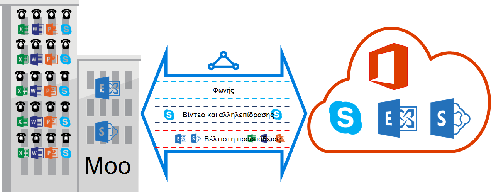

<properties
   pageTitle="Απαιτήσεις ποιότητας υπηρεσίας για ExpressRoute | Microsoft Azure"
   description="Αυτή η σελίδα παρέχει λεπτομερείς απαιτήσεις για τη ρύθμιση των παραμέτρων και τη διαχείριση ποιότητας υπηρεσίας για κυκλώματα ExpressRoute."
   documentationCenter="na"
   services="expressroute"
   authors="cherylmc"
   manager="carmonm"
   editor=""/>
<tags
   ms.service="expressroute"
   ms.devlang="na"
   ms.topic="get-started-article"
   ms.tgt_pltfrm="na"
   ms.workload="infrastructure-services"
   ms.date="10/10/2016"
   ms.author="cherylmc"/>

# Απαιτήσεις ExpressRoute ποιότητας υπηρεσίας

Skype για επιχειρήσεις διαθέτει διάφορα φόρτους εργασίας που απαιτούν διαφοροποιημένης ποιότητας υπηρεσίας επεξεργασίας. Εάν πρόκειται για την εκμετάλλευση υπηρεσίες φωνής μέσω ExpressRoute, πρέπει να συμμορφώνονται με τις απαιτήσεις που περιγράφεται παρακάτω.

>[AZURE.NOTE] Απαιτήσεις ποιότητας υπηρεσίας ισχύουν για το Microsoft διεισδύουν μόνο. Οι τιμές DSCP στην κίνηση του δικτύου σας λάβατε στο Azure δημόσια διεισδύουν και Azure ιδιωτικό διεισδύουν θα γίνει επαναφορά σε 0. 

Ο παρακάτω πίνακας παρέχει μια λίστα με τις επισημάνσεις DSCP που χρησιμοποιούνται από το Skype για επιχειρήσεις. Ανατρέξτε στη [Διαχείριση ποιότητας υπηρεσίας για το Skype για επιχειρήσεις](https://technet.microsoft.com/library/gg405409.aspx) για περισσότερες πληροφορίες.

| **Κίνηση τάξης** | **Επεξεργασία (επισήμανσης DSCP)** | **Skype για επιχειρήσεις φόρτους εργασίας** |
|---|---|---|
| **Φωνής** | EF (46) | Skype / φωνητική επικοινωνία του Lync |
| **Αλληλεπιδραστική** | AF41 (34) | Βίντεο |
|   | AF21 (18) | Κοινή χρήση της εφαρμογής | 
| **Προεπιλεγμένη** | AF11 (10) | Μεταφορά αρχείων|
|   | CS0 (0) | Κάτι άλλο| 

- Πρέπει να ταξινομήσουν το φόρτο εργασίας και να επισημάνετε τις σωστές τιμές DSCP. Ακολουθήστε τις οδηγίες που παρέχονται [εδώ](https://technet.microsoft.com/library/gg405409.aspx) σχετικά με τον τρόπο για να ορίσετε τις επισημάνσεις DSCP στο δίκτυό σας.

- Πρέπει να ρυθμίσετε τις παραμέτρους και να υποστηρίζουν πολλαπλές ουρές ποιότητας υπηρεσίας εντός του δικτύου σας. Φωνητικό πρέπει να είναι μια μεμονωμένη κλάση και να λαμβάνετε την επεξεργασία EF που καθορίζεται στο RFC 3246. 

- Μπορείτε να αποφασίσετε το μηχανισμό ουράς, συμφόρηση εντοπισμού πολιτικής και εκχώρηση εύρους ζώνης ανά κλάσης κίνηση. Ωστόσο, η επισήμανση για το Skype για επιχειρήσεις φόρτους εργασίας DSCP πρέπει να διατηρηθούν. Εάν χρησιμοποιείτε τις επισημάνσεις DSCP που δεν αναφέρεται παραπάνω, π.χ. AF31 (26), πρέπει να αντικαταστήσουν αυτήν την τιμή DSCP 0 πριν από την αποστολή του πακέτου στη Microsoft. Μόνο η Microsoft στέλνει πακέτα που επισημαίνεται με την τιμή DSCP εμφανίζονται στον παραπάνω πίνακα. 

## Επόμενα βήματα

- Ανατρέξτε στις απαιτήσεις για [δρομολόγηση](expressroute-routing.md) και [NAT](expressroute-nat.md).
- Δείτε τις παρακάτω συνδέσεις για να ρυθμίσετε τη σύνδεση ExpressRoute.

    - [Δημιουργήστε ένα κύκλωμα ExpressRoute](expressroute-howto-circuit-classic.md)
    - [Ρυθμίστε τις παραμέτρους δρομολόγησης](expressroute-howto-routing-classic.md)
    - [Σύνδεση ενός VNet με ένα κύκλωμα ExpressRoute](expressroute-howto-linkvnet-classic.md)
