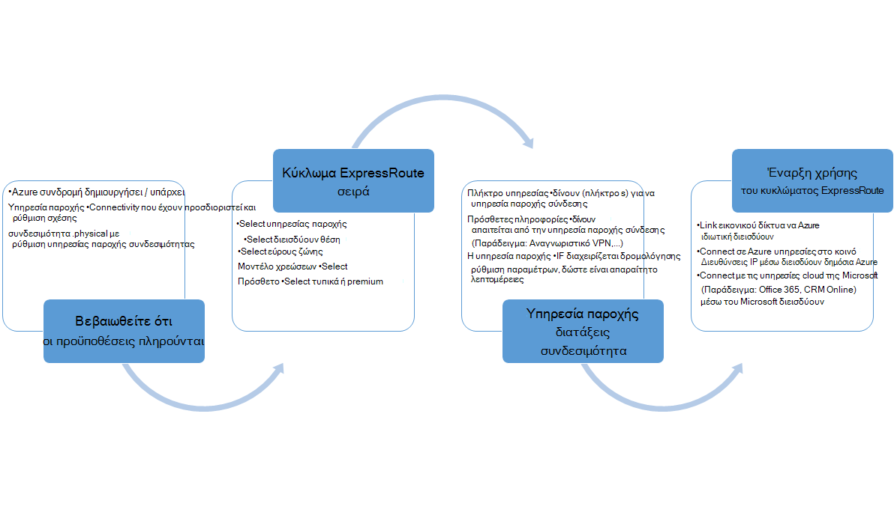
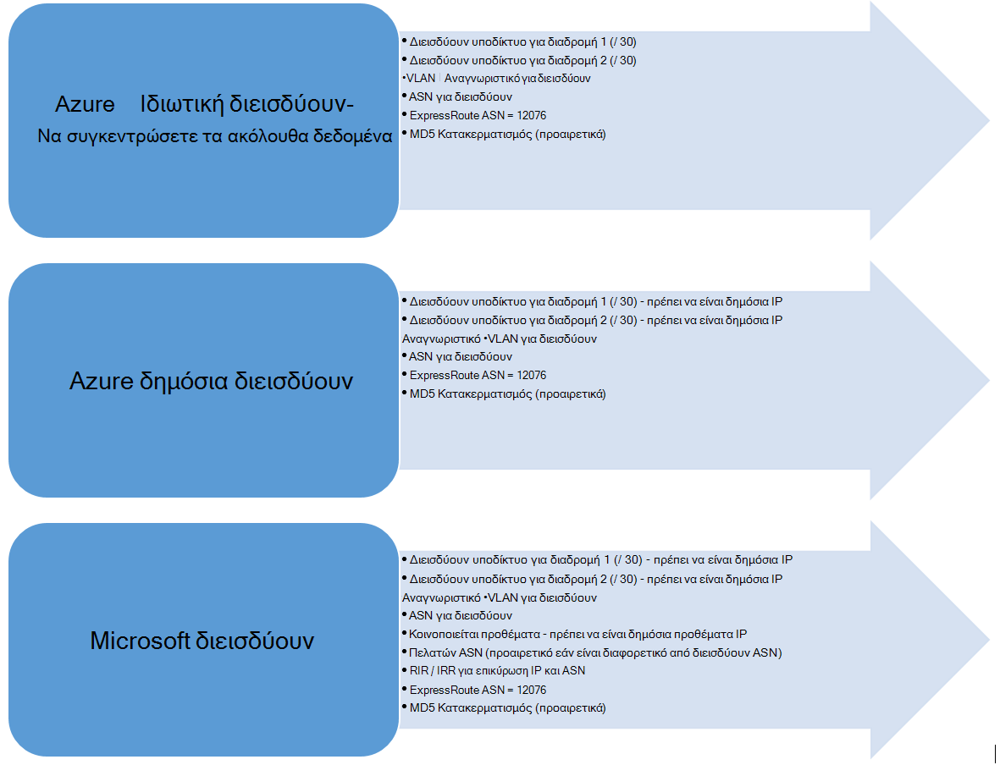

<properties
   pageTitle="Ροές εργασίας για τη ρύθμιση των παραμέτρων ενός κυκλώματος ExpressRoute | Microsoft Azure"
   description="Αυτή η σελίδα σάς καθοδηγεί σε τις ροές εργασίας για τη ρύθμιση παραμέτρων κυκλώματος ExpressRoute και peerings"
   documentationCenter="na"
   services="expressroute"
   authors="cherylmc"
   manager="carmonm"
   editor="" />
<tags
   ms.service="expressroute"
   ms.devlang="na"
   ms.topic="article" 
   ms.tgt_pltfrm="na"
   ms.workload="infrastructure-services"
   ms.date="10/10/2016"
   ms.author="cherylmc"/>

# Ροές εργασίας ExpressRoute για προμήθεια κυκλώματος και κυκλώματος μέλη

Αυτή η σελίδα σάς καθοδηγεί στην υπηρεσία παροχής και δρομολόγηση ρύθμισης παραμέτρων ροών εργασίας σε υψηλό επίπεδο.

Η παρακάτω εικόνα και τα αντίστοιχα βήματα που εμφανίζει τις εργασίες που πρέπει να ακολουθήσετε για να έχετε ένα κύκλωμα ExpressRoute παροχή της υπηρεσίας για να ολοκληρωμένες. 

1. Χρήση του PowerShell για να ρυθμίσετε τις παραμέτρους ενός κυκλώματος ExpressRoute. Ακολουθήστε τις οδηγίες στο άρθρο [Δημιουργία ExpressRoute κυκλώματα](expressroute-howto-circuit-classic.md) για περισσότερες λεπτομέρειες.

2. Συνδεσιμότητα σειρά από την υπηρεσία παροχής. Αυτή η διαδικασία διαφέρει. Για περισσότερες λεπτομέρειες σχετικά με τον τρόπο διάταξης συνδεσιμότητας, επικοινωνήστε με την υπηρεσία παροχής σύνδεσης.

3. Βεβαιωθείτε ότι το κύκλωμα έχει αποδοθεί με επιτυχία με επαλήθευση το κύκλωμα ExpressRoute προμήθεια κατάσταση μέσω του PowerShell. 

4. Ρυθμίστε τις παραμέτρους δρομολόγησης τομείς. Εάν το παροχής συνδεσιμότητας διαχειρίζεται Layer 3 για εσάς, θα ρυθμίσουν τις παραμέτρους δρομολόγησης για το κύκλωμα. Εάν η υπηρεσία παροχής συνδεσιμότητας προσφέρει μόνο υπηρεσίες επιπέδου 2, πρέπει να ρυθμίσετε τη δρομολόγηση ανά οδηγίες που περιγράφονται στις σελίδες [δρομολόγηση απαιτήσεις](expressroute-routing.md) και [Ρύθμιση παραμέτρων δρομολόγησης](expressroute-howto-routing-classic.md) .

    -  Ενεργοποίηση Azure ιδιωτικό διεισδύουν - πρέπει να ενεργοποιήσετε αυτήν διεισδύουν για να συνδεθείτε με ΣΠΣ / υπηρεσίες αναπτυχθεί σε εικονικό δίκτυα στο cloud.
    -  Ενεργοποίηση Azure δημόσια διεισδύουν - πρέπει να ενεργοποιήσετε το Azure διεισδύουν δημόσια εάν θέλετε να συνδεθείτε με Azure υπηρεσιών που φιλοξενούνται σε δημόσια διευθύνσεις IP. Αυτή είναι η απαίτηση για πρόσβαση σε πόρους Azure εάν έχετε επιλέξει να ενεργοποιηθεί η προεπιλεγμένη δρομολόγηση για Azure διεισδύουν ιδιωτικό.
    -  Ενεργοποίηση διεισδύουν Microsoft - θα πρέπει να το ενεργοποιήσετε για να αποκτήσω πρόσβαση στο Office 365 και CRM ηλεκτρονικές υπηρεσίες. 
    
    >[AZURE.IMPORTANT] Θα πρέπει να βεβαιωθείτε ότι χρησιμοποιείτε ένα ξεχωριστό διακομιστή μεσολάβησης / άκρο για να συνδεθείτε στο Microsoft από αυτόν που χρησιμοποιείτε για πρόσβαση στο Internet. Χρησιμοποιώντας την ίδια ακμή για ExpressRoute και του Internet, θα προκαλέσει ασύμμετρη δρομολόγηση και θα προκαλέσει την ΡΕΥΜΑΤΟΣ συνδεσιμότητας για το δίκτυό σας.

    

5. Σύνδεση εικονικού δίκτυα για κυκλώματα ExpressRoute - μπορείτε να συνδέσετε εικονικών δικτύων σας κύκλωμα ExpressRoute. Ακολουθήστε οδηγίες [για να συνδέσετε VNets](expressroute-howto-linkvnet-arm.md) κυκλώματος σας. Αυτές οι VNets μπορεί να είναι στην ίδια συνδρομή του Azure ως το κύκλωμα ExpressRoute ή μπορεί να είναι σε μια διαφορετική συνδρομή.

## ExpressRoute κυκλώματος προμήθεια από.

Κάθε κύκλωμα ExpressRoute έχει δύο καταστάσεις:

- Υπηρεσία παροχής υπηρεσίας παροχής κατάσταση
- Κατάσταση

Κατάσταση αναπαριστά παροχής κατάσταση της Microsoft. Αυτή η ιδιότητα έχει οριστεί σε ενεργοποιημένη όταν δημιουργείτε ένα κύκλωμα Expressroute

Η κατάσταση παροχής υπηρεσίας παροχής συνδεσιμότητας αντιπροσωπεύει την κατάσταση στην πλευρά της υπηρεσίας παροχής σύνδεσης. Αυτό μπορεί να είναι *NotProvisioned*, *Provisioning*ή *Provisioned*. Το κύκλωμα ExpressRoute πρέπει να είναι σε κατάσταση Provisioned για να είναι σε θέση να το χρησιμοποιείτε.

### Πιθανές καταστάσεις ενός κυκλώματος ExpressRoute

Αυτή η ενότητα παρουσιάζει ανάληψη τις πιθανές καταστάσεις για ένα κύκλωμα ExpressRoute.

#### Κατά τη δημιουργία

Θα δείτε το κύκλωμα ExpressRoute σε κατάσταση παρακάτω μόλις εκτελέστε το cmdlet του PowerShell για να δημιουργήσετε το κύκλωμα ExpressRoute.

    ServiceProviderProvisioningState : NotProvisioned
    Status                           : Enabled

#### Όταν συνδεσιμότητας παροχής είναι σε διαδικασία προμήθεια το κύκλωμα

Θα δείτε το κύκλωμα ExpressRoute σε κατάσταση παρακάτω μόλις περάσετε το κλειδί υπηρεσίας στην υπηρεσία παροχής σύνδεσης και να ξεκινήσουν της διαδικασίας προετοιμασίας.

    ServiceProviderProvisioningState : Provisioning
    Status                           : Enabled

#### Όταν παροχής συνδεσιμότητας ολοκλήρωση της διαδικασίας προετοιμασίας

Θα δείτε το κύκλωμα ExpressRoute σε κατάσταση παρακάτω μόλις η υπηρεσία παροχής σύνδεσης έχει ολοκληρωθεί η διαδικασία προετοιμασίας.

    ServiceProviderProvisioningState : Provisioned
    Status                           : Enabled

Παροχή της υπηρεσίας και ενεργοποιημένο είναι η κατάσταση μόνο το κύκλωμα μπορεί να είναι στο για να μπορέσετε να χρησιμοποιήσετε. Εάν χρησιμοποιείτε μια υπηρεσία παροχής επιπέδου 2, μπορείτε να ρυθμίσετε τις παραμέτρους δρομολόγησης για το κύκλωμα μόνο όταν είναι σε αυτήν την κατάσταση.

#### Όταν συνδεσιμότητας παροχής deprovisioning το κύκλωμα

Εάν έχετε ζητήσει η υπηρεσία παροχής για να deprovision το κύκλωμα ExpressRoute, θα δείτε το κύκλωμα ρύθμιση στην παρακάτω κατάσταση μετά την ολοκλήρωση της διαδικασίας deprovisioning της υπηρεσίας παροχής.

    ServiceProviderProvisioningState : NotProvisioned
    Status                           : Enabled

Μπορείτε να επιλέξετε να την ενεργοποιήσετε εκ νέου εάν είναι απαραίτητο, ή να εκτελέσετε cmdlet του PowerShell για να διαγράψετε το κύκλωμα.  

>[AZURE.IMPORTANT] Εάν εκτελείτε το cmdlet του PowerShell για να διαγράψετε το κύκλωμα κατά την προμήθεια του ServiceProviderProvisioningState ή Provisioned η λειτουργία θα αποτύχει. Εργασία επικοινωνήστε με την υπηρεσία παροχής σύνδεσης για να deprovision πρώτα το κύκλωμα ExpressRoute και, στη συνέχεια, διαγράψτε το κύκλωμα. Microsoft θα συνεχίσουν να γραμματίου το κύκλωμα μέχρι να εκτελέσετε το cmdlet του PowerShell για να διαγράψετε το κύκλωμα.

## Κατάσταση ρύθμισης παραμέτρων δρομολόγησης περιόδου λειτουργίας

Το πρωτόκολλο BGP προμήθεια κατάσταση σάς επιτρέπει να γνωρίζετε αν έχει ενεργοποιηθεί η περίοδος λειτουργίας πρωτόκολλο BGP στην άκρη της Microsoft. Πρέπει να είναι ενεργοποιημένη η κατάσταση για να μπορέσετε να χρησιμοποιήσετε το διεισδύουν.

Είναι σημαντικό να ελέγξετε την κατάσταση λειτουργίας το πρωτόκολλο BGP ειδικά για το Microsoft διεισδύουν. Εκτός από το πρωτόκολλο BGP προμήθεια νομό, υπάρχει μια άλλη κατάσταση που ονομάζεται *κοινοποιείται δημόσια προθέματα κατάσταση*. Η κατάσταση κοινοποιημένη δημόσια προθέματα πρέπει να *ρυθμίσει τις παραμέτρους* κατάσταση, τόσο για την περίοδο λειτουργίας το πρωτόκολλο BGP να είναι προς τα επάνω και για τη δρομολόγηση σας για να εργαστείτε σε ολοκληρωμένες. 

Εάν η κατάσταση κοινοποιημένη δημόσια πρόθεμα έχει οριστεί σε μια κατάσταση *επικύρωσης είναι απαραίτητο* , η περίοδος λειτουργίας πρωτόκολλο BGP δεν είναι ενεργοποιημένη, όπως τα κοινοποιημένα προθέματα δεν συμφωνεί με τον αριθμό AS σε οποιοδήποτε από τα μητρώα δρομολόγησης. 

>[AZURE.IMPORTANT] Εάν η κατάσταση κοινοποιημένη δημόσια προθέματα βρίσκεται σε κατάσταση *μη αυτόματης επικύρωσης* , πρέπει να ανοίξετε ένα δελτίο υποστήριξης με την [υποστήριξη της Microsoft](https://portal.azure.com/?#blade/Microsoft_Azure_Support/HelpAndSupportBlade) και να αποδείξει ότι είστε κάτοχος στις διευθύνσεις IP κοινοποιείται κατά μήκος με τον σχετικό αριθμό αυτόνομο σύστημα.

## Επόμενα βήματα

- Ρυθμίστε τις παραμέτρους της σύνδεσής σας ExpressRoute.

    - [Δημιουργήστε ένα κύκλωμα ExpressRoute](expressroute-howto-circuit-arm.md)
    - [Ρυθμίστε τις παραμέτρους δρομολόγησης](expressroute-howto-routing-arm.md)
    - [Σύνδεση ενός VNet με ένα κύκλωμα ExpressRoute](expressroute-howto-linkvnet-arm.md)
