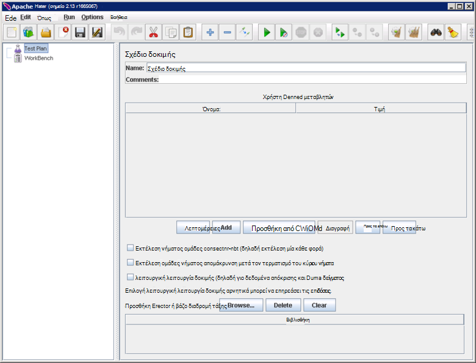

<properties
   pageTitle="Δημιουργία μιας επιδόσεις περιβάλλοντος δοκιμής για Elasticsearch | Microsoft Azure"
   description="Μάθετε πώς μπορείτε να ρυθμίσετε ένα περιβάλλον για τη δοκιμή τις επιδόσεις της ένα σύμπλεγμα Elasticsearch."
   services=""
   documentationCenter="na"
   authors="dragon119"
   manager="bennage"
   editor=""
   tags=""/>

<tags
   ms.service="guidance"
   ms.devlang="na"
   ms.topic="article"
   ms.tgt_pltfrm="na"
   ms.workload="na"
   ms.date="09/22/2016"
   ms.author="masashin"/>
   
# <a name="creating-a-performance-testing-environment-for-elasticsearch-on-azure"></a>Δημιουργία μιας επιδόσεις περιβάλλοντος δοκιμής για Elasticsearch σε Azure

[AZURE.INCLUDE [pnp-header](../../includes/guidance-pnp-header-include.md)]

Σε αυτό το άρθρο αποτελεί [μέρος μιας σειράς](guidance-elasticsearch.md). 

Αυτό το έγγραφο περιγράφει πώς μπορείτε να ρυθμίσετε ένα περιβάλλον για τη δοκιμή τις επιδόσεις της ένα σύμπλεγμα Elasticsearch. Αυτή η ρύθμιση παραμέτρων που χρησιμοποιήθηκε για να ελέγξετε τις επιδόσεις της δεδομένων κατάποσης και ερώτημα φόρτους εργασίας, όπως περιγράφεται στην [απόδοση κατάποσης δεδομένων ρύθμισης για Elasticsearch σε Azure][].

Η διαδικασία δοκιμής επιδόσεων χρησιμοποιείται [Apache JMeter](http://jmeter.apache.org/), με τη [Ρύθμιση τυπική](http://jmeter-plugins.org/wiki/StandardSet/) προσθήκες εγκατεστημένο σε μια ρύθμιση παραμέτρων υποδείγματος/υφισταμένου χρησιμοποιώντας ένα σύνολο αποκλειστικό ΣΠΣ (δεν αποτελεί μέρος του συμπλέγματος Elasticsearch) έχουν ρυθμιστεί ειδικά για το σκοπό. 

Ο [Παράγοντας διακομιστή PerfMon](http://jmeter-plugins.org/wiki/PerfMonAgent/) είχε εγκατασταθεί σε κάθε κόμβο Elasticsearch. Οι παρακάτω ενότητες παρέχουν οδηγίες για να δημιουργείτε το περιβάλλον δοκιμής για να μπορέσετε να διεξαγωγή τη δική σας επιδόσεων δοκιμών με JMeter. Αυτές οι οδηγίες λαμβάνεται ως δεδομένο ότι έχετε δημιουργήσει ήδη ένα σύμπλεγμα Elasticsearch με κόμβους που συνδέονται με μια Azure εικονικού δικτύου. 

Σημειώστε ότι το περιβάλλον δοκιμής λειτουργεί επίσης ως σύνολο ΣΠΣ Azure διαχειριζόμενων χρησιμοποιώντας μια ομάδα μία Azure πόρων.

[Marvel](https://www.elastic.co/products/marvel) έχει επίσης εγκατασταθεί και ρυθμιστεί ώστε να επιτρέπει τις εσωτερικές πτυχές του συμπλέγματος Elasticsearch να να παρακολουθούνται και να αναλύσετε πιο εύκολα. Εάν τα στατιστικά στοιχεία JMeter εμφάνιζε μια κορύφωσης ή δοχείο στις επιδόσεις, μέσω της Marvel πληροφορίες μπορεί να είναι πολύτιμη για να καθορίσετε την αιτία το διακυμάνσεις.

Η παρακάτω εικόνα εμφανίζει τη δομή του ολόκληρο το σύστημα. 


Λάβετε υπόψη τα εξής σημεία:

- Το υπόδειγμα JMeter Εικονική εκτελεί τον Windows Server για την παροχή του περιβάλλοντος Γραφικών της κονσόλας JMeter. Η Εικονική υπόδειγμα JMeter παρέχει το Γραφικών (το *jmeter* εφαρμογής) για να ενεργοποιήσετε ένα πρόγραμμα δοκιμής να δημιουργήσετε δοκιμές, εκτέλεση ελέγχων και απεικόνιση των αποτελεσμάτων. Αυτή η Εικονική συντεταγμένες με το διακομιστή JMeter ΣΠΣ που πραγματικά να στείλετε τις αιτήσεις που αποτελούν τις δοκιμές.

- Το ΣΠΣ δευτερεύουσες JMeter εκτελέστε Ubuntu διακομιστή (Linux), δεν απαιτείται Γραφικών για αυτά τα ΣΠΣ. Ο διακομιστής JMeter ΣΠΣ εκτελείται το λογισμικό διακομιστή JMeter (το jmeter εφαρμογή *διακομιστή* ) για να στείλετε προσκλήσεις στο σύμπλεγμα Elasticsearch.

- Κόμβοι αποκλειστικό υπολογιστή-πελάτη δεν χρησιμοποιήθηκαν, παρόλο που έχουν αποκλειστικό κύρια κόμβους.

- Ο αριθμός των δεδομένων τους κόμβους του συμπλέγματος μπορεί να ποικίλλει, ανάλογα με το σενάριο που ελέγχεται.

- Όλοι οι κόμβοι του συμπλέγματος Elasticsearch εκτελέστε Marvel για να παρακολουθήσετε απόδοσης κατά το χρόνο εκτέλεσης και τον παράγοντα διακομιστή JMeter για τη συλλογή δεδομένων παρακολούθησης για μελλοντική ανάλυση.

- Κατά τη δοκιμή Elasticsearch 2.0.0 και νεότερες εκδόσεις, έναν από τους κόμβους δεδομένων εκτελεί επίσης Kibana. Αυτό είναι απαιτούμενο από την έκδοση του Marvel που εκτελείται στον Elasticsearch 2.0.0 και νεότερες εκδόσεις.

## <a name="creating-an-azure-resource-group-for-the-virtual-machines"></a>Δημιουργία μιας ομάδας Azure πόρων για τις εικονικές μηχανές

Το υπόδειγμα JMeter πρέπει να μπορούν να συνδεθούν απευθείας σε κάθε έναν από τους κόμβους του συμπλέγματος Elasticsearch για τη συγκέντρωση δεδομένων για τις επιδόσεις. Εάν το JMeter VNet είναι ξεχωριστό από το σύμπλεγμα Elasticsearch VNet, στη συνέχεια, αυτό πρέπει να πραγματοποιηθούν τη ρύθμιση των παραμέτρων κάθε κόμβο Elasticsearch με μια δημόσια διεύθυνση IP. Εάν αυτό είναι ένα πρόβλημα με τη ρύθμιση παραμέτρων Elasticsearch, στη συνέχεια, εξετάστε την εφαρμογή του ΣΠΣ JMeter στο το ίδιο VNet ως το σύμπλεγμα Elasticsearch, χρησιμοποιώντας την ίδια ομάδα πόρων, οπότε μπορείτε να παραλείψετε αυτήν τη διαδικασία πρώτης.

Πρώτα, [Δημιουργήστε μια ομάδα πόρων](../resource-group-template-deploy-portal.md). Αυτό το έγγραφο προϋποθέτει ότι σας ομάδα πόρων ονομάζεται *JMeterPerformanceTest*. Εάν θέλετε να εκτελέσετε το ΣΠΣ JMeter σε το ίδιο VNet ως το σύμπλεγμα Elasticsearch, χρησιμοποιήστε την ίδια ομάδα πόρων ως που σύμπλεγμα αντί να δημιουργήσετε ένα νέο.

## <a name="creating-the-jmeter-master-virtual-machine"></a>Δημιουργία την JMeter κύρια εικονική μηχανή

Επόμενη [δημιουργήσετε μια Εικονική Windows](../virtual-machines/virtual-machines-windows-hero-tutorial.md) με χρήση του *Windows Server 2008 R2 SP1* εικόνα.  Συνιστάται η επιλογή ένα μέγεθος Εικονική με επαρκή πυρήνων και μνήμης για να εκτελέσετε τις δοκιμές επιδόσεων. Ιδανικά αυτό θα είναι ένα μηχάνημα με τουλάχιστον 2 πυρήνων και 3,5 GB RAM (A2 τυπική ή μεγαλύτερο).

<!-- TODO add info on why disabling diagnostics is positive --> 

Συνιστάται να απενεργοποιήσετε την επιλογή Διαγνωστικά. Κατά τη δημιουργία του Εικονική στην πύλη, αυτό είναι εφικτό από το blade *Ρυθμίσεις* στην ενότητα " *Παρακολούθηση* " στην περιοχή *Εργαλεία διαγνωστικού ελέγχου*. Αφήστε τις υπόλοιπες ρυθμίσεις στις προεπιλεγμένες τιμές.

Βεβαιωθείτε ότι η Εικονική και όλους τους πόρους που σχετίζονται έχουν δημιουργηθεί με επιτυχία, [εξετάζοντας την ομάδα των πόρων](../azure-portal/resource-group-portal.md#manage-resource-groups) στην πύλη. Οι πόροι που παρατίθενται θα πρέπει να αποτελείται από μια Εικονική, μια ομάδα ασφαλείας δικτύου, καθώς και μια δημόσια διεύθυνση IP με το ίδιο όνομα και λογαριασμό στο περιβάλλον εργασίας και αποθήκευσης δικτύου με ονόματα ότι η Εικονική.

## <a name="creating-the-jmeter-subordinate-virtual-machines"></a>Δημιουργία του JMeter δευτερεύουσες εικονικές μηχανές

Τώρα [Δημιουργήστε μια Εικονική Linux](../virtual-machines/virtual-machines-linux-quick-create-portal.md) χρησιμοποιώντας την εικόνα *Ubuntu διακομιστή 14.04 Αποτελεσμάτων* .  Όπως με την κύρια Εικονική JMeter, επιλέξτε ένα μέγεθος Εικονική με επαρκή πυρήνων και μνήμης για να εκτελέσετε τις δοκιμές επιδόσεων. Ιδανικά αυτό θα είναι ένα μηχάνημα με τουλάχιστον 2 πυρήνων και τουλάχιστον 3,5 GB RAM (τυπική A2 ή μεγαλύτερο).

Ξανά, συνιστάται να απενεργοποιήσετε την επιλογή Διαγνωστικά.

Μπορείτε να δημιουργήσετε όσες δευτερεύουσες ΣΠΣ όπως εσείς θέλετε. 

## <a name="installing-jmeter-server-on-the-jmeter-subordinate-vms"></a>Κατά την εγκατάσταση JMeter διακομιστή στο του ΣΠΣ δευτερεύουσες JMeter

Το ΣΠΣ δευτερεύουσες JMeter εκτελούνται Linux και από προεπιλογή δεν μπορείτε να συνδεθείτε σε αυτά, ανοίγοντας μια σύνδεση απομακρυσμένης επιφάνειας εργασίας (RDP). Αντί για αυτό, μπορείτε να [χρησιμοποιήσετε PuTTY για να ανοίξετε ένα παράθυρο γραμμής εντολών](../virtual-machines/virtual-machines-linux-mac-create-ssh-keys.md) σε κάθε Εικονική.

Αφού έχετε συνδεθεί σε ένα από τα δευτερεύοντα ΣΠΣ, θα χρησιμοποιήσουμε πάρτι εγκατάστασης JMeter.

Πρώτα, εγκαταστήστε το περιβάλλον χρόνου εκτέλεσης Java που απαιτούνται για την εκτέλεση JMeter.

```bash
sudo add-apt-repository ppa:webupd8team/java
sudo apt-get update
sudo apt-get install oracle-java8-installer
```

Τώρα, μπορείτε να κάνετε λήψη του λογισμικού JMeter συσκευαστούν ως αρχείο zip.

```bash
wget http://apache.mirror.anlx.net/jmeter/binaries/apache-jmeter-2.13.zip
```

Εγκαταστήστε την εντολή unzip και, στη συνέχεια, χρησιμοποιήστε το για να αναπτύξετε το λογισμικό JMeter. Το λογισμικό αντιγράφεται σε ένα φάκελο που ονομάζεται **apache-jmeter-2.13**.

```bash
sudo apt-get install unzip
unzip apache-jmeter-2.13.zip
```

Αλλάξετε στον κατάλογο *Ανακύκλωσης* κρατώντας πατημένο το εκτελέσιμα JMeter και να κάνετε τα προγράμματα *jmeter-διακομιστή* και *jmeter* εκτελέσιμο.

```bash
cd apache-jmeter-2.13/bin
chmod u+x jmeter-server
chmod u+x jmeter
```

Τώρα, πρέπει να επεξεργαστείτε το αρχείο `jmeter.properties` που βρίσκεται στον τρέχοντα φάκελο (Χρησιμοποιήστε το πρόγραμμα επεξεργασίας κειμένου, είστε εξοικειωμένοι με, όπως *vi* ή *vim*). Εντοπίστε τις ακόλουθες γραμμές:

```yaml
...
client.rmi.localport=0
...
server.rmi.localport=4000
...
```

Ενεργοποίηση (Κατάργηση το διάστιχο \#χαρακτήρες #) και να τροποποιήσετε αυτές τις γραμμές, όπως φαίνεται παρακάτω, στη συνέχεια, αποθηκεύστε το αρχείο και κλείστε το πρόγραμμα επεξεργασίας:

```yaml
...
client.rmi.localport=4441
...
server.rmi.localport=4440
```

Τώρα, εκτελέστε τις ακόλουθες εντολές για να ανοίξετε θύρα 4441 για την εισερχόμενη κυκλοφορία TCP (αυτή είναι η θύρα που μόλις ρυθμίσατε τις παραμέτρους *jmeter διακομιστή* για παρακολούθηση):

```bash
sudo iptables -A INPUT -m state --state NEW -m tcp -p tcp --dport 4441 -j ACCEPT
```

Κάντε λήψη του αρχείου zip που περιέχει την τυπική συλλογή προσθήκες για JMeter (αυτές οι προσθήκες παρέχει μετρητές παρακολούθησης επιδόσεων) και, στη συνέχεια, αποσυμπιέστε το αρχείο στο φάκελο **apache-jmeter-2.13** . Unzipping το αρχείο σε αυτήν τη θέση τοποθετεί των προσθηκών στο σωστό φάκελο.

Εάν σας ζητηθεί να αντικαταστήσετε το αρχείο άδειας ΧΡΉΣΗΣ, πληκτρολογήστε Α (για όλους):

```bash
wget http://jmeter-plugins.org/downloads/file/JMeterPlugins-Standard-1.3.0.zip
unzip JMeterPlugins-Standard-1.3.0.zip
```

Χρήση `nohup` να εκκινήσετε το JMeter διακομιστή στο παρασκήνιο. Αυτό θα πρέπει να απαντήσετε, εμφανίζοντας μια διαδικασία Αναγνωριστικό και ένα μήνυμα που δηλώνει ότι έχει δημιουργήσει ένα απομακρυσμένο αντικείμενο και είστε έτοιμοι να ξεκινήσετε λαμβάνει εντολές.  Εκτελέστε την ακόλουθη εντολή στον κατάλογο ~/apache-jmeter-2.13/bin. 

```bash
nohup jmeter-server &
```

> [AZURE.NOTE]Εάν η Εικονική έχει τερματιστεί το πρόγραμμα διακομιστή JMeter τερματίζεται. Θα πρέπει να συνδεθείτε με το Εικονική και επανεκκινήστε το ξανά με μη αυτόματο τρόπο. Εναλλακτικά, μπορείτε να ρυθμίσετε το σύστημα για την εκτέλεση της εντολής *jmeter server* αυτόματα κατά την εκκίνηση, προσθέτοντας τις παρακάτω εντολές για να το `/etc/rc.local` αρχείου (πριν από την εντολή *Έξοδος από το 0* ):

```bash
sudo -u <username> bash << eoc
cd /home/<username>/apache-jmeter-2.13/bin
nohup ./jmeter-server &
eoc
```

Αντικατάσταση `<username>` με το όνομα χρήστη σας.

Ίσως σας φανεί χρήσιμο να διατηρήσετε το παράθυρο τερματικού ανοικτό, έτσι ώστε να μπορείτε να παρακολουθείτε την πρόοδο του διακομιστή JMeter ενώ δοκιμές βρίσκεται σε εξέλιξη.

Θα πρέπει να επαναλάβετε αυτά τα βήματα για κάθε δευτερεύουσα Εικονική JMeter.

## <a name="installing-the-jmeter-server-agent-on-the-elasticsearch-nodes"></a>Κατά την εγκατάσταση του παράγοντα διακομιστή JMeter σε τους κόμβους Elasticsearch

Αυτή η διαδικασία προϋποθέτει ότι έχετε δικαίωμα σύνδεσης για να τους κόμβους Elasticsearch. Εάν έχετε δημιουργήσει στο σύμπλεγμα χρησιμοποιώντας το πρότυπο διαχείρισης πόρων, μπορείτε να συνδεθείτε σε κάθε κόμβο έως το πλαίσιο μεταπήδηση Εικονική όπως απεικονίζεται στην ενότητα τοπολογία Elasticsearch της [Elasticsearch εκτελείται σε Azure](guidance-elasticsearch-running-on-azure.md). Μπορείτε να συνδεθείτε στο πλαίσιο μεταπήδηση καθώς και με χρήση PuTTY. 

Από εδώ, μπορείτε να χρησιμοποιήσετε την εντολή *ssh* για να συνδεθείτε κάθε έναν από τους κόμβους του συμπλέγματος Elasticsearch.

Συνδεθείτε έναν από τους κόμβους Elasticsearch ως διαχειριστής.  Στη γραμμή εντολών πάρτι, καταχωρήστε τις παρακάτω εντολές για να δημιουργήσετε ένα φάκελο για τη διατήρηση τον παράγοντα διακομιστή JMeter και μετακίνηση σε αυτόν το φάκελο:

```bash
mkdir server-agent
cd server-agent
```

Εκτελέστε τις ακόλουθες εντολές για να εγκαταστήσετε την εντολή *αποσυμπίεση* (Εάν δεν είναι ήδη εγκατεστημένο), κάντε λήψη του λογισμικού παράγοντα διακομιστή JMeter και αποσυμπίεση του:

```bash
sudo apt-get install unzip
wget http://jmeter-plugins.org/downloads/file/ServerAgent-2.2.1.zip
unzip ServerAgent-2.2.1.zip
```
 
Εκτελέστε την ακόλουθη εντολή για ρύθμιση παραμέτρων του τείχους προστασίας και την ενεργοποίηση κυκλοφορία TCP διέλευση θύρα 4444 (αυτή είναι η θύρα που χρησιμοποιείται από τον παράγοντα διακομιστή JMeter):

```bash
sudo iptables -A INPUT -m state --state NEW -m tcp -p tcp --dport 4444 -j ACCEPT
```

Εκτελέστε την παρακάτω εντολή για να ξεκινήσετε τον παράγοντα διακομιστή JMeter στο παρασκήνιο:

```bash
nohup ./startAgent.sh &
```

Ο παράγοντας διακομιστή JMeter θα πρέπει να απαντήσετε με τα μηνύματα που υποδεικνύει ότι έχει ξεκινήσει και κάνει ακρόαση στη θύρα 4444.  Πατήστε το πλήκτρο Enter για να αποκτήσετε μια γραμμή εντολών και, στη συνέχεια, εκτελέστε την ακόλουθη εντολή.

```bash
telnet <nodename> 4444
```

Αντικατάσταση `<nodename>` με το όνομα του κόμβου σας. (Μπορείτε να βρείτε το όνομα του κόμβου σας, εκτελώντας το `hostname` εντολή.) Αυτή η εντολή ανοίγει μια σύνδεση telnet στη θύρα 4444 στον τοπικό υπολογιστή σας. Μπορείτε να χρησιμοποιήσετε αυτήν τη σύνδεση για να επαληθεύσετε ότι ο παράγοντας διακομιστή JMeter εκτελείται σωστά.

Εάν ο παράγοντας διακομιστή JMeter δεν εκτελείται, θα λάβετε την απάντηση 

`*telnet: Unable to connect to remote host: Connection refused*.`

Εάν εκτελείται ο παράγοντας διακομιστή JMeter και θύρα 4444 έχει ρυθμιστεί σωστά, θα πρέπει να βλέπετε την ακόλουθη απόκριση:


> [AZURE.NOTE] Στην περίοδο λειτουργίας telnet δεν παρέχει οποιοδήποτε είδος εντολών μόλις το έχει συνδεθεί.

Κατά την περίοδο λειτουργίας telnet, πληκτρολογήστε την ακόλουθη εντολή:

``` 
test
```

Εάν έχει ρυθμιστεί από τον παράγοντα διακομιστή JMeter και ακρόαση σωστά, θα πρέπει να υποδεικνύουν ότι το λάβει την εντολή και απάντηση με το μήνυμα *Yep*.

> [AZURE.NOTE]Μπορείτε να πληκτρολογήσετε σε άλλες εντολές για τη λήψη δεδομένων παρακολούθηση των επιδόσεων. Για παράδειγμα, η εντολή `metric-single:cpu:idle` θα σας δώσει την τρέχουσα αναλογία της ώρας που η CPU είναι σε αδράνεια (αυτό είναι ένα στιγμιότυπο). Για μια πλήρη λίστα των εντολών, επισκεφθείτε τη σελίδα [PerfMon παράγοντα διακομιστή](http://jmeter-plugins.org/wiki/PerfMonAgent/) . : Επιστροφή στην κλήση το αυτός διακομιστή Perfmon παράγοντας. >>

Κατά την περίοδο λειτουργίας telnet, πληκτρολογήστε την παρακάτω εντολή για να τερματίσετε την περίοδο λειτουργίας και να επιστρέψετε στη γραμμή εντολών πάρτι:

``` 
exit
```

> [AZURE.NOTE]Όπως με την JMeter δευτερεύουσες ΣΠΣ, εάν αποσυνδεθείτε, ή εάν αυτόν τον υπολογιστή έχει τερματιστεί και επανεκκίνηση του, στη συνέχεια, τον παράγοντα διακομιστή JMeter θα πρέπει να γίνει επανεκκίνηση με μη αυτόματο τρόπο, χρησιμοποιώντας το `startAgent.sh` εντολή. Εάν θέλετε ο παράγοντας διακομιστή JMeter ώστε να ξεκινά αυτόματα, προσθέστε την ακόλουθη εντολή στο τέλος της το `/etc/rc.local` αρχείο, πριν από την εντολή *Έξοδος από 0* . 
> Αντικατάσταση `<username>` με το όνομα της σύνδεσής σας:

```bash
sudo -u <username> bash << eoc
cd /home/<username>/server-agent
nohup ./startAgent.sh &
eoc
```

Μπορείτε τώρα να επαναλάβετε είτε ολόκληρης της διεργασίας για κάθε άλλες κόμβο του συμπλέγματος Elasticsearch ή μπορείτε να χρησιμοποιήσετε το `scp` εντολή για να αντιγράψετε το φάκελο παράγοντα διακομιστή και περιεχόμενα κάθε κόμβου και χρησιμοποιήστε το `ssh` εντολή Ξεκινήστε τον παράγοντα διακομιστή JMeter, όπως φαίνεται παρακάτω. e αντικατάσταση `<username>` με το όνομα χρήστη, και `<nodename>` με το όνομα του κόμβου όπου θέλετε να αντιγράψετε και να εκτελέσετε το λογισμικό (που μπορεί να σας ζητηθεί να δώσετε τον κωδικό πρόσβασής σας κατά την εκτέλεση της εντολής κάθε):

```bash
scp -r \~/server-agent <username>@<nodename>:\~
ssh <nodename> sudo iptables -A INPUT -m state --state NEW -m tcp -p tcp --dport 4444 -j ACCEPT
ssh <nodename> -n -f 'nohup \~/server-agent/startAgent.sh'
```

## <a name="installing-and-configuring-jmeter-on-the-jmeter-master-vm"></a>Εγκατάσταση και ρύθμιση παραμέτρων JMeter στην την κύρια εικονική Μηχανή JMeter

Στην πύλη του Azure, κάντε κλικ στην επιλογή **ομάδες πόρων**. Στο το blade **ομάδες πόρων** , κάντε κλικ στην ομάδα πόρων που περιέχει το υπόδειγμα JMeter και τις δευτερεύουσες ΣΠΣ.  Στο blade την **ομάδα πόρων** , επιλέξτε την **κύρια Εικονική JMeter**. Στο η εικονική μηχανή blade, στη γραμμή εργαλείων, κάντε κλικ στην επιλογή **σύνδεση**. Ανοίξτε το αρχείο RDP όταν σας ζητηθεί από το πρόγραμμα περιήγησης web. Τα Windows δημιουργούν μια σύνδεση απομακρυσμένης επιφάνειας εργασίας για να σας Εικονική.  Πληκτρολογήστε το όνομα χρήστη και τον κωδικό πρόσβασης για την εικονική Μηχανή όταν σας ζητηθεί.

Σε η Εικονική, χρησιμοποιώντας τον Internet Explorer, μεταβείτε στη σελίδα [Λήψη Java για Windows](http://www.java.com/en/download/ie_manual.jsp) . Ακολουθήστε τις οδηγίες για να κάνετε λήψη και να εκτελέσετε το πρόγραμμα εγκατάστασης του Java.

Στο πρόγραμμα περιήγησης web, μεταβείτε στη σελίδα [Λήψη JMeter Apache](http://jmeter.apache.org/download_jmeter.cgi) και να κάνετε λήψη του zip που περιέχει το πιο πρόσφατο δυαδικό αρχείο. Αποθήκευση zip σε μια εύχρηστη θέση στην Εικονική σας.

Μεταβείτε στην τοποθεσία στην [Προσαρμοσμένη JMeter προσθήκες](http://jmeter-plugins.org/) και λήψη το τυπικό σύνολο των προσθηκών του. Αποθηκεύστε το zip στον ίδιο φάκελο με τη λήψη JMeter από το προηγούμενο βήμα.

Στην Εξερεύνηση των Windows, μεταβείτε στο φάκελο που περιέχει το apache-jmeter -*xxx* αρχείο zip, όπου *xxx* είναι η τρέχουσα έκδοση του JMeter. Εξαγάγετε τα αρχεία στον τρέχοντα φάκελο.

Εξαγωγή των αρχείων από το JMeterPlugins-τυπική -*yyy*αρχείου .zip, όπου *yyy* είναι η τρέχουσα έκδοση του των προσθηκών, σε το apache-jmeter*xxx* φάκελο. Αυτό θα προσθέσει των προσθηκών στο σωστό φάκελο για JMeter. Ασφαλής, μπορείτε να συγχώνευση τους φακέλους της βιβλιοθήκης και να αντικαταστήσετε τα αρχεία αρχείο readme του άδεια χρήσης και, εάν σας ζητηθεί.

Μεταβείτε στις επιλογές του apache-jmeter -**xxx/Bin φακέλου και επεξεργασία jmeter.properties το αρχείο χρησιμοποιώντας το Σημειωματάριο.  Στο το `jmeter.properties` αρχείων, βρείτε την ενότητα επισημαίνονται *απομακρυσμένους κεντρικούς υπολογιστές και ρύθμισης παραμέτρων RMI*.  Σε αυτήν την ενότητα του αρχείου, βρείτε την ακόλουθη γραμμή:

```yaml
remote_hosts=127.0.0.1
```

Αλλάξτε αυτήν τη γραμμή και να αντικαταστήσετε τη λίστα διευθύνσεων 127.0.0.1 με κόμμα διαχωρισμένες IP διευθύνσεις IP ή ονόματα κεντρικού υπολογιστή για κάθε έναν από τους διακομιστές δευτερεύουσες JMeter. Για παράδειγμα:

```yaml
remote_hosts=JMeterSub1,JMeterSub2
```

Βρείτε την ακόλουθη γραμμή και, στη συνέχεια, καταργήστε το `#` χαρακτήρας κατά την έναρξη αυτής της γραμμής και να τροποποιήσετε την τιμή από τις ρυθμίσεις client.rmi.localport από:

```yaml
#client.rmi.localport=0
```

Για να:

```yaml
client.rmi.localport=4440
```

Αποθηκεύστε το αρχείο και κλείστε το Σημειωματάριο. 

Στη γραμμή εργαλείων των Windows, κάντε κλικ στο κουμπί **Έναρξη**, κάντε κλικ στην επιλογή **Εργαλεία διαχείρισης**και, στη συνέχεια, κάντε κλικ στην επιλογή **Τείχος προστασίας των Windows με ασφάλεια για προχωρημένους**.  Στο τείχος προστασίας των Windows με ασφάλεια για προχωρημένους, στο αριστερό τμήμα του παραθύρου, κάντε δεξί κλικ σε **Κανόνες εισερχομένων**και, στη συνέχεια, κάντε κλικ στην επιλογή **Δημιουργία κανόνα**.

Στον **Οδηγό νέο κανόνα εισερχομένων**, στη σελίδα **Τύπου κανόνα** , επιλέξτε **θύρα**και, στη συνέχεια, κάντε κλικ στο κουμπί **Επόμενο**.  Στη σελίδα πρωτόκολλα και θύρες, επιλέξτε **TCP**, επιλέξτε **συγκεκριμένες τοπικές θύρες**, στο πλαίσιο κειμένου πληκτρολογήστε `4440-4444`, και, στη συνέχεια, κάντε κλικ στο κουμπί **Επόμενο**.  Στη σελίδα "ενέργεια", επιλέξτε να **επιτρέπεται η σύνδεση**και, στη συνέχεια, κάντε κλικ στο κουμπί **Επόμενο**. Στη σελίδα προφίλ, αφήστε επιλεγμένο το στοιχείο όλες τις επιλογές και, στη συνέχεια, κάντε κλικ στο κουμπί **Επόμενο**.  Στη σελίδα όνομα, το **όνομα** πλαίσιο κειμένου πληκτρολογήστε *JMeter*και, στη συνέχεια, κάντε κλικ στο κουμπί **Τέλος**.  Κλείστε το τείχος προστασίας των Windows με ασφάλεια για προχωρημένους.

Στην Εξερεύνηση των Windows, το apache-jmeter -**xx/Bin φάκελο, κάντε διπλό κλικ το αρχείο δέσμης Windows *jmeter* για να ξεκινήσετε το Γραφικών. Θα πρέπει να εμφανίζεται το περιβάλλον εργασίας χρήστη:



Στη γραμμή μενού, κάντε κλικ στην επιλογή **Εκτέλεση**, κάντε κλικ στην επιλογή **Έναρξη απομακρυσμένο**και επιβεβαιώστε ότι οι δύο δευτερεύουσες υπολογιστές JMeter αναγράφονται:


Τώρα είστε έτοιμοι να ξεκινήσετε τη δοκιμή επιδόσεων.

## <a name="installing-and-configuring-marvel"></a>Εγκατάσταση και ρύθμιση παραμέτρων Marvel

Το πρότυπο Elasticsearch γρήγορης έναρξης για Azure θα εγκαταστήσετε και να ρυθμίσετε την κατάλληλη έκδοση του Marvel αυτόματα, εάν ρυθμίσετε τις παραμέτρους MARVEL και KIBANA στην τιμή true ("Ναι") κατά τη δημιουργία του συμπλέγματος:


Εάν πρόκειται να προσθέσετε Marvel σε ένα υπάρχον σύμπλεγμα πρέπει να επαναλάβετε την εγκατάσταση με μη αυτόματο τρόπο και η διαδικασία διαφέρει ανάλογα με το αν χρησιμοποιείτε την έκδοση Elasticsearch 1.7.x ή 2.x, όπως περιγράφεται στις παρακάτω διαδικασίες.

### <a name="installing-marvel-with-elasticsearch-173-or-earlier"></a>Κατά την εγκατάσταση Marvel με Elasticsearch 1.73 ή προηγούμενη έκδοση

Εάν χρησιμοποιείτε Elasticsearch 1.7.3 ή παλαιότερη έκδοση, εκτελέστε τα ακόλουθα βήματα *σε κάθε κόμβο* του συμπλέγματος:

- Συνδεθείτε στο στον κόμβο και μετακίνηση στον κεντρικό κατάλογο Elasticsearch.  Στην Linux, είναι ο τυπικός κεντρικός κατάλογος `/usr/share/elasticsearch`.

-  Εκτελέστε την παρακάτω εντολή για να κάνετε λήψη και εγκατάσταση της προσθήκης Marvel Elasticsearch:

```bash
sudo bin/plugin -i elasticsearch/marvel/latest
```

- Διακοπή και επανεκκίνηση του Elasticsearch στον κόμβο:

```bash
sudo service elasticsearch restart
```

- Για να επαληθεύσετε ότι Marvel έχει εγκατασταθεί σωστά, ανοίξτε ένα πρόγραμμα περιήγησης web και μεταβείτε στη διεύθυνση URL `http://<server>:9200/_plugin/marvel`. Αντικατάσταση `<server>` με το όνομα ή τη διεύθυνση IP του οποιαδήποτε Elasticsearch διακομιστή στο σύμπλεγμα.  Βεβαιωθείτε ότι εμφανίζεται παρόμοιο με αυτό που εμφανίζεται κάτω από μια σελίδα:


### <a name="installing-marvel-with-elasticsearch-200-or-later"></a>Κατά την εγκατάσταση Marvel με Elasticsearch 2.0.0 ή νεότερη έκδοση

Εάν χρησιμοποιείτε Elasticsearch 2.0.0 ή αργότερα, εκτελέστε την παρακάτω εργασίες *σε κάθε κόμβο* του συμπλέγματος:

Συνδεθείτε με τον κόμβο και μετακίνηση στον κεντρικό κατάλογο Elasticsearch (συνήθως `/usr/share/elasticsearch`) εκτελέστε τις ακόλουθες εντολές για να κάνετε λήψη και εγκατάσταση της προσθήκης Marvel Elasticsearch:

```bash
sudo bin/plugin install license
sudo bin/plugin install marvel-agent
```

Διακοπή και επανεκκίνηση του Elasticsearch στον κόμβο:

```bash
sudo service elasticsearch restart
```

Στο παρακάτω διαδικασία, αντικαταστήστε `<kibana-version>` με 4.2.2 εάν θα χρησιμοποιείτε Elasticsearch 2.0.0 ή Elasticsearch 2.0.1 ή με 4.3.1 εάν χρησιμοποιείτε Elasticsearch 2.1.0 ή νεότερη έκδοση.  Αντικατάσταση `<marvel-version>` με 2.0.0 Εάν χρησιμοποιείτε Elasticsearch 2.0.0 ή Elasticsearch 2.0.1 ή με 2.1.0 Εάν χρησιμοποιείτε Elasticsearch 2.1.0 ή νεότερη έκδοση.  Εκτελέστε την παρακάτω εργασίες *σε έναν κόμβο* του συμπλέγματος:

Συνδεθείτε με τον κόμβο και κάντε λήψη του το κατάλληλο build του Kibana για την έκδοση του Elasticsearch από το [Elasticsearch λήψη τοποθεσίας web](https://www.elastic.co/downloads/past-releases)και, στη συνέχεια, κάντε εξαγωγή του πακέτου:

```bash
wget https://download.elastic.co/kibana/kibana/kibana-<kibana-version>-linux-x64.tar.gz
tar xvzf kibana-<kibana-version>-linux-x64.tar.gz
```

Άνοιγμα θύρας 5601 για να αποδεχτείτε εισερχόμενες αιτήσεις:

```bash
sudo iptables -A INPUT -m state --state NEW -m tcp -p tcp --dport 5601 -j ACCEPT
```

Μετακίνηση στο φάκελο config Kibana (`kibana-<kibana-version>-linux-x64/config`), επεξεργαστείτε το `kibana.yml` file και προσθέστε την ακόλουθη γραμμή. Αντικατάσταση `<server>` με το όνομα ή τη διεύθυνση IP ενός διακομιστή Elasticsearch στο σύμπλεγμα:

```yaml
elasticsearch.url: "http://<server>:9200"
```

Μετακίνηση σε φάκελο bin Kibana (`kibana-<kibana-version>-linux-x64/bin`), και εκτελέστε την ακόλουθη εντολή για την ενσωμάτωση της προσθήκης Marvel σε Kibana:

```bash
sudo ./kibana plugin --install elasticsearch/marvel/<marvel-version>
```

Ξεκινήστε Kibana:

```bash
sudo nohup ./kibana &
```

Για να επαληθεύσετε την εγκατάσταση Marvel, ανοίξτε ένα πρόγραμμα περιήγησης web και μεταβείτε στη διεύθυνση URL `http://<server>:5601/app/marvel`. Αντικατάσταση `<server>` με το όνομα ή τη διεύθυνση IP του διακομιστή στον οποίο εκτελείται Kibana.

Βεβαιωθείτε ότι εμφανίζεται παρόμοιο με αυτό που εμφανίζεται κάτω από μια σελίδα (το όνομα του συμπλέγματος πιθανώς θα διαφέρουν από που φαίνεται στην εικόνα).


Κάντε κλικ στη σύνδεση που αντιστοιχεί το σύμπλεγμά σας (elasticsearch210 στην παραπάνω εικόνα). Θα πρέπει να εμφανίζεται παρόμοιο με αυτό που εμφανίζεται κάτω από μια σελίδα:


[Ρύθμιση επιδόσεων κατάποσης δεδομένων για Elasticsearch σε Azure]: guidance-elasticsearch-tuning-data-ingestion-performance.md  