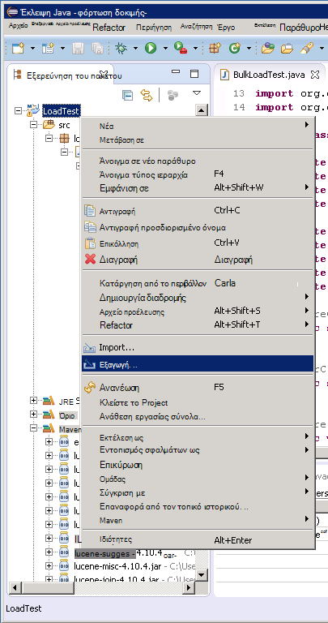

<properties
   pageTitle="Ανάπτυξη ένα δείγμα JMeter JUnit για σκοπούς δοκιμής επιδόσεων Elasticsearch | Microsoft Azure"
   description="Μάθετε πώς μπορείτε να χρησιμοποιήσετε ένα δείγμα JUnit για τη δημιουργία και αποστολή δεδομένων σε ένα σύμπλεγμα Elasticsearch."
   services=""
   documentationCenter="na"
   authors="dragon119"
   manager="bennage"
   editor=""
   tags=""/>

<tags
   ms.service="guidance"
   ms.devlang="na"
   ms.topic="article"
   ms.tgt_pltfrm="na"
   ms.workload="na"
   ms.date="09/22/2016"
   ms.author="masashin"/>
   
# Ανάπτυξη ένα δείγμα JMeter JUnit για σκοπούς δοκιμής Elasticsearch επιδόσεων

[AZURE.INCLUDE [pnp-header](../../includes/guidance-pnp-header-include.md)]

Σε αυτό το άρθρο αποτελεί [μέρος μιας σειράς](guidance-elasticsearch.md). 

Αυτό το έγγραφο περιγράφει πώς μπορείτε να δημιουργήσετε και να χρησιμοποιήσετε ένα δείγμα JUnit που μπορούν να δημιουργούν και αποστολή δεδομένων σε ένα σύμπλεγμα Elasticsearch ως μέρος του ένα σχέδιο δοκιμών JMeter. Αυτή η προσέγγιση παρέχει μια εξαιρετικά ευέλικτη προσέγγιση για τη φόρτωση δοκιμών που μπορούν να δημιουργούν μεγάλες ποσότητες δεδομένων δοκιμής χωρίς ανάλογα με τα αρχεία εξωτερικών δεδομένων.

> [AZURE.NOTE] Φόρτωση δοκιμών που χρησιμοποιείται για να αξιολογήσετε τις επιδόσεις της κατάποσης δεδομένων που περιγράφεται στην [απόδοση κατάποσης δεδομένων ρύθμισης για Elasticsearch](guidance-elasticsearch-tuning-data-ingestion-performance.md) έχουν συνταχθεί χρησιμοποιώντας αυτήν την προσέγγιση. Τις λεπτομέρειες του κώδικα JUnit περιγράφονται σε αυτό το έγγραφο.

Για την απόδοση κατάποσης δοκιμών δεδομένων, τον κωδικό JUnit ανάπτυξη χρησιμοποιώντας Έκλειψη (Mars) και εξαρτήσεις έχουν επιλυθεί με τη χρήση Maven. Οι ακόλουθες διαδικασίες περιγράφουν τη διαδικασία βήμα προς βήμα για την εγκατάσταση του Έκλειψη, τη ρύθμιση των παραμέτρων Maven, τη δημιουργία ενός ελέγχου JUnit και την ανάπτυξη αυτόν τον έλεγχο ως ένα δείγμα JUnit αίτησης σε δοκιμή JMeter.

> [AZURE.NOTE] Για λεπτομερείς πληροφορίες σχετικά με τη δομή και ρύθμιση παραμέτρων για το περιβάλλον δοκιμής, ανατρέξτε στο θέμα [Δημιουργία σε περιβάλλον δοκιμής επιδόσεων για Elasticsearch σε Azure][].

## Προαπαιτούμενα στοιχεία κατά την εγκατάσταση

Θα χρειαστεί του [Περιβάλλοντος χρόνου εκτέλεσης Java](http://www.java.com/en/download/ie_manual.jsp) στον υπολογιστή σας στην ανάπτυξη.
Θα πρέπει επίσης να εγκαταστήσετε το [Έκλειψη IDE για τους προγραμματιστές Java](https://www.eclipse.org/downloads/index.php?show_instructions=TRUE).

> [AZURE.NOTE] Εάν χρησιμοποιείτε το πρωτότυπο Εικονική JMeter που περιγράφονται στο θέμα [Δημιουργία σε περιβάλλον δοκιμής επιδόσεων για Elasticsearch σε Azure][] ως περιβάλλον ανάπτυξής σας, κάντε λήψη της έκδοσης 32 Bit των Windows από το πρόγραμμα εγκατάστασης Έκλειψη.

## Δημιουργία ενός έργου δοκιμής JUnit για σκοπούς δοκιμής Elasticsearch φόρτωση

Ξεκινήστε το IDE Έκλειψη Εάν δεν εκτελείται ήδη και, στη συνέχεια, κλείστε τη σελίδα **υποδοχής** .  Στο μενού **αρχείο** , κάντε κλικ στην επιλογή και, στη συνέχεια, κάντε κλικ στην επιλογή **Java Project**.

Στο παράθυρο **Νέου έργου Java** , πληκτρολογήστε ένα όνομα έργου, επιλέξτε **Χρήση προεπιλογής JRE**και, στη συνέχεια, κάντε κλικ στο κουμπί **Τέλος**.

Στο παράθυρο της **Εξερεύνησης πακέτου** , αναπτύξτε τον κόμβο με το όνομα μετά το έργο σας. Επαληθεύστε ότι περιέχει ένα φάκελο που ονομάζεται **src** και μια αναφορά σε JRE που καθορίσατε.

Κάντε δεξί κλικ στο φάκελο **src** , κάντε κλικ στην επιλογή **Δημιουργία**και, στη συνέχεια, κάντε κλικ στην επιλογή **JUnit δοκιμαστικής υπόθεσης**.

Στο παράθυρο **νέας υπόθεσης δοκιμής JUnit** , επιλέξτε **νέα 4 Junit δοκιμής**, πληκτρολογήστε ένα όνομα για το πακέτο (αυτό μπορεί να είναι το ίδιο με το όνομα του έργου, παρόλο που από σύμβαση θα πρέπει να ξεκινά με ένα γράμμα πεζά), ένα όνομα για τη δοκιμή τάξης και επιλέξτε τις επιλογές που δημιουργούν τη μέθοδο στελέχη απαιτείται για τον έλεγχο. Αφήστε κενό το πλαίσιο **κλάσης υπό δοκιμή** και, στη συνέχεια, κάντε κλικ στο κουμπί **Τέλος**.

Εάν εμφανιστεί το παρακάτω παράθυρο διαλόγου **νέας υπόθεσης δοκιμής JUnit** , ενεργοποιήστε την επιλογή για να προσθέσετε στη βιβλιοθήκη JUnit 4 τη διαδρομή Δόμηση και, στη συνέχεια, κάντε κλικ στο κουμπί **OK**. 

Επαληθεύστε ότι ο κωδικός σκελετό για τη δοκιμή JUnit δημιουργείται και εμφανίζεται στο παράθυρο του προγράμματος επεξεργασίας Java.

Στην **Εξερεύνηση των πακέτου**, κάντε δεξί κλικ στον κόμβο για το έργο σας, κάντε κλικ στην επιλογή **Ρύθμιση παραμέτρων**και, στη συνέχεια, κάντε κλικ στην επιλογή **Μετατροπή σε Maven έργου**.

> [AZURE.NOTE]Χρήση Maven παρέχει τη δυνατότητα με πιο εύκολη διαχείριση εξωτερικές εξαρτήσεις (όπως τις βιβλιοθήκες προγράμματος-πελάτη Elasticsearch Java) εξαρτάται από ένα έργο.

Στο παράθυρο διαλόγου **Δημιουργία νέου POM** , στην αναπτυσσόμενη λίστα **συσκευασία** , επιλέξτε **βάζο**και, στη συνέχεια, κάντε κλικ στο κουμπί **Τέλος**.

Το παράθυρο που εμφανίζεται κάτω από το πρόγραμμα επεξεργασίας (POM) μοντέλο αντικειμένου έργου μπορεί να εμφανίσει την προειδοποίηση "Δόμηση διαδρομή Καθορίζει περιβάλλον εκτέλεσης J2SE 1.5. Υπάρχουν χωρίς JREs εγκατεστημένο στο χώρο εργασίας που είναι απολύτως συμβατά με αυτό το περιβάλλον", ανάλογα με την έκδοση της Java είναι εγκατεστημένο στον υπολογιστή σας στην ανάπτυξη. Εάν έχετε μια έκδοση του Java που είναι μεταγενέστερη από την έκδοση 1,5 μπορείτε να αγνοήσετε αυτήν την προειδοποίηση.

Στο πρόγραμμα επεξεργασίας POM, αναπτύξτε το στοιχείο **Ιδιότητες** και, στη συνέχεια, κάντε κλικ στην επιλογή **Δημιουργία**.

Στο παράθυρο διαλόγου **Προσθήκη ιδιοτήτων** , στο πλαίσιο **όνομα** , πληκτρολογήστε *es.version*, στο πλαίσιο **τιμή** πληκτρολογήστε *1.7.2*και, στη συνέχεια, κάντε κλικ στο κουμπί **OK**. Αυτή είναι η έκδοση της βιβλιοθήκης του προγράμματος-πελάτη Elasticsearch Java για να χρησιμοποιήσετε (αυτή η έκδοση μπορεί να αντικατασταθεί στο μέλλον και τον ορισμό της έκδοσης ως ιδιότητα POM και αναφορά σε αυτήν την ιδιότητα σε κάποιο άλλο σημείο μέσα στο έργο σας επιτρέπει την έκδοση να αλλάξει γρήγορα.)

Κάντε κλικ στην καρτέλα **εξαρτήσεις** στη βάση του προγράμματος επεξεργασίας POM και, στη συνέχεια, κάντε κλικ στο κουμπί **Προσθήκη** δίπλα στη λίστα **εξαρτήσεις** .

Στο παράθυρο διαλόγου **Επιλέξτε εξάρτηση** , στο πλαίσιο **Αναγνωριστικό ομάδας** πληκτρολογήστε *org.elasticsearch*, στο πλαίσιο **Αντικείμενο Id** , πληκτρολογήστε *elasticsearch*, στο πλαίσιο, πληκτρολογήστε **την έκδοση** * \${es.version}*, και, στη συνέχεια, κάντε κλικ στο **κουμπί OK**. Πληροφορίες σχετικά με τη βιβλιοθήκη προγράμματος-πελάτη Java Elasticsearch παραμένει στο online Maven κεντρικό αποθετήριο και αυτή η ρύθμιση παραμέτρων θα λαμβάνει αυτόματα στη βιβλιοθήκη και τις εξαρτήσεις όταν δημιουργηθεί το έργο.

Στο μενού **αρχείο** , κάντε κλικ στην επιλογή **Αποθήκευση όλων**. Αυτή η ενέργεια θα αποθηκεύσετε και δημιουργήστε το έργο, τη λήψη των εξαρτήσεων που καθορίζεται από Maven. Επιβεβαιώστε ότι το φάκελο Maven εξαρτήσεις εμφανίζεται στην Εξερεύνηση πακέτο. Ανάπτυξη αυτόν το φάκελο για να προβάλετε τα αρχεία βάζο που έχουν ληφθεί για την υποστήριξη της βιβλιοθήκης του προγράμματος-πελάτη Elasticsearch Java.

## Εισαγωγή υπάρχοντος έργου δοκιμής JUnit σε Έκλειψη

Αυτή η διαδικασία προϋποθέτει ότι έχετε λάβει ένα έργο Maven που δημιουργήθηκε με τη χρήση Έκλειψη προηγουμένως.

Ξεκινήστε το Έκλειψη IDE. Στο μενού **αρχείο** , κάντε κλικ στην επιλογή **Εισαγωγή**.

Στο παράθυρο **Επιλέξτε** , αναπτύξτε το φάκελο **Maven** , κάντε κλικ **Υπάρχοντα Maven έργα**και, στη συνέχεια, κάντε κλικ στο κουμπί **Επόμενο**.

Στο παράθυρο **Maven έργα** , καθορίστε το φάκελο κρατώντας πατημένο το έργο (το φάκελο που περιέχει το αρχείο pom.xml), κάντε κλικ στο κουμπί **Επιλογή όλων**και, στη συνέχεια, κάντε κλικ στο κουμπί **Τέλος**.

Στο παράθυρο της **Εξερεύνησης πακέτου** , αναπτύξτε τον κόμβο που αντιστοιχεί στο έργο σας. Βεβαιωθείτε ότι το έργο περιέχει ένα φάκελο που ονομάζεται **src**. Αυτός ο φάκελος περιέχει τον πηγαίο κώδικα για τον έλεγχο JUnit. Το project μπορεί να είναι μεταγλωττιστεί και να αναπτυχθεί ακολουθώντας τις παρακάτω οδηγίες.

## Για την ανάπτυξη ενός ελέγχου JUnit στον JMeter

Αυτή η διαδικασία προϋποθέτει ότι έχετε δημιουργήσει ένα έργο με το όνομα LoadTest που περιέχει ένα εκπαιδευτικό JUnit δοκιμής με το όνομα `BulkLoadTest.java` που αποδέχεται παραμέτρους μεταβιβάζεται στο ως μία συμβολοσειρά κατασκευή (αυτό είναι το μηχανισμό που αναμένει JMeter).

Στο IDE Έκλειψη, στην **Εξερεύνηση πακέτου**, κάντε δεξί κλικ στον κόμβο του έργου και, στη συνέχεια, κάντε κλικ στην επιλογή **Εξαγωγή**.

Στον **"Οδηγό εξαγωγής"**, στη σελίδα **Επιλέξτε** , αναπτύξτε τον κόμβο **Java** , κάντε κλικ στην επιλογή **ΒΆΖΩΝ αρχείο**και, στη συνέχεια, κάντε κλικ στο κουμπί **Επόμενο**.

Στη σελίδα **ΒΆΖΩΝ προδιαγραφή αρχείου** , στο παράθυρο διαλόγου **Επιλέξτε τους πόρους για να εξαγάγετε** , αναπτύξτε το έργο καταργήστε την επιλογή **.project**, και καταργήστε την επιλογή **pom.xml**. Στο πλαίσιο **ΒΆΖΩΝ αρχείου** , δώστε ένα όνομα αρχείου και μια θέση για το ΒΆΖΟ (αυτό θα πρέπει να δοθεί την επέκταση αρχείου .jar) και, στη συνέχεια, κάντε κλικ στο κουμπί **Τέλος**.

Χρησιμοποιώντας την Εξερεύνηση των Windows, αντιγράψτε το αρχείο ΒΆΖΟ που μόλις δημιουργήσατε να την κύρια JVM JMeter και αποθηκεύστε το σε apache-jmeter-2.13\\βιβλιοθήκης\\junit φάκελο κάτω από το φάκελο όπου έχετε εγκαταστήσει JMeter (ανατρέξτε στη διαδικασία "Δημιουργία την JMeter κύρια εικονική μηχανή" στη [Δημιουργία σε περιβάλλον δοκιμής επιδόσεων για Elasticsearch σε Azure](guidance-elasticsearch-creating-performance-testing-environment.md) για περισσότερες πληροφορίες.)

Επιστρέψτε στο Έκλειψη, αναπτύξτε το παράθυρο της **Εξερεύνησης πακέτου** και σημειώστε όλα τα αρχεία ΒΆΖΟ και τις θέσεις που περιλαμβάνεται στο φάκελο Maven εξαρτήσεις για το έργο. Σημειώστε ότι τα αρχεία που εμφανίζονται στην παρακάτω εικόνα μπορεί να διαφέρει, ανάλογα με την έκδοση του Elasticsearch που χρησιμοποιείτε:

Χρησιμοποιώντας την Εξερεύνηση των Windows, αντιγράψτε κάθε αρχείο ΒΆΖΟ στα οποία γίνεται αναφορά στο φάκελο Maven εξαρτήσεις για το 2.13 jmeter apache\\βιβλιοθήκης\\junit φάκελο στην την κύρια εικονική Μηχανή JMeter.

Εάν η βιβλιοθήκη\\junit φάκελος ήδη περιέχει παλαιότερες εκδόσεις του ΒΆΖΟ αυτών των αρχείων, στη συνέχεια, καταργήστε τις. Εάν παραμένουν στη θέση, στη συνέχεια, η δοκιμή JUnit ενδέχεται να μην λειτουργούν όπως ήταν δυνατή η επίλυση για να το λάθος βάζα των αναφορών.

Στο υπόδειγμα JMeter Εικονική, διακόψτε JMeter εάν εκτελείται τη συγκεκριμένη στιγμή.  Έναρξη JMeter.  Στο JMeter, κάντε δεξιό κλικ στο **Πρόγραμμα δοκιμών**, κάντε κλικ στην επιλογή **Προσθήκη**, κάντε κλικ στην επιλογή **νήματα (χρήστες)**και, στη συνέχεια, κάντε κλικ στην **Ομάδα νήματος**.

Κάτω από τον κόμβο **Πρόγραμμα δοκιμών** , κάντε δεξί κλικ **Νήματος ομάδα**, κάντε κλικ στην επιλογή **Προσθήκη**, κάντε κλικ στην επιλογή **δείγματος**και, στη συνέχεια, κάντε κλικ στην επιλογή **Αίτηση JUnit**.

Στη σελίδα **JUnit αίτηση** , επιλέξτε **Αναζήτηση για σχόλια JUnit4 (αντί για JUnit 3)**. Στην αναπτυσσόμενη λίστα **όνομα κλάσης** , επιλέξτε την κλάση JUnit φόρτωσης δοκιμής (θα εμφανίζεται στη φόρμα * &lt;πακέτου&gt;.&lt; κλάση&gt;*), στη **Μέθοδο δοκιμή** μέθοδος δοκιμής αναπτυσσόμενη λίστα, επιλέξτε το JUnit (αυτή είναι η μέθοδος που πραγματικά εκτελεί την εργασία που σχετίζεται με τον έλεγχο και θα πρέπει να έχουν επισημανθεί με το *@test* σχολιασμού του έργου Έκλειψη), και εισαγάγετε τις τιμές περνούν στην κατασκευή στο πλαίσιο **Ετικέτα συμβολοσειρά κατασκευή** . Οι λεπτομέρειες που φαίνεται στην παρακάτω εικόνα είναι απλώς παραδείγματα; το **όνομα κλάσης**, * *Μέθοδος δοκιμής*και * *Κατασκευή συμβολοσειρά ετικέτα** πιθανότατα θα διαφέρουν από αυτά τα φαίνεται.

Εάν την τάξη σας δεν εμφανίζεται στη λίστα **όνομα κλάσης** αναπτυσσόμενη λίστα, αυτό πιθανώς σημαίνει ότι το ΒΆΖΟ δεν έχει εξαχθεί σωστά ή δεν έχει τοποθετηθεί στο το βιβλιοθήκης\\junit φάκελος ή ορισμένα από τα εξαρτημένα βάζα των λείπουν από το βιβλιοθήκης\\junit φακέλου. Αν συμβεί αυτό, κάντε εξαγωγή του έργου από Έκλειψη ξανά και βεβαιωθείτε ότι έχετε επιλέξει τον πόρο **src** , αντιγράψτε το ΒΆΖΟ το βιβλιοθήκης\\junit φακέλου, και, στη συνέχεια, βεβαιωθείτε ότι έχετε αντιγράψει όλα τα εξαρτημένα βάζα των που αναγράφονται, Maven στο φάκελο βιβλιοθήκης.

Κλείστε το JMeter. Δεν χρειάζεται να αποθηκεύσετε το σχέδιο δοκιμής.  Αντιγράψτε το αρχείο ΒΆΖΟ που περιέχει την κλάση JUnit δοκιμή για να το /home/&lt;username&gt;/apache-jmeter-2.13/lib/junit φακέλου σε κάθε μία από τη δευτερεύουσα ΣΠΣ JMeter (*&lt;όνομα χρήστη&gt; * είναι το όνομα του χρήστης με δικαιώματα διαχειριστή που καθορίσατε όταν δημιουργήσατε την εικονική Μηχανή, ανατρέξτε στο θέμα η διαδικασία "Δημιουργία τις JMeter δευτερεύουσες εικονικές μηχανές" στη [Δημιουργία σε περιβάλλον δοκιμής επιδόσεων για Elasticsearch σε Azure](guidance-elasticsearch-creating-performance-testing-environment.md) για περισσότερες πληροφορίες.)

Αντιγράψτε τα εξαρτημένα αρχεία ΒΆΖΟ που απαιτούνται από την κλάση JUnit δοκιμή για να το /home/&lt;username&gt;/apache-jmeter-2.13/lib/junit φακέλου σε κάθε μία από τη δευτερεύουσα ΣΠΣ JMeter. Φροντίστε να πρώτα να καταργήσετε τυχόν παλαιότερες εκδόσεις αρχείων ΒΆΖΟ από αυτόν το φάκελο.

Μπορείτε να χρησιμοποιήσετε το `pscp` βοηθητικού προγράμματος για να αντιγράψετε αρχεία από έναν υπολογιστή Windows Linux.

[Δημιουργία μιας επιδόσεις περιβάλλοντος δοκιμής για Elasticsearch σε Azure]: guidance-elasticsearch-creating-performance-testing-environment.md
