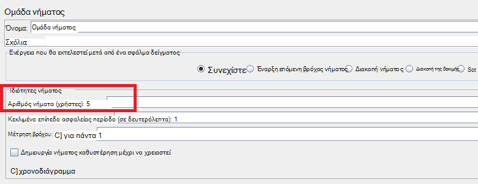
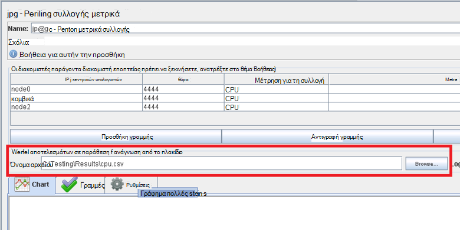
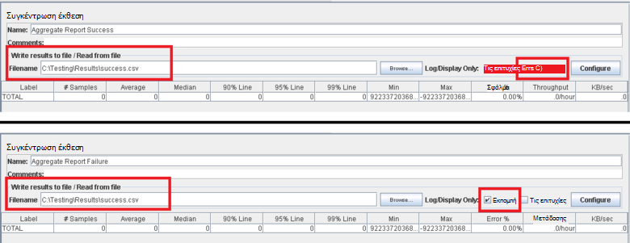
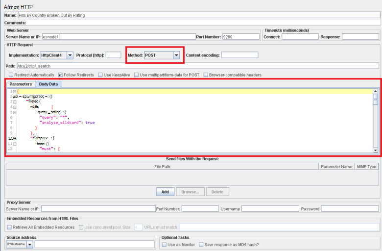

<properties
   pageTitle="Εφαρμογή ένα σχέδιο δοκιμών JMeter για Elasticsearch | Microsoft Azure"
   description="Πώς μπορείτε να εκτελέσετε επιδόσεων δοκιμών για Elasticsearch με JMeter."
   services=""
   documentationCenter="na"
   authors="dragon119"
   manager="bennage"
   editor=""
   tags=""/>

<tags
   ms.service="guidance"
   ms.devlang="na"
   ms.topic="article"
   ms.tgt_pltfrm="na"
   ms.workload="na"
   ms.date="09/22/2016"
   ms.author="masashin" />
   
# <a name="implementing-a-jmeter-test-plan-for-elasticsearch"></a>Εφαρμογή ένα σχέδιο δοκιμών JMeter για Elasticsearch

[AZURE.INCLUDE [pnp-header](../../includes/guidance-pnp-header-include.md)]

Σε αυτό το άρθρο αποτελεί [μέρος μιας σειράς](guidance-elasticsearch.md). 

Απόδοση δοκιμών που πραγματοποιούνται σε σχέση με Elasticsearch έχουν εφαρμοστεί με χρήση σχεδίων δοκιμής JMeter μαζί με τον κώδικα Java ενσωματώνονται δοκιμή JUnit για την εκτέλεση εργασιών, όπως η αποστολή δεδομένων σε σύμπλεγμα. Τα προγράμματα δοκιμής και JUnit κώδικα περιγράφονται στην [απόδοση κατάποσης δεδομένων ρύθμισης για Elasticsearch σε Azure][]και [συγκέντρωση δεδομένων ρύθμισης και επιδόσεις ερωτημάτων για Elasticsearch σε Azure][].

Ο σκοπός αυτού του εγγράφου είναι να συνοψίσετε την εμπειρία κλειδιού που αποκτήθηκε από η κατασκευή και εκτελεί αυτά δοκιμή προγράμματα. Η σελίδα [JMeter βέλτιστες πρακτικές](http://jmeter.apache.org/usermanual/best-practices.html) στην τοποθεσία Web του Apache JMeter περιέχει περισσότερα γενικευμένη συμβουλές σχετικά με τη χρήση JMeter αποτελεσματική.

## <a name="implementing-a-jmeter-test-plan"></a>Εφαρμογή ένα σχέδιο δοκιμών JMeter

Λίστα που ακολουθεί συνοψίζει τα στοιχεία που πρέπει να λάβετε υπόψη κατά τη δημιουργία ένα σχέδιο δοκιμών JMeter:

- Δημιουργήστε μια ομάδα ξεχωριστό νήμα για κάθε δοκιμή που θέλετε να εκτελέσετε. Δοκιμή μπορούν να περιέχουν πολλά βήματα, όπως ελεγκτές λογικής, χρονοδιακόπτες, πριν από και μετά τη επεξεργαστές, δειγματολήπτες και ακροατών.

- Αποφύγετε τη δημιουργία πάρα πολλά νήματα σε μια ομάδα νήματος. Υπερβολικά μεγάλο αριθμό νήματα θα προκαλέσει JMeter να αποτύχει με "Έξοδος από το μνήμης" εξαιρέσεις. Είναι καλύτερη για να προσθέσετε περισσότερες δευτερεύουσες διακομιστές JMeter κάθε μικρότερο αριθμό νήματα από επιχειρήσετε να εκτελέσετε μεγάλου αριθμού νήματα σε ένα διακομιστή JMeter εκτελείται.



- Για να αξιολογήσετε τις επιδόσεις του συμπλέγματος, ενσωμάτωση της προσθήκης [Perfmon μετρικά συλλογής](http://jmeter-plugins.org/wiki/PerfMon/) σε το σχέδιο δοκιμής. Αυτή είναι μια υπηρεσία ακρόασης JMeter που είναι διαθέσιμα ως μία από την τυπική προσθήκες JMeter. Αποθήκευση των δεδομένων επιδόσεων ανεπεξέργαστα σε ένα σύνολο αρχείων σε μορφή τιμών διαχωρισμένων με κόμμα (CSV) και να τις επεξεργαστείτε όταν ολοκληρωθεί η δοκιμή. Αυτό είναι πιο αποτελεσματική και επιβάλλει λιγότερο JMeter επιβαρύνει από επιχειρήσετε να επεξεργάζονται τα δεδομένα ως καταγραφής. 



Μπορείτε να χρησιμοποιήσετε ένα εργαλείο όπως το Excel για να εισαγάγετε τα δεδομένα και να δημιουργήσετε μια περιοχή γραφημάτων για σκοπούς ανάλυσης.

Εξετάστε το ενδεχόμενο να καταγράφετε τις ακόλουθες πληροφορίες:

- Χρήση της CPU για κάθε κόμβο του συμπλέγματος Elasticsearch.

- Διαβάστε τον αριθμό των byte ανά δευτερόλεπτο από δίσκο για κάθε κόμβο.

- Εάν είναι δυνατόν, το ποσοστό του χρόνου της CPU που αναλώθηκε σε αναμονή εισόδου/εξόδου θα εκτελείται σε κάθε κόμβο. Αυτό δεν είναι πάντα δυνατή για το Windows ΣΠΣ, αλλά για Linux μπορείτε να δημιουργήσετε μια προσαρμοσμένη μέτρηση (ένα μετρικό ΕΚΤΈΛΕΣΗΣ) που εκτελεί την παρακάτω εντολή κελύφους για να καλέσετε *vmstat* σε έναν κόμβο:

```Shell
sh:-c:vmstat 1 5 | awk 'BEGIN { line=0;total=0;}{line=line+1;if(line&gt;1){total=total+\$16;}}END{print total/4}'
```

Πεδίο 16 στο αποτέλεσμα από *vmstat* περιέχει το χρόνο της CPU που αναλώθηκε σε αναμονή εισόδου/εξόδου. Για περισσότερες πληροφορίες σχετικά με τη λειτουργία αυτήν τη δήλωση, βλέπετε την [εντολή vmstat](http://linuxcommand.org/man_pages/vmstat8.html).

- Τον αριθμό των byte που αποστέλλονται και λαμβάνονται μέσω του δικτύου σε κάθε κόμβο.

- Χρησιμοποιήστε ξεχωριστή ακροατών συγκέντρωση έκθεση για να καταγράψετε τις επιδόσεις και τη συχνότητα λειτουργιών για επιτυχή και απέτυχε. Καταγραφή επιτυχίας και αποτυχίας δεδομένων σε διαφορετικά αρχεία.



- Διατήρηση κάθε υπόθεση δοκιμής JMeter τόσο απλή όσο το δυνατόν πιο για να μπορέσετε να απευθείας συσχετισμός απόδοσης με συγκεκριμένη δοκιμαστική ενέργειες. Για τις περιπτώσεις δοκιμής που απαιτούν περίπλοκη λογική, εξετάστε το ενδεχόμενο να ενσωματώνει αυτή η λογική σε δοκιμή JUnit και χρησιμοποιήστε το δείγμα JUnit αίτηση JMeter για να εκτελέσετε τον έλεγχο.

- Χρησιμοποιήστε το δειγμάτων αίτηση HTTP για να εκτελέσετε λειτουργίες HTTP, όπως η ΛΉΨΗ, ΔΗΜΟΣΊΕΥΣΗ, ΤΟΠΟΘΈΤΗΣΗ ή ΔΙΑΓΡΑΦΉ. Για παράδειγμα, μπορείτε να εκτελέσετε αναζητήσεις Elasticsearch χρησιμοποιώντας ένα ερώτημα ΔΗΜΟΣΊΕΥΣΗ και παρέχει τις λεπτομέρειες ερωτήματος στο πλαίσιο *Σώμα δεδομένων* :



- Για διευκόλυνση της επαναληψιμότητας και εκ νέου χρήση, ρυθμίσετε τις παραμέτρους των δοκιμή σχεδίων δοκιμής JMeter. Μπορείτε να χρησιμοποιήσετε δέσμες ενεργειών για να αυτοματοποιήσετε την εκτέλεση του προγράμματος δοκιμής.

## <a name="implementing-a-junit-test"></a>Εφαρμογή ενός ελέγχου JUnit

Μπορείτε να ενσωματώσετε σύνθετες κώδικα σε ένα σχέδιο δοκιμών JMeter με τη δημιουργία ενός ή περισσότερων JUnit δοκιμές. Μπορείτε να συντάξετε μια δοκιμαστική JUnit χρησιμοποιώντας μια Java ενσωματωμένο περιβάλλον ανάπτυξης (IDE) όπως Έκλειψη. [Ανάπτυξη ένα δείγμα JMeter JUnit για σκοπούς δοκιμής επιδόσεων Elasticsearch][] παρέχει πληροφορίες σχετικά με τον τρόπο για να ρυθμίσετε ένα περιβάλλον ανάπτυξης κατάλληλο.

Η παρακάτω λίστα συνοψίζει ορισμένες βέλτιστες πρακτικές που θα πρέπει να ακολουθήσετε κατά τη σύνταξη του κώδικα για μια δοκιμαστική JUnit:

- Χρησιμοποιήστε την κατασκευή κλάσης δοκιμή για να μεταβιβάσετε παράμετροι προετοιμασίας σε τον έλεγχο. JMeter να χρησιμοποιήσετε μια κατασκευή που τίθεται σε ένα όρισμα μία συμβολοσειρά. Στην κατασκευή, ανάλυσης αυτό το όρισμα σε τα μεμονωμένα στοιχεία, όπως φαίνεται από το ακόλουθο παράδειγμα κώδικα:

```Java
private String hostName = "";
private String indexName = "";
private String typeName = "";
private int port = 0;
private String clusterName = "";
private int itemsPerBatch = 0;

/\* JUnit test class constructor \*/
public ElasticsearchLoadTest2(String params) {
    /* params is a string containing a set of comma separated values for:
        hostName
        indexName
        typeName
        port
        clustername
        itemsPerBatch
    */

    /* Parse the parameter string into an array of string items */
    String delims = "\[ \]\*,\[ \]\*"; // comma surrounded by zero or more spaces
    String\[\] items = params.split(delims);

    /* Note: Parameter validation code omitted */

    /* Use the parameters to populate variables used by the test */
    hostName = items[0];
    indexName = items[1];
    typeName = items[2];
    port = Integer.parseInt(items[3]);
    clusterName = items[4];
    itemsPerBatch = Integer.parseInt(items[5]);

    if(itemsPerBatch == 0)
        itemsPerBatch = 1000;
}
```

- Αποφύγετε λειτουργίες εισόδου/εξόδου ή άλλες λειτουργίες χρονοβόρα την κατασκευή ή κλάσης δοκιμή της εγκατάστασης, επειδή εκτελούν κάθε φορά που εκτελείται η δοκιμή JUnit. (Η ίδια δοκιμή JUnit να εκτελεστεί χιλιάδες πολλές φορές για κάθε δοκιμή επιδόσεων εκτελούνται από JMeter.)

- Εξετάστε το ενδεχόμενο χρήσης εφάπαξ ρύθμισης για την προετοιμασία ακριβό δοκιμαστικής υπόθεσης.

- Εάν η δοκιμή απαιτεί μεγάλου αριθμού παραμέτρους εισόδου, αποθήκευση πληροφοριών ρύθμισης παραμέτρων δοκιμής σε ένα αρχείο ρύθμισης παραμέτρων ξεχωριστή και μεταβιβάζουν στη θέση του αρχείου στην κατασκευή.

- Αποφύγετε την οριστική κωδικοποίησης διαδρομές αρχείων στον κώδικα δοκιμής φόρτωση. Αυτές μπορεί να προκαλέσει αποτυχίες λόγω διαφορές μεταξύ operating systems όπως Windows και Linux.

- Χρησιμοποιήστε διεκδικήσεων για να υποδείξετε αποτυχίες στο JUnit μέθοδοι δοκιμών ώστε να μπορείτε να παρακολουθείτε τους με JMeter και να τις χρησιμοποιήσετε ως ένα επαγγελματικά μετρικά. Εάν είναι δυνατόν, μεταβιβάζουν πίσω τις πληροφορίες σχετικά με την αιτία της αποτυχίας, όπως φαίνεται στην εικόνα με έντονη γραφή στο παρακάτω παράδειγμα κώδικα:

```Java
@Test
public void bulkInsertTest() throws IOException {
    ...
    BulkResponse bulkResponse = bulkRequest.execute().actionGet();
    assertFalse(
        bulkResponse.buildFailureMessage(), bulkResponse.hasFailures());
        ...
}
```


[Running Elasticsearch on Azure]: guidance-elasticsearch-running-on-azure.md
[Ρύθμιση επιδόσεων κατάποσης δεδομένων για Elasticsearch σε Azure]: guidance-elasticsearch-tuning-data-ingestion-performance.md
[Ανάπτυξη ένα δείγμα JMeter JUnit για σκοπούς δοκιμής Elasticsearch επιδόσεων]: guidance-elasticsearch-deploying-jmeter-junit-sampler.md
[Ρύθμιση δεδομένων συνάθροισης και επιδόσεις ερωτημάτων για Elasticsearch στο Azure]: guidance-elasticsearch-tuning-data-aggregation-and-query-performance.md
