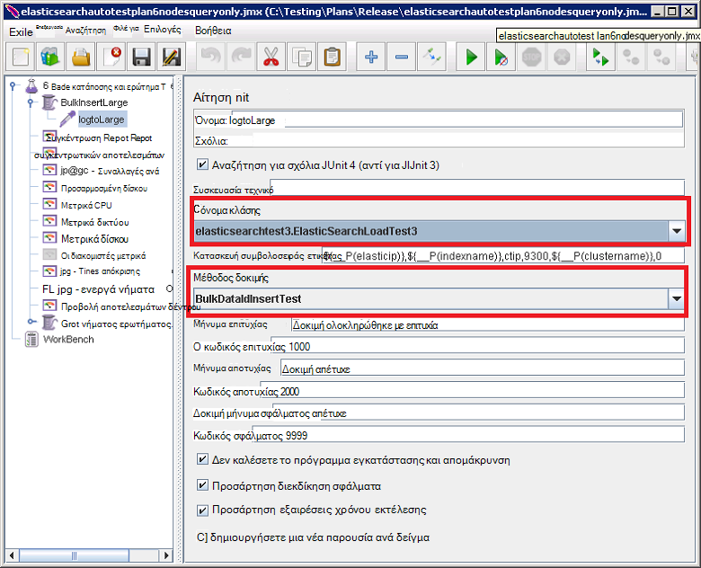

<properties
   pageTitle="Εκτελεί την αυτοματοποιημένη δοκιμές επιδόσεων Elasticsearch | Microsoft Azure"
   description="Περιγραφή πώς μπορείτε να εκτελέσετε τις δοκιμές επιδόσεων στο δικό σας περιβάλλον."
   services=""
   documentationCenter="na"
   authors="dragon119"
   manager="bennage"
   editor=""
   tags=""/>

<tags
   ms.service="guidance"
   ms.devlang="na"
   ms.topic="article"
   ms.tgt_pltfrm="na"
   ms.workload="na"
   ms.date="09/22/2016"
   ms.author="masashin"/>
   
# <a name="running-the-automated-elasticsearch-performance-tests"></a>Εκτελεί την αυτοματοποιημένη δοκιμές επιδόσεων Elasticsearch

[AZURE.INCLUDE [pnp-header](../../includes/guidance-pnp-header-include.md)]

Σε αυτό το άρθρο αποτελεί [μέρος μιας σειράς](guidance-elasticsearch.md). 

Τα έγγραφα [ρύθμισης δεδομένων επιδόσεων κατάποσης για Elasticsearch σε Azure] και [συγκέντρωση δεδομένων ρύθμισης και επιδόσεις ερωτημάτων για Elasticsearch σε Azure] περιγράφουν ένα πλήθος δοκιμές επιδόσεων που έχουν εκτελεστεί σε ένα σύμπλεγμα Elasticsearch δείγμα.

Αυτές οι δοκιμές έχουν δέσμης ενεργειών για να ενεργοποιήσετε τους πρέπει να εκτελεστούν σε μη αυτόματο τρόπο. Αυτό το έγγραφο περιγράφει πώς μπορείτε να επαναλάβετε τις δοκιμές στο δικό σας περιβάλλον.

## <a name="prerequisites"></a>Προαπαιτούμενα στοιχεία

Αυτοματοποιημένη δοκιμών που απαιτούν τα ακόλουθα στοιχεία:

-  Ένα σύμπλεγμα Elasticsearch.

- Μια JMeter περιβάλλον εγκατάσταση όπως περιγράφεται από το έγγραφο [δημιουργώντας ένα περιβάλλον δοκιμής επιδόσεων για Elasticsearch σε Azure].

- [Python 3.5.1](https://www.python.org/downloads/release/python-351/) εγκατεστημένο στο υπόδειγμα JMeter Εικονική.


## <a name="how-the-tests-work"></a>Πώς λειτουργούν οι δοκιμές
Τους ελέγχους που εκτελούνται με χρήση JMeter. Ένα κύριο διακομιστή JMeter φορτώνει ένα σχέδιο δοκιμών και μεταβιβάζει σε ένα σύνολο JMeter οι δευτερεύουσες διακομιστές που εκτελούν στην πραγματικότητα τις δοκιμές. Ο διακομιστής κύρια JMeter συντεταγμένες τους διακομιστές δευτερεύουσες JMeter και συγκεντρώνει τα αποτελέσματα.

Παρέχονται τα ακόλουθα προγράμματα δοκιμής:

* [elasticsearchautotestplan3nodes.jmx](https://github.com/mspnp/azure-guidance/blob/master/ingestion-and-query-tests/templates/elasticsearchautotestplan3nodes.jmx). Εκτελείται η δοκιμή κατάποσης πάνω από ένα σύμπλεγμα 3-κόμβο.

* [elasticsearchautotestplan6nodes.jmx](https://github.com/mspnp/azure-guidance/blob/master/ingestion-and-query-tests/templates/elasticsearchautotestplan6nodes.jmx). Εκτελείται η δοκιμή κατάποσης πάνω από ένα σύμπλεγμα 6-κόμβο.

* [elasticsearchautotestplan6qnodes.jmx](https://github.com/mspnp/azure-guidance/blob/master/ingestion-and-query-tests/templates/elasticsearchautotestplan6qnodes.jmx). Εκτελείται η δοκιμή κατάποσης και ερώτημα πάνω από ένα σύμπλεγμα 6-κόμβο.

* [elasticsearchautotestplan6nodesqueryonly.jmx](https://github.com/mspnp/azure-guidance/blob/master/ingestion-and-query-tests/templates/elasticsearchautotestplan6nodesqueryonly.jmx). Εκτελείται η δοκιμή ερωτήματος μόνο πάνω από ένα σύμπλεγμα 6-κόμβο.


Μπορείτε να χρησιμοποιήσετε αυτές τις δοκιμή σχέδια ως βάση για τη δική σας σενάρια, εάν χρειάζεστε περισσότερες ή λιγότερες κόμβους.

Τα προγράμματα δοκιμής Χρησιμοποιήστε ένα δείγμα JUnit αίτηση για να δημιουργήσετε και να αποστείλετε τα δεδομένα δοκιμής. Το σχέδιο δοκιμών JMeter δημιουργεί και εκτελεί αυτό το δείγμα και παρακολουθεί την κάθε έναν από τους κόμβους Elasticsearch για δεδομένα επιδόσεων.  

## <a name="building-and-deploying-the-junit-jar-and-dependencies"></a>Δημιουργία και ανάπτυξη του JUnit ΒΆΖΩΝ και εξαρτήσεις
Πριν από την εκτέλεση δοκιμών επιδόσεων που πρέπει να κάνετε λήψη, μεταγλώττιση και ανάπτυξη JUnit δοκιμών που βρίσκεται κάτω από το φάκελο επιδόσεων/junitcode. Αυτές οι δοκιμές αναφέρονται σύμφωνα με το πρόγραμμα JMeter δοκιμής. Για περισσότερες πληροφορίες, ανατρέξτε στη διαδικασία "Εισαγωγή ένα υπάρχον έργο δοκιμής JUnit σε Έκλειψη" στο έγγραφο [για την ανάπτυξη ένα δείγμα JMeter JUnit για σκοπούς δοκιμής Elasticsearch επιδόσεων].

Υπάρχουν δύο εκδόσεις των δοκιμών που JUnit: 

- [Elasticsearch1.73](https://github.com/mspnp/azure-guidance/tree/master/ingestion-and-query-tests/junitcode/elasticsearch1.73). Χρησιμοποιήστε αυτόν τον κωδικό για την εκτέλεση των δοκιμών κατάποσης. Αυτές οι δοκιμές Χρησιμοποιήστε Elasticsearch 1.73.

- [Elasticsearch2](https://github.com/mspnp/azure-guidance/tree/master/ingestion-and-query-tests/junitcode/elasticsearch2). Χρησιμοποιήστε αυτόν τον κωδικό για την εκτέλεση των δοκιμών ερωτήματος. Αυτές οι δοκιμές Χρησιμοποιήστε Elasticsearch 2.1 και νεότερες εκδόσεις.

Αντιγράψτε το κατάλληλο αρχείο αρχειοθέτησης (ΒΆΖΟ) Java μαζί με τα υπόλοιπα από τις εξαρτήσεις υπολογιστές σας JMeter. Η διαδικασία περιγράφεται σε [ένα δείγμα JMeter JUnit για σκοπούς δοκιμής Elasticsearch επιδόσεων για την ανάπτυξη][]. 

> **Σημαντικό** Μετά την ανάπτυξη ενός ελέγχου JUnit, χρησιμοποιήστε JMeter φόρτωση και ρύθμιση παραμέτρων στα προγράμματα δοκιμής που αναφέρονται σε αυτόν τον έλεγχο JUnit και βεβαιωθείτε ότι η ομάδα νήματος BulkInsertLarge το σωστό αρχείο ΒΆΖΟ, όνομα κλάσης JUnit και μέθοδος δοκιμής:
> 
> 
> 
> Αποθηκεύστε τα προγράμματα ενημερωμένη δοκιμής πριν από την εκτέλεση των δοκιμών.

## <a name="creating-the-test-indexes"></a>Δημιουργία τα ευρετήρια δοκιμής
Κάθε δοκιμή εκτελεί κατάποση ή/και ερωτήματα σε σχέση με ένα ευρετήριο που καθορίζεται κατά την εκτέλεση της δοκιμής. Πρέπει να δημιουργήσετε το ευρετήριο με τα σχήματα που περιγράφεται στα προσαρτήματα στα έγγραφα της [ρύθμισης επιδόσεων κατάποσης δεδομένων για Elasticsearch σε Azure] και [συγκέντρωση δεδομένων ρύθμισης και επιδόσεις ερωτημάτων για Elasticsearch σε Azure] και να ρυθμίσετε τις παραμέτρους τους σύμφωνα με το σενάριό σας δοκιμής (τιμές doc ενεργοποίηση/απενεργοποίηση, πολλά αντίγραφα, κ.ο.κ.) Σημειώστε ότι τα προγράμματα δοκιμής λαμβάνεται ως δεδομένο ότι το ευρετήριο περιέχει ένα μόνο τύπο με το όνομα *ctip*.

## <a name="configuring-the-test-script-parameters"></a>Ρύθμιση παραμέτρων τις παραμέτρους δέσμης ενεργειών δοκιμής
Αντιγράψτε τα ακόλουθα αρχεία παράμετρο δέσμης ενεργειών δοκιμής στον υπολογιστή του διακομιστή JMeter:

* [run.properties](https://github.com/mspnp/azure-guidance/blob/master/ingestion-and-query-tests/run.properties). Αυτό το αρχείο Καθορίζει τον αριθμό των JMeter νήματα δοκιμή για να χρησιμοποιήσετε, τη διάρκεια της δοκιμής (σε δευτερόλεπτα), τη διεύθυνση IP του έναν κόμβο (ή μια μονάδα εξισορρόπησης φόρτου στο σύμπλεγμα Elasticsearch,) και το όνομα του συμπλέγματος:

  ```ini
  nthreads=3
  duration=300
  elasticip=<IP Address or DNS Name Here>
  clustername=<Cluster Name Here>
  ```
  
  Επεξεργαστείτε αυτό το αρχείο και καθορίστε τις κατάλληλες τιμές για τον έλεγχο και σύμπλεγμα.

* [ερώτημα-ρύθμιση παραμέτρων-win.ini](https://github.com/mspnp/azure-guidance/blob/master/ingestion-and-query-tests/query-config-win.ini) και [ερωτήματος-ρύθμιση παραμέτρων-nix.ini](https://github.com/mspnp/azure-guidance/blob/master/ingestion-and-query-tests/query-config-nix.ini). Αυτά τα δύο αρχεία περιέχουν τις ίδιες πληροφορίες; το αρχείο *win* έχει μορφοποιηθεί για τα ονόματα αρχείων των Windows και διαδικασίες και το αρχείο *nix* είναι μορφοποιημένο για τα ονόματα αρχείων Linux και διαδικασίες:

  ```ini
  [DEFAULT]
  debug=true #if true shows console logs.

  [RUN]
  pathreports=C:\Users\administrator1\jmeter\test-results\ #path where tests results are saved.
  jmx=C:\Users\administrator1\testplan.jmx #path to the JMeter test plan.
  machines=10.0.0.1,10.0.0.2,10.0.0.3 #IPs of the Elasticsearch data nodes separated by commas.
  reports=aggr,err,tps,waitio,cpu,network,disk,response,view #Name of the reports separated by commas.
  tests=idx1,idx2 #Elasticsearch index(es) name(s) to test, comma delimited if more than one.
  properties=run.properties #Name of the properties file.
  ```

  Επεξεργαστείτε αυτό το αρχείο για να καθορίσετε τις θέσεις των αποτελεσμάτων των δοκιμών, το όνομα του σχεδίου δοκιμών JMeter για να εκτελέσετε, τις διευθύνσεις IP από τους κόμβους δεδομένων Elasticsearch συλλέγετε μετρικών απόδοσης, τις αναφορές που περιέχουν τα δεδομένα ανεπεξέργαστα επιδόσεων που θα δημιουργηθεί, και το όνομα (ή ονόματα οριοθετημένο με κόμματα) από το index(es) υπό δοκιμή, εάν περισσότερες από μία , ελέγχους που θα εκτελείται ένα μετά το άλλο. Εάν το αρχείο run.properties βρίσκεται σε διαφορετικό φάκελο ή καταλόγου, καθορίστε την πλήρη διαδρομή του αρχείου.

## <a name="running-the-tests"></a>Εκτέλεση δοκιμών

* Αντιγράψτε το αρχείο [ερωτήματος-test.py](https://github.com/mspnp/azure-guidance/blob/master/ingestion-and-query-tests/query-test.py) στον υπολογιστή του διακομιστή JMeter, στον ίδιο φάκελο με τα αρχεία (ερωτήματος-ρύθμιση παραμέτρων-nix.ini) ερωτήματος-ρύθμιση παραμέτρων-win.ini και run.properties.

* Βεβαιωθείτε ότι jmeter.bat (Windows) ή jmeter.sh (Linux) είναι στην εκτελέσιμο διαδρομή για το περιβάλλον σας.

* Εκτελέστε τη δέσμη ενεργειών test.py ερωτήματος από τη γραμμή εντολών για την εκτέλεση των δοκιμών:

  ```cmd
  py query-test.py
  ```

* Όταν έχει ολοκληρωθεί ο έλεγχος, τα αποτελέσματα είναι αποθηκευμένα αρχεία (CSV) που καθορίζεται στο αρχείο ερωτήματος-ρύθμιση παραμέτρων-win.ini (ερωτήματος-ρύθμιση παραμέτρων-nix.ini) τιμή για το σύνολο των διαχωρισμένες με κόμματα. Μπορείτε να χρησιμοποιήσετε το Excel για την ανάλυση και γράφημα αυτών των δεδομένων.


[Ρύθμιση επιδόσεων κατάποσης δεδομένων για Elasticsearch σε Azure]: guidance-elasticsearch-tuning-data-ingestion-performance.md
[Ρύθμιση δεδομένων συνάθροισης και επιδόσεις ερωτημάτων για Elasticsearch στο Azure]: guidance-elasticsearch-tuning-data-aggregation-and-query-performance.md
[Δημιουργία μιας επιδόσεις περιβάλλοντος δοκιμής για Elasticsearch σε Azure]: guidance-elasticsearch-creating-performance-testing-environment.md
[Ανάπτυξη ένα δείγμα JMeter JUnit για σκοπούς δοκιμής Elasticsearch επιδόσεων]: guidance-elasticsearch-deploying-jmeter-junit-sampler.md
