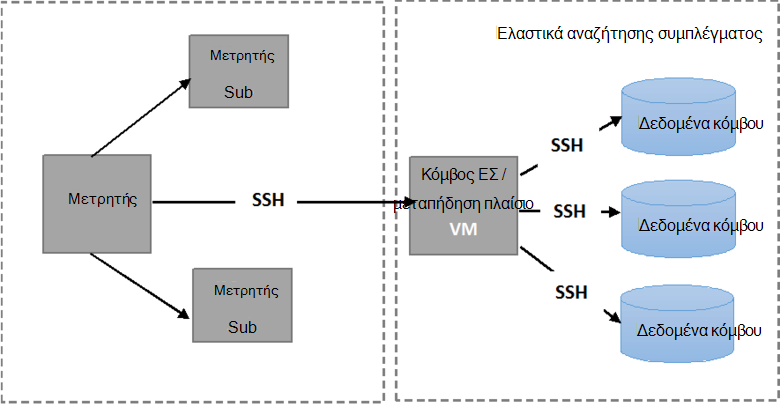

<properties
   pageTitle="Εκτέλεση δοκιμών αυτοματοποιημένη ανοχή Elasticsearch | Microsoft Azure"
   description="Περιγραφή πώς μπορείτε να εκτελέσετε τους ελέγχους που υποστηρίζεται στο δικό σας περιβάλλον."
   services=""
   documentationCenter="na"
   authors="dragon119"
   manager="bennage"
   editor=""
   tags=""/>

<tags
   ms.service="guidance"
   ms.devlang="na"
   ms.topic="article"
   ms.tgt_pltfrm="na"
   ms.workload="na"
   ms.date="09/22/2016"
   ms.author="masashin"/>

# <a name="running-the-automated-elasticsearch-resiliency-tests"></a>Εκτέλεση δοκιμών αυτοματοποιημένη ανοχή Elasticsearch

[AZURE.INCLUDE [pnp-header](../../includes/guidance-pnp-header-include.md)]

Σε αυτό το άρθρο αποτελεί [μέρος μιας σειράς](guidance-elasticsearch.md).

Σε [Ρύθμιση παραμέτρων ανθεκτικότητα και αποκατάστασης σε Elasticsearch σε Azure][elasticsearch-resilience-recovery], θα σας περιγράφεται μια σειρά από ελέγχους που έχουν εκτελεστεί σε σχέση με ένα σύμπλεγμα Elasticsearch δείγμα για να καθορίσετε πόσο καλά το σύστημα απαντήσει σε ορισμένες συνήθεις μορφές αποτυχία και πόσο καλά ανάκτησης. Τους ελέγχους που έχουν δέσμης ενεργειών για να ενεργοποιήσετε τους πρέπει να εκτελεστούν σε μη αυτόματο τρόπο. Αυτό το έγγραφο περιγράφει πώς μπορείτε να επαναλάβετε τις δοκιμές στο δικό σας περιβάλλον. 

Έχουν ελεγχθεί τα ακόλουθα σενάρια:

- **Αποτυχία κόμβο και επανεκκίνηση χωρίς απώλεια δεδομένων**. Έναν κόμβο δεδομένων είναι διακοπή και επανεκκίνηση μετά 5 λεπτά.
Elasticsearch έχει ρυθμιστεί ώστε να μην νέα ανάθεση που λείπουν shards σε αυτό το χρονικό διάστημα, ώστε να χωρίς επιπλέον εισόδου/εξόδου είναι που προκύπτουν για μετακίνηση shards. Όταν ο κόμβος επανεκκίνηση του, η διαδικασία αποκατάστασης εμφανίζει το shards σε αυτόν τον κόμβο πίσω ενημερωμένα.

- **Αποτυχία κόμβο με απώλεια καταστροφική δεδομένων**. Έναν κόμβο δεδομένων έχει διακοπεί και τα δεδομένα που περιέχει διαγράφονται για να προσομοιώσετε αποτυχία καταστροφική δίσκου. Ο κόμβος, στη συνέχεια, την επανεκκίνηση (μετά το 5 λεπτά), αποτελεσματική, ως αντικαθιστά τον αρχικό κόμβο. Η διαδικασία αποκατάστασης απαιτεί φτιάχνετε τα δεδομένα που λείπουν για αυτόν τον κόμβο και μπορεί να περιλαμβάνει την αλλαγή θέσης shards που θα διατηρούνται σε άλλους κόμβους.

- **Αποτυχία κόμβο και επανεκκίνηση χωρίς απώλεια δεδομένων, αλλά με shard εκ νέου ανάθεση**. Έναν κόμβο δεδομένων έχει διακοπεί και τα shards που περιέχει είναι εκ νέου στους άλλους κόμβους. Στη συνέχεια, την επανεκκίνηση του κόμβου και περισσότερες εκ νέου ανάθεση παρουσιάζεται για τη νέα εξισορρόπηση του συμπλέγματος.

- **Σάρωση ενημερώσεις**. Κάθε κόμβο του συμπλέγματος είναι διακοπή και επανεκκίνηση μετά από ένα σύντομο χρονικό διάστημα για να προσομοιώσετε μηχανές που επανεκκίνηση μετά από μια ενημερωμένη έκδοση λογισμικού. Μόνο ένας κόμβος έχει διακοπεί οποιαδήποτε στιγμή.
Shards δεν εκχωρείται εκ νέου, ενώ είναι έναν κόμβο προς τα κάτω.

## <a name="prerequisites"></a>Προαπαιτούμενα στοιχεία

Αυτοματοποιημένη δοκιμών που απαιτούν τα ακόλουθα στοιχεία:

- Ένα σύμπλεγμα Elasticsearch.

- Μια JMeter περιβάλλον εγκατάσταση όπως περιγράφεται με την [καθοδήγηση δοκιμής επιδόσεων]. 

- Οι παρακάτω προσθήκες εγκατεστημένο στον την JMeter κύρια εικονική Μηχανή μόνο.

    - Περιβάλλον εκτέλεσης Java 7.

    - Nodejs 4.x.x ή νεότερη έκδοση.

    - Τα εργαλεία της γραμμής εντολών Git.

## <a name="how-the-scripts-work"></a>Πώς λειτουργούν οι δέσμες ενεργειών

Οι δέσμες ενεργειών δοκιμής προορίζονται για να εκτελέσετε σε η Εικονική υπόδειγμα JMeter. Όταν επιλέγετε μια δοκιμή για να εκτελέσετε, οι δέσμες ενεργειών εκτελέστε την παρακάτω σειρά των εργασιών:

1.  Ξεκινήστε ένα σχέδιο δοκιμών JMeter διέρχεται οι παράμετροι που έχετε καθορίσει.

2.  Αντιγράψτε μια δέσμη ενεργειών που εκτελεί τις λειτουργίες που απαιτούνται από τον έλεγχο για μια καθορισμένη Εικονική στο σύμπλεγμα. Αυτό μπορεί να είναι οποιαδήποτε Εικονική που περιλαμβάνει μια δημόσια διεύθυνση IP ή η Εικονική *Jumpbox* αν έχετε δημιουργήσει στο σύμπλεγμα χρησιμοποιώντας το [πρότυπο γρήγορη έναρξη Azure Elasticsearch](https://github.com/Azure/azure-quickstart-templates/tree/master/elasticsearch).

3.  Εκτελέστε τη δέσμη ενεργειών στην Εικονική (ή Jumpbox).

Η παρακάτω εικόνα εμφανίζει τη δομή του περιβάλλοντος δοκιμής και Elasticsearch σύμπλεγμα. Σημειώστε ότι οι δέσμες ενεργειών δοκιμής χρήση ασφαλούς κελύφους (SSH) για σύνδεση σε κάθε κόμβο του συμπλέγματος για να εκτελέσετε διάφορες λειτουργίες Elasticsearch όπως η διακοπή ή επανεκκίνηση έναν κόμβο.



## <a name="setting-up-the-jmeter-tests"></a>Ρύθμιση του JMeter δοκιμών

Πριν από την εκτέλεση του ανθεκτικότητα ελέγχει πρέπει να μεταγλωττίσετε και ανάπτυξη JUnit δοκιμών που βρίσκεται στο φάκελο υποστηρίζεται/jmeter δοκιμές. Αυτές οι δοκιμές αναφέρονται σύμφωνα με το πρόγραμμα JMeter δοκιμής. Για περισσότερες πληροφορίες, ανατρέξτε στη διαδικασία "Εισαγωγή ένα υπάρχον έργο δοκιμής JUnit σε Έκλειψη" σε [ένα δείγμα JMeter JUnit για σκοπούς δοκιμής Elasticsearch επιδόσεων για την ανάπτυξη][].

Υπάρχουν δύο εκδόσεις του JUnit δοκιμών που θα διατηρούνται στα τους παρακάτω φακέλους:

- **Elasticsearch17.** Το έργο σε αυτόν το φάκελο δημιουργεί το αρχείο Elasticsearch17.jar. Χρησιμοποιήστε αυτό ΒΆΖΟ για σκοπούς δοκιμής εκδόσεις Elasticsearch 1.7.x

- **Elasticsearch20**. Το έργο σε αυτόν το φάκελο δημιουργεί το αρχείο Elasticsearch20.jar. Χρησιμοποιήστε αυτό ΒΆΖΟ για σκοπούς δοκιμής Elasticsearch έκδοση 2.0.0 και νεότερες εκδόσεις

Αντιγράψτε το κατάλληλο αρχείο ΒΆΖΟ μαζί με τα υπόλοιπα από τις εξαρτήσεις υπολογιστές σας JMeter. Η διαδικασία περιγράφεται κατά τη διαδικασία "Για την ανάπτυξη ενός ελέγχου JUnit να JMeter" σε [ένα δείγμα JMeter JUnit για δοκιμών Elasticsearch απόδοση για την ανάπτυξη].

## <a name="configuring-vm-security-for-each-node"></a>Ρύθμιση παραμέτρων Εικονική ασφάλειας για κάθε κόμβου

Οι δέσμες ενεργειών δοκιμής απαιτούν ένα πιστοποιητικό ελέγχου ταυτότητας έχει εγκατασταθεί σε κάθε κόμβο Elasticsearch στο σύμπλεγμα. Αυτή η δυνατότητα επιτρέπει τις δέσμες ενεργειών για την αυτόματη εκτέλεση χωρίς ερώτηση για όνομα χρήστη ή τον κωδικό πρόσβασης που συνδέονται με τα διάφορα ΣΠΣ.

Ξεκινήστε από την καταγραφή σε έναν από τους κόμβους του συμπλέγματος Elasticsearch (ή η Εικονική Jumpbox) και, στη συνέχεια, εκτελέστε την ακόλουθη εντολή για να δημιουργήσετε ένα κλειδί ελέγχου ταυτότητας:

```Shell
ssh-keygen -t rsa
```

Ενώ είστε συνδεδεμένοι στον κόμβο Elasticsearch (ή Jumpbox), εκτελέστε τις ακόλουθες εντολές για κάθε κόμβο στο αυτός σύμπλεγμα Elasticsearch. Αντικατάσταση `<username>` με το όνομα ενός έγκυρη χρήστη σε κάθε Εικονική και αντικατάσταση `<nodename>` με το όνομα DNS ή τη διεύθυνση IP του η Εικονική φιλοξενεί τον κόμβο Elasticsearch.
Σημειώστε ότι θα σας ζητηθεί για τον κωδικό πρόσβασης του χρήστη κατά την εκτέλεση αυτών των εντολών.
Για περισσότερες πληροφορίες ανατρέξτε στο θέμα [σύνδεση SSH χωρίς κωδικό πρόσβασης](http://www.linuxproblem.org/art_9.html):

```Shell
ssh <username>@<nodename> mkdir -p .ssh (
cat .ssh/id\_rsa.pub | ssh <username>*@<nodename> 'cat &gt;&gt; .ssh/authorized\_keys'
```

## <a name="downloading-and-configuring-the-test-scripts"></a>Λήψη και ρύθμιση παραμέτρων των δεσμών ενεργειών δοκιμής

Οι δέσμες ενεργειών δοκιμής παρέχονται σε ένα αποθετήριο Git. Χρησιμοποιήστε την ακόλουθη διαδικασία για να κάνετε λήψη και να ρυθμίσετε τις παραμέτρους των δεσμών ενεργειών.

Στον JMeter κύρια υπολογιστή όπου θα γίνει εκτέλεση των δοκιμών, ανοίξτε ένα παράθυρο του υπολογιστή Git (Git πάρτι) και κλωνοποίηση το αποθετήριο δεδομένων που περιέχει τις δέσμες ενεργειών, ως εξής:

```Shell
git clone https://github.com/mspnp/azure-guidance.git
```

Μετακίνηση στο φάκελο ανοχή δοκιμές και εκτελέστε την ακόλουθη εντολή για να εγκαταστήσετε τις εξαρτήσεις που απαιτούνται για την εκτέλεση των δοκιμών:

```Shell
npm install
```

Εάν το υπόδειγμα JMeter εκτελείται στα Windows, κάντε λήψη του [Plink](http://www.chiark.greenend.org.uk/~sgtatham/putty/download.html), ποιο είναι το περιβάλλον εργασίας γραμμής εντολών για το πρόγραμμα-πελάτη PuTTY Telnet. Αντιγράψτε το εκτελέσιμο Plink στο φάκελο ανοχή-δοκιμές/βιβλιοθήκης.

Εάν το υπόδειγμα JMeter εκτελείται σε Linux, δεν χρειάζεται να κάνετε λήψη Plink αλλά θα χρειαστεί να ρυθμίσετε τις παραμέτρους SSH χωρίς κωδικό πρόσβασης μεταξύ του υποδείγματος JMeter και στον κόμβο Elasticsearch ή Jumpbox που χρησιμοποιήσατε, ακολουθώντας τα βήματα που περιγράφονται στην διαδικασία "Ρύθμιση παραμέτρων Εικονική ασφαλείας για κάθε κόμβο." 

Επεξεργαστείτε τις ακόλουθες παραμέτρους ρύθμισης παραμέτρων στην το `config.js` αρχείου ώστε να ταιριάζει με το περιβάλλον δοκιμής και Elasticsearch σύμπλεγμα. Αυτές οι παράμετροι είναι κοινά και για όλους τους ελέγχους που είναι:

| Όνομα | Περιγραφή | Προεπιλεγμένη τιμή |
| ---- | ----------- | ------------- |
| `jmeterPath` | Τοπική διαδρομή όπου βρίσκεται το JMeter. | `C:/apache-jmeter-2.13` |
| `resultsPath` | Σχετική καταλόγου όπου η δέσμη ενεργειών απορρίπτει το αποτέλεσμα. | `results` |
| `verbose` | Υποδεικνύει εάν η δέσμη ενεργειών εξάγει σε κατάσταση λειτουργίας εμφάνισης λεπτομερειών ή όχι. | `true` |
| `remote` | Υποδεικνύει εάν οι δοκιμές JMeter εκτέλεση τοπικά ή στους απομακρυσμένους διακομιστές. | `true` |
| `cluster.clusterName` | Το όνομα του συμπλέγματος Elasticsearch. | `elasticsearch` |
| `cluster.jumpboxIp`         | Η διεύθυνση IP του υπολογιστή Jumpbox.                 |-|
| `cluster.username`          | Ο χρήστης διαχείρισης που δημιουργήσατε κατά την ανάπτυξη του συμπλέγματος. |-|
| `cluster.password`          | Ο κωδικός πρόσβασης για το χρήστη του διαχειριστή.                        |-|
| `cluster.loadBalancer.ip`   | Η διεύθυνση IP του τη μονάδα εξισορρόπησης φόρτου Elasticsearch.    |-|
| `cluster.loadBalancer.url`  | Βασική διεύθυνση URL από τη μονάδα εξισορρόπησης φόρτου.                          |-|

## <a name="running-the-tests"></a>Εκτέλεση δοκιμών

Μετακίνηση στο φάκελο ανοχή δοκιμές και εκτελέστε την ακόλουθη εντολή:

```Shell
node app.js
```

Θα πρέπει να εμφανίζεται το παρακάτω μενού:


Εισαγάγετε τον αριθμό των το σενάριο που θέλετε να εκτελέσετε: `11`, `12`, `13` ή `21`. 

Αφού επιλέξετε ένα σενάριο, θα εκτελεστεί αυτόματα τον έλεγχο. Τα αποτελέσματα αποθηκεύονται ως ένα σύνολο αρχείων διαχωρισμένων με κόμματα (CSV) σε ένα φάκελο που δημιουργήθηκε κάτω από τον κατάλογο αποτελεσμάτων. Κάθε εκτέλεση διαθέτει δικό του φακέλου αποτελέσματα.
Μπορείτε να χρησιμοποιήσετε το Excel για την ανάλυση και γράφημα αυτών των δεδομένων.

[Running Elasticsearch on Azure]: guidance-elasticsearch-running-on-azure.md
[Tuning Data Ingestion Performance for Elasticsearch on Azure]: guidance-elasticsearch-tuning-data-ingestion-performance.md
[καθοδήγηση δοκιμής επιδόσεων]: guidance-elasticsearch-creating-performance-testing-environment.md
[JMeter guidance]: guidance-elasticsearch-implementing-jmeter.md
[Considerations for JMeter]: guidance-elasticsearch-deploying-jmeter-junit-sampler.md
[Query aggregation and performance]: guidance-elasticsearch-query-aggregation-performance.md
[elasticsearch-resilience-recovery]: guidance-elasticsearch-configuring-resilience-and-recovery.md
[Resilience and Recovery Testing]: guidance-elasticsearch-running-automated-resilience-tests.md
[Ανάπτυξη ένα δείγμα JMeter JUnit για σκοπούς δοκιμής Elasticsearch επιδόσεων]: guidance-elasticsearch-deploying-jmeter-junit-sampler.md
