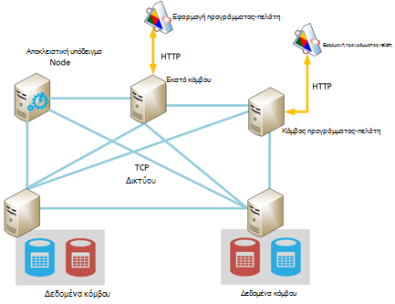
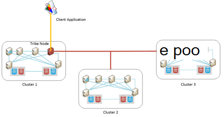

<properties
   pageTitle="Εκτέλεση Elasticsearch σε Azure | Microsoft Azure"
   description="Πώς μπορείτε να εγκαταστήσετε, να ρυθμίσετε και να εκτελέσετε Elasticsearch σε Azure."
   services=""
   documentationCenter="na"
   authors="dragon119"
   manager="bennage"
   editor=""
   tags=""/>

<tags
   ms.service="guidance"
   ms.devlang="na"
   ms.topic="article"
   ms.tgt_pltfrm="na"
   ms.workload="na"
   ms.date="09/22/2016"
   ms.author="masashin"/>

# <a name="running-elasticsearch-on-azure"></a>Εκτέλεση Elasticsearch σε Azure

[AZURE.INCLUDE [pnp-header](../../includes/guidance-pnp-header-include.md)]

Σε αυτό το άρθρο αποτελεί [μέρος μιας σειράς](guidance-elasticsearch.md). 

## <a name="overview"></a>Επισκόπηση

Αυτό το έγγραφο παρέχει μια σύντομη εισαγωγή στις η γενική δομή των Elasticsearch και, στη συνέχεια, περιγράφει πώς μπορείτε να υλοποιήσετε ένα σύμπλεγμα Elasticsearch χρησιμοποιώντας Azure. Να έλθει σε επαφή για τις βέλτιστες πρακτικές για την ανάπτυξη ένα σύμπλεγμα Elasticsearch, συγκέντρωσης την διάφορες λειτουργικό απόδοση και τις απαιτήσεις διαχείρισης του συστήματος, και λαμβάνοντας υπόψη πώς θα πρέπει να καθοδηγούν απαιτήσεις σας όσον αφορά τη ρύθμιση παραμέτρων και τοπολογία που επιλέγετε.

> [AZURE.NOTE] Αυτές οι οδηγίες προϋποθέτει ορισμένες βασικές εξοικείωση με [Elasticsearch][].

## <a name="the-structure-of-elasticsearch"></a>Η δομή του Elasticsearch 

Elasticsearch είναι μια βάση δεδομένων εγγράφου ιδιαίτερα βελτιστοποιημένη για να λειτουργήσει ως ένας μηχανισμός αναζήτησης. Έγγραφα είναι σειριοποίηση σε μορφή JSON. Δεδομένα παραμένει στην ευρετήρια, υλοποιηθεί χρησιμοποιώντας [Apache Lucene][], παρόλο που οι λεπτομέρειες θα αφαιρεθούν από την προβολή και δεν είναι απαραίτητο να κατανοήσετε πλήρως Lucene για να χρησιμοποιήσετε Elasticsearch.

### <a name="clusters-nodes-indexes-and-shards"></a>Συμπλεγμάτων, κόμβους, ευρετήρια και shards

Elasticsearch υλοποιεί μια ομαδοποιημένη αρχιτεκτονική που χρησιμοποιεί sharding για τη διανομή δεδομένων σε πολλές κόμβους και να παρέχετε υψηλή διαθεσιμότητα αναπαραγωγή. Έγγραφα που είναι αποθηκευμένα σε ευρετήρια. Ο χρήστης να καθορίσετε ποια πεδία σε ένα έγγραφο που χρησιμοποιούνται για να προσδιορίσει μοναδικά μέσα σε ένα ευρετήριο ή το σύστημα μπορεί να δημιουργήσει ένα πεδίο κλειδιού και τιμές αυτόματα. Το ευρετήριο χρησιμοποιείται για να οργανώνετε τα έγγραφά σας και είναι ο κύριος σημαίνει ότι για τον εντοπισμό έγγραφα. 

Ένα ευρετήριο περιέχει ένα σύνολο shards. Έγγραφα ομοιόμορφα δείγματος σε σχέση με κατά μήκος shards χρησιμοποιώντας κλειδώματος μηχανισμό με βάση τις τιμές κλειδιού ευρετηρίου και τον αριθμό των shards στο ευρετήριο. 

Τα ευρετήρια μπορούν να αναπαραχθούν. Σε αυτήν την περίπτωση, αντιγράφεται κάθε shard στο ευρετήριο. Elasticsearch εξασφαλίζει ότι κάθε αρχικό shard για ένα ευρετήριο (αναφέρεται ως "πρωτεύον shard") και τη ρεπλίκα πάντα βρίσκονται σε διαφορετικούς κόμβους. Όταν ένα έγγραφο προστίθεται ή τροποποιηθεί, όλα Γράψτε λειτουργίες εκτελούνται στο το πρωτεύον shard πρώτη και, στη συνέχεια, σε κάθε ρεπλίκα. 

Η παρακάτω εικόνα δείχνει τις βασικές πτυχές της ένα σύμπλεγμα Elasticsearch που περιέχει τρεις κόμβους. Έχει δημιουργηθεί ένα ευρετήριο που αποτελείται από δύο κύρια shards με δύο αντίγραφα για κάθε shard (έξι shards σε όλα).


*Ένα απλό σύμπλεγμα Elasticsearch που περιέχει δύο κύριους κόμβους και τα δύο σύνολα αντίγραφα*

Σε αυτό το σύμπλεγμα, κύρια shard 1 και 2 πρωτεύον shard βρίσκονται σε ξεχωριστό κόμβους για να σας βοηθήσει εξισορρόπηση του φόρτου μεταξύ τους. Ομοίως διανέμονται τα αντίγραφα. Εάν αποτύχει μια μεμονωμένη κόμβου, τους υπόλοιπους κόμβους έχουν επαρκείς πληροφορίες για την ενεργοποίηση του συστήματος να συνεχίσει να λειτουργεί. Εάν είναι απαραίτητο, Elasticsearch θα Προβιβασμός ενός αντιγράφου shard να γίνει μια κύρια shard εάν η αντίστοιχη πρωτεύοντος shard δεν είναι διαθέσιμη.

### <a name="node-roles"></a>Ρόλοι κόμβου

Οι κόμβοι σε ένα σύμπλεγμα Elasticsearch μπορεί να εκτελεί τους εξής ρόλους:

- Έναν **κόμβο δεδομένων** που μπορεί να περιέχει μία ή περισσότερες shards που περιέχουν δεδομένα του ευρετηρίου.

- **Κόμβος προγράμματος-πελάτη** που δεν περιέχει δεδομένα του ευρετηρίου αλλά που χειρίζεται τις εισερχόμενες αιτήσεις που έγιναν από εφαρμογές προγράμματος-πελάτη στον κόμβο κατάλληλα δεδομένα.
 
- Ένα **κύριο κόμβο** που δεν περιέχουν δεδομένα ευρετηρίου αλλά που εκτελεί λειτουργίες διαχείρισης συμπλέγματος, όπως τη διατήρηση και διανομή πληροφορίες δρομολόγησης γύρω από το σύμπλεγμα (τη λίστα των οποίων κόμβους περιέχουν ποια shards), καθορισμός τους κόμβους στους είναι διαθέσιμες, αλλαγή θέσης shards όπως κόμβοι εμφανίζονται και εξαφανίζονται και συντονισμό αποκατάστασης μετά από αποτυχία κόμβο. Πολλαπλοί κόμβοι μπορούν να ρυθμιστούν ως υποδείγματα, αλλά μόνο μία στην πραγματικότητα θα είναι αυτή για να εκτελέσετε τις κύριες συναρτήσεις. Εάν αυτός ο κόμβος αποτύχει, μια άλλη επιλογή τίθεται σε ισχύ και έναν από τους άλλους κόμβους επιλέξιμο κύρια θα είναι αυτή και να αναλάβετε τον έλεγχο.

> [AZURE.NOTE]Ο κόμβος επιλεγμένες κύρια είναι σημαντικό να η καλά του συμπλέγματος. Οι άλλες κόμβοι ping τακτικά, για να βεβαιωθείτε ότι είναι ακόμα διαθέσιμη. Εάν το κύριο κόμβο επιλεγμένες επίσης λειτουργεί ως έναν κόμβο δεδομένων, υπάρχει μια ευκαιρία ότι ο κόμβος μπορεί να γίνει απασχολημένος και ΑΠΟΤΥΧΙΑ για να απαντήσετε σε αυτές τις εντολές ping. Σε αυτήν την περίπτωση, το υπόδειγμα θεωρείται ότι έχουν αποτύχει και έναν από τους άλλους κόμβους πρωτότυπο είναι αυτή στη θέση. 

 Η παρακάτω εικόνα δείχνει μια τοπολογία που περιέχουν διάφορες αποκλειστικό υποδείγματος, προγράμματος-πελάτη και κόμβους δεδομένων σε ένα σύμπλεγμα Elasticsearch.



*Ένα σύμπλεγμα Elasticsearch που εμφανίζει διαφορετικούς τύπους κόμβοι*

### <a name="costs-and-benefits-of-using-client-nodes"></a>Κόστος και τα πλεονεκτήματα της χρήσης του προγράμματος-πελάτη κόμβοι

Όταν μια εφαρμογή υποβάλλει ένα ερώτημα σε ένα σύμπλεγμα Elasticsearch, τον κόμβο με τον οποίο συνδέεται η εφαρμογή είναι υπεύθυνο για που κατευθύνει τη διαδικασία ερωτήματος. Ο κόμβος προωθεί το αίτημα για κάθε κόμβο δεδομένων και συγκεντρώνει τα αποτελέσματα, επιστρέφει το αθροιστικό πληροφορίες στην εφαρμογή. Εάν ένα ερώτημα περιλαμβάνει συγκεντρώσεις και άλλου υπολογισμούς, τον κόμβο με τον οποίο συνδέεται η εφαρμογή εκτελεί τις απαραίτητες λειτουργίες μετά από την ανάκτηση των δεδομένων από κάθε έναν από τους άλλους κόμβους. Αυτή η διαδικασία διασποράς/Συγκεντρώστε να εκμετάλλευση σημαντικών επεξεργασίας και τη μνήμη πόρων.

Χρήση κόμβους αποκλειστικό προγράμματος-πελάτη για την εκτέλεση αυτών των εργασιών σας επιτρέπει κόμβους δεδομένων για να εστιάσετε σε τη διαχείριση και την αποθήκευση των δεδομένων. Το αποτέλεσμα είναι ότι πολλά σενάρια που αφορούν σύνθετων ερωτημάτων και συναθροίσεις να επωφεληθείτε από τη χρήση κόμβους αποκλειστικό υπολογιστή-πελάτη. Ωστόσο, οι επιπτώσεις της χρήσης κόμβους αποκλειστικό προγράμματος-πελάτη πιθανώς θα ποικίλλουν ανάλογα με το σενάριο, φόρτο εργασίας και το μέγεθος συμπλέγματος. 

> [AZURE.NOTE] Ανατρέξτε [ρύθμισης συγκέντρωση δεδομένων και επιδόσεις ερωτημάτων για Elasticsearch σε Azure][] για περισσότερες πληροφορίες σχετικά με τη διαδικασία ρύθμισης.

### <a name="connecting-to-a-cluster"></a>Σύνδεση σε ένα σύμπλεγμα

Elasticsearch εκθέτει μια σειρά από REST API για τη δημιουργία εφαρμογές προγράμματος-πελάτη και αποστολή προσκλήσεων σε ένα σύμπλεγμα. Εάν κάνετε ανάπτυξη εφαρμογών χρησιμοποιώντας το .NET Framework, διατίθενται δύο επίπεδα υψηλότερη APIs – [Elasticsearch.Net & ΦΩΛΙΆ][].

Εάν δημιουργείτε χρησιμοποιώντας Java εφαρμογές προγράμματος-πελάτη, μπορείτε να χρησιμοποιήσετε το [API κόμβου προγράμματος-πελάτη][] για να δημιουργήσετε δυναμικά προγράμματος-πελάτη κόμβους και να τις προσθέσετε στο σύμπλεγμα. Η δημιουργία προγράμματος-πελάτη κόμβους δυναμικά είναι χρήσιμο, εάν το σύστημά σας χρησιμοποιεί ένα σχετικά μικρό αριθμό των συνδέσεων μεγάλης διάρκειας. Παρέχονται κόμβους προγράμματος-πελάτη που δημιουργούνται με χρήση του API κόμβο με το σύμπλεγμα δρομολόγηση αντιστοίχιση (τις λεπτομέρειες των οποίων κόμβους περιέχουν ποια shards) από το κύριο κόμβο. Αυτές οι πληροφορίες επιτρέπει την εφαρμογή Java για να συνδεθείτε απευθείας με την κατάλληλη κόμβους κατά τη δημιουργία ευρετηρίου δεδομένων ή υποβολή ερωτημάτων, μειώνοντας τον αριθμό των μεταπηδήσεων που μπορεί να είναι απαραίτητο κατά τη χρήση άλλων APIs.

Το κόστος αυτής της προσέγγισης είναι τα έξοδα εάν εγγραφεί ο κόμβος προγράμματος-πελάτη στο σύμπλεγμα. Εάν μεγάλου αριθμού κόμβους προγράμματος-πελάτη εμφανίζονται και εξαφανίζονται γρήγορα, την επίδραση των διατήρηση και τη διανομή του χάρτη δρομολόγησης σύμπλεγμα μπορεί να γίνει σημαντική.

Η παρακάτω εικόνα δείχνει μια ρύθμιση παραμέτρων που χρησιμοποιεί μια μονάδα εξισορρόπησης φόρτου για να δρομολογήσετε αιτήσεις σε ένα σύνολο κόμβους προγράμματος-πελάτη, παρόλο που η ίδια στρατηγική μπορεί να χρησιμοποιηθεί για απευθείας σύνδεση σε δεδομένα κόμβους Εάν δεν χρησιμοποιούνται κόμβους προγράμματος-πελάτη.


*Σύνδεση με ένα σύμπλεγμα Elasticsearch έως τη μονάδα εξισορρόπησης φόρτου Azure παρουσιών της εφαρμογής υπολογιστή-πελάτη*

> [AZURE.NOTE]Μπορείτε να χρησιμοποιήσετε το [Πρόγραμμα εξισορρόπησης φόρτου Azure][] για να εμφανίσετε το σύμπλεγμα δημόσια στο Internet ή μπορείτε να χρησιμοποιήσετε μια [εσωτερική εξισορρόπηση φόρτου][] , εάν οι εφαρμογές προγράμματος-πελάτη και σύμπλεγμα περιέχονται εξ ολοκλήρου μέσα στο ίδιο ιδιωτικό δίκτυο εικονικού (VNet).

### <a name="node-discovery"></a>Εντοπισμός κόμβου

Elasticsearch βασίζεται σε επικοινωνίες ομότιμης, ώστε να εντοπισμός άλλους κόμβους σε ένα σύμπλεγμα είναι ένα σημαντικό τμήμα στο του κύκλου ζωής ενός κόμβου. Κόμβος εντοπισμού επιτρέπει νέα δεδομένα κόμβους θα προστεθούν δυναμικά σε ένα σύμπλεγμα, το οποίο επιτρέπει με τη σειρά του συμπλέγματος για να κλιμακωθεί ανάληψη με διαφάνεια. Επιπλέον, εάν ένας κόμβος δεδομένων αποτυγχάνει απάντηση σε αιτήματα επικοινωνίες από τους άλλους κόμβους, έναν κύριο κόμβο να αποφασίσετε ότι ο κόμβος δεδομένων απέτυχε και λαμβάνουν τα απαραίτητα βήματα για να αναθέσετε εκ νέου το shards που κρατώντας πατημένο σε άλλους κόμβους λειτουργικές δεδομένων.

Elasticsearch κόμβου εντοπισμού γίνεται με χρήση της λειτουργικής μονάδας εντοπισμού. Η λειτουργική μονάδα εντοπισμού είναι μια προσθήκη που μπορεί να αλλάξει για να χρησιμοποιήσετε ένα διαφορετικό εντοπισμού μηχανισμό. Η προεπιλεγμένη λειτουργική μονάδα εντοπισμού ([Zen][]) έχει ως αποτέλεσμα έναν κόμβο με την έκδοση αιτήσεις ping για να βρείτε άλλους κόμβους στο ίδιο δίκτυο. Εάν απαντήσετε άλλους κόμβους, κουτσομπολεύοντας για την ανταλλαγή πληροφοριών. Έναν κύριο κόμβο, στη συνέχεια, μπορείτε να διανείμετε shards στον νέο κόμβο (εάν είναι έναν κόμβο δεδομένων) και νέα εξισορρόπηση του συμπλέγματος. Η λειτουργική μονάδα εντοπισμού Zen χειρίζεται επίσης τη διαδικασία κύρια election και το πρωτόκολλο για τον εντοπισμό αποτυχία κόμβο.

Επιπλέον, εάν χρησιμοποιείτε Elasticsearch κόμβους ως Azure εικονικές μηχανές (ΣΠΣ), πολλαπλό μηνυμάτων δεν υποστηρίζεται. Για λόγους αυτό, θα πρέπει να ορίσετε τον εντοπισμό Zen για να χρησιμοποιήσετε την ανταλλαγή μηνυμάτων μοναδικής διανομής και δώστε μια λίστα με τις έγκυρες κόμβους επαφών στο αρχείο ρύθμισης παραμέτρων elasticsearch.yml.

Εάν διατηρείτε ένα σύμπλεγμα Elasticsearch μέσα σε μια Azure εικονικού δικτύου, μπορείτε να καθορίσετε ότι η ιδιωτική απευθύνεται στους οποίους έχουν ανατεθεί DHCP IP δίνονται σε κάθε Εικονική στο σύμπλεγμα θα πρέπει να παραμείνει που έχει εκχωρηθεί (στατικό). Μπορείτε να ρυθμίσετε Zen εντοπισμού μοναδικής διανομής μηνυμάτων με αυτές τις στατικές διευθύνσεις IP. Εάν χρησιμοποιείτε ΣΠΣ με δυναμικές διευθύνσεις IP, λάβετε υπόψη ότι εάν μια Εικονική τη διακοπή και επανεκκίνηση του ενδέχεται να έχει ανατεθεί μια νέα διεύθυνση IP, καθιστώντας εντοπισμού δυσκολότερη. Για να χειριστείτε αυτό το σενάριο, μπορείτε να κάνετε εναλλαγή της λειτουργικής μονάδας εντοπισμού Zen για την [Προσθήκη Cloud Azure][]. Αυτή η προσθήκη χρησιμοποιεί το API Azure για να υλοποιήσετε το μηχανισμό εντοπισμού, που βασίζεται σε συνδρομή Azure πληροφορίες.

> [AZURE.NOTE]Η τρέχουσα έκδοση του της προσθήκης Cloud Azure απαιτεί να εγκαταστήσετε το πιστοποιητικό διαχείρισης για τη συνδρομή σας στο Azure το keystore Java στον κόμβο Elasticsearch και δώστε τη θέση και τα διαπιστευτήρια για την πρόσβαση του keystore στο αρχείο elasticsearch.yml. Αυτό το αρχείο παραμένει σε απλό κείμενο, ώστε να είναι vitally σημαντικό να εξασφαλίζεται αυτό το αρχείο είναι διαθέσιμο μόνο από το λογαριασμό που εκτελεί την υπηρεσία Elasticsearch. 
> 
> Επιπλέον, αυτή η προσέγγιση ενδέχεται να μην είναι συμβατά με το διαχειριστή πόρων Azure αναπτύξεις. Για αυτούς τους λόγους, συνιστάται να ότι χρησιμοποιείτε στατικές διευθύνσεις IP για τους κόμβους κύρια και χρήση αυτές οι κόμβοι για την υλοποίηση μοναδικής διανομής εντοπισμού Zen μηνυμάτων κατά μήκος του συμπλέγματος. Στην παρακάτω ρύθμιση (που λαμβάνονται από το αρχείο elasticsearch.yml για έναν κόμβο με το δείγμα δεδομένων), οι διευθύνσεις IP του κεντρικού υπολογιστή αναφοράς κύρια κόμβους του συμπλέγματος:

```yaml
discovery.zen.ping.multicast.enabled: false  
discovery.zen.ping.unicast.hosts: ["10.0.0.10","10.0.0.11","10.0.0.12"]
```

## <a name="general-system-guidelines"></a>Γενικό σύστημα κατευθυντήριες γραμμές

Elasticsearch να εκτελεστούν σε πολλούς υπολογιστές, διαβάθμιση από ένα μεμονωμένο φορητό υπολογιστή σε ένα σύμπλεγμα διακομιστών υψηλής ποιότητας. Ωστόσο, οι περισσότερες πόροι όσον αφορά μνήμη, υπολογιστική ισχύ και γρήγορη δίσκων που είναι διαθέσιμη τόσο καλύτερα τις επιδόσεις. Οι παρακάτω ενότητες συνοψίζονται οι βασικές απαιτήσεις υλικού και λογισμικού για την εκτέλεση Elasticsearch.

### <a name="memory-requirements"></a>Απαιτήσεις μνήμης 

Elasticsearch προσπαθεί για την αποθήκευση δεδομένων στη μνήμη για ταχύτητα. Θα πρέπει να έχετε παραγωγής διακομιστή που φιλοξενεί έναν κόμβο για ένα τυπικό εταιρικό ή μεγέθους μέτρια εμπορική ανάπτυξης στην Azure μεταξύ 14GB και 28GB RAM (D3 ή D4 ΣΠΣ). **Ανακοίνωση η φόρτωση σε περισσότερες κόμβους αντί για τη δημιουργία κόμβους με περισσότερη μνήμη** (Δοκιμές έχουν φαίνεται ότι χρησιμοποιείτε μεγαλύτερο κόμβους με περισσότερη μνήμη μπορεί να προκαλέσει φορές εκτεταμένη ανάκτηση σε περίπτωση αποτυχίας.) Ωστόσο, παρόλο που δημιουργία συμπλεγμάτων με πολύ μεγάλο αριθμό μικρές κόμβοι να αυξήσετε διαθεσιμότητα και την απόδοση, το επίσης κλιμάκωση της προσπάθειας που εμπλέκονται στη διαχείριση και τη διατήρηση αυτού του συστήματος.

**Εκχώρηση 50% από τη διαθέσιμη μνήμη σε ένα διακομιστή για η στοίβα Elasticsearch**. Εάν χρησιμοποιείτε το σύνολο Linux τη μεταβλητή περιβάλλοντος ES_HEAP_SIZE πριν από την εκτέλεση Elasticsearch. Εναλλακτικά, εάν χρησιμοποιείτε Windows ή Linux, μπορείτε να καθορίσετε το μέγεθος της μνήμης σε το `Xmx` και `Xms` παραμέτρους κατά την εκκίνηση του Elasticseach. Ορίστε και τις δύο αυτές τις παραμέτρους για να την ίδια τιμή για να αποφύγετε την Java εικονική μηχανή (JVM) αλλαγή μεγέθους η στοίβα κατά το χρόνο εκτέλεσης. Ωστόσο, **δεν θα εκχωρηθεί περισσότερα από 30 GB**. Χρησιμοποιήστε το υπόλοιπο μνήμης για το λειτουργικό σύστημα cache αρχείου.

> [AZURE.NOTE]Elasticsearch χρησιμοποιεί τη βιβλιοθήκη Lucene για να δημιουργήσετε και να διαχειριστείτε τα ευρετήρια. Lucene δομές, χρησιμοποιήστε μια μορφή που βασίζεται σε δίσκο και σε cache αυτές τις δομές στο cache του συστήματος αρχείων σημαντική θα βελτίωση της απόδοσης.

Σημειώστε ότι το μέγεθος του μέγιστου βέλτιστη σωρού για Java σε υπολογιστή 64 bit είναι ακριβώς επάνω από 30GB. Επάνω από αυτό το μέγεθος Java αλλάζει σε χρησιμοποιώντας ένα εκτεταμένο μηχανισμό για την αναφορά σε αντικείμενα στην η στοίβα, πράγμα που αυξάνει τις απαιτήσεις μνήμης για κάθε αντικείμενο και μειώνει τις επιδόσεις. 

Η προεπιλεγμένη απορριμμάτων Java συλλογής (ταυτόχρονες σήμανση και εκκαθάριση) μπορεί να επίσης εκτέλεση δευτερευόντων βέλτιστη εάν το μέγεθος σωρού είναι μεγαλύτερη από 30 GB. Προς το παρόν δεν συνιστάται για να μεταβείτε σε ένα διαφορετικό συλλογής απορριμμάτων όπως Elasticsearch και Lucene μόνο έχουν ελεγχθεί σε σχέση με την προεπιλεγμένη.

Δεν δεσμεύσει υπερβολικά μνήμης όπως ανταλλαγής κύρια μνήμη στο δίσκο σοβαρά θα επηρεάσει τις επιδόσεις. Εάν είναι δυνατόν, απενεργοποίηση ανταλλαγή εντελώς (οι λεπτομέρειες εξαρτώνται από το λειτουργικό σύστημα). Εάν αυτό δεν είναι δυνατό, στη συνέχεια, ενεργοποιήστε τη *mlockall* ρύθμιση στο αρχείο ρύθμισης παραμέτρων Elasticsearch (elasticsearch.yml) ως εξής:

```yaml
bootstrap.mlockall: true
```

Αυτή η ρύθμιση παραμέτρων έχει ως αποτέλεσμα το JVM για το κλείδωμα της μνήμης και δεν είναι να μετατεθούν από το λειτουργικό σύστημα.

### <a name="disk-and-file-system-requirements"></a>Απαιτήσεις συστήματος για το δίσκο και αρχείων

Χρήση δεδομένων δίσκων αντίγραφα από κορυφαίες αποθήκευσης για την αποθήκευση shards. Θα πρέπει να έχει το μέγεθος δίσκων για τη διατήρηση τη μέγιστη ποσότητα δεδομένων προβλέψει shards σας, παρόλο που είναι δυνατή η προσθήκη περαιτέρω δίσκων αργότερα. Μπορείτε να επεκτείνετε μια shard μεταξύ πολλών δίσκων σε έναν κόμβο.

> [AZURE.NOTE]Elasticsearch συμπιέζει τα δεδομένα για τα πεδία αποθηκευμένες, χρησιμοποιώντας τον αλγόριθμο LZ4 και στο Elasticsearch 2.0 και μετά, μπορείτε να αλλάξετε τον τύπο συμπίεσης. Μπορείτε να μεταβείτε στον αλγόριθμο συμπίεσης DEFLATE όπως χρησιμοποιούνται από τα βοηθητικά προγράμματα *zip* και *gzip* . Αυτή η τεχνική συμπίεσης μπορεί να απαιτεί περισσότερους πόρους, αλλά θα πρέπει να το χρησιμοποιήσετε για αρχειοθετημένα δεδομένα του αρχείου καταγραφής. Αυτή η προσέγγιση μπορεί να σας βοηθήσει να μειώσετε το μέγεθος του ευρετηρίου.

Δεν είναι απαραίτητο ότι όλοι οι κόμβοι σε ένα σύμπλεγμα έχουν την ίδια διάταξη δίσκου και χωρητικότητα. Ωστόσο, έναν κόμβο με πολύ μεγάλο δίσκο χωρητικότητα σε σύγκριση με άλλους κόμβους σε ένα σύμπλεγμα θα προσελκύσετε περισσότερα δεδομένα και θα απαιτούν να ισχύος αυξημένη επεξεργασίας για το χειρισμό αυτών των δεδομένων. Συνεπώς μπορεί να γίνει ο κόμβος "συντόμευσης" σε σύγκριση με άλλους κόμβους, και αυτό μπορεί να, με τη σειρά επηρεάζουν τις επιδόσεις.

Εάν είναι δυνατόν, χρησιμοποιήστε RAID 0 (διαγράμμιση). Άλλες μορφές RAID που εφαρμόζει ομοιομορφίας και αποτελούν πιστή αναπαράσταση δεν είναι απαραίτητα όπως Elasticsearch παρέχει το δικό της λύσης υψηλής διαθεσιμότητας με τη μορφή αντίγραφα.

> [AZURE.NOTE]Πριν από την Elasticsearch 2.0.0, μπορείτε, επίσης, θα μπορούσε να εφαρμόσετε επιμερισμό στο επίπεδο λογισμικού, καθορίζοντας πολλών καταλόγων στη ρύθμιση παραμέτρων *path.data* . Στο Elasticsearch 2.0.0, αυτή η μορφή επιμερισμό δεν υποστηρίζεται πλέον. Αντί για αυτό, διαφορετικά shards μπορεί να εκχωρηθεί σε διαφορετικές διαδρομές, αλλά όλα τα αρχεία σε ένα μεμονωμένο shard θα εγγραφεί στην ίδια διαδρομή. Εάν χρειάζεστε επιμερισμό, θα πρέπει να διαγραμμίσεων δεδομένων σε επίπεδο υλικού ή λειτουργικό σύστημα. 

Για να μεγιστοποιήσετε μετάδοσης χώρου αποθήκευσης, κάθε **Εικονική θα πρέπει να έχετε ένα λογαριασμό χώρου αποθήκευσης Premium για αποκλειστική χρήση**.

Η βιβλιοθήκη Lucene να χρησιμοποιήσετε ένα μεγάλο αριθμό αρχείων για την αποθήκευση δεδομένων ευρετηρίου και Elasticsearch μπορεί να ανοίξει ένα σημαντικό αριθμό sockets για την επικοινωνία μεταξύ τους κόμβους και με προγράμματα-πελάτες. Βεβαιωθείτε ότι το λειτουργικό σύστημα έχει ρυθμιστεί για την υποστήριξη επαρκή αριθμό περιγραφών Άνοιγμα αρχείου (έως και 64000 εάν επαρκή μνήμη είναι διαθέσιμη). Σημειώστε ότι η προεπιλεγμένη ρύθμιση παραμέτρων για πολλά κατανομές Linux περιορίζει τον αριθμό των περιγραφές Άνοιγμα αρχείου για να 1024, που είναι πολύ μικρό.

Elasticsearch χρησιμοποιεί ένα συνδυασμό αντιστοίχισης μνήμης (mmap) εισόδου/εξόδου και Java νέα εισόδου/εξόδου (NIO) για να βελτιστοποιήσετε την ταυτόχρονη πρόσβαση σε αρχεία δεδομένων και τα ευρετήρια. Εάν χρησιμοποιείτε Linux, θα πρέπει να ρυθμίσετε το λειτουργικό σύστημα για να βεβαιωθείτε ότι υπάρχει επαρκής εικονική μνήμη με χώρο για περιοχές του χάρτη μνήμης 256K.

> [AZURE.NOTE]Πολλά προεπιλογή κατανομές Linux με τη χρήση του εντελώς έκθεσης ουράς scheduler (CFQ) κατά την τακτοποίηση για εγγραφή δεδομένων στο δίσκο. Σε αυτό το χρονοδιάγραμμα δεν είναι βελτιστοποιημένα για SSD. Εξετάστε το ενδεχόμενο να επαναλαμβάνετε τη ρύθμιση παραμέτρων του λειτουργικού συστήματος για να χρησιμοποιήσετε το χρονοδιάγραμμα NOOP ή το χρονοδιάγραμμα προθεσμία, οι οποίες είναι πιο αποτελεσματικές για SSD.

### <a name="cpu-requirements"></a>Απαιτήσεις CPU

Azure ΣΠΣ είναι διαθέσιμες σε μια ποικιλία CPU διαμορφώσεις, υποστήριξης μεταξύ 1 και 32 πυρήνων. Για έναν κόμβο δεδομένων, είναι ένα καλό σημείο εκκίνησης μια τυπική Εικονική σειράς DS και επιλέξτε είτε το DS3 (τεσσάρων πυρήνων) ή D4 SKU (8 πυρήνων). Η DS3 παρέχει επίσης 14GB RAM, ενώ το DS4 περιλαμβάνουν 28GB. 

Το GS σειράς (για το χώρο αποθήκευσης premium) και G σειράς (για τυπικές χώρος αποθήκευσης) Χρησιμοποιήστε επεξεργαστές Xeon E5 V3 που μπορεί να είναι χρήσιμες για φόρτους εργασίας που βρίσκονται σε μεγάλο βαθμό υπολογισμού στενής, όπως ευρείας κλίμακας συγκεντρώσεων. Για τις πιο πρόσφατες πληροφορίες, επισκεφθείτε [μεγέθη για εικονικές μηχανές][].

### <a name="network-requirements"></a>Απαιτήσεις δικτύου

Elasticsearch απαιτεί ένα εύρος ζώνης δικτύου του μεταξύ 1 και 10Gbps, ανάλογα με το μέγεθος και τη μεταβλητότητα το συμπλεγμάτων που υλοποιεί. Elasticsearch μετεγκαθιστά shards μεταξύ τους κόμβους καθώς οι περισσότεροι κόμβοι προστίθενται σε ένα σύμπλεγμα. Elasticsearch προϋποθέτει ότι ο χρόνος επικοινωνίας μεταξύ όλους τους κόμβους περίπου ισοδύναμη και δεν μπορείτε να τις σχετικές θέσεις των shards που θα διατηρούνται σε αυτές τις κόμβους. Επιπλέον, η αναπαραγωγή μπορεί να αναλαμβάνουν σημαντική δικτύου εισόδου/εξόδου μεταξύ shards. Για αυτούς τους λόγους, **αποφύγετε τη δημιουργία συμπλεγμάτων σε κόμβους που βρίσκονται σε διαφορετικές περιοχές**.

### <a name="software-requirements"></a>Απαιτήσεις λογισμικού

Μπορείτε να εκτελέσετε Elasticsearch σε Windows ή στο Linux. Η υπηρεσία Elasticsearch έχει αναπτυχθεί ως βιβλιοθήκη βάζο Java και έχει εξαρτήσεις σε άλλες βιβλιοθήκες Java που περιλαμβάνονται στο πακέτο Elasticsearch. Πρέπει να εγκαταστήσετε το Java 7 (ενημέρωση 55 ή νεότερη έκδοση) ή Java 8 (ενημέρωση 20 ή νεότερη έκδοση) JVM για να εκτελέσετε Elasticsearch.

> [AZURE.NOTE]Εκτός από τις παραμέτρους μνήμης *Xmx* και *Xms* (που έχουν καθοριστεί ως επιλογές γραμμής εντολών για το μηχανισμό Elasticsearch – ανατρέξτε στο θέμα [απαιτήσεις μνήμης][]) μην τροποποιείτε τις προεπιλεγμένες ρυθμίσεις παραμέτρων JVM. Elasticsearch έχει σχεδιαστεί με χρήση των προεπιλογών; αλλαγή τους μπορούν να προκαλέσουν Elasticsearch να γίνει detuned και εκτελέστε ακατάλληλα.

### <a name="deploying-elasticsearch-on-azure"></a>Για την ανάπτυξη Elasticsearch στην Azure

Παρόλο που δεν είναι δύσκολο να αναπτύξετε μια μεμονωμένη περίοδο λειτουργίας του Elasticsearch, τη δημιουργία ενός αριθμού κόμβους και εγκατάσταση και ρύθμιση παραμέτρων Elasticsearch σε κάθε μία μπορεί να είναι μια διαδικασία χρονοβόρα, και ευνοεί σφάλματος. Εάν σκέφτεστε εκτελείται Elasticsearch σε ΣΠΣ Azure, έχετε τρεις επιλογές που μπορεί να σας βοηθήσει να μειώσετε τις πιθανότητες σφάλματα.

- Χρήση του διαχειριστή πόρων Azure [προτύπου](https://azure.microsoft.com/marketplace/partners/elastic/elasticsearchelasticsearch/) από το Azure marketplace. Αυτό το πρότυπο δημιουργείται από ελαστικές. Σας επιτρέπει να προσθέσετε εμπορική βελτιώσεις όπως προστασία, Marvel, παρακολούθηση και ούτω καθεξής.

- Χρήση του Azure γρήγορη έναρξη [πρότυπο](https://github.com/Azure/azure-quickstart-templates/tree/master/elasticsearch) για να δημιουργήσετε το σύμπλεγμα. Αυτό το πρότυπο να δημιουργήσετε ένα σύμπλεγμα που βασίζεται σε Windows Server 2012 ή Ubuntu Linux 14.0.4. Σας επιτρέπει να χρησιμοποιήσετε πειραματικής δυνατότητες όπως η αποθήκευση αρχείων Azure. Αυτό το πρότυπο χρησιμοποιείται για την έρευνα και δοκιμών εργασίες σε αυτό το έγγραφο.

- Χρήση δεσμών ενεργειών που μπορούν να αυτοματοποιημένη ή να εκτελείται χωρίς παρακολούθηση. Οι δέσμες ενεργειών που να δημιουργήσετε και να αναπτύξετε ένα σύμπλεγμα Elasticsearch είναι διαθέσιμες στην στο [αποθετήριο δεδομένων GitHub][elasticsearch-scripts]

## <a name="cluster-and-node-sizing-and-scalability"></a>Σύμπλεγμα και αλλαγής μεγέθους κόμβου και κλιμάκωση 

Elasticsearch επιτρέπει ένας αριθμός τοπολογίες ανάπτυξης, έχει σχεδιαστεί για την υποστήριξη διαφορετικές απαιτήσεις και τα επίπεδα της κλίμακας. Αυτή η ενότητα περιγράφει ορισμένες κοινές τοπολογίες, και περιγράφει τα ζητήματα για την εφαρμογή που βασίζεται σε αυτές τις τοπολογίες συμπλεγμάτων.

### <a name="elasticsearch-topologies"></a>Τοπολογίες Elasticsearch

Η παρακάτω εικόνα δείχνει ένα σημείο εκκίνησης για τη σχεδίαση μιας τοπολογίας Elasticsearch για Azure:


*Προτεινόμενες σημείο εκκίνησης για τη δημιουργία ένα σύμπλεγμα Elasticsearch με Azure*

Αυτή η τοπολογία περιέχει έξι κόμβους δεδομένων μαζί με τρεις κόμβους προγράμματος-πελάτη και τρία κύρια κόμβους (μόνο ένα κύριο κόμβο είναι αυτή την άλλη δύο είναι διαθέσιμα για τις εκλογές πρέπει να αποτύχει το υπόδειγμα επιλεγμένες.) Κάθε κόμβος έχει υλοποιηθεί ως μια Εικονική ξεχωριστά. Εφαρμογές Azure web απευθύνονται σε κόμβους προγράμματος-πελάτη μέσω μια μονάδα εξισορρόπησης φόρτου. 

Σε αυτό το παράδειγμα, όλους τους κόμβους και τις εφαρμογές web που βρίσκονται στο ίδιο δίκτυο εικονικού που αποτελεσματική απομονώνει τους από τον εξωτερικό κόσμο. Εάν το σύμπλεγμα πρέπει να είναι διαθέσιμος για εξωτερική (πιθανώς ως μέρος μιας υβριδικής λύσης ενσωμάτωση προγράμματα-πελάτες εσωτερικής εγκατάστασης), στη συνέχεια, μπορείτε να χρησιμοποιήσετε τη μονάδα εξισορρόπησης φόρτου Azure για την παροχή μια δημόσια διεύθυνση IP, αλλά θα πρέπει να λάβετε προληπτικά πρόσθετη ασφάλεια για να αποτρέψετε τη μη εξουσιοδοτημένη πρόσβαση στο σύμπλεγμα. 

"Μεταπήδηση πλαίσιο προαιρετικό" είναι μια Εικονική που είναι διαθέσιμη μόνο για διαχειριστές. Αυτή η Εικονική έχει μια σύνδεση δικτύου για να το εικονικό δίκτυο, αλλά επίσης ένα προς τα έξω αντικριστές σύνδεση δικτύου για να επιτρέψετε σύνδεση με δικαιώματα διαχειριστή από ένα εξωτερικό δίκτυο (αυτήν τη σύνδεση θα πρέπει να προστατεύονται χρησιμοποιώντας έναν ισχυρό κωδικό πρόσβασης ή πιστοποιητικό). Ο διαχειριστής μπορεί να συνδεθεί στο πλαίσιο μετάβαση και, στη συνέχεια, συνδέστε από εκεί απευθείας σε οποιονδήποτε από τους κόμβους του συμπλέγματος. 

Εναλλακτική λύση περιλαμβάνουν χρησιμοποιώντας ένα VPN-τοποθεσίας ανάμεσα σε μια εταιρεία και το εικονικό δίκτυο ή τη χρήση κυκλώματα [ExpressRoute][] για να συνδεθείτε με το εικονικό δίκτυο. Αυτοί οι μηχανισμοί άδεια πρόσβασης διαχειριστή στο σύμπλεγμα χωρίς να εκθέσετε το σύμπλεγμα δημόσια στο Internet.

Για να διατηρήσετε Εικονική διαθεσιμότητα, τους κόμβους δεδομένων είναι ομαδοποιημένα σε το ίδιο σύνολο Azure διαθεσιμότητα. Ομοίως, οι κόμβοι προγράμματος-πελάτη πραγματοποιούνται σε άλλο σύνολο διαθεσιμότητα και την κύρια κόμβοι είναι αποθηκευμένες σε ένα τρίτο σύνολο διαθεσιμότητα.

Αυτή η τοπολογία είναι σχετικά εύκολο να διαβάθμιση, απλώς προσθέστε περισσότερες κόμβους τον κατάλληλο τύπο και βεβαιωθείτε ότι να έχουν ρυθμιστεί με το ίδιο όνομα συμπλέγματος στο αρχείο elasticsearch.yml. Πρέπει επίσης να προστεθεί στο χώρο συγκέντρωσης παρασκηνίου για τη μονάδα εξισορρόπησης φόρτου Azure κόμβους προγράμματος-πελάτη.

**Εντοπισμός παν συμπλεγμάτων**

**Δεν μεταδίδονται κόμβους σε ένα σύμπλεγμα σε περιοχές, όπως αυτό μπορεί να επηρεάσει την απόδοση της επικοινωνίας μεταξύ κόμβου** (ανατρέξτε στο θέμα [απαιτήσεις δικτύου][]). Εντοπισμός παν δεδομένων Κλείσιμο για τους χρήστες σε διαφορετικές περιοχές απαιτεί τη δημιουργία πολλών συμπλεγμάτων. Σε αυτήν την περίπτωση, πρέπει να λάβετε υπόψη σας πώς (ή ακόμη και αν) για να συγχρονίσετε συμπλεγμάτων. Συμπεριλάβετε πιθανές λύσεις:

[Tribe κόμβοι][] είναι παρόμοια με έναν κόμβο με το πρόγραμμα-πελάτη με τη διαφορά ότι μπορεί συμμετοχή σε πολλές Elasticsearch συμπλεγμάτων και να τα προβάλετε όλων ως ένα μεγάλο σύμπλεγμα. Δεδομένα εξακολουθεί να γίνεται τοπικά από κάθε σύμπλεγμα (ενημερώσεις δεν μεταβιβάζονται σε σύμπλεγμα όρια), αλλά όλα τα δεδομένα που είναι ορατό. Να υποβάλετε ερώτημα έναν κόμβο tribe, δημιουργία και διαχείριση εγγράφων σε οποιαδήποτε σύμπλεγμα. 

Κύρια είναι οι περιορισμοί, που έναν κόμβο tribe δεν μπορούν να χρησιμοποιηθούν για τη δημιουργία νέου ευρετηρίου και ευρετήριο πρέπει να είναι μοναδικά μεταξύ συμπλεγμάτων όλων. Επομένως, είναι σημαντικό να σκέφτεστε πώς θα ονομαστεί ευρετήρια κατά τη σχεδίαση που προορίζονται για να είναι προσβάσιμα από tribe κόμβους συμπλεγμάτων.

Χρήση αυτού του μηχανισμού, κάθε σύμπλεγμα μπορούν να περιέχουν τα δεδομένα που είναι πιο πιθανό να είναι δυνατή η πρόσβαση από εφαρμογές τοπικό υπολογιστή-πελάτη, αλλά αυτά τα προγράμματα-πελάτες εξακολουθούν να μπορούν να πρόσβαση και την τροποποίηση απομακρυσμένα δεδομένα αν και με το δυνατόν εκτεταμένης λανθάνων χρόνος. Η παρακάτω εικόνα παρουσιάζει ένα παράδειγμα της τοπολογίας αυτό. Ο κόμβος tribe στο σύμπλεγμα 1 επισημαίνεται; των άλλων συμπλεγμάτων μπορούν επίσης να έχουν tribe κόμβους Παρόλο που αυτές δεν εμφανίζονται στο διάγραμμα:



*Μια εφαρμογή προγράμματος-πελάτη πρόσβαση σε πολλά συμπλεγμάτων μέσω ενός tribe κόμβου*

Σε αυτό το παράδειγμα, η εφαρμογή-πελάτης συνδέεται με τον κόμβο tribe στο σύμπλεγμα 1 (από κοινού βρίσκεται στην ίδια περιοχή), αλλά αυτός ο κόμβος έχει ρυθμιστεί ώστε να έχετε τη δυνατότητα πρόσβασης σύμπλεγμα 2 και 3 σύμπλεγμα, τα οποία ενδέχεται να βρίσκονται σε διαφορετικές περιοχές. Την εφαρμογή-πελάτη μπορούν να αποστείλουν αιτήματα που ανακτήσετε ή να τροποποιήσετε δεδομένα σε οποιοδήποτε από τα συμπλεγμάτων.

> [AZURE.NOTE]Οι κόμβοι tribe απαιτούν πολλαπλό εντοπισμού για να συνδεθείτε με συμπλεγμάτων, τα οποία μπορεί να παρουσιάζουν ένα πρόβλημα ασφαλείας. Ανατρέξτε στην ενότητα [εντοπισμού κόμβου][] για περισσότερες λεπτομέρειες.

- Υλοποίηση παν-αναπαραγωγής μεταξύ συμπλεγμάτων. Σε αυτήν την προσέγγιση, μεταδίδονται οι αλλαγές που έγιναν σε κάθε σύμπλεγμα κοντά σε πραγματικό χρόνο για να συμπλεγμάτων που βρίσκονται σε άλλα κέντρα δεδομένων. Οι προσθήκες τρίτων κατασκευαστών είναι διαθέσιμες για Elasticsearch που υποστηρίζουν αυτήν τη λειτουργία, όπως η [Προσθήκη αλλαγών PubNub][].

- Χρήση των [Elasticsearch στιγμιότυπο και επαναφορά λειτουργική μονάδα][]. Εάν τα δεδομένα είναι πολύ αργή-μετακίνηση και τροποποιείται μόνο από ένα μεμονωμένο σύμπλεγμα, μπορείτε να χρησιμοποιήσετε τα στιγμιότυπα για να λάβει ένα περιοδικό αντίγραφο των δεδομένων και, στη συνέχεια, να επαναφέρετε αυτά τα στιγμιότυπα σε άλλες συμπλεγμάτων (στιγμιότυπα μπορούν να αποθηκευτούν στο χώρο αποθήκευσης αντικειμένων Blob Azure εάν έχετε εγκαταστήσει την [Προσθήκη Cloud Azure][]). Ωστόσο, αυτή η λύση δεν λειτουργεί καλά για γρήγορη αλλαγή δεδομένων ή εάν δεδομένων μπορεί να αλλάξει σε περισσότερα από ένα σύμπλεγμα.

**Τοπολογίες μικρού μεγέθους**

Ευρείας κλίμακας τοπολογίες που περιλαμβάνει συμπλεγμάτων αποκλειστικό κόμβους υποδείγματος, προγράμματος-πελάτη και δεδομένων ενδέχεται να μην είναι κατάλληλη για κάθε σενάριο. Εάν δημιουργείτε μια μικρού μεγέθους παραγωγής ή σύστημα ανάπτυξης, εξετάστε το ενδεχόμενο του συμπλέγματος 3 κόμβου φαίνεται στην παρακάτω εικόνα.

Εφαρμογές προγράμματος-πελάτη απευθείας σύνδεση οποιαδήποτε δεδομένα που είναι διαθέσιμα κόμβο του συμπλέγματος. Το σύμπλεγμα περιέχει τρία shards επισημαίνονται P1-P3 (για να επιτρέψετε για ανάπτυξη) συν αντίγραφα επισημαίνονται R1 R3. Χρήση τρεις κόμβους επιτρέπει Elasticsearch για τη διανομή του shards και αντίγραφα, έτσι ώστε εάν οποιονδήποτε μεμονωμένο κόμβο αποτυγχάνει χωρίς δεδομένα θα χαθούν.


*Ένα σύμπλεγμα 3-κόμβο με 3 shards και αντίγραφα*

Εάν εκτελείτε μια εγκατάσταση ανάπτυξης σε υπολογιστή μεμονωμένη μπορείτε να ρυθμίσετε ένα σύμπλεγμα με έναν μεμονωμένο κόμβο που λειτουργεί ως υποδείγματος, προγράμματος-πελάτη και δεδομένων χώρου αποθήκευσης. Εναλλακτικά, μπορείτε να ξεκινήσετε πολλούς κόμβους εκτελείται ως ένα σύμπλεγμα στον ίδιο υπολογιστή, ξεκινώντας περισσότερες από μία παρουσία του Elasticsearch. Η παρακάτω εικόνα παρουσιάζει ένα παράδειγμα.


*Μια ρύθμιση παραμέτρων ανάπτυξης εκτελεί πολλούς κόμβους Elasticsearch στον ίδιο υπολογιστή*

Σημειώστε ότι καμία από αυτές τις ρυθμίσεις παραμέτρων μεμονωμένη συνιστώνται για ένα περιβάλλον παραγωγής όπως αυτό μπορεί να προκαλέσει διένεξης, εκτός εάν ο υπολογιστής σας ανάπτυξης έχει σημαντική μνήμη και διάφορες fast δίσκων. Επιπλέον, δεν παρέχουν εγγυάται οποιαδήποτε υψηλής διαθεσιμότητας. Εάν αποτύχει η μηχανή, όλοι οι κόμβοι θα χαθούν.

### <a name="scaling-a-cluster-and-data-nodes"></a>Κλιμάκωση κόμβους ένα σύμπλεγμα και δεδομένων

Να περιορίσετε το μέγεθος των Elasticsearch σε δύο διαστάσεις: κατακόρυφα (μεγαλύτερο, χρησιμοποιώντας πιο ισχυρή μηχανές) και οριζόντια (που η φόρτωση σε υπολογιστές).

**Κλιμάκωση κόμβους δεδομένων Elasticsearch κατακόρυφα**

Εάν διατηρείτε ένα σύμπλεγμα Elasticsearch χρησιμοποιώντας ΣΠΣ Azure, κάθε κόμβο μπορεί να αντιστοιχεί σε μια Εικονική. Το όριο των κατακόρυφη κλιμάκωση για έναν κόμβο σε μεγάλο βαθμό διέπεται από την SKU του η Εικονική και τους περιορισμούς συνολική εφαρμόζονται σε λογαριασμούς μεμονωμένων χώρου αποθήκευσης και Azure συνδρομές. 

Στη σελίδα [Azure συνδρομής και όρια υπηρεσίας, όρια, και τους περιορισμούς](../azure-subscription-service-limits.md) περιγράφει αυτά τα όρια με λεπτομέρειες, αλλά όσον αφορά την κατασκευή ένα σύμπλεγμα Elasticsearch, τα στοιχεία στη λίστα που ακολουθεί είναι πιο σχετικές. 

- Κάθε λογαριασμό χώρου αποθήκευσης περιορίζεται 20.000 IOP Προέλευσης. Κάθε Εικονική στο σύμπλεγμα πρέπει να αξιοποιήσετε μια αποκλειστική (κατά προτίμηση premium) λογαριασμού χώρου αποθήκευσης.

- Ο αριθμός των κόμβους δεδομένων σε ένα εικονικό δίκτυο. Εάν δεν χρησιμοποιείτε τη διαχείριση πόρων Azure, υπάρχει όριο 2048 Εικονική παρουσίες ανά εικονικού δικτύου. Ενώ αυτή θα πρέπει να αποδείξετε επαρκής για πολλές περιπτώσεις, εάν έχετε ένα πολύ μεγάλες παραμέτρων με χιλιάδες κόμβους αυτό μπορεί να έναν περιορισμό.

- Αριθμός λογαριασμών χώρου αποθήκευσης ανά συνδρομή ανά περιοχή. Μπορείτε να δημιουργήσετε έως 100 λογαριασμούς χώρου αποθήκευσης ανά Azure συνδρομή σε κάθε περιοχή. Χώρος αποθήκευσης λογαριασμούς που χρησιμοποιούνται για τη διατήρηση εικονικών δίσκων και κάθε λογαριασμό χώρου αποθήκευσης έχει όριο 500TB χώρου.

- Αριθμός πυρήνων ανά συνδρομή. Το προεπιλεγμένο όριο είναι 20 πυρήνων ανά συνδρομή, αλλά αυτό μπορεί να αυξηθεί έως 10.000 πυρήνων ζητώντας μια αύξηση όριο έως ένα δελτίο υποστήριξης. 

- Το μέγεθος της μνήμης ανά Εικονική μέγεθος. Μικρότερο μέγεθος ΣΠΣ με περιορισμένη ποσότητες διαθέσιμη μνήμη (έχουν 3,5 GB μηχανές D1 και D2 μηχανές έχουν 7 GB). Αυτές οι μηχανές ενδέχεται να μην είναι κατάλληλη για σενάρια που απαιτούν Elasticsearch στη μνήμη cache σημαντική ποσότητες δεδομένων για την επίτευξη καλές επιδόσεις (συνάθροιση δεδομένων ή την ανάλυση μεγάλου αριθμού εγγράφων κατά τη διάρκεια της κατάποσης δεδομένων, για παράδειγμα).

- Ο μέγιστος αριθμός των δίσκων ανά Εικονική μέγεθος. Ο περιορισμός αυτός να περιορίσετε το μέγεθος και επιδόσεις συμπλέγματος. Λιγότερες δίσκων σημαίνει ότι μπορούν να διατηρηθούν λιγότερα δεδομένα και επιδόσεων μπορεί να μειωθεί με λιγότερες δίσκου που είναι διαθέσιμες για επιμερισμό χρειάζεται.

- Ο αριθμός των ενημέρωση τομείς / βλάβης τομείς ανά διαθεσιμότητα σύνολο. Εάν δημιουργείτε χρησιμοποιώντας τη διαχείριση πόρων Azure ΣΠΣ, μπορεί να εκχωρηθεί κάθε σύνολο Διαθεσιμότητα έως 3 τομείς σφαλμάτων και τομείς 20 ενημερωμένη έκδοση. Αυτός ο περιορισμός μπορεί να επηρεάσει την ανθεκτικότητα ενός μεγάλου συμπλέγματος που έχει υποβληθεί σε συχνές συνάθροισης ενημερώσεων.

Επιπλέον, ενδέχεται να μην το ενδεχόμενο χρήσης ΣΠΣ με περισσότερες από 64GB μνήμης. Όπως περιγράφεται στην ενότητα [απαιτήσεις μνήμης][], που δεν πρέπει να εκχώρηση περισσότερα από 30 GB RAM σε κάθε Εικονική για να το JVM και να επιτρέψετε στο λειτουργικό σύστημα να χρησιμοποιούν την υπόλοιπη μνήμη για την προσωρινή αποθήκευση εισόδου/εξόδου.

Με αυτούς τους περιορισμούς υπόψη, που θα πρέπει πάντα εκτείνεται το εικονικών δίσκων για του ΣΠΣ σε ένα σύμπλεγμα λογαριασμούς χώρου αποθήκευσης για να μειώσετε τις πιθανότητες περιορισμού εισόδου/εξόδου. Σε ένα σύμπλεγμα πολύ μεγάλο, ίσως χρειαστεί να σχεδιάσετε εκ νέου την υποδομή λογική σας και να τη διαιρέσετε σε ξεχωριστά λειτουργική διαμερίσματα. Για παράδειγμα, ίσως χρειαστεί να διαιρέσετε το σύμπλεγμα στις συνδρομές, παρόλο που αυτή η διαδικασία μπορεί να οδηγήσει σε περαιτέρω επιπλοκές λόγω χρειάζεστε για να συνδεθείτε εικονικού δίκτυα.

**Οριζόντια κλιμάκωση ένα σύμπλεγμα Elasticsearch**

Εσωτερικά μέσα σε Elasticsearch, το όριο των οριζόντια κλιμάκωση προσδιορίζεται από τον αριθμό των shards που ορίζονται για κάθε ευρετήριο. Αρχικά, πολλές shards μπορεί να εκχωρηθεί στον ίδιο κόμβο σε ένα σύμπλεγμα, αλλά καθώς εξελίσσεται επιπλέον τον όγκο δεδομένων μπορούν να προστεθούν κόμβοι και shards μπορούν να διανεμηθούν σε αυτές οι κόμβοι. Θεωρητικά, μόνο όταν ο αριθμός των κόμβους φτάσει τον αριθμό των shards το σύστημα του λήγει για να κλιμακωθεί οριζόντια.

Όπως με κατακόρυφη κλιμάκωση, υπάρχουν ορισμένα ζητήματα που πρέπει να λάβετε υπόψη όταν σχεδιάζει την εφαρμογή οριζόντια κλίμακα, όπως:

- Ο μέγιστος αριθμός ΣΠΣ που μπορείτε να συνδεθείτε στο δίκτυο Azure εικονικού. Αυτό μπορεί να περιορίσει την οριζόντια κλιμάκωση για ένα σύμπλεγμα πολύ μεγάλο. Μπορείτε να δημιουργήσετε ένα σύμπλεγμα κόμβους που εκτείνεται περισσότερες από μία εικονικού δικτύου για να παρακάμψετε αυτό το όριο, αλλά αυτή η προσέγγιση μπορεί να οδηγήσει σε μειωμένη επιδόσεων λόγω της έλλειψης τοποθεσία κάθε κόμβου με το τους συνεργάτες.

- Ο αριθμός των δίσκων ανά Εικονική μέγεθος. Διαφορετικών σειρών και SKU υποστηρίζουν διαφορετικούς αριθμούς προσαρτημένο δίσκο.
Επιπλέον, επίσης μπορείτε να χρησιμοποιήσετε το προσωρινές χώρος αποθήκευσης περιλαμβάνεται η Εικονική να δώσετε ένα περιορισμένο χρονικό ταχύτερη χώρος αποθήκευσης δεδομένων, παρόλο που υπάρχουν συνέπειες υποστηρίζεται και αποκατάστασης που πρέπει να εξετάσετε (ανατρέξτε στο θέμα [Ρύθμιση παραμέτρων ανθεκτικότητα και αποκατάστασης σε Elasticsearch σε Azure] [ elasticsearch-resilience-recovery] για περισσότερες πληροφορίες). Η σειρά D, σειράς DS, Dv2 σειρά και GS-σειρά ΣΠΣ χρησιμοποιούν SSD για προσωρινές χώρο αποθήκευσης.

Μπορείτε να χρησιμοποιήσετε [Τα σύνολα κλίμακα εικονική μηχανή] [ vmss] εκκίνηση και διακοπή ΣΠΣ όπως απαιτεί υποδεικνύει. Ωστόσο, αυτή η προσέγγιση ενδέχεται να μην είναι κατάλληλη για ένα σύμπλεγμα Elasticsearch για τους ακόλουθους λόγους:

- Αυτή η προσέγγιση είναι καταλληλότερο για ΣΠΣ χωρίς κατάσταση. Κάθε φορά που προσθέτετε ή καταργείτε έναν κόμβο από ένα σύμπλεγμα Elasticsearch, shards έχουν εκχωρηθεί πάλι για εξισορρόπηση του φόρτου και αυτή η διαδικασία μπορεί να δημιουργήσει αξιοσημείωτη όγκους κίνηση του δικτύου και είσοδος/έξοδος δίσκου και μπορεί να επηρεάσει σημαντικά δεδομένα κατάποσης χρεώσεων. Αξιολογεί αν αυτό επιβάρυνσης αξίζει το όφελος των επιπλέον επεξεργασίας και των πόρων μνήμης που γίνονται διαθέσιμες ξεκινώντας δυναμικά περισσότερες ΣΠΣ.

- Εικονική εκκίνησης δεν συμβεί αμέσως και ενδέχεται να χρειαστούν αρκετά λεπτά πριν να ΣΠΣ πρόσθετα γίνονται διαθέσιμες ή έχουν τερματιστεί. Κλιμάκωση με τον τρόπο αυτό πρέπει να χρησιμοποιείται μόνο για το χειρισμό σταθερή αλλαγές στο ζήτηση.

- Μετά την κλίμακα ανάληψη, στην πραγματικότητα χρειάζεται πρέπει να λάβετε υπόψη κλίμακας ξανά; Κατάργηση μια Εικονική από ένα σύμπλεγμα Elasticsearch μπορεί να είναι μια διαδικασία εντατική πόρων που απαιτούν ότι Elasticsearch ανακτά την shards και αντίγραφα που βρίσκονται σε συγκεκριμένη Εικονική και αναδημιουργεί τους σε ένα ή περισσότερα από τα υπόλοιπα κόμβους. Κατάργηση διάφορες ΣΠΣ την ίδια στιγμή θα μπορούσε να κίνδυνο την ακεραιότητα του συμπλέγματος, καθιστώντας δύσκολη αποκατάστασης. Επιπλέον, πολλές υλοποιήσεις Elasticsearch αυξηθεί με την πάροδο του χρόνου, αλλά είναι το είδος των δεδομένων ώστε να του έχει την τάση να μην σμίκρυνση του όγκου. Είναι δυνατή η διαγραφή εγγράφων με μη αυτόματο τρόπο και έγγραφα επίσης μπορούν να ρυθμιστούν με μια τιμή TTL (διάρκεια ζωής) μετά από την οποία μπορούν λήξει και να καταργηθεί, αλλά στις περισσότερες περιπτώσεις, είναι πιθανό ότι το χώρο που έχει εκχωρηθεί προηγουμένως θα γρήγορα εκ νέου από νέα ή τροποποιημένα έγγραφα. Ο κατακερματισμός μέσα σε ένα ευρετήριο ενδέχεται να προκύψουν κατά έγγραφα έχουν καταργηθεί ή αλλάξει, οπότε μπορείτε να χρησιμοποιήσετε Elasticsearch HTTP [Βελτιστοποίηση][] API (Elasticsearch 2.0.0 και παλαιότερες εκδόσεις) ή την [Ισχύ συγχώνευση][] API (Elasticsearch 2.1.0 και νεότερες εκδόσεις) για να εκτελέσετε ανασυγκρότησης.

### <a name="determining-the-number-of-shards-for-an-index"></a>Καθορισμός του αριθμού των shards για ένα ευρετήριο

Ο αριθμός των κόμβους σε ένα σύμπλεγμα μπορεί να μεταβάλλεται μέσα στο χρόνο, αλλά ο αριθμός των shards σε ένα ευρετήριο είναι σταθερή μετά τη δημιουργία του ευρετηρίου. Για να προσθέσετε ή να καταργήσετε shards απαιτεί ξεκινήσετε δεδομένων – μια διαδικασία δημιουργίας νέου ευρετηρίου με τον απαιτούμενο αριθμό shards και, στη συνέχεια, να αντιγράψετε τα δεδομένα από το παλιό ευρετήριο στο νέο (μπορείτε να χρησιμοποιήσετε τα ψευδώνυμα για να προστατεύετε το χρήστες από το γεγονός ότι έχει γίνει κατηγοριοποιηθούν πάλι δεδομένων – δείτε [συνάθροιση δεδομένων ρύθμισης και επιδόσεις ερωτημάτων για Elasticsearch σε Azure][] για περισσότερες λεπτομέρειες).
Επομένως, είναι σημαντικό για να καθορίσετε τον αριθμό των shards που είναι πιθανό να απαιτεί πριν από τη δημιουργία του πρώτου ευρετηρίου στο σύμπλεγμά σας. Μπορείτε να εκτελέσετε τα παρακάτω βήματα για να δημιουργήσετε αυτού του αριθμού:

- Δημιουργήστε ένα σύμπλεγμα ενός κόμβου χρησιμοποιώντας την ίδια ρύθμιση παραμέτρων υλικού που σκοπεύετε να αναπτύξετε το παραγωγής.

- Δημιουργία ευρετηρίου που ταιριάζει με τη δομή που σκοπεύετε να χρησιμοποιήσετε στο παραγωγής. Ένα μεμονωμένο shard και καμία ρεπλίκα σας δώσει αυτό το ευρετήριο.

- Προσθέστε μια συγκεκριμένη ποσότητα δεδομένων ρεαλιστική παραγωγής στο ευρετήριο.

- Εκτέλεση τυπικές ερωτήματα, συναθροίσεων και άλλες φόρτους εργασίας του σε σχέση με το ευρετήριο και να μετρήσετε την ταχύτητα και ο χρόνος απόκρισης.

- Εάν η απόδοση και ο χρόνος απόκρισης εντός ορίων αποδεκτή, στη συνέχεια, επαναλάβετε τη διαδικασία από το βήμα 3 (Προσθήκη περισσότερων δεδομένων).

- Όταν εμφανιστούν να έχει φτάσει η δυναμικότητα των το shard (χρόνους απόκρισης και μετάδοσης Έναρξη πώς να γίνετε αποδεκτή), σημειώστε τον όγκο των εγγράφων.

- Προβολή από η δυναμικότητα των ένα μεμονωμένο shard στον αριθμό αναμενόμενων εγγράφων στο παραγωγής για να υπολογίσετε τον απαιτούμενο αριθμό shards (θα πρέπει να συμπεριλαμβάνετε ορισμένες περιθώριο σφάλματος σε αυτών των υπολογισμών με παρεμβολή δεν είναι μια ακριβή science).

> [AZURE.NOTE]Να θυμάστε ότι κάθε shard έχει υλοποιηθεί ως ένα ευρετήριο Lucene που καταναλώνει μνήμης, CPU power και χειρισμού αρχείων. Τα περισσότερα shards έχετε, τόσο πιο από αυτούς τους πόρους που θα χρειαστείτε.

Επιπλέον, τη δημιουργία περισσότερων shards μπορούν να αυξήσουν κλιμάκωση (ανάλογα με το φόρτο εργασίας και το σενάριο) και να αυξήσετε μεταγωγή κατάποσης δεδομένων, αλλά αυτό μπορεί να μειώσει την απόδοση της πολλά ερωτήματα. Από προεπιλογή, ένα ερώτημα θα ερωτημάτων κάθε shard χρησιμοποιείται από ένα ευρετήριο (μπορείτε να χρησιμοποιήσετε [προσαρμοσμένα δρομολόγησης][] για να τροποποιήσετε αυτήν τη συμπεριφορά, εάν γνωρίζετε ποιες shards τα δεδομένα που απαιτούν βρίσκεται στην). 

Μετά από αυτή η διαδικασία μπορεί μόνο να δημιουργήσει μια εκτίμηση για τον αριθμό των shards και τον όγκο των εγγράφων που αναμένεται στην παραγωγής δεν μπορεί να είναι γνωστή. Σε αυτήν την περίπτωση, πρέπει να μπορείτε να προσδιορίσετε την αρχική ένταση ήχου (όπως παραπάνω) και ο ρυθμός προβλεπόμενες ανάπτυξης. Δημιουργήστε ένα κατάλληλο αριθμό shards που μπορεί να διαχειριστεί την ανάπτυξη των δεδομένων για την περίοδο μέχρι να είστε πρόθυμοι να αναπροσαρμόσετε τη βάση δεδομένων. 

Άλλες στρατηγικές χρησιμοποιούνται για σενάρια, όπως διαχείριση συμβάντων και καταγραφή περιλαμβάνουν χρησιμοποιώντας συνάθροισης ευρετήρια.
Δημιουργία νέου ευρετηρίου για τα δεδομένα κατάποση κάθε ημέρα και πρόσβαση σε αυτό το ευρετήριο μέσω ένα ψευδώνυμο που έχει αλλάξει καθημερινά ώστε να οδηγεί το πιο πρόσφατο ευρετήριο. Αυτή η προσέγγιση σάς επιτρέπει να πιο εύκολα ηλικία ανάληψης παλιά δεδομένα (μπορείτε να διαγράψετε τα ευρετήρια που περιέχει τις πληροφορίες που είναι δεν είναι πλέον απαραίτητη) και διατηρεί τον όγκο δεδομένων διαχειρίσιμα.

Έχετε υπόψη ότι ο αριθμός των κόμβοι δεν διαθέτει ώστε να συμφωνεί με τον αριθμό των shards. Για παράδειγμα, εάν δημιουργήσετε 50 shards, που μπορούν να εκτείνεται τους κόμβους 10 αρχικά και, στη συνέχεια, να προσθέσετε περισσότερες κόμβους για να κλιμακωθεί το σύστημα ανάληψη ως ο όγκος εργασίας αυξάνεται. Αποφύγετε τη δημιουργία μιας εξαιρετικά μεγάλο αριθμό shards σε ένα μικρό αριθμό των κόμβους (1000 shards που εκτείνεται 2 κόμβους, για παράδειγμα). Παρόλο που το σύστημα θεωρητικά μπορεί να κλιμακωθεί σε κόμβους 1000 με αυτήν τη ρύθμιση, εκτελείται 500 shards σε ένα μεμονωμένο κόμβο κινδύνους crippling τις επιδόσεις του κόμβου.

> [AZURE.NOTE]Για συστήματα που είναι δεδομένων κατάποσης χοντρό, μπορείτε να χρησιμοποιήσετε έναν αριθμό ο τέλειος shards. Ο προεπιλεγμένος αλγόριθμος που χρησιμοποιεί Elasticsearch για τη δρομολόγηση εγγράφων σε shards παράγει πιο ανακοίνωση ακόμη και σε αυτήν την περίπτωση.

### <a name="security"></a>Ασφάλεια

Από προεπιλογή, Elasticsearch υλοποιεί Ελάχιστη ασφάλεια και παρέχει μέσα του ελέγχου ταυτότητας και εξουσιοδότησης. Αυτά τα στοιχεία απαιτούν τη ρύθμιση των παραμέτρων των υποκείμενων λειτουργικό σύστημα και δικτύου και τη χρήση προσθήκες και βοηθητικά προγράμματα τρίτων κατασκευαστών. Παραδείγματα [προστασία][]και [Επιφυλακή αναζήτησης][].

> [AZURE.NOTE]Προστασία είναι μια προσθήκη που παρέχεται από ελαστικές για τον έλεγχο ταυτότητας χρήστη, κρυπτογράφηση δεδομένων, έλεγχος πρόσβασης βάσει ρόλων, το φιλτράρισμα διευθύνσεων IP και έλεγχος. Ίσως χρειαστεί να ρυθμίσετε τις παραμέτρους του υποκείμενου λειτουργικού συστήματος για την υλοποίηση περαιτέρω μέτρα ασφαλείας, όπως κρυπτογράφηση δίσκου.

Σε ένα σύστημα παραγωγής, πρέπει να εξετάσετε τον τρόπο:

- Αποτροπή μη εξουσιοδοτημένης πρόσβασης στο σύμπλεγμα.
- Προσδιορίστε και τον έλεγχο ταυτότητας χρηστών.
- Εγκρίνετε μπορούν να εκτελούν τις λειτουργίες που εξουσιοδοτημένους χρήστες.
- Προστατεύστε το σύμπλεγμα επιβλαβής λειτουργίες ή επικίνδυνο.
- Προστασία των δεδομένων από μη εξουσιοδοτημένη πρόσβαση.
- Πληροί ρυθμιστικές απαιτήσεις ασφαλείας εμπορικά δεδομένα (εάν είναι απαραίτητο).

### <a name="securing-access-to-the-cluster"></a>Ασφάλεια των πρόσβαση στο σύμπλεγμα

Elasticsearch είναι μια υπηρεσία δικτύου. Οι κόμβοι σε ένα σύμπλεγμα Elasticsearch ακρόαση για εισερχόμενες αιτήσεις πελατών μέσω HTTP και επικοινωνούν μεταξύ τους με χρήση του καναλιού TCP. Θα πρέπει να μπορείτε να λάβετε μέτρα για να αποτρέψετε τη δυνατότητα να στείλετε προσκλήσεις πάνω από το HTTP και TCP διαδρομές μη εξουσιοδοτημένη προγράμματα-πελάτες ή τις υπηρεσίες. Λάβετε υπόψη τα ακόλουθα στοιχεία. 

- Ορισμός ομάδων ασφαλείας δικτύου για να περιορίσετε το εισερχόμενων και εξερχόμενων κίνηση του δικτύου για ένα εικονικό δίκτυο ή Εικονική σε συγκεκριμένες θύρες μόνο.

- Αλλάξτε τις θύρες προεπιλεγμένη που χρησιμοποιούνται για το πρόγραμμα-πελάτη web access (9200) και πρόσβαση στο δίκτυο μέσω προγραμματισμού (9300). Χρησιμοποιήστε ένα τείχος προστασίας για να προστατεύσετε κάθε κόμβο από κακόβουλο κυκλοφορία Internet.

- Ανάλογα με τη θέση και τη συνδεσιμότητα των υπολογιστών-πελατών, τοποθετήστε το σύμπλεγμα σε ιδιωτική υποδίκτυο χωρίς απευθείας πρόσβαση στο Internet. Εάν πρέπει να είναι εκτεθειμένη στο σύμπλεγμα έξω από το υποδίκτυο, δρομολόγηση όλες τις αιτήσεις μέσω διακομιστή bastion ή διακομιστή μεσολάβησης αρκετά υψηλό επίπεδο ασφαλείας για την προστασία του συμπλέγματος.

Εάν πρέπει να δώσετε απευθείας πρόσβαση σε κόμβους, χρήση ρύθμιση παραμέτρων ενός διακομιστή μεσολάβησης [nginx](http://nginx.org/en/) και έλεγχος ταυτότητας HTTPS.

> [AZURE.NOTE]Χρήση διακομιστή μεσολάβησης όπως nginx, μπορείτε επίσης να περιορίσετε πρόσβασης για λειτουργίες. Για παράδειγμα, μπορείτε να ρυθμίσετε τις παραμέτρους nginx για να επιτρέψετε μόνο προσκλήσεις για να το \_αναζήτηση τελικού σημείου Εάν χρειάζεστε για να αποτρέψετε την εκτέλεση λειτουργιών άλλα προγράμματα-πελάτες.

Εάν χρειάζεστε πιο ολοκληρωμένη ασφάλεια της access δικτύου, χρήση των προσθηκών του προστασία ή Επιφυλακή αναζήτησης.

### <a name="identifying-and-authenticating-users"></a>Εντοπισμός και έλεγχος ταυτότητας χρηστών

Θα πρέπει να ελεγχθεί η ταυτότητά όλες τις αιτήσεις που έγιναν από προγράμματα-πελάτες στο σύμπλεγμα. Επιπλέον, που θα πρέπει να αποτρέψετε τη μη εξουσιοδοτημένη κόμβους συμμετοχή του συμπλέγματος όπως αυτά μπορούν να παρέχουν μια backdoor στο σύστημα που παρακάμπτει τον έλεγχο ταυτότητας.

Οι προσθήκες Elasticsearch είναι διαθέσιμες που μπορεί να εκτελέσει διαφορετικούς τύπους ελέγχου ταυτότητας, όπως:

- **Βασικό έλεγχο ταυτότητας HTTP**. Τα ονόματα των χρηστών και κωδικούς πρόσβασης περιλαμβάνονται σε κάθε αίτηση. Όλες τις αιτήσεις πρέπει να είναι κρυπτογραφημένα με τη χρήση SSL/TLS ή ισοδύναμο επίπεδο προστασίας.

- **Ενοποίηση του LDAP και υπηρεσίας καταλόγου Active Directory**. Αυτή η προσέγγιση απαιτεί ότι οι υπολογιστές-πελάτες έχουν ανατεθεί τους ρόλους στο LDAP ή AD ομάδες.

- **Εγγενής ελέγχου ταυτότητας**. Χρησιμοποιεί τις ταυτότητες που ορίζονται από το μέσα στο σύμπλεγμα Elasticsearch ίδια.

- **Έλεγχος ταυτότητας TLS**. Χρήση ελέγχου ταυτότητας TLS μέσα σε ένα σύμπλεγμα για τον έλεγχο ταυτότητας όλους τους κόμβους.

- **Το φιλτράρισμα διευθύνσεων IP**. Χρησιμοποιήστε το για να αποτρέψετε πελάτες από μη εξουσιοδοτημένα δευτερεύοντα δίκτυα τη σύνδεση και, επίσης αποτροπή κόμβους από αυτά τα δευτερεύοντα δίκτυα σύνδεσης με το σύμπλεγμα το φιλτράρισμα διευθύνσεων IP.

### <a name="authorizing-client-requests"></a>Εξουσιοδότησης αιτήσεις προγράμματος-πελάτη

Εξουσιοδότηση εξαρτάται από την προσθήκη Elasticsearch που χρησιμοποιούνται για την παροχή αυτής της υπηρεσίας. Για παράδειγμα, μια προσθήκη που παρέχει το βασικό έλεγχο ταυτότητας συνήθως παρέχει δυνατότητες που καθορίζουν το επίπεδο του ελέγχου ταυτότητας, ενώ μια προσθήκη που χρησιμοποιεί LDAP ή AD θα συσχετίσετε συνήθως προγράμματα-πελάτες με τους ρόλους και, στη συνέχεια, εκχωρήστε δικαιώματα πρόσβασης σε αυτούς τους ρόλους. Όταν χρησιμοποιείτε οποιαδήποτε προσθήκης, πρέπει να λάβετε υπόψη τα εξής σημεία:

- Χρειάζεστε για να περιορίσετε τις ενέργειες που μπορούν να εκτελούν ένα πρόγραμμα-πελάτη; Για παράδειγμα, πρέπει να μπορείτε να παρακολουθείτε την κατάσταση του συμπλέγματος, ή να δημιουργήσετε και να διαγράψετε τα ευρετήρια τα ένα πρόγραμμα-πελάτη;

- Θα πρέπει να το πρόγραμμα-πελάτη να περιορίζεται σε συγκεκριμένες ευρετήρια; Αυτό είναι χρήσιμο σε ένα multitenant: δεν υπάρχει ενωτικό ανά στυλ οδηγός. >> κατάσταση όπου μισθωτές μπορεί να αντιστοιχιστεί το δικό τους συγκεκριμένο σύνολο των ευρετηρίων και αυτά τα ευρετήρια πρέπει να είναι προσβάσιμα σε άλλες μισθωτές.

- Θα πρέπει να το πρόγραμμα-πελάτη, μπορείτε να την ανάγνωση και εγγραφή δεδομένων σε ένα ευρετήριο; Ενδέχεται να μπορείτε να εκτελέσετε αναζητήσεις που ανάκτηση δεδομένων χρησιμοποιώντας ένα ευρετήριο, αλλά πρέπει να μην Προσθήκη ή διαγραφή δεδομένων από αυτό το ευρετήριο, για παράδειγμα ένα πρόγραμμα-πελάτη.

Προς το παρόν, οι περισσότερες προσθήκες ασφαλείας εμβέλεια λειτουργίες στο επίπεδο συμπλέγματος ή το ευρετήριο και όχι για υποσύνολα εγγράφων μέσα σε ευρετήρια. Πρόκειται για λόγους της αποδοτικότητας. Επομένως, δεν είναι εύκολο να περιορίζετε τα αιτήματα σε συγκεκριμένα έγγραφα μέσα σε ένα ευρετήριο. Εάν χρειάζεστε αυτό το επίπεδο υποδιαίρεση, αποθήκευση εγγράφων σε ξεχωριστή ευρετήρια και χρησιμοποιήστε ψευδώνυμα που ευρετήρια ομάδα μαζί. 

Για παράδειγμα, σε ένα σύστημα προσωπικό, εάν ο χρήστης A απαιτεί πρόσβαση σε όλα τα έγγραφα που περιέχουν πληροφορίες σχετικά με τους υπαλλήλους στο τμήμα X, ο χρήστης B απαιτεί πρόσβαση σε όλα τα έγγραφα που περιέχουν πληροφορίες σχετικά με τους υπαλλήλους στο τμήμα Y και χρήστη C απαιτεί πρόσβαση σε όλα τα έγγραφα που περιέχουν πληροφορίες σχετικά με τους υπαλλήλους σε δύο τμήματα, δημιουργήστε δύο ευρετήρια (για το τμήμα X και Y τμήμα) , και ένα ψευδώνυμο που αναφέρεται σε δύο ευρετήρια. Εκχώρηση πρόσβασης ανάγνωση A χρήστη για το πρώτο ευρετήριο, εκχωρείτε πρόσβαση για ανάγνωση ο χρήστης B στο δεύτερο ευρετήριο και εκχωρείτε πρόσβαση για ανάγνωση χρήστη C σε δύο ευρετήρια έως το ψευδώνυμο. Για περισσότερες πληροφορίες, ανατρέξτε στο θέμα [Faking ευρετήριο ανά χρήστη με ψευδώνυμα][].

### <a name="protecting-the-cluster"></a>Προστασία του συμπλέγματος

Το σύμπλεγμα μπορεί να γίνει ευάλωτος σε κατάχρηση Εάν δεν είναι προστατευμένο προσεκτικά. 

**Απενεργοποίηση δυναμικού ερωτήματος τις δέσμες ενεργειών σε Elasticsearch** ερωτήματα όπως μπορεί να προκαλέσει θέματα ευπάθειας ασφαλείας. Χρήση εγγενούς δεσμών ενεργειών κατά ερώτημα δέσμες ενεργειών. εγγενής δέσμη ενεργειών είναι μια προσθήκη Elasticsearch γραμμένο σε Java και μεταγλωττιστεί σε ένα αρχείο ΒΆΖΟ.

Δέσμες ενεργειών δυναμικό ερώτημα τώρα είναι απενεργοποιημένη από προεπιλογή. δεν ενεργοποιήσετε ξανά το εκτός και εάν έχετε ένα πολύ καλός λόγος για να το κάνετε.

**Καλό είναι να αποφεύγετε εκθέσετε συμβολοσειρά ερωτήματος αναζητήσεις σε χρήστες** με αυτόν τον τύπο της αναζήτησης επιτρέπει στους χρήστες να εκτελούν ερωτήματα πόρους επιτελούν. Αυτές οι αναζητήσεις σοβαρά ενδέχεται να επηρεάσουν την απόδοση του συμπλέγματος και να απόδοση του συστήματος ανοιχτά σε επιθέσεις DOS. Επιπλέον, η αναζήτηση συμβολοσειράς ερωτήματος μπορεί να εκθέτουν πιθανώς ιδιωτικές πληροφορίες.

**Αποτροπή λειτουργίες από την κατανάλωση πολλή μνήμη** ως αυτές μπορούν να προκαλέσουν εκτός ανεπαρκούς μνήμης εξαιρέσεις που προκύπτουν στο Elasticsearch παρουσιάζει σφάλμα σε έναν κόμβο. Πόρος μεγάλη διάρκεια εκτέλεσης εντατική λειτουργίες μπορούν να χρησιμοποιηθούν για την υλοποίηση επιθέσεις DOS. Παραδείγματα:

Αποφύγετε αιτήσεων αναζήτησης που προσπαθούν να φορτώσετε πολύ μεγάλες πεδία στη μνήμη (Εάν ένα ερώτημα ταξινομεί, δέσμες ενεργειών ή όψεις σε αυτά τα πεδία), όπως:

- Αναζητά το ερώτημα πολλαπλά ευρετήρια την ίδια στιγμή.

- Αναζητήσεις που ανακτάτε μεγάλο αριθμό πεδίων. Αυτές οι αναζητήσεις να εξαγωγής μνήμης, προκαλώντας πληθώρα πεδίο δεδομένων για να είναι στο cache. Από προεπιλογή, το cache δεδομένων πεδίου είναι απεριόριστο μέγεθος, αλλά μπορείτε να ορίσετε τις ιδιότητες [indices.fielddata.cache.*](https://www.elastic.co/guide/en/elasticsearch/reference/current/modules-fielddata.html) στο αρχείο ρύθμισης παραμέτρων elasticsearch.yml για να περιορίσετε τους πόρους που είναι διαθέσιμες. Μπορείτε επίσης να ρυθμίσετε το [διακόπτη κυκλώματος πεδίο δεδομένων][] για να αποτρέψετε τα δεδομένα στο cache από ένα μεμονωμένο πεδίο από εξάντλησης μνήμης και ο [διακόπτης κυκλώματος αίτηση][] για να διακόψετε την μεμονωμένα ερωτήματα από το να μονοπωλήσει μνήμης. Το κόστος της ρύθμισης αυτών των παραμέτρων είναι η αυξημένη πιθανότητα ορισμένες ερωτημάτων αποτυγχάνει ή λήξει το χρονικό όριο.
 
> [AZURE.NOTE]Χρήση [Τιμών έγγραφο][] να μειώσετε τις απαιτήσεις μνήμης των ευρετηρίων κατά την αποθήκευση δεδομένων πεδίου στο δίσκο και όχι κατά τη φόρτωση στη μνήμη. Αυτό μπορεί να σας βοηθήσει να μειώσετε τις πιθανότητες εξάντλησης μνήμης σε έναν κόμβο αλλά με μείωση της ταχύτητας.

> Elasticsearch πάντα προϋποθέτει ότι έχει αρκετή μνήμη για να εκτελέσετε την τρέχουσα φόρτο εργασίας. Εάν αυτό δεν είναι πεζών και κεφαλαίων γραμμάτων, στη συνέχεια, την υπηρεσία Elasticsearch μπορεί να παρουσιάσει σφάλμα. Elasticsearch παρέχει τα τελικά σημεία που επιστρέφουν πληροφορίες σχετικά με τη χρήση πόρων (το HTTP [γάτα APIs][]) και θα πρέπει να μπορείτε να παρακολουθείτε προσεκτικά αυτές τις πληροφορίες.

**Αναμονή για μεγάλο χρονικό διάστημα για να κάνετε εκκαθάριση ενός τμήματος μνήμης σε εξέλιξη**. Αυτό μπορεί να εξαγωγής χώρο στη μνήμη buffer.
Εάν είναι απαραίτητο, [Ρυθμίστε τις παραμέτρους του translog][] για να μειώσετε τα όρια δεδομένων είναι εκκαθάριση στο δίσκο.

**Δημιουργία ευρετηρίων με μεγάλες ποσότητες μετα-δεδομένων**. Ένα ευρετήριο που περιέχει τα έγγραφα με μεγάλο παραλλαγή στα ονόματα πεδίων μπορεί να εκμετάλλευση πολλή μνήμη. Για περισσότερες πληροφορίες, ανατρέξτε στο θέμα [Αντιστοίχιση έκρηξη][].
  
Ο ορισμός ενός μεγάλη διάρκεια εκτέλεσης ή εντατική λειτουργία ερωτήματος είναι ιδιαίτερα αφορούν συγκεκριμένα το σενάριο. Το φόρτο εργασίας συνήθως αναμένεται από ένα σύμπλεγμα ενδέχεται να έχετε εντελώς διαφορετικό προφίλ από το φόρτο εργασίας σε έναν άλλον. Καθορισμός ποιες λειτουργίες είναι αποδεκτή απαιτεί σημαντική έρευνα και έλεγχος των εφαρμογών σας.

Είναι πριν από την ενεργοποίηση, εντοπισμός και διακοπή κακόβουλο δραστηριότητες πριν προκαλούν σημαντική ζημία ή απώλεια δεδομένων.
Μπορείτε να χρησιμοποιήσετε ένα σύστημα παρακολούθησης και ειδοποιήσεων ασφαλείας που μπορούν να εντοπίσουν γρήγορα ασυνήθιστο μοτίβα δεδομένων να αποκτήσετε πρόσβαση και να βελτιώσετε τις ειδοποιήσεις όταν, για παράδειγμα, αποτύχει προσκλήσεων login χρήστη, μη αναμενόμενο κόμβους συμμετοχή ή αποχώρηση από το σύμπλεγμα ή λειτουργίες διαρκεί περισσότερο από το αναμενόμενο. Τα εργαλεία που μπορούν να εκτελούν αυτές τις εργασίες περιλαμβάνουν Elasticearch [Παρακολούθηση][].

### <a name="protecting-the-data"></a>Προστασία των δεδομένων

Μπορείτε να προστατεύσετε inflight δεδομένων με τη χρήση SSL/TLS, αλλά Elasticsearch δεν παρέχει οποιαδήποτε ενσωματωμένη μορφή κρυπτογράφησης δεδομένων για τις πληροφορίες που είναι αποθηκευμένη στο δίσκο. Να θυμάστε ότι αυτές οι πληροφορίες είναι που θα διατηρούνται στα αρχεία συνήθεις δίσκου και οποιοσδήποτε χρήστης με πρόσβαση σε αυτά τα αρχεία ενδέχεται να μπορείτε να υποβάθμισης το δεδομένων που διαθέτουν, για παράδειγμα, αντιγράφοντας τους στο δικό τους σύμπλεγμα. Λάβετε υπόψη τα εξής σημεία:

- Προστασία των αρχείων που χρησιμοποιούνται από Elasticsearch για τη διατήρηση των δεδομένων. Να μην επιτρέπεται αυθαίρετο ανάγνωσης ή εγγραφής πρόσβασης με ταυτότητες εκτός από την υπηρεσία Elasticsearch.

- Κρυπτογραφήστε τα δεδομένα που θα διατηρούνται σε αυτά τα αρχεία χρησιμοποιώντας ένα σύστημα κρυπτογράφησης αρχείων.

> [AZURE.NOTE]Azure υποστηρίζει τώρα κρυπτογράφηση δίσκου για Linux και ΣΠΣ των Windows. Για περισσότερες πληροφορίες, ανατρέξτε στο θέμα [Azure δίσκου κρυπτογράφησης για Windows και Linux IaaS ΣΠΣ Preview][].

### <a name="meeting-regulatory-requirements"></a>Ρυθμιστικές απαιτήσεις συσκέψεων

Ρυθμιστικές απαιτήσεις ανησυχούν κυρίως με τον έλεγχο λειτουργιών, για να διατηρήσετε ένα ιστορικό των συμβάντων, και διασφάλιση ότι το προστασίας προσωπικών δεδομένων από αυτές τις λειτουργίες για να αποτρέψετε τους που παρακολουθούνται (και να αναπαραχθούν) από μια εξωτερική υπηρεσία. Συγκεκριμένα, πρέπει να εξετάσετε τον τρόπο:

- Παρακολούθηση όλων των αιτήσεων (επιτυχής ή όχι), και όλες τις προσπάθειες για να αποκτήσετε πρόσβαση στο σύστημα.

- Κρυπτογράφηση των επικοινωνιών που έγιναν από προγράμματα-πελάτες για το σύμπλεγμα, καθώς και των επικοινωνιών κόμβου προς κόμβο που εκτελούνται από το σύμπλεγμα. Θα πρέπει να υλοποιήσετε SSL/TLS για όλες τις επικοινωνίες σύμπλεγμα. Elasticsearch υποστηρίζει επίσης κρυπτογράφησης με δυνατότητα σύνδεσης, εάν η εταιρεία σας έχει απαιτήσεις ξεχωριστά από τους διαθέσιμους μέσω SSL/TLS.

- Αποθήκευση όλων των δεδομένων ελέγχου με ασφάλεια. Η ένταση των πληροφοριών ελέγχου μπορούν να αναπτυχθούν πολύ γρήγορα και πρέπει να είναι προστατευμένο robustly να αποτρέπετε την αλλοίωση των πληροφοριών ελέγχου.

- Με ασφάλεια δεδομένα ελέγχου αρχειοθέτησης.

### <a name="monitoring"></a>Παρακολούθηση

Παρακολούθηση είναι σημαντικό τόσο στο επίπεδο του λειτουργικού συστήματος και στο επίπεδο Elasticsearch.

Μπορείτε να εκτελέσετε παρακολούθησης στο επίπεδο λειτουργικό σύστημα χρησιμοποιώντας συγκεκριμένα εργαλεία λειτουργικού συστήματος. Στα Windows, περιλαμβάνονται στοιχεία όπως Εποπτεία επιδόσεων με τους μετρητές κατάλληλο επιδόσεων, ενώ στην περιοχή Linux μπορείτε να χρησιμοποιήσετε εργαλεία όπως *vmstat*, *iostat*και *επάνω*. Των βασικών στοιχείων για την παρακολούθηση της σε επίπεδο λειτουργικό σύστημα περιλαμβάνουν χρήση CPU, όγκους εισόδου/εξόδου δίσκου, χρόνους αναμονής είσοδος/έξοδος δίσκου και κίνηση του δικτύου.
Σε ένα σύμπλεγμα Elasticsearch καλά διαμορφωμένη, η χρήση της CPU από τη διαδικασία Elasticsearch πρέπει να είναι υψηλή και δίσκου χρόνους αναμονής εισόδου/εξόδου πρέπει να είναι ελάχιστο.

Στο επίπεδο λογισμικού, θα πρέπει να παρακολουθείτε τις ώρες μετάδοσης και απάντηση των αιτήσεων, μαζί με τις λεπτομέρειες των αιτήσεων που θα αποτύχει. Elasticsearch παρέχει έναν αριθμό των API που μπορείτε να χρησιμοποιήσετε για να εξετάσετε τις επιδόσεις της διαφορετικές πτυχές των ένα σύμπλεγμα. Τα δύο σημαντικότερα API είναι *_cluster/εύρυθμης λειτουργίας* και *_nodes/στατιστικά στοιχεία*. *_Cluster/εύρυθμης λειτουργίας* API μπορεί να χρησιμοποιηθεί για την παροχή ένα στιγμιότυπο της συνολικής εύρυθμης λειτουργίας του συμπλέγματος, καθώς και παρέχει λεπτομερείς πληροφορίες για κάθε ευρετήριο, όπως φαίνεται στο ακόλουθο παράδειγμα:

`GET _cluster/health?level=indices`

Το αποτέλεσμα παράδειγμα που φαίνεται παρακάτω δημιουργήθηκε χρησιμοποιώντας αυτό το API:

```json
{
    "cluster_name": "elasticsearch",
    "status": "green",
    "timed_out": false,
    "number_of_nodes": 6,
    "number_of_data_nodes": 3,
    "active_primary_shards": 10,
    "active_shards": 20,
    "relocating_shards": 0,
    "initializing_shards": 0,
    "unassigned_shards": 0,
    "delayed_unassigned_shards": 0,
    "number_of_pending_tasks": 0,
    "number_of_in_flight_fetch": 0,
    "indices": {
        "systwo": {
            "status": "green",
            "number_of_shards": 5,
            "number_of_replicas": 1,
            "active_primary_shards": 5,
            "active_shards": 10,
            "relocating_shards": 0,
            "initializing_shards": 0,
            "unassigned_shards": 0
        },
        "sysfour": {
            "status": "green",
            "number_of_shards": 5,
            "number_of_replicas": 1,
            "active_primary_shards": 5,
            "active_shards": 10,
            "relocating_shards": 0,
            "initializing_shards": 0,
            "unassigned_shards": 0
        }
    }
}
```

Αυτό το σύμπλεγμα περιέχει δύο ευρετήρια ονομάζεται *systwo* και *sysfour*. Βασικές στατιστικά στοιχεία για την παρακολούθηση για κάθε ευρετήριο είναι η κατάσταση active_shards και unassigned_shards. Η κατάσταση πρέπει να είναι πράσινες, τον αριθμό των active_shards θα πρέπει να αντικατοπτρίζει το number_of_shards και number_of_replicas και unassigned_shards πρέπει να είναι μηδέν. 

Αν η κατάσταση είναι κόκκινο, στη συνέχεια, το τμήμα του ευρετηρίου λείπει ή έχει καταστραφεί. Μπορείτε να επαληθεύσετε εάν η ρύθμιση *active_shards* είναι μικρότερη από *number_of_shards* - (*number_of_replicas* + 1) και unassigned_shards δεν είναι μηδενική. Σημειώστε ότι η κατάσταση κίτρινο δηλώνει ότι ένα ευρετήριο μεταβατικές η κατάσταση είναι, είτε ως το αποτέλεσμα της προσθήκης περισσότερων αντίγραφα ή shards που έχουν μετακινηθεί. Η κατάσταση θα πρέπει να μεταβείτε σε πράσινο όταν ολοκληρωθεί η μετάβαση. 

Εάν αυτή παραμένει κίτρινο για το εκτεταμένο χρονικό ή αλλάζει σε κόκκινο, θα πρέπει να είναι για να δείτε αν έχουν προκύψει οποιαδήποτε σημαντικά συμβάντα εισόδου/εξόδου (όπως αποτυχία δίσκο ή το δίκτυο) στο επίπεδο του λειτουργικού συστήματος.

Το \_κόμβους/στατιστικές API εκπέμπει αναλυτικές πληροφορίες σχετικά με κάθε κόμβο του συμπλέγματος:

`GET _nodes/stats`

Το αποτέλεσμα που δημιουργούνται περιλαμβάνει λεπτομέρειες σχετικά με τον τρόπο αποθήκευσης των ευρετηρίων σε κάθε κόμβο (όπως το μέγεθος και αριθμό εγγράφων), φορά εξαντλημένα απόδοση ευρετηρίου, υποβολή ερωτημάτων, αναζήτηση, τη συγχώνευση, σε cache, το λειτουργικό σύστημα και πληροφορίες διαδικασία, στατιστικά στοιχεία σχετικά με το JVM (συμπεριλαμβανομένων των απορριμμάτων συλλογής επιδόσεις), και νήματος χώρους συγκέντρωσης. Για περισσότερες πληροφορίες, ανατρέξτε στο θέμα [Παρακολούθηση μεμονωμένων κόμβους][].

Εάν μια σημαντική αναλογία των αιτήσεων Elasticsearch αποτυγχάνουν με τα μηνύματα σφάλματος *EsRejectedExecutionException* , στη συνέχεια, Elasticsearch αποτυγχάνει για τη διατήρηση της εργασίας που στέλνεται οδόν προς τα επάνω. Σε αυτήν την περίπτωση, πρέπει να προσδιορίζετε τη συμφόρηση που προκαλεί Elasticsearch να κυμαίνεται πίσω από. Λάβετε υπόψη τα ακόλουθα στοιχεία:

- Εάν είναι η συμφόρηση λόγω περιορισμού πόρων, όπως ανεπαρκούς μνήμης που έχει αντιστοιχιστεί το JVM προκαλούν υπερβολικό αριθμό των συλλογών απορριμμάτων, στη συνέχεια, εξετάστε το ενδεχόμενο να ανάθεση επιπλέον πόρων (σε αυτήν την περίπτωση, ρυθμίστε τις παραμέτρους του JVM χρησιμοποιεί περισσότερη μνήμη, προς τα επάνω στο 50% του τον διαθέσιμο χώρο αποθήκευσης στον κόμβο – ανατρέξτε στο θέμα [απαιτήσεις μνήμης][]).

- Εάν το σύμπλεγμα εμφανίζεται μεγάλο εισόδου/εξόδου περιμένετε ώρες και τα στατιστικά στοιχεία συγχώνευσης συγκεντρώσατε για ένα ευρετήριο, χρησιμοποιώντας το \_κόμβου/στατιστικές API περιέχουν μεγάλες τιμές και, στη συνέχεια, το ευρετήριο είναι ενεργοποιημένο εγγραφής. Τρόπος για να αναθεωρήσετε τα σημεία υψωμένο σε [πόρους βελτιστοποίηση για λειτουργίες δημιουργίας ευρετηρίου](guidance-elasticsearch-tuning-data-ingestion-performance.md#optimizing-resources-for-indexing-operations) για την ακρίβεια τις επιδόσεις του ευρετηρίου.

- Επιτάχυνσης εφαρμογές προγράμματος-πελάτη που πραγματοποιούν λειτουργίες κατάποσης δεδομένων και να καθορίσετε το εφέ που αυτό δεν έχει επιδόσεων. Εάν αυτή η προσέγγιση εμφανίζει σημαντική βελτίωση, στη συνέχεια, εξετάστε το ενδεχόμενο είτε τη διατήρηση η επιτάχυνση ή την κλιμάκωση ανάληψη επεκτείνοντας η φόρτωση για ευρετήρια χοντρό εγγραφής σε περισσότερες κόμβους.
Για περισσότερες πληροφορίες, ανατρέξτε στο θέμα [επιδόσεις κατάποσης δεδομένων ρύθμισης για Elasticsearch σε Azure][].

- Εάν τα στατιστικά στοιχεία αναζήτησης για ένα ευρετήριο υποδεικνύουν ότι τα ερωτήματα διαρκεί πολύ χρόνο, στη συνέχεια, εξετάστε το ενδεχόμενο να πώς είναι βελτιστοποιημένα τα ερωτήματα. Σημειώστε ότι μπορείτε να χρησιμοποιήσετε τις τιμές *query_time_in_millis* και *query_total* αναφέρεται από τα στατιστικά στοιχεία αναζήτησης για να υπολογίσετε μια πρόχειρη Οδηγός για της αποδοτικότητας ερωτήματος; η εξίσωση *query_time_in_millis* / *query_total* θα σας δώσει μια μέσος χρόνος για κάθε ερώτημα.

### <a name="tools-for-monitoring-elasticsearch"></a>Εργαλεία για την παρακολούθηση Elasticsearch

Μια ποικιλία εργαλείων είναι διαθέσιμες για την εκτέλεση καθημερινές την παρακολούθηση της Elasticsearch παραγωγής. Αυτά τα εργαλεία Χρησιμοποιήστε συνήθως τα υποκείμενα API Elasticsearch για συλλογή πληροφοριών και την παρουσίαση των λεπτομερειών έτσι ώστε να είναι πιο εύκολο να παρακολουθείτε από τα αρχικά δεδομένα. Συνηθισμένα παραδείγματα περιλαμβάνουν [Elasticsearch κεφαλών][], [Bigdesk][], [Kopf][]και [Marvel][].

Elasticsearch κεφαλών, Bigdesk και Kopf εκτέλεση ως προσθήκες για το λογισμικό Elasticsearch. Πιο πρόσφατες εκδόσεις των Marvel μπορεί να εκτελεστεί ανεξάρτητα, αλλά απαιτούν [Kibana][] να παρέχετε δεδομένα καταγραφής και περιβάλλον φιλοξενίας. Το πλεονέκτημα της χρήσης Marvel με Kibana είναι ότι μπορείτε να εφαρμόσετε παρακολούθηση σε περιβάλλον ξεχωριστά από το σύμπλεγμα Elasticsearch, επιτρέποντάς σας να εξερευνήσετε προβλήματα με Elasticsearch που ενδέχεται να μην είναι δυνατόν αν τα εργαλεία παρακολούθησης εκτελείται ως μέρος του λογισμικού Elasticsearch. Για παράδειγμα, εάν Elasticsearch επανειλημμένα αποτύχει ή καθυστερεί πολύ, εργαλεία που εκτελείται ως προσθήκες Elasticsearch θα επίσης επηρεαστούν, καθιστώντας παρακολούθησης και διάγνωση δυσκολότερη.

Στο επίπεδο λειτουργικό σύστημα, μπορείτε να χρησιμοποιήσετε εργαλεία όπως η δυνατότητα καταγραφής ανάλυσης [Azure λειτουργίες διαχείρισης οικογένειας προγραμμάτων][] ή του [Azure Διαγνωστικά με την πύλη του Azure][] για να καταγράψετε δεδομένα επιδόσεων για ΣΠΣ φιλοξενίας Elasticsearch κόμβους. Μια άλλη προσέγγιση είναι να χρησιμοποιήσετε [Logstash][] για να καταγράψετε επιδόσεων και καταγραφή δεδομένων, αποθηκεύστε τις πληροφορίες σε ένα ξεχωριστό σύμπλεγμα Elasticsearch (δεν χρησιμοποιείτε το ίδιο σύμπλεγμα που χρησιμοποιείτε ή την εφαρμογή σας), και, στη συνέχεια, χρησιμοποιήστε Kibana για την απεικόνιση των δεδομένων. Για περισσότερες πληροφορίες, ανατρέξτε στο θέμα [Με ELK τα Διαγνωστικά του Microsoft Azure][].

### <a name="tools-for-testing-elasticsearch-performance"></a>Εργαλεία για σκοπούς δοκιμής Elasticsearch επιδόσεων

Άλλα εργαλεία είναι διαθέσιμες εάν πρωτοποριακά Elasticsearch ή υποβάλουν ένα σύμπλεγμα να επιδόσεων τον έλεγχο. Αυτά τα εργαλεία προορίζονται για να χρησιμοποιηθούν σε μια ανάπτυξη ή δοκιμή περιβάλλον και όχι παραγωγής.
Ένα παράδειγμα χρησιμοποιούνται συχνά είναι [Apache JMeter][].

JMeter που χρησιμοποιήθηκε για την εκτέλεση ελέγχων φόρτωσης πρωτοποριακά και άλλες περιγράφεται στα έγγραφα που σχετίζονται με αυτές τις οδηγίες. [Δημιουργία σε περιβάλλον δοκιμής επιδόσεων για Elasticsearch σε Azure][] περιγράφει με λεπτομέρεια πώς JMeter έχει ρυθμίσει τις παραμέτρους και να χρησιμοποιηθεί.

[Running Elasticsearch on Azure]: guidance-elasticsearch-running-on-azure.md
[Ρύθμιση επιδόσεων κατάποσης δεδομένων για Elasticsearch σε Azure]: guidance-elasticsearch-tuning-data-ingestion-performance.md
[Δημιουργία μιας επιδόσεις περιβάλλοντος δοκιμής για Elasticsearch σε Azure]: guidance-elasticsearch-creating-performance-testing-environment.md
[Implementing a JMeter Test Plan for Elasticsearch]: guidance-elasticsearch-implementing-jmeter-test-plan.md
[Deploying a JMeter JUnit Sampler for Testing Elasticsearch Performance]: guidance-elasticsearch-deploying-jmeter-junit-sampler.md
[Ρύθμιση δεδομένων συνάθροισης και επιδόσεις ερωτημάτων για Elasticsearch στο Azure]: guidance-elasticsearch-tuning-data-aggregation-and-query-performance.md
[Configuring Resilience and Recovery on Elasticsearch on Azure]: guidance-elasticsearch-configuring-resilience-and-recovery.md
[Running the Automated Elasticsearch Resiliency Tests]: guidance-elasticsearch-configuring-resilience-and-recovery

[Apache JMeter]: http://jmeter.apache.org/
[Apache Lucene]: https://lucene.apache.org/
[Κρυπτογράφηση δίσκου Azure για Windows και Linux IaaS ΣΠΣ Preview]: ../azure-security-disk-encryption.md
[Azure εξισορρόπηση φόρτου]: ../load-balancer/load-balancer-overview.md
[ExpressRoute]: ../expressroute/expressroute-introduction.md
[εσωτερική εξισορρόπηση φόρτου]:  ../load-balancer/load-balancer-internal-overview.md
[Μεγέθη για εικονικές μηχανές]: ../virtual-machines/virtual-machines-linux-sizes.md

[Απαιτήσεις μνήμης]: #memory-requirements
[Απαιτήσεις δικτύου]: #network-requirements
[Εντοπισμός κόμβου]: #node-discovery
[Query Tuning]: #query-tuning

[elasticsearch-scripts]: https://github.com/mspnp/azure-guidance/tree/master/scripts/ps
[A Highly Available Cloud Storage Service with Strong Consistency]: http://blogs.msdn.com/b/windowsazurestorage/archive/2011/11/20/windows-azure-storage-a-highly-available-cloud-storage-service-with-strong-consistency.aspx
[Προσθήκη Azure Cloud]: https://www.elastic.co/blog/azure-cloud-plugin-for-elasticsearch
[Azure Διαγνωστικά με την πύλη του Azure]: https://azure.microsoft.com/blog/windows-azure-virtual-machine-monitoring-with-wad-extension/
[Azure λειτουργίες διαχείρισης οικογένεια]: https://www.microsoft.com/server-cloud/operations-management-suite/overview.aspx
[Azure Quickstart Templates]: https://azure.microsoft.com/documentation/templates/
[Bigdesk]: http://bigdesk.org/
[γάτα APIs]: https://www.elastic.co/guide/en/elasticsearch/reference/1.7/cat.html
[ρύθμιση παραμέτρων του translog]: https://www.elastic.co/guide/en/elasticsearch/reference/current/index-modules-translog.html
[προσαρμοσμένη δρομολόγησης]: https://www.elastic.co/guide/en/elasticsearch/reference/current/mapping-routing-field.html
[Τιμές εγγράφου]: https://www.elastic.co/guide/en/elasticsearch/guide/current/doc-values.html
[Elasticsearch]: https://www.elastic.co/products/elasticsearch
[Elasticsearch κεφαλής]: https://mobz.github.io/elasticsearch-head/
[Elasticsearch.Net & ΦΩΛΙΆ]: http://nest.azurewebsites.net/
[elasticsearch-resilience-recovery]: guidance-elasticsearch-configuring-resilience-and-recovery.md
[Στιγμιότυπο Elasticsearch και επαναφορά λειτουργική μονάδα]: https://www.elastic.co/guide/en/elasticsearch/reference/current/modules-snapshots.html
[Faking ευρετήριο ανά χρήστη με ψευδώνυμα]: https://www.elastic.co/guide/en/elasticsearch/guide/current/faking-it.html
[διακόπτης κυκλώματος δεδομένων πεδίου]: https://www.elastic.co/guide/en/elasticsearch/reference/current/circuit-breaker.html#fielddata-circuit-breaker
[Επιβάλετε συγχώνευσης]: https://www.elastic.co/guide/en/elasticsearch/reference/2.1/indices-forcemerge.html
[gossiping]: https://en.wikipedia.org/wiki/Gossip_protocol
[Kibana]: https://www.elastic.co/downloads/kibana
[Kopf]: https://github.com/lmenezes/elasticsearch-kopf
[Logstash]: https://www.elastic.co/products/logstash
[Αντιστοίχιση μεγέθυνσης]: https://www.elastic.co/blog/found-crash-elasticsearch#mapping-explosion
[Marvel]: https://www.elastic.co/products/marvel
[Διαγνωστικά του Microsoft Azure με ELK]: http://aka.ms/AzureDiagnosticsElk
[Παρακολούθηση μεμονωμένων κόμβοι]: https://www.elastic.co/guide/en/elasticsearch/guide/current/_monitoring_individual_nodes.html#_monitoring_individual_nodes
[nginx]: http://nginx.org/en/
[Κόμβος προγράμματος-πελάτη API]: https://www.elastic.co/guide/en/elasticsearch/client/java-api/current/client.html
[Βελτιστοποίηση]: https://www.elastic.co/guide/en/elasticsearch/reference/1.7/indices-optimize.html
[Προσθήκη αλλαγών PubNub]: http://www.pubnub.com/blog/quick-start-realtime-geo-replication-for-elasticsearch/
[διακόπτης κυκλώματος αίτηση]: https://www.elastic.co/guide/en/elasticsearch/reference/current/circuit-breaker.html#request-circuit-breaker
[Αναζήτηση Επιφυλακή]: https://github.com/floragunncom/search-guard
[Προστασία]: https://www.elastic.co/products/shield
[Transport Client API]: https://www.elastic.co/guide/en/elasticsearch/client/java-api/current/transport-client.html
[Οι κόμβοι tribe]: https://www.elastic.co/blog/tribe-node
[vmss]: https://azure.microsoft.com/documentation/services/virtual-machine-scale-sets/
[Παρακολούθηση]: https://www.elastic.co/products/watcher
[Zen]: https://www.elastic.co/guide/en/elasticsearch/reference/current/modules-discovery-zen.html
