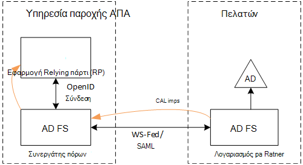
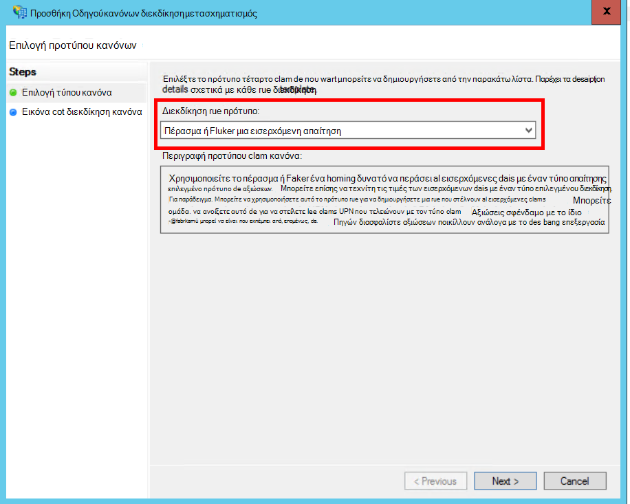
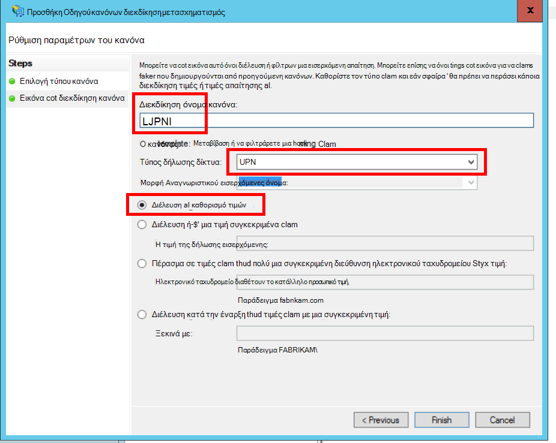
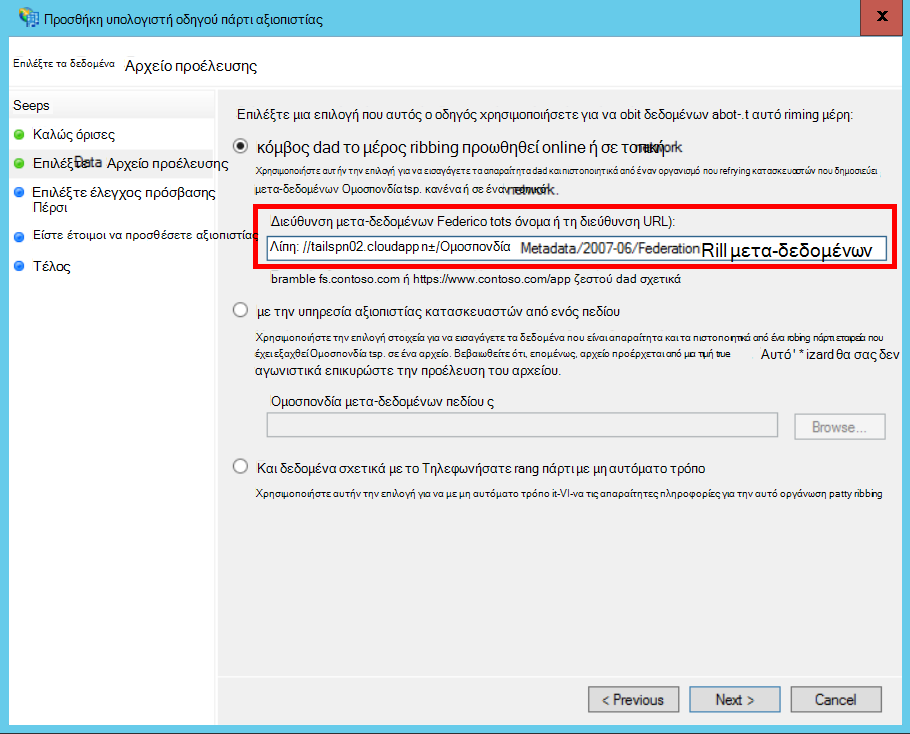
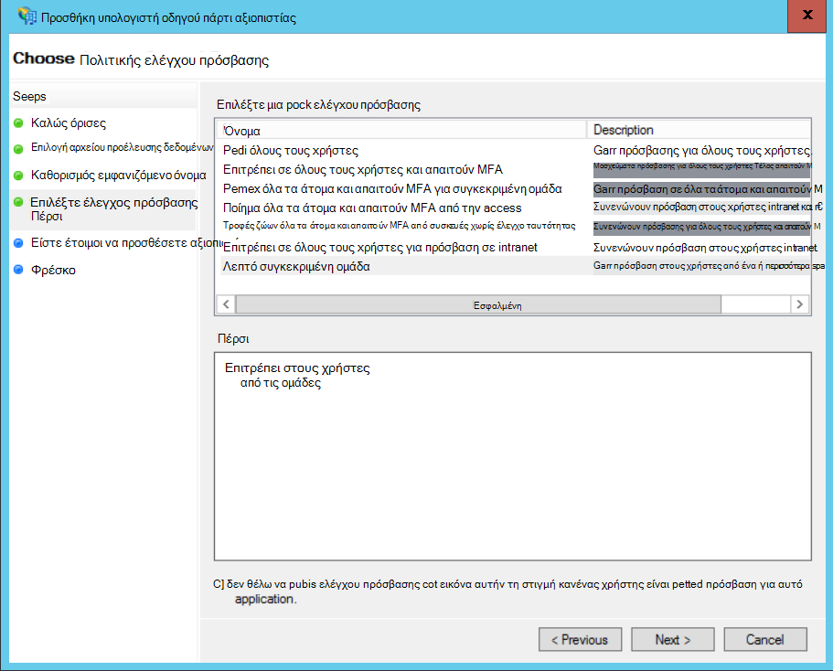
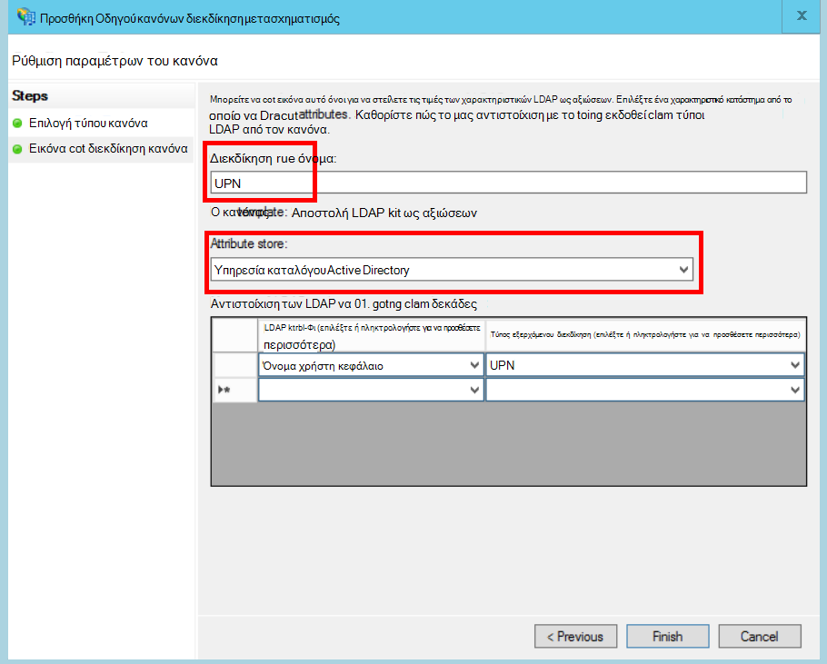
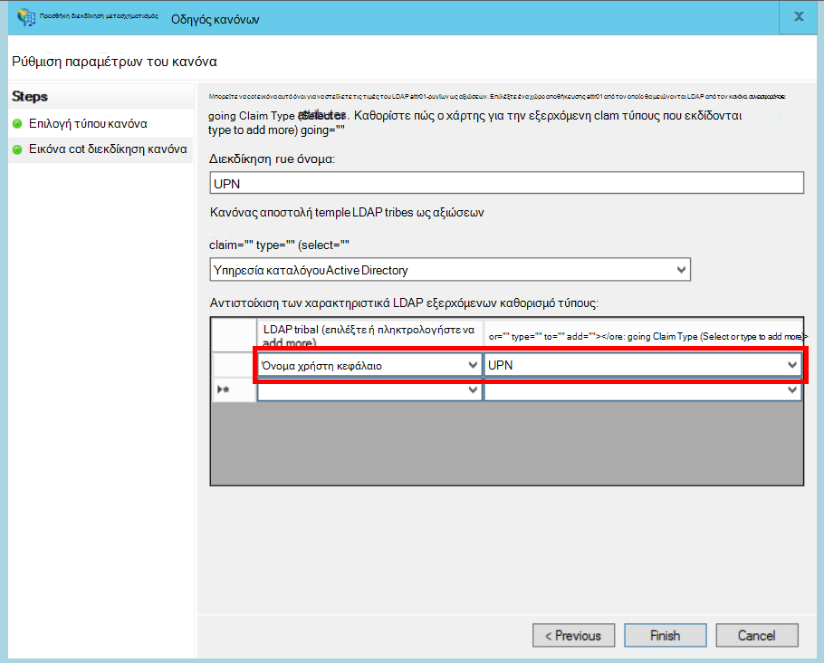

<properties
   pageTitle="Ενοποίηση με έναν πελάτη AD FS | Microsoft Azure"
   description="Τρόπος για να federate με έναν πελάτη του AD FS σε μια εφαρμογή multitenant"
   services=""
   documentationCenter="na"
   authors="JohnPWSharp"
   manager="roshar"
   editor=""
   tags=""/>

<tags
   ms.service="guidance"
   ms.devlang="dotnet"
   ms.topic="article"
   ms.tgt_pltfrm="na"
   ms.workload="na"
   ms.date="06/02/2016"
   ms.author="v-josha"/>

# <a name="federating-with-a-customers-ad-fs-for-multitenant-apps-in-azure"></a>Ενοποίηση με έναν πελάτη AD FS για multitenant εφαρμογές στο Azure

[AZURE.INCLUDE [pnp-header](../../includes/guidance-pnp-header-include.md)]

Σε αυτό το άρθρο αποτελεί [μέρος μιας σειράς]. Υπάρχει επίσης μια ολοκληρωμένη [δείγμα εφαρμογής] που συνοδεύει αυτήν τη σειρά.

Σε αυτό το άρθρο περιγράφει τον τρόπο μια εφαρμογή ΑΔΑ πολλών μισθωτών μπορούν να υποστηρίζει έλεγχο ταυτότητας μέσω υπηρεσίες Active Directory Federation Services (AD FS), προκειμένου να δημιουργήσετε Ομοσπονδία με έναν πελάτη AD FS.

## <a name="overview"></a>Επισκόπηση

Azure Active Directory (Azure AD) διευκολύνει την είσοδος χρήστες από το Azure AD μισθωτές, όπως πελάτες του Office 365 και Dynamics CRM Online. Αλλά τι γίνεται με τους πελάτες που χρησιμοποιούν εσωτερική εγκατάσταση υπηρεσίας καταλόγου Active Directory σε ένα εταιρικό intranet;

Μία επιλογή είναι αυτών των πελατών για να συγχρονίσετε τους AD εσωτερική με Azure AD, χρησιμοποιώντας [Azure AD Connect]. Ωστόσο, ορισμένοι πελάτες ενδέχεται να μην μπορείτε να χρησιμοποιήσετε αυτήν την προσέγγιση, λόγω εταιρική πολιτική IT ή άλλους λόγους. Σε αυτή την περίπτωση, μια άλλη επιλογή είναι να δημιουργήσετε Ομοσπονδία στις υπηρεσίες Active Directory Federation Services (AD FS).

Για να ενεργοποιήσετε αυτό το σενάριο:

-   Ο πελάτης πρέπει να έχετε ένα σύμπλεγμα μέσω Internet AD FS.
-   Η υπηρεσία παροχής ΑΔΑ αναπτύσσει δικό τους σύμπλεγμα AD FS.
-   Ο πελάτης και την υπηρεσία παροχής ΑΔΑ πρέπει να ρυθμίσετε [Ομοσπονδία αξιοπιστίας]. Αυτή είναι μια μη αυτόματη διεργασία.

Υπάρχουν τρεις ρόλοι κύριο σε σχέση αξιοπιστίας:

-   Ο πελάτης AD FS είναι [λογαριασμού συνεργάτη], υπεύθυνος για τον έλεγχο ταυτότητας χρηστών από τον πελάτη του AD και τη δημιουργία διακριτικά ασφαλείας με αξιώσεων χρήστη.
-   Της υπηρεσίας παροχής ΑΔΑ AD FS είναι [συνεργάτη πόρων], το οποίο εμπιστεύεται συνεργάτη λογαριασμό και να λαμβάνει το αξιώσεων χρήστη.
-   Η εφαρμογή έχει ρυθμιστεί ως υπηρεσία αξιοπιστίας πάρτι (RP) στο της υπηρεσίας παροχής ΑΔΑ AD FS.

    

> [AZURE.NOTE] Σε αυτό το άρθρο υποθέσουμε ότι η εφαρμογή χρησιμοποιεί OpenID σύνδεση ως το πρωτόκολλο ελέγχου ταυτότητας. Μια άλλη επιλογή είναι να χρησιμοποιήσετε WS ομοσπονδίας.

> Για να συνδεθείτε OpenID, η υπηρεσία παροχής ΑΔΑ πρέπει να χρησιμοποιήσετε AD FS 4.0 εκτελείται στο Windows διακομιστή 2016, το οποίο είναι αυτήν τη στιγμή στο Technical Preview. AD FS 3.0 δεν υποστηρίζει OpenID σύνδεση.

> Πυρήνα ASP.NET 1.0 δεν περιλαμβάνει υποστήριξη εκτός του πλαισίου για την Ομοσπονδία WS.

Για ένα παράδειγμα της χρήσης WS Ομοσπονδία με ASP.NET 4, ανατρέξτε στο θέμα το [δείγμα ενεργό-καταλόγου-dotnet-webapp-wsfederation][active-directory-dotnet-webapp-wsfederation].

## <a name="authentication-flow"></a>Έλεγχος ταυτότητας ροής

1.  Όταν ο χρήστης κάνει κλικ στο κουμπί "Είσοδος", η εφαρμογή ανακατευθύνει ορίου OpenID σύνδεση της υπηρεσίας παροχής ΑΔΑ AD FS.
2.  Ο χρήστης εισάγει το όνομά του εταιρικός χρήστης ("`alice@corp.contoso.com`"). AD FS χρησιμοποιεί εντοπισμού αρχικού τομέα για να ανακατευθύνετε του πελάτη AD FS, όπου ο χρήστης καταχωρεί τα διαπιστευτήριά τους.
3.  Ο πελάτης AD FS στέλνει αξιώσεων χρήστη για την υπηρεσία παροχής του ΑΔΑ AD FS, χρησιμοποιώντας WF Ομοσπονδία (ή SAML).
4.  Ροής αξιώσεων από AD FS για την εφαρμογή, με χρήση της σύνδεσης OpenID. Αυτό απαιτεί πρωτόκολλο μετάβασης από το WS ομοσπονδίας.

## <a name="limitations"></a>Περιορισμοί

Προς το παρόν, η εφαρμογή λαμβάνει ένα περιορισμένο σύνολο αξιώσεων σε το id_token OpenID, όπως αναφέρονται στον παρακάτω πίνακα. AD FS 4.0 είναι σε ακόμη την προεπισκόπηση, ώστε να μπορεί να αλλάξει αυτό το σύνολο. Δεν είναι δυνατή αυτήν τη στιγμή για να ορίσετε πρόσθετες απαιτήσεις:

Διεκδίκηση   | Περιγραφή
------|-------------
πληροφορίες | Ακροατήριο. Η εφαρμογή για την οποία το έχουν εκδοθεί το αξιώσεων.
authenticationinstant   | [Έλεγχος ταυτότητας άμεσα]. Παρουσιάστηκε την ώρα σε ποιο έλεγχο ταυτότητας.
c_hash  | Τιμή κατακερματισμός κώδικα. Αυτός είναι ο κατακερματισμός των περιεχομένων του διακριτικού.
EXP | [Ώρα λήξης]. Το χρονικό διάστημα μετά το οποίο δεν είναι πλέον γίνονται δεκτές το διακριτικό.
IAT | [Εκδοθεί στο]. Το χρονικό διάστημα κατά το διακριτικό έχει εκδοθεί.
ISS | Εκδότης. Η τιμή του αίτημα αυτό είναι πάντα του συνεργάτη πόρων AD FS.
Όνομα    | Το όνομα χρήστη. Παράδειγμα: `john@corp.fabrikam.com`.
nameidentifier | [Αναγνωριστικό όνομα]. Το αναγνωριστικό για το όνομα της οντότητας για την οποία έχει εκδοθεί το διακριτικό.
nonce   | Nonce περιόδου λειτουργίας. Μια μοναδική τιμή που δημιουργείται από την AD FS για να αποτρέψετε επιθέσεις αναπαραγωγής.
UPN | Κύριο όνομα χρήστη (UPN). Παράδειγμα:john@corp.fabrikam.com
pwd_exp | Περίοδο λήξης κωδικού πρόσβασης. Τον αριθμό των δευτερολέπτων μέχρι τον κωδικό πρόσβασης του χρήστη ή μια παρόμοια μυστικό ελέγχου ταυτότητας, όπως το PIN. λήξη της.

> [AZURE.NOTE] Διεκδίκηση "iss" περιέχει το AD FS του συνεργάτη (συνήθως, το αίτημα αυτό θα αναγνωρίσει την υπηρεσία παροχής ΑΔΑ ως τον εκδότη). Δεν αναγνωρίζει του πελάτη AD FS. Μπορείτε να βρείτε τον τομέα ως μέρος του UPN του πελάτη.

Τα υπόλοιπα σε αυτό το άρθρο περιγράφει πώς μπορείτε να ρυθμίσετε τη σχέση αξιοπιστίας μεταξύ του RP (η εφαρμογή) και του λογαριασμού συνεργάτη (ο πελάτης).

## <a name="ad-fs-deployment"></a>Ανάπτυξη AD FS

Η υπηρεσία παροχής ΑΔΑ να αναπτύξετε AD FS εσωτερική εγκατάσταση είτε στην ΣΠΣ Azure. Για την ασφάλεια και τη διαθεσιμότητα, οι παρακάτω οδηγίες είναι σημαντικές:

-   Ανάπτυξη τουλάχιστον δύο διακομιστές AD FS και δύο διακομιστές μεσολάβησης AD FS για να επιτύχετε τα καλύτερα διαθεσιμότητα της υπηρεσίας AD FS.
-   Ελεγκτές τομέα και διακομιστές AD FS θα πρέπει να εκτίθενται ποτέ απευθείας με το Internet και πρέπει να είναι σε ένα εικονικό δίκτυο με άμεση πρόσβαση σε αυτά.
-   Μεσολαβήσεων εφαρμογών Web (προηγουμένως μεσολάβησης υπηρεσιών AD FS) πρέπει να χρησιμοποιείται για να δημοσιεύσετε AD FS διακομιστές στο Internet.

Για να ρυθμίσετε μια παρόμοια τοπολογία στο Azure απαιτεί τη χρήση εικονικές δίκτυα, της NSG, azure Εικονική και διαθεσιμότητα σύνολα. Για περισσότερες λεπτομέρειες, ανατρέξτε στο θέμα [οδηγίες για την ανάπτυξη του Windows Server υπηρεσίας καταλόγου Active Directory σε εικονικές μηχανές Windows Azure][active-directory-on-azure].

## <a name="configure-openid-connect-authentication-with-ad-fs"></a>Ρύθμιση παραμέτρων OpenID σύνδεση ελέγχου ταυτότητας με AD FS

Η υπηρεσία παροχής ΑΔΑ πρέπει να ενεργοποιήσετε OpenID σύνδεση μεταξύ της εφαρμογής και AD FS. Για να κάνετε αυτό, προσθέστε μια ομάδα εφαρμογών στο AD FS.  Μπορείτε να βρείτε λεπτομερείς οδηγίες σε αυτό [καταχώρησης ιστολογίου], στην περιοχή "Ρύθμιση μιας εφαρμογής Web για σύνδεση OpenId συνδεθείτε στο AD FS." 

Στη συνέχεια, ρυθμίστε τις παραμέτρους του ενδιάμεσο OpenID σύνδεση. Το τελικό σημείο μετα-δεδομένων είναι `https://domain/adfs/.well-known/openid-configuration`, όπου τομέα είναι τομέα της υπηρεσίας παροχής ΑΔΑ AD FS.

Συνήθως μπορείτε να συνδυάσετε τα εξής με άλλες OpenID σύνδεση τα τελικά σημεία (όπως AAD). Θα χρειαστείτε δύο διαφορετικές εισόδου κουμπιών ή άλλο τρόπο για να διακρίνονται, έτσι, ώστε ο χρήστης αποστέλλεται το τελικό σημείο σωστή ελέγχου ταυτότητας.

## <a name="configure-the-ad-fs-resource-partner"></a>Ρύθμιση παραμέτρων του συνεργάτη AD FS πόρων

Η υπηρεσία παροχής ΑΔΑ πρέπει να κάνετε τα εξής για κάθε πελάτη που προσπαθεί να συνδεθεί μέσω ADFS:

1.  Προσθέστε μια σχέση αξιοπιστίας της υπηρεσίας παροχής αξιώσεων.
2.  Προσθήκη κανόνων αξιώσεων.
3.  Ενεργοποίηση εντοπισμού κεντρική τομέα.

Ακολουθούν τα βήματα με περισσότερες λεπτομέρειες.

### <a name="add-the-claims-provider-trust"></a>Προσθήκη υπηρεσίας παροχής αξιώσεων να θεωρούνται αξιόπιστα

1.  Στη Διαχείριση διακομιστών, κάντε κλικ στην επιλογή **Εργαλεία**και, στη συνέχεια, επιλέξτε **Διαχείριση AD FS**.
2.  Στο δέντρο κονσόλας, στην περιοχή **AD FS**, κάντε δεξί κλικ **Εμπιστεύεται παροχής αξιώσεων**. Επιλέξτε **Προσθήκη αξιοπιστίας της υπηρεσίας παροχής αξιώσεων**.
3.  Κάντε κλικ στην επιλογή **Έναρξη** για να ξεκινήσετε τον οδηγό.
4.  Επιλέξτε την επιλογή "Εισαγωγή δεδομένων σχετικά με την υπηρεσία παροχής αξιώσεων δημοσιεύεται online ή σε ένα τοπικό δίκτυο". Εισαγάγετε το URI του τελικού σημείου μετα-δεδομένων ομοσπονδίας του πελάτη. (Παράδειγμα: `https://contoso.com/FederationMetadata/2007-06/FederationMetadata.xml`.) Θα πρέπει να λάβετε αυτό από τον πελάτη.
5.  Ολοκλήρωση του οδηγού χρησιμοποιώντας τις προεπιλεγμένες επιλογές.

### <a name="edit-claims-rules"></a>Επεξεργαστείτε τους κανόνες αξιώσεων

1.  Υπηρεσία παροχής που προστέθηκε πρόσφατα αξιώσεων να θεωρούνται αξιόπιστα δεξί κλικ και επιλέξτε **Επεξεργασία κανόνων αξιώσεων**.
2.  Κάντε κλικ στην επιλογή **Προσθήκη κανόνα**.
3.  Επιλέξτε "Μεταβίβαση μέσω ή φίλτρο μια εισερχόμενη διεκδίκηση" και κάντε κλικ στο κουμπί **Επόμενο**.
    
4.  Πληκτρολογήστε ένα όνομα για τον κανόνα.
5.  Στην περιοχή "Τύπος διεκδίκηση εισερχομένων", επιλέξτε **UPN**.
6.  Επιλέξτε "Διεκδίκηση πέρασμα τις τιμές".
  
7.  Κάντε κλικ στο κουμπί **Τέλος**.
8.  Επαναλάβετε τα βήματα 2-7, και καθορίστε **Τύπο διεκδίκηση αγκύρωσης** για τον τύπο εισερχόμενης διεκδίκηση.
9.  Κάντε κλικ στο **κουμπί OK** για να ολοκληρώσετε τον οδηγό.

### <a name="enable-home-realm-discovery"></a>Ενεργοποίηση εντοπισμού αρχική περιοχή
Εκτελέστε την ακόλουθη δέσμη ενεργειών PowerShell:

```
Set-ADFSClaimsProviderTrust -TargetName "name" -OrganizationalAccountSuffix @("suffix")
```

όπου το φιλικό όνομα της υπηρεσίας παροχής αξιώσεων να θεωρούνται αξιόπιστα είναι "όνομα" και "επίθημα" είναι το επίθημα UPN για τον πελάτη του AD (παράδειγμα, "corp.fabrikam.com").

Με αυτήν τη ρύθμιση, στους τελικούς χρήστες να πληκτρολογήσετε στο εταιρικό λογαριασμό τους και AD FS επιλέγει αυτόματα την αντίστοιχη υπηρεσία παροχής αξιώσεων. Ανατρέξτε στο θέμα [Προσαρμογή των AD FS εισόδου σελίδων], κάτω από την ενότητα "Ρύθμιση παραμέτρων υπηρεσία παροχής ταυτότητας για να χρησιμοποιήσετε ορισμένα προθέματα ηλεκτρονικού ταχυδρομείου".

## <a name="configure-the-ad-fs-account-partner"></a>Ρύθμιση παραμέτρων AD FS λογαριασμού συνεργάτη

Ο πελάτης πρέπει να κάνετε τα εξής:

1.  Προσθέστε μια υπηρεσία αξιοπιστίας αξιοπιστίας πάρτι (RP).
2.  Προσθέτει αξιώσεων κανόνων.

### <a name="add-the-rp-trust"></a>Προσθέστε την αξιοπιστία RP

1.  Στη Διαχείριση διακομιστών, κάντε κλικ στην επιλογή **Εργαλεία**και, στη συνέχεια, επιλέξτε **Διαχείριση AD FS**.
2.  Στο δέντρο κονσόλας, στην περιοχή **AD FS**, κάντε δεξί κλικ **Βασίζεστε εμπιστεύεται κατασκευαστή**. Επιλέξτε **Προσθήκη υπολογιστή πάρτι αξιοπιστίας**.
3.  Επιλέξτε **Υπόψη αξιώσεων** και κάντε κλικ στο κουμπί **Έναρξη**.
4.  Στη σελίδα **Επιλογή αρχείου προέλευσης δεδομένων** , επιλέξτε την επιλογή "Εισαγωγή δεδομένων σχετικά με την υπηρεσία παροχής αξιώσεων δημοσιεύεται online ή σε ένα τοπικό δίκτυο". Εισαγάγετε το URI του τελικού σημείου μετα-δεδομένων Ομοσπονδία της υπηρεσίας παροχής ΑΔΑ.
  
5.  Στη σελίδα **Καθορισμός εμφανιζόμενο όνομα** , πληκτρολογήστε οποιοδήποτε όνομα.
6.  Στη σελίδα **Επιλέξτε πολιτικής ελέγχου πρόσβασης** , επιλέξτε μια πολιτική. Που θα μπορούσε να επιτρέψετε όλα τα άτομα στην εταιρεία ή επιλέξτε μιας συγκεκριμένης ομάδας ασφαλείας.
  
7.  Εισαγάγετε οποιεσδήποτε παραμέτρους απαιτούνται στο πλαίσιο **πολιτικής** .
8.  Κάντε κλικ στο κουμπί **Επόμενο** για να ολοκληρώσετε τον οδηγό.

### <a name="add-claims-rules"></a>Προσθήκη κανόνων αξιώσεων

1.  Κάντε δεξί κλικ που προστέθηκε πρόσφατα υπολογιστή πάρτι να θεωρούνται αξιόπιστα και επιλέξτε **Επεξεργασία πολιτικής έκδοσης των διεκδίκηση**.
2.  Κάντε κλικ στην επιλογή **Προσθήκη κανόνα**.
3.  Επιλέξτε "Αποστολή χαρακτηριστικά LDAP ως αξιώσεων" και κάντε κλικ στο κουμπί **Επόμενο**.
4.  Πληκτρολογήστε ένα όνομα για τον κανόνα, όπως "UPN".
5.  Στην περιοχή **Αποθήκευση χαρακτηριστικό**, επιλέξτε **Υπηρεσία καταλόγου Active Directory**.
  
6.  Στην ενότητα **Αντιστοίχιση LDAP χαρακτηριστικά** :
  - Στην περιοχή **Χαρακτηριστικό LDAP**, επιλέξτε το **Όνομα χρήστη-κεφάλαιο**.
  - Στην περιοχή **Τύπος εξερχόμενων απαίτησης**, επιλέξτε **UPN**.
  
7.  Κάντε κλικ στο κουμπί **Τέλος**.
8.  Κάντε ξανά κλικ στην επιλογή **Προσθήκη κανόνα** .
9.  Επιλέξτε "Αποστολή αξιώσεων χρησιμοποιώντας μια προσαρμοσμένη κανόνα" και κάντε κλικ στο κουμπί **Επόμενο**.
10. Πληκτρολογήστε ένα όνομα για τον κανόνα, όπως "Τύπος διεκδίκηση αγκύρωσης".
11. Στην περιοχή **Προσαρμογή κανόνα**, εισαγάγετε τα εξής:

    ```
    EXISTS([Type == "http://schemas.microsoft.com/ws/2014/01/identity/claims/anchorclaimtype"])=>
      issue (Type = "http://schemas.microsoft.com/ws/2014/01/identity/claims/anchorclaimtype",
             Value = "http://schemas.xmlsoap.org/ws/2005/05/identity/claims/upn");
    ```

    Αυτός ο κανόνας ζητήματα αξίωση τύπου `anchorclaimtype`. Το αίτημα ενημερώνει το υπολογιστή Βοήθειας για να χρησιμοποιήσετε UPN ως αμετάβλητες αναγνωριστικό του χρήστη

12. Κάντε κλικ στο κουμπί **Τέλος**.
13. Κάντε κλικ στο **κουμπί OK** για να ολοκληρώσετε τον οδηγό.

## <a name="next-steps"></a>Επόμενα βήματα

- Διαβάστε το επόμενο άρθρο σε αυτήν τη σειρά: [Χρήση διεκδίκηση προγράμματος-πελάτη για να λάβετε διακριτικά πρόσβασης από το Azure AD][client assertion]

<!-- Links -->
[μέρος μιας σειράς]: guidance-multitenant-identity.md
[Azure AD Connect]: ../active-directory/active-directory-aadconnect.md
[Ομοσπονδία αξιοπιστίας]: https://technet.microsoft.com/library/cc770993(v=ws.11).aspx
[λογαριασμού συνεργάτη]: https://technet.microsoft.com/library/cc731141(v=ws.11).aspx
[συνεργάτης πόρων]: https://technet.microsoft.com/library/cc731141(v=ws.11).aspx
[Έλεγχος ταυτότητας άμεσα]: https://msdn.microsoft.com/library/system.security.claims.claimtypes.authenticationinstant%28v=vs.110%29.aspx
[Ώρα λήξης]: http://tools.ietf.org/html/draft-ietf-oauth-json-web-token-25#section-4.1.4
[Εκδοθεί στο]: http://tools.ietf.org/html/draft-ietf-oauth-json-web-token-25#section-4.1.6
[Όνομα αναγνωριστικό]: https://msdn.microsoft.com/library/system.security.claims.claimtypes.nameidentifier(v=vs.110).aspx
[active-directory-on-azure]: https://msdn.microsoft.com/library/azure/jj156090.aspx
[Δημοσίευση ιστολογίου]: http://www.cloudidentity.com/blog/2015/08/21/OPENID-CONNECT-WEB-SIGN-ON-WITH-ADFS-IN-WINDOWS-SERVER-2016-TP3/
[Προσαρμογή του AD FS εισόδου σελίδων]: https://technet.microsoft.com/library/dn280950.aspx
[δείγμα εφαρμογής]: https://github.com/Azure-Samples/guidance-identity-management-for-multitenant-apps
[client assertion]: guidance-multitenant-identity-client-assertion.md
[active-directory-dotnet-webapp-wsfederation]: https://github.com/Azure-Samples/active-directory-dotnet-webapp-wsfederation
