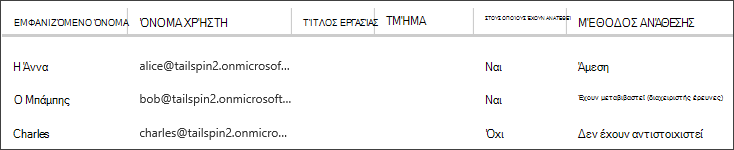

<properties
   pageTitle="Ρόλοι της εφαρμογής | Microsoft Azure"
   description="Πώς να εκτελείτε εξουσιοδότησης χρησιμοποιώντας ρόλους εφαρμογής"
   services=""
   documentationCenter="na"
   authors="MikeWasson"
   manager="roshar"
   editor=""
   tags=""/>

<tags
   ms.service="guidance"
   ms.devlang="dotnet"
   ms.topic="article"
   ms.tgt_pltfrm="na"
   ms.workload="na"
   ms.date="02/16/2016"
   ms.author="mwasson"/>

#  <a name="application-roles-in-multitenant-applications"></a>Ρόλοι της εφαρμογής στις εφαρμογές multitenant

[AZURE.INCLUDE [pnp-header](../../includes/guidance-pnp-header-include.md)]

Σε αυτό το άρθρο αποτελεί [μέρος μιας σειράς]. Υπάρχει επίσης μια ολοκληρωμένη [δείγμα εφαρμογής] που συνοδεύει αυτήν τη σειρά.

Εφαρμογή τους ρόλους που χρησιμοποιούνται για να εκχωρήσετε δικαιώματα σε χρήστες. Για παράδειγμα, το [Tailspin έρευνες] [ Tailspin] εφαρμογή ορίζει τους εξής ρόλους:

- Διαχειριστής. Να εκτελέσετε όλες οι λειτουργίες CRUD σε οποιαδήποτε έρευνα που ανήκει σε αυτόν το μισθωτή.
- Εκπαιδευτικών. Να δημιουργήσετε νέες έρευνες.
- Πρόγραμμα ανάγνωσης. Διαβάστε τις έρευνες που ανήκουν σε αυτόν το μισθωτή.

Μπορείτε να δείτε ότι ρόλους τελικά να μεταφραστεί δικαιώματα, κατά τη διάρκεια της [εξουσιοδότησης]. Αλλά την πρώτη ερώτηση πώς μπορείτε να εκχωρήσετε και να διαχειριστείτε τους ρόλους. Εντοπίσαμε τρεις βασικές επιλογές:

-   [Azure AD εφαρμογής ρόλων](#roles-using-azure-ad-app-roles)
-   [Azure AD τις ομάδες ασφαλείας](#roles-using-azure-ad-security-groups)
-   [Διαχείριση ρόλων εφαρμογών](#roles-using-an-application-role-manager).

## <a name="roles-using-azure-ad-app-roles"></a>Ρόλοι χρήση Azure AD εφαρμογής ρόλων

Αυτή είναι η προσέγγιση που χρησιμοποιήσαμε στην εφαρμογή Tailspin έρευνες.

Σε αυτήν την προσέγγιση, ΑΔΑ η υπηρεσία παροχής ορίζει οι ρόλοι της εφαρμογής, προσθέτοντάς τις στη τη δήλωση της εφαρμογής. Αφού ένας πελάτης εγγράφεται, διαχειριστής για καταλόγου AD του πελάτη αντιστοιχίζει τους χρήστες σε ρόλους. Όταν ένας χρήστης πραγματοποιεί είσοδο, ο χρήστης που του έχουν ανατεθεί ρόλοι αποστέλλονται ως αξιώσεων.

> [AZURE.NOTE] Εάν ο πελάτης έχει Azure AD Premium, ο διαχειριστής μπορεί να εκχωρήσει μια ομάδα ασφαλείας σε ένα ρόλο και τα μέλη της ομάδας θα μεταβιβάζεται το ρόλο εφαρμογής. Αυτό είναι ένας εύκολος τρόπος για να διαχειριστείτε τους ρόλους, επειδή ο κάτοχος της ομάδας δεν πρέπει να είστε διαχειριστής AD

Τα πλεονεκτήματα αυτής της προσέγγισης:

-   Απλό μοντέλο προγραμματισμού.
-   Ρόλοι είναι συγκεκριμένες για την εφαρμογή. Το ρόλο αξιώσεις για μια εφαρμογή δεν αποστέλλονται σε μια άλλη εφαρμογή.
-   Εάν ο πελάτης καταργεί την εφαρμογή από το μισθωτή AD, οι ρόλοι μεταβείτε δεν βρίσκομαι στον υπολογιστή.
-   Η εφαρμογή δεν χρειάζεται οποιαδήποτε επιπλέον δικαιώματα υπηρεσίας καταλόγου Active Directory, εκτός από το ανάγνωσης προφίλ χρήστη.

Μειονεκτήματα:

- Πελάτες χωρίς Azure AD Premium δεν είναι δυνατό να αντιστοιχίσετε ομάδες ασφαλείας σε ρόλους. Αυτών των πελατών, όλες τις αναθέσεις χρήστη πρέπει να εκτελεστούν από ένα διαχειριστή AD.
- Εάν έχετε μια τοποθεσία web παρασκηνίου API, το οποίο είναι ξεχωριστό από το web app, στη συνέχεια, εκχωρήσεις ρόλων για την εφαρμογή web δεν ισχύουν για το API web. Για περαιτέρω ανάλυση των αυτό το σημείο, ανατρέξτε στο θέμα [ασφάλιση ενός στοιχείου διακομιστή web API].

### <a name="implementation"></a>Εφαρμογή

**Ορισμός τους ρόλους.** Η υπηρεσία παροχής ΑΔΑ δηλώνει τους ρόλους εφαρμογής στο την [εφαρμογή δήλωσης]. Για παράδειγμα, ακολουθεί δήλωσης καταχώρησης για την εφαρμογή έρευνες:

```
"appRoles": [
  {
    "allowedMemberTypes": [
      "User"
    ],
    "description": "Creators can create Surveys",
    "displayName": "SurveyCreator",
    "id": "1b4f816e-5eaf-48b9-8613-7923830595ad",
    "isEnabled": true,
    "value": "SurveyCreator"
  },
  {
    "allowedMemberTypes": [
      "User"
    ],
    "description": "Administrators can manage the Surveys in their tenant",
    "displayName": "SurveyAdmin",
    "id": "c20e145e-5459-4a6c-a074-b942bbd4cfe1",
    "isEnabled": true,
    "value": "SurveyAdmin"
  }
],
```

Το `value` ιδιότητα εμφανίζεται στο το αίτημα ρόλο. Το `id` ιδιότητα είναι το μοναδικό αναγνωριστικό για το καθορισμένο ρόλο. Δημιουργεί μια νέα τιμή GUID για πάντα `id`.

**Αντιστοίχιση χρηστών**. Όταν ένας νέος πελάτης εγγράφεται, η εφαρμογή είναι καταχωρημένος στο μισθωτή AD του πελάτη. Σε αυτό το σημείο, διαχειριστής AD για αυτόν το μισθωτή μπορούν να εκχωρήσουν στους χρήστες σε ρόλους.

> [AZURE.NOTE] Όπως σημειώθηκε προηγούμενα, πελάτες με το Azure AD Premium μπορούν επίσης να εκχωρήσουν ομάδες ασφαλείας σε ρόλους.

Το παρακάτω στιγμιότυπο οθόνης από την πύλη του Azure εμφανίζει τρεις χρήστες. Η Άννα έχει αντιστοιχιστεί απευθείας σε ένα ρόλο. Ο Μπάμπης μεταβιβαστεί ένα ρόλο ως μέλος μιας ομάδας ασφαλείας με το όνομα "Έρευνες διαχειριστής", που έχει αντιστοιχιστεί σε ένα ρόλο. Charles δεν έχει αντιστοιχιστεί σε κάθε ρόλο.



> [AZURE.NOTE] Εναλλακτικά, η εφαρμογή να εκχωρήσετε ρόλους μέσω προγραμματισμού, με χρήση του API Azure AD Graph.  Ωστόσο, αυτό απαιτεί την εφαρμογή για να αποκτήσετε δικαιώματα εγγραφής για καταλόγου AD του πελάτη. Μια εφαρμογή με αυτά τα δικαιώματα θα μπορούσε να κάνετε πολλά σκανταλιά &mdash; ο πελάτης αξιοπιστία στην εφαρμογή για να μην mess του καταλόγου τους. Πολλοί πελάτες μπορεί να είναι πρόθυμοι να εκχωρήσετε αυτό το επίπεδο πρόσβασης.

**Λήψη αξιώσεων ρόλο**. Όταν ένας χρήστης πραγματοποιεί είσοδο, την εφαρμογή λαμβάνει του χρήστη που του έχουν ανατεθεί ρόλους σε ένα αίτημα με τον τύπο `http://schemas.microsoft.com/ws/2008/06/identity/claims/role`.  

Ο χρήστης μπορεί να έχει πολλούς ρόλους ή κανένα ρόλο. Στον κώδικα εξουσιοδότησης, δεν θεωρείται ότι ο χρήστης έχει ακριβώς ένα ρόλο διεκδίκηση. Αντί για αυτό, σύνταξη κώδικα που ελέγχει αν υπάρχει μια τιμή συγκεκριμένο διεκδίκηση:

```csharp
if (context.User.HasClaim(ClaimTypes.Role, "Admin")) { ... }
```

## <a name="roles-using-azure-ad-security-groups"></a>Ρόλοι χρησιμοποιώντας Azure AD ομάδες ασφαλείας

Σε αυτήν την προσέγγιση, ρόλοι αναπαριστώνται ως AD ομάδες ασφαλείας. Η εφαρμογή εκχωρεί δικαιώματα σε χρήστες με βάση τις ιδιότητες μέλους ομάδας ασφαλείας.

Τα πλεονεκτήματα:

-   Για πελάτες που δεν έχουν Azure AD Premium, αυτή η προσέγγιση τη δυνατότητα να χρησιμοποιούν τις ομάδες ασφαλείας για τη Διαχείριση εκχώρησης ρόλου.

Μειονεκτήματα:

- Πολυπλοκότητα. Επειδή κάθε μισθωτή σας στείλει αξιώσεων διαφορετικό ομαδοποίηση, την εφαρμογή πρέπει να παρακολούθηση των ομάδων ασφαλείας αντιστοιχούν σε ποια εφαρμογή ρόλους, για κάθε μισθωτή.
- Εάν ο πελάτης καταργεί την εφαρμογή από το μισθωτή AD, τις ομάδες ασφαλείας παραμένουν στη τους καταλόγου AD.

### <a name="implementation"></a>Εφαρμογή

Στη δήλωση εφαρμογής, ορίστε το `groupMembershipClaims` ιδιότητα που θα "SecurityGroup". Αυτό είναι απαραίτητο για τη λήψη δηλώσεις ιδιότητα μέλους ομάδας από AAD.

```
{
   // ...
   "groupMembershipClaims": "SecurityGroup",
}
```

Όταν ένας νέος πελάτης εγγράφεται, η εφαρμογή καθοδηγεί στον πελάτη για να δημιουργήσετε ομάδες ασφαλείας για τους ρόλους που απαιτούνται από την εφαρμογή. Ο πελάτης, στη συνέχεια, πρέπει να εισαγάγετε το αντικείμενο ομάδας αναγνωριστικά στην εφαρμογή. Η εφαρμογή αποθηκεύει αυτά σε έναν πίνακα που αντιστοιχίζει αναγνωριστικά ομάδας ρόλων εφαρμογής, ανά μισθωτή.

> [AZURE.NOTE] Εναλλακτικά, η εφαρμογή μπορούσατε να δημιουργήσετε τις ομάδες μέσω προγραμματισμού, με χρήση του API Azure AD Graph.  Αυτό είναι λιγότερο ευνοεί σφάλματος. Ωστόσο, απαιτεί την εφαρμογή για να αποκτήσετε "ανάγνωση και εγγραφή όλων των ομάδων" δικαιώματα για καταλόγου AD του πελάτη. Πολλοί πελάτες μπορεί να είναι πρόθυμοι να εκχωρήσετε αυτό το επίπεδο πρόσβασης.

Όταν ένας χρήστης πραγματοποιεί είσοδο:

1.  Η εφαρμογή λαμβάνει τις ομάδες του χρήστη ως αξιώσεων. Η τιμή του κάθε αίτηση είναι το Αναγνωριστικό αντικειμένου μιας ομάδας.
2.  Azure AD περιορίζει τον αριθμό των ομάδων που αποστέλλονται στο διακριτικό. Εάν ο αριθμός των ομάδων υπερβαίνει αυτό το όριο, Azure AD στέλνει μια ειδική διεκδίκηση "μονάδων". Εάν υπάρχει η αξίωση, η εφαρμογή πρέπει να ερώτημα το API Azure AD γράφημα για να λάβετε όλες τις ομάδες στις οποίες ανήκει αυτόν το χρήστη. Για λεπτομέρειες, ανατρέξτε στο θέμα [εξουσιοδότησης στο Cloud εφαρμογών χρησιμοποιώντας ομάδες AD], κάτω από την ενότητα με τίτλο "Ομάδες διεκδίκηση επιπλέον χρέωση μονάδων".
3.  Η εφαρμογή αναζητά το αντικείμενο αναγνωριστικά σε ξεχωριστή βάση δεδομένων, για να βρείτε το αντίστοιχο ρόλοι της εφαρμογής για να εκχωρήσετε στο χρήστη.
4.  Η εφαρμογή προσθέτει μια τιμή προσαρμοσμένου διεκδίκηση του αρχικού χρήστη που εκφράζει το ρόλο εφαρμογής. Για παράδειγμα: `survey_role` = "SurveyAdmin".

Πολιτικές εξουσιοδότησης πρέπει να χρησιμοποιήσετε το προσαρμοσμένο ρόλο αίτημα, όχι στην ομάδα διεκδίκηση.

## <a name="roles-using-an-application-role-manager"></a>Ρόλοι χρησιμοποιώντας μια εφαρμογή Διαχείριση ρόλων

Με αυτήν την προσέγγιση, ρόλους εφαρμογής δεν αποθηκεύονται στο Azure AD καθόλου. Αντί για αυτό, η εφαρμογή αποθηκεύει τις αναθέσεις ρόλων για κάθε χρήστη στο δικό του DB &mdash; για παράδειγμα, χρησιμοποιώντας την κλάση **RoleManager** ASP.NET ταυτότητα.

Τα πλεονεκτήματα:

-   Η εφαρμογή έχει πλήρη έλεγχο τους ρόλους και τις αναθέσεις χρήστη.

Μειονεκτήματα:

- Πιο σύνθετες, δυσκολότερη για να διατηρήσετε.
- Δεν είναι δυνατό να χρησιμοποιούν τις ομάδες ασφαλείας AD για τη Διαχείριση εκχώρησης ρόλου.
- Αποθηκεύει πληροφορίες χρήστη σε βάση δεδομένων της εφαρμογής, όπου το να μπορούν να μεταβούν εκτός συγχρονισμού με καταλόγου AD του μισθωτή, καθώς οι χρήστες έχουν προστεθεί ή καταργηθεί.   

Υπάρχουν πολλά υπάρχοντα παραδείγματα για αυτήν την προσέγγιση. Για παράδειγμα, ανατρέξτε στο θέμα [Δημιουργία μιας εφαρμογής ASP.NET MVC με auth και SQL DB και ανάπτυξη σε Azure εφαρμογής υπηρεσίας].

## <a name="next-steps"></a>Επόμενα βήματα

- Διαβάστε το επόμενο άρθρο σε αυτήν τη σειρά: [βάσει ρόλων και πόρων βάσει εξουσιοδότησης σε εφαρμογές multitenant][εξουσιοδότησης]

<!-- Links -->
[Tailspin]: guidance-multitenant-identity-tailspin.md
[μέρος μιας σειράς]: guidance-multitenant-identity.md
[εξουσιοδότηση]: guidance-multitenant-identity-authorize.md
[Ασφάλιση μιας API web παρασκηνίου]: guidance-multitenant-identity-web-api.md
[Δημιουργία εφαρμογής ASP.NET MVC με auth και SQL DB και ανάπτυξη σε Azure εφαρμογής υπηρεσίας]: ../app-service-web/web-sites-dotnet-deploy-aspnet-mvc-app-membership-oauth-sql-database.md
[δήλωση εφαρμογής]: ../active-directory/active-directory-application-manifest.md
[δείγμα εφαρμογής]: https://github.com/Azure-Samples/guidance-identity-management-for-multitenant-apps
