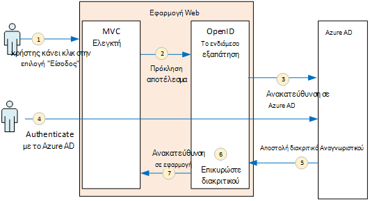
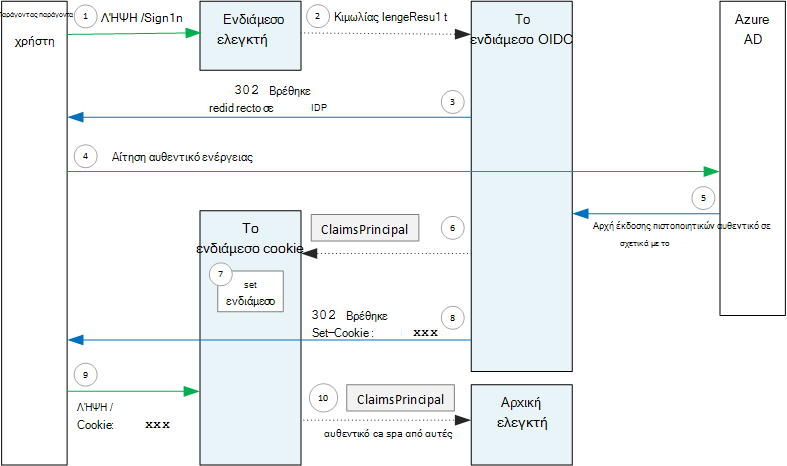

<properties
   pageTitle="Έλεγχος ταυτότητας σε εφαρμογές multitenant | Microsoft Azure"
   description="Πώς μιας multitenant εφαρμογής μπορούν να ελέγχουν την ταυτότητα χρηστών από Azure AD"
   services=""
   documentationCenter="na"
   authors="MikeWasson"
   manager="roshar"
   editor=""
   tags=""/>

<tags
   ms.service="guidance"
   ms.devlang="dotnet"
   ms.topic="article"
   ms.tgt_pltfrm="na"
   ms.workload="na"
   ms.date="05/23/2016"
   ms.author="mwasson"/>

# <a name="authentication-in-multitenant-apps-using-azure-ad-and-openid-connect"></a>Έλεγχος ταυτότητας στο multitenant εφαρμογές, χρησιμοποιώντας Azure AD και συνδέστε OpenID

[AZURE.INCLUDE [pnp-header](../../includes/guidance-pnp-header-include.md)]

Σε αυτό το άρθρο αποτελεί [μέρος μιας σειράς](guidance-multitenant-identity.md). Υπάρχει επίσης μια ολοκληρωμένη [δείγμα εφαρμογής] που συνοδεύει αυτήν τη σειρά.

Σε αυτό το άρθρο περιγράφει πώς μια εφαρμογή multitenant μπορούν να ελέγχουν την ταυτότητα χρήστες από το Azure Active Directory (Azure AD), χρησιμοποιώντας σύνδεση OpenID (OIDC) για τον έλεγχο ταυτότητας.

## <a name="overview"></a>Επισκόπηση

Μας [υλοποίηση αναφορά](guidance-multitenant-identity-tailspin.md) είναι μια εφαρμογή του ASP.NET πυρήνα 1.0. Η εφαρμογή χρησιμοποιεί την ενσωματωμένη ενδιάμεσο OpenID σύνδεση για να εκτελέσετε τη ροή ελέγχου ταυτότητας OIDC. Το παρακάτω διάγραμμα δείχνει τι συμβαίνει όταν ο χρήστης που πραγματοποιεί είσοδο, σε υψηλό επίπεδο.



1.  Ο χρήστης κάνει κλικ στο κουμπί "Είσοδος" στην εφαρμογή. Αυτή η ενέργεια γίνεται από έναν ελεγκτή MVC.
2.  Στον ελεγκτή MVC επιστρέφει μια ενέργεια **ChallengeResult** .
3.  Το ενδιάμεσο διακόπτει την **ChallengeResult** και δημιουργεί μια 302 απαντήσεις, οι οποίες ανακατευθύνει το χρήστη στη σελίδα εισόδου του Azure AD.
4.  Ο χρήστης πραγματοποιεί έλεγχο ταυτότητας με Azure AD.
5.  Azure AD αποστέλλει ένα Αναγνωριστικό διακριτικό στην εφαρμογή.
6.  Το ενδιάμεσο επικυρώσει το διακριτικό Αναγνωριστικό. Σε αυτό το σημείο, ο χρήστης είναι τώρα ο έλεγχος ταυτότητας μέσα στην εφαρμογή.
7.  Το ενδιάμεσο ανακατευθύνει το χρήστη στην εφαρμογή.

## <a name="register-the-app-with-azure-ad"></a>Καταχωρήστε την εφαρμογή Azure AD

Για να ενεργοποιήσετε τη σύνδεση OpenID, η υπηρεσία παροχής ΑΔΑ η εφαρμογή μέσα μόνος του μισθωτή Azure AD καταχωρείται.

Για να καταχωρήσετε την εφαρμογή, ακολουθήστε τα βήματα στις [Εφαρμογές ενοποίηση με το Azure Active Directory](../active-directory/active-directory-integrating-applications.md), στην ενότητα [Προσθήκη μιας εφαρμογής](../active-directory/active-directory-integrating-applications.md#adding-an-application).

Στη σελίδα **Ρύθμιση παραμέτρων** :

-   Σημειώστε το αναγνωριστικό του προγράμματος-πελάτη.
-   Στην περιοχή **εφαρμογή είναι πολλών μισθωτών**, επιλέξτε **Ναι**.
-   Ορισμός **Διεύθυνσης URL απάντηση** σε μια διεύθυνση URL όπου θα σας στέλνει την απόκριση ελέγχου ταυτότητας Azure AD. Μπορείτε να χρησιμοποιήσετε τη βασική διεύθυνση URL της εφαρμογής.
  - Σημείωση: Η διαδρομή URL μπορεί να είναι οτιδήποτε άλλο, με την προϋπόθεση ότι το όνομα κεντρικού υπολογιστή αντιστοιχεί ανάπτυξη της εφαρμογής σας.
  - Μπορείτε να ορίσετε πολλές διευθύνσεις URL απάντηση. Κατά την ανάπτυξη, μπορείτε να χρησιμοποιήσετε ένα `localhost` διεύθυνση, για την εκτέλεση της εφαρμογής τοπικά.
-   Δημιουργία μιας μυστικό προγράμματος-πελάτη: στην περιοχή **πλήκτρα**, κάντε κλικ στο αναπτυσσόμενο που αναφέρει ότι **Επιλέξτε διάρκεια** και επιλέξτε είτε 1 ή 2 ετών. Το κλειδί θα εμφανίζεται όταν κάνετε κλικ στο κουμπί **Αποθήκευση**. Φροντίστε να αντιγράψετε την τιμή, επειδή δεν εμφανίζεται ξανά όταν να φορτώσετε ξανά τη σελίδα ρύθμισης παραμέτρων.

## <a name="configure-the-auth-middleware"></a>Ρύθμιση παραμέτρων του ενδιάμεσο auth

Αυτή η ενότητα περιγράφει πώς να ρυθμίζετε το ενδιάμεσο έλεγχο ταυτότητας στο ASP.NET πυρήνα 1.0 για multitenant έλεγχο ταυτότητας με σύνδεση OpenID.

Στην τάξη σας εκκίνησης, προσθέστε το ενδιάμεσο OpenID σύνδεση:

```csharp
app.UseOpenIdConnectAuthentication(options =>
{
    options.AutomaticAuthenticate = true;
    options.AutomaticChallenge = true;
    options.ClientId = [client ID];
    options.Authority = "https://login.microsoftonline.com/common/";
    options.CallbackPath = [callback path];
    options.PostLogoutRedirectUri = [application URI];
    options.SignInScheme = CookieAuthenticationDefaults.AuthenticationScheme;
    options.TokenValidationParameters = new TokenValidationParameters
    {
        ValidateIssuer = false
    };
    options.Events = [event callbacks];
});
```

> [AZURE.NOTE] Ανατρέξτε στο θέμα [Startup.cs](https://github.com/Azure-Samples/guidance-identity-management-for-multitenant-apps/blob/master/src/Tailspin.Surveys.Web/Startup.cs).

Για περισσότερες πληροφορίες σχετικά με την κλάση εκκίνησης, ανατρέξτε στο θέμα [Εκκίνηση της εφαρμογής](https://docs.asp.net/en/latest/fundamentals/startup.html) στην τεκμηρίωση του ASP.NET πυρήνα 1.0.

Ορίστε τις παρακάτω επιλογές ενδιάμεσο:

- **ClientId**. Η εφαρμογή προγράμματος-πελάτη Αναγνωριστικό, το οποίο έχετε στη διάθεσή σας κατά την καταχώρηση της εφαρμογής στο Azure AD.
- **Αρχή έκδοσης πιστοποιητικών**. Για μια εφαρμογή multitenant, ορίστε αυτή σε `https://login.microsoftonline.com/common/`. Αυτή είναι η διεύθυνση URL για το Azure AD κοινές τελικό σημείο, βοηθώντας έτσι τους χρήστες από οποιαδήποτε μισθωτή Azure AD για να πραγματοποιήσετε είσοδο. Για περισσότερες πληροφορίες σχετικά με το κοινό τελικό σημείο, ανατρέξτε στο θέμα [αυτήν τη δημοσίευση ιστολογίου](http://www.cloudidentity.com/blog/2014/08/26/the-common-endpoint-walks-like-a-tenant-talks-like-a-tenant-but-is-not-a-tenant/).
- Στο **TokenValidationParameters**, ορίστε **ValidateIssuer** FALSE (ψευδής). Αυτό σημαίνει ότι η εφαρμογή θα είναι υπεύθυνα για την επικύρωση την τιμή εκδότη στο διακριτικό Αναγνωριστικό. (Το ενδιάμεσο εξακολουθεί να επικυρώσει το διακριτικό μόνη.) Για περισσότερες πληροφορίες σχετικά με την επικύρωση τον εκδότη, ανατρέξτε στο θέμα [επικύρωσης εκδότη](guidance-multitenant-identity-claims.md#issuer-validation).
- **CallbackPath**. Ρύθμιση ίση με τη διαδρομή στη διεύθυνση URL απάντηση που καταχωρήσατε στο Azure AD. Για παράδειγμα, εάν η διεύθυνση URL απάντηση είναι `http://contoso.com/aadsignin`, θα πρέπει να είναι **CallbackPath** `aadsignin`. Εάν δεν μπορείτε να ορίσετε αυτήν την επιλογή, η προεπιλεγμένη τιμή είναι `signin-oidc`.
- **PostLogoutRedirectUri**. Καθορίστε μια διεύθυνση URL για να ανακατευθύνετε χρήστες μετά το στοιχείο έξοδος. Αυτό πρέπει να είναι μια σελίδα που επιτρέπει στους ανώνυμους αιτήσεις &mdash; συνήθως στην αρχική σελίδα.
- **SignInScheme**. Ορίσετε την επιλογή `CookieAuthenticationDefaults.AuthenticationScheme`. Αυτή η ρύθμιση σημαίνει ότι μετά τον έλεγχο ταυτότητας του χρήστη, οι απαιτήσεις χρήστη είναι αποθηκευμένα τοπικά σε cookie. Αυτό το cookie είναι πώς ο χρήστης είναι συνδεδεμένος κατά την περίοδο λειτουργίας του προγράμματος περιήγησης.
- **Συμβάντα.** Συμβάν επιστροφές κλήσης; ανατρέξτε στο θέμα [συμβάντα ελέγχου ταυτότητας](#authentication-events).

Επίσης να προσθέσετε το ενδιάμεσο Cookie ελέγχου ταυτότητας για τη διαδικασία. Αυτό το ενδιάμεσο είναι υπεύθυνος για την εγγραφή των απαιτήσεων χρήστη σε ένα cookie, και, στη συνέχεια, ανάγνωση το cookie κατά τη διάρκεια φορτία επόμενη σελίδα.

```csharp
app.UseCookieAuthentication(options =>
{
    options.AutomaticAuthenticate = true;
    options.AutomaticChallenge = true;
    options.AccessDeniedPath = "/Home/Forbidden";
});
```

## <a name="initiate-the-authentication-flow"></a>Έναρξη της ροής ελέγχου ταυτότητας

Για να ξεκινήσετε τη ροή ελέγχου ταυτότητας σε ASP.NET MVC, επιστρέφουν μια **ChallengeResult** από το contoller:

```csharp
[AllowAnonymous]
public IActionResult SignIn()
{
    return new ChallengeResult(
        OpenIdConnectDefaults.AuthenticationScheme,
        new AuthenticationProperties
        {
            IsPersistent = true,
            RedirectUri = Url.Action("SignInCallback", "Account")
        });
}
```

Αυτό θα κάνει το ενδιάμεσο το για να επιστρέψει μια 302 απόκριση (βρέθηκε) που ανακατευθύνει το τελικό σημείο ελέγχου ταυτότητας.

## <a name="user-login-sessions"></a>Περιόδους λειτουργίας σύνδεσης χρήστη

Όπως αναφέρθηκε, όταν ο χρήστης πραγματοποιεί πρώτα, το ενδιάμεσο Cookie ελέγχου ταυτότητας συντάσσει το αξιώσεων χρήστη σε ένα cookie. Μετά από αυτό, οι αιτήσεις HTTP ελέγχονται διαβάζοντας το cookie.

Από προεπιλογή, το ενδιάμεσο cookie συντάσσει ένα [cookie περιόδου λειτουργίας][session-cookie], ποια λαμβάνει μία φορά διαγραφεί ο χρήστης κλείνει το πρόγραμμα περιήγησης. Την επόμενη φορά που ο χρήστης επισκεφθεί δίπλα στην τοποθεσία, θα χρειαστεί να συνδεθείτε ξανά. Ωστόσο, εάν ορίσετε **IsPersistent** στην τιμή true σε το **ChallengeResult**, το ενδιάμεσο συντάσσει ένα μόνιμο cookie, ώστε ο χρήστης είναι συνδεδεμένος αφού κλείσετε το πρόγραμμα περιήγησης. Μπορείτε να ρυθμίσετε τη λήξη cookie; ανατρέξτε στο θέμα [Επιλογές cookie έλεγχος][cookie-options]. Μόνιμη cookies είναι πιο εύκολη για το χρήστη, αλλά μπορεί να είναι ακατάλληλη για ορισμένες εφαρμογές (Καλώς, μια εφαρμογή τραπεζικές) όπου θέλετε ο χρήστης να εισέλθετε κάθε φορά.

## <a name="about-the-openid-connect-middleware"></a>Σχετικά με τη σύνδεση OpenID ενδιάμεσο

Η σύνδεση OpenID ενδιάμεσο στο ASP.NET αποκρύπτει περισσότερων λεπτομερειών πρωτόκολλο. Αυτή η ενότητα περιέχει ορισμένες σημειώσεις σχετικά με την εφαρμογή, που μπορεί να είναι χρήσιμο για την κατανόηση της ροής πρωτόκολλο.

Πρώτα, ας εξετάσουμε τη ροή ελέγχου ταυτότητας όσον αφορά ASP.NET (παραβλέποντας τις λεπτομέρειες της ροής της πρωτόκολλο OIDC μεταξύ της εφαρμογής και Azure AD). Το παρακάτω διάγραμμα δείχνει τη διαδικασία.



Σε αυτό το διάγραμμα, υπάρχουν δύο ελεγκτές MVC. Το λογαριασμό ελεγκτή χειρίζεται αιτήσεις εισόδου και του ελεγκτή κεντρική εξυπηρετεί στην αρχική σελίδα.

Ακολουθεί η διαδικασία ελέγχου ταυτότητας:

1. Ο χρήστης κάνει κλικ στο κουμπί "Είσοδος" και το πρόγραμμα περιήγησης αποστέλλει ένα αίτημα GET. Για παράδειγμα: `GET /Account/SignIn/`.
2. Η επιστρέφει ελεγκτή λογαριασμός μια `ChallengeResult`.
3. Το ενδιάμεσο OIDC επιστρέφει μια απόκριση HTTP 302, ανακατεύθυνση προς το Azure AD.
4. Το πρόγραμμα περιήγησης στέλνει την αίτηση ελέγχου ταυτότητας Azure AD
5. Ο χρήστης που πραγματοποιεί είσοδο σε Azure AD, και Azure AD στέλνει μια απόκριση ελέγχου ταυτότητας.
6. Το ενδιάμεσο OIDC δημιουργεί ένα κεφάλαιο αξιώσεων και μεταβιβάζει το ενδιάμεσο Cookie ελέγχου ταυτότητας.
7. Το ενδιάμεσο cookie τοποθετεί σειριακά του αρχικού αξιώσεων και ορίζει ένα cookie.
8. Το ενδιάμεσο OIDC ανακατευθύνει στη διεύθυνση URL της εφαρμογής επιστροφής κλήσης.
10. Το πρόγραμμα περιήγησης ακολουθεί την ανακατεύθυνση, Αποστολή cookie στην αίτηση.
11. Το ενδιάμεσο cookie deserializes το cookie σε μια κύρια αξιώσεων και σύνολα `HttpContext.User` ίσο με το κεφάλαιο αξιώσεων. Η αίτηση δρομολογείται σε ένα ελεγκτή MVC.

### <a name="authentication-ticket"></a>Δελτίο ελέγχου ταυτότητας

Εάν ο έλεγχος ταυτότητας ολοκληρωθεί με επιτυχία, το ενδιάμεσο OIDC δημιουργεί ένα δελτίο ελέγχου ταυτότητας, το οποίο περιέχει ένα κεφάλαιο αξιώσεων που διατηρεί αξιώσεων του χρήστη. Μπορείτε να αποκτήσετε πρόσβαση του δελτίου μέσα στο συμβάν **AuthenticationValidated** ή **TicketReceived** .

> [AZURE.NOTE] Μέχρι να ολοκληρωθεί η ροή ολόκληρο τον έλεγχο ταυτότητας, `HttpContext.User` εξακολουθεί να διατηρεί μια ανώνυμη κεφαλαίου, _δεν_ χρήστη με έλεγχο ταυτότητας. Το κεφάλαιο ανώνυμου έχει μια συλλογή κενή αξιώσεων. Αφού ολοκληρωθεί ο έλεγχος ταυτότητας και deserializes το ενδιάμεσο cookie ανακατευθύνει την εφαρμογή, τις cookie ελέγχου ταυτότητας και τα σύνολα `HttpContext.User` να αρχής αξιώσεων που αντιπροσωπεύει το χρήστη με έλεγχο ταυτότητας.

### <a name="authentication-events"></a>Έλεγχος ταυτότητας συμβάντα

Κατά τη διαδικασία ελέγχου ταυτότητας, η σύνδεση OpenID ενδιάμεσο παρουσιάζει μια σειρά από συμβάντα:

- **RedirectToAuthenticationEndpoint**. Η οποία ονομάζεται δεξιά πριν το ενδιάμεσο ανακατευθύνει το τελικό σημείο ελέγχου ταυτότητας. Μπορείτε να χρησιμοποιήσετε αυτό το συμβάν για να τροποποιήσετε τη διεύθυνση URL redirect; Για παράδειγμα, για να προσθέσετε παραμέτρους αίτησης. Για παράδειγμα, ανατρέξτε στο θέμα [Προσθήκη στην ερώτηση συγκατάθεση διαχείρισης](guidance-multitenant-identity-signup.md#adding-the-admin-consent-prompt) .

- **AuthorizationResponseReceived**. Η οποία ονομάζεται μετά το ενδιάμεσο λαμβάνει την απόκριση ελέγχου ταυτότητας από την υπηρεσία παροχής ταυτότητας (IDP), αλλά πριν το ενδιάμεσο επικυρώσει την απάντηση.  

- **AuthorizationCodeReceived**. Κλήση με τον κωδικό εξουσιοδότησης.

- **TokenResponseReceived**. Η οποία ονομάζεται μετά το ενδιάμεσο αποκτά πρόσβαση σε διακριτικού από το IDP. Ισχύει μόνο για εξουσιοδότηση κώδικα ροής.

- **AuthenticationValidated**. Κλήση αφού το ενδιάμεσο επικυρώσει το διακριτικό Αναγνωριστικό. Σε αυτό το σημείο, η εφαρμογή έχει ένα σύνολο επικυρωμένο αξιώσεων σχετικά με το χρήστη. Μπορείτε να χρησιμοποιήσετε αυτό το συμβάν, για να εκτελέσετε επιπλέον επικύρωσης σε απαιτήσεις ή Μετασχηματισμός αξιώσεων. Ανατρέξτε στο θέμα [εργασία με αξιώσεων](guidance-multitenant-identity-claims.md).

- **UserInformationReceived**. Η οποία ονομάζεται εάν το ενδιάμεσο λαμβάνει το προφίλ χρήστη από το τελικό σημείο πληροφορίες χρήστη. Ισχύει μόνο για ροή κώδικα εξουσιοδότησης και μόνο όταν `GetClaimsFromUserInfoEndpoint = true` στις επιλογές ενδιάμεσο.

- **TicketReceived**. Κλήση όταν έχει ολοκληρωθεί ο έλεγχος ταυτότητας. Αυτό είναι το τελευταίο συμβάν, υπό την προϋπόθεση ότι ότι ο έλεγχος ταυτότητας με επιτυχία. Αφού χειρίζεται αυτό το συμβάν, ο χρήστης είναι συνδεδεμένος στην εφαρμογή.

- **AuthenticationFailed**. Η οποία ονομάζεται εάν ο έλεγχος ταυτότητας αποτυγχάνει. Χρησιμοποιήστε αυτό το συμβάν για να χειριστείτε αποτυχίες ελέγχου ταυτότητας &mdash; για παράδειγμα, κατά την ανακατεύθυνση σε μια σελίδα σφάλματος.

Για να παρέχετε επιστροφές κλήσης για αυτά τα συμβάντα, ορίστε την επιλογή **συμβάντα** στο ενδιάμεσο το. Υπάρχουν δύο τρόποι για να δηλώσετε τα προγράμματα χειρισμού συμβάντων: ενσωματωμένη με lambdas ή σε μια κλάση που προέρχεται από **OpenIdConnectEvents**.

Ενσωματωμένη με lambdas:

```csharp
app.UseOpenIdConnectAuthentication(options =>
{
    // Other options not shown.

    options.Events = new OpenIdConnectEvents
    {
        OnTicketReceived = (context) =>
        {
             // Handle event
             return Task.FromResult(0);
        },
        // other events
    }
});
```

Που προέρχονται από **OpenIdConnectEvents**:

```csharp
public class SurveyAuthenticationEvents : OpenIdConnectEvents
{
    public override Task TicketReceived(TicketReceivedContext context)
    {
        // Handle event
        return base.TicketReceived(context);
    }
    // other events
}

// In Startup.cs:
app.UseOpenIdConnectAuthentication(options =>
{
    // Other options not shown.

    options.Events = new SurveyAuthenticationEvents();
});
```

Η δεύτερη προσέγγιση συνιστάται εάν το συμβάν επιστροφές κλήσης έχουν οποιαδήποτε ουσιαστικά λογική, ώστε να μην συσσωρεύονται τάξη σας εκκίνησης. Μας υλοποίηση αναφορά χρησιμοποιεί αυτήν την προσέγγιση; ανατρέξτε στο θέμα [SurveyAuthenticationEvents.cs](https://github.com/Azure-Samples/guidance-identity-management-for-multitenant-apps/blob/master/src/Tailspin.Surveys.Web/Security/SurveyAuthenticationEvents.cs).

### <a name="openid-connect-endpoints"></a>OpenID σύνδεση τελικά σημεία

Azure AD υποστηρίζει [Εντοπισμού σύνδεση OpenID](https://openid.net/specs/openid-connect-discovery-1_0.html), όπου η υπηρεσία παροχής ταυτότητας (IDP) επιστρέφει ένα έγγραφο μετα-δεδομένων JSON από μια [γνωστή τελικού σημείου](https://openid.net/specs/openid-connect-discovery-1_0.html#ProviderConfig). Το έγγραφο μετα-δεδομένων περιέχει πληροφορίες όπως:

-   Η διεύθυνση URL του τελικού σημείου εξουσιοδότησης. Αυτό είναι όπου ανακατευθύνει την εφαρμογή για τον έλεγχο ταυτότητας χρήστη.
-   Η διεύθυνση URL του "Τερματισμός περιόδου λειτουργίας" τελικού σημείου, όπου μεταβαίνει στην εφαρμογή για να αποσυνδεθείτε από το χρήστη.
-   Η διεύθυνση URL για να λάβετε το υπογραφής κλειδιά, τα οποία χρησιμοποιεί το πρόγραμμα-πελάτη για να επικυρώσει τα διακριτικά OIDC που το λαμβάνει από το IDP.

Από προεπιλογή, το ενδιάμεσο OIDC γνωρίζει πώς μπορείτε να κάνετε λήψη αυτό μετα-δεδομένων. Ορίστε την επιλογή **αρχής** στο ενδιάμεσο το και το ενδιάμεσο κατασκευάζει τη διεύθυνση URL για τα μετα-δεδομένα. (Μπορείτε να παρακάμψετε τη διεύθυνση URL μετα-δεδομένα, ορίζοντας την επιλογή **MetadataAddress** .)

### <a name="openid-connect-flows"></a>OpenID σύνδεση ροών

Από προεπιλογή, το ενδιάμεσο OIDC χρησιμοποιεί υβριδική ροής με κατάσταση απόκρισης δημοσίευση φόρμας.

-   _Υβριδική ροής_ σημαίνει ότι το πρόγραμμα-πελάτη μπορούν να συμμετέχουν ένα διακριτικό Αναγνωριστικό και έναν κωδικό εξουσιοδότησης το ίδιο Επαναφορά εξουσιοδότησης διακομιστή.
-   _Φόρμα δημοσίευση απάντηση λειτουργία_ σημαίνει ότι ο διακομιστής εξουσιοδότησης χρησιμοποιεί μια αίτηση HTTP ΔΗΜΟΣΊΕΥΣΗ για να στείλετε το Αναγνωριστικό διακριτικού και εξουσιοδότησης τον κωδικό στην εφαρμογή. Οι τιμές είναι urlencoded φόρμα (τύπος περιεχομένου = "εφαρμογή/x-www-form-urlencoded").

Όταν το ενδιάμεσο OIDC ανακατευθύνει το τελικό σημείο εξουσιοδότησης, τη διεύθυνση URL redirect περιλαμβάνει όλες τις παραμέτρους συμβολοσειράς ερωτήματος που απαιτούνται από OIDC. Για τη ροή υβριδική:

-   client_id. Αυτή η τιμή έχει οριστεί στην επιλογή " **ClientId** "
-   εμβέλεια = "openid προφίλ", γεγονός που σημαίνει ότι είναι μια αίτηση OIDC και θέλουμε προφίλ χρήστη.
-   response_type = "Κωδικός id_token". Καθορίζει υβριδική ροής.
-   response_mode = "form_post". Καθορίζει απόκριση δημοσίευση φόρμας.

Για να καθορίσετε μια διαφορετική ροής, ορίστε την ιδιότητα **ResponseType** σχετικά με τις επιλογές. Για παράδειγμα:

```csharp
app.UseOpenIdConnectAuthentication(options =>
{
    options.ResponseType = "code"; // Authorization code flow

    // Other options
}
```

## <a name="next-steps"></a>Επόμενα βήματα

- Διαβάστε το επόμενο άρθρο σε αυτήν τη σειρά: [εργασία με ταυτότητες βάσει αξιώσεων στο multitenant εφαρμογές][claims]


[claims]: guidance-multitenant-identity-claims.md
[cookie-options]: https://docs.asp.net/en/latest/security/authentication/cookie.html#controlling-cookie-options
[session-cookie]: https://en.wikipedia.org/wiki/HTTP_cookie#Session_cookie
[δείγμα εφαρμογής]: https://github.com/Azure-Samples/guidance-identity-management-for-multitenant-apps
