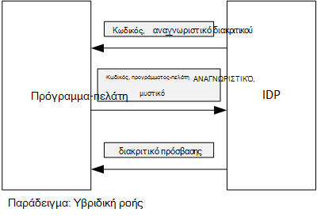

<properties
   pageTitle="Χρήση διεκδίκηση προγράμματος-πελάτη για να λάβετε διακριτικά πρόσβασης από το Azure AD | Microsoft Azure"
   description="Πώς μπορείτε να χρησιμοποιήσετε διεκδίκηση προγράμματος-πελάτη για να λάβετε διακριτικά πρόσβασης από το Azure AD."
   services=""
   documentationCenter="na"
   authors="MikeWasson"
   manager="roshar"
   editor=""
   tags=""/>

<tags
   ms.service="guidance"
   ms.devlang="dotnet"
   ms.topic="article"
   ms.tgt_pltfrm="na"
   ms.workload="na"
   ms.date="05/23/2016"
   ms.author="mwasson"/>

# <a name="using-client-assertion-to-get-access-tokens-from-azure-ad"></a>Χρήση διεκδίκηση προγράμματος-πελάτη για να λάβετε διακριτικά πρόσβασης από το Azure AD

[AZURE.INCLUDE [pnp-header](../../includes/guidance-pnp-header-include.md)]

Σε αυτό το άρθρο αποτελεί [μέρος μιας σειράς]. Υπάρχει επίσης μια ολοκληρωμένη [δείγμα εφαρμογής] που συνοδεύει αυτήν τη σειρά.

## <a name="background"></a>Φόντο

Όταν χρησιμοποιείτε εξουσιοδότησης κώδικα ροής ή ροής υβριδική OpenID σύνδεση, ο υπολογιστής-πελάτης θα αντικαταστήσει έναν κωδικό εξουσιοδότησης για ένα διακριτικό πρόσβασης. Σε αυτό το βήμα, το πρόγραμμα-πελάτη έχει τον έλεγχο ταυτότητας του εαυτού στο διακομιστή.



Ένας τρόπος για τον έλεγχο ταυτότητας του προγράμματος-πελάτη είναι χρησιμοποιώντας έναν μυστικό προγράμματος-πελάτη. Περάσει πώς το [Έρευνες Tailspin] [ Surveys] η εφαρμογή έχει ρυθμιστεί από προεπιλογή.

Ακολουθεί ένα παράδειγμα αίτηση από το πρόγραμμα-πελάτη για το IDP, ζητά ένα διακριτικό πρόσβασης. Σημείωση το `client_secret` παραμέτρου.

```
POST https://login.microsoftonline.com/b9bd2162xxx/oauth2/token HTTP/1.1
Content-Type: application/x-www-form-urlencoded

resource=https://tailspin.onmicrosoft.com/surveys.webapi
  &client_id=87df91dc-63de-4765-8701-b59cc8bd9e11
  &client_secret=i3Bf12Dn...
  &grant_type=authorization_code
  &code=PG8wJG6Y...
```

Το μυστικό είναι απλώς μια συμβολοσειρά, επομένως πρέπει να βεβαιωθείτε ότι δεν θα προκαλέσει την απώλεια της τιμής. Η βέλτιστη πρακτική είναι να διατηρήσετε το μυστικό προγράμματος-πελάτη από το στοιχείο ελέγχου προέλευσης. Όταν αναπτύσσετε σε Azure, αποθηκεύστε το μυστικό σε μια [Ρύθμιση app][configure-web-app].

Ωστόσο, όλοι όσοι έχουν πρόσβαση στη συνδρομή Azure να προβάλετε τις ρυθμίσεις εφαρμογής. Επιπλέον, υπάρχει πάντα μια πιθανότητες ελέγχου απόρρητο στο στοιχείο ελέγχου προέλευσης (π.χ., σε δέσμες ενεργειών ανάπτυξης), κάντε κοινή χρήση τους μέσω ηλεκτρονικού ταχυδρομείου και ούτω καθεξής.

Για πρόσθετη ασφάλεια, μπορείτε να χρησιμοποιήσετε [διεκδίκηση προγράμματος-πελάτη] αντί για ένα μυστικό προγράμματος-πελάτη. Με το πρόγραμμα-πελάτη διεκδίκηση, ο υπολογιστής-πελάτης χρησιμοποιεί ένα πιστοποιητικό X.509 για να αποδείξετε την αίτηση διακριτικού προέρχεται από το πρόγραμμα-πελάτη. Είναι εγκατεστημένο το πιστοποιητικό προγράμματος-πελάτη στο διακομιστή web. Γενικά, θα είναι ευκολότερο να περιορίσετε την πρόσβαση στο πιστοποιητικό, από για να βεβαιωθείτε ότι κανένας δεν κατά λάθος αποκαλύπτει ένα μυστικό προγράμματος-πελάτη. Για περισσότερες πληροφορίες σχετικά με τη ρύθμιση των παραμέτρων πιστοποιητικά σε μια εφαρμογή web, ανατρέξτε στο θέμα [Χρήση πιστοποιητικά σε εφαρμογές Azure τοποθεσίες Web][using-certs-in-websites]

Ακολουθεί μια αίτηση διακριτικού χρησιμοποιώντας διεκδίκηση προγράμματος-πελάτη:

```
POST https://login.microsoftonline.com/b9bd2162xxx/oauth2/token HTTP/1.1
Content-Type: application/x-www-form-urlencoded

resource=https://tailspin.onmicrosoft.com/surveys.webapi
  &client_id=87df91dc-63de-4765-8701-b59cc8bd9e11
  &client_assertion_type=urn:ietf:params:oauth:client-assertion-type:jwt-bearer
  &client_assertion=eyJhbGci...
  &grant_type=authorization_code
  &code= PG8wJG6Y...
```

Σημειώστε ότι η `client_secret` παράμετρος δεν χρησιμοποιείται πλέον. Αντί για αυτό, η `client_assertion` παράμετρος περιέχει ένα διακριτικό JWT που υπογράφτηκε χρησιμοποιώντας το πιστοποιητικό προγράμματος-πελάτη. Το `client_assertion_type` παράμετρος καθορίζει τον τύπο της διεκδίκηση &mdash; σε αυτή την περίπτωση, διακριτικό JWT. Ο διακομιστής επικυρώσει το διακριτικό JWT. Εάν το διακριτικό JWT δεν είναι έγκυρο, η αίτηση διακριτικού επιστρέφει ένα σφάλμα.

> [AZURE.NOTE] Πιστοποιητικά X.509 δεν είναι μόνο μορφή διεκδίκηση προγράμματος-πελάτη; Εδώ θα σας εστίαση σε αυτό επειδή υποστηρίζεται από το Azure AD.

## <a name="using-client-assertion-in-the-surveys-application"></a>Χρήση του προγράμματος-πελάτη διεκδίκηση στην εφαρμογή έρευνες

Αυτή η ενότητα δείχνει πώς μπορείτε να ρυθμίσετε τις παραμέτρους της εφαρμογής Tailspin έρευνες για να χρησιμοποιήσετε διεκδίκηση προγράμματος-πελάτη. Σε αυτά τα βήματα, θα μπορείτε να δημιουργήσετε ένα αυτο-υπογεγραμμένο πιστοποιητικό που είναι κατάλληλη για την ανάπτυξη, αλλά όχι για χρήση παραγωγής.

1. Εκτελέστε τη δέσμη ενεργειών PowerShell [/Scripts/Setup-KeyVault.ps1] [ Setup-KeyVault] ως εξής:

    ```
    .\Setup-KeyVault.ps -Subject [subject]
    ```

    Για το `Subject` παράμετρο, πληκτρολογήστε οποιοδήποτε όνομα, όπως "surveysapp". Η δέσμη ενεργειών δημιουργεί ένα αυτο-υπογεγραμμένο πιστοποιητικό και αποθηκεύει στο χώρο αποθήκευσης πιστοποιητικών "τρέχουσα χρήστη/προσωπικό".

2. Το αποτέλεσμα από τη δέσμη ενεργειών είναι ένα απόσπασμα JSON. Προσθέστε αυτήν τη δήλωση εφαρμογής της εφαρμογής web, ως εξής:

    1. Συνδεθείτε στην [πύλη διαχείρισης Azure] [ azure-management-portal] και μεταβείτε στις επιλογές καταλόγου Azure AD σας.

    2. Κάντε κλικ στην επιλογή **εφαρμογές**.

    3. Επιλέξτε την εφαρμογή έρευνες.

    4.  Κάντε κλικ στην επιλογή **Διαχείριση δήλωσης** και επιλέξτε **Λήψη δήλωσης**.

    5.  Ανοίξτε το αρχείο δήλωσης JSON σε ένα πρόγραμμα επεξεργασίας κειμένου. Επικολλήστε την έξοδο από τη δέσμη ενεργειών σε το `keyCredentials` την ιδιότητα. Θα πρέπει να μοιάζει με το εξής:

        ```    
        "keyCredentials": [
            {
              "type": "AsymmetricX509Cert",
              "usage": "Verify",
              "keyId": "29d4f7db-0539-455e-b708-....",
              "customKeyIdentifier": "ZEPpP/+KJe2fVDBNaPNOTDoJMac=",
              "value": "MIIDAjCCAeqgAwIBAgIQFxeRiU59eL.....
            }
          ],
         ```

    6.  Αποθηκεύστε τις αλλαγές στο αρχείο JSON.

    7.  Επιστρέψτε στην πύλη του. Κάντε κλικ στην επιλογή **Διαχείριση δήλωσης** > **Αποστολή δήλωσης** και αποστολή του αρχείου JSON.

3. Εκτελέστε την παρακάτω εντολή για να λάβετε την αποτύπωση του πιστοποιητικού.

    ```
    certutil -store -user my [subject]
    ```

    όπου `[subject]` είναι η τιμή που έχετε καθορίσει για θέμα στη δέσμη ενεργειών PowerShell. Την αποτύπωση παρατίθεται στην περιοχή "Πιστοποιητικού Hash(sha1)". Καταργήστε τα διαστήματα μεταξύ των αριθμών δεκαεξαδικό αριθμό.

4. Ενημερώστε την εφαρμογή απορρήτου. Στην Εξερεύνηση λύσεων, κάντε δεξί κλικ στο έργο Tailspin.Surveys.Web και επιλέξτε **Διαχείριση απορρήτου χρήστη**. Προσθέστε μια καταχώρηση για το "Asymmetric" στην περιοχή "AzureAd", όπως φαίνεται παρακάτω:

    ```
    {
      "AzureAd": {
        "ClientId": "[Surveys application client ID]",
        // "ClientSecret": "[client secret]",  << Delete this entry
        "PostLogoutRedirectUri": "https://localhost:44300/",
        "WebApiResourceId": "[App ID URI of your Survey.WebAPI application]",
        // new:
        "Asymmetric": {
          "CertificateThumbprint": "[certificate thumbprint]",  // Example: "105b2ff3bc842c53582661716db1b7cdc6b43ec9"
          "StoreName": "My",
          "StoreLocation": "CurrentUser",
          "ValidationRequired": "false"
        }
      },
      "Redis": {
        "Configuration": "[Redis connection string]"
      }
    }
    ```

    Πρέπει να ορίσετε `ValidationRequired` στην τιμή false, επειδή το πιστοποιητικό δεν ήταν υπογεγραμμένο από μια αρχή έκδοσης Πιστοποιητικών αρχή έκδοσης πιστοποιητικών ρίζας. Παραγωγή, χρησιμοποιήστε ένα πιστοποιητικό που έχει υπογραφεί από μια αρχή έκδοσης Πιστοποιητικών και να ορίσετε `ValidationRequired` στην τιμή true.

    Διαγράψτε επίσης την καταχώρηση για το `ClientSecret`, επειδή δεν είναι απαραίτητος με Διεκδίκηση προγράμματος-πελάτη.

5. Startup.cs, εντοπίστε τον κώδικα που καταχωρεί τα `ICredentialService`. Καταργήστε τα σχόλια από τη γραμμή που χρησιμοποιεί `CertificateCredentialService`, και σχολιάζετε στη γραμμή που χρησιμοποιεί `ClientCredentialService`:

    ```csharp
    // Uncomment this:
    services.AddSingleton<ICredentialService, CertificateCredentialService>();
    // Comment out this:
    //services.AddSingleton<ICredentialService, ClientCredentialService>();
    ```

Κατά το χρόνο εκτέλεσης, η εφαρμογή web διαβάζει το πιστοποιητικό από το χώρο αποθήκευσης πιστοποιητικού. Το πιστοποιητικό πρέπει να έχει εγκατασταθεί στον ίδιο υπολογιστή με την εφαρμογή web.

## <a name="next-steps"></a>Επόμενα βήματα

- Διαβάστε το επόμενο άρθρο σε αυτήν τη σειρά: [Χρήση θάλαμο κλειδί Azure για την προστασία απορρήτου εφαρμογής][key vault]


<!-- Links -->
[configure-web-app]: ../app-service-web/web-sites-configure.md
[azure-management-portal]: https://manage.windowsazure.com
[διεκδίκηση προγράμματος-πελάτη]: https://tools.ietf.org/html/rfc7521
[key vault]: guidance-multitenant-identity-keyvault.md
[Setup-KeyVault]: https://github.com/Azure-Samples/guidance-identity-management-for-multitenant-apps/blob/master/scripts/Setup-KeyVault.ps1
[Surveys]: guidance-multitenant-identity-tailspin.md
[using-certs-in-websites]: https://azure.microsoft.com/blog/using-certificates-in-azure-websites-applications/
[μέρος μιας σειράς]: guidance-multitenant-identity.md
[δείγμα εφαρμογής]: https://github.com/Azure-Samples/guidance-identity-management-for-multitenant-apps
