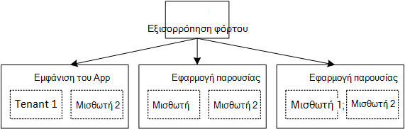

<properties
   pageTitle="Η Διαχείριση ταυτοτήτων για τις εφαρμογές του multitenant | Microsoft Azure"
   description="Εισαγωγή στη Διαχείριση ταυτοτήτων σε multitenant εφαρμογές"
   services=""
   documentationCenter="na"
   authors="MikeWasson"
   manager="roshar"
   editor=""
   tags=""/>

<tags
   ms.service="guidance"
   ms.devlang="dotnet"
   ms.topic="article"
   ms.tgt_pltfrm="na"
   ms.workload="na"
   ms.date="06/02/2016"
   ms.author="mwasson"/>

# Εισαγωγή στη Διαχείριση ταυτοτήτων για multitenant εφαρμογές στο Microsoft Azure

[AZURE.INCLUDE [pnp-header](../../includes/guidance-pnp-header-include.md)]

Σε αυτό το άρθρο αποτελεί [μέρος μιας σειράς]. Υπάρχει επίσης μια ολοκληρωμένη [δείγμα εφαρμογής] που συνοδεύει αυτήν τη σειρά.

Ας υποθέσουμε ότι συντάσσετε μια εταιρική εφαρμογή ΑΔΑ για να φιλοξενείται στο cloud. Φυσικά, η εφαρμογή θα έχουν οι χρήστες:

Ωστόσο, αυτοί οι χρήστες που ανήκουν σε εταιρείες:

Παράδειγμα: Tailspin πωλεί συνδρομές σε εφαρμογή του ΑΔΑ. Το Contoso και Fabrikam εγγραφή για την εφαρμογή. Όταν η Άννα (`alice@contoso`) σύμβολα στο, η εφαρμογή πρέπει να γνωρίζετε ότι η Άννα αποτελεί μέρος του Contoso.

- Η Άννα _θα πρέπει να_ έχετε πρόσβαση σε δεδομένα Contoso.
- Η Άννα _δεν θα πρέπει να_ έχετε πρόσβαση σε δεδομένα Fabrikam.

Αυτές οι οδηγίες θα σας δείξουν πώς μπορείτε να διαχειριστείτε τις ταυτότητες χρήστη σε μια εφαρμογή του multitenant, με χρήση [Azure Active Directory] [ AzureAD] (Azure AD) για το χειρισμό εισόδου και τον έλεγχο ταυτότητας.

## Τι είναι το multitenancy;

Ένα _μισθωτή_ είναι μια ομάδα χρηστών. Σε μια εφαρμογή ΑΔΑ, ο μισθωτής είναι συνδρομητή ή πελατών της εφαρμογής. _Multitenancy_ είναι μια αρχιτεκτονική όπου πολλούς μισθωτές μοιράζονται την ίδια φυσική παρουσία της εφαρμογής. Παρόλο που μισθωτές κοινή χρήση φυσικών πόρων (όπως ΣΠΣ ή χώρο αποθήκευσης), κάθε μισθωτή λαμβάνει το δικό της λογικής παρουσία της εφαρμογής.

Συνήθως, είναι κοινής χρήσης εφαρμογής δεδομένων μεταξύ των χρηστών μέσα σε ένα μισθωτή, αλλά όχι με άλλες μισθωτές.

Συγκρίνετε αυτήν την αρχιτεκτονική με μια αρχιτεκτονική μίας μισθωτή, όπου κάθε μισθωτή έχει μια αποκλειστική φυσική παρουσία. Σε μια αρχιτεκτονική μίας μισθωτή, μπορείτε να προσθέσετε μισθωτές με περιστροφή προς τα επάνω νέες παρουσίες της εφαρμογής.

### Multitenancy και οριζόντια κλιμάκωση

Για να επιτύχετε κλίμακα στο cloud, είναι κοινά και για να προσθέσετε περισσότερες φυσικής παρουσίες. Αυτό είναι γνωστό ως _οριζόντια κλίμακα_ ή _κλίμακα εκτός_. Εξετάστε το ενδεχόμενο μια εφαρμογή web. Να χειριστούν περισσότερη κυκλοφορία, μπορείτε να προσθέσετε περισσότερες διακομιστή ΣΠΣ και να τα τοποθετήσετε πίσω από μια μονάδα εξισορρόπησης φόρτου. Κάθε Εικονική εκτελείται μια ξεχωριστή φυσική παρουσία της εφαρμογής web.

Οποιαδήποτε αίτηση είναι δυνατό να δρομολογηθούν σε οποιαδήποτε παρουσία. Μαζί, το σύστημα λειτουργεί ως μια μεμονωμένη λογική παρουσία. Μπορείτε να καταργήσεις μια Εικονική ή αυξομείωσης του μια νέα Εικονική, χωρίς να επηρεάζονται οι χρήστες. Σε αυτήν την αρχιτεκτονική, κάθε φυσική παρουσία είναι πολλών μισθωτή και κλίμακα, προσθέτοντας και σε άλλα σημεία. Εάν μία παρουσία οδηγεί προς τα κάτω, θα πρέπει να δεν επηρεάζονται τυχόν μισθωτή.

## Ταυτότητα σε μια εφαρμογή για multitenant

Σε μια εφαρμογή για multitenant, πρέπει να εξετάσετε χρήστες στο περιβάλλον της μισθωτές.

**Έλεγχος ταυτότητας**

- Οι χρήστες συνδέονται στην εφαρμογή με τα διαπιστευτήρια της εταιρείας. Δεν χρειάζεται να δημιουργήσετε νέα προφίλ χρηστών για την εφαρμογή.
- Οι χρήστες μέσα στον ίδιο οργανισμό είναι μέρος του ίδιο μισθωτή.
- Όταν ένας χρήστης πραγματοποιεί είσοδο, την εφαρμογή γνωρίζει ποιο μισθωτή ανήκει ο χρήστης.

**Εξουσιοδότηση**

- Όταν εκχωρείτε ενεργειών του χρήστη (Καλώς, προβολή πόρου), η εφαρμογή πρέπει να λαμβάνει υπόψη μισθωτή του χρήστη.
- Οι χρήστες ενδέχεται να αντιστοιχιστούν ρόλους μέσα από την εφαρμογή, όπως "Διαχειριστής" ή "Τυπική χρήστης". Εκχωρήσεις ρόλων θα πρέπει να γίνεται από τον πελάτη, όχι από την υπηρεσία παροχής ΑΔΑ.

**Παράδειγμα.** Η Άννα, ενός υπαλλήλου στο Contoso, μεταβαίνει στην εφαρμογή στο του προγράμματος περιήγησης και κάνει κλικ στο κουμπί "Σύνδεση στο". Θα ανακατευθύνεται σε μια οθόνη login όπου καταχωρεί το εταιρικό διαπιστευτηρίων (όνομα χρήστη και κωδικός πρόσβασης). Σε αυτό το σημείο, που έχουν συνδεθεί με την εφαρμογή ως `alice@contoso.com`. Η εφαρμογή γνωρίζει επίσης ότι η Άννα είναι ο χρήστης διαχειριστή για αυτήν την εφαρμογή. Επειδή είναι ένας διαχειριστής, που μπορεί να δείτε μια λίστα με όλους τους πόρους που ανήκουν σε Contoso. Ωστόσο, κάνει να προβάλετε πόρων της Fabrikam, επειδή είναι διαχειριστής μόνο εντός του μισθωτή.

Σε αυτές τις οδηγίες, θα εξετάσουμε συγκεκριμένα με χρήση του Azure AD για Διαχείριση ταυτοτήτων.

- Υποθέσουμε ότι ο πελάτης αποθηκεύει τα προφίλ χρηστών στο Azure AD (συμπεριλαμβανομένων των μισθωτές του Office 365 και το Dynamics CRM)
- Πελάτες με εσωτερική Active Directory (AD) μπορούν να χρησιμοποιήσουν [Azure AD Connect] [ ADConnect] για να συγχρονίσετε τους AD εσωτερική με Azure AD.

Εάν ένας πελάτης με εσωτερική AD δεν μπορεί να χρησιμοποιήσει Azure AD Connect (λόγω εταιρική πολιτική IT ή άλλους λόγους), η υπηρεσία παροχής να δημιουργήσετε Ομοσπονδία με τον πελάτη ΑΔΑ του AD στις υπηρεσίες Active Directory Federation Services (AD FS). Αυτή η επιλογή περιγράφεται στα [Federating με έναν πελάτη AD FS].

Αυτές οι οδηγίες δεν λαμβάνει υπόψη άλλες πτυχές της multitenancy όπως διαμερισμάτων δεδομένων, ανά μισθωτή ρύθμισης παραμέτρων και ούτω καθεξής.

## Επόμενα βήματα

- Διαβάστε το επόμενο άρθρο σε αυτήν τη σειρά: [εφαρμογή σχετικά με το Tailspin έρευνες][tailpin]

<!-- Links -->
[ADConnect]: ../active-directory/active-directory-aadconnect.md
[AzureAD]: https://azure.microsoft.com/documentation/services/active-directory/
[μέρος μιας σειράς]: guidance-multitenant-identity.md
[Ενοποίηση με έναν πελάτη AD FS]: guidance-multitenant-identity-adfs.md
[δείγμα εφαρμογής]: https://github.com/Azure-Samples/guidance-identity-management-for-multitenant-apps
[tailpin]: guidance-multitenant-identity-tailspin.md
