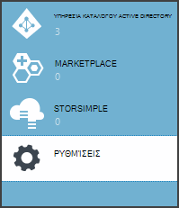

<properties
   pageTitle="Χρήση αριθμού-κλειδιού θάλαμο για την προστασία απορρήτου εφαρμογή | Microsoft Azure"
   description="Τρόπος μια χρήση της υπηρεσίας θάλαμο αριθμού-κλειδιού για την αποθήκευση απόρρητο εφαρμογής"
   services=""
   documentationCenter="na"
   authors="MikeWasson"
   manager="roshar"
   editor=""
   tags=""/>

<tags
   ms.service="guidance"
   ms.devlang="dotnet"
   ms.topic="article"
   ms.tgt_pltfrm="na"
   ms.workload="na"
   ms.date="02/16/2016"
   ms.author="mwasson"/>

# <a name="using-azure-key-vault-to-protect-application-secrets"></a>Χρήση Azure θάλαμο αριθμού-κλειδιού για την προστασία απορρήτου εφαρμογής

[AZURE.INCLUDE [pnp-header](../../includes/guidance-pnp-header-include.md)]

Σε αυτό το άρθρο αποτελεί [μέρος μιας σειράς]. Υπάρχει επίσης μια ολοκληρωμένη [δείγμα εφαρμογής] που συνοδεύει αυτήν τη σειρά.

## <a name="overview"></a>Επισκόπηση

Είναι κοινά για να έχετε τις ρυθμίσεις εφαρμογής που διάκριση πεζών-κεφαλαίων και πρέπει να είναι προστατευμένο, όπως:

- Συμβολοσειρές σύνδεσης βάσης δεδομένων
- Κωδικοί πρόσβασης
- Κλειδιά κρυπτογράφησης

Ως βέλτιστη πρακτική ασφαλείας, θα πρέπει να αποθηκεύσετε ποτέ αυτές τις απόρρητο στο στοιχείο ελέγχου προέλευσης. Είναι πολύ εύκολο να προκαλέσει απώλεια &mdash; ακόμα και αν το αρχείο φύλαξης κώδικα προέλευσης είναι ιδιωτική. Και αυτό δεν σχεδόν διατηρώντας απόρρητο από τη γενική δημόσια. Σε μεγαλύτερα έργα, μπορεί να θέλετε να περιορίσετε ποια τους προγραμματιστές και τελεστές μπορούν να έχουν πρόσβαση του απορρήτου παραγωγής. (Ρυθμίσεις για περιβάλλοντα δοκιμής ή ανάπτυξη είναι διαφορετικές.)

Μια πιο ασφαλής επιλογή είναι να αποθηκεύσετε αυτές τις απόρρητο στο [Θάλαμο κλειδί Azure][KeyVault]. Πλήκτρο θάλαμο είναι μια υπηρεσία που φιλοξενείται στο cloud για τη διαχείριση των κλειδιών κρυπτογράφησης και άλλες απορρήτου. Σε αυτό το άρθρο δείχνει πώς μπορείτε να χρησιμοποιήσετε αριθμό-κλειδί θάλαμο για να αποθηκεύσετε ρυθμίσεις παραμέτρων για την εφαρμογή που.

Στις [Έρευνες Tailspin] [ Surveys] εφαρμογή, οι ακόλουθες ρυθμίσεις είναι μυστικού:

- Η συμβολοσειρά σύνδεσης βάσης δεδομένων.
- Η συμβολοσειρά σύνδεσης Redis.
- Το μυστικό προγράμματος-πελάτη για την εφαρμογή web.

Για να αποθηκεύσετε απόρρητο ρύθμισης παραμέτρων σε θάλαμο αριθμού-κλειδιού, η εφαρμογή έρευνες εφαρμόζει μια υπηρεσία παροχής προσαρμοσμένη ρύθμιση παραμέτρων, το οποίο άγκιστρα στο ASP.NET πυρήνα 1.0 [ρύθμισης παραμέτρων συστήματος][configuration]. Η προσαρμοσμένη υπηρεσία παροχής διαβάζει ρυθμίσεις παραμέτρων από θάλαμο αριθμού-κλειδιού κατά την εκκίνηση.

Η εφαρμογή έρευνες φορτώνει ρυθμίσεις παραμέτρων από τις παρακάτω θέσεις:

- Το αρχείο appsettings.json
- Η [Αποθήκευση απόρρητο χρήστη] [ user-secrets] (περιβάλλον ανάπτυξης μόνο, για σκοπούς δοκιμής)
- Το περιβάλλον φιλοξενίας (ρυθμίσεων της εφαρμογής στις εφαρμογές Azure web)
- Πλήκτρο θάλαμο

Κάθε μία από αυτές τις αντικαθιστά την προηγούμενη διαφάνεια, ώστε να τις ρυθμίσεις αποθηκευμένες στο πλήκτρο θάλαμο έχουν προτεραιότητα.

> [AZURE.NOTE] Από προεπιλογή, η υπηρεσία παροχής ρύθμισης παραμέτρων θάλαμο αριθμού-κλειδιού είναι απενεργοποιημένη. Δεν είναι απαραίτητη για την εκτέλεση της εφαρμογής τοπικά. Μπορείτε να την ενεργοποιήσετε σε μια ανάπτυξη παραγωγής.

> Η υπηρεσία παροχής του αριθμού-κλειδιού θάλαμο αυτήν τη στιγμή δεν υποστηρίζεται για .NET πυρήνα, επειδή απαιτεί το [Microsoft.Azure.KeyVault] [ Microsoft.Azure.KeyVault] πακέτου.

Κατά την εκκίνηση, η εφαρμογή διαβάζει ρυθμίσεις από κάθε υπηρεσία παροχής καταχωρημένες ρύθμισης παραμέτρων και χρησιμοποιεί για να συμπληρώσετε ένα αντικείμενο ισχυρό τύπο επιλογές. (Για περισσότερες πληροφορίες, ανατρέξτε στο θέμα [χρήση των επιλογών και αντικείμενα ρύθμισης παραμέτρων][options].)

## <a name="implementation"></a>Εφαρμογή

Το [KeyVaultConfigurationProvider] [ KeyVaultConfigurationProvider] κλάση είναι μια υπηρεσία παροχής ρύθμισης παραμέτρων που συνδέεται στη του ASP.NET 1.0 πυρήνα [ρύθμισης παραμέτρων συστήματος][configuration].

Για να χρησιμοποιήσετε το `KeyVaultConfigurationProvider`, καλέστε το `AddKeyVaultSecrets` μέθοδο επέκτασης στην τάξη εκκίνησης:

```csharp
    var builder = new ConfigurationBuilder()
        .SetBasePath(appEnv.ApplicationBasePath)
        .AddJsonFile("appsettings.json");

    if (env.IsDevelopment())
    {
        builder.AddUserSecrets();
    }
    builder.AddEnvironmentVariables();
    var config = builder.Build();

    // Add key vault configuration:
    builder.AddKeyVaultSecrets(config["AzureAd:ClientId"],
        config["KeyVault:Name"],
        config["AzureAd:Asymmetric:CertificateThumbprint"],
        Convert.ToBoolean(config["AzureAd:Asymmetric:ValidationRequired"]),
        loggerFactory);
```

Σημειώστε ότι `KeyVaultConfigurationProvider` απαιτεί ορισμένες ρυθμίσεις παραμέτρων, οι οποίες πρέπει να είναι αποθηκευμένο σε μία από τις άλλες πηγές ρύθμισης παραμέτρων.

Κατά την εκκίνηση της εφαρμογής, `KeyVaultConfigurationProvider` απαριθμεί όλα τα απόρρητο στο του κλειδιού θάλαμο. Για κάθε μυστικό, πραγματοποιεί αναζήτηση για μια ετικέτα με το όνομα 'ConfigKey'. Η τιμή της ετικέτας είναι το όνομα της ρύθμισης παραμέτρων.

> [AZURE.NOTE] [Ετικέτες] [ key-tags] είναι προαιρετικό μετα-δεδομένα που είναι αποθηκευμένα με αριθμό-κλειδί. Ετικέτες που χρησιμοποιούνται εδώ, επειδή τα ονόματα κλειδιών δεν είναι δυνατό να περιέχουν χαρακτήρες άνω και κάτω τελεία (:).

```csharp
var kvClient = new KeyVaultClient(GetTokenAsync);
var secretsResponseList = await kvClient.GetSecretsAsync(_vault, MaxSecrets, token);
foreach (var secretItem in secretsResponseList.Value)
{
    //The actual config key is stored in a tag with the Key "ConfigKey"
    // because ':' is not supported in a shared secret name by Key Vault.
    if (secretItem.Tags != null && secretItem.Tags.ContainsKey(ConfigKey))
    {
        var secret = await kvClient.GetSecretAsync(secretItem.Id, token);
        Data.Add(secret.Tags[ConfigKey], secret.Value);
    }
}
```

> [AZURE.NOTE] Ανατρέξτε στο θέμα [KeyVaultConfigurationProvider.cs].

## <a name="setting-up-key-vault-in-the-surveys-app"></a>Ρύθμιση του αριθμού-κλειδιού θάλαμο στην εφαρμογή έρευνες

Προαπαιτούμενα στοιχεία:

- Εγκατάσταση τα [Cmdlet του Azure διαχείριση πόρων][azure-rm-cmdlets].
- Ρύθμιση παραμέτρων της εφαρμογής έρευνες, όπως περιγράφεται στο [λειτουργεί η εφαρμογή έρευνες][readme].

Βήματα υψηλού επιπέδου:

1. Ρύθμιση του χρήστης διαχειριστή του μισθωτή.
2. Ρυθμίστε ένα πιστοποιητικό προγράμματος-πελάτη.
3. Δημιουργία ενός κλειδιού θάλαμο.
4. Προσθέστε ρυθμίσεις παραμέτρων σας κλειδιού θάλαμο.
5. Καταργήστε τα σχόλια από τον κώδικα που σας δίνει τη δυνατότητα κλειδιού θάλαμο.
6. Ενημέρωση της εφαρμογής απόρρητο χρήστη.

### <a name="set-up-an-admin-user"></a>Ρύθμιση του ένας χρήστης του διαχειριστή

> [AZURE.NOTE] Για να δημιουργήσετε ένα πλήκτρο θάλαμο, πρέπει να χρησιμοποιήσετε ένα λογαριασμό που μπορούν να διαχειριστούν τη συνδρομή σας στο Azure. Επίσης, πρέπει να έχουν καταχωρηθεί οποιαδήποτε εφαρμογή που εγκρίνετε την ανάγνωση του κλειδιού θάλαμο στον ίδιο μισθωτή ως αυτόν το λογαριασμό.

Σε αυτό το βήμα, που θα βεβαιωθείτε ότι μπορείτε να δημιουργήσετε ένα πλήκτρο θάλαμο ενώ συνδεδεμένος ως ένα χρήστη από το μισθωτή όπου είναι καταχωρημένη η εφαρμογή έρευνες.

Πρώτα, αλλάξτε τον κατάλογο που σχετίζεται με τη συνδρομή σας στο Azure.

1. Συνδεθείτε με την [πύλη διαχείρισης Azure][azure-management-portal]

2. Κάντε κλικ στην επιλογή **Ρυθμίσεις**.

    

3. Επιλέξτε τη συνδρομή σας στο Azure.

4. Κάντε κλικ στην επιλογή **Επεξεργασία καταλόγου** στο κάτω μέρος της πύλης.

    

5. Στο "Αλλαγή ο κατάλογος σχετικό", επιλέξτε το μισθωτή Azure AD όπου είναι καταχωρημένη η εφαρμογή έρευνες,

    

6. Κάντε κλικ στο κουμπί βέλους και να ολοκληρώσετε το παράθυρο διαλόγου.

Δημιουργήστε έναν χρήστη διαχείρισης μέσα στο μισθωτή Azure AD όπου είναι καταχωρημένη η εφαρμογή έρευνες.

1. Συνδεθείτε στην [πύλη διαχείρισης Azure][azure-management-portal].

2. Επιλέξτε το μισθωτή Azure AD όπου είναι καταχωρημένη η εφαρμογή σας.

3. Κάντε κλικ στην επιλογή **χρήστες** > **Προσθήκη χρήστη**.

4. Στο παράθυρο διαλόγου **Προσθήκη χρηστών** , εκχώρηση στο χρήστη για το ρόλο καθολικού διαχειριστή.

Προσθέστε το χρήστη admin ως διαχειριστής από κοινού για τη συνδρομή σας Azure.

1. Συνδεθείτε στην [πύλη διαχείρισης Azure][azure-management-portal].

2. Κάντε κλικ στην επιλογή **Ρυθμίσεις** και επιλέξτε τη συνδρομή σας στο Azure.

3. Κάντε κλικ στην επιλογή **διαχειριστές**

4. Κάντε κλικ στην επιλογή **Προσθήκη** στο κάτω μέρος της πύλης.

5. Πληκτρολογήστε το μήνυμα ηλεκτρονικού ταχυδρομείου του χρήστη διαχείρισης που δημιουργήσατε προηγουμένως.

6. Επιλέξτε το πλαίσιο ελέγχου για τη συνδρομή.

7. Κάντε κλικ στο κουμπί σημάδι ελέγχου για να ολοκληρώσετε το παράθυρο διαλόγου.


### <a name="set-up-a-client-certificate"></a>Ρύθμιση του πιστοποιητικού προγράμματος-πελάτη

1. Εκτελέστε τη δέσμη ενεργειών PowerShell [/Scripts/Setup-KeyVault.ps1] [ Setup-KeyVault] ως εξής:
    ```
    .\Setup-KeyVault.ps1 -Subject <<subject>>
    ```
    Για το `Subject` παράμετρο, πληκτρολογήστε οποιοδήποτε όνομα, όπως "surveysapp". Η δέσμη ενεργειών δημιουργεί ένα αυτο-υπογεγραμμένο πιστοποιητικό και αποθηκεύει στο χώρο αποθήκευσης πιστοποιητικών "τρέχουσα χρήστη/προσωπικό".

2. Το αποτέλεσμα από τη δέσμη ενεργειών είναι ένα απόσπασμα JSON. Προσθέστε αυτήν τη δήλωση εφαρμογής της εφαρμογής web, ως εξής:

    1. Συνδεθείτε στην [πύλη διαχείρισης Azure] [ azure-management-portal] και μεταβείτε στις επιλογές καταλόγου Azure AD σας.

    2. Κάντε κλικ στην επιλογή **εφαρμογές**.

    3. Επιλέξτε την εφαρμογή έρευνες.

    4.  Κάντε κλικ στην επιλογή **Διαχείριση δήλωσης** και επιλέξτε **Λήψη δήλωσης**.

    5.  Ανοίξτε το αρχείο δήλωσης JSON σε ένα πρόγραμμα επεξεργασίας κειμένου. Επικολλήστε την έξοδο από τη δέσμη ενεργειών σε το `keyCredentials` την ιδιότητα. Θα πρέπει να μοιάζει με το εξής:
    ```
            "keyCredentials": [
                {
                  "type": "AsymmetricX509Cert",
                  "usage": "Verify",
                  "keyId": "29d4f7db-0539-455e-b708-....",
                  "customKeyIdentifier": "ZEPpP/+KJe2fVDBNaPNOTDoJMac=",
                  "value": "MIIDAjCCAeqgAwIBAgIQFxeRiU59eL.....
                }
              ],
    ```          
    6.  Αποθηκεύστε τις αλλαγές στο αρχείο JSON.

    7.  Επιστρέψτε στην πύλη του. Κάντε κλικ στην επιλογή **Διαχείριση δήλωσης** > **Αποστολή δήλωσης** και αποστολή του αρχείου JSON.

3. Προσθήκη του ίδιου τμήματος JSON για τη δήλωση εφαρμογής από το web API (Surveys.WebAPI).

4. Εκτελέστε την παρακάτω εντολή για να λάβετε την αποτύπωση του πιστοποιητικού.
    ```
    certutil -store -user my [subject]
    ```
    όπου `[subject]` είναι η τιμή που έχετε καθορίσει για θέμα στη δέσμη ενεργειών PowerShell. Την αποτύπωση παρατίθεται στην περιοχή "Πιστοποιητικού Hash(sha1)". Καταργήστε τα διαστήματα μεταξύ των αριθμών δεκαεξαδικό αριθμό.

Μπορείτε να χρησιμοποιήσετε την αποτύπωση αργότερα.

### <a name="create-a-key-vault"></a>Δημιουργία ενός κλειδιού θάλαμο

1. Εκτελέστε τη δέσμη ενεργειών PowerShell [/Scripts/Setup-KeyVault.ps1] [ Setup-KeyVault] ως εξής:

    ```
    .\Setup-KeyVault.ps1 -KeyVaultName <<key vault name>> -ResourceGroupName <<resource group name>> -Location <<location>>
    ```

    Όταν σας ζητηθεί για τα διαπιστευτήρια, πραγματοποιήστε είσοδο ως το Azure AD χρήστη που δημιουργήσατε προηγουμένως. Η δέσμη ενεργειών δημιουργεί μια νέα ομάδα πόρων και ένα νέο κλειδί θάλαμο μέσα σε αυτήν την ομάδα πόρων.

    Σημείωση: για την παράμετρο-θέση, μπορείτε να χρησιμοποιήσετε την παρακάτω εντολή PowerShell για να λάβετε μια λίστα με έγκυρες περιοχές:

    ```
    Get-AzureRmResourceProvider -ProviderNamespace "microsoft.keyvault" | Where-Object { $_.ResourceTypes.ResourceTypeName -eq "vaults" } | Select-Object -ExpandProperty Locations
    ```

2. Εκτελέστε SetupKeyVault.ps ξανά, με τις ακόλουθες παραμέτρους:

    ```
    .\Setup-KeyVault.ps1 -KeyVaultName <<key vault name>> -ApplicationIds @("<<web app client ID>>", "<<web API client ID>>")
    ```

    όπου

    - όνομα κλειδιού θάλαμο = το όνομα που σας έδωσε το θάλαμο κλειδιών στο προηγούμενο βήμα.
    - Αναγνωριστικό υπολογιστή-πελάτη εφαρμογής Web = το Αναγνωριστικό υπολογιστή-πελάτη για την εφαρμογή web έρευνες.
    - Αναγνωριστικό υπολογιστή-πελάτη api Web = το Αναγνωριστικό υπολογιστή-πελάτη για την εφαρμογή Surveys.WebAPI.

    Παράδειγμα:
    ```
    .\Setup-KeyVault.ps1 -KeyVaultName tailspinkv -ApplicationIds @("f84df9d1-91cc-4603-b662-302db51f1031", "8871a4c2-2a23-4650-8b46-0625ff3928a6")
    ```

    > [AZURE.NOTE] Μπορείτε να λάβετε το πρόγραμμα-πελάτη αναγνωριστικά από την [πύλη διαχείρισης Azure][azure-management-portal]. Επιλέξτε το Azure AD μισθωτή, επιλέξτε την εφαρμογή και κάντε κλικ στην επιλογή **Ρύθμιση παραμέτρων**.

    Αυτή η δέσμη ενεργειών επιτρέπει την εφαρμογή web και το API web για την ανάκτηση απορρήτου από τις βασικές θάλαμο. Ανατρέξτε στο θέμα [Γρήγορα αποτελέσματα με το Azure κλειδί θάλαμο] [ authorize-app] για περισσότερες πληροφορίες.

### <a name="add-configuration-settings-to-your-key-vault"></a>Προσθήκη του κλειδιού θάλαμο ρυθμίσεις παραμέτρων

1. Εκτέλεση SetupKeyVault.ps ως εξής:

    ```
    .\Setup-KeyVault.ps1 -KeyVaultName <<key vault name> -KeyName RedisCache -KeyValue "<<Redis DNS name>>.redis.cache.windows.net,password=<<Redis access key>>,ssl=true" -ConfigName "Redis:Configuration"
    ```
    όπου

    - όνομα κλειδιού θάλαμο = το όνομα που δώσατε του κλειδιού θάλαμο στο προηγούμενο βήμα.
    - Redis όνομα DNS = το όνομα DNS σας παρουσίας cache Redis.
    - Πλήκτρο πρόσβασης redis = το πλήκτρο πρόσβασης για την παρουσία σας Redis cache.

    Αυτή η εντολή προσθέτει μια μυστικό σας κλειδιού θάλαμο. Το μυστικό είναι ένα ζεύγος ονόματος/τιμής συν μια ετικέτα:

    -   Το όνομα του κλειδιού δεν χρησιμοποιείται από την εφαρμογή, αλλά πρέπει να είναι μοναδικό εντός του αριθμού-κλειδιού θάλαμο.
    -   Η τιμή είναι η τιμή της επιλογής "Ρύθμιση παραμέτρων", σε αυτήν την περίπτωση τη συμβολοσειρά σύνδεσης Redis.
    -   η ετικέτα "ConfigKey" περιέχει το όνομα του αριθμού-κλειδιού ρύθμισης παραμέτρων.

2. Σε αυτό το σημείο, είναι καλή ιδέα να ελέγξετε αν αποθηκεύσατε με επιτυχία το απόρρητο για κλειδιού θάλαμο. Εκτελέστε την ακόλουθη εντολή PowerShell:

    ```
    Get-AzureKeyVaultSecret <<key vault name>> RedisCache | Select-Object *
    ```
    Το αποτέλεσμα θα πρέπει να εμφανίζουν την τιμή μυστικού καθώς και ορισμένα μετα-δεδομένα:

    

3. Εκτελέστε SetupKeyVault.ps ξανά για να προσθέσετε τη συμβολοσειρά σύνδεσης βάσης δεδομένων:

    ```
    .\Setup-KeyVault.ps1 -KeyVaultName <<key vault name> -KeyName ConnectionString -KeyValue <<DB connection string>> -ConfigName "Data:SurveysConnectionString"
    ```

    όπου `<<DB connection string>>` είναι η τιμή της συμβολοσειράς σύνδεσης βάσης δεδομένων.

    Για τη δοκιμή με την τοπική βάση δεδομένων, αντιγράψτε τη συμβολοσειρά σύνδεσης από το αρχείο Tailspin.Surveys.Web/appsettings.json. Εάν κάνετε αυτό, βεβαιωθείτε ότι για να αλλάξετε τη διπλή ανάστροφη κάθετο ('\\\\') σε μια μεμονωμένη ανάστροφη κάθετο. Η διπλή ανάστροφη κάθετος είναι χαρακτήρα διαφυγής στο αρχείο JSON.

    Παράδειγμα:

    ```
    .\Setup-KeyVault.ps1 -KeyVaultName mykeyvault -KeyName ConnectionString -KeyValue "Server=(localdb)\MSSQLLocalDB;Database=Tailspin.SurveysDB;Trusted_Connection=True;MultipleActiveResultSets=true" -ConfigName "Data:SurveysConnectionString"
    ```

### <a name="uncomment-the-code-that-enables-key-vault"></a>Καταργήστε τα σχόλια από τον κώδικα που σας δίνει τη δυνατότητα θάλαμο αριθμού-κλειδιού

1. Ανοίξτε τη λύση Tailspin.Surveys.

2. Στο [Tailspin.Surveys.Web/Startup.cs][web-startup], εντοπίστε το παρακάτω μπλοκ κώδικα και καταργήστε τα σχόλια από αυτό.

    ```csharp
    //#if DNX451
    //            _configuration = builder.Build();
    //            builder.AddKeyVaultSecrets(_configuration["AzureAd:ClientId"],
    //                _configuration["KeyVault:Name"],
    //                _configuration["AzureAd:Asymmetric:CertificateThumbprint"],
    //                Convert.ToBoolean(_configuration["AzureAd:Asymmetric:ValidationRequired"]),
    //                loggerFactory);
    //#endif
    ```

3. Στο [Tailspin.Surveys.WebAPI/Startup.cs][web-api-startup], εντοπίστε το παρακάτω μπλοκ κώδικα και καταργήστε τα σχόλια από αυτό.

    ```csharp
    //#if DNX451
    //            var config = builder.Build();
    //            builder.AddKeyVaultSecrets(config["AzureAd:ClientId"],
    //                config["KeyVault:Name"],
    //                config["AzureAd:Asymmetric:CertificateThumbprint"],
    //                Convert.ToBoolean(config["AzureAd:Asymmetric:ValidationRequired"]),
    //                loggerFactory);
    //#endif
    ```

4. Στο [Tailspin.Surveys.Web/Startup.cs][web-startup], εντοπίστε τον κώδικα που καταχωρεί τα `ICredentialService`. Καταργήστε τα σχόλια από τη γραμμή που χρησιμοποιεί `CertificateCredentialService`, και σχολιάζετε στη γραμμή που χρησιμοποιεί `ClientCredentialService`:

    ```csharp
    // Uncomment this:
    services.AddSingleton<ICredentialService, CertificateCredentialService>();
    // Comment out this:
    //services.AddSingleton<ICredentialService, ClientCredentialService>();
    ```

    Αυτή η αλλαγή επιτρέπει την εφαρμογή web για να χρησιμοποιήσετε το [πρόγραμμα-πελάτη διεκδίκηση] [ client-assertion] για να λάβετε διακριτικά πρόσβασης OAuth. Με το πρόγραμμα-πελάτη διεκδίκηση, δεν χρειάζεται μια μυστικό OAuth προγράμματος-πελάτη. Εναλλακτικά, ενδέχεται να μπορείτε να αποθηκεύσετε το μυστικό προγράμματος-πελάτη στο πλήκτρο θάλαμο. Ωστόσο, κλειδιού θάλαμο και διεκδίκηση προγράμματος-πελάτη και τα δύο Χρησιμοποιήστε ένα πρόγραμμα-πελάτη του πιστοποιητικού, ώστε να Εάν ενεργοποιήσετε κλειδιού θάλαμο, είναι καλό να ενεργοποιήσετε διεκδίκηση προγράμματος-πελάτη καθώς και.

### <a name="update-the-user-secrets"></a>Ενημερώστε το απόρρητο χρήστη

Στην Εξερεύνηση λύσεων, κάντε δεξί κλικ στο έργο Tailspin.Surveys.Web και επιλέξτε **Διαχείριση απορρήτου χρήστη**. Στο αρχείο secrets.json, διαγράψτε το υπάρχον JSON και επικολλήστε το εξής:

    ```
    {
      "AzureAd": {
        "ClientId": "[Surveys web app client ID]",
        "PostLogoutRedirectUri": "https://localhost:44300/",
        "WebApiResourceId": "[App ID URI of your Surveys.WebAPI application]",
        "Asymmetric": {
          "CertificateThumbprint": "[certificate thumbprint. Example: 105b2ff3bc842c53582661716db1b7cdc6b43ec9]",
          "StoreName": "My",
          "StoreLocation": "CurrentUser",
          "ValidationRequired": "false"
        }
      },
      "KeyVault": {
        "Name": "[key vault name]"
      }
    }
    ```

Αντικαταστήστε τις καταχωρήσεις σε [αγκύλες] με τις σωστές τιμές.

- `AzureAd:ClientId`: Το Αναγνωριστικό πελάτη της εφαρμογής έρευνες.
- `AzureAd:WebApiResourceId`: Το Αναγνωριστικό εφαρμογής URI που καθορίσατε κατά τη δημιουργία της εφαρμογής Surveys.WebAPI στο Azure AD.
- `Asymmetric:CertificateThumbprint`: Την αποτύπωση πιστοποιητικού που λάβατε προηγουμένως, όταν δημιουργήσατε το πιστοποιητικό προγράμματος-πελάτη.
- `KeyVault:Name`: Το όνομα του κλειδιού θάλαμο.

> [AZURE.NOTE] `Asymmetric:ValidationRequired`είναι false επειδή το πιστοποιητικό που δημιουργήσατε προηγουμένως δεν ήταν υπογεγραμμένο από μια αρχή έκδοσης πιστοποιητικών ρίζας (CA). Στο παραγωγής, χρησιμοποιήστε ένα πιστοποιητικό που είναι υπογεγραμμένα από μια αρχή έκδοσης Πιστοποιητικών ρίζας και να ορίσετε `ValidationRequired` στην τιμή true.

Αποθηκεύστε το αρχείο ενημερωμένων secrets.json.

Στη συνέχεια, στην Εξερεύνηση λύσεων, κάντε δεξί κλικ στο έργο Tailspin.Surveys.WebApi και επιλέξτε **Διαχείριση απορρήτου χρήστη**. Διαγράψτε το υπάρχον JSON και επικολλήστε το εξής:

```
{
  "AzureAd": {
    "ClientId": "[Surveys.WebAPI client ID]",
    "WebApiResourceId": "https://tailspin5.onmicrosoft.com/surveys.webapi",
    "Asymmetric": {
      "CertificateThumbprint": "[certificate thumbprint]",
      "StoreName": "My",
      "StoreLocation": "CurrentUser",
      "ValidationRequired": "false"
    }
  },
  "KeyVault": {
    "Name": "[key vault name]"
  }
}
```

Αντικαταστήστε τις καταχωρήσεις σε [αγκύλες] και αποθηκεύστε το αρχείο secrets.json.

> [AZURE.NOTE] Για το API web, βεβαιωθείτε ότι χρησιμοποιείτε το Αναγνωριστικό υπολογιστή-πελάτη για την εφαρμογή Surveys.WebAPI, όχι την εφαρμογή έρευνες.


<!-- Links -->
[authorize-app]: ../key-vault/key-vault-get-started.md/#authorize
[azure-management-portal]: https://manage.windowsazure.com/
[azure-rm-cmdlets]: https://msdn.microsoft.com/library/mt125356.aspx
[client-assertion]: guidance-multitenant-identity-client-assertion.md
[configuration]: https://docs.asp.net/en/latest/fundamentals/configuration.html
[KeyVault]: https://azure.microsoft.com/services/key-vault/
[KeyVaultConfigurationProvider]: https://github.com/Azure-Samples/guidance-identity-management-for-multitenant-apps/blob/master/src/Tailspin.Surveys.Configuration.KeyVault/KeyVaultConfigurationProvider.cs
[key-tags]: https://msdn.microsoft.com/library/azure/dn903623.aspx#BKMK_Keytags
[Microsoft.Azure.KeyVault]: https://www.nuget.org/packages/Microsoft.Azure.KeyVault/
[options]: https://docs.asp.net/en/latest/fundamentals/configuration.html#using-options-and-configuration-objects
[readme]: https://github.com/Azure-Samples/guidance-identity-management-for-multitenant-apps/blob/master/docs/running-the-app.md
[Setup-KeyVault]: https://github.com/Azure-Samples/guidance-identity-management-for-multitenant-apps/blob/master/scripts/Setup-KeyVault.ps1
[Surveys]: guidance-multitenant-identity-tailspin.md
[user-secrets]: http://go.microsoft.com/fwlink/?LinkID=532709
[web-startup]: https://github.com/Azure-Samples/guidance-identity-management-for-multitenant-apps/blob/master/src/Tailspin.Surveys.Web/Startup.cs
[web-api-startup]: https://github.com/Azure-Samples/guidance-identity-management-for-multitenant-apps/blob/master/src/Tailspin.Surveys.WebAPI/Startup.cs
[μέρος μιας σειράς]: guidance-multitenant-identity.md
[KeyVaultConfigurationProvider.cs]: https://github.com/Azure-Samples/guidance-identity-management-for-multitenant-apps/blob/master/src/Tailspin.Surveys.Configuration.KeyVault/KeyVaultConfigurationProvider.cs
[δείγμα εφαρμογής]: https://github.com/Azure-Samples/guidance-identity-management-for-multitenant-apps
