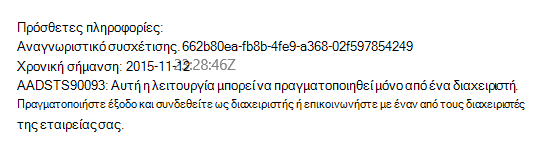

<properties
   pageTitle="Εγγραφής και μισθωτή προσθήκης λογαριασμών σε εφαρμογές multitenant | Microsoft Azure"
   description="Πώς να ενσωματωμένη μισθωτές σε μια εφαρμογή multitenant"
   services=""
   documentationCenter="na"
   authors="MikeWasson"
   manager="roshar"
   editor=""
   tags=""/>

<tags
   ms.service="guidance"
   ms.devlang="dotnet"
   ms.topic="article"
   ms.tgt_pltfrm="na"
   ms.workload="na"
   ms.date="05/23/2016"
   ms.author="mwasson"/>

# <a name="sign-up-and-tenant-onboarding-in-a-multitenant-application"></a>Εγγραφής και μισθωτή προσθήκης λογαριασμών σε μια εφαρμογή multitenant

[AZURE.INCLUDE [pnp-header](../../includes/guidance-pnp-header-include.md)]

Σε αυτό το άρθρο αποτελεί [μέρος μιας σειράς]. Υπάρχει επίσης μια ολοκληρωμένη [δείγμα εφαρμογής] που συνοδεύει αυτήν τη σειρά.

Σε αυτό το άρθρο περιγράφει πώς μπορείτε να υλοποιήσετε ένα _εγγραφής_ διεργασία σε μια εφαρμογή πολλών μισθωτών, το οποίο επιτρέπει έναν πελάτη για να εγγραφείτε οργανισμού τους για την εφαρμογή σας.
Υπάρχουν πολλοί λόγοι για να υλοποιήσετε μια διαδικασία εγγραφής:

-   Να επιτρέπεται διαχειριστής AD για τη συγκατάθεσή σας για την εταιρεία του πελάτη ολόκληρη τη χρήση της εφαρμογής.
-   Συλλογή πληρωμής με πιστωτική κάρτα ή άλλες πληροφορίες πελατών.
-   Εκτελέστε οποιαδήποτε ρύθμιση εφάπαξ ανά μισθωτή είναι απαραίτητο από την εφαρμογή σας.

## <a name="admin-consent-and-azure-ad-permissions"></a>Συγκατάθεση διαχείρισης και δικαιωμάτων Azure AD

Για να τον έλεγχο ταυτότητας με Azure AD, μια εφαρμογή χρειάζεται πρόσβαση στον κατάλογο του χρήστη. Τουλάχιστον, η εφαρμογή χρειάζεται δικαίωμα ανάγνωσης προφίλ χρήστη. Την πρώτη φορά που ένας χρήστης πραγματοποιεί είσοδο, Azure AD εμφανίζει μια σελίδα συγκατάθεσης που παραθέτει τα δικαιώματα που ζητήθηκε. Κάνοντας κλικ στην επιλογή **Αποδοχή**, ο χρήστης εκχωρεί δικαιώματα για την εφαρμογή.

Από προεπιλογή, συγκατάθεση παρέχεται σε βάση ανά χρήστη. Κάθε χρήστης που πραγματοποιεί είσοδο είναι ορατή στη σελίδα συγκατάθεσης. Ωστόσο, Azure AD υποστηρίζει επίσης _τη συγκατάθεσή διαχείρισης_, που επιτρέπει στους διαχειριστές AD τη συγκατάθεσή σας για μια ολόκληρη την εταιρεία.

Κατά τη χρήση της ροής συγκατάθεση διαχείρισης, η σελίδα συγκατάθεσης αναφέρει ότι ο διαχειριστής AD είναι εκχώρηση του δικαιώματος εκ μέρους ολόκληρο το μισθωτή:


Αφού ο διαχειριστής κάνει κλικ στο κουμπί " **Αποδοχή**", άλλοι χρήστες μέσα στο ίδιο μισθωτή να πραγματοποιήσετε είσοδο στο και Azure AD θα μεταβείτε στην οθόνη συγκατάθεσης.

Μόνο ο διαχειριστής AD να δώσετε τη συγκατάθεσή διαχείρισης, επειδή το εκχωρεί δικαιώματα εκ μέρους ολόκληρο τον οργανισμό. Εάν δεν είναι διαχειριστής προσπαθεί για τον έλεγχο ταυτότητας με τη ροή συγκατάθεση διαχείρισης, Azure AD εμφανίζει ένα μήνυμα σφάλματος:



Εάν η εφαρμογή απαιτεί επιπλέον δικαιώματα αργότερα, ο πελάτης θα πρέπει να εγγραφείτε ξανά και τη συγκατάθεσή σας για να τα ενημερωμένα δικαιώματα.  

## <a name="implementing-tenant-sign-up"></a>Εφαρμογή μισθωτή εγγραφής

Για τις [Έρευνες Tailspin] [ Tailspin] εφαρμογής, ορίσαμε διάφορες απαιτήσεις για τη διαδικασία εγγραφής:

-   Πρέπει να εγγραφείτε μισθωτή πριν οι χρήστες μπορούν να συνδέονται.
-   Εγγραφής χρησιμοποιεί τη ροή συγκατάθεση διαχείρισης.
-   Εγγραφής προσθέτει μισθωτή του χρήστη στη βάση δεδομένων της εφαρμογής.
-   Αφού εγγραφεί μισθωτή, η εφαρμογή εμφανίζει μια σελίδα προσθήκης λογαριασμών.

Σε αυτήν την ενότητα, θα σας καθοδηγήσουμε μέσω μας υλοποίηση της διαδικασίας εγγραφής.
Είναι σημαντικό να κατανοήσετε που "Εγγραφή" και "Είσοδος" είναι μια έννοια της εφαρμογής. Κατά τη διάρκεια της ροής του ελέγχου ταυτότητας, Azure AD εγγενώς γνωρίζετε εάν ο χρήστης είναι σε διαδικασία εγγράφεται. Είναι προς τα επάνω στην εφαρμογή για να παρακολουθείτε το περιβάλλον.

Όταν ένας ανώνυμος χρήστης επισκεφθεί την εφαρμογή έρευνες, ο χρήστης δεν εμφανίζονται δύο κουμπιά, μία για να πραγματοποιήσετε είσοδο και μία για να "εγγραφή της εταιρείας σας" (εγγραφή).


Αυτά τα κουμπιά κλήση ενέργειες στην τάξη [AccountController] .

Το `SignIn` ενέργεια επιστρέφει μια **ChallegeResult**, που έχει ως αποτέλεσμα το ενδιάμεσο OpenID σύνδεση για να ανακατευθύνετε το τελικό σημείο ελέγχου ταυτότητας. Αυτός είναι ο τρόπος προεπιλεγμένη έναυσμα για έλεγχο ταυτότητας στο ASP.NET πυρήνα 1.0.  

```csharp
[AllowAnonymous]
public IActionResult SignIn()
{
    return new ChallengeResult(
        OpenIdConnectDefaults.AuthenticationScheme,
        new AuthenticationProperties
        {
            IsPersistent = true,
            RedirectUri = Url.Action("SignInCallback", "Account")
        });
}
```

Σύγκριση του τώρα το `SignUp` ενέργεια:

```csharp
[AllowAnonymous]
public IActionResult SignUp()
{
    // Workaround for https://github.com/aspnet/Security/issues/546
    HttpContext.Items.Add("signup", "true");

    var state = new Dictionary<string, string> { { "signup", "true" }};
    return new ChallengeResult(
        OpenIdConnectDefaults.AuthenticationScheme,
        new AuthenticationProperties(state)
        {
            RedirectUri = Url.Action(nameof(SignUpCallback), "Account")
        });
}
```

Όπως `SignIn`, η `SignUp` ενέργεια επιστρέφει επίσης ένα `ChallengeResult`. Αλλά αυτήν τη φορά, θα σας να προσθέσετε ένα τμήμα οι πληροφορίες κατάστασης για να το `AuthenticationProperties` στο το `ChallengeResult`:

-   εγγραφή στο: μια σημαία δυαδικής τιμής, που υποδεικνύει ότι ο χρήστης έχει ξεκινήσει τη διαδικασία εγγραφής.

Οι πληροφορίες κατάστασης στο `AuthenticationProperties` προστίθενται στα η παράμετρος [κατάσταση] OpenID σύνδεση, η οποία Στρογγυλοποίηση ταξίδια κατά τη διάρκεια της ροής ελέγχου ταυτότητας.


Αφού ο χρήστης πραγματοποιεί έλεγχο ταυτότητας στο Azure AD και γίνεται ανακατεύθυνση ξανά με την εφαρμογή, του δελτίου ελέγχου ταυτότητας περιέχει την κατάσταση. Χρησιμοποιούμε αυτό το γεγονός για να βεβαιωθείτε ότι η τιμή "Εγγραφή" εξακολουθεί να εμφανίζεται κατά μήκος της ροής ολόκληρο τον έλεγχο ταυτότητας.

## <a name="adding-the-admin-consent-prompt"></a>Προσθήκη στην ερώτηση συγκατάθεση διαχείρισης

Στο Azure AD, η ροή συγκατάθεση διαχείρισης ενεργοποιείται με την προσθήκη μιας παραμέτρου "ερώτηση" στη συμβολοσειρά ερωτήματος στην αίτηση ελέγχου ταυτότητας:

```
/authorize?prompt=admin_consent&...
```

Η εφαρμογή έρευνες προσθέτει το προτρεπτικό μήνυμα κατά τη διάρκεια του `RedirectToAuthenticationEndpoint` συμβάν. Αυτό το συμβάν καλείται προς τα δεξιά, πριν από την ενδιάμεσο ανακατευθύνει το τελικό σημείο ελέγχου ταυτότητας.

```csharp
public override Task RedirectToAuthenticationEndpoint(RedirectContext context)
{
    if (context.IsSigningUp())
    {
        context.ProtocolMessage.Prompt = "admin_consent";
    }

    _logger.RedirectToIdentityProvider();
    return Task.FromResult(0);
}
```

> [AZURE.NOTE] Ανατρέξτε στο θέμα [SurveyAuthenticationEvents.cs].

Ρύθμιση` ProtocolMessage.Prompt` ενημερώνει το ενδιάμεσο το για να προσθέσετε την παράμετρο "ερώτηση" στην αίτηση ελέγχου ταυτότητας.

Σημειώστε ότι το μήνυμα είναι απαραίτητη μόνο κατά τη διάρκεια της εγγραφής. Κανονική εισόδου δεν πρέπει να περιλαμβάνει το. Για να διακρίνουν τους, ελέγξτε για το `signup` τιμή σε κατάσταση ελέγχου ταυτότητας. Αυτή η συνθήκη ελέγχει την ακόλουθη μέθοδο επέκταση:

```csharp
internal static bool IsSigningUp(this BaseControlContext context)
{
    Guard.ArgumentNotNull(context, nameof(context));

    string signupValue;
    object obj;
    // Check the HTTP context and convert to string
    if (context.HttpContext.Items.TryGetValue("signup", out obj))
    {
        signupValue = (string)obj;
    }
    else
    {
        // It's not in the HTTP context, so check the authentication ticket.  If it's not there, we aren't signing up.
        if ((context.AuthenticationTicket == null) ||
            (!context.AuthenticationTicket.Properties.Items.TryGetValue("signup", out signupValue)))
        {
            return false;
        }
    }

    // We have found the value, so see if it's valid
    bool isSigningUp;
    if (!bool.TryParse(signupValue, out isSigningUp))
    {
        // The value for signup is not a valid boolean, throw                
        throw new InvalidOperationException($"'{signupValue}' is an invalid boolean value");
    }

    return isSigningUp;
}
```

> [AZURE.NOTE] Ανατρέξτε στο θέμα [BaseControlContextExtensions.cs].

> [AZURE.NOTE] Σημείωση: Αυτός ο κωδικός περιλαμβάνει μια λύση για ένα γνωστό σφάλμα σε RC1 1.0 πυρήνα ASP.NET. Στο το `RedirectToAuthenticationEndpoint` συμβάν, δεν υπάρχει τρόπος για να λάβετε τις ιδιότητες του ελέγχου ταυτότητας που περιέχει την κατάσταση "Εγγραφή". Ως λύση, η `AccountController.SignUp` μέθοδος τοποθετεί επίσης την κατάσταση "Εγγραφή" σε το `HttpContext`. Αυτό λειτουργεί επειδή `RedirectToAuthenticationEndpoint` συμβαίνει πριν από την ανακατεύθυνση, ώστε να σας εξακολουθούν να έχουν το ίδιο `HttpContext`.

## <a name="registering-a-tenant"></a>Καταχώρηση μισθωτή

Η εφαρμογή έρευνες αποθηκεύει ορισμένες πληροφορίες σχετικά με κάθε μισθωτή και χρήστη στη βάση δεδομένων της εφαρμογής.


Στον πίνακα μισθωτή, IssuerValue είναι η τιμή της απαίτησης εκδότη για το μισθωτή. Για Azure AD, αυτό είναι `https://sts.windows.net/<tentantID>` και σας προσφέρει μια μοναδική τιμή ανά μισθωτή.

Όταν ένα νέο μισθωτή, τοποθετείται προς τα επάνω, την εφαρμογή έρευνες εγγράφει μια εγγραφή μισθωτή στη βάση δεδομένων. Συμβαίνει μέσα σε αυτό το `AuthenticationValidated` συμβάν. (Μην το κάνετε πριν από αυτήν την περίπτωση, επειδή το Αναγνωριστικό διακριτικό δεν θα είναι δυνατή η επικύρωση ακόμα, έτσι δεν εμπιστεύεστε τις τιμές διεκδίκηση. Ανατρέξτε στο θέμα [Έλεγχος ταυτότητας].

Ακολουθεί το σχετικό κωδικό από την εφαρμογή έρευνες:

```csharp
public override async Task AuthenticationValidated(AuthenticationValidatedContext context)
{
    var principal = context.AuthenticationTicket.Principal;
    var userId = principal.GetObjectIdentifierValue();
    var tenantManager = context.HttpContext.RequestServices.GetService<TenantManager>();
    var userManager = context.HttpContext.RequestServices.GetService<UserManager>();
    var issuerValue = principal.GetIssuerValue();
    _logger.AuthenticationValidated(userId, issuerValue);

    // Normalize the claims first.
    NormalizeClaims(principal);
    var tenant = await tenantManager.FindByIssuerValueAsync(issuerValue)
        .ConfigureAwait(false);

    if (context.IsSigningUp())
    {
        // Originally, we were checking to see if the tenant was non-null, however, this would not allow
        // permission changes to the application in AAD since a re-consent may be required.  Now we just don't
        // try to recreate the tenant.
        if (tenant == null)
        {
            tenant = await SignUpTenantAsync(context, tenantManager)
                .ConfigureAwait(false);
        }

        // In this case, we need to go ahead and set up the user signing us up.
        await CreateOrUpdateUserAsync(context.AuthenticationTicket, userManager, tenant)
            .ConfigureAwait(false);
    }
    else
    {
        if (tenant == null)
        {
            _logger.UnregisteredUserSignInAttempted(userId, issuerValue);
            throw new SecurityTokenValidationException($"Tenant {issuerValue} is not registered");
        }

        await CreateOrUpdateUserAsync(context.AuthenticationTicket, userManager, tenant)
            .ConfigureAwait(false);
    }
}
```

> [AZURE.NOTE] Ανατρέξτε στο θέμα [SurveyAuthenticationEvents.cs].

Αυτός ο κωδικός κάνει τα εξής:

1.  Ελέγξτε εάν ο μισθωτής εκδότη τιμή είναι ήδη στη βάση δεδομένων. Εάν ο μισθωτής δεν έχει υπογραφεί προς τα επάνω, `FindByIssuerValueAsync` επιστρέφει την τιμή null.
2.  Εάν ο χρήστης είναι εγγράφεται:
  1.    Προσθήκη μισθωτή στη βάση δεδομένων (`SignUpTenantAsync`).
  2.    Προσθήκη χρήστη με έλεγχο ταυτότητας στη βάση δεδομένων (`CreateOrUpdateUserAsync`).
3.  Διαφορετικά, ολοκληρώστε την κανονική ροή εισόδου:
  1.    Εάν δεν βρέθηκε ο μισθωτής εκδότη στη βάση δεδομένων, αυτό σημαίνει ότι δεν έχει καταχωρηθεί μισθωτή και ο πελάτης πρέπει να εγγραφείτε. Σε αυτή την περίπτωση, δημιουργήστε μια εξαίρεση για να προκαλέσει την αποτυχία του ελέγχου ταυτότητας.
  2.    Διαφορετικά, δημιουργήστε μια εγγραφή βάσης δεδομένων για τον συγκεκριμένο χρήστη, εάν δεν υπάρχει ήδη (`CreateOrUpdateUserAsync`).

Παρακάτω θα δείτε τη μέθοδο [SignUpTenantAsync] που προσθέτει το μισθωτή στη βάση δεδομένων.

```csharp
private async Task<Tenant> SignUpTenantAsync(BaseControlContext context, TenantManager tenantManager)
{
    Guard.ArgumentNotNull(context, nameof(context));
    Guard.ArgumentNotNull(tenantManager, nameof(tenantManager));

    var principal = context.AuthenticationTicket.Principal;
    var issuerValue = principal.GetIssuerValue();
    var tenant = new Tenant
    {
        IssuerValue = issuerValue,
        Created = DateTimeOffset.UtcNow
    };

    try
    {
        await tenantManager.CreateAsync(tenant)
            .ConfigureAwait(false);
    }
    catch(Exception ex)
    {
        _logger.SignUpTenantFailed(principal.GetObjectIdentifierValue(), issuerValue, ex);
        throw;
    }

    return tenant;
}
```

Ακολουθεί μια σύνοψη της ροής της ολόκληρη εγγραφή στην εφαρμογή έρευνες:

1.  Ο χρήστης κάνει κλικ στο κουμπί **Εισόδου προς τα επάνω** .
2.  Το `AccountController.SignUp` ενέργεια επιστρέφει το αποτέλεσμα του challege.  Η κατάσταση ελέγχου ταυτότητας περιλαμβάνει την τιμή "Εγγραφή".
3.  Στο το `RedirectToAuthenticationEndpoint` συμβάν, προσθέστε το `admin_consent` ερώτηση.
4.  Η σύνδεση OpenID ενδιάμεσο ανακατευθύνει Azure AD και πραγματοποιεί έλεγχο ταυτότητας χρήστη.
5.  Στο το `AuthenticationValidated` συμβάν, αναζητήστε την κατάσταση "Εγγραφή".
6.  Προσθήκη μισθωτή στη βάση δεδομένων.

## <a name="next-steps"></a>Επόμενα βήματα

- Διαβάστε το επόμενο άρθρο σε αυτήν τη σειρά: [Ρόλοι της εφαρμογής στις εφαρμογές multitenant][app roles]


<!-- Links -->
[app roles]: guidance-multitenant-identity-app-roles.md
[Tailspin]: guidance-multitenant-identity-tailspin.md
[μέρος μιας σειράς]: guidance-multitenant-identity.md
[AccountController]: https://github.com/Azure-Samples/guidance-identity-management-for-multitenant-apps/blob/master/src/Tailspin.Surveys.Web/Controllers/AccountController.cs
[κατάσταση]: http://openid.net/specs/openid-connect-core-1_0.html#AuthRequest
[SurveyAuthenticationEvents.cs]: https://github.com/Azure-Samples/guidance-identity-management-for-multitenant-apps/blob/master/src/Tailspin.Surveys.Web/Security/SurveyAuthenticationEvents.cs
[BaseControlContextExtensions.cs]: https://github.com/Azure-Samples/guidance-identity-management-for-multitenant-apps/blob/master/src/Tailspin.Surveys.Web/Security/BaseControlContextExtensions.cs
[Έλεγχος ταυτότητας]: guidance-multitenant-identity-authenticate.md
[SignUpTenantAsync]: https://github.com/Azure-Samples/guidance-identity-management-for-multitenant-apps/blob/master/src/Tailspin.Surveys.Web/Security/SurveyAuthenticationEvents.cs
[δείγμα εφαρμογής]: https://github.com/Azure-Samples/guidance-identity-management-for-multitenant-apps
