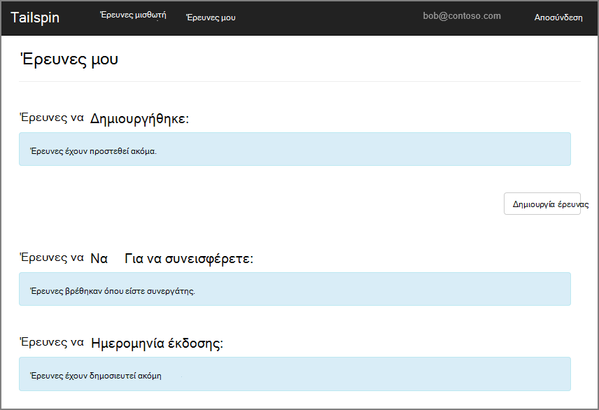
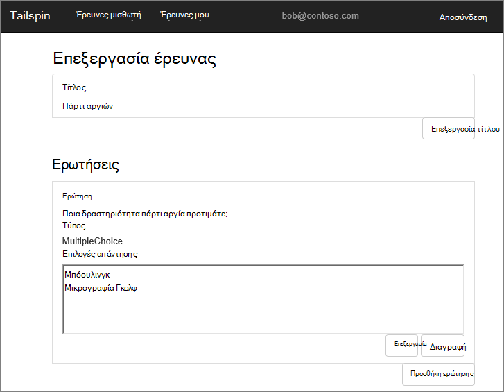
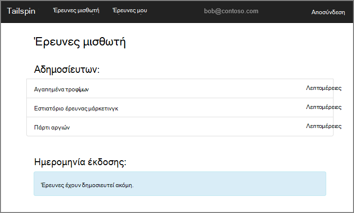
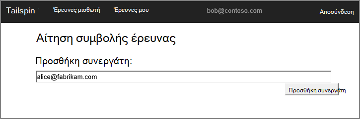
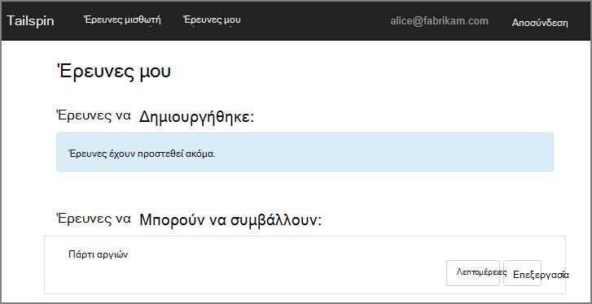
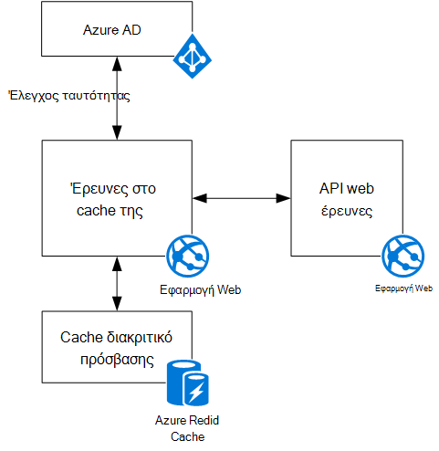

<properties
   pageTitle="Σχετικά με την εφαρμογή έρευνες Tailspin | Microsoft Azure"
   description="Επισκόπηση εφαρμογής tailspin έρευνες"
   services=""
   documentationCenter="na"
   authors="MikeWasson"
   manager="roshar"
   editor=""
   tags=""/>

<tags
   ms.service="guidance"
   ms.devlang="dotnet"
   ms.topic="article"
   ms.tgt_pltfrm="na"
   ms.workload="na"
   ms.date="05/23/2016"
   ms.author="mwasson"/>

# Σχετικά με την εφαρμογή Tailspin έρευνες

[AZURE.INCLUDE [pnp-header](../../includes/guidance-pnp-header-include.md)]

Σε αυτό το άρθρο αποτελεί [μέρος μιας σειράς]. Υπάρχει επίσης μια ολοκληρωμένη [δείγμα εφαρμογής] που συνοδεύει αυτήν τη σειρά.

Tailspin είναι μια φανταστικά εταιρεία που ανάπτυξη μιας εφαρμογής ΑΔΑ με το όνομα έρευνες. Αυτή η εφαρμογή επιτρέπει εταιρείες για να δημιουργήσετε και να δημοσιεύσετε online έρευνες.

- Μια εταιρεία να εγγραφείτε για την εφαρμογή.
- Αφού έχει εγγραφεί η εταιρεία, οι χρήστες μπορούν να συνδέονται στην εφαρμογή με το εταιρικό τα διαπιστευτήριά τους.
- Οι χρήστες μπορούν να δημιουργία, επεξεργασία και δημοσίευση έρευνες.

> [AZURE.NOTE] Για να ξεκινήσετε με την εφαρμογή, ανατρέξτε στο θέμα [λειτουργεί η εφαρμογή έρευνες].

## Οι χρήστες μπορούν να δημιουργία, επεξεργασία και προβολή έρευνες

Ένα χρήστη με έλεγχο ταυτότητας να προβάλετε όλες τις έρευνες που ο συνάδελφός έχει δημιουργηθεί ή έχουν δικαιώματα συμβολής σε και να δημιουργήσετε νέες έρευνες. Παρατηρήστε ότι ο χρήστης είναι συνδεδεμένος με την εταιρική ταυτότητα, `bob@contoso.com`.

Αυτό το στιγμιότυπο οθόνης εμφανίζει τη σελίδα επεξεργασία έρευνα:

Οι χρήστες επίσης να προβάλετε τις έρευνες που δημιουργούνται από άλλους χρήστες μέσα στο ίδιο μισθωτή.

## Οι κάτοχοι έρευνας να προσκαλέσετε συνεργατών

Όταν ένας χρήστης δημιουργεί μια έρευνα, να προσκαλέσετε άλλα άτομα να ορίσετε ως συνεργάτες σε την έρευνα. Οι συνεργάτες να επεξεργαστείτε την έρευνα, αλλά δεν είναι δυνατό να διαγράψετε ή να δημοσιεύστε το.  

Ένας χρήστης να προσθέσετε συνεργάτες από άλλα μισθωτές, η οποία σας επιτρέπει σταυρό μισθωτή κοινή χρήση των πόρων. Σε αυτό το στιγμιότυπο οθόνης, ο Μπάμπης (`bob@contoso.com`) είναι να προσθέσετε η Άννα (`alice@fabrikam.com`) ως ένα συνεργάτη σε μια έρευνα που δημιουργήσατε ο Μπάμπης.

Όταν η Άννα συνδέεται, βλέπει την έρευνα που παρατίθενται στην περιοχή "Να μπορούν να συμβάλλουν έρευνες".

Σημειώστε ότι η Άννα εισέρχεται στο δικό του μισθωτή, όχι ως επισκέπτης του μισθωτή Contoso. Η Άννα έχει δικαιώματα συμβολής μόνο για αυτήν την έρευνα &mdash; she δεν είναι δυνατό να προβάλετε άλλες έρευνες από το μισθωτή Contoso.

## Αρχιτεκτονική

Η εφαρμογή έρευνες αποτελείται από ένα web προσκηνίου και παρασκηνίου ένα web API. Και τα δύο έχουν εφαρμοστεί με χρήση [1.0 πυρήνα ASP.NET].

Η εφαρμογή web χρησιμοποιεί Azure Active Directory (Azure AD) για τον έλεγχο ταυτότητας χρηστών. Η εφαρμογή web κλήσεις επίσης Azure AD για να λάβετε διακριτικά πρόσβασης OAuth 2 για το API Web. Διακριτικά πρόσβασης αποθηκεύονται στο cache στο Azure Redis Cache. Το cache επιτρέπει πολλές παρουσίες για την κοινή χρήση του ίδιου διακριτικού cache (π.χ., σε μια συστοιχία διακομιστών).

## Επόμενα βήματα

- Διαβάστε το επόμενο άρθρο σε αυτήν τη σειρά: [Έλεγχος ταυτότητας στο multitenant εφαρμογές, με χρήση του Azure Active Directory και σύνδεση OpenID][authentication]

<!-- Links -->

[authentication]: guidance-multitenant-identity-authenticate.md
[μέρος μιας σειράς]: guidance-multitenant-identity.md
[Εκτέλεση της εφαρμογής έρευνες]: https://github.com/Azure-Samples/guidance-identity-management-for-multitenant-apps/blob/master/docs/running-the-app.md
[Πυρήνα ASP.NET 1.0]: https://docs.asp.net/en/latest/
[δείγμα εφαρμογής]: https://github.com/Azure-Samples/guidance-identity-management-for-multitenant-apps
