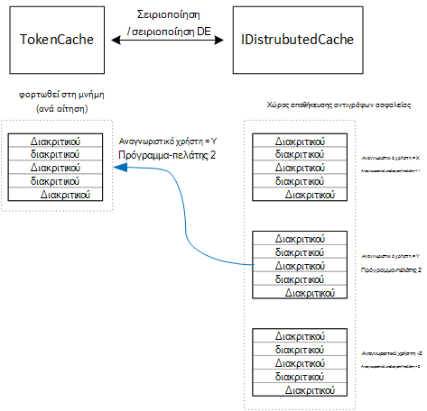

<properties
   pageTitle="Προσωρινή αποθήκευση διακριτικά πρόσβαση στην σε μια εφαρμογή multitenant | Microsoft Azure"
   description="Προσωρινή αποθήκευση διακριτικά πρόσβασης που χρησιμοποιείται για την ενεργοποίηση ενός στοιχείου διακομιστή Web API"
   services=""
   documentationCenter="na"
   authors="MikeWasson"
   manager="roshar"
   editor=""
   tags=""/>

<tags
   ms.service="guidance"
   ms.devlang="dotnet"
   ms.topic="article"
   ms.tgt_pltfrm="na"
   ms.workload="na"
   ms.date="02/16/2016"
   ms.author="mwasson"/>


# <a name="caching-access-tokens-in-a-multitenant-application"></a>Προσωρινή αποθήκευση διακριτικά πρόσβασης σε μια εφαρμογή multitenant

[AZURE.INCLUDE [pnp-header](../../includes/guidance-pnp-header-include.md)]

Σε αυτό το άρθρο αποτελεί [μέρος μιας σειράς]. Υπάρχει επίσης μια ολοκληρωμένη [δείγμα εφαρμογής] που συνοδεύει αυτήν τη σειρά.

Είναι σχετικά ακριβό για να λάβετε μια πρόσβασης OAuth διακριτικού, επειδή απαιτεί μια αίτηση HTTP για να το διακριτικό τελικό σημείο. Επομένως, είναι καλό να τα διακριτικά cache όποτε είναι δυνατό. Η [Βιβλιοθήκη ελέγχου ταυτότητας Azure AD] [ ADAL] (ADAL) αποθηκεύει αυτόματα τα διακριτικά που λαμβάνονται από το Azure AD, συμπεριλαμβανομένων των διακριτικά ανανέωσης.

ADAL παρέχει μια προεπιλεγμένη υλοποίηση διακριτικού cache. Ωστόσο, αυτή η μνήμη cache διακριτικού προορίζεται για εφαρμογές εγγενές πρόγραμμα-πελάτη και είναι _δεν_ κατάλληλη για εφαρμογές web:

-   Πρόκειται για μια στατική παρουσία και δεν διαθέτει ασφάλεια νήματος.
-   Αυτό δεν κλίμακα σε πολλούς χρήστες, επειδή τα διακριτικά από όλους τους χρήστες, μεταβείτε στο ίδιο το λεξικό.
-   Αυτό δεν μπορεί να είναι κοινόχρηστη σε διακομιστές web σε μια συστοιχία.

Αντί για αυτό, θα πρέπει να υλοποιήσετε ένα προσαρμοσμένο διακριτικού cache που προέρχεται από το ADAL `TokenCache` κλάσης αλλά είναι κατάλληλη για ένα περιβάλλον διακομιστή και παρέχει το επιθυμητό επίπεδο απομόνωσης μεταξύ διακριτικά για διαφορετικούς χρήστες.

Το `TokenCache` κλάσης αποθηκεύει ένα λεξικό διακριτικά, σε ευρετήριο από εκδότη, πόρων, Αναγνωριστικό υπολογιστή-πελάτη και χρήστη. Ένα προσαρμοσμένο διακριτικού cache πρέπει να γράψετε αυτό το λεξικό για μια χώρου αποθήκευσης αντιγράφων ασφαλείας, όπως ένα cache Redis.

Στην εφαρμογή έρευνες Tailspin, το `DistributedTokenCache` κλάσης υλοποιεί το διακριτικό cache. Αυτή η υλοποίηση χρησιμοποιεί το [IDistributedCache] [ distributed-cache] αφαίρεσης από 1.0 πυρήνα ASP.NET. Με αυτόν τον τρόπο, οποιαδήποτε `IDistributedCache` εφαρμογή μπορεί να χρησιμοποιηθεί ως ένα χώρου αποθήκευσης αντιγράφων ασφαλείας.

-   Από προεπιλογή, η εφαρμογή έρευνες χρησιμοποιεί ένα cache Redis.
-   Για ένα διακομιστή web μίας μόνο παρουσίας, θα μπορούσατε να χρησιμοποιήσετε το ASP.NET πυρήνα 1.0 [στη μνήμη cache][in-memory-cache]. (Αυτό είναι επίσης μια καλή επιλογή για την εκτέλεση της εφαρμογής τοπικά κατά την ανάπτυξη.)

> [AZURE.NOTE] Προς το παρόν το cache Redis δεν υποστηρίζεται για .NET πυρήνα.

`DistributedTokenCache`αποθηκεύει τα δεδομένα του cache ως ζεύγη κλειδιού/τιμής στο χώρο αποθήκευσης τη δημιουργία αντιγράφων ασφαλείας. Τον αριθμό-κλειδί είναι το Αναγνωριστικό χρήστη συν Αναγνωριστικό υπολογιστή-πελάτη, ώστε να του χώρου αποθήκευσης αντιγράφων ασφαλείας περιέχει δεδομένα ξεχωριστές cache για κάθε μοναδικό συνδυασμό του χρήστη/υπολογιστή-πελάτη.



Δημιουργία διαμερισμάτων του χώρου αποθήκευσης αντιγράφων ασφαλείας από το χρήστη. Για κάθε αίτηση HTTP, τα διακριτικά για τον συγκεκριμένο χρήστη από το χώρο αποθήκευσης τη δημιουργία αντιγράφων ασφαλείας και διαβάζονται φορτωθεί στη το `TokenCache` λεξικό. Εάν Redis χρησιμοποιείται ως το χώρου αποθήκευσης αντιγράφων ασφαλείας, κάθε παρουσία διακομιστή σε ένα σύμπλεγμα διακομιστών διαβάζει/εγγραφών στο ίδιο cache και κλίμακες αυτήν την προσέγγιση για πολλούς χρήστες.

## <a name="encrypting-cached-tokens"></a>Η κρυπτογράφηση διακριτικά στο cache

Τα διακριτικά είναι ευαίσθητα δεδομένα, επειδή παρέχουν πρόσβαση σε πόρους ενός χρήστη. (Επιπλέον, σε αντίθεση με κωδικού πρόσβασης ενός χρήστη, δεν μπορείτε απλώς να αποθηκεύσετε κατακερματισμός του διακριτικού.) Επομένως, είναι σημαντικό να προστατεύσετε τα διακριτικά από παραβιαστεί. Το cache αντίγραφα Redis προστατεύεται από κωδικό πρόσβασης, αλλά αν κάποιος λαμβάνει τον κωδικό πρόσβασης, θα μπορούσε να λαμβάνουν όλα τα διακριτικά πρόσβασης στο cache. Για αυτόν το λόγο, η `DistributedTokenCache` κρυπτογραφεί όλα όσα εγγραφή στο χώρο αποθήκευσης τη δημιουργία αντιγράφων ασφαλείας. Κρυπτογράφηση γίνεται χρησιμοποιώντας την υπηρεσία ASP.NET 1.0 πυρήνα [προστασία δεδομένων] [ data-protection] APIs.

> [AZURE.NOTE] Εάν αναπτύξετε για τοποθεσίες Web Azure, των κλειδιών κρυπτογράφησης είναι αντίγραφα ασφαλείας με το χώρο αποθήκευσης δικτύου και να συγχρονιστούν σε όλους τους υπολογιστές (ανατρέξτε στο θέμα [Διαχείρισης κλειδιών][key-management]). Από προεπιλογή, κλειδιά δεν είναι κρυπτογραφημένα όταν εκτελείται σε τοποθεσίες Web Azure, αλλά μπορείτε να [ενεργοποιήσετε την κρυπτογράφηση χρησιμοποιώντας ένα πιστοποιητικό X.509][x509-cert-encryption].


## <a name="distributedtokencache-implementation"></a>Εφαρμογή DistributedTokenCache

Το [DistributedTokenCache] [ DistributedTokenCache] κλάσης προέρχεται από το ADAL [TokenCache] [ tokencache-class] τάξης.

Στην κατασκευή, το `DistributedTokenCache` κλάσης δημιουργεί έναν αριθμό-κλειδί για τον τρέχοντα χρήστη και φορτώνει το cache από το χώρο αποθήκευσης τη δημιουργία αντιγράφων ασφαλείας:

```csharp
public DistributedTokenCache(
    ClaimsPrincipal claimsPrincipal,
    IDistributedCache distributedCache,
    ILoggerFactory loggerFactory,
    IDataProtectionProvider dataProtectionProvider)
    : base()
{
    _claimsPrincipal = claimsPrincipal;
    _cacheKey = BuildCacheKey(_claimsPrincipal);
    _distributedCache = distributedCache;
    _logger = loggerFactory.CreateLogger<DistributedTokenCache>();
    _protector = dataProtectionProvider.CreateProtector(typeof(DistributedTokenCache).FullName);
    AfterAccess = AfterAccessNotification;
    LoadFromCache();
}
```

Το κλειδί δημιουργείται συνδέοντας το Αναγνωριστικό χρήστη και το αναγνωριστικό υπολογιστή-πελάτη. Και τα δύο από τα εξής λαμβάνονται από αξιώσεων που βρέθηκε στο χρήστη `ClaimsPrincipal`:

```csharp
private static string BuildCacheKey(ClaimsPrincipal claimsPrincipal)
{
    string clientId = claimsPrincipal.FindFirstValue("aud", true);
    return string.Format(
        "UserId:{0}::ClientId:{1}",
        claimsPrincipal.GetObjectIdentifierValue(),
        clientId);
}
```

Για να φορτώσετε τα δεδομένα του cache, διαβάστε το αλληλουχίας blob από το χώρου αποθήκευσης αντιγράφων ασφαλείας και κλήση `TokenCache.Deserialize` για να μετατρέψετε το αντικείμενο blob σε cache δεδομένων.

```csharp
private void LoadFromCache()
{
    byte[] cacheData = _distributedCache.Get(_cacheKey);
    if (cacheData != null)
    {
        this.Deserialize(_protector.Unprotect(cacheData));
    }
}
```

Κάθε φορά που ADAL πρόσβαση του cache, ενεργοποιείται μια `AfterAccess` συμβάν. Εάν τα δεδομένα του cache έχει αλλάξει, το `HasStateChanged` ιδιότητα είναι true. Σε αυτή την περίπτωση, ενημερώστε το χώρου αποθήκευσης αντιγράφων ασφαλείας να εφαρμοστούν οι αλλαγές και, στη συνέχεια, ορίστε `HasStateChanged` στην τιμή false.

```csharp
public void AfterAccessNotification(TokenCacheNotificationArgs args)
{
    if (this.HasStateChanged)
    {
        try
        {
            if (this.Count > 0)
            {
                _distributedCache.Set(_cacheKey, _protector.Protect(this.Serialize()));
            }
            else
            {
                // There are no tokens for this user/client, so remove the item from the cache.
                _distributedCache.Remove(_cacheKey);
            }
            this.HasStateChanged = false;
        }
        catch (Exception exp)
        {
            _logger.WriteToCacheFailed(exp);
            throw;
        }
    }
}
```

TokenCache στέλνει δύο άλλα συμβάντα:

- `BeforeWrite`. Η οποία ονομάζεται αμέσως πριν από την ADAL συντάσσει στο cache. Μπορείτε να το χρησιμοποιήσετε για την υλοποίηση της στρατηγικής ταυτόχρονης εκτέλεσης
- `BeforeAccess`. Η οποία ονομάζεται αμέσως πριν από την ADAL διαβάζει από το cache. Εδώ μπορείτε να το φορτώσετε το cache για να λάβετε την πιο πρόσφατη έκδοση.

Σε περίπτωση μας, θα σας αποφασίσει να μην χειρισμού αυτά τα δύο συμβάντα.

- Για ταυτόχρονης εκτέλεσης, τελευταία εγγραφή wins. Που είναι OK, επειδή τα διακριτικά αποθηκεύονται ξεχωριστά για κάθε χρήστη + πρόγραμμα-πελάτη, ώστε μια διένεξη θα συμβεί μόνο εάν ο ίδιος χρήστης είχε δύο περιόδους λειτουργίας ταυτόχρονες σύνδεσης.
- Για ανάγνωση, θα σας να φορτώσετε το cache σε κάθε αίτηση. Οι αιτήσεις είναι μικρό χρόνο ζωής. Εάν το cache λαμβάνει τροποποίηση σε συγκεκριμένο χρόνο, την επόμενη αίτηση θα σηκώστε τη νέα τιμή.

## <a name="next-steps"></a>Επόμενα βήματα

- Διαβάστε το επόμενο άρθρο σε αυτήν τη σειρά: [Federating με έναν πελάτη AD FS για multitenant εφαρμογές στο Azure][adfs]

<!-- links -->
[ADAL]: https://msdn.microsoft.com/library/azure/jj573266.aspx
[adfs]: guidance-multitenant-identity-adfs.md
[data-protection]: https://docs.asp.net/en/latest/security/data-protection/index.html
[distributed-cache]: https://docs.asp.net/en/latest/fundamentals/distributed-cache.html
[DistributedTokenCache]: https://github.com/Azure-Samples/guidance-identity-management-for-multitenant-apps/blob/master/src/Tailspin.Surveys.TokenStorage/DistributedTokenCache.cs
[key-management]: https://docs.asp.net/en/latest/security/data-protection/configuration/default-settings.html
[in-memory-cache]: https://docs.asp.net/en/latest/fundamentals/caching.html
[tokencache-class]: https://msdn.microsoft.com/library/azure/microsoft.identitymodel.clients.activedirectory.tokencache.aspx
[x509-cert-encryption]: https://docs.asp.net/en/latest/security/data-protection/implementation/key-encryption-at-rest.html#x-509-certificate
[μέρος μιας σειράς]: guidance-multitenant-identity.md
[δείγμα εφαρμογής]: https://github.com/Azure-Samples/guidance-identity-management-for-multitenant-apps
