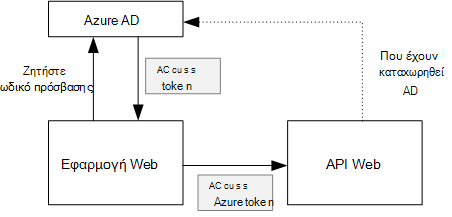
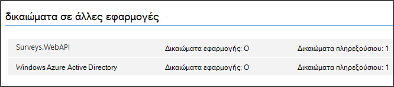

<properties
   pageTitle="Ασφάλιση μιας παρασκηνίου API web σε μια εφαρμογή multitenant | Microsoft Azure"
   description="Πώς μπορείτε να ασφαλίσετε μια API web παρασκηνίου"
   services=""
   documentationCenter="na"
   authors="MikeWasson"
   manager="roshar"
   editor=""
   tags=""/>

<tags
   ms.service="guidance"
   ms.devlang="dotnet"
   ms.topic="article"
   ms.tgt_pltfrm="na"
   ms.workload="na"
   ms.date="06/02/2016"
   ms.author="mwasson"/>

# <a name="securing-a-backend-web-api-in-a-multitenant-application"></a>Ασφάλιση μιας παρασκηνίου API web σε μια εφαρμογή multitenant

[AZURE.INCLUDE [pnp-header](../../includes/guidance-pnp-header-include.md)]

Σε αυτό το άρθρο αποτελεί [μέρος μιας σειράς]. Υπάρχει επίσης μια ολοκληρωμένη [δείγμα εφαρμογής] που συνοδεύει αυτήν τη σειρά.

Η εφαρμογή [Tailspin έρευνες] χρησιμοποιεί ένα API web παρασκηνίου για να διαχειριστείτε τις λειτουργίες CRUD σε έρευνες. Για παράδειγμα, όταν ένας χρήστης κάνει κλικ "Έρευνες μου", η εφαρμογή web αποστέλλει μια αίτηση HTTP για το API στο web:

```
GET /users/{userId}/surveys
```

Το API web επιστρέφει ένα αντικείμενο JSON:

```
{
  "Published":[],
  "Own":[
    {"Id":1,"Title":"Survey 1"},
    {"Id":3,"Title":"Survey 3"},
    ],
  "Contribute": [{"Id":8,"Title":"My survey"}]
}
```

Το API web δεν σας επιτρέπει ανώνυμη αιτήσεις, ώστε η εφαρμογή web πρέπει να τον έλεγχο ταυτότητας του εαυτού χρησιμοποιώντας τα διακριτικά φορέα OAuth 2.

> [AZURE.NOTE] Αυτό είναι ένα σενάριο διακομιστή. Η εφαρμογή δεν κλήσεις οποιαδήποτε AJAX για το API από το πρόγραμμα-πελάτη του προγράμματος περιήγησης.

Υπάρχουν δύο κύρια προσεγγίσεις:

- Ανάθεση ταυτότητα χρήστη. Η εφαρμογή web πραγματοποιεί έλεγχο ταυτότητας με την ταυτότητα του χρήστη.
- Ταυτότητα της εφαρμογής. Η εφαρμογή web πραγματοποιεί έλεγχο ταυτότητας με το Αναγνωριστικό υπολογιστή-πελάτη, χρησιμοποιώντας OAuth2 ροής διαπιστευτηρίων προγράμματος-πελάτη.

Η εφαρμογή Tailspin υλοποιεί ταυτότητα χρήστη ανάθεση. Ακολουθούν οι κύριες διαφορές:

**Ταυτότητα χρήστη ανάθεση**

- Το διακριτικό φορέα αποστέλλονται στο Web API περιέχει την ταυτότητα χρήστη.
- Το API web λαμβάνει αποφάσεις εξουσιοδότησης με βάση την ταυτότητα χρήστη.
- Η εφαρμογή web πρέπει να χειριστείτε 403 (Απαγορεύεται) σφάλματα από το web API, εάν ο χρήστης δεν έχει δικαίωμα να εκτελεί μια ενέργεια.
- Συνήθως, η εφαρμογή web εξακολουθεί να λαμβάνει ορισμένες εξουσιοδότησης αποφάσεις που επηρεάζουν το περιβάλλον εργασίας Χρήστη, όπως η εμφάνιση ή απόκρυψη στοιχεία περιβάλλοντος εργασίας Χρήστη).
- Το API web ενδεχομένως μπορούν να χρησιμοποιηθούν από μη αξιόπιστα προγραμμάτων-πελατών, όπως μια εφαρμογή JavaScript / εγγενές πρόγραμμα-πελάτη.

**Ταυτότητα της εφαρμογής**

- Το API web δεν λήψη πληροφοριών σχετικά με το χρήστη.
- Το API web δεν μπορεί να εκτελέσει οποιαδήποτε εξουσιοδότησης με βάση την ταυτότητα χρήστη. Όλες τις αποφάσεις εξουσιοδότησης γίνονται από την εφαρμογή web.  
- Το API web δεν μπορεί να χρησιμοποιηθεί από μια μη αξιόπιστη υπολογιστή-πελάτη (JavaScript ή εφαρμογή εγγενούς προγράμματος-πελάτη).
- Αυτή η προσέγγιση μπορεί να είναι κάπως πιο απλά για να υλοποιήσετε, επειδή δεν υπάρχει καμία λογική εξουσιοδότησης στο Web API.

Σε οποιαδήποτε προσέγγιση, η εφαρμογή web πρέπει να αποκτήσετε ένα διακριτικό πρόσβασης, το οποίο είναι τα διαπιστευτήρια που απαιτείται για να καλέσετε το API web.

- Για ταυτότητα χρήστη ανάθεση, το διακριτικό πρέπει να προέρχονται από το IDP, η οποία μπορεί να εκδώσετε ενός διακριτικού εκ μέρους του χρήστη.

- Για τα διαπιστευτήρια προγράμματος-πελάτη, μια εφαρμογή μπορεί να λάβετε το διακριτικό από το IDP ή να φιλοξενήσετε δικό του διακριτικού διακομιστή. (Αλλά μην γράψετε διακριτικού διακομιστή από την αρχή, χρησιμοποιήστε μια καλά έλεγχο framework όπως [IdentityServer3].) Εάν έχετε τον έλεγχο ταυτότητας με Azure AD, συνιστάται ιδιαίτερα να λάβετε το διακριτικό πρόσβασης από το Azure AD, ακόμα και με ροή διαπιστευτηρίων προγράμματος-πελάτη.

Τα υπόλοιπα σε αυτό το άρθρο προϋποθέτει ότι η εφαρμογή τον έλεγχο ταυτότητας με Azure AD.



## <a name="register-the-web-api-in-azure-ad"></a>Καταχώρηση web API στο Azure AD

Με τη σειρά για Azure AD για την έκδοση ένα διακριτικό φορέα για το API web, πρέπει να ρυθμίσετε τις παραμέτρους ορισμένα στοιχεία στο Azure AD.

1. [Καταχώρηση web API στη Azure AD].

2. Προσθέστε το Αναγνωριστικό υπολογιστή-πελάτη του web app για τη δήλωση της εφαρμογής web API, στο το `knownClientApplications` την ιδιότητα. Ανατρέξτε στο θέμα [Ενημέρωση του δηλώσεων εφαρμογής].

3. [Δώστε το δικαίωμα εφαρμογής web για να καλέσετε το API web].

  Στην πύλη διαχείρισης του Azure, μπορείτε να ορίσετε δύο τύποι δικαιωμάτων: "Εφαρμογή δικαιωμάτων" για εφαρμογή ταυτότητας (ροή διαπιστευτηρίων προγράμματος-πελάτη) ή "Ανάθεση δικαιωμάτων" για την ανάθεση χρήστη ταυτότητα.

  

## <a name="getting-an-access-token"></a>Γρήγορα ένα διακριτικό πρόσβασης

Πριν από την κλήση web API, της εφαρμογής web αποκτά πρόσβαση σε διακριτικού από το Azure AD. Σε μια εφαρμογή .NET, χρησιμοποιήστε το [Azure AD ελέγχου ταυτότητας βιβλιοθήκης (ADAL) για το .NET][ADAL].

Της ροής κώδικα εξουσιοδότησης OAuth 2, η εφαρμογή αντικαταστήσει έναν κωδικό εξουσιοδότησης για ένα διακριτικό πρόσβασης. Ο ακόλουθος κώδικας χρησιμοποιεί ADAL για να λάβετε το διακριτικό πρόσβασης. Αυτός ο κωδικός καλείται κατά τη διάρκεια του `AuthorizationCodeReceived` συμβάν.

```csharp
// The OpenID Connect middleware sends this event when it gets the authorization code.   
public override async Task AuthorizationCodeReceived(AuthorizationCodeReceivedContext context)
{
    string authorizationCode = context.ProtocolMessage.Code;
    string authority = "https://login.microsoftonline.com/" + tenantID
    string resourceID = "https://tailspin.onmicrosoft.com/surveys.webapi" // App ID URI
    ClientCredential credential = new ClientCredential(clientId, clientSecret);

    AuthenticationContext authContext = new AuthenticationContext(authority, tokenCache);
    AuthenticationResult authResult = await authContext.AcquireTokenByAuthorizationCodeAsync(
        authorizationCode, new Uri(redirectUri), credential, resourceID);

    // If successful, the token is in authResult.AccessToken
}
```

Δείτε εδώ τις διάφορες παραμέτρους που είναι απαραίτητα:

- `authority`. Που προέρχονται από το Αναγνωριστικό μισθωτή ο συνδεδεμένος χρήστης. (Μην το Αναγνωριστικό μισθωτή της υπηρεσίας παροχής ΑΔΑ)  
- `authorizationCode`. ο κωδικός auth που λάβατε πίσω από το IDP.
- `clientId`. Αναγνωριστικό υπολογιστή-πελάτη της εφαρμογής web
- `clientSecret`. Μυστικό προγράμματος-πελάτη της εφαρμογής web.
- `redirectUri`. Η ανακατεύθυνση URI που έχετε ορίσει για OpenID σύνδεση. Αυτό είναι όπου το IDP κλήσεις ξανά με το διακριτικό.
- `resourceID`. Το URI Αναγνωριστικό εφαρμογής του web API, που δημιουργήσατε κατά την καταχώρηση το API web στο Azure AD
- `tokenCache`. Αντικείμενο που αποθηκεύει τα διακριτικά πρόσβασης. Ανατρέξτε στο θέμα [διακριτικό σε cache].

Εάν `AcquireTokenByAuthorizationCodeAsync` με επιτυχία, ADAL αποθηκεύει προσωρινά το διακριτικό. Αργότερα, μπορείτε να λάβετε το διακριτικό από το cache καλώντας AcquireTokenSilentAsync:

```csharp
AuthenticationContext authContext = new AuthenticationContext(authority, tokenCache);
var result = await authContext.AcquireTokenSilentAsync(resourceID, credential, new UserIdentifier(userId, UserIdentifierType.UniqueId));
```

όπου `userId` είναι Αναγνωριστικό αντικειμένου του χρήστη, το οποίο βρίσκεται στο το `http://schemas.microsoft.com/identity/claims/objectidentifier` διεκδίκηση.

## <a name="using-the-access-token-to-call-the-web-api"></a>Χρησιμοποιώντας το διακριτικό πρόσβασης για να καλέσετε το API web

Μόλις το διακριτικό, στείλτε την στην κεφαλίδα της εξουσιοδότησης των αιτήσεων HTTP για το API στο web.

```
Authorization: Bearer xxxxxxxxxx
```

Την ακόλουθη μέθοδο επέκταση από την εφαρμογή έρευνες ορίζει την κεφαλίδα εξουσιοδότησης σε μια αίτηση HTTP, χρησιμοποιώντας την κλάση **HttpClient** .

```csharp
public static async Task<HttpResponseMessage> SendRequestWithBearerTokenAsync(this HttpClient httpClient, HttpMethod method, string path, object requestBody, string accessToken, CancellationToken ct)
{
    var request = new HttpRequestMessage(method, path);
    if (requestBody != null)
    {
        var json = JsonConvert.SerializeObject(requestBody, Formatting.None);
        var content = new StringContent(json, Encoding.UTF8, "application/json");
        request.Content = content;
    }

    request.Headers.Authorization = new AuthenticationHeaderValue("Bearer", accessToken);
    request.Headers.Accept.Add(new MediaTypeWithQualityHeaderValue("application/json"));

    var response = await httpClient.SendAsync(request, ct);
    return response;
}
```

> [AZURE.NOTE] Ανατρέξτε στο θέμα [HttpClientExtensions.cs].

## <a name="authenticating-in-the-web-api"></a>Έλεγχος ταυτότητας στην τοποθεσία web API

Το API web έχει για τον έλεγχο ταυτότητας το διακριτικό φορέα. Στο ASP.NET 1.0 πυρήνα, μπορείτε να χρησιμοποιήσετε το [Microsoft.AspNet.Authentication.JwtBearer] [ JwtBearer] πακέτου. Αυτό το πακέτο παρέχει το ενδιάμεσο που επιτρέπει την εφαρμογή για να λάβετε τα διακριτικά σύνδεση OpenID φορέα.

Καταχώρηση το ενδιάμεσο της τοποθεσίας σας web API `Startup` τάξης.

```csharp
app.UseJwtBearerAuthentication(options =>
{
    options.Audience = "[app ID URI]";
    options.Authority = "https://login.microsoftonline.com/common/";
    options.TokenValidationParameters = new TokenValidationParameters
    {
        //Instead of validating against a fixed set of known issuers, we perform custom multi-tenant validation logic
        ValidateIssuer = false,
    };
    options.Events = new SurveysJwtBearerEvents();
});
```

> [AZURE.NOTE] Ανατρέξτε στο θέμα [Startup.cs].

- **Ακροατήριο**. Ορίστε αυτή την επιλογή για τη διεύθυνση URL Αναγνωριστικό εφαρμογής για το web API, που δημιουργήσατε κατά την καταχώρηση το API web με το Azure AD.
- **Αρχή έκδοσης πιστοποιητικών**. Για μια εφαρμογή multitenant, ορίστε αυτή σε `https://login.microsoftonline.com/common/`.
- **TokenValidationParameters**. Για μια εφαρμογή multitenant, ορίστε **ValidateIssuer** FALSE (ψευδής). Αυτό σημαίνει ότι η εφαρμογή θα επαληθεύσει τον εκδότη.
- **Συμβάντα** είναι μια κλάση που προέρχεται από **JwtBearerEvents**.

### <a name="issuer-validation"></a>Εκδότης επικύρωσης

Επικυρώστε τον εκδότη διακριτικού στο συμβάν **JwtBearerEvents.ValidatedToken** . Τον εκδότη αποστέλλεται με το αίτημα "iss".

Στην εφαρμογή έρευνες, το API web δεν λαβή [μισθωτή εγγραφής]. Γι ' αυτό, μόλις ελέγχει εάν ο εκδότης είναι ήδη σε βάση δεδομένων της εφαρμογής. Εάν όχι, το δημιουργεί μια εξαίρεση, που προκαλεί την αποτυχία του ελέγχου ταυτότητας.

```csharp
public override async Task ValidatedToken(ValidatedTokenContext context)
{
    var principal = context.AuthenticationTicket.Principal;
    var tenantManager = context.HttpContext.RequestServices.GetService<TenantManager>();
    var userManager = context.HttpContext.RequestServices.GetService<UserManager>();
    var issuerValue = principal.GetIssuerValue();
    var tenant = await tenantManager.FindByIssuerValueAsync(issuerValue);

    if (tenant == null)
    {
        // the caller was not from a trusted issuer - throw to block the authentication flow
        throw new SecurityTokenValidationException();
    }
}
```

> [AZURE.NOTE] Ανατρέξτε στο θέμα [SurveysJwtBearerEvents.cs].

Μπορείτε επίσης να χρησιμοποιήσετε το συμβάν **ValidatedToken** για να κάνετε το [μετασχηματισμό αξιώσεων]. Να θυμάστε ότι η αξιώσεων παραδίδεται απευθείας από το Azure AD, ώστε να εάν η εφαρμογή web μήπως τυχόν μετασχηματισμοί αξιώσεων, αυτές δεν θα εμφανίζονται στο το διακριτικό φορέα που λαμβάνει το API web.

## <a name="authorization"></a>Εξουσιοδότηση

Για γενικές πληροφορίες σχετικά με εξουσιοδότησης, ανατρέξτε στο θέμα [εξουσιοδότηση βάσει ρόλων και πόρων βάσει][Authorization]. 

Το ενδιάμεσο JwtBearer χειρίζεται τις απαντήσεις εξουσιοδότησης. Για παράδειγμα, για να περιορίσετε μια ενέργεια ελεγκτή σε χρήστες με έλεγχο ταυτότητας, χρησιμοποιήστε το atrribute **[εξουσιοδότηση]** και καθορίστε **JwtBearerDefaults.AuthenticationScheme** ως το σχήμα ελέγχου ταυτότητας:

```csharp
[Authorize(ActiveAuthenticationSchemes = JwtBearerDefaults.AuthenticationScheme)]
```

Αυτό επιστρέφει έναν κωδικό 401 κατάστασης, εάν ο χρήστης δεν έχει γίνει έλεγχος ταυτότητας.

Για να περιορίσετε μια ενέργεια ελεγκτή από την πολιτική authorizaton, καθορίστε το όνομα της πολιτικής στο χαρακτηριστικό **[εξουσιοδότηση]** :

```csharp
[Authorize(Policy = PolicyNames.RequireSurveyCreator)]
```

Αυτό επιστρέφει έναν κωδικό 401 κατάστασης, εάν ο χρήστης δεν έχει γίνει έλεγχος ταυτότητας και 403, εάν ο χρήστης έχει ελεγχθεί η ταυτότητά, αλλά δεν έχετε δικαίωμα. Καταχωρήστε την πολιτική κατά την εκκίνηση:

```csharp
public void ConfigureServices(IServiceCollection services)
{
    services.AddAuthorization(options =>
    {
        options.AddPolicy(PolicyNames.RequireSurveyCreator,
            policy =>
            {
                policy.AddRequirements(new SurveyCreatorRequirement());
                policy.AddAuthenticationSchemes(JwtBearerDefaults.AuthenticationScheme);
            });
    });
}
```

## <a name="next-steps"></a>Επόμενα βήματα

- Διαβάστε το επόμενο άρθρο σε αυτήν τη σειρά: [προσωρινή αποθήκευση διακριτικά πρόσβασης σε μια εφαρμογή multitenant][token cache]

<!-- links -->
[ADAL]: https://msdn.microsoft.com/library/azure/jj573266.aspx
[JwtBearer]: https://www.nuget.org/packages/Microsoft.AspNet.Authentication.JwtBearer
[μέρος μιας σειράς]: guidance-multitenant-identity.md
[Tailspin έρευνες]: guidance-multitenant-identity-tailspin.md
[IdentityServer3]: https://github.com/IdentityServer/IdentityServer3
[Καταχώρηση web API στο Azure AD]: https://github.com/Azure-Samples/guidance-identity-management-for-multitenant-apps/blob/master/docs/running-the-app.md#register-the-surveys-web-api
[Ενημερώστε την εφαρμογή δηλώσεων]: https://github.com/Azure-Samples/guidance-identity-management-for-multitenant-apps/blob/master/docs/running-the-app.md#update-the-application-manifests
[Δώστε το δικαίωμα εφαρμογής web για να καλέσετε το API web]: https://github.com/Azure-Samples/guidance-identity-management-for-multitenant-apps/blob/master/docs/running-the-app.md#give-the-web-app-permissions-to-call-the-web-api
[Προσωρινή αποθήκευση διακριτικού]: guidance-multitenant-identity-token-cache.md
[HttpClientExtensions.cs]: https://github.com/Azure-Samples/guidance-identity-management-for-multitenant-apps/blob/master/src/Tailspin.Surveys.Common/HttpClientExtensions.cs
[Startup.CS]: https://github.com/Azure-Samples/guidance-identity-management-for-multitenant-apps/blob/master/src/Tailspin.Surveys.WebAPI/Startup.cs
[μισθωτή εγγραφής]: guidance-multitenant-identity-signup.md
[SurveysJwtBearerEvents.cs]: https://github.com/Azure-Samples/guidance-identity-management-for-multitenant-apps/blob/master/src/Tailspin.Surveys.WebAPI/SurveyJwtBearerEvents.cs
[Μετασχηματισμός αξιώσεων]: guidance-multitenant-identity-claims.md#claims-transformations
[Authorization]: guidance-multitenant-identity-authorize.md
[δείγμα εφαρμογής]: https://github.com/Azure-Samples/guidance-identity-management-for-multitenant-apps
[token cache]: guidance-multitenant-identity-token-cache.md
