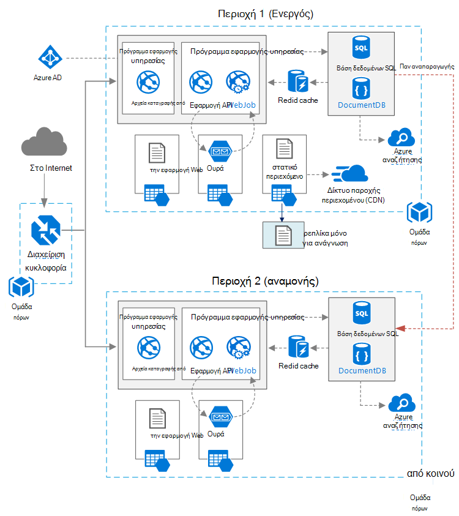

<properties
   pageTitle="Εφαρμογή Web με υψηλή διαθεσιμότητα | Αρχιτεκτονική Azure αναφοράς | Microsoft Azure"
   description="Συνιστάται η αρχιτεκτονική για την εφαρμογή web με υψηλή διαθεσιμότητα, εκτελείται στο Microsoft Azure."
   services="app-service,app-service\web,sql-database" 
   documentationCenter="na"
   authors="MikeWasson"
   manager="roshar"
   editor=""
   tags=""/>

<tags
   ms.service="guidance"
   ms.devlang="na"
   ms.topic="article"
   ms.tgt_pltfrm="na"
   ms.workload="na"
   ms.date="06/27/2016"
   ms.author="mwasson"/>

# <a name="azure-reference-architecture-web-application-with-high-availability"></a>Αρχιτεκτονική Azure αναφορά: εφαρμογή Web με υψηλή διαθεσιμότητα

[AZURE.INCLUDE [pnp-RA-branding](../../includes/guidance-pnp-header-include.md)]

Σε αυτό το άρθρο παρουσιάζει μια προτεινόμενη αρχιτεκτονική για μια εφαρμογή web με υψηλή διαθεσιμότητα, εκτελούνται στο Microsoft Azure. Η αρχιτεκτονική δημιουργεί [αρχιτεκτονική Azure αναφορά: βελτίωση της κλιμάκωση σε μια εφαρμογή web][guidance-web-apps-scalability].

## <a name="architecture-diagram"></a>Διάγραμμα αρχιτεκτονικής



Αυτή η αρχιτεκτονική δημιουργεί σε αυτό που εμφανίζεται στη [βελτίωση της κλιμάκωση σε μια εφαρμογή web][guidance-web-apps-scalability]. Οι κύριες διαφορές είναι:

- **Περιοχές κύριας και δευτερεύουσας**. Αυτή η αρχιτεκτονική χρησιμοποιεί δύο περιοχές για να επιτύχετε μεγαλύτερη διαθεσιμότητα. Η εφαρμογή έχει αναπτυχθεί σε κάθε περιοχές. Κατά την κανονική λειτουργία, η κίνηση του δικτύου δρομολογείται στην κύρια περιοχή. Αλλά εάν που δεν είναι διαθέσιμη, κυκλοφορία δρομολογείται τη δευτερεύουσα περιοχή. Για λεπτομέρειες σχετικά με την ανακατεύθυνση, ανατρέξτε στο θέμα [Διαχείριση ανακατεύθυνσης](#managing-failover-and-failback).

- **Διαχείριση azure κίνηση**. [Διαχείριση κίνηση] [ traffic-manager] δρομολογεί εισερχόμενες αιτήσεις στην κύρια περιοχή. Εάν η εφαρμογή εκτελεί αυτήν την περιοχή δεν είναι διαθέσιμη, Διαχείριση κίνηση αποτύχει επάνω από τη δευτερεύουσα περιοχή. 

- **Παν αναπαραγωγής** της βάσης δεδομένων SQL και DocumentDB.

## <a name="recommendations"></a>Συστάσεις

### <a name="regional-pairing"></a>Σύζευξη τοπικές ρυθμίσεις

Κάθε Azure περιοχής είναι συνδεδεμένη με μια άλλη περιοχή εντός του ίδιου Γεωγραφία. Σε γενικές γραμμές, επιλέξτε τις περιοχές από το ίδιο τοπικές ζεύγος (για παράδειγμα, Ανατολικής ΗΠΑ 2 και κεντρική η.π.α.). Οφέλη από αυτή την περίπτωση περιλαμβάνουν τα εξής:

- Εάν υπάρχει μια ευρεία μη διαθεσιμότητα, προτεραιότητα αποκατάστασης της περιοχής τουλάχιστον μία από κάθε ζεύγος.
- Ενημερώσεις προγραμματισμένες Azure συστήματος αναπτύσσονται στις περιοχές ζεύγη διαδοχικά, για να ελαχιστοποιήσετε πιθανά χρόνου εκτός λειτουργίας.
- Στις περισσότερες περιπτώσεις, ζεύγη βρίσκονται εντός του ίδιου Γεωγραφία, ώστε να πληρούνται οι απαιτήσεις όσον αφορά τον τόπο διαμονής δεδομένων.

Ωστόσο, βεβαιωθείτε ότι και οι δύο περιοχές υποστήριξης όλων των υπηρεσιών Azure που χρειάζονται για την εφαρμογή σας. Ανατρέξτε στο θέμα [υπηρεσίες ανά περιοχή][services-by-region]. Για περισσότερες πληροφορίες σχετικά με τις τοπικές ζεύγη, ανατρέξτε στο θέμα [επιχειρήσεις συνέχειας και καταστροφή ανάκτησης (BCDR): περιοχές σύζευξη του Azure][regional-pairs].

### <a name="resource-groups"></a>Ομάδες πόρων

Θα μπορούσατε να τοποθετήσετε την κύρια περιοχή δευτερεύουσα περιοχή και διαχείριση κίνηση σε διαφορετικές [ομάδες πόρων][resource groups]. Αυτό σας επιτρέπει να διαχειριστείτε τους πόρους που έχουν αναπτυχθεί σε κάθε περιοχή ως μια ενιαία συλλογή &mdash; μπορείτε να αναπτύξετε τους ξεχωριστά, διαγράψτε την ανάπτυξη, και ούτω καθεξής. 

### <a name="traffic-manager"></a>Διαχείριση κίνηση

**Δρομολόγηση.** Διαχείριση κίνηση υποστηρίζει πολλές [δρομολόγησης αλγόριθμους][tm-routing]. Για το σενάριο που περιγράφεται σε αυτό το άρθρο, χρησιμοποιήστε _προτεραιότητα_ δρομολόγησης (παλαιότερα γνωστές ως δρομολόγηση _ανακατεύθυνσης_ ). Με αυτήν τη ρύθμιση, η διαχείριση κίνηση αποστέλλει όλες τις αιτήσεις στην κύρια περιοχή, εκτός εάν το τελικό σημείο για τη συγκεκριμένη περιοχή θα είναι δυνατή η πρόσβαση. Σε αυτό το σημείο, αυτόματα αποτύχει επάνω από τη δευτερεύουσα περιοχή. Ανατρέξτε στο θέμα [Ρύθμιση παραμέτρων ανακατεύθυνσης μέθοδο δρομολόγησης][tm-configure-failover].

**Δοκιμή του εύρυθμης λειτουργίας.** Διαχείριση κίνηση χρησιμοποιεί μια δοκιμή του HTTP (ή HTTPS) για την παρακολούθηση της τη διαθεσιμότητα των κάθε τελικού σημείου. Η δοκιμή του παρέχει κίνηση Manager δοκιμής επιτυχίας/αποτυχίας για ανακατεύθυνση για τη δευτερεύουσα περιοχή. Λειτουργεί με την αποστολή μιας αίτησης σε μια καθορισμένη διαδρομή διεύθυνσης URL. Εάν το λαμβάνει μια απάντηση-200 μέσα σε ένα χρονικό όριο, αποτυγχάνει τη διερεύνηση. Μετά από τέσσερα αποτυχημένων αιτήσεων, Διαχείριση κίνηση επισημαίνει το τελικό σημείο ως υποβαθμισμένο και αποτύχει πάνω από το τελικό σημείο. Για λεπτομέρειες, ανατρέξτε στο θέμα [Διαχείριση κίνηση τελικού σημείου παρακολούθησης και ανακατεύθυνσης][tm-monitoring].

Ως βέλτιστη πρακτική, δημιουργήστε ένα τελικό σημείο δοκιμή του εύρυθμης λειτουργίας που αναφέρει συνολικά την εύρυθμη λειτουργία της εφαρμογής και χρησιμοποιήστε αυτό το τελικό σημείο για τη δοκιμή του εύρυθμης λειτουργίας. Το τελικό σημείο πρέπει να ελέγξετε κρίσιμες εξαρτήσεις όπως το εφαρμογές εφαρμογής υπηρεσίας ουράς χώρου αποθήκευσης και βάση δεδομένων SQL. Διαφορετικά, η δοκιμή του μπορεί να αναφέρει ένα τελικό σημείο "σε καλή κατάσταση", όταν στην πραγματικότητα αποτυγχάνει κρίσιμες τμήματα της εφαρμογής. 

Από την άλλη πλευρά, μην χρησιμοποιείτε τη διερεύνηση εύρυθμης λειτουργίας για να ελέγξετε τις υπηρεσίες χαμηλότερη προτεραιότητα. Για παράδειγμα, εάν μια υπηρεσία ηλεκτρονικού ταχυδρομείου μεταβαίνει προς τα κάτω, η εφαρμογή μπορεί να μεταβείτε σε μια δεύτερη υπηρεσία παροχής ή απλώς να στέλνει μηνύματα ηλεκτρονικού ταχυδρομείου αργότερα. Η εφαρμογή πιθανώς δεν πρέπει ανακατευθύνει σε αυτήν την περίπτωση. Για περισσότερες πληροφορίες, ανατρέξτε στο θέμα [Μοτίβο παρακολούθηση εύρυθμης λειτουργίας τελικού σημείου][health-endpoint-monitoring-pattern].
  
### <a name="sql-database"></a>Βάση δεδομένων SQL

Χρήση του [Ενεργού παν-αναπαραγωγής] [ sql-replication] για τη δημιουργία μιας δευτερεύουσας αναγνώσιμο σε διαφορετική περιοχή. Μπορείτε να έχετε έως και τέσσερα secondaries ευανάγνωστη. Εάν αποτύχει την κύρια βάση δεδομένων, ή απλώς πρέπει να ληφθούν χωρίς σύνδεση, μπορείτε να κάνετε ανακατεύθυνση σε οποιαδήποτε από τις δευτερεύουσες βάσεις δεδομένων. Ενεργό παν-αναπαραγωγής μπορεί να ρυθμιστεί για κάθε βάση δεδομένων σε οποιονδήποτε χώρο συγκέντρωσης ελαστικότητας βάσης δεδομένων.

### <a name="documentdb"></a>DocumentDB

DocumentDB υποστηρίζει παν αναπαραγωγής σε περιοχές. Μία περιοχή έχει οριστεί ως εγγράψιμο και τα άλλα είναι μόνο για ανάγνωση αντίγραφα. 

Εάν υπάρχει μια μη διαθεσιμότητα τοπικές ρυθμίσεις, μπορεί να αποτύχει από την αρχή επιλέγοντας μια άλλη περιοχή για να είναι η περιοχή εγγραφής. Το πρόγραμμα-πελάτη DocumentDB SDK στέλνει αυτόματα η εγγραφή αιτήσεις της τρέχουσας περιοχής εγγραφής, οπότε δεν χρειάζεται να ενημερώσετε τις παραμέτρους του προγράμματος-πελάτη μετά ανακατεύθυνσης. Για περισσότερες πληροφορίες, ανατρέξτε στο θέμα [δεδομένα κατανομή καθολικά με DocumentDB][docdb-geo]. 

> [AZURE.NOTE] Όλα τα αντίγραφα ανήκει στην ίδια ομάδα πόρων.

### <a name="storage"></a>Χώρος αποθήκευσης

Για το χώρο αποθήκευσης Azure, χρησιμοποιήστε [πρόσβαση για ανάγνωση παν πλεονάζοντα χώρο αποθήκευσης] [ ra-grs] (RA-Εξοπλισμό). Με το χώρο αποθήκευσης RA Εξοπλισμό, τα δεδομένα αναπαράγεται σε μια δευτερεύουσα περιοχή. Έχετε πρόσβαση μόνο για ανάγνωση στα δεδομένα της περιοχής δευτερεύοντα, σε ένα νέο τελικό σημείο. Εάν υπάρχει μια μη διαθεσιμότητα τοπικές ή καταστροφή, την ομάδα αποθήκευσης Azure ενδέχεται να καθορίσετε για να εκτελέσετε μια παν ανακατεύθυνσης για τη δευτερεύουσα περιοχή. Δεν υπάρχει καμία ενέργεια πελατών που απαιτείται για αυτό ανακατεύθυνσης.

Για ουρά χώρο αποθήκευσης, δημιουργήστε ένα αντίγραφο ασφαλείας ουρά στη δευτερεύουσα περιοχή. Κατά την ανακατεύθυνση, η εφαρμογή μπορεί να χρησιμοποιήσει ουρά αντιγράφου ασφαλείας, μέχρι την κύρια περιοχή θα είναι διαθέσιμο ξανά. Με αυτόν τον τρόπο, η εφαρμογή εξακολουθεί να μπορεί να επεξεργαστεί νέες αιτήσεις. 

## <a name="availability-considerations"></a>Ζητήματα διαθεσιμότητας

Μια αρχιτεκτονική πολλών περιοχών μπορούν να παρέχουν μεγαλύτερη Διαθεσιμότητα από την ανάπτυξη σε μία μόνο περιοχή. Εάν μια μη διαθεσιμότητα τοπικές επηρεάζει την κύρια περιοχή, που μπορεί να αποτύχει επάνω από τη δευτερεύουσα περιοχή. Αυτή η αρχιτεκτονική επίσης μπορούν να σας βοηθήσουν εάν αποτύχει μια επιμέρους υποσυστήματος της εφαρμογής.  
     
Υπάρχουν διάφοροι τρόποι γενικά για την επίτευξη υψηλή διαθεσιμότητα σε κέντρα δεδομένων:      
- Ενεργό/παθητικές με άμεσης αναμονής. Κίνηση μεταβαίνει σε μία περιοχή, ενώ τα άλλα αναμονή σε αναμονή. Η εφαρμογή είναι ανεπτυγμένη και εκτελείται στη δευτερεύουσα περιοχή. Ενδέχεται να ξεκινήσετε με μικρότερο πλήθος παρουσία στο κέντρο δευτερεύοντα δεδομένων και, στη συνέχεια, διαβάθμιση όπως απαιτείται. 

- Ενεργό/παθητικές με ψυχρές αναμονή. Το ίδιο, αλλά εφαρμογή δεν έχει αναπτυχθεί μέχρι να χρειαστεί για ανακατεύθυνση. Αυτή η προσέγγιση κόστους μικρότερο για να εκτελέσετε, αλλά γενικά θα έχει πλέον προς τα κάτω χρόνο κατά τη διάρκεια μιας αποτυχίας. 

- Ενεργή/ενεργή. Δύο περιοχές είναι ενεργή και οι αιτήσεις είναι εξισορρόπηση μεταξύ τους. Εάν ένα κέντρο δεδομένων δεν είναι διαθέσιμη, λαμβάνεται από περιστροφής. 

Σε αυτό το άρθρο εστιάζει στην ενεργή/παθητικές με άμεσης αναμονής, χρησιμοποιώντας τη [Διαχείριση κίνηση Azure] [ traffic-manager] την κυκλοφορία δρομολόγηση στην περιοχή. 

### <a name="traffic-manager"></a>Διαχείριση κίνηση

Διαχείριση κίνηση αποτύχει αυτόματα μέσω εάν η κύρια περιοχή δεν είναι διαθέσιμη. Όταν αποτύχει η κυκλοφορία Manager μέσω, υπάρχει ένα χρονικό διάστημα, όταν οι υπολογιστές-πελάτες δεν μπορούν να συνδεθούν στην εφαρμογή, η οποία μπορεί να είναι αρκετά λεπτά. Δύο παράγοντες επηρεάζουν τη συνολική διάρκεια:

- Η δοκιμή του εύρυθμης λειτουργίας πρέπει να εντοπίσει ότι το κέντρο δεδομένων πρωτεύοντος δεν είναι πλέον δυνατή η πρόσβαση.

- Οι διακομιστές DNS πρέπει να ενημερώσετε τις εγγραφές DNS στο cache για τη διεύθυνση IP, η οποία εξαρτάται από το DNS time to live (TTL). Το προεπιλεγμένο TTL είναι 300 δευτερόλεπτα (5 λεπτά), αλλά μπορείτε να ρυθμίσετε αυτή την τιμή κατά τη δημιουργία το προφίλ της διαχείρισης κίνηση.

Για λεπτομέρειες, ανατρέξτε στην ενότητα [Σχετικά με την παρακολούθηση Manager κίνηση][tm-monitoring]. 

Διαχείριση κίνηση είναι ένα σημείο πιθανής αποτυχίας του συστήματος. Εάν αποτύχει η υπηρεσία, προγράμματα-πελάτες δεν είναι δυνατό να αποκτήσετε πρόσβαση την εφαρμογή σας κατά τη διάρκεια του χρόνου εκτός λειτουργίας. Εξετάστε την [Κίνηση Manager SLA][tm-sla], και για να καθορίσετε εάν χρησιμοποιώντας τη Διαχείριση κίνηση από μόνο του ανταποκρίνεται στις ανάγκες της επιχείρησής σας για υψηλή διαθεσιμότητα. Εάν όχι, μπορείτε να προσθέσετε μια άλλη λύση διαχείρισης κίνηση ως μια αποκατάσταση μετά από. Εάν αποτύχει η υπηρεσία διαχείρισης κίνηση Azure, αλλάξτε τις εγγραφές CNAME στο DNS στην οποία θα οδηγεί την άλλη υπηρεσία διαχείρισης κίνηση. (Αυτό το βήμα πρέπει να εκτελεστούν με μη αυτόματο τρόπο και την εφαρμογή σας θα είναι διαθέσιμη μέχρι τις αλλαγές DNS μεταβιβάζονται.) 

### <a name="sql-database"></a>Βάση δεδομένων SQL

Το στόχο σημείου αποκατάστασης (RPO) και την ώρα εκτιμώμενη αποκατάστασης (εισαγωγή) για βάση δεδομένων SQL περιγράφονται [εδώ][sql-rpo]. 

### <a name="storage"></a>Χώρος αποθήκευσης

Χώρος αποθήκευσης RA Εξοπλισμό παρέχει διαρκή χώρο αποθήκευσης, αλλά είναι σημαντικό να κατανοήσετε τι μπορεί να συμβεί κατά τη διάρκεια μιας μη διαθεσιμότητα: 

- Εάν παρουσιαστεί ένα μη διαθεσιμότητα χώρου αποθήκευσης, θα υπάρχει ένα χρονικό διάστημα, όταν δεν έχετε δικαιώματα εγγραφής στα δεδομένα. Μπορείτε να διαβάσετε εξακολουθεί να από το τελικό σημείο δευτερεύοντα κατά τη διακοπή ρεύματος.

- Εάν μια μη διαθεσιμότητα τοπικές ή καταστροφή επηρεάζει την κύρια θέση και είναι δυνατή η ανάκτησή τα δεδομένα εκεί, στην ομάδα αποθήκευσης Azure μπορεί να καθορίσει για να εκτελέσετε μια παν ανακατεύθυνσης για τη δευτερεύουσα περιοχή. 

- Αναπαραγωγή δεδομένων στην περιοχή δευτερεύουσα εκτελείται ασύγχρονα. Επομένως, αν πραγματοποιηθεί παν-ανακατεύθυνσης, ορισμένες απώλεια δεδομένων είναι δυνατό, εάν είναι δυνατή η ανάκτησή τα δεδομένα από την κύρια περιοχή.

- Μεταβατικές αποτυχίες, όπως μια μη διαθεσιμότητα δικτύου, δεν θα ενεργοποιήσουν ανακατεύθυνσης χώρου αποθήκευσης. Σχεδιάστε την εφαρμογή σας να είναι ανθεκτικά στις μεταβατικές αποτυχίες. Πιθανές μετριασμούς:

    - Ανάγνωση από τη δευτερεύουσα.

    - Προσωρινή εναλλαγή σε άλλο λογαριασμό χώρου αποθήκευσης για νέες λειτουργίες εγγραφής (για παράδειγμα, για να ουρά μηνυμάτων). 

    - Αντιγράψτε δεδομένα από τη δευτερεύουσα σε άλλο λογαριασμό χώρου αποθήκευσης.

    - Δώστε μειωμένη λειτουργικότητα μέχρι το σύστημα αποτύχει ξανά.

Για περισσότερες πληροφορίες, ανατρέξτε στο θέμα [Τι πρέπει να κάνετε εάν παρουσιαστεί ένα μη διαθεσιμότητα αποθήκευσης Azure][storage-outage].

## <a name="managing-failover-and-failback"></a>Διαχείριση ανακατεύθυνσης και αποκατάσταση μετά από

### <a name="traffic-manager"></a>Διαχείριση κίνηση

Διαχείριση κίνηση αποτύχει αυτόματα μέσω εάν η κύρια περιοχή δεν είναι διαθέσιμη. Από προεπιλογή, θα αυτόματα αποτύχει ξανά, όταν η κύρια περιοχή θα είναι διαθέσιμο ξανά.

Ωστόσο, συνιστάται να μη αυτόματη αποκατάσταση μετά από εκτέλεση, αντί να αυτόματα αποτυγχάνει ξανά. Πριν από την επιστροφή αποτυγχάνει, βεβαιωθείτε ότι όλα υποσυστημάτων εφαρμογή είναι σε καλή κατάσταση. Διαφορετικά, μπορείτε να δημιουργήσετε μια κατάσταση όπου η εφαρμογή αντιστρέφει εμπρός και πίσω μεταξύ των κέντρων των δεδομένων. 

Για να αποτρέψετε την αυτόματη αποκατάσταση μετά από, κάτω με μη αυτόματο τρόπο την προτεραιότητα της στην κύρια περιοχή μετά από ένα συμβάν ανακατεύθυνσης. Για παράδειγμα, ας υποθέσουμε ότι η κύρια περιοχή είναι η προτεραιότητα 1 και στο δευτερεύον είναι η προτεραιότητα 2. Αφού ανακατεύθυνσης, ορίστε την κύρια περιοχή προτεραιότητα 3, για να αποτρέψετε την αυτόματη αποκατάσταση μετά από. Όταν είστε έτοιμοι για να επιστρέψετε, επαναφέρετε την προτεραιότητα 1.

Τις παρακάτω εντολές ενημερώστε την προτεραιότητα.

**PowerShell** 

```bat
$endpoint = Get-AzureRmTrafficManagerEndpoint -Name <endpoint> -ProfileName <profile> -ResourceGroupName <resource-group> -Type AzureEndpoints
$endpoint.Priority = 3
Set-AzureRmTrafficManagerEndpoint -TrafficManagerEndpoint $endpoint
```

Για περισσότερες πληροφορίες, ανατρέξτε στο θέμα [Cmdlet Manager κίνηση Azure][tm-ps].

**Azure CLI**

```bat
azure network traffic-manager endpoint set --name <endpoint> --profile-name <profile> --resource-group <resource-group> --type AzureEndpoints --priority 3
```    

### <a name="sql-database"></a>Βάση δεδομένων SQL

Εάν αποτύχει η κύρια βάση δεδομένων, εκτελέστε μια μη αυτόματη ανακατεύθυνση στη δευτερεύουσα βάση δεδομένων. Ανατρέξτε στο θέμα [Επαναφορά βάσης δεδομένων SQL Azure ή ανακατεύθυνση σε δευτερεύον][sql-failover]. Μέχρι να γίνει ανακατεύθυνση, τη βάση δεδομένων δευτερεύοντα παραμένει μόνο για ανάγνωση. 


<!-- links -->

[azure-sql-db]: https://azure.microsoft.com/en-us/documentation/services/sql-database/
[docdb-geo]: ../documentdb/documentdb-distribute-data-globally.md
[guidance-web-apps-scalability]: guidance-web-apps-scalability.md
[health-endpoint-monitoring-pattern]: https://msdn.microsoft.com/library/dn589789.aspx
[ra-grs]: ../storage/storage-redundancy.md#read-access-geo-redundant-storage
[regional-pairs]: ../best-practices-availability-paired-regions.md
[resource groups]: ../resource-group-overview.md
[services-by-region]: https://azure.microsoft.com/en-us/regions/#services
[sql-failover]: ../sql-database/sql-database-disaster-recovery.md
[sql-replication]: ../sql-database/sql-database-geo-replication-overview.md
[sql-rpo]: ../sql-database/sql-database-business-continuity.md#sql-database-business-continuity-features
[storage-outage]: ../storage/storage-disaster-recovery-guidance.md
[tm-configure-failover]: ../traffic-manager/traffic-manager-configure-failover-routing-method.md
[tm-monitoring]: ../traffic-manager/traffic-manager-monitoring.md
[tm-ps]: https://msdn.microsoft.com/en-us/library/mt125941.aspx
[tm-routing]: ../traffic-manager/traffic-manager-routing-methods.md
[tm-sla]: https://azure.microsoft.com/en-us/support/legal/sla/traffic-manager/v1_0/
[traffic-manager]: https://azure.microsoft.com/en-us/services/traffic-manager/
