<properties
    pageTitle="Διαχείριση συμπλεγμάτων Hadoop στο με την πύλη Azure HDInsight | Microsoft Azure"
    description="Μάθετε πώς μπορείτε να διαχειριστείτε την υπηρεσία HDInsight. Δημιουργήστε ένα σύμπλεγμα HDInsight, ανοίξτε την αλληλεπιδραστική κονσόλα JavaScript, και ανοίξτε την κονσόλα εντολών Hadoop."
    services="hdinsight"
    documentationCenter=""
    tags="azure-portal"
    authors="mumian"
    manager="jhubbard"
    editor="cgronlun"/>

<tags
    ms.service="hdinsight"
    ms.workload="big-data"
    ms.tgt_pltfrm="na"
    ms.devlang="na"
    ms.topic="article"
    ms.date="09/14/2016"
    ms.author="jgao"/>

# Διαχείριση συμπλεγμάτων Hadoop στο HDInsight, χρησιμοποιώντας την πύλη του Azure

[AZURE.INCLUDE [selector](../../includes/hdinsight-portal-management-selector.md)]

Με την [πύλη του Azure][azure-portal], μπορείτε να δημιουργήσετε Hadoop συμπλεγμάτων στο Azure HDInsight, αλλαγής κωδικού πρόσβασης χρήστη Hadoop, και ενεργοποίηση της απομακρυσμένης επιφάνειας εργασίας Protocol (RDP), ώστε να μπορείτε να αποκτήσετε πρόσβαση στην κονσόλα εντολή Hadoop στο σύμπλεγμα.

Οι πληροφορίες σε αυτό το άρθρο ισχύει μόνο για συμπλεγμάτων που βασίζεται στο παράθυρο HDInsight. Για πληροφορίες σχετικά με τη διαχείριση βάσει Linux συμπλεγμάτων, κάντε κλικ στον επιλογέα στηλοθετών παραπάνω.

Κάντε κλικ στον επιλογέα στηλοθετών για πληροφορίες σχετικά με τη δημιουργία συμπλεγμάτων Hadoop στο HDInsight με άλλα εργαλεία. 

**Προαπαιτούμενα στοιχεία**

Προτού ξεκινήσετε σε αυτό το άρθρο, πρέπει να έχετε τα εξής:

- **Azure μια συνδρομή**. Ανατρέξτε στο θέμα [λήψη Azure δωρεάν δοκιμαστικής έκδοσης](https://azure.microsoft.com/documentation/videos/get-azure-free-trial-for-testing-hadoop-in-hdinsight/).
- **Λογαριασμός azure χώρος αποθήκευσης** - HDInsight ένα σύμπλεγμα χρησιμοποιεί ένα κοντέινερ χώρου αποθήκευσης αντικειμένων Blob του Azure ως το προεπιλεγμένο σύστημα αρχείων. Για περισσότερες πληροφορίες σχετικά με τον τρόπο αποθήκευσης αντικειμένων Blob του Azure παρέχει μια απρόσκοπτη εμπειρία με συμπλεγμάτων HDInsight, ανατρέξτε στο θέμα [Χρήση χώρο αποθήκευσης αντικειμένων Blob Azure με HDInsight](hdinsight-hadoop-use-blob-storage.md). Για λεπτομέρειες σχετικά με τη δημιουργία λογαριασμού Azure χώρου αποθήκευσης, ανατρέξτε στο θέμα [πώς μπορείτε να δημιουργήσετε ένα λογαριασμό του χώρου αποθήκευσης](../storage/storage-create-storage-account.md).

##Ανοίξτε την πύλη

1. Πραγματοποιήστε είσοδο στο [https://portal.azure.com](https://portal.azure.com).
2. Αφού ανοίξετε την πύλη, μπορείτε να:

    - Κάντε κλικ στην επιλογή **Δημιουργία** από το αριστερό μενού για να δημιουργήσετε ένα νέο σύμπλεγμα:
    
        
    - Κάντε κλικ στην επιλογή **HDInsight συμπλεγμάτων** από το αριστερό μενού.
    
        

    Εάν **HDInsight** δεν εμφανίζεται στο αριστερό μενού, κάντε κλικ στο κουμπί **Αναζήτηση**. 

    

##Δημιουργία συμπλεγμάτων

Για τις οδηγίες δημιουργίας με την πύλη, ανατρέξτε στο θέμα [Δημιουργία HDInsight συμπλεγμάτων](hdinsight-provision-clusters.md#create-using-the-preview-portal).

HDInsight λειτουργεί με μια μεγάλη περιοχή Hadoop στοιχείων. Για τη λίστα των στοιχείων που έχουν επαληθευτεί και υποστηρίζονται, δείτε [ποια έκδοση του Hadoop στο Azure HDInsight](hdinsight-component-versioning.md). Μπορείτε να προσαρμόσετε το HDInsight, χρησιμοποιώντας μία από τις ακόλουθες επιλογές:

- Χρησιμοποιήστε την ενέργεια δέσμη ενεργειών για την εκτέλεση προσαρμοσμένων δεσμών ενεργειών που να προσαρμόσετε ένα σύμπλεγμα για να αλλάξετε τη ρύθμιση παραμέτρων του συμπλέγματος ή να εγκαταστήσετε προσαρμοσμένα στοιχεία όπως Giraph ή Solr. Για περισσότερες πληροφορίες, ανατρέξτε στο θέμα [Προσαρμογή HDInsight σύμπλεγμα με χρήση δέσμης ενεργειών](hdinsight-hadoop-customize-cluster.md).
- Χρησιμοποιήστε τις παραμέτρους προσαρμογής σύμπλεγμα στο HDInsight .NET SDK ή Azure PowerShell κατά τη δημιουργία συμπλέγματος. Αυτές οι αλλαγές ρύθμισης παραμέτρων διατηρούνται, στη συνέχεια, μέσω της διάρκειας ζωής του συμπλέγματος και δεν επηρεάζονται από reimages κόμβο συμπλέγματος που εκτελεί περιοδικά Azure πλατφόρμα για συντήρηση. Για περισσότερες πληροφορίες σχετικά με τη χρήση τις παραμέτρους προσαρμογής σύμπλεγμα, ανατρέξτε στο θέμα [Δημιουργία HDInsight συμπλεγμάτων](hdinsight-provision-clusters.md).
- Ορισμένες εγγενή Java στοιχεία, όπως Mahout και επικάλυψη, μπορεί να εκτελεστεί στο σύμπλεγμα ως αρχεία ΒΆΖΟ. Αυτά τα αρχεία ΒΆΖΟ μπορούν να διανεμηθούν με το χώρο αποθήκευσης αντικειμένων Blob του Azure και να υποβάλλεται σε HDInsight συμπλεγμάτων μέσω μηχανισμών υποβολής Hadoop εργασία. Για περισσότερες πληροφορίες, ανατρέξτε στο θέμα [Υποβολή Hadoop έργα μέσω προγραμματισμού](hdinsight-submit-hadoop-jobs-programmatically.md).

    >[AZURE.NOTE] Εάν αντιμετωπίζετε προβλήματα με την ανάπτυξη ΒΆΖΟ αρχεία σε HDInsight συμπλεγμάτων ή την κλήση ΒΆΖΟ αρχεία σε συμπλεγμάτων HDInsight, επικοινωνήστε με την [Υποστήριξη της Microsoft](https://azure.microsoft.com/support/options/).

    > Επικαλυπτόμενα δεν υποστηρίζεται από το HDInsight, και δεν είναι κατάλληλη για την υποστήριξη της Microsoft. Για λίστες με υποστηριζόμενα στοιχεία, ανατρέξτε στο θέμα [Τι νέο υπάρχει στο τις εκδόσεις σύμπλεγμα που παρέχεται από το HDInsight;](hdinsight-component-versioning.md).

Εγκατάσταση του λογισμικού προσαρμοσμένο στο σύμπλεγμα, χρησιμοποιώντας σύνδεση απομακρυσμένης επιφάνειας εργασίας δεν υποστηρίζεται. Πρέπει να αποφύγετε την αποθήκευση οποιαδήποτε αρχείων στις μονάδες δίσκων του κεφαλής κόμβου, όπως θα χαθούν εάν πρέπει να δημιουργήσετε ξανά το συμπλεγμάτων. Συνιστάται να την αποθήκευση αρχείων στο χώρο αποθήκευσης αντικειμένων Blob του Azure. Χώρος αποθήκευσης αντικειμένων blob είναι μόνιμη.

##Λίστα "και" Εμφάνιση συμπλεγμάτων

1. Πραγματοποιήστε είσοδο στο [https://portal.azure.com](https://portal.azure.com).
2. Κάντε κλικ στην επιλογή **HDInsight συμπλεγμάτων** από το αριστερό μενού.
3. Κάντε κλικ στο όνομα του συμπλέγματος. Εάν η λίστα σύμπλεγμα είναι μεγάλο, μπορείτε να χρησιμοποιήσετε το φίλτρο στο επάνω μέρος της σελίδας.
4. Κάντε διπλό κλικ σε ένα σύμπλεγμα από τη λίστα για να εμφανίσετε τις λεπτομέρειες.

    **Μενού και βασικά στοιχεία**:

    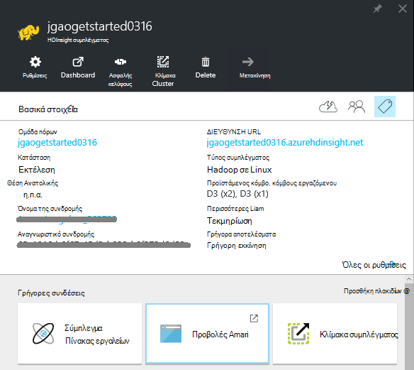
    
    - Για να προσαρμόσετε το μενού, κάντε δεξί κλικ σε οποιοδήποτε σημείο στο μενού και, στη συνέχεια, κάντε κλικ στην επιλογή **Προσαρμογή**.
    - **Ρυθμίσεις** και **Όλες τις ρυθμίσεις**: Εμφανίζει το blade **Ρυθμίσεις** για το σύμπλεγμα, το οποίο σας επιτρέπει να αποκτήσετε πρόσβαση σε αναλυτικές πληροφορίες για το σύμπλεγμα.
    - **Πίνακας εργαλείων**, **Σύμπλεγμα πίνακα εργαλείων** και **τη διεύθυνση URL: αυτές είναι όλα τρόπους για να αποκτήσετε πρόσβαση σε πίνακα εργαλείων του συμπλέγματος, δηλαδή Ambari Web για βάσει Linux συμπλεγμάτων. - **Ασφαλούς κελύφους **: Εμφανίζει τις οδηγίες για να συνδεθείτε με το σύμπλεγμα χρησιμοποιώντας σύνδεση ασφαλούς κελύφους (SSH).
    - **Σύμπλεγμα κλίμακα**: σας επιτρέπει να αλλάξετε τον αριθμό των κόμβους εργαζόμενου για αυτό το σύμπλεγμα.
    - **Διαγραφή**: Διαγράφει το σύμπλεγμα.
    - **Γρήγορη Έναρξη ()**: Εμφανίζει τις πληροφορίες που θα σας βοηθήσει να ξεκινήσετε να χρησιμοποιείτε HDInsight.
    - **Οι χρήστες ()**: σάς επιτρέπει να ορίσετε δικαιώματα για τη _Διαχείριση της πύλης_ αυτού του συμπλέγματος για άλλους χρήστες στη συνδρομή σας στο Azure.
    
        > [AZURE.IMPORTANT] Αυτό _μόνο_ επηρεάζει πρόσβασης και δικαιωμάτων για αυτό το σύμπλεγμα στην πύλη του Azure και δεν έχει καμία επίδραση στην ποιος μπορεί να συνδεθείτε ή να υποβάλλουν εργασίες στο σύμπλεγμα HDInsight.
    - **Ετικέτες ()**: οι ετικέτες σάς επιτρέπει να ορίσετε ζεύγη κλειδιού/τιμής για να ορίσετε μια προσαρμοσμένη ταξινόμηση με τις υπηρεσίες cloud. Για παράδειγμα, που μπορεί να δημιουργήσετε ένα κλειδί με το όνομα __έργου__και, στη συνέχεια, χρησιμοποιήστε μια τιμή για όλες τις υπηρεσίες που σχετίζονται με ένα συγκεκριμένο έργο.
    - **Προβολές Ambari**: συνδέσεις Ambari Web.
    
    > [AZURE.IMPORTANT] Για να διαχειριστείτε τις υπηρεσίες που παρέχονται από το HDInsight σύμπλεγμα, πρέπει να χρησιμοποιήσετε Ambari Web ή το REST API Ambari. Για περισσότερες πληροφορίες σχετικά με τη χρήση Ambari, ανατρέξτε στο θέμα [Διαχείριση HDInsight συμπλεγμάτων χρησιμοποιώντας Ambari](hdinsight-hadoop-manage-ambari.md).

    **Χρήση**:
    
    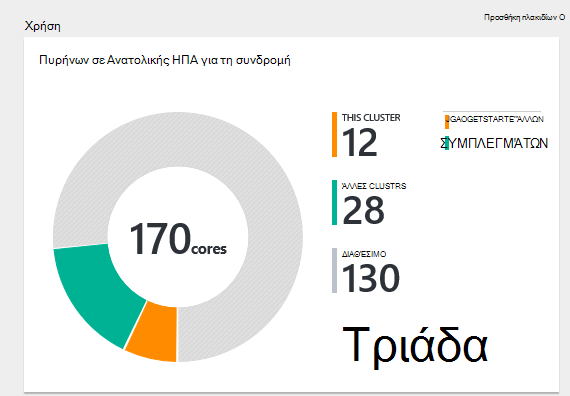
    
5. Κάντε κλικ στην επιλογή **Ρυθμίσεις**.

    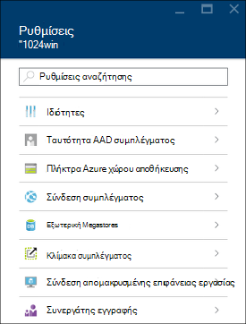

    - **Ιδιότητες**: προβάλετε τις ιδιότητες του συμπλέγματος.
    - **Σύμπλεγμα AAD ταυτότητας**: 
    - **Πλήκτρα αποθήκευσης Azure**: προβολή του προεπιλεγμένου λογαριασμού χώρου αποθήκευσης και το κλειδί. Ο λογαριασμός χώρου αποθήκευσης είναι ρύθμισης παραμέτρων κατά τη διαδικασία δημιουργίας σύμπλεγμα.
    - **Σύμπλεγμα Login**: αλλαγή σύμπλεγμα HTTP όνομα χρήστη και τον κωδικό πρόσβασης.
    - **Εξωτερική Metastores**: προβολή την ομάδα και Oozie metastores. Το metastores μπορούν να ρυθμιστούν μόνο κατά τη διαδικασία δημιουργίας σύμπλεγμα.
    - **Σύμπλεγμα κλίμακα**: αύξηση και μείωση του αριθμού των κόμβοι εργαζόμενου συμπλέγματος.
    - **Σύνδεση απομακρυσμένης επιφάνειας εργασίας**: Ενεργοποίηση και απενεργοποίηση πρόσβασης απομακρυσμένης επιφάνειας εργασίας (RDP) και ρύθμιση παραμέτρων το όνομα χρήστη RDP.  Το όνομα χρήστη RDP πρέπει να είναι διαφορετικό από το όνομα χρήστη HTTP.
    - **Συνεργάτης εγγραφής**:
    
    > [AZURE.NOTE] Αυτή είναι μια γενική λίστα διαθέσιμες ρυθμίσεις; δεν είναι όλα αυτά θα εμφανίζεται για όλους τους τύπους σύμπλεγμα.

6. Κάντε κλικ στην επιλογή **Ιδιότητες**:

    Το "Ιδιότητες" παραθέτει τα εξής:
    
    - **Όνομα κεντρικού υπολογιστή**: όνομα συμπλέγματος.
    - **Διεύθυνση URL σύμπλεγμα**.
    - **Κατάσταση**: συμπεριλάβετε ματαιώθηκε, απαντηθεί, ClusterStorageProvisioned, AzureVMConfiguration, HDInsightConfiguration, λειτουργικές, εκτελείται, σφάλμα, τη διαγραφή, διαγραφή, λήξη χρόνου ορίου, DeleteQueued, DeleteTimedout, DeleteError, PatchQueued, CertRolloverQueued, ResizeQueued, ClusterCustomization
    - **Περιοχή**: Azure θέση. Για μια λίστα με τις υποστηριζόμενες Azure θέσεις, ανατρέξτε στο θέμα **περιοχή** αναπτυσσόμενο πλαίσιο λίστας σε [τιμές HDInsight](https://azure.microsoft.com/pricing/details/hdinsight/).
    - **Δημιουργήσετε δεδομένα**.
    - **Λειτουργικό σύστημα**: είτε **Windows** ή **Linux**.
    - **Τύπος**: Hadoop, HBase, καταιγίδας, αυξήσετε. 
    - **Έκδοση**. Ανατρέξτε στην ενότητα [HDInsight εκδόσεις](hdinsight-component-versioning.md)
    - **Συνδρομή**: όνομα της συνδρομής.
    - **Αναγνωριστικό συνδρομής**.
    - **Πρωτεύον αρχείο προέλευσης δεδομένων**. Ο λογαριασμός χώρο αποθήκευσης αντικειμένων Blob του Azure που χρησιμοποιείται ως το προεπιλεγμένο σύστημα αρχείων Hadoop.
    - **Κόμβοι εργαζόμενου τις τιμές σε επίπεδο**.
    - **Κεφαλή κόμβο τιμολόγησης επίπεδο**.

##Διαγραφή συμπλεγμάτων

Διαγραφή ένα σύμπλεγμα δεν θα διαγράψει τον προεπιλεγμένο λογαριασμό χώρου αποθήκευσης ή όλους τους λογαριασμούς συνδεδεμένων χώρου αποθήκευσης. Μπορείτε να δημιουργήσετε ξανά το σύμπλεγμα, χρησιμοποιώντας το ίδιο λογαριασμούς χώρου αποθήκευσης και το ίδιο metastores.

1. Είσοδος στην [πύλη][azure-portal].
2. Κάντε κλικ στην επιλογή **Αναζήτηση όλων** από το αριστερό μενού, κάντε κλικ στην επιλογή **Συμπλεγμάτων HDInsight**, κάντε κλικ στο όνομα του συμπλέγματος.
3. Κάντε κλικ στην επιλογή **Διαγραφή** από το επάνω μενού και, στη συνέχεια, ακολουθήστε τις οδηγίες.

Δείτε επίσης [Παύση/Τερματισμός συμπλεγμάτων](#pauseshut-down-clusters).

##Κλίμακα συμπλεγμάτων
Το σύμπλεγμα κλίμακας δυνατότητα σάς επιτρέπει να αλλάξετε τον αριθμό των κόμβους εργαζόμενου που χρησιμοποιούνται από ένα σύμπλεγμα που εκτελείται στο Azure HDInsight χωρίς να χρειάζεται να δημιουργήσετε ξανά το σύμπλεγμα.

>[AZURE.NOTE] Μόνο συμπλεγμάτων με HDInsight έκδοση 3.1.3 ή υψηλότερη υποστηρίζονται. Εάν είστε βέβαιοι για την έκδοση του το σύμπλεγμά σας, μπορείτε να ελέγξετε τη σελίδα ιδιοτήτων.  Ανατρέξτε στο θέμα [λίστα και εμφάνιση συμπλεγμάτων](#list-and-show-clusters).

Την επίδραση των αλλαγή του αριθμού των δεδομένων κόμβους για κάθε τύπο σύμπλεγμα που υποστηρίζονται από το HDInsight:

- Hadoop

    Απρόσκοπτη, μπορείτε να αυξήσετε τον αριθμό των κόμβους εργαζόμενου σε ένα σύμπλεγμα Hadoop που εκτελείται χωρίς να επηρεάζονται τυχόν εργασίες σε εκκρεμότητα ή δεν εκτελείται. Νέες εργασίες μπορούν να υποβληθούν επίσης ενώ η λειτουργία βρίσκεται σε εξέλιξη. Αποτυχίες σε μια λειτουργία κλίμακας αντιμετωπίζονται ομαλά, έτσι ώστε το σύμπλεγμα πάντα θα παραμείνει σε μια λειτουργική κατάσταση.

    Όταν ένα σύμπλεγμα Hadoop γίνεται κλιμάκωση προς τα κάτω, μειώνοντας τον αριθμό των δεδομένων κόμβους, ορισμένες από τις υπηρεσίες του συμπλέγματος επανεκκίνηση του. Αυτό θα κάνει όλα εκτελείται και εκκρεμείς εργασίες αποτυχία κατά την ολοκλήρωση της λειτουργίας κλίμακας. Ωστόσο, μπορείτε να, υποβάλετε ξανά τις εργασίες μόλις ολοκληρωθεί η λειτουργία.

- HBase

    Απρόσκοπτη, μπορείτε να προσθέσετε ή να καταργήσετε κόμβοι για το σύμπλεγμα HBase ενώ εκτελείται. Οι τοπικοί διακομιστές είναι εξισορρόπηση αυτόματα μετά από μερικά λεπτά από την ολοκλήρωση της λειτουργίας κλίμακας. Ωστόσο, μπορείτε να εξισορροπήσετε το οι τοπικοί διακομιστές επίσης με μη αυτόματο τρόπο, σύνδεση με το headnode συμπλέγματος και εκτελεί τις παρακάτω εντολές από ένα παράθυρο γραμμής εντολών:

        >pushd %HBASE_HOME%\bin
        >hbase shell
        >balancer

    Για περισσότερες πληροφορίες σχετικά με το κέλυφος HBase, ανατρέξτε στο θέμα]
- Καταιγίδας

    Απρόσκοπτη, μπορείτε να προσθέσετε ή να καταργήσετε κόμβους δεδομένων για το σύμπλεγμά σας καταιγίδας ενώ εκτελείται. Αλλά μετά την επιτυχή ολοκλήρωση της λειτουργίας κλίμακας, θα χρειαστεί να νέα εξισορρόπηση της τοπολογίας.

    Εξισορρόπηση μπορεί να πραγματοποιηθεί με δύο τρόπους:

    * Καταιγίδας web περιβάλλοντος εργασίας Χρήστη
    * Εργαλείο περιβάλλον γραμμής εντολών (CLI)

    Ανατρέξτε στην [τεκμηρίωση καταιγίδας Apache](http://storm.apache.org/documentation/Understanding-the-parallelism-of-a-Storm-topology.html) για περισσότερες λεπτομέρειες.

    Το web καταιγίδας περιβάλλοντος εργασίας Χρήστη είναι διαθέσιμη στο σύμπλεγμα HDInsight:

    

    Ακολουθεί ένα παράδειγμα πώς μπορείτε να χρησιμοποιήσετε την εντολή CLI για νέα εξισορρόπηση της τοπολογίας καταιγίδας:

        ## Reconfigure the topology "mytopology" to use 5 worker processes,
        ## the spout "blue-spout" to use 3 executors, and
        ## the bolt "yellow-bolt" to use 10 executors

        $ storm rebalance mytopology -n 5 -e blue-spout=3 -e yellow-bolt=10

**Για να περιορίσετε το μέγεθος των συμπλεγμάτων**

1. Είσοδος στην [πύλη][azure-portal].
2. Κάντε κλικ στην επιλογή **Αναζήτηση όλων** από το αριστερό μενού, κάντε κλικ στην επιλογή **Συμπλεγμάτων HDInsight**, κάντε κλικ στο όνομα του συμπλέγματος.
3. Κάντε κλικ στην επιλογή " **Ρυθμίσεις** " από το επάνω μενού και, στη συνέχεια, κάντε κλικ στην επιλογή **Κλίμακας σύμπλεγμα**.
4. Εισαγάγετε **τους κόμβους αριθμό της εργασίας**. Το όριο του αριθμού των κόμβο συμπλέγματος ποικίλλει μεταξύ Azure συνδρομές. Μπορείτε να επικοινωνήσετε με υποστήριξη χρεώσεων για να αυξήσετε το όριο.  Οι πληροφορίες κόστους θα αντανακλούν τις αλλαγές που κάνατε στον αριθμό των κόμβους.

    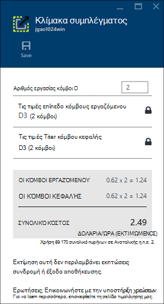

##Παύση/Τερματισμός συμπλεγμάτων

Οι περισσότερες εργασίες Hadoop είναι εκτελέσατε μαζικές εργασίες που είναι διαθέσιμες μόνο μερικές φορές. Για περισσότερες συμπλεγμάτων Hadoop, υπάρχουν μεγάλα χρονικά διαστήματα που δεν χρησιμοποιείται το σύμπλεγμα για επεξεργασία. Με το HDInsight, τα δεδομένα σας αποθηκεύονται στο χώρο αποθήκευσης Azure, ώστε να μπορείτε να διαγράψετε ένα σύμπλεγμα όταν δεν είναι σε χρήση.
Επίσης, που θα χρεωθείτε για ένα σύμπλεγμα HDInsight, ακόμα και όταν δεν είναι σε χρήση. Επειδή οι χρεώσεις για το σύμπλεγμα είναι πολλές φορές περισσότερες από τις χρεώσεις για χώρο αποθήκευσης, έχει οικονομικών νόημα για να διαγράψετε συμπλεγμάτων όταν δεν είναι σε χρήση.

Υπάρχουν πολλοί τρόποι που μπορείτε να προγραμματίσετε τη διαδικασία:

- Εργοστασιακές Azure δεδομένων χρήστη. Ανατρέξτε στο θέμα [Azure HDInsight συνδεδεμένων υπηρεσιών](../data-factory/data-factory-compute-linked-services.md) και [Μετασχηματισμός και να αναλύσετε με εργοστασίου δεδομένων Azure](../data-factory/data-factory-data-transformation-activities.md) για στη ζήτηση και αυτο-καθορισμένο HDInsight συνδεδεμένες υπηρεσίες.
- Χρήση του Azure PowerShell.  Ανατρέξτε στο θέμα [ανάλυση με δεδομένα πτήσεων καθυστέρηση](hdinsight-analyze-flight-delay-data.md).
- Χρησιμοποιήστε το Azure CLI. Ανατρέξτε στο θέμα [Διαχείριση HDInsight συμπλεγμάτων χρησιμοποιώντας Azure CLI](hdinsight-administer-use-command-line.md).
- Χρησιμοποιήστε HDInsight .NET SDK. Ανατρέξτε στο θέμα [Υποβολή Hadoop εργασίες](hdinsight-submit-hadoop-jobs-programmatically.md).

Για τις πληροφορίες τιμολόγησης, ανατρέξτε στο θέμα [HDInsight τις πληροφορίες τιμολόγησης](https://azure.microsoft.com/pricing/details/hdinsight/). Για να διαγράψετε ένα σύμπλεγμα από την πύλη, ανατρέξτε στο θέμα [Διαγραφή συμπλεγμάτων](#delete-clusters)

##Αλλαγή ονόματος χρήστη συμπλέγματος

Ένα σύμπλεγμα HDInsight μπορεί να έχει δύο λογαριασμούς χρηστών. Ο λογαριασμός χρήστη σύμπλεγμα HDInsight δημιουργείται κατά τη διαδικασία δημιουργίας. Μπορείτε επίσης να δημιουργήσετε ένα λογαριασμό χρήστη RDP για να αποκτήσετε πρόσβαση στο σύμπλεγμα μέσω RDP. Ανατρέξτε στο θέμα [Ενεργοποίηση απομακρυσμένης επιφάνειας εργασίας](#connect-to-hdinsight-clusters-by-using-rdp).

**Για να αλλάξετε το όνομα χρήστη σύμπλεγμα HDInsight και τον κωδικό πρόσβασης**

1. Είσοδος στην [πύλη][azure-portal].
2. Κάντε κλικ στην επιλογή **Αναζήτηση όλων** από το αριστερό μενού, κάντε κλικ στην επιλογή **Συμπλεγμάτων HDInsight**, κάντε κλικ στο όνομα του συμπλέγματος.
3. Κάντε κλικ στην επιλογή " **Ρυθμίσεις** " από το επάνω μενού και, στη συνέχεια, κάντε κλικ στην επιλογή **Login σύμπλεγμα**.
4. Εάν έχει ενεργοποιηθεί η **σύνδεση σύμπλεγμα** , πρέπει να κάντε κλικ στην επιλογή **Απενεργοποίηση**και, στη συνέχεια, κάντε κλικ στην επιλογή **Ενεργοποίηση** πριν να αλλάξετε το όνομα χρήστη και κωδικό πρόσβασης...
4. Αλλάξτε το **Όνομα σύνδεσης σύμπλεγμα** ή/και το **Σύμπλεγμα κωδικό πρόσβασης**και, στη συνέχεια, κάντε κλικ στην επιλογή **Αποθήκευση**.

    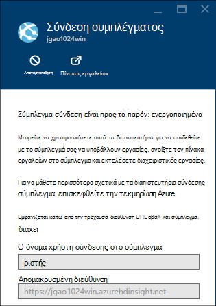

##Εκχώρηση/ανάκληση πρόσβασης

HDInsight συμπλεγμάτων έχουν τις ακόλουθες υπηρεσίες web HTTP (όλες αυτές οι υπηρεσίες έχουν RESTful τελικά σημεία):

- ODBC
- JDBC
- Ambari
- Oozie
- Templeton

Από προεπιλογή, οι υπηρεσίες αυτές έχουν εκχωρηθεί για πρόσβαση. Μπορείτε να revoke/εκχώρηση πρόσβαση από την πύλη του Azure.

>[AZURE.NOTE] Με την εκχώρηση/ανάκληση της access, θα μπορείτε να επαναφέρετε το σύμπλεγμα όνομα χρήστη και κωδικό πρόσβασης.

**Εκχώρηση/ανάκληση HTTP web υπηρεσίες access**

1. Είσοδος στην [πύλη][azure-portal].
2. Κάντε κλικ στην επιλογή **Αναζήτηση όλων** από το αριστερό μενού, κάντε κλικ στην επιλογή **Συμπλεγμάτων HDInsight**, κάντε κλικ στο όνομα του συμπλέγματος.
3. Κάντε κλικ στην επιλογή " **Ρυθμίσεις** " από το επάνω μενού και, στη συνέχεια, κάντε κλικ στην επιλογή **Login σύμπλεγμα**.
4. Εάν έχει ενεργοποιηθεί η **σύνδεση σύμπλεγμα** , πρέπει να κάντε κλικ στην επιλογή **Απενεργοποίηση**και, στη συνέχεια, κάντε κλικ στην επιλογή **Ενεργοποίηση** πριν να αλλάξετε το όνομα χρήστη και κωδικό πρόσβασης...
6. Για το **Όνομα χρήστη σύνδεσης σύμπλεγμα** και **Κωδικό πρόσβασης στο σύμπλεγμα**, πληκτρολογήστε το νέο όνομα χρήστη και κωδικό πρόσβασης (αντίστοιχα) για το σύμπλεγμα.
7. Κάντε κλικ στην επιλογή **ΑΠΟΘΉΚΕΥΣΗ**.

    

##Βρείτε τον προεπιλεγμένο λογαριασμό χώρου αποθήκευσης

Κάθε σύμπλεγμα HDInsight διαθέτει έναν προεπιλεγμένο λογαριασμό χώρου αποθήκευσης. Τον προεπιλεγμένο λογαριασμό χώρου αποθήκευσης και τα πλήκτρα για ένα σύμπλεγμα εμφανίζεται στην περιοχή **Ρυθμίσεις**/**Ιδιότητες**/**Azure πλήκτρα χώρου αποθήκευσης**. Ανατρέξτε στο θέμα [λίστα και εμφάνιση συμπλεγμάτων](#list-and-show-clusters).

    
##Βρείτε την ομάδα πόρων 

Στη λειτουργία διαχείρισης πόρων Azure, κάθε σύμπλεγμα HDInsight δημιουργείται με μια ομάδα Azure πόρων. Η ομάδα Azure πόρου στον οποίο ανήκει ένα σύμπλεγμα εμφανίζεται στο:

- Η λίστα σύμπλεγμα έχει μια στήλη **Ομάδα πόρων** .
- Σύμπλεγμα **βασικές** πλακίδιο.  

Ανατρέξτε στο θέμα [λίστα και εμφάνιση συμπλεγμάτων](#list-and-show-clusters).
   
##Άνοιγμα κονσόλας HDInsight ερωτήματος

Κονσόλα HDInsight ερωτήματος περιλαμβάνει τις εξής δυνατότητες:

- **Γρήγορα αποτελέσματα συλλογή**: για να χρησιμοποιήσετε τη συλλογή, ανατρέξτε στο θέμα [Μάθετε Hadoop, χρησιμοποιώντας τη συλλογή Azure HDInsight γρήγορα αποτελέσματα](hdinsight-learn-hadoop-use-sample-gallery.md).
- **Επεξεργασία ομάδας**: A Γραφικών διασύνδεση web για την υποβολή Hive εργασίες.  Ανατρέξτε στο θέμα [Εκτέλεση Hive ερωτήματα με την κονσόλα του ερωτήματος](hdinsight-hadoop-use-hive-query-console.md).

    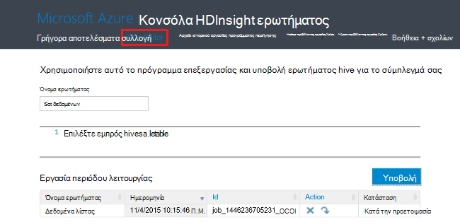

- **Ιστορικό εργασίας**: οθόνη Hadoop εργασίες.  

    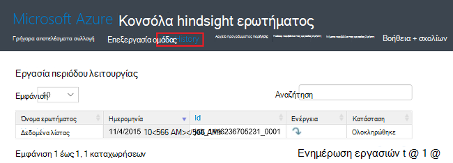

    Κάντε κλικ στο **Όνομα του ερωτήματος** για να εμφανίσετε τις λεπτομέρειες της Ιδιότητες εργασίας, **Εργασία ερωτήματος**, συμπεριλαμβανομένων και ** εξόδου εργασία. Μπορείτε επίσης να κάνετε λήψη του ερωτήματος και το αποτέλεσμα για να σας σταθμούς εργασίας.

- **Αρχείο προγράμματος περιήγησης**: Αναζητήστε τον προεπιλεγμένο λογαριασμό χώρου αποθήκευσης και τους λογαριασμούς συνδεδεμένων χώρου αποθήκευσης.

    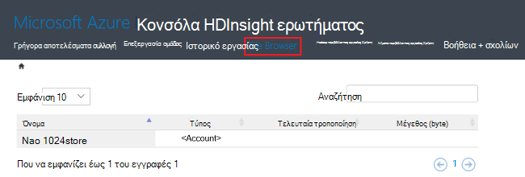

    Στο στιγμιότυπο οθόνης, το **<Account>** τύπος υποδεικνύει το στοιχείο είναι ένας λογαριασμός Azure χώρου αποθήκευσης.  Κάντε κλικ στο όνομα του λογαριασμού για να αναζητήσετε τα αρχεία.
    
- **Περιβάλλον εργασίας Χρήστη Hadoop**.

    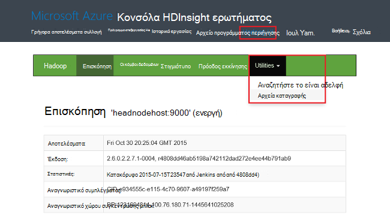
    
    Από το **Hadoop περιβάλλοντος εργασίας Χρήστη*, μπορείτε να αναζήτηση των αρχείων και ελέγξτε τα αρχεία καταγραφής. 

- **Νήματα περιβάλλοντος εργασίας Χρήστη**.

    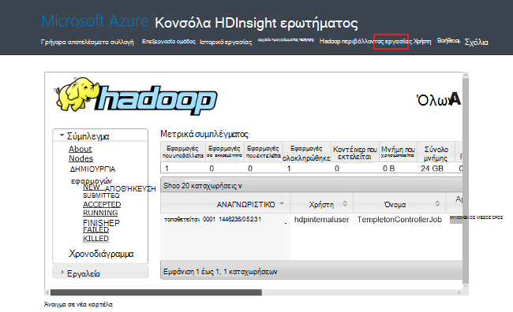

##Εκτέλεση ερωτημάτων ομάδας

Να εκτελέσατε εργασίες ομάδας από την πύλη, κάντε κλικ στην επιλογή **Hive επεξεργασίας** στην κονσόλα HDInsight ερωτήματος. Ανατρέξτε στο θέμα [Άνοιγμα ερωτήματος HDInsight κονσόλας](#open-hdinsight-query-console).

##Παρακολούθηση εργασιών

Για να παρακολουθείτε τις εργασίες από την πύλη, κάντε κλικ στην επιλογή **Ιστορικό εργασίας** στην κονσόλα HDInsight ερωτήματος. Ανατρέξτε στο θέμα [Άνοιγμα ερωτήματος HDInsight κονσόλας](#open-hdinsight-query-console).

##Αναζήτηση των αρχείων

Για να αναζητήσετε αρχεία που είναι αποθηκευμένα στο τον προεπιλεγμένο λογαριασμό χώρου αποθήκευσης και τους λογαριασμούς συνδεδεμένων χώρου αποθήκευσης, κάντε κλικ στην επιλογή **Αρχείο προγράμματος περιήγησης** στην κονσόλα HDInsight ερωτήματος. Ανατρέξτε στο θέμα [Άνοιγμα ερωτήματος HDInsight κονσόλας](#open-hdinsight-query-console).

Μπορείτε επίσης να χρησιμοποιήσετε το βοηθητικό πρόγραμμα **Περιήγηση στο σύστημα αρχείων** από το **Περιβάλλον εργασίας Χρήστη Hadoop** στην κονσόλα HDInsight.  Ανατρέξτε στο θέμα [Άνοιγμα ερωτήματος HDInsight κονσόλας](#open-hdinsight-query-console).

##Παρακολούθηση χρήσης συμπλέγματος

Στην ενότητα __Χρήση__ από το HDInsight blade σύμπλεγμα εμφανίζει πληροφορίες σχετικά με τον αριθμό των πυρήνων που είναι διαθέσιμες για τη συνδρομή σας για χρήση με το HDInsight, καθώς και τον αριθμό των πυρήνων που έχουν εκχωρηθεί σε αυτό το σύμπλεγμα και ο τρόπος εκχώρησης για τους κόμβους μέσα σε αυτό το σύμπλεγμα. Ανατρέξτε στο θέμα [λίστα και εμφάνιση συμπλεγμάτων](#list-and-show-clusters).

> [AZURE.IMPORTANT] Για να παρακολουθείτε τις υπηρεσίες που παρέχονται από το HDInsight σύμπλεγμα, πρέπει να χρησιμοποιήσετε Ambari Web ή το REST API Ambari. Για περισσότερες πληροφορίες σχετικά με τη χρήση Ambari, ανατρέξτε στο θέμα [Διαχείριση HDInsight συμπλεγμάτων χρησιμοποιώντας Ambari](hdinsight-hadoop-manage-ambari.md)

##Ανοίξτε το περιβάλλον εργασίας Χρήστη Hadoop

Για να παρακολουθείτε το σύμπλεγμα, μεταβείτε στο σύστημα αρχείων και ελέγξτε τα αρχεία καταγραφής, κάντε κλικ στην επιλογή **Hadoop περιβάλλοντος εργασίας Χρήστη** στην κονσόλα HDInsight ερωτήματος. Ανατρέξτε στο θέμα [Άνοιγμα ερωτήματος HDInsight κονσόλας](#open-hdinsight-query-console).

##Άνοιγμα νήματα περιβάλλοντος εργασίας Χρήστη

Για να χρησιμοποιήσετε νήματα περιβάλλον εργασίας χρήστη, κάντε κλικ στην επιλογή **Νήματα περιβάλλοντος εργασίας Χρήστη** στην κονσόλα HDInsight ερωτήματος. Ανατρέξτε στο θέμα [Άνοιγμα ερωτήματος HDInsight κονσόλας](#open-hdinsight-query-console).

##Σύνδεση με χρήση RDP συμπλεγμάτων

Τα διαπιστευτήρια για το σύμπλεγμα που παρείχατε κατά τη δημιουργία της δώσετε πρόσβαση στις υπηρεσίες στο σύμπλεγμα, αλλά όχι να το σύμπλεγμα ίδια απομακρυσμένης επιφάνειας εργασίας. Μπορείτε να ενεργοποιήσετε την πρόσβαση απομακρυσμένης επιφάνειας εργασίας κατά την προμήθεια ένα σύμπλεγμα ή μετά την παροχή της υπηρεσίας ένα σύμπλεγμα. Για τις οδηγίες σχετικά με την ενεργοποίηση της απομακρυσμένης επιφάνειας εργασίας κατά τη δημιουργία, ανατρέξτε στο θέμα [Δημιουργία HDInsight σύμπλεγμα](hdinsight-provision-clusters.md).

**Για να ενεργοποιήσετε την απομακρυσμένης επιφάνειας εργασίας**

1. Είσοδος στην [πύλη][azure-portal].
2. Κάντε κλικ στην επιλογή **Αναζήτηση όλων** από το αριστερό μενού, κάντε κλικ στην επιλογή **Συμπλεγμάτων HDInsight**, κάντε κλικ στο όνομα του συμπλέγματος.
3. Κάντε κλικ στην επιλογή " **Ρυθμίσεις** " από το επάνω μενού και, στη συνέχεια, κάντε κλικ στην επιλογή **Σύνδεση απομακρυσμένης επιφάνειας εργασίας**.
4. Πληκτρολογήστε **Λήγει σε**, **Απομακρυσμένης επιφάνειας εργασίας σας όνομα χρήστη** και **Τον κωδικό πρόσβασης απομακρυσμένης επιφάνειας εργασίας**και, στη συνέχεια, κάντε κλικ στην επιλογή **Ενεργοποίηση**.

    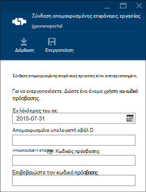

    Οι προεπιλεγμένες τιμές για λήγει σε είναι μια εβδομάδα.
> [AZURE.NOTE] Μπορείτε επίσης να χρησιμοποιήσετε το HDInsight .NET SDK για ενεργοποίηση της απομακρυσμένης επιφάνειας εργασίας σε ένα σύμπλεγμα. Χρησιμοποιήστε τη μέθοδο **EnableRdp** στο αντικείμενο HDInsight προγράμματος-πελάτη με τον ακόλουθο τρόπο: **προγράμματος-πελάτη. EnableRdp (clustername, θέση, "rdpuser", "rdppassword", DateTime.Now.AddDays(6))**. Ομοίως, για να απενεργοποιήσετε τη σύνδεση απομακρυσμένης επιφάνειας εργασίας στο σύμπλεγμα, μπορείτε να χρησιμοποιήσετε **προγράμματος-πελάτη. DisableRdp (clustername, θέση)**. Για περισσότερες πληροφορίες σχετικά με αυτές τις μεθόδους, ανατρέξτε στο θέμα [Αναφορά SDK .NET HDInsight](http://go.microsoft.com/fwlink/?LinkId=529017). Αυτό εφαρμόζεται μόνο για το HDInsight συμπλεγμάτων εκτελούνται στα Windows.

**Για να συνδεθείτε σε ένα σύμπλεγμα, χρησιμοποιώντας το RDP**

1. Είσοδος στην [πύλη][azure-portal].
2. Κάντε κλικ στην επιλογή **Αναζήτηση όλων** από το αριστερό μενού, κάντε κλικ στην επιλογή **Συμπλεγμάτων HDInsight**, κάντε κλικ στο όνομα του συμπλέγματος.
3. Κάντε κλικ στην επιλογή " **Ρυθμίσεις** " από το επάνω μενού και, στη συνέχεια, κάντε κλικ στην επιλογή **Σύνδεση απομακρυσμένης επιφάνειας εργασίας**.
4. Κάντε κλικ στην επιλογή **σύνδεση** και ακολουθήστε τις οδηγίες. Εάν η σύνδεση είναι απενεργοποιημένη, πρέπει να ενεργοποιήσετε το πρώτα. Βεβαιωθείτε ότι χρησιμοποιείτε το όνομα χρήστη απομακρυσμένης επιφάνειας εργασίας χρήστη και κωδικό πρόσβασης.  Δεν μπορείτε να χρησιμοποιήσετε τα διαπιστευτήρια του χρήστη σύμπλεγμα.

##Ανοίξτε τη γραμμή εντολών Hadoop

Για να συνδεθείτε με το σύμπλεγμα με τη χρήση απομακρυσμένης επιφάνειας εργασίας και χρησιμοποιήστε τη γραμμή εντολών Hadoop, πρέπει να πρώτα έχετε ενεργοποιήσει την πρόσβαση απομακρυσμένης επιφάνειας εργασίας στο σύμπλεγμα όπως περιγράφεται στην προηγούμενη ενότητα.

**Για να ανοίξετε μια γραμμή εντολών Hadoop**

1. Συνδεθείτε με το σύμπλεγμα χρησιμοποιώντας απομακρυσμένης επιφάνειας εργασίας.
8. Από την επιφάνεια εργασίας, κάντε διπλό κλικ **Hadoop γραμμή εντολών**.

    ![HDI. HadoopCommandLine][image-hadoopcommandline]

    Για περισσότερες πληροφορίες σχετικά με εντολές Hadoop, ανατρέξτε στο θέμα [αναφορά εντολές Hadoop](http://hadoop.apache.org/docs/current/hadoop-project-dist/hadoop-common/CommandsManual.html).

Στο προηγούμενο στιγμιότυπο οθόνης, το όνομα του φακέλου έχει τον αριθμό έκδοσης Hadoop ενσωματωμένο. Ο αριθμός έκδοσης μπορεί να αλλάξει με βάση την έκδοση του εγκατεστημένα στο σύμπλεγμα τα στοιχεία Hadoop. Μπορείτε να χρησιμοποιήσετε μεταβλητές περιβάλλοντος Hadoop, για να ανατρέξετε σε αυτούς τους φακέλους. Για παράδειγμα:

    cd %hadoop_home%
    cd %hive_home%
    cd %hbase_home%
    cd %pig_home%
    cd %sqoop_home%
    cd %hcatalog_home%
    
##Επόμενα βήματα
Σε αυτό το άρθρο μάθατε πώς μπορείτε να δημιουργήσετε ένα σύμπλεγμα HDInsight, χρησιμοποιώντας την πύλη και τον τρόπο για να ανοίξετε το εργαλείο γραμμής εντολών Hadoop. Για περισσότερες πληροφορίες, ανατρέξτε στα ακόλουθα άρθρα:

* [Διαχείριση HDInsight χρησιμοποιώντας το Azure PowerShell](hdinsight-administer-use-powershell.md)
* [Διαχείριση χρησιμοποιώντας Azure CLI HDInsight](hdinsight-administer-use-command-line.md)
* [Δημιουργία HDInsight συμπλεγμάτων](hdinsight-provision-clusters.md)
* [Υποβολή εργασιών Hadoop μέσω προγραμματισμού](hdinsight-submit-hadoop-jobs-programmatically.md)
* [Γρήγορα αποτελέσματα με το Azure HDInsight](hdinsight-hadoop-linux-tutorial-get-started.md)
* [Ποια έκδοση του Hadoop περιέχει Azure HDInsight;](hdinsight-component-versioning.md)

[azure-portal]: https://portal.azure.com
[image-hadoopcommandline]: ./media/hdinsight-administer-use-management-portal/hdinsight-hadoop-command-line.png "Γραμμή εντολών Hadoop"
