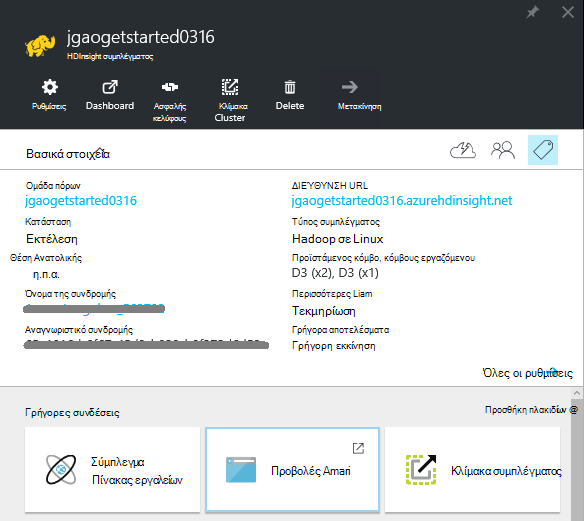
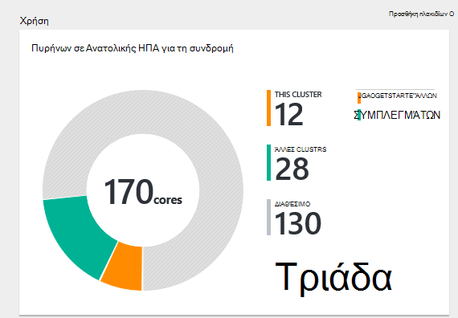
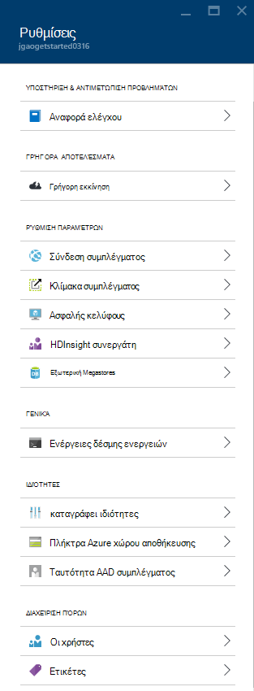
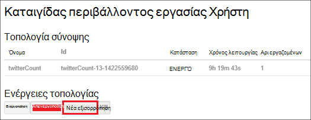
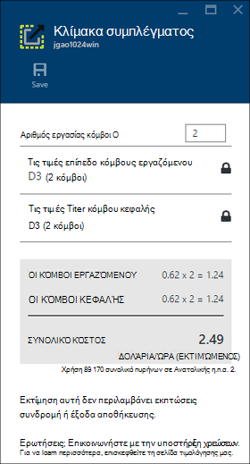
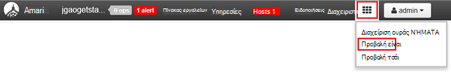

<properties
    pageTitle="Διαχείριση συμπλεγμάτων βάσει Linux Hadoop στο με πύλη Azure HDInsight | Microsoft Azure"
    description="Μάθετε πώς μπορείτε να δημιουργήσετε και να διαχειριστείτε συμπλεγμάτων βάσει Linux HDInsight με την πύλη Azure."
    services="hdinsight"
    documentationCenter=""
    authors="mumian"
    manager="jhubbard"
    editor="cgronlun"
    tags="azure-portal"/>

<tags
    ms.service="hdinsight"
    ms.workload="big-data"
    ms.tgt_pltfrm="na"
    ms.devlang="na"
    ms.topic="article"
    ms.date="08/10/2016"
    ms.author="jgao"/>

#Διαχείριση συμπλεγμάτων Hadoop στο HDInsight, χρησιμοποιώντας την πύλη του Azure

[AZURE.INCLUDE [selector](../../includes/hdinsight-portal-management-selector.md)]

Με την [πύλη του Azure][azure-portal], μπορείτε να διαχειριστείτε συμπλεγμάτων Linux βασίζονται στο Azure HDInsight. Χρησιμοποιήστε στον επιλογέα στηλοθετών για πληροφορίες σχετικά με τη δημιουργία συμπλεγμάτων Hadoop στο HDInsight με άλλα εργαλεία. 

**Προαπαιτούμενα στοιχεία**

Προτού ξεκινήσετε σε αυτό το άρθρο, πρέπει να έχετε τα εξής:

- **Azure μια συνδρομή**. Ανατρέξτε στο θέμα [λήψη Azure δωρεάν δοκιμαστικής έκδοσης](https://azure.microsoft.com/documentation/videos/get-azure-free-trial-for-testing-hadoop-in-hdinsight/).

##Ανοίξτε την πύλη

1. Πραγματοποιήστε είσοδο στο [https://portal.azure.com](https://portal.azure.com).
2. Αφού ανοίξετε την πύλη, μπορείτε να:

    - Κάντε κλικ στην επιλογή **Δημιουργία** από το αριστερό μενού για να δημιουργήσετε ένα νέο σύμπλεγμα:
    
        
    - Κάντε κλικ στην επιλογή **HDInsight συμπλεγμάτων** από το αριστερό μενού για μια λίστα των υπάρχοντα συμπλεγμάτων
    
        

        Εάν **HDInsight** δεν εμφανίζεται στο αριστερό μενού, κάντε κλικ στην επιλογή **Αναζήτηση**και, στη συνέχεια, κάντε κλικ στην επιλογή **Συμπλεγμάτων HDInsight**.

        

##Δημιουργία συμπλεγμάτων

[AZURE.INCLUDE [delete-cluster-warning](../../includes/hdinsight-delete-cluster-warning.md)]

HDInsight λειτουργεί με μια μεγάλη περιοχή Hadoop στοιχείων. Για τη λίστα των στοιχείων που έχουν επαληθευτεί και υποστηρίζονται, δείτε [ποια έκδοση του Hadoop στο Azure HDInsight](hdinsight-component-versioning.md). Για τις πληροφορίες για τη δημιουργία γενικών σύμπλεγμα, ανατρέξτε στο θέμα [Δημιουργία Hadoop συμπλεγμάτων σε HDInsight](hdinsight-hadoop-provision-linux-clusters.md). 

##Λίστα "και" Εμφάνιση συμπλεγμάτων

1. Πραγματοποιήστε είσοδο στο [https://portal.azure.com](https://portal.azure.com).
2. Κάντε κλικ στην επιλογή **HDInsight συμπλεγμάτων** από το αριστερό μενού για μια λίστα των υπάρχοντα συμπλεγμάτων.
3. Κάντε κλικ στο όνομα του συμπλέγματος. Εάν η λίστα σύμπλεγμα είναι μεγάλο, μπορείτε να χρησιμοποιήσετε το φίλτρο στο επάνω μέρος της σελίδας.
4. Κάντε διπλό κλικ σε ένα σύμπλεγμα από τη λίστα για να εμφανίσετε τις λεπτομέρειες.

    **Μενού και βασικά στοιχεία**:

    
    
    - **Ρυθμίσεις** και **Όλες τις ρυθμίσεις**: Εμφανίζει το blade **Ρυθμίσεις** για το σύμπλεγμα, το οποίο σας επιτρέπει να αποκτήσετε πρόσβαση σε αναλυτικές πληροφορίες για το σύμπλεγμα.
    - **Πίνακας εργαλείων**, **Σύμπλεγμα πίνακα εργαλείων** και ** διεύθυνση URL: αυτές είναι όλα τρόπους για να αποκτήσετε πρόσβαση σε πίνακα εργαλείων του συμπλέγματος, δηλαδή Ambari Web για βάσει Linux συμπλεγμάτων.
    - **Κέλυφος ασφαλούς**: Εμφανίζει τις οδηγίες για να συνδεθείτε με το σύμπλεγμα χρησιμοποιώντας σύνδεση ασφαλούς κελύφους (SSH).
    - **Σύμπλεγμα κλίμακα**: σας επιτρέπει να αλλάξετε τον αριθμό των κόμβους εργαζόμενου για αυτό το σύμπλεγμα.
    - **Διαγραφή**: Διαγράφει το σύμπλεγμα.
    - **Γρήγορη Έναρξη ()**: Εμφανίζει τις πληροφορίες που θα σας βοηθήσει να ξεκινήσετε να χρησιμοποιείτε HDInsight.
    - **Οι χρήστες ()**: σάς επιτρέπει να ορίσετε δικαιώματα για τη _Διαχείριση της πύλης_ αυτού του συμπλέγματος για άλλους χρήστες στη συνδρομή σας στο Azure.
    
        > [AZURE.IMPORTANT] Αυτό _μόνο_ επηρεάζει πρόσβασης και δικαιωμάτων για αυτό το σύμπλεγμα στην πύλη του Azure και δεν έχει καμία επίδραση στην ποιος μπορεί να συνδεθείτε ή να υποβάλλουν εργασίες στο σύμπλεγμα HDInsight.
    - **Ετικέτες ()**: οι ετικέτες σάς επιτρέπει να ορίσετε ζεύγη κλειδιού/τιμής για να ορίσετε μια προσαρμοσμένη ταξινόμηση με τις υπηρεσίες cloud. Για παράδειγμα, που μπορεί να δημιουργήσετε ένα κλειδί με το όνομα __έργου__και, στη συνέχεια, χρησιμοποιήστε μια τιμή για όλες τις υπηρεσίες που σχετίζονται με ένα συγκεκριμένο έργο.
    - **Προβολές Ambari**: συνδέσεις Ambari Web.
    
    > [AZURE.IMPORTANT] Για να διαχειριστείτε τις υπηρεσίες που παρέχονται από το HDInsight σύμπλεγμα, πρέπει να χρησιμοποιήσετε Ambari Web ή το REST API Ambari. Για περισσότερες πληροφορίες σχετικά με τη χρήση Ambari, ανατρέξτε στο θέμα [Διαχείριση HDInsight συμπλεγμάτων χρησιμοποιώντας Ambari](hdinsight-hadoop-manage-ambari.md).

    **Χρήση**:
    
    
    
5. Κάντε κλικ στην επιλογή **Ρυθμίσεις**.

    

    - **Αρχεία καταγραφής ελέγχου**:
    - **Γρήγορο ξεκίνημα**: Εμφανίζει τις πληροφορίες που θα σας βοηθήσει να ξεκινήσετε να χρησιμοποιείτε HDInsight.
    - **Σύμπλεγμα κλίμακα**: αύξηση και μείωση του αριθμού των κόμβοι εργαζόμενου συμπλέγματος.
    - **Κέλυφος ασφαλούς**: Εμφανίζει τις οδηγίες για να συνδεθείτε με το σύμπλεγμα χρησιμοποιώντας σύνδεση ασφαλούς κελύφους (SSH).
    - **HDInsight συνεργάτη**: Προσθήκη και κατάργηση τρέχοντος συνεργάτη HDInsight.
    - **Εξωτερική Metastores**: προβολή την ομάδα και Oozie metastores. Το metastores μπορούν να ρυθμιστούν μόνο κατά τη διαδικασία δημιουργίας σύμπλεγμα.
    - **Ενέργειες δέσμης ενεργειών**: εκτέλεση πάρτι δέσμες ενεργειών στο σύμπλεγμα.
    - **Ιδιότητες**: προβάλετε τις ιδιότητες του συμπλέγματος.
    - **Πλήκτρα αποθήκευσης Azure**: προβολή του προεπιλεγμένου λογαριασμού χώρου αποθήκευσης και το κλειδί. Ο λογαριασμός χώρου αποθήκευσης είναι ρύθμισης παραμέτρων κατά τη διαδικασία δημιουργίας σύμπλεγμα.
    - **Σύμπλεγμα AAD ταυτότητας**: 
    - **Οι χρήστες**: σάς επιτρέπει να ορίσετε δικαιώματα για τη _Διαχείριση της πύλης_ αυτού του συμπλέγματος για άλλους χρήστες στη συνδρομή σας στο Azure.
    - **Ετικέτες**: οι ετικέτες σάς επιτρέπει να ορίσετε ζεύγη κλειδιού/τιμής για να ορίσετε μια προσαρμοσμένη ταξινόμηση με τις υπηρεσίες cloud. Για παράδειγμα, που μπορεί να δημιουργήσετε ένα κλειδί με το όνομα __έργου__και, στη συνέχεια, χρησιμοποιήστε μια τιμή για όλες τις υπηρεσίες που σχετίζονται με ένα συγκεκριμένο έργο.
    
    > [AZURE.NOTE] Αυτή είναι μια γενική λίστα διαθέσιμες ρυθμίσεις; δεν είναι όλα αυτά θα εμφανίζεται για όλους τους τύπους σύμπλεγμα.

6. Κάντε κλικ στην επιλογή **Ιδιότητες**:

    Οι ιδιότητες είναι:
    
    - **Όνομα κεντρικού υπολογιστή**: όνομα συμπλέγματος.
    - **Διεύθυνση URL σύμπλεγμα**.
    - **Κατάσταση**: συμπεριλάβετε ματαιώθηκε, απαντηθεί, ClusterStorageProvisioned, AzureVMConfiguration, HDInsightConfiguration, λειτουργικές, εκτελείται, σφάλμα, τη διαγραφή, διαγραφή, λήξη χρόνου ορίου, DeleteQueued, DeleteTimedout, DeleteError, PatchQueued, CertRolloverQueued, ResizeQueued, ClusterCustomization
    - **Περιοχή**: Azure θέση. Για μια λίστα με τις υποστηριζόμενες Azure θέσεις, ανατρέξτε στο θέμα **περιοχή** αναπτυσσόμενο πλαίσιο λίστας σε [τιμές HDInsight](https://azure.microsoft.com/pricing/details/hdinsight/).
    - **Δημιουργήσετε δεδομένα**.
    - **Λειτουργικό σύστημα**: είτε **Windows** ή **Linux**.
    - **Τύπος**: Hadoop, HBase, καταιγίδας, αυξήσετε. 
    - **Έκδοση**. Ανατρέξτε στην ενότητα [HDInsight εκδόσεις](hdinsight-component-versioning.md)
    - **Συνδρομή**: όνομα της συνδρομής.
    - **Αναγνωριστικό συνδρομής**.
    - **Προεπιλεγμένο αρχείο προέλευσης δεδομένων**: το προεπιλεγμένο σύστημα αρχείων συμπλέγματος.
    - **Κόμβοι εργαζόμενου τις τιμές σε επίπεδο**.
    - **Κεφαλή κόμβο τιμολόγησης επίπεδο**.

##Διαγραφή συμπλεγμάτων

Διαγραφή ένα σύμπλεγμα δεν θα διαγράψει τον προεπιλεγμένο λογαριασμό χώρου αποθήκευσης ή όλους τους λογαριασμούς συνδεδεμένων χώρου αποθήκευσης. Μπορείτε να δημιουργήσετε ξανά το σύμπλεγμα, χρησιμοποιώντας το ίδιο λογαριασμούς χώρου αποθήκευσης και το ίδιο metastores. Συνιστάται να χρησιμοποιήσετε ένα νέο κοντέινερ αντικειμένων Blob προεπιλογή όταν δημιουργείτε ξανά το σύμπλεγμα.

1. Είσοδος στην [πύλη][azure-portal].
2. Κάντε κλικ στην επιλογή **Αναζήτηση όλων** από το αριστερό μενού, κάντε κλικ στην επιλογή **Συμπλεγμάτων HDInsight**, κάντε κλικ στο όνομα του συμπλέγματος.
3. Κάντε κλικ στην επιλογή **Διαγραφή** από το επάνω μενού και, στη συνέχεια, ακολουθήστε τις οδηγίες.

Δείτε επίσης [Παύση/Τερματισμός συμπλεγμάτων](#pauseshut-down-clusters).

##Κλίμακα συμπλεγμάτων
Το σύμπλεγμα κλίμακας δυνατότητα σάς επιτρέπει να αλλάξετε τον αριθμό των κόμβους εργαζόμενου που χρησιμοποιούνται από ένα σύμπλεγμα που εκτελείται στο Azure HDInsight χωρίς να χρειάζεται να δημιουργήσετε ξανά το σύμπλεγμα.

>[AZURE.NOTE] Μόνο συμπλεγμάτων με HDInsight έκδοση 3.1.3 ή υψηλότερη υποστηρίζονται. Εάν είστε βέβαιοι για την έκδοση του το σύμπλεγμά σας, μπορείτε να ελέγξετε τη σελίδα ιδιοτήτων.  Ανατρέξτε στο θέμα [λίστα και εμφάνιση συμπλεγμάτων](#list-and-show-clusters).

Την επίδραση των αλλαγή του αριθμού των δεδομένων κόμβους για κάθε τύπο σύμπλεγμα που υποστηρίζονται από το HDInsight:

- Hadoop

    Απρόσκοπτη, μπορείτε να αυξήσετε τον αριθμό των κόμβους εργαζόμενου σε ένα σύμπλεγμα Hadoop που εκτελείται χωρίς να επηρεάζονται τυχόν εργασίες σε εκκρεμότητα ή δεν εκτελείται. Νέες εργασίες μπορούν να υποβληθούν επίσης ενώ η λειτουργία βρίσκεται σε εξέλιξη. Αποτυχίες σε μια λειτουργία κλίμακας αντιμετωπίζονται ομαλά, έτσι ώστε το σύμπλεγμα πάντα θα παραμείνει σε μια λειτουργική κατάσταση.

    Όταν ένα σύμπλεγμα Hadoop γίνεται κλιμάκωση προς τα κάτω, μειώνοντας τον αριθμό των δεδομένων κόμβους, ορισμένες από τις υπηρεσίες του συμπλέγματος επανεκκίνηση του. Αυτό θα κάνει όλα εκτελείται και εκκρεμείς εργασίες αποτυχία κατά την ολοκλήρωση της λειτουργίας κλίμακας. Ωστόσο, μπορείτε να, υποβάλετε ξανά τις εργασίες μόλις ολοκληρωθεί η λειτουργία.

- HBase

    Απρόσκοπτη, μπορείτε να προσθέσετε ή να καταργήσετε κόμβοι για το σύμπλεγμα HBase ενώ εκτελείται. Οι τοπικοί διακομιστές είναι εξισορρόπηση αυτόματα μετά από μερικά λεπτά από την ολοκλήρωση της λειτουργίας κλίμακας. Ωστόσο, μπορείτε να εξισορροπήσετε το οι τοπικοί διακομιστές επίσης με μη αυτόματο τρόπο, σύνδεση με το headnode συμπλέγματος και εκτελεί τις παρακάτω εντολές από ένα παράθυρο γραμμής εντολών:

        >pushd %HBASE_HOME%\bin
        >hbase shell
        >balancer

    Για περισσότερες πληροφορίες σχετικά με το κέλυφος HBase, ανατρέξτε στο θέμα]
- Καταιγίδας

    Απρόσκοπτη, μπορείτε να προσθέσετε ή να καταργήσετε κόμβους δεδομένων για το σύμπλεγμά σας καταιγίδας ενώ εκτελείται. Αλλά μετά την επιτυχή ολοκλήρωση της λειτουργίας κλίμακας, θα χρειαστεί να νέα εξισορρόπηση της τοπολογίας.

    Εξισορρόπηση μπορεί να πραγματοποιηθεί με δύο τρόπους:

    * Καταιγίδας web περιβάλλοντος εργασίας Χρήστη
    * Εργαλείο περιβάλλον γραμμής εντολών (CLI)

    Ανατρέξτε στην [τεκμηρίωση καταιγίδας Apache](http://storm.apache.org/documentation/Understanding-the-parallelism-of-a-Storm-topology.html) για περισσότερες λεπτομέρειες.

    Το web καταιγίδας περιβάλλοντος εργασίας Χρήστη είναι διαθέσιμο στο σύμπλεγμα HDInsight:

    

    Ακολουθεί ένα παράδειγμα πώς μπορείτε να χρησιμοποιήσετε την εντολή CLI για νέα εξισορρόπηση της τοπολογίας καταιγίδας:

        ## Reconfigure the topology "mytopology" to use 5 worker processes,
        ## the spout "blue-spout" to use 3 executors, and
        ## the bolt "yellow-bolt" to use 10 executors

        $ storm rebalance mytopology -n 5 -e blue-spout=3 -e yellow-bolt=10

**Για να περιορίσετε το μέγεθος των συμπλεγμάτων**

1. Είσοδος στην [πύλη][azure-portal].
2. Κάντε κλικ στην επιλογή **Αναζήτηση όλων** από το αριστερό μενού, κάντε κλικ στην επιλογή **Συμπλεγμάτων HDInsight**, κάντε κλικ στο όνομα του συμπλέγματος.
3. Κάντε κλικ στην επιλογή " **Ρυθμίσεις** " από το επάνω μενού και, στη συνέχεια, κάντε κλικ στην επιλογή **Κλίμακας σύμπλεγμα**.
4. Εισαγάγετε **τους κόμβους αριθμό της εργασίας**. Το όριο του αριθμού των κόμβο συμπλέγματος ποικίλλει μεταξύ Azure συνδρομές. Μπορείτε να επικοινωνήσετε με υποστήριξη χρεώσεων για να αυξήσετε το όριο.  Οι πληροφορίες κόστους θα αντανακλούν τις αλλαγές που κάνατε στον αριθμό των κόμβους.

    

##Παύση/Τερματισμός συμπλεγμάτων

Οι περισσότερες εργασίες Hadoop είναι εκτελέσατε μαζικές εργασίες που είναι διαθέσιμες μόνο μερικές φορές. Για περισσότερες συμπλεγμάτων Hadoop, υπάρχουν μεγάλα χρονικά διαστήματα που δεν χρησιμοποιείται το σύμπλεγμα για επεξεργασία. Με το HDInsight, τα δεδομένα σας αποθηκεύονται στο χώρο αποθήκευσης Azure, ώστε να μπορείτε να διαγράψετε ένα σύμπλεγμα όταν δεν είναι σε χρήση.
Επίσης, που θα χρεωθείτε για ένα σύμπλεγμα HDInsight, ακόμα και όταν δεν είναι σε χρήση. Επειδή οι χρεώσεις για το σύμπλεγμα είναι πολλές φορές περισσότερες από τις χρεώσεις για χώρο αποθήκευσης, έχει οικονομικών νόημα για να διαγράψετε συμπλεγμάτων όταν δεν είναι σε χρήση.

Υπάρχουν πολλοί τρόποι που μπορείτε να προγραμματίσετε τη διαδικασία:

- Εργοστασιακές Azure δεδομένων χρήστη. Ανατρέξτε στο θέμα [Δημιουργία στην-ζήτηση βάσει Linux Hadoop συμπλεγμάτων σε χρήση εργοστασίου δεδομένων Azure HDInsight](hdinsight-hadoop-create-linux-clusters-adf.md) για τη δημιουργία στη ζήτηση HDInsight συνδεδεμένες υπηρεσίες.
- Χρήση του Azure PowerShell.  Ανατρέξτε στο θέμα [ανάλυση με δεδομένα πτήσεων καθυστέρηση](hdinsight-analyze-flight-delay-data.md).
- Χρησιμοποιήστε το Azure CLI. Ανατρέξτε στο θέμα [Διαχείριση HDInsight συμπλεγμάτων χρησιμοποιώντας Azure CLI](hdinsight-administer-use-command-line.md).
- Χρησιμοποιήστε HDInsight .NET SDK. Ανατρέξτε στο θέμα [Υποβολή Hadoop εργασίες](hdinsight-submit-hadoop-jobs-programmatically.md).

Για τις πληροφορίες τιμολόγησης, ανατρέξτε στο θέμα [HDInsight τις πληροφορίες τιμολόγησης](https://azure.microsoft.com/pricing/details/hdinsight/). Για να διαγράψετε ένα σύμπλεγμα από την πύλη, ανατρέξτε στο θέμα [Διαγραφή συμπλεγμάτων](#delete-clusters)

##Αλλαγή κωδικών πρόσβασης

Ένα σύμπλεγμα HDInsight μπορεί να έχει δύο λογαριασμούς χρηστών. Το HDInsight συμπλέγματος (ρομποτική λογαριασμού χρήστη Λογαριασμός χρήστη HTTP) και ο λογαριασμός χρήστη SSH δημιουργούνται κατά τη διαδικασία δημιουργίας. Μπορείτε να το περιβάλλον εργασίας Χρήστη για να αλλάξετε το όνομα χρήστη του λογαριασμού χρήστη σύμπλεγμα και τον κωδικό πρόσβασης και ενέργειες δέσμης ενεργειών για να αλλάξετε το λογαριασμό χρήστη SSH Ambari web

###Αλλαγή του κωδικού πρόσβασης χρήστη συμπλέγματος

Μπορείτε να χρησιμοποιήσετε το περιβάλλον εργασίας Χρήστη Web Ambari για να αλλάξετε τον κωδικό πρόσβασης χρήστη σύμπλεγμα. Για να συνδεθείτε στο Ambari, πρέπει να χρησιμοποιήσετε το υπάρχον σύμπλεγμα όνομα χρήστη και κωδικό πρόσβασης.

> [AZURE.NOTE] Εάν αλλάξετε τον κωδικό πρόσβασης του χρήστη (διαχειριστές) σύμπλεγμα, αυτό μπορεί να προκαλέσει δέσμης ενεργειών εκτελέστηκαν αυτό το σύμπλεγμα αποτυχία. Εάν έχετε οποιεσδήποτε ενέργειες μόνιμων δέσμης ενεργειών που κόμβους εργασίας προορισμού, αυτά ενδέχεται να αποτύχει όταν προσθέτετε κόμβους στο σύμπλεγμα μέσω αλλαγή μεγέθους λειτουργίες. Για περισσότερες πληροφορίες σχετικά με ενέργειες δέσμης ενεργειών, ανατρέξτε στο θέμα [Προσαρμογή HDInsight συμπλεγμάτων χρήση δέσμης ενεργειών](hdinsight-hadoop-customize-cluster-linux.md).

1. Πραγματοποιήστε είσοδο στο Ambari Web περιβάλλον εργασίας Χρήστη του χρησιμοποιώντας τα διαπιστευτήρια χρήστη σύμπλεγμα HDInsight. Το προεπιλεγμένο όνομα χρήστη είναι **διαχειριστής**. Η διεύθυνση URL είναι **https://&lt;όνομα συμπλέγματος HDInsight > azurehdinsight.net**.
2. Κάντε κλικ στην επιλογή **Διαχείριση** από το επάνω μενού και, στη συνέχεια, κάντε κλικ στην επιλογή "Διαχείριση Ambari". 
3. Από το αριστερό μενού, κάντε κλικ στην επιλογή **χρήστες**.
4. Κάντε κλικ στην επιλογή **Διαχείριση**.
5. Κάντε κλικ στην επιλογή **Αλλαγή κωδικού πρόσβασης**.

Στη συνέχεια, Ambari αλλάζει τον κωδικό πρόσβασης σε όλους τους κόμβους του συμπλέγματος.

###Αλλαγή του κωδικού πρόσβασης χρήστη SSH

1. Χρησιμοποιώντας ένα πρόγραμμα επεξεργασίας κειμένου, αποθηκεύστε το ακόλουθο ως ένα αρχείο που ονομάζεται __changepassword.sh__.

    > [AZURE.IMPORTANT] Πρέπει να χρησιμοποιήσετε ένα πρόγραμμα επεξεργασίας που χρησιμοποιεί LF ως κατάληξη γραμμής. Εάν το πρόγραμμα επεξεργασίας χρησιμοποιεί CRLF, στη συνέχεια, η δέσμη ενεργειών δεν θα λειτουργούν.
    
        #! /bin/bash
        USER=$1
        PASS=$2

        usermod --password $(echo $PASS | openssl passwd -1 -stdin) $USER

2. Αποστείλετε το αρχείο σε μια θέση αποθήκευσης με δυνατότητα πρόσβασης από το HDInsight χρησιμοποιώντας μια διεύθυνση HTTP ή HTTPS. Για παράδειγμα, ένα αρχείο δημόσια αποθηκεύουν όπως το OneDrive ή το Azure Blob χώρου αποθήκευσης. Αποθηκεύστε το URI (HTTP ή HTTPS διεύθυνση,) προς το αρχείο, όπως αυτό είναι απαραίτητο, στο επόμενο βήμα.

3. Από την πύλη Azure, επιλέξτε το σύμπλεγμά σας HDInsight και, στη συνέχεια, επιλέξτε __όλες τις ρυθμίσεις__. Από το blade __Ρυθμίσεις__ , επιλέξτε __Ενέργειες δέσμης ενεργειών__.

4. Από το blade __Ενέργειες δέσμης ενεργειών__ , επιλέξτε __Νέα υποβολή__. Όταν εμφανιστεί το blade __ενέργεια δέσμης ενεργειών υποβολής__ , καταχωρήστε τις ακόλουθες πληροφορίες.

  	| Πεδίο | Τιμή |
  	| ----- | ----- |
  	| Όνομα | Αλλαγή ssh κωδικού πρόσβασης |
  	| Δέσμη ενεργειών πάρτι URI | Το URI στο αρχείο changepassword.sh |
  	| Οι κόμβοι (κεφαλής, εργαζόμενου, Nimbus, επόπτη, Zookeeper, κ.λπ.) | ✓ για όλους τους τύπους κόμβου που παρατίθενται |
  	| Παράμετροι | Πληκτρολογήστε το όνομα χρήστη SSH και, στη συνέχεια, το νέο κωδικό πρόσβασης. Πρέπει να υπάρχει ένα κενό διάστημα μεταξύ το όνομα χρήστη και τον κωδικό πρόσβασης.
  	| Παραμένει αυτή η ενέργεια δέσμης ενεργειών... | Αφήστε αυτό το πεδίο απενεργοποιημένο.

5. Επιλέξτε __Δημιουργία__ για να εφαρμόσετε τη δέσμη ενεργειών. Μόλις ολοκληρωθεί η δέσμη ενεργειών, θα μπορείτε να συνδεθείτε με το σύμπλεγμα χρησιμοποιώντας SSH με τον νέο κωδικό πρόσβασης.

##Εκχώρηση/ανάκληση πρόσβασης

HDInsight συμπλεγμάτων έχουν τις ακόλουθες υπηρεσίες web HTTP (όλες αυτές οι υπηρεσίες έχουν RESTful τελικά σημεία):

- ODBC
- JDBC
- Ambari
- Oozie
- Templeton

Από προεπιλογή, οι υπηρεσίες αυτές έχουν εκχωρηθεί για πρόσβαση. Μπορείτε να revoke/εκχώρηση πρόσβαση με χρήση του [Azure CLI](hdinsight-administer-use-command-line.md#enabledisable-http-access-for-a-cluster) και [Azure PowerShell](hdinsight-administer-use-powershell.md#grantrevoke-access).

##Εντοπίστε το Αναγνωριστικό συνδρομής

**Για να βρείτε τη συνδρομή σας στο Azure αναγνωριστικά**

1. Είσοδος στην [πύλη][azure-portal].
2. Κάντε κλικ στην επιλογή **Αναζήτηση όλων** από το αριστερό μενού και, στη συνέχεια, κάντε κλικ στην επιλογή **συνδρομές**. Κάθε συνδρομή έχει ένα όνομα και ένα αναγνωριστικό.

Κάθε σύμπλεγμα είναι συνδεδεμένη με μια συνδρομή του Azure. Εμφανίζεται το Αναγνωριστικό συνδρομής στο σύμπλεγμα **βασικές** πλακίδιο. Ανατρέξτε στο θέμα [λίστα και εμφάνιση συμπλεγμάτων](#list-and-show-clusters).

##Βρείτε την ομάδα πόρων 

Στη λειτουργία ARM, κάθε σύμπλεγμα HDInsight δημιουργείται με μια ομάδα Azure πόρων. Η ομάδα Azure πόρου στον οποίο ανήκει ένα σύμπλεγμα εμφανίζεται στο:

- Η λίστα σύμπλεγμα έχει μια στήλη **Ομάδα πόρων** .
- Σύμπλεγμα **βασικές** πλακίδιο.  

Ανατρέξτε στο θέμα [λίστα και εμφάνιση συμπλεγμάτων](#list-and-show-clusters).

##Βρείτε τον προεπιλεγμένο λογαριασμό χώρου αποθήκευσης

Κάθε σύμπλεγμα HDInsight διαθέτει έναν προεπιλεγμένο λογαριασμό χώρου αποθήκευσης. Τον προεπιλεγμένο λογαριασμό χώρου αποθήκευσης και τα πλήκτρα για ένα σύμπλεγμα εμφανίζεται στην περιοχή **Ρυθμίσεις**/**Ιδιότητες**/**Azure πλήκτρα χώρου αποθήκευσης**. Ανατρέξτε στο θέμα [λίστα και εμφάνιση συμπλεγμάτων](#list-and-show-clusters).

##Εκτέλεση ερωτημάτων ομάδας

Δεν μπορείτε να εκτελέσετε ομάδα εργασίας απευθείας από την πύλη του Azure, αλλά μπορείτε να χρησιμοποιήσετε την προβολή Hive στο περιβάλλον εργασίας Χρήστη Web Ambari.

**Για να εκτελέσετε ερωτήματα Hive χρησιμοποιώντας την προβολή Hive Ambari**

1. Πραγματοποιήστε είσοδο στο Ambari Web περιβάλλον εργασίας Χρήστη του χρησιμοποιώντας τα διαπιστευτήρια χρήστη σύμπλεγμα HDInsight. Το όνομα χρήστη defaut είναι **διαχειριστής**. Η διεύθυνση URL είναι **https://&lt;όνομα συμπλέγματος HDInsight > azurehdinsight.net**.
2. Ανοίξετε την προβολή Hive όπως φαίνεται στο παρακάτω στιγμιότυπο οθόνης:  

    
3. Κάντε κλικ στο **ερώτημα** από το επάνω μενού.
4. Πληκτρολογήστε ένα ερώτημα ομάδας στο **Πρόγραμμα επεξεργασίας ερωτήματος**και, στη συνέχεια, κάντε κλικ στην επιλογή **Εκτέλεση**.

##Παρακολούθηση εργασιών

Ανατρέξτε στο θέμα [Διαχείριση HDInsight συμπλεγμάτων, χρησιμοποιώντας το περιβάλλον εργασίας Χρήστη Web Ambari](hdinsight-hadoop-manage-ambari.md#monitoring).

##Αναζήτηση των αρχείων

Με την πύλη Azure, μπορείτε να αναζητήσετε το περιεχόμενο του το προεπιλεγμένο κοντέινερ.

1. Πραγματοποιήστε είσοδο στο [https://portal.azure.com](https://portal.azure.com).
2. Κάντε κλικ στην επιλογή **HDInsight συμπλεγμάτων** από το αριστερό μενού για μια λίστα των υπάρχοντα συμπλεγμάτων.
3. Κάντε κλικ στο όνομα του συμπλέγματος. Εάν η λίστα σύμπλεγμα είναι μεγάλο, μπορείτε να χρησιμοποιήσετε το φίλτρο στο επάνω μέρος της σελίδας.
4. Κάντε κλικ στην επιλογή **Ρυθμίσεις**.
5. Από blade **Ρυθμίσεις** , κάντε κλικ στην επιλογή **Πλήκτρα Azure χώρου αποθήκευσης**.
6. Κάντε κλικ στην επιλογή το προεπιλεγμένο όνομα λογαριασμού χώρου αποθήκευσης.
7. Κάντε κλικ στο πλακίδιο **αντικείμενα BLOB** .
8. Κάντε κλικ στο προεπιλεγμένο όνομα κοντέινερ.

##Παρακολούθηση χρήσης συμπλέγματος

Στην ενότητα __Χρήση__ από το HDInsight blade σύμπλεγμα εμφανίζει πληροφορίες σχετικά με τον αριθμό των πυρήνων που είναι διαθέσιμες για τη συνδρομή σας για χρήση με το HDInsight, καθώς και τον αριθμό των πυρήνων που έχουν εκχωρηθεί σε αυτό το σύμπλεγμα και ο τρόπος εκχώρησης για τους κόμβους μέσα σε αυτό το σύμπλεγμα. Ανατρέξτε στο θέμα [λίστα και εμφάνιση συμπλεγμάτων](#list-and-show-clusters).

> [AZURE.IMPORTANT] Για να παρακολουθείτε τις υπηρεσίες που παρέχονται από το HDInsight σύμπλεγμα, πρέπει να χρησιμοποιήσετε Ambari Web ή το REST API Ambari. Για περισσότερες πληροφορίες σχετικά με τη χρήση Ambari, ανατρέξτε στο θέμα [Διαχείριση HDInsight συμπλεγμάτων χρησιμοποιώντας Ambari](hdinsight-hadoop-manage-ambari.md)

##Σύνδεση σε ένα σύμπλεγμα

Ανατρέξτε στο θέμα [χρήση της ομάδας με Hadoop σε HDInsight με SSH](hdinsight-hadoop-use-hive-ssh.md#ssh).
    
##Επόμενα βήματα
Σε αυτό το άρθρο μάθατε πώς μπορείτε να δημιουργήσετε ένα σύμπλεγμα HDInsight, χρησιμοποιώντας την πύλη και τον τρόπο για να ανοίξετε το εργαλείο γραμμής εντολών Hadoop. Για περισσότερες πληροφορίες, ανατρέξτε στα ακόλουθα άρθρα:

* [Διαχείριση με χρήση του PowerShell Azure HDInsight](hdinsight-administer-use-powershell.md)
* [Διαχείριση χρησιμοποιώντας Azure CLI HDInsight](hdinsight-administer-use-command-line.md)
* [Δημιουργία HDInsight συμπλεγμάτων](hdinsight-provision-clusters.md)
* [Χρήση ομάδας σε HDInsight](hdinsight-use-hive.md)
* [Χρήση γουρούνι σε HDInsight](hdinsight-use-pig.md)
* [Χρήση Sqoop σε HDInsight](hdinsight-use-sqoop.md)
* [Γρήγορα αποτελέσματα με το Azure HDInsight](hdinsight-hadoop-linux-tutorial-get-started.md)
* [Ποια έκδοση του Hadoop περιέχει Azure HDInsight;](hdinsight-component-versioning.md)

[azure-portal]: https://portal.azure.com
[image-hadoopcommandline]: ./media/hdinsight-administer-use-portal-linux/hdinsight-hadoop-command-line.png "Γραμμή εντολών Hadoop"
