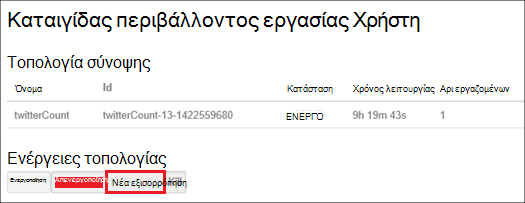

<properties
    pageTitle="Διαχείριση συμπλεγμάτων Hadoop στο HDInsight με το PowerShell | Microsoft Azure"
    description="Μάθετε πώς μπορείτε να εκτελέσετε εργασίες διαχείρισης για το συμπλεγμάτων Hadoop στη χρήση του Azure PowerShell HDInsight."
    services="hdinsight"
    editor="cgronlun"
    manager="jhubbard"
    tags="azure-portal"
    authors="mumian"
    documentationCenter=""/>

<tags
    ms.service="hdinsight"
    ms.workload="big-data"
    ms.tgt_pltfrm="na"
    ms.devlang="na"
    ms.topic="article"
    ms.date="08/10/2016"
    ms.author="jgao"/>

# Διαχείριση συμπλεγμάτων Hadoop στο HDInsight με τη χρήση του PowerShell Azure

[AZURE.INCLUDE [selector](../../includes/hdinsight-portal-management-selector.md)]

Azure PowerShell είναι ένα ισχυρό περιβάλλον δέσμης ενεργειών που μπορείτε να χρησιμοποιήσετε για να ελέγξετε και να αυτοματοποιήσετε την ανάπτυξη και τη διαχείριση των σας φόρτους εργασίας στο Azure. Σε αυτό το άρθρο, θα μάθετε πώς μπορείτε να διαχειριστείτε συμπλεγμάτων Hadoop στο Azure HDInsight με τη χρήση μιας τοπικής κονσόλας Azure PowerShell με τη χρήση του Windows PowerShell. Για τη λίστα με τα cmdlet του HDInsight PowerShell, ανατρέξτε στο θέμα [αναφορά cmdlet HDInsight][hdinsight-powershell-reference].

**Προαπαιτούμενα στοιχεία**

Προτού ξεκινήσετε σε αυτό το άρθρο, πρέπει να έχετε τα εξής:

- **Azure μια συνδρομή**. Ανατρέξτε στο θέμα [λήψη Azure δωρεάν δοκιμαστικής έκδοσης](https://azure.microsoft.com/documentation/videos/get-azure-free-trial-for-testing-hadoop-in-hdinsight/).

##Εγκατάσταση του Azure PowerShell

[AZURE.INCLUDE [upgrade-powershell](../../includes/hdinsight-use-latest-powershell.md)]

Εάν έχετε εγκαταστήσει Azure PowerShell έκδοση 0,9 x, που πρέπει να καταργήσετε την εγκατάστασή του πριν από την εγκατάσταση σε νεότερη έκδοση.

Για να ελέγξετε την έκδοση του εγκατεστημένο το PowerShell:

    Get-Module *azure*
    
Για να καταργήσετε την παλαιότερη έκδοση, εκτελέστε προγράμματα και δυνατότητες στον πίνακα ελέγχου. 

##Δημιουργία συμπλεγμάτων

Ανατρέξτε στο θέμα [Δημιουργία Linux βάσει συμπλεγμάτων στη χρήση του Azure PowerShell HDInsight](hdinsight-hadoop-create-linux-clusters-azure-powershell.md)

##Λίστα συμπλεγμάτων
Χρησιμοποιήστε την ακόλουθη εντολή για μια λίστα όλων των συμπλεγμάτων στην τρέχουσα εγγραφή:

    Get-AzureRmHDInsightCluster

##Εμφάνιση συμπλέγματος

Χρησιμοποιήστε την παρακάτω εντολή για να δείτε λεπτομέρειες σχετικά με ένα συγκεκριμένο σύμπλεγμα στην τρέχουσα εγγραφή:

    Get-AzureRmHDInsightCluster -ClusterName <Cluster Name>

##Διαγραφή συμπλεγμάτων

Χρησιμοποιήστε την παρακάτω εντολή για να διαγράψετε ένα σύμπλεγμα:

    Remove-AzureRmHDInsightCluster -ClusterName <Cluster Name>

Μπορείτε επίσης να διαγράψετε ένα σύμπλεγμα, καταργώντας την ομάδα πόρων που περιέχει το σύμπλεγμα. Σημειώστε, αυτό θα διαγράψει όλους τους πόρους στην ομάδα, συμπεριλαμβανομένου του προεπιλεγμένου λογαριασμού χώρου αποθήκευσης.

    Remove-AzureRmResourceGroup -Name <Resource Group Name>
            
##Κλίμακα συμπλεγμάτων
Το σύμπλεγμα κλίμακας δυνατότητα σάς επιτρέπει να αλλάξετε τον αριθμό των κόμβους εργαζόμενου που χρησιμοποιούνται από ένα σύμπλεγμα που εκτελείται στο Azure HDInsight χωρίς να χρειάζεται να δημιουργήσετε ξανά το σύμπλεγμα.

>[AZURE.NOTE] Μόνο συμπλεγμάτων με HDInsight έκδοση 3.1.3 ή υψηλότερη υποστηρίζονται. Εάν είστε βέβαιοι για την έκδοση του το σύμπλεγμά σας, μπορείτε να ελέγξετε τη σελίδα ιδιοτήτων.  Ανατρέξτε στο θέμα [λίστα και εμφάνιση συμπλεγμάτων](hdinsight-administer-use-portal-linux.md#list-and-show-clusters).

Την επίδραση των αλλαγή του αριθμού των κόμβοι δεδομένων για κάθε τύπο σύμπλεγμα που υποστηρίζονται από το HDInsight:

- Hadoop

    Απρόσκοπτη, μπορείτε να αυξήσετε τον αριθμό των κόμβους εργαζόμενου σε ένα σύμπλεγμα Hadoop που εκτελείται χωρίς να επηρεάζονται τυχόν εργασίες σε εκκρεμότητα ή δεν εκτελείται. Νέες εργασίες μπορούν να υποβληθούν επίσης ενώ η λειτουργία βρίσκεται σε εξέλιξη. Αποτυχίες σε μια λειτουργία κλίμακας αντιμετωπίζονται ομαλά, έτσι ώστε το σύμπλεγμα πάντα θα παραμείνει σε μια λειτουργική κατάσταση.

    Όταν ένα σύμπλεγμα Hadoop γίνεται κλιμάκωση προς τα κάτω, μειώνοντας τον αριθμό των δεδομένων κόμβους, ορισμένες από τις υπηρεσίες του συμπλέγματος επανεκκίνηση του. Αυτό θα κάνει όλα εκτελείται και εκκρεμείς εργασίες αποτυχία κατά την ολοκλήρωση της λειτουργίας κλίμακας. Ωστόσο, μπορείτε να, υποβάλετε ξανά τις εργασίες μόλις ολοκληρωθεί η λειτουργία.

- HBase

    Απρόσκοπτη, μπορείτε να προσθέσετε ή να καταργήσετε κόμβοι για το σύμπλεγμα HBase ενώ εκτελείται. Οι τοπικοί διακομιστές είναι εξισορρόπηση αυτόματα μετά από μερικά λεπτά από την ολοκλήρωση της λειτουργίας κλίμακας. Ωστόσο, μπορείτε να εξισορροπήσετε το οι τοπικοί διακομιστές επίσης με μη αυτόματο τρόπο, σύνδεση με το headnode συμπλέγματος και εκτελεί τις παρακάτω εντολές από ένα παράθυρο γραμμής εντολών:

        >pushd %HBASE_HOME%\bin
        >hbase shell
        >balancer

- Καταιγίδας

    Απρόσκοπτη, μπορείτε να προσθέσετε ή να καταργήσετε κόμβους δεδομένων για το σύμπλεγμά σας καταιγίδας ενώ εκτελείται. Αλλά μετά την επιτυχή ολοκλήρωση της λειτουργίας κλίμακας, θα χρειαστεί να νέα εξισορρόπηση της τοπολογίας.

    Εξισορρόπηση μπορεί να πραγματοποιηθεί με δύο τρόπους:

    * Καταιγίδας web περιβάλλοντος εργασίας Χρήστη
    * Εργαλείο περιβάλλον γραμμής εντολών (CLI)

    Ανατρέξτε στην [τεκμηρίωση καταιγίδας Apache](http://storm.apache.org/documentation/Understanding-the-parallelism-of-a-Storm-topology.html) για περισσότερες λεπτομέρειες.

    Το web καταιγίδας περιβάλλοντος εργασίας Χρήστη είναι διαθέσιμο στο σύμπλεγμα HDInsight:

    

    Ακολουθεί ένα παράδειγμα πώς μπορείτε να χρησιμοποιήσετε την εντολή CLI για νέα εξισορρόπηση της τοπολογίας καταιγίδας:

        ## Reconfigure the topology "mytopology" to use 5 worker processes,
        ## the spout "blue-spout" to use 3 executors, and
        ## the bolt "yellow-bolt" to use 10 executors

        $ storm rebalance mytopology -n 5 -e blue-spout=3 -e yellow-bolt=10

Για να αλλάξετε το μέγεθος του συμπλέγματος Hadoop με χρήση του Azure PowerShell, εκτελέστε την ακόλουθη εντολή από έναν υπολογιστή-πελάτη:

    Set-AzureRmHDInsightClusterSize -ClusterName <Cluster Name> -TargetInstanceCount <NewSize>
    

##Εκχώρηση/ανάκληση πρόσβασης

HDInsight συμπλεγμάτων έχουν τις ακόλουθες υπηρεσίες web HTTP (όλες αυτές οι υπηρεσίες έχουν RESTful τελικά σημεία):

- ODBC
- JDBC
- Ambari
- Oozie
- Templeton

Από προεπιλογή, οι υπηρεσίες αυτές έχουν εκχωρηθεί για πρόσβαση. Μπορείτε να revoke/εκχώρηση πρόσβαση. Για να ανακαλέσετε:

    Revoke-AzureRmHDInsightHttpServicesAccess -ClusterName <Cluster Name>

Για να εκχωρήσετε:

    $clusterName = "<HDInsight Cluster Name>"

    # Credential option 1
    $hadoopUserName = "admin"
    $hadoopUserPassword = "<Enter the Password>"
    $hadoopUserPW = ConvertTo-SecureString -String $hadoopUserPassword -AsPlainText -Force
    $credential = New-Object System.Management.Automation.PSCredential($hadoopUserName,$hadoopUserPW)

    # Credential option 2
    #$credential = Get-Credential -Message "Enter the HTTP username and password:" -UserName "admin"
    
    Grant-AzureRmHDInsightHttpServicesAccess -ClusterName $clusterName -HttpCredential $credential

>[AZURE.NOTE] Με την εκχώρηση/ανάκληση της access, θα μπορείτε να επαναφέρετε το σύμπλεγμα όνομα χρήστη και κωδικό πρόσβασης.

Αυτό μπορεί να γίνει επίσης μέσω της πύλης. Ανατρέξτε στο θέμα [Διαχείριση του HDInsight, χρησιμοποιώντας την πύλη του Azure][hdinsight-admin-portal].

##Ενημέρωση διαπιστευτηρίων χρήστη HTTP

Πρόκειται για την ίδια διαδικασία που [Εκχώρηση/ανάκληση HTTP πρόσβασης](#grant/revoke-access). Εάν το σύμπλεγμα έχει παραχωρηθεί πρόσβαση HTTP, μπορείτε πρώτα πρέπει να ανακαλέσετε την.  Και, στη συνέχεια, να εκχωρήσετε το πρόσβαση με διαπιστευτήρια χρήστη νέου HTTP.

##Βρείτε τον προεπιλεγμένο λογαριασμό χώρου αποθήκευσης

Η ακόλουθη δέσμη ενεργειών Powershell παρουσιάζει πώς μπορείτε να λάβετε το προεπιλεγμένο όνομα λογαριασμού χώρου αποθήκευσης και το κλειδί λογαριασμού αποθήκευσης προεπιλογή για ένα σύμπλεγμα.

    $clusterName = "<HDInsight Cluster Name>"
    
    $cluster = Get-AzureRmHDInsightCluster -ClusterName $clusterName
    $resourceGroupName = $cluster.ResourceGroup
    $defaultStorageAccountName = ($cluster.DefaultStorageAccount).Replace(".blob.core.windows.net", "")
    $defaultBlobContainerName = $cluster.DefaultStorageContainer
    $defaultStorageAccountKey = (Get-AzureRmStorageAccountKey -ResourceGroupName $resourceGroupName -Name $defaultStorageAccountName)[0].Value
    $defaultStorageAccountContext = New-AzureStorageContext -StorageAccountName $defaultStorageAccountName -StorageAccountKey $defaultStorageAccountKey 

##Βρείτε την ομάδα πόρων

Στη λειτουργία διαχείρισης πόρων, κάθε σύμπλεγμα HDInsight ανήκει σε μια ομάδα Azure πόρων.  Για να βρείτε την ομάδα των πόρων:

    $clusterName = "<HDInsight Cluster Name>"
    
    $cluster = Get-AzureRmHDInsightCluster -ClusterName $clusterName
    $resourceGroupName = $cluster.ResourceGroup

##Υποβολή εργασιών

**Για να υποβάλετε MapReduce εργασίες**

Ανατρέξτε στο θέμα [Εκτέλεση Hadoop MapReduce δείγματα στο HDInsight που βασίζεται στα Windows](hdinsight-run-samples.md).

**Για να υποβάλετε εργασίες ομάδας** 

Ανατρέξτε στο θέμα [Εκτέλεση Hive ερωτημάτων με το PowerShell](hdinsight-hadoop-use-hive-powershell.md).

**Για να υποβάλετε γουρούνι εργασίες**

Ανατρέξτε στο θέμα [γουρούνι εκτέλεση εργασιών με χρήση του PowerShell](hdinsight-hadoop-use-pig-powershell.md).

**Για να υποβάλετε Sqoop εργασίες**

Ανατρέξτε στο θέμα [Χρήση Sqoop με HDInsight](hdinsight-use-sqoop.md).

**Για να υποβάλετε Oozie εργασίες**

Ανατρέξτε στο θέμα [Χρήση Oozie με Hadoop να ορίσετε και να εκτελέσετε μια ροή εργασιών στο HDInsight](hdinsight-use-oozie.md).

##Αποστολή δεδομένων στο χώρο αποθήκευσης αντικειμένων Blob του Azure
Ανατρέξτε στο θέμα [Αποστολή δεδομένων με το HDInsight][hdinsight-upload-data].

## Δείτε επίσης
* [Τεκμηρίωση αναφοράς cmdlet HDInsight][hdinsight-powershell-reference]
* [Διαχείριση HDInsight, χρησιμοποιώντας την πύλη του Azure][hdinsight-admin-portal]
* [Διαχείριση HDInsight χρησιμοποιώντας ένα περιβάλλον γραμμής εντολών][hdinsight-admin-cli]
* [Δημιουργία HDInsight συμπλεγμάτων][hdinsight-provision]
* [Αποστολή δεδομένων σε HDInsight][hdinsight-upload-data]
* [Υποβολή εργασιών Hadoop μέσω προγραμματισμού][hdinsight-submit-jobs]
* [Γρήγορα αποτελέσματα με το Azure HDInsight][hdinsight-get-started]

[azure-purchase-options]: http://azure.microsoft.com/pricing/purchase-options/
[azure-member-offers]: http://azure.microsoft.com/pricing/member-offers/
[azure-free-trial]: http://azure.microsoft.com/pricing/free-trial/

[hdinsight-get-started]: hdinsight-hadoop-linux-tutorial-get-started.md
[hdinsight-provision]: hdinsight-provision-clusters.md
[hdinsight-provision-custom-options]: hdinsight-provision-clusters.md#configuration
[hdinsight-submit-jobs]: hdinsight-submit-hadoop-jobs-programmatically.md

[hdinsight-admin-cli]: hdinsight-administer-use-command-line.md
[hdinsight-admin-portal]: hdinsight-administer-use-management-portal.md
[hdinsight-storage]: hdinsight-hadoop-use-blob-storage.md
[hdinsight-use-hive]: hdinsight-use-hive.md
[hdinsight-use-mapreduce]: hdinsight-use-mapreduce.md
[hdinsight-upload-data]: hdinsight-upload-data.md
[hdinsight-flight]: hdinsight-analyze-flight-delay-data.md

[hdinsight-powershell-reference]: https://msdn.microsoft.com/library/dn858087.aspx

[powershell-install-configure]: powershell-install-configure.md

[image-hdi-ps-provision]: ./media/hdinsight-administer-use-powershell/HDI.PS.Provision.png
