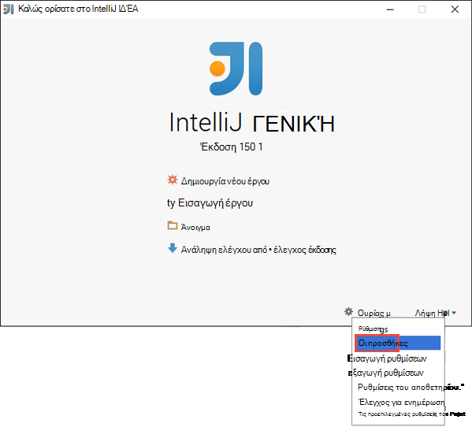
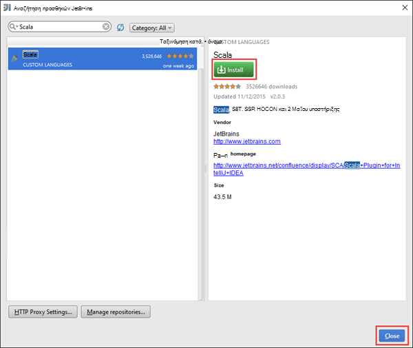
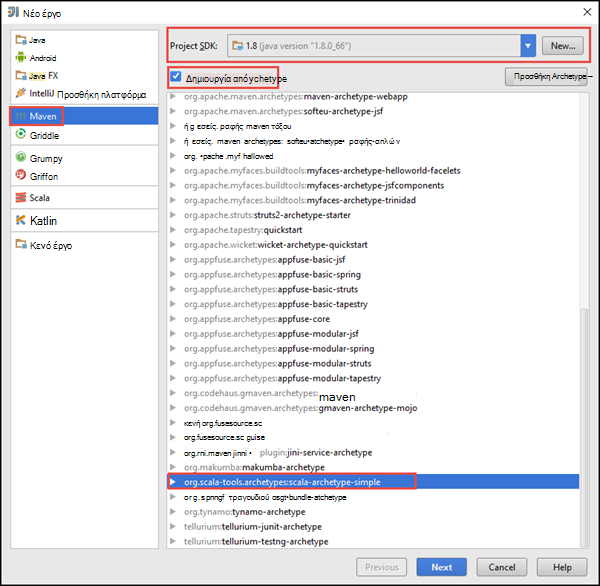
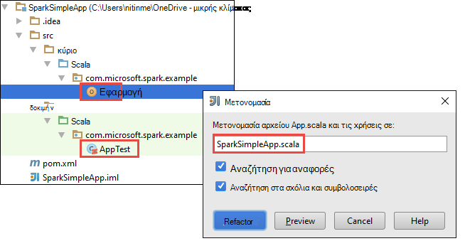
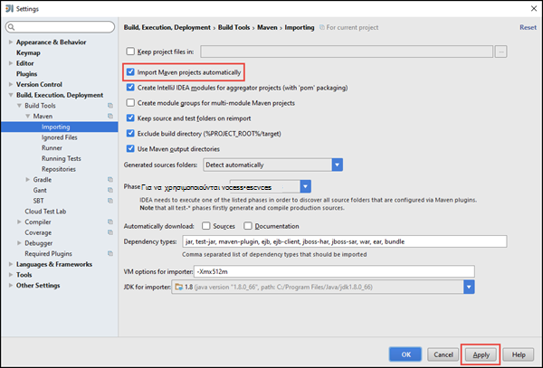
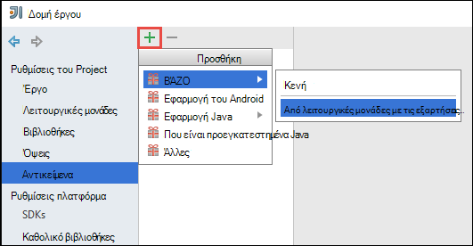
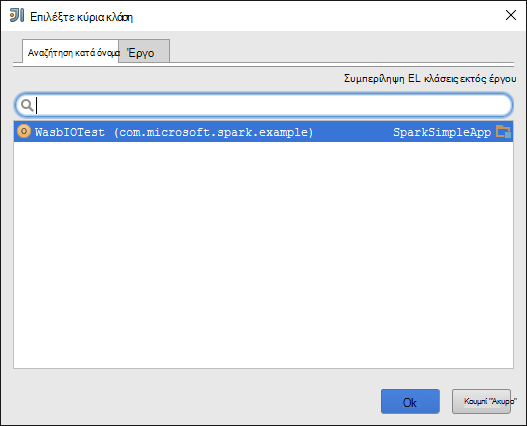
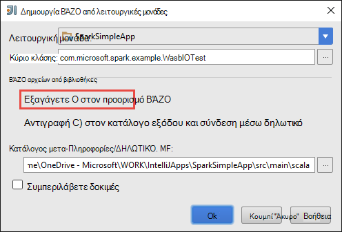
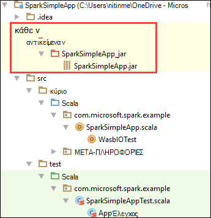

<properties
    pageTitle="Δημιουργία μεμονωμένου scala εφαρμογών για να εκτελέσετε σε συμπλεγμάτων τους HDInsight | Microsoft Azure"
    description="Μάθετε πώς μπορείτε να δημιουργήσετε μια μεμονωμένη εφαρμογή τους για να εκτελεστεί σε συμπλεγμάτων HDInsight τους."
    services="hdinsight"
    documentationCenter=""
    authors="nitinme"
    manager="jhubbard"
    editor="cgronlun"
    tags="azure-portal"/>

<tags
    ms.service="hdinsight"
    ms.workload="big-data"
    ms.tgt_pltfrm="na"
    ms.devlang="na"
    ms.topic="article"
    ms.date="10/28/2016"
    ms.author="nitinme"/>

# Δημιουργία μεμονωμένου Scala εφαρμογής ώστε να εκτελείται σε σύμπλεγμα Apache τους σε HDInsight Linux

Σε αυτό το άρθρο παρέχει οδηγίες βήμα προς βήμα στην ανάπτυξη εφαρμογών τους μεμονωμένη γραμμένο σε Scala χρήση Maven με IntelliJ ΙΔΈΑ. Το άρθρο χρησιμοποιεί Apache Maven ως σύστημα Δόμηση και ξεκινά με ένα υπάρχον archetype Maven για Scala που παρέχεται από ΓΕΝΙΚΉ IntelliJ.  Στο υψηλού επιπέδου, τη δημιουργία μιας Scala εφαρμογής στην IntelliJ ΙΔΈΑ θα περιλαμβάνει τα παρακάτω βήματα:

* Χρησιμοποιήστε Maven ως το σύστημα Δόμηση.
* Ενημέρωση αρχείου μοντέλο αντικειμένου έργου (POM) για να επιλύσετε εξαρτήσεις λειτουργική μονάδα τους.
* Γράψτε την εφαρμογή στο Scala.
* Δημιουργία ενός αρχείου βάζο που μπορούν να υποβληθούν σε συμπλεγμάτων HDInsight τους.
* Εκτελέστε την εφαρμογή σε σύμπλεγμα τους χρησιμοποιώντας Λίβιος.

>[AZURE.NOTE] HDInsight παρέχει επίσης ένα εργαλείο προσθήκης IntelliJ ΙΔΈΑ για να διευκολύνετε τη διαδικασία από τη δημιουργία και υποβολή εφαρμογές σε ένα σύμπλεγμα HDInsight τους στην Linux. Για περισσότερες πληροφορίες, ανατρέξτε στο θέμα [Χρήση HDInsight εργαλεία προσθήκης για IntelliJ ιδέα ΕΊΝΑΙ να δημιουργήσετε και να υποβάλετε αιτήσεις τους](hdinsight-apache-spark-intellij-tool-plugin.md).

**Προαπαιτούμενα στοιχεία**

* Μια συνδρομή του Azure. Ανατρέξτε στο θέμα [λήψη Azure δωρεάν δοκιμαστικής έκδοσης](https://azure.microsoft.com/documentation/videos/get-azure-free-trial-for-testing-hadoop-in-hdinsight/).
* Ένα σύμπλεγμα Apache τους σε HDInsight Linux. Για οδηγίες, ανατρέξτε στο θέμα [Δημιουργία τους Apache συμπλεγμάτων στο Azure HDInsight](hdinsight-apache-spark-jupyter-spark-sql.md).
* Κιτ ανάπτυξης Java Oracle. Μπορείτε να το εγκαταστήσετε από [εδώ](http://www.oracle.com/technetwork/java/javase/downloads/jdk8-downloads-2133151.html).
* Μια Java IDE. Σε αυτό το άρθρο χρησιμοποιεί IntelliJ ΙΔΈΑ 15.0.1. Μπορείτε να το εγκαταστήσετε από [εδώ](https://www.jetbrains.com/idea/download/).

## Εγκατάσταση προσθήκης Scala για IntelliJ ΙΔΈΑ

Εάν εγκατάστασης ΙΔΈΑ IntelliJ δεν ζητά ενεργοποίηση προσθήκης Scala, εκκίνηση IntelliJ ΙΔΈΑ και ακολουθήσετε τα παρακάτω βήματα για να εγκαταστήσετε την προσθήκη:

1. Έναρξη ΙΔΈΑ IntelliJ και από την οθόνη υποδοχής, κάντε κλικ στην επιλογή **Ρύθμιση παραμέτρων** και, στη συνέχεια, κάντε κλικ στην επιλογή **προσθήκες**.

    

2. Στην επόμενη οθόνη, κάντε κλικ στην επιλογή **Προσθήκη JetBrains εγκατάσταση** από κάτω αριστερή γωνία. Στο παράθυρο διαλόγου **Αναζήτηση προσθηκών JetBrains** που ανοίγει, αναζητήστε Scala και, στη συνέχεια, κάντε κλικ στην επιλογή **εγκατάσταση**.

    

3. Μετά την προσθήκη εγκαταστάσεις με επιτυχία, κάντε κλικ στο **κουμπί επανεκκίνηση IntelliJ ΙΔΈΑ** για να επανεκκινήσετε το IDE.

## Δημιουργία μεμονωμένου Scala έργου

1. Εκκίνηση IntelliJ ΙΔΈΑ και δημιουργήστε ένα νέο έργο. Στο νέο παράθυρο διαλόγου του project, κάντε τις ακόλουθες επιλογές και, στη συνέχεια, κάντε κλικ στο κουμπί **Επόμενο**.

    

    * Επιλέξτε **Maven** ως τον τύπο του έργου.
    * Καθορίστε ένα **έργο SDK**. Κάντε κλικ στην επιλογή Δημιουργία και μεταβείτε στον κατάλογο εγκατάστασης Java, συνήθως `C:\Program Files\Java\jdk1.8.0_66`.
    * Ενεργοποιήστε την επιλογή **Δημιουργία από archetype** .
    * Από τη λίστα των archetypes, επιλέξτε **org.scala-tools.archetypes:scala-archetype-απλά**. Θα δημιουργήσετε τη δομή του καταλόγου δεξιά και λήψη τις εξαρτήσεις απαιτείται προεπιλογή για να γράψετε Scala πρόγραμμα.

2. Δώστε τις σχετικές τιμές για το **αναγνωριστικό ομάδας**, **ArtifactId**και την **έκδοση**. Κάντε κλικ στο κουμπί **Επόμενο**.

3. Στο επόμενο παράθυρο διαλόγου, όπου μπορείτε να ορίσετε Maven αρχικού καταλόγου και άλλες ρυθμίσεις χρήστη, αποδεχτείτε τις προεπιλογές και κάντε κλικ στο κουμπί **Επόμενο**.

4. Στο παράθυρο διαλόγου τελευταία, καθορίστε ένα όνομα έργου και μια θέση και, στη συνέχεια, κάντε κλικ στο κουμπί **Τέλος**.

5. Διαγράψτε το αρχείο **MySpec.Scala** σε **src\test\scala\com\microsoft\spark\example**. Αυτό δεν χρειάζεται για την εφαρμογή.

6. Εάν είναι απαραίτητο, μετονομάστε τα προεπιλεγμένα αρχεία προέλευσης και έλεγχος. Από το αριστερό παράθυρο στο η ΙΔΈΑ IntelliJ, μεταβείτε σε **src\main\scala\com.microsoft.spark.example**. Κάντε δεξί κλικ **App.scala**, κάντε κλικ στην επιλογή **Refactor**, κάντε κλικ στην επιλογή Μετονομασία αρχείου, και στο παράθυρο διαλόγου, δώστε το νέο όνομα για την εφαρμογή και, στη συνέχεια, κάντε κλικ στην επιλογή **Refactor**.

      

7. Στα επόμενα βήματα, θα μπορείτε να ενημερώσετε το pom.xml για να ορίσετε τις εξαρτήσεις για την εφαρμογή Scala τους. Για αυτές τις εξαρτήσεις για να ληφθεί και να λυθεί αυτόματα, πρέπει να ρυθμίζετε τις παραμέτρους Maven αντίστοιχα.

    

    1. Από το μενού **αρχείο** , κάντε κλικ στην επιλογή **Ρυθμίσεις**.
    2. Στο παράθυρο διαλόγου " **Ρυθμίσεις** ", μεταβείτε στη **Δημιουργία, εκτέλεση, ανάπτυξη** > **Δημιουργία εργαλεία** > **Maven** > **διαδικασία εισαγωγής**.
    3. Ενεργοποιήστε την επιλογή για την **Εισαγωγή Maven έργα αυτόματα**.
    4. Κάντε κλικ στην επιλογή **εφαρμογή**και, στη συνέχεια, κάντε κλικ στο κουμπί **OK**.

8. Ενημερώστε το αρχείο προέλευσης Scala για να συμπεριλάβετε κώδικα της εφαρμογής σας. Ανοίξετε και να αντικαταστήσετε τον υπάρχοντα κωδικό δείγμα με τον ακόλουθο κώδικα και να αποθηκεύσετε τις αλλαγές. Αυτός ο κωδικός διαβάζει τα δεδομένα από το HVAC.csv (διαθέσιμο σε όλους τους HDInsight συμπλεγμάτων), ανακτά τις γραμμές που έχουν μόνο ένα ψηφίο στη στήλη έκτο και εγγράφει το αποτέλεσμα στο **/HVACOut** κάτω από το προεπιλεγμένο κοντέινερ χώρου αποθήκευσης για το σύμπλεγμα.

        package com.microsoft.spark.example

        import org.apache.spark.SparkConf
        import org.apache.spark.SparkContext

        /**
          * Test IO to wasb
          */
        object WasbIOTest {
          def main (arg: Array[String]): Unit = {
            val conf = new SparkConf().setAppName("WASBIOTest")
            val sc = new SparkContext(conf)

            val rdd = sc.textFile("wasbs:///HdiSamples/HdiSamples/SensorSampleData/hvac/HVAC.csv")

            //find the rows which have only one digit in the 7th column in the CSV
            val rdd1 = rdd.filter(s => s.split(",")(6).length() == 1)

            rdd1.saveAsTextFile("wasbs:///HVACout")
          }
        }

9. Ενημερώστε το pom.xml.

    1.  Μέσα σε `<project>\<properties>` , προσθέστε τα εξής:

            <scala.version>2.10.4</scala.version>
            <scala.compat.version>2.10.4</scala.compat.version>
            <scala.binary.version>2.10</scala.binary.version>

    2. Μέσα σε `<project>\<dependencies>` , προσθέστε τα εξής:

            <dependency>
              <groupId>org.apache.spark</groupId>
              <artifactId>spark-core_${scala.binary.version}</artifactId>
              <version>1.4.1</version>
            </dependency>

    Αποθήκευση αλλαγών σε pom.xml.

10. Δημιουργία του αρχείου .jar. ΓΕΝΙΚΉ IntelliJ επιτρέπει τη δημιουργία ΒΆΖΟ ως ένα αντικείμενο ενός έργου. Ακολουθήστε τα παρακάτω βήματα.

    1. Από το μενού **αρχείο** , κάντε κλικ στην επιλογή **Project δομή**.
    2. Στο παράθυρο διαλόγου **Δομή έργου** , κάντε κλικ στην επιλογή **αντικείμενα** και, στη συνέχεια, κάντε κλικ στο σύμβολο συν. Από το αναδυόμενο παράθυρο, κάντε κλικ στην επιλογή **ΒΆΖΩΝ**και, στη συνέχεια, κάντε κλικ στην επιλογή **από λειτουργικές μονάδες με τις εξαρτήσεις**.

        

    3. Στο παράθυρο διαλόγου **Δημιουργία ΒΆΖΩΝ από λειτουργικές μονάδες** , κάντε κλικ στα αποσιωπητικά ( ) σε σχέση με την **Κλάση κύριες**.

    4. Στο παράθυρο διαλόγου **Επιλέξτε κύριες τάξης** , επιλέξτε την κατηγορία στην οποία εμφανίζεται από προεπιλογή και, στη συνέχεια, κάντε κλικ στο κουμπί **OK**.

        

    5. Στο παράθυρο διαλόγου **Δημιουργία ΒΆΖΩΝ από λειτουργικές μονάδες** , βεβαιωθείτε ότι είναι ενεργοποιημένη η επιλογή για να **εξαγάγετε στον προορισμό ΒΆΖΟ** και, στη συνέχεια, κάντε κλικ στο κουμπί **OK**. Με τον τρόπο αυτό δημιουργείται ένα μεμονωμένο ΒΆΖΟ με όλες τις εξαρτήσεις.

        

    6. Καρτέλα "Διάταξη" Έξοδος "παραθέτει όλα τα πλατύστομα που περιλαμβάνονται ως τμήμα του Maven έργου. Μπορείτε να επιλέξετε και να διαγράψετε αυτές κατά την οποία η εφαρμογή Scala έχει καμία εξάρτηση απευθείας. Για την εφαρμογή δημιουργούμε εδώ, μπορείτε να καταργήσετε όλα εκτός από την τελευταία μία (**SparkSimpleApp μεταγλώττιση εξόδου**). Επιλέξτε το πλατύστομα για να διαγράψετε και, στη συνέχεια, κάντε κλικ στο εικονίδιο **Διαγραφή** .

        

        Βεβαιωθείτε ότι είναι επιλεγμένο πλαίσιο **δομούνται δημιουργίας** , που διασφαλίζει ότι η βάζο δημιουργούνται κάθε φορά που είναι ενσωματωμένη ή ενημέρωση του έργου. Κάντε κλικ στην επιλογή **εφαρμογή** και, στη συνέχεια, **OK**.

    7. Από τη γραμμή μενού, κάντε κλικ στην επιλογή **Δημιουργία**και, στη συνέχεια, κάντε κλικ στην επιλογή **Δημιουργία έργου**. Μπορείτε επίσης να επιλέξετε **Αντικείμενα δημιουργία** για να δημιουργήσετε το βάζο. Το αποτέλεσμα βάζο δημιουργείται στην περιοχή **\out\artifacts**.

        

## Εκτελέστε την εφαρμογή στο σύμπλεγμα τους

Για να εκτελέσετε την εφαρμογή στο σύμπλεγμα, πρέπει να κάνετε τα εξής:

* **Αντιγράψτε το βάζο εφαρμογής για το Azure χώρο αποθήκευσης αντικειμένων blob** που σχετίζεται με το σύμπλεγμα. Μπορείτε να χρησιμοποιήσετε [**AzCopy**](../storage/storage-use-azcopy.md), ένα βοηθητικό πρόγραμμα γραμμής εντολών, για να το κάνετε. Υπάρχουν πολλές καθώς και άλλα προγράμματα-πελάτες που μπορείτε να χρησιμοποιήσετε για την αποστολή δεδομένων. Μπορείτε να βρείτε περισσότερες πληροφορίες για τους στην [Αποστολή δεδομένων για τις εργασίες Hadoop στο HDInsight](hdinsight-upload-data.md).

* **Χρήση Λίβιος για να υποβάλετε μια εργασία εφαρμογών από απόσταση** στο σύμπλεγμα τους. Συμπλεγμάτων τους σε HDInsight περιλαμβάνει Λίβιος που εκθέτει τελικά σημεία ΥΠΌΛΟΙΠΟ να υποβάλλουν από απόσταση εργασίες τους. Για περισσότερες πληροφορίες, ανατρέξτε στο θέμα [υποβολή τους εργασίες από απόσταση χρησιμοποιώντας Λίβιος με τους συμπλεγμάτων σε HDInsight](hdinsight-apache-spark-livy-rest-interface.md).

## Δείτε επίσης

* [Επισκόπηση: Apache τους σε Azure HDInsight](hdinsight-apache-spark-overview.md)

### Σενάρια

* [Τους με το BI: Εκτέλεση ανάλυσης αλληλεπιδραστικών δεδομένων με χρήση τους σε HDInsight με εργαλεία Επιχειρηματικής ευφυΐας](hdinsight-apache-spark-use-bi-tools.md)

* [Τους με μηχανικής εκμάθησης: χρήση τους σε HDInsight για την ανάλυση δόμησης θερμοκρασίας με τη χρήση δεδομένων HVAC](hdinsight-apache-spark-ipython-notebook-machine-learning.md)

* [Τους με μηχανικής εκμάθησης: χρήση τους σε HDInsight πρόβλεψη της εστίασης στα αποτελέσματα ελέγχου](hdinsight-apache-spark-machine-learning-mllib-ipython.md)

* [Τους ροής: Χρήση τους σε HDInsight για τη δημιουργία εφαρμογών σε πραγματικό χρόνο ροής](hdinsight-apache-spark-eventhub-streaming.md)

* [Ανάλυση καταγραφής τοποθεσία Web χρησιμοποιώντας τους στο HDInsight](hdinsight-apache-spark-custom-library-website-log-analysis.md)

### Δημιουργία και εκτέλεση εφαρμογών

* [Απομακρυσμένη εκτέλεση εργασιών σε ένα σύμπλεγμα τους χρησιμοποιώντας Λίβιος](hdinsight-apache-spark-livy-rest-interface.md)

### Εργαλεία και επεκτάσεις

* [Χρησιμοποιήστε HDInsight εργαλεία προσθήκης για IntelliJ ΙΔΈΑ για να δημιουργήσετε και να υποβάλετε τους Scala εφαρμογών](hdinsight-apache-spark-intellij-tool-plugin.md)

* [Χρησιμοποιήστε HDInsight εργαλεία προσθήκης για IntelliJ ΙΔΈΑ για τον εντοπισμό σφαλμάτων εφαρμογών τους από απόσταση](hdinsight-apache-spark-intellij-tool-plugin-debug-jobs-remotely.md)

* [Χρήση Zeppelin σημειωματάρια με ένα σύμπλεγμα τους σε HDInsight](hdinsight-apache-spark-use-zeppelin-notebook.md)

* [Διαθέσιμο για Jupyter σημειωματαρίου στο σύμπλεγμα τους για HDInsight πυρήνων](hdinsight-apache-spark-jupyter-notebook-kernels.md)

* [Χρήση εξωτερικών πακέτων με σημειωματάρια Jupyter](hdinsight-apache-spark-jupyter-notebook-use-external-packages.md)

* [Εγκατάσταση Jupyter στον υπολογιστή σας και να συνδεθείτε με ένα σύμπλεγμα HDInsight τους](hdinsight-apache-spark-jupyter-notebook-install-locally.md)

### Διαχείριση πόρων

* [Διαχείριση πόρων για το σύμπλεγμα Apache τους στο Azure HDInsight](hdinsight-apache-spark-resource-manager.md)

* [Παρακολούθηση και εντοπισμού σφαλμάτων εργασίες που εκτελείται σε ένα σύμπλεγμα Apache τους στο HDInsight](hdinsight-apache-spark-job-debugging.md)
