 <properties
    pageTitle="Δημιουργία Scala τους εφαρμογών χρησιμοποιώντας εργαλεία HDInsight του Κιτ εργαλείων Azure για Έκλειψη | Microsoft Azure"
    description="Μάθετε πώς μπορείτε να δημιουργήσετε μια μεμονωμένη εφαρμογή τους για να εκτελεστεί σε συμπλεγμάτων HDInsight τους."
    services="hdinsight"
    documentationCenter=""
    authors="nitinme"
    manager="jhubbard"
    editor="cgronlun"
    tags="azure-portal"/>

<tags
    ms.service="hdinsight"
    ms.workload="big-data"
    ms.tgt_pltfrm="na"
    ms.devlang="na"
    ms.topic="article"
    ms.date="08/30/2016"
    ms.author="nitinme"/>

# Χρησιμοποιήστε τα εργαλεία HDInsight Κιτ εργαλείων Azure για Έκλειψη για να δημιουργήσετε εφαρμογές για το σύμπλεγμα Linux τους HDInsight τους

Σε αυτό το άρθρο παρέχει οδηγίες βήμα προς βήμα στην ανάπτυξη εφαρμογών τους γραμμένο σε Scala και υποβολή για να τους ένα HDInsight συμπλέγματος χρησιμοποιώντας εργαλεία HDInsight στο Κιτ εργαλείων Azure για Έκλειψη. Μπορείτε να χρησιμοποιήσετε τα εργαλεία με διαφορετικούς τρόπους:

* Για να αναπτύξετε και να υποβάλετε μια αίτηση Scala τους σε ένα σύμπλεγμα HDInsight τους
* Για να αποκτήσετε πρόσβαση του Azure HDInsight τους πόρους συμπλέγματος
* Για να αναπτύξετε και να εκτελέσετε μια εφαρμογή τους Scala τοπικά

>[AZURE.IMPORTANT] Αυτό το εργαλείο μπορεί να χρησιμοποιηθεί για να δημιουργήσετε και να υποβάλετε αιτήσεις μόνο για ένα σύμπλεγμα HDInsight τους στην Linux.

##Προαπαιτούμενα στοιχεία

* Μια συνδρομή του Azure. Ανατρέξτε στο θέμα [λήψη Azure δωρεάν δοκιμαστικής έκδοσης](https://azure.microsoft.com/documentation/videos/get-azure-free-trial-for-testing-hadoop-in-hdinsight/).

* Ένα σύμπλεγμα Apache τους σε HDInsight Linux. Για οδηγίες, ανατρέξτε στο θέμα [Δημιουργία τους Apache συμπλεγμάτων στο Azure HDInsight](hdinsight-apache-spark-jupyter-spark-sql.md).

* Ανάπτυξη Java Oracle κιτ 7 και 8 έκδοση. 
    * **Java SDK 7** χρησιμοποιείται για την κατάρτιση έργα τους, όπως το HDInsight συμπλεγμάτων υποστηρίζει Java έκδοση 7. Μπορείτε να κάνετε λήψη Java SDK 7 από [εδώ](http://www.oracle.com/technetwork/java/javase/downloads/jdk7-downloads-1880260.html).
    * **Java SDK 8** χρησιμοποιείται για το χρόνο εκτέλεσης Έκλειψη IDE. Μπορείτε να κάνετε λήψη του από [εδώ](http://www.oracle.com/technetwork/java/javase/downloads/jdk8-downloads-2133151.html).

* Έκλειψη IDE. Σε αυτό το άρθρο χρησιμοποιεί Έκλειψη νέον. Μπορείτε να το εγκαταστήσετε από [εδώ](https://www.eclipse.org/downloads/).

* Scala IDE για Έκλειψη. 
    * **Εάν έχετε εγκαταστήσει IDE Έκλειψη**, μπορείτε να προσθέσετε την προσθήκη Scala IDE μεταβαίνοντας για **να** -> **Εγκατάσταση νέου λογισμικού**, και προσθέστε [http://download.scala-ide.org/sdk/lithium/e44/scala211/stable/site](http://download.scala-ide.org/sdk/lithium/e44/scala211/stable/site) ως προέλευση για να κάνετε λήψη Προσθήκη Scala για Έκλειψη. 
    * **Εάν δεν έχετε εγκαταστήσει IDE Έκλειψη**, μπορείτε να εγκαταστήσετε Scala IDE απευθείας από [εδώ](http://scala-ide.org/download/sdk.html). Μπορείτε να κάνετε λήψη του αρχείου .zip από αυτήν τη σύνδεση, εξαγάγετε το, μεταβείτε στο φάκελο **/eclipse** , και στη συνέχεια, εκτελέστε το αρχείο **eclipse.exe** από εκεί.
    
    >[AZURE.NOTE] Τα βήματα σε αυτό το έγγραφο βασίζονται σχετικά με τη χρήση Έκλειψη IDE με προσθήκη Scala εγκατεστημένο.

* Τους SDK. Μπορείτε να κάνετε λήψη του από [εδώ](http://go.microsoft.com/fwlink/?LinkID=723585&clcid=0x409).

* Εγκαταστήστε clipse e (fx) από [https://www.eclipse.org/efxclipse/install.html](https://www.eclipse.org/efxclipse/install.html).

## Εγκατάσταση εργαλείων HDInsight σε Azure Κιτ εργαλείων για Έκλειψη

HDInsight εργαλεία για Έκλειψη είναι διαθέσιμη ως μέρος του Κιτ εργαλείων Azure για Έκλειψη. Για οδηγίες σχετικά με την εγκατάσταση του Κιτ εργαλείων Azure, ανατρέξτε στο θέμα [κατά την εγκατάσταση του Κιτ εργαλείων Azure για Έκλειψη](../azure-toolkit-for-eclipse-installation.md).

## Συνδεθείτε με τη συνδρομή σας στο Azure

1. Εκκινήστε το IDE Έκλειψη και ανοίξτε την Εξερεύνηση Azure. Από το μενού **παραθύρου** στο IDE, κάντε κλικ στην επιλογή **Εμφάνιση προβολής** και, στη συνέχεια, κάντε κλικ στην επιλογή **άλλο**. Από το παράθυρο διαλόγου που ανοίγει, αναπτύξτε το στοιχείο **Azure**, κάντε κλικ στην επιλογή **Εξερεύνηση Azure**και, στη συνέχεια, κάντε κλικ στο κουμπί **OK**.

    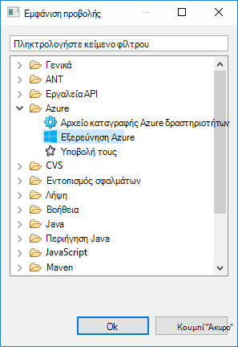

2. Κάντε δεξί κλικ στον κόμβο **Azure** στην **Εξερεύνηση Azure**και, στη συνέχεια, κάντε κλικ στην επιλογή **Διαχείριση εγγραφών**.

3. Στο παράθυρο διαλόγου **Διαχείριση εγγραφών** , κάντε κλικ στην επιλογή **Είσοδος** και εισαγάγετε τα διαπιστευτήριά σας Azure.

    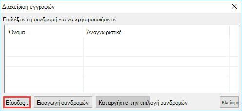

4. Αφού έχετε συνδεθεί, το παράθυρο διαλόγου **Διαχείριση εγγραφών** παραθέτει όλες τις συνδρομές Azure που σχετίζεται με τα διαπιστευτήρια. Κάντε κλικ στο κουμπί **Κλείσιμο** στο παράθυρο διαλόγου.

5. Στην καρτέλα Azure Explorer, αναπτύξτε **HDInsight** για να δείτε το HDInsight τους συμπλεγμάτων κάτω από τη συνδρομή σας.

    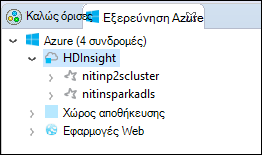

6. Περαιτέρω, μπορείτε να επεκτείνετε έναν κόμβο όνομα συμπλέγματος για να δείτε τους πόρους (π.χ. λογαριασμοί χώρου αποθήκευσης) που σχετίζεται με το σύμπλεγμα.

    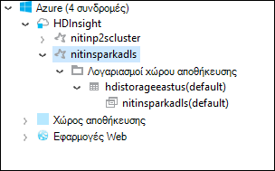

## Ρύθμιση του έργου τους Scala για ένα σύμπλεγμα HDInsight τους

1. Από το χώρο εργασίας Έκλειψη IDE, κάντε κλικ στο **αρχείο**, κάντε κλικ στην επιλογή **Δημιουργία**και, στη συνέχεια, κάντε κλικ στην επιλογή **έργο**. 

2. Στον οδηγό **Νέου έργου** , αναπτύξτε το στοιχείο **HDInsight**, επιλέξτε **τους σε HDInsight (Scala)**και, στη συνέχεια, κάντε κλικ στο κουμπί **Επόμενο**.

    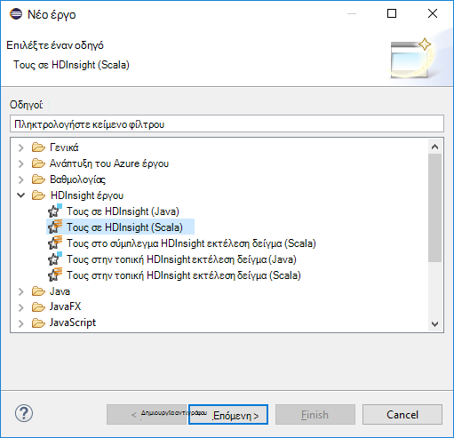

3. Στο παράθυρο διαλόγου **Νέο έργο Scala HDInsight** , πληκτρολογήστε/επιλογή τιμές όπως φαίνεται στην παρακάτω εικόνα και, στη συνέχεια, κάντε κλικ στο κουμπί **Επόμενο**.

    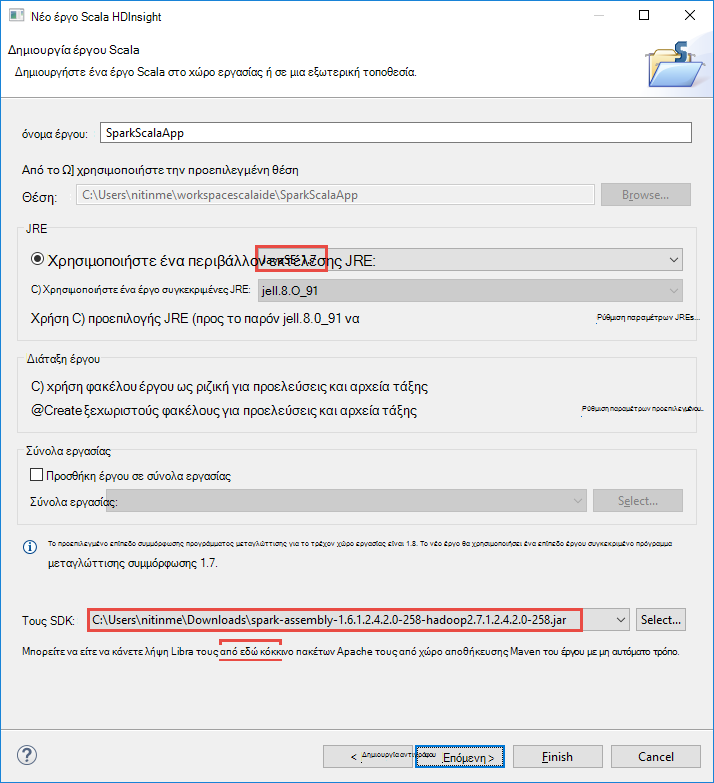

    * Πληκτρολογήστε ένα όνομα για το έργο.
    * Στο πλαίσιο **JRE** , βεβαιωθείτε ότι **χρησιμοποιείται ένα περιβάλλον εκτέλεσης JRE** έχει οριστεί σε **JavaSE 1.7**.
    * Βεβαιωθείτε ότι έχει οριστεί SDK τους στη θέση όπου έχετε κάνει λήψη του SDK. Η σύνδεση στη θέση λήψης περιλαμβάνει τις [προϋποθέσεις](#prerequisites) νωρίτερα σε αυτό το θέμα. Μπορείτε επίσης να κάνετε λήψη του SDK από τη σύνδεση που περιλαμβάνονται σε αυτό το πλαίσιο διαλόγου, όπως φαίνεται στην παραπάνω εικόνα.    

4. Στο επόμενο παράθυρο διαλόγου, κάντε κλικ στην καρτέλα **βιβλιοθήκες** και, στη συνέχεια, κάντε διπλό κλικ σε **Βιβλιοθήκη συστήματος JRE [JavaSE-1.7]**.

    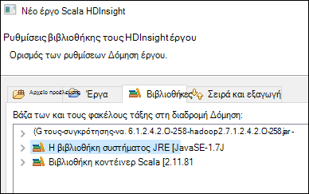

5. Στο παράθυρο διαλόγου **Επεξεργασία βιβλιοθήκης** , βεβαιωθείτε ότι το **Περιβάλλον εκτέλεσης** έχει οριστεί σε **JavaSE-1.7(jdk1.7.0_79)**. Εάν αυτό δεν είναι διαθέσιμο ως επιλογή, ακολουθήστε τα παρακάτω βήματα.

    1. Ενεργοποιήστε την επιλογή **Εναλλακτική JRE** και δείτε εάν **JavaSE-1.7(jdk1.7.0_79)** είναι διαθέσιμος.
    2. Εάν όχι, κάντε κλικ στο κουμπί **Εγκατάσταση JREs** .

          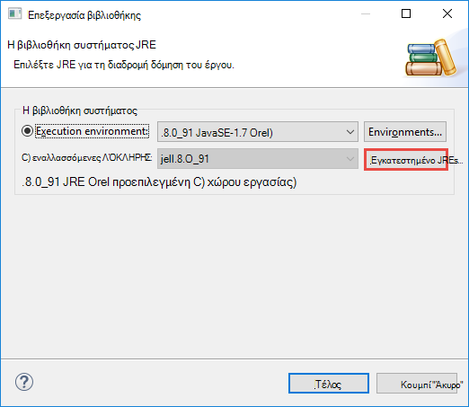

    3. Στο παράθυρο διαλόγου **Εγκατεστημένο JREs** , κάντε κλικ στην επιλογή **Προσθήκη**.

          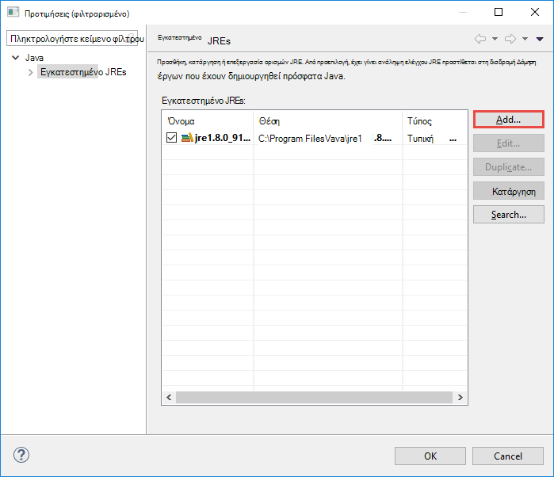  

    4. Στο παράθυρο διαλόγου **JRE Type** , επιλέξτε **Τυπική Εικονική**και, στη συνέχεια, κάντε κλικ στο κουμπί **Επόμενο**

          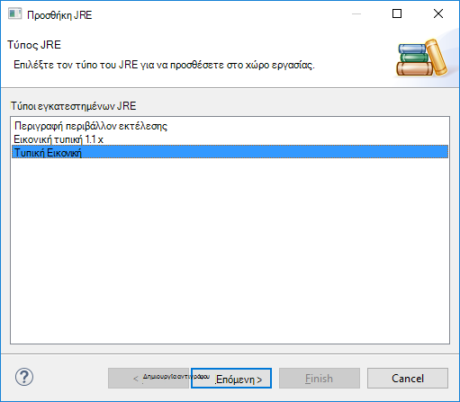  

    5. Στο παράθυρο διαλόγου **Ορισμός JRE** , κάντε κλικ στην επιλογή καταλόγου, και, στη συνέχεια, μεταβείτε στη θέση για την εγκατάσταση JDK 7 και επιλέξτε τον ριζικό φάκελο για **jdk1.7.0_79**.

          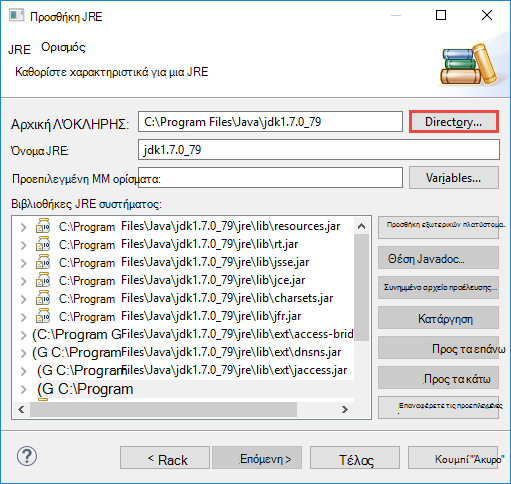  

    6. Κάντε κλικ στο κουμπί **Τέλος**. Στο παράθυρο διαλόγου **JREs εγκατασταθεί** , επιλέξτε το JRE που προστέθηκε πρόσφατα και, στη συνέχεια, κάντε κλικ στο κουμπί **OK**.

           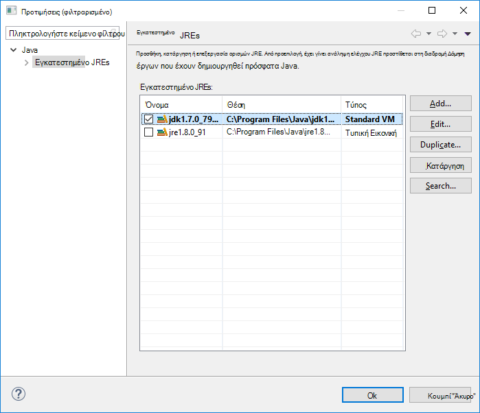

    7. Θα πρέπει να αναφέρεται JRE που προστέθηκε πρόσφατα για το **Περιβάλλον εκτέλεσης**. Κάντε κλικ στο κουμπί **Τέλος**.

           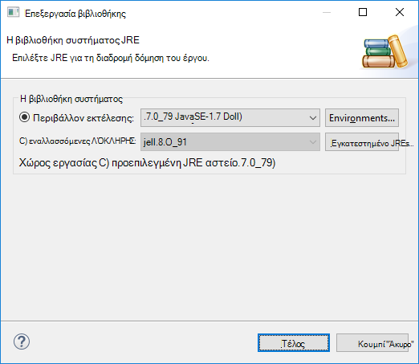

6. Επιστρέψτε στην καρτέλα **βιβλιοθήκες** , κάντε διπλό κλικ στο **Κοντέινερ βιβλιοθήκη Scala [2.11.8]**. Στο παράθυρο διαλόγου **Επεξεργασία βιβλιοθήκης** , επιλέξτε **σταθερή Scala βιβλιοθήκη κοντέινερ: 2.10.6**. 

    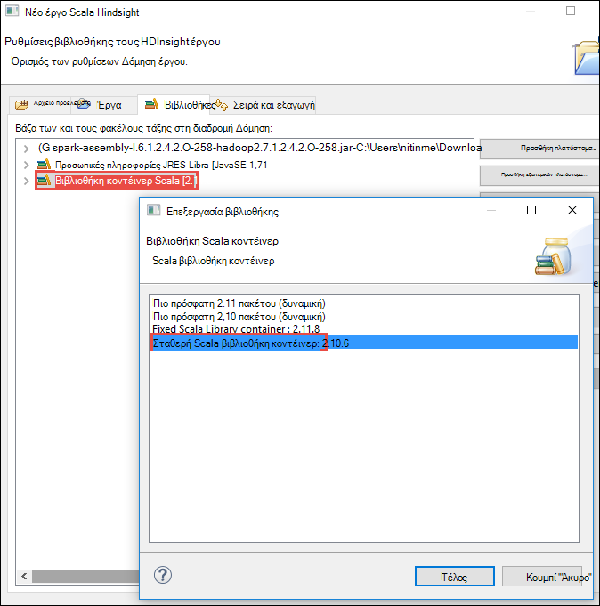

    Κάντε κλικ στην επιλογή **Ολοκλήρωση** μέχρι να κλείσετε το παράθυρο διαλόγου ρυθμίσεις έργου.

## Δημιουργία εφαρμογής Scala για τους HDInsight συμπλέγματος

1. Στο ήδη ανοιχτό IDE Έκλειψη, από την **Εξερεύνηση πακέτου**, αναπτύξτε το έργο που δημιουργήσατε νωρίτερα, κάντε δεξί κλικ **src**, επιλέξτε **Δημιουργία**και, στη συνέχεια, κάντε κλικ στην επιλογή **άλλο**.

2. Στο παράθυρο διαλόγου **Επιλέξτε έναν οδηγό** , αναπτύξτε **Τους οδηγούς Scala**, κάντε κλικ στο **Αντικείμενο Scala**και, στη συνέχεια, κάντε κλικ στο κουμπί **Επόμενο**.

    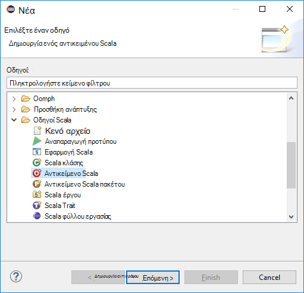

3. Στο παράθυρο διαλόγου **Δημιουργία νέου αρχείου** , πληκτρολογήστε ένα όνομα για το αντικείμενο και, στη συνέχεια, κάντε κλικ στο κουμπί **Τέλος**.

    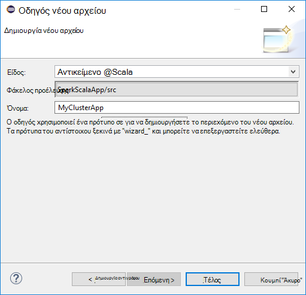

4. Επικολλήστε τον ακόλουθο κώδικα στο πρόγραμμα επεξεργασίας κειμένου.

        import org.apache.spark.SparkConf
        import org.apache.spark.SparkContext
    
        object MyClusterApp{
          def main (arg: Array[String]): Unit = {
            val conf = new SparkConf().setAppName("MyClusterApp")
            val sc = new SparkContext(conf)
        
            val rdd = sc.textFile("wasbs:///HdiSamples/HdiSamples/SensorSampleData/hvac/HVAC.csv")
        
            //find the rows which have only one digit in the 7th column in the CSV
            val rdd1 =  rdd.filter(s => s.split(",")(6).length() == 1)
        
            rdd1.saveAsTextFile("wasbs:///HVACOut")
          }     
        }

5. Εκτελέστε την εφαρμογή σε ένα σύμπλεγμα HDInsight τους.

    1. Από την **Εξερεύνηση πακέτου**, κάντε δεξί κλικ στο όνομα του έργου και, στη συνέχεια, επιλέξτε **Υποβολή εφαρμογή τους με το HDInsight**.      

    2. Στο παράθυρο διαλόγου **Υποβολής τους** , δώστε τις παρακάτω τιμές.

        * Για το **Όνομα του συμπλέγματος**, επιλέξτε το σύμπλεγμα HDInsight τους στην οποία θέλετε να εκτελέσετε την εφαρμογή σας.

        * Πρέπει να επιλέξτε ένα αντικείμενο από το έργο Έκλειψη ή επιλέξτε ένα από σκληρό δίσκο.

        * Σε σχέση με το πλαίσιο κειμένου **όνομα κλάσης κύρια** , πληκτρολογήστε το όνομα του αντικειμένου που καθορίσατε στον κώδικα (ανατρέξτε στην παρακάτω εικόνα).

            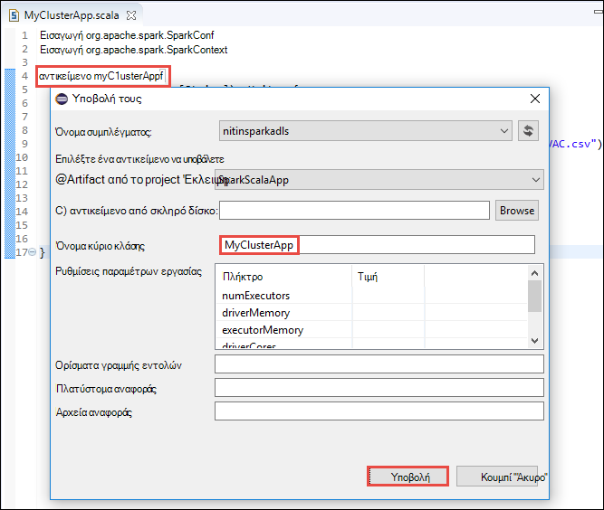

        * Επειδή τον κώδικα της εφαρμογής σε αυτό το παράδειγμα δεν απαιτείται κάποια ορίσματα γραμμής εντολής ή αναφορά βάζα των ή αρχεία, μπορείτε να αφήσετε κενό τα υπόλοιπα πλαίσια κειμένου.

        * Κάντε κλικ στην επιλογή **Υποβολή**.

    3. Στην καρτέλα **Υποβολής τους** θα πρέπει να ξεκινήσει η εμφάνιση της προόδου. Μπορείτε να διακόψετε την εφαρμογή, κάνοντας κλικ στο κόκκινο κουμπί στο παράθυρο "Τους υποβολής". Μπορείτε επίσης να προβάλετε τα αρχεία καταγραφής για αυτήν την εφαρμογή συγκεκριμένων εκτελέσετε επιλέγοντας το εικονίδιο της υδρογείου (δηλώνεται από το μπλε πλαίσιο στην εικόνα).

        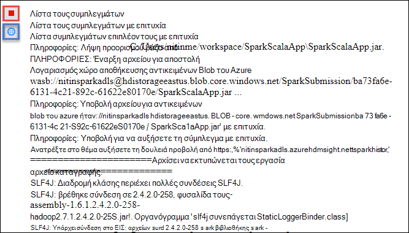

    Στην επόμενη ενότητα, μπορείτε να μάθετε πώς μπορείτε να μεταβείτε στη εργασία εξόδου χρησιμοποιώντας τα εργαλεία HDInsight του Κιτ εργαλείων Azure για Έκλειψη.

## Πρόσβαση και να διαχειριστείτε τους HDInsight συμπλεγμάτων χρησιμοποιώντας τα εργαλεία HDInsight του Κιτ εργαλείων Azure για Έκλειψη

Μπορείτε να εκτελέσετε διάφορες εργασίες χρησιμοποιώντας τα εργαλεία HDInsight.

### Πρόσβαση στο κοντέινερ χώρου αποθήκευσης για το σύμπλεγμα

1. Από την Εξερεύνηση Azure, αναπτύξτε τον κόμβο του ριζικού **HDInsight** για να δείτε μια λίστα με τους HDInsight συμπλεγμάτων που είναι διαθέσιμες.

3. Αναπτύξτε το όνομα του συμπλέγματος για να δείτε το λογαριασμό χώρου αποθήκευσης και το προεπιλεγμένο κοντέινερ χώρου αποθήκευσης για το σύμπλεγμα.

    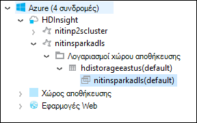

4. Κάντε κλικ στο όνομα κοντέινερ χώρου αποθήκευσης που σχετίζεται με το σύμπλεγμα. Στο δεξιό παράθυρο, θα πρέπει να βλέπετε ένα φάκελο που ονομάζεται **HVACOut**. Κάντε διπλό κλικ για να ανοίξετε το φάκελο και θα δείτε **τμήμα -*** αρχεία. Ανοίξτε ένα από αυτά τα αρχεία για να δείτε το αποτέλεσμα της εφαρμογής.

### Πρόσβαση στο διακομιστή ιστορικού τους

1. Από την **Εξερεύνηση Azure**, κάντε δεξιό κλικ στο όνομά σας σύμπλεγμα τους και, στη συνέχεια, επιλέξτε **Άνοιγμα περιβάλλον εργασίας Χρήστη ιστορικού τους**. Όταν σας ζητηθεί, πληκτρολογήστε τα διαπιστευτήρια διαχειριστή για το σύμπλεγμα. Πρέπει να έχετε καθορίσει αυτά κατά την προμήθεια του συμπλέγματος.

2. Στον πίνακα εργαλείων του διακομιστή ιστορικού τους, μπορείτε να δείτε για την εφαρμογή που μόλις τελειώσετε εκτελείται, χρησιμοποιώντας το όνομα της εφαρμογής. Στο παραπάνω κώδικα, ορίζετε το όνομα εφαρμογής χρησιμοποιώντας `val conf = new SparkConf().setAppName("MyClusterApp")`. Επομένως, το όνομα της εφαρμογής τους ήταν **MyClusterApp**.

### Εκκίνηση της πύλης Ambari

Από την **Εξερεύνηση Azure**, κάντε δεξιό κλικ στο όνομά σας σύμπλεγμα τους και, στη συνέχεια, επιλέξτε **Άνοιγμα πύλη διαχείρισης του συμπλέγματος (Ambari)**. Όταν σας ζητηθεί, πληκτρολογήστε τα διαπιστευτήρια διαχειριστή για το σύμπλεγμα. Πρέπει να έχετε καθορίσει αυτά κατά την προμήθεια του συμπλέγματος.

### Διαχείριση των συνδρομών Azure

Από προεπιλογή, τα εργαλεία HDInsight στο Κιτ εργαλείων Azure για Έκλειψη παραθέτει των συμπλεγμάτων τους από όλες τις συνδρομές σας Azure. Εάν χρειάζεται, μπορείτε να καθορίσετε τις συνδρομές για την οποία θέλετε να έχετε πρόσβαση στο σύμπλεγμα. Από την **Εξερεύνηση Azure**, κάντε δεξί κλικ στον ριζικό κόμβο **Azure** και, στη συνέχεια, κάντε κλικ στην επιλογή **Διαχείριση εγγραφών**. Από το παράθυρο διαλόγου, καταργήστε την επιλογή των πλαισίων ελέγχου σε σχέση με τη συνδρομή που δεν θέλετε να έχετε πρόσβαση και, στη συνέχεια, κάντε κλικ στο κουμπί **Κλείσιμο**. Μπορείτε επίσης να επιλέξετε **Αποσύνδεση** εάν θέλετε να αποσυνδεθείτε από τη συνδρομή σας στο Azure.

## Εκτέλεση μιας εφαρμογής Scala τους τοπικά

Μπορείτε να χρησιμοποιήσετε τα εργαλεία HDInsight στο Κιτ εργαλείων Azure για Έκλειψη να εκτελούν εφαρμογές Scala τους τοπικά σε σας σταθμούς εργασίας. Συνήθως, όπως εφαρμογές δεν πρέπει να αποκτήσει πρόσβαση σε πόρους συμπλέγματος όπως κοντέινερ χώρου αποθήκευσης και μπορεί να είναι εκτέλεση και ελεγχθεί τοπικά.

### Προϋπόθεση

Κατά την εκτέλεση της τοπικής εφαρμογής Scala τους σε έναν υπολογιστή Windows, μπορεί να λάβετε μια εξαίρεση όπως εξηγείται στο [ΤΟΥΣ-2356](https://issues.apache.org/jira/browse/SPARK-2356) που προκύπτει λόγω που λείπουν **WinUtils.exe** σε λειτουργικό σύστημα Windows. Για να επιλύσετε αυτό το σφάλμα, πρέπει να [κάνετε λήψη το εκτελέσιμο αρχείο από εδώ](http://public-repo-1.hortonworks.com/hdp-win-alpha/winutils.exe) σε μια θέση όπως **C:\WinUtils\bin**. Στη συνέχεια, πρέπει να προσθέσετε μια μεταβλητή περιβάλλοντος **HADOOP_HOME** και ορίστε την τιμή της μεταβλητής σε **C\WinUtils**.

### Εκτέλεση μιας τοπικής εφαρμογής Scala τους  

1. Εκκίνηση Έκλειψη και δημιουργήστε ένα νέο έργο. Στο νέο παράθυρο διαλόγου του project, κάντε τις ακόλουθες επιλογές και, στη συνέχεια, κάντε κλικ στο κουμπί **Επόμενο**.

    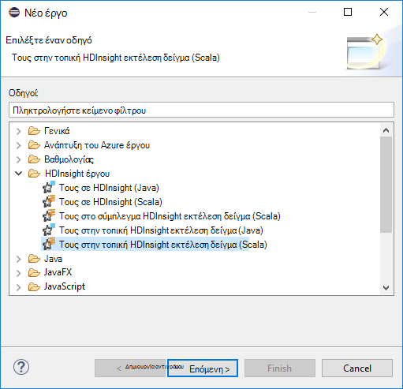

    * Από το αριστερό παράθυρο, επιλέξτε **HDInsight**.
    * Στο δεξιό παράθυρο, επιλέξτε **τους στο δείγμα εκτέλεση HDInsight τοπικό (Scala)**.
    * Κάντε κλικ στο κουμπί **Επόμενο**.

2. Για να παρέχετε τις λεπτομέρειες του έργου, ακολουθήστε τα βήματα 3 έως 6, όπως φαίνεται στην εικόνα στην προηγούμενη ενότητα [Ρύθμιση του έργου εφαρμογής Scala τους για ένα σύμπλεγμα HDInsight τους](#set-up-a-spark-scala-application-project-for-an-hdinsight-spark cluster).

3. Το πρότυπο προσθέτει ένα δείγμα κώδικα (**LogQuery**) κάτω από το φάκελο **src** που μπορείτε να εκτελέσετε τοπικά στον υπολογιστή σας.

    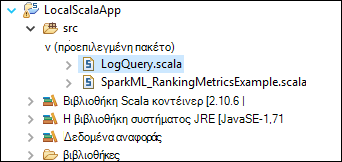

4.  Κάντε δεξί κλικ στη γραμμή εφαρμογής **LogQuery** , τοποθετήστε το δείκτη για να **εκτελέσετε ως**και, στη συνέχεια, κάντε κλικ στην επιλογή **1 Scala εφαρμογής**. Θα δείτε το αποτέλεσμα ως εξής στην καρτέλα **κονσόλας** στο κάτω μέρος.

    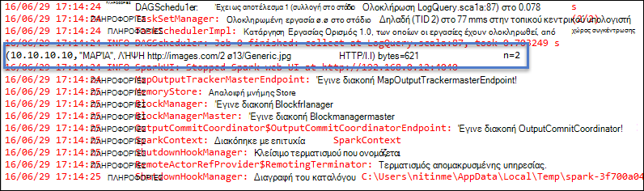

## Σχόλια και γνωστά θέματα

Προς το παρόν προβολή τους εξόδους άμεσα δεν υποστηρίζεται και Εργαζόμαστε για αυτό το θέμα.

Εάν έχετε οποιοδήποτε προτάσεις ή σχόλια ή εάν αντιμετωπίσετε προβλήματα κατά τη χρήση αυτού του εργαλείου, μην διστάσεις να αποθέσετε μας ένα μήνυμα ηλεκτρονικού ταχυδρομείου στο hdivstool στο microsoft dot com.

## Δείτε επίσης

* [Επισκόπηση: Apache τους σε Azure HDInsight](hdinsight-apache-spark-overview.md)

### Σενάρια

* [Τους με το BI: Εκτέλεση ανάλυσης αλληλεπιδραστικών δεδομένων με χρήση τους σε HDInsight με εργαλεία Επιχειρηματικής ευφυΐας](hdinsight-apache-spark-use-bi-tools.md)

* [Τους με μηχανικής εκμάθησης: χρήση τους σε HDInsight για την ανάλυση δόμησης θερμοκρασίας με τη χρήση δεδομένων HVAC](hdinsight-apache-spark-ipython-notebook-machine-learning.md)

* [Τους με μηχανικής εκμάθησης: χρήση τους σε HDInsight πρόβλεψη της εστίασης στα αποτελέσματα ελέγχου](hdinsight-apache-spark-machine-learning-mllib-ipython.md)

* [Τους ροής: Χρήση τους σε HDInsight για τη δημιουργία εφαρμογών σε πραγματικό χρόνο ροής](hdinsight-apache-spark-eventhub-streaming.md)

* [Ανάλυση καταγραφής τοποθεσία Web χρησιμοποιώντας τους στο HDInsight](hdinsight-apache-spark-custom-library-website-log-analysis.md)

### Δημιουργία και εκτέλεση εφαρμογών

* [Δημιουργήστε μια μεμονωμένη εφαρμογή χρησιμοποιώντας Scala](hdinsight-apache-spark-create-standalone-application.md)

* [Απομακρυσμένη εκτέλεση εργασιών σε ένα σύμπλεγμα τους χρησιμοποιώντας Λίβιος](hdinsight-apache-spark-livy-rest-interface.md)

### Εργαλεία και επεκτάσεις

* [Χρησιμοποιήστε εργαλεία HDInsight Κιτ εργαλείων Azure για IntelliJ για να δημιουργήσετε και να υποβάλετε τους Scala εφαρμογών](hdinsight-apache-spark-intellij-tool-plugin.md)

* [Εργαλεία HDInsight χρήση του Κιτ εργαλείων Azure για IntelliJ για τον εντοπισμό σφαλμάτων αυξήσετε εφαρμογές από απόσταση](hdinsight-apache-spark-intellij-tool-plugin-debug-jobs-remotely.md)

* [Χρήση Zeppelin σημειωματάρια με ένα σύμπλεγμα τους σε HDInsight](hdinsight-apache-spark-use-zeppelin-notebook.md)

* [Διαθέσιμο για Jupyter σημειωματαρίου στο σύμπλεγμα τους για HDInsight πυρήνων](hdinsight-apache-spark-jupyter-notebook-kernels.md)

* [Χρήση εξωτερικών πακέτων με σημειωματάρια Jupyter](hdinsight-apache-spark-jupyter-notebook-use-external-packages.md)

* [Εγκατάσταση Jupyter στον υπολογιστή σας και να συνδεθείτε με ένα σύμπλεγμα HDInsight τους](hdinsight-apache-spark-jupyter-notebook-install-locally.md)

### Διαχείριση πόρων

* [Διαχείριση πόρων για το σύμπλεγμα Apache τους στο Azure HDInsight](hdinsight-apache-spark-resource-manager.md)

* [Παρακολούθηση και εντοπισμού σφαλμάτων εργασίες που εκτελείται σε ένα σύμπλεγμα Apache τους στο HDInsight](hdinsight-apache-spark-job-debugging.md)
