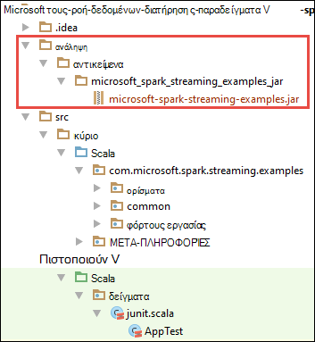

<properties 
    pageTitle="Χρήση Azure συμβάν διανομείς με τους Apache στο HDInsight για την επεξεργασία δεδομένων ροής | Microsoft Azure" 
    description="Οδηγίες βήμα προς βήμα σχετικά με τον τρόπο για την αποστολή δεδομένων ροή διανομέα συμβάν Azure και, στη συνέχεια, λαμβάνετε αυτά τα συμβάντα στο τους χρησιμοποιώντας μια εφαρμογή scala" 
    services="hdinsight" 
    documentationCenter="" 
    authors="nitinme" 
    manager="jhubbard" 
    editor="cgronlun"
    tags="azure-portal"/>

<tags 
    ms.service="hdinsight" 
    ms.workload="big-data" 
    ms.tgt_pltfrm="na" 
    ms.devlang="na" 
    ms.topic="article" 
    ms.date="09/30/2016" 
    ms.author="nitinme"/>

# Τους ροής: Διεργασία συμβάντα από διανομείς συμβάν Azure με τους Apache σύμπλεγμα σε HDInsight Linux

Η ροή τους επεκτείνει το μέγεθος των κύριων API τους για να δημιουργήσετε εφαρμογές επεξεργασίας μεταβλητού μεγέθους, υψηλής ταχύτητας μετάδοσης, ανοχή ροής. Μπορεί να είναι κατάποση δεδομένων από πολλές προελεύσεις. Σε αυτό το άρθρο χρησιμοποιούμε διανομείς συμβάν Azure για ingest δεδομένων. Διανομείς συμβάν είναι ένα σύστημα ιδιαίτερα μεταβλητού μεγέθους κατάποσης που μπορούν να πρόσληψη εκατομμύρια συμβάντα ανά δευτερόλεπτο. 

Σε αυτό το πρόγραμμα εκμάθησης, θα μάθετε πώς μπορείτε να δημιουργήσετε ένα συμβάν διανομέα Azure, πώς μπορείτε να ingest μηνύματα σε ένα συμβάν διανομέα, χρησιμοποιώντας μια εφαρμογή κονσόλας σε Java και να τις ανακτήσετε παράλληλα χρησιμοποιώντας μια εφαρμογή τους γραμμένο σε Scala. Αυτή η εφαρμογή χρησιμοποιεί τα δεδομένα που διοχετεύονται μέσω του συμβάντος διανομείς και δρομολογεί στις διαφορετικές εξόδους (Azure χώρο αποθήκευσης Blob Hive πίνακα και πίνακα SQL).

> [AZURE.NOTE] Για να ακολουθήσετε τις οδηγίες σε αυτό το άρθρο, θα πρέπει να χρησιμοποιήσετε και τις δύο εκδόσεις του Azure πύλη του. Για να δημιουργήσετε ένα συμβάν διανομέα θα χρησιμοποιήσετε την [κλασική Azure πύλη](https://manage.windowsazure.com). Για να εργαστείτε με το σύμπλεγμα τους HDInsight, θα χρησιμοποιήσετε την [Πύλη Azure](https://portal.azure.com/).  

**Προαπαιτούμενα στοιχεία:**

Πρέπει να έχετε τα εξής:

- Μια συνδρομή του Azure. Ανατρέξτε στο θέμα [λήψη Azure δωρεάν δοκιμαστικής έκδοσης](https://azure.microsoft.com/documentation/videos/get-azure-free-trial-for-testing-hadoop-in-hdinsight/).
- Ένα σύμπλεγμα Apache τους. Για οδηγίες, ανατρέξτε στο θέμα [Δημιουργία τους Apache συμπλεγμάτων στο Azure HDInsight](hdinsight-apache-spark-jupyter-spark-sql.md).
- Κιτ ανάπτυξης Java Oracle. Μπορείτε να το εγκαταστήσετε από [εδώ](http://www.oracle.com/technetwork/java/javase/downloads/jdk8-downloads-2133151.html).
- Μια Java IDE. Σε αυτό το άρθρο χρησιμοποιεί IntelliJ ΙΔΈΑ 15.0.1. Μπορείτε να το εγκαταστήσετε από [εδώ](https://www.jetbrains.com/idea/download/).
- Το πρόγραμμα οδήγησης JDBC της Microsoft για τον SQL Server, v4.1 ή νεότερη έκδοση. Αυτό είναι απαραίτητο να συντάξετε το συμβάν δεδομένων σε μια βάση δεδομένων SQL Server. Μπορείτε να το εγκαταστήσετε από [εδώ](https://msdn.microsoft.com/sqlserver/aa937724.aspx).
- Μια βάση δεδομένων Azure SQL. Για οδηγίες, ανατρέξτε στο θέμα [Δημιουργία μιας βάσης δεδομένων SQL σε λεπτά](../sql-database/sql-database-get-started.md).

## Τι κάνει αυτή η λύση;

Πρόκειται για τον τρόπο ροής της ροής λύσης:

1. Δημιουργήστε ένα διανομέα συμβάν Azure που θα λάβουν μια ροή συμβάντων.

2. Εκτέλεση μιας τοπικής μεμονωμένη εφαρμογή που δημιουργεί συμβάντα και το προωθεί την ενότητα συμβάντων Azure. Το δείγμα εφαρμογής που το κάνει αυτό δημοσιεύονται στο [https://github.com/hdinsight/spark-streaming-data-persistence-examples](https://github.com/hdinsight/spark-streaming-data-persistence-examples).

2. Εκτελέστε μια ροή εφαρμογή απομακρυσμένα σε ένα σύμπλεγμα τους που διαβάζει ροής συμβάντα από διανομέα συμβάν Azure και προωθεί σε διαφορετικές θέσεις (αντικειμένων Blob του Azure Hive πίνακα και πίνακα βάσης δεδομένων SQL). 

## Δημιουργία διανομέα Azure συμβάντος

1. Από την [Πύλη Azure](https://manage.windowsazure.com), επιλέξτε **ΔΗΜΙΟΥΡΓΊΑ** > **Bus υπηρεσίας** > **Διανομέα συμβάν** > **Δημιουργία προσαρμοσμένης**.

2. Στην οθόνη **Προσθήκη διανομέα νέου συμβάντος** , πληκτρολογήστε ένα **Όνομα για το συμβάν διανομέα**, επιλέξτε την **περιοχή** για να δημιουργήσετε την ενότητα, και δημιουργήστε ένα νέο χώρο ονομάτων ή επιλέξτε ένα υπάρχον. Κάντε κλικ στο **βέλος** για να συνεχίσετε.

    ![σελίδα 1 του οδηγού] (./media/hdinsight-apache-spark-eventhub-streaming/hdispark.streaming.create.event.hub.png "Δημιουργήστε ένα διανομέα Azure συμβάντος")

    > [AZURE.NOTE] Θα πρέπει να επιλέξετε στην ίδια **θέση** ως το σύμπλεγμά σας Apache τους στο HDInsight για να μειώσετε λανθάνων χρόνος και έξοδα.

3. Στην οθόνη **Ρύθμιση παραμέτρων συμβάντων διανομέα** , πληκτρολογήστε τις τιμές **Πλήθος διαμερισμάτων** και **Διατήρηση του μηνύματος** και, στη συνέχεια, κάντε κλικ στο σημάδι ελέγχου. Για αυτό το παράδειγμα, χρησιμοποιήστε ένα πλήθος διαμερισμάτων 10 και ένα μήνυμα διατήρησης του 1. Σημείωση το πλήθος partition επειδή αυτή η τιμή θα χρειαστεί αργότερα.

    ![σελίδα 2 του οδηγού] (./media/hdinsight-apache-spark-eventhub-streaming/hdispark.streaming.create.event.hub2.png "Καθορισμός partition μέγεθος και τη διατήρηση των ημερών για διανομέα συμβάντος")

4. Κάντε κλικ στην επιλογή ενότητα συμβάντων που δημιουργήσατε, κάντε κλικ στην επιλογή **Ρύθμιση παραμέτρων**και, στη συνέχεια, να δημιουργήσετε δύο πολιτικές πρόσβασης για την ενότητα συμβάντων.

    <table>
    <tr><th>Όνομα</th><th>Δικαιώματα</th></tr>
    <tr><td>mysendpolicy</td><td>Αποστολή</td></tr>
    <tr><td>myreceivepolicy</td><td>Ακρόαση</td></tr>
    </table>

    Αφού δημιουργήσετε τα δικαιώματα, επιλέξτε το εικονίδιο **Αποθήκευση** στο κάτω μέρος της σελίδας. Αυτό δημιουργεί τις πολιτικές κοινόχρηστης πρόσβασης που θα χρησιμοποιηθεί για την αποστολή (**mysendpolicy**) και να ακούσετε (**myreceivepolicy**) αυτό το συμβάν διανομέα.

    ![πολιτικές] (./media/hdinsight-apache-spark-eventhub-streaming/hdispark.streaming.event.hub.policies.png "Δημιουργία συμβάντος διανομέα πολιτικές")

    
5. Στην ίδια σελίδα, λαμβάνουν μια σημείωση από τα πλήκτρα πολιτικής που δημιουργούνται για τις δύο πολιτικές. Αποθηκεύστε τα πλήκτρα, επειδή θα χρησιμοποιηθούν αργότερα.

    ![πλήκτρα πολιτικής] (./media/hdinsight-apache-spark-eventhub-streaming/hdispark.streaming.event.hub.policy.keys.png "Αποθήκευση πλήκτρα πολιτικής")

6. Στη σελίδα **πίνακα εργαλείων** , κάντε κλικ στην επιλογή **Πληροφορίες σύνδεσης** από το κάτω μέρος για να ανακτήσετε και να αποθηκεύσετε τις συμβολοσειρές σύνδεσης για το συμβάν διανομέα, χρησιμοποιώντας τις δύο πολιτικές.

    ![πλήκτρα πολιτικής] (./media/hdinsight-apache-spark-eventhub-streaming/hdispark.streaming.event.hub.policy.connection.strings.png "Αποθήκευση συμβολοσειρές σύνδεσης πολιτικής")

## Χρήση μιας εφαρμογής Scala για την αποστολή μηνυμάτων με διανομέα συμβάντος

Σε αυτήν την ενότητα, μπορείτε να χρησιμοποιήσετε μια μεμονωμένη εφαρμογή Scala τοπικό για να στείλετε μια ροή συμβάντων σε διανομέα συμβάν Azure που δημιουργήσατε στο προηγούμενο βήμα. Αυτή η εφαρμογή είναι διαθέσιμη στο GitHub στο [https://github.com/hdinsight/eventhubs-sample-event-producer](https://github.com/hdinsight/eventhubs-sample-event-producer). Τα παρακάτω βήματα λαμβάνεται ως δεδομένο ότι έχετε ήδη να forked αυτό το αποθετήριο δεδομένων GitHub.

1. Ανοίξτε την εφαρμογή, **EventhubsSampleEventProducer**, σε IntelliJ ΙΔΈΑ.
    
2. Δημιουργήστε το έργο. Από το μενού " **Δημιουργία** ", κάντε κλικ στην επιλογή **Δημιουργία έργου**. Το αποτέλεσμα βάζο δημιουργείται στην περιοχή **\out\artifacts**.

>[AZURE.TIP] Μπορείτε επίσης να χρησιμοποιήσετε μια επιλογή είναι διαθέσιμη σε IntelliJ ΙΔΈΑ για να δημιουργήσετε απευθείας στο έργο από ένα αποθετήριο GitHub. Για να κατανοήσετε τον τρόπο για να χρησιμοποιήσετε αυτήν την προσέγγιση, χρησιμοποιήστε τις οδηγίες στην επόμενη ενότητα για οδηγίες. Σημειώστε ότι πολλά βήματα που περιγράφονται στην επόμενη ενότητα δεν θα ισχύουν για την εφαρμογή Scala που δημιουργείτε σε αυτό το βήμα. Για παράδειγμα:

> * Δεν θα πρέπει να ενημερώσετε το POM για να συμπεριλάβετε την έκδοση τους. Αυτό συμβαίνει επειδή υπάρχει χωρίς εξάρτηση σε τους για τη δημιουργία αυτής της εφαρμογής
> * Δεν θα πρέπει να προσθέσετε κάποια βάζα των εξαρτήσεων στη βιβλιοθήκη του έργου. Αυτό συμβαίνει επειδή αυτά τα πλατύστομα δεν είναι απαραίτητα για αυτό το έργο.

## Ενημερώστε την Scala ροή εφαρμογής για τη λήψη τα συμβάντα

Ένα δείγμα εφαρμογής Scala για να εμφανιστεί το συμβάν και να δρομολογήσετε σε διαφορετικούς προορισμούς είναι διαθέσιμη από την [https://github.com/hdinsight/spark-streaming-data-persistence-examples](https://github.com/hdinsight/spark-streaming-data-persistence-examples). Ακολουθήστε τα παρακάτω βήματα για να ενημερώσετε την εφαρμογή και να δημιουργήσετε το βάζο εξόδου.

1. Εκκίνηση IntelliJ ΙΔΈΑ από την οθόνη εκκίνησης, επιλέξτε **ανάληψη ελέγχου από την έκδοση στοιχείο ελέγχου** και, στη συνέχεια, κάντε κλικ στην επιλογή **Git**.
        
    

2. Στο παράθυρο διαλόγου **Αποθετήριο κλωνοποίηση** , δώστε τη διεύθυνση URL του αποθετηρίου Git να αντιγράψει το, καθορίστε τον κατάλογο για να αντιγράψετε σε και, στη συνέχεια, κάντε κλικ στην επιλογή **Αντιγραφή**.

    

    
3. Ακολουθήστε τις οδηγίες, έως ότου το έργο έχει κλωνοποιηθεί πλήρως. Πατήστε το **συνδυασμό πλήκτρων Alt + 1** για να ανοίξετε την **Προβολή του Project**. Θα πρέπει να μοιάζει με την παρακάτω.

    
    
4. Βεβαιωθείτε ότι ο κώδικας εφαρμογής έχει μεταγλωττιστεί με Java8. Για να βεβαιωθείτε ότι αυτό, κάντε κλικ στο **αρχείο**, κάντε κλικ στην επιλογή **Project δομή**και στην καρτέλα **έργο** , βεβαιωθείτε ότι το επίπεδο γλώσσας έργου έχει οριστεί σε **8 - Lambdas, πληκτρολογήστε σχόλια, κ.λπ.**.

    

5. Ανοίξτε το **pom.xml** και βεβαιωθείτε ότι η έκδοση τους είναι σωστή. Στην περιοχή <properties> κόμβος, αναζητήστε το παρακάτω τμήμα κώδικα και επαληθεύστε την έκδοση τους.

        <scala.version>2.10.4</scala.version>
        <scala.compat.version>2.10.4</scala.compat.version>
        <scala.binary.version>2.10</scala.binary.version>
        <spark.version>1.6.2</spark.version>
    
5. Η εφαρμογή απαιτεί δύο βάζα των εξαρτήσεων:

    * **Βάζο ακουστικό EventHub**. Αυτό είναι απαραίτητο για τους για να λάβετε τα μηνύματα από διανομέα συμβάν. Για να χρησιμοποιήσετε αυτό βάζο, ενημερώστε το **pom.xml** για να προσθέσετε τα ακόλουθα στην περιοχή `<dependencies>`.

            <dependency>
              <groupId>com.microsoft.azure</groupId>
              <artifactId>spark-streaming-eventhubs_2.10</artifactId>
              <version>1.6.0</version>
            </dependency> 

    * **Βάζο πρόγραμμα οδήγησης JDBC**. Αυτό είναι απαραίτητο για να γράψετε τα μηνύματα που ελήφθησαν από διανομέα συμβάν σε μια βάση δεδομένων Azure SQL. Μπορείτε να κάνετε λήψη v4.1 ή νεότερη έκδοση αυτού του αρχείου βάζο από [εδώ](https://msdn.microsoft.com/sqlserver/aa937724.aspx). Προσθήκη αναφοράς σε αυτό βάζο στη βιβλιοθήκη του έργου. Ακολουθήστε τα παρακάτω βήματα:

        1. Από το παράθυρο IntelliJ ΙΔΈΑ όπου έχετε εγκαταστήσει την εφαρμογή, ανοίξτε το, κάντε κλικ στο **αρχείο**, κάντε κλικ στην επιλογή **Δομή έργου**και, στη συνέχεια, κάντε κλικ στην επιλογή **βιβλιοθήκες**. 
        
        2. Κάντε κλικ στο εικονίδιο Προσθήκη (), κάντε κλικ στην επιλογή **Java**και, στη συνέχεια, μεταβείτε στη θέση όπου έχετε κάνει λήψη του βάζο πρόγραμμα οδήγησης JDBC. Ακολουθήστε τις οδηγίες για να προσθέσετε το αρχείο βάζο στη βιβλιοθήκη του έργου.

            ![Προσθήκη εξαρτήσεις που λείπουν] (./media/hdinsight-apache-spark-eventhub-streaming/add-missing-dependency-jars.png "Προσθήκη που λείπουν βάζα των εξαρτήσεων")

        3. Κάντε κλικ στο κουμπί **εφαρμογή**.

6. Δημιουργήστε το αρχείο εξόδου βάζο. Ακολουθήστε τα παρακάτω βήματα.
    1. Στο παράθυρο διαλόγου **Δομή έργου** , κάντε κλικ στην επιλογή **αντικείμενα** και, στη συνέχεια, κάντε κλικ στο σύμβολο συν. Από το αναδυόμενο παράθυρο, κάντε κλικ στην επιλογή **ΒΆΖΩΝ**και, στη συνέχεια, κάντε κλικ στην επιλογή **από λειτουργικές μονάδες με τις εξαρτήσεις**.

        

    1. Στο παράθυρο διαλόγου **Δημιουργία ΒΆΖΩΝ από λειτουργικές μονάδες** , κάντε κλικ στα αποσιωπητικά () σε σχέση με την **Κλάση κύριες**.

    1. Στο παράθυρο διαλόγου **Επιλέξτε κύριες τάξης** , επιλέξτε οποιαδήποτε από τις διαθέσιμες κλάσεις και, στη συνέχεια, κάντε κλικ στο κουμπί **OK**.

        

    1. Στο παράθυρο διαλόγου **Δημιουργία ΒΆΖΩΝ από λειτουργικές μονάδες** , βεβαιωθείτε ότι είναι ενεργοποιημένη η επιλογή για να **εξαγάγετε στον προορισμό ΒΆΖΟ** και, στη συνέχεια, κάντε κλικ στο κουμπί **OK**. Με τον τρόπο αυτό δημιουργείται ένα μεμονωμένο ΒΆΖΟ με όλες τις εξαρτήσεις.

        

    1. Στην καρτέλα **Διάταξη εξόδου** παραθέτει όλα τα πλατύστομα που περιλαμβάνονται ως τμήμα του Maven έργου. Μπορείτε να επιλέξετε και να διαγράψετε αυτές κατά την οποία η εφαρμογή Scala έχει καμία εξάρτηση απευθείας. Για την εφαρμογή δημιουργούμε εδώ, μπορείτε να καταργήσετε όλα εκτός από την τελευταία μία (**microsoft-τους-ροή-παραδείγματα μεταγλώττιση εξόδου**). Επιλέξτε το πλατύστομα για να διαγράψετε και, στη συνέχεια, κάντε κλικ στο εικονίδιο **Διαγραφή** ().

        

        Βεβαιωθείτε ότι είναι επιλεγμένο πλαίσιο **δομούνται δημιουργίας** , που διασφαλίζει ότι η βάζο δημιουργούνται κάθε φορά που είναι ενσωματωμένη ή ενημέρωση του έργου. Κάντε κλικ στην επιλογή **εφαρμογή** και, στη συνέχεια, **OK**.

    1. Στην καρτέλα **Διάταξη εξόδου** , δεξιά στο κάτω μέρος του πλαισίου **Διαθέσιμων στοιχείων** , έχετε την βάζο SQL JDBC που προσθέσατε προηγουμένως στη βιβλιοθήκη του έργου. Πρέπει να προσθέσετε στην καρτέλα **Διάταξη εξόδου** . Κάντε δεξί κλικ στο αρχείο βάζο και, στη συνέχεια, κάντε κλικ στην επιλογή **Εξαγωγή στο ριζικό κατάλογο εξόδου**.

          

        Στην καρτέλα **Διάταξη εξόδου** πρέπει τώρα να μοιάζει κάπως έτσι.

             

        Στο παράθυρο διαλόγου **Δομή έργου** , κάντε κλικ στην επιλογή **εφαρμογή** και, στη συνέχεια, κάντε κλικ στο κουμπί **OK**. 

    1. Από τη γραμμή μενού, κάντε κλικ στην επιλογή **Δημιουργία**και, στη συνέχεια, κάντε κλικ στην επιλογή **Δημιουργία έργου**. Μπορείτε επίσης να επιλέξετε **Αντικείμενα δημιουργία** για να δημιουργήσετε το βάζο. Το αποτέλεσμα βάζο δημιουργείται στην περιοχή **\out\artifacts**.

        

## Απομακρυσμένη εκτέλεση των εφαρμογών σε ένα σύμπλεγμα τους χρησιμοποιώντας Λίβιος

Θα χρησιμοποιήσουμε Λίβιος για να εκτελέσετε τη ροή εφαρμογή απομακρυσμένα σε ένα σύμπλεγμα τους. Για λεπτομερή ανάλυση σχετικά με τη χρήση Λίβιος με σύμπλεγμα τους HDInsight, ανατρέξτε στο θέμα [Υποβολή εργασίες από απόσταση σε ένα σύμπλεγμα Apache τους σε Azure HDInsight](hdinsight-apache-spark-livy-rest-interface.md). Πριν να αρχίσετε να εκτελεί το απομακρυσμένο εργασίες σε συμβάντα ροής χρησιμοποιώντας τους εκεί είναι δύο πράγματα που πρέπει να κάνετε:

1. Εκκίνηση της εφαρμογής τοπικό μεμονωμένη για τη δημιουργία συμβάντων και να αποστέλλονται με διανομέα συμβάν. Χρησιμοποιήστε την παρακάτω εντολή για να το κάνετε:

        java -cp EventhubsSampleEventProducer.jar com.microsoft.eventhubs.client.example.EventhubsClientDriver --eventhubs-namespace "mysbnamespace" --eventhubs-name "myeventhub" --policy-name "mysendpolicy" --policy-key "<policy key>" --message-length 32 --thread-count 32 --message-count -1

2. Αντιγράψτε τη ροή βάζο (**microsoft-τους-ροή-examples.jar**) για το χώρο αποθήκευσης αντικειμένων Blob του Azure που σχετίζεται με το σύμπλεγμα. Έτσι το βάζο προσβάσιμο για Λίβιος. Μπορείτε να χρησιμοποιήσετε [**AzCopy**](../storage/storage-use-azcopy.md), ένα βοηθητικό πρόγραμμα γραμμής εντολών, για να το κάνετε. Υπάρχουν πολλά άλλα προγράμματα-πελάτες, μπορείτε να χρησιμοποιήσετε για την αποστολή δεδομένων. Μπορείτε να βρείτε περισσότερες πληροφορίες για τους στην [Αποστολή δεδομένων για τις εργασίες Hadoop στο HDInsight](hdinsight-upload-data.md).

3. Εγκαταστήστε ΚΑΜΠΎΛΗ στον υπολογιστή όπου εκτελείτε αυτές τις εφαρμογές από. Χρησιμοποιούμε ΚΑΜΠΎΛΗ για να καλέσετε τα τελικά σημεία Λίβιος για να εκτελέσετε τις εργασίες από απόσταση.

### Εκτελέστε τις εφαρμογές για να λάβετε τα συμβάντα σε ένα Blob αποθήκευσης Azure ως κείμενο

Ανοίξτε μια γραμμή εντολών, μεταβείτε στον κατάλογο όπου έχετε εγκαταστήσει το ΚΑΜΠΎΛΗ και εκτελέστε την ακόλουθη εντολή (αντικατάσταση username/τον κωδικό πρόσβασης και σύμπλεγμα όνομα):

    curl -k --user "admin:mypassword1!" -v -H "Content-Type: application/json" -X POST --data @C:\Temp\inputBlob.txt "https://mysparkcluster.azurehdinsight.net/livy/batches"

Οι παράμετροι του αρχείου **inputBlob.txt** ορίζονται ως εξής:

    { "file":"wasbs:///example/jars/microsoft-spark-streaming-examples.jar", "className":"com.microsoft.spark.streaming.examples.workloads.EventhubsEventCount", "args":["--eventhubs-namespace", "mysbnamespace", "--eventhubs-name", "myeventhub", "--policy-name", "myreceivepolicy", "--policy-key", "<put-your-key-here>", "--consumer-group", "$default", "--partition-count", 10, "--batch-interval-in-seconds", 20, "--checkpoint-directory", "/EventCheckpoint", "--event-count-folder", "/EventCount/EventCount10"], "numExecutors":20, "executorMemory":"1G", "executorCores":1, "driverMemory":"2G" }

Κατανόηση πείτε μας τι είναι οι παράμετροι του αρχείου εισαγωγής:

* **το αρχείο** είναι τη διαδρομή προς το αρχείο βάζο εφαρμογής στον λογαριασμό Azure χώρου αποθήκευσης που σχετίζεται με το σύμπλεγμα.
* **όνομα κλάσης** είναι το όνομα της κατηγορίας στο το βάζο.
* στη λίστα των ορισμάτων που απαιτούνται από την κλάση είναι **ορισμάτων**
* **numExecutors** είναι ο αριθμός πυρήνων που χρησιμοποιούνται από τους για να εκτελέσετε τη ροή εφαρμογή. Αυτό πρέπει να είναι πάντα τουλάχιστον δύο φορές ο αριθμός των διαμερισμάτων διανομέα συμβάν.
* **executorMemory**, **executorCores**, **driverMemory** είναι παραμέτρους που χρησιμοποιούνται για να εκχωρήσετε πόρους απαιτείται η εφαρμογή ροής.

>[AZURE.NOTE] Δεν χρειάζεται να δημιουργήσετε τους φακέλους εξόδου (EventCheckpoint, EventCount/EventCount10) που χρησιμοποιούνται ως παράμετροι. Η ροή εφαρμογή δημιουργεί τους για εσάς.
    
Όταν εκτελείτε την εντολή, θα πρέπει να βλέπετε το αποτέλεσμα όπως το εξής:

    < HTTP/1.1 201 Created
    < Content-Type: application/json; charset=UTF-8
    < Location: /18
    < Server: Microsoft-IIS/8.5
    < X-Powered-By: ARR/2.5
    < X-Powered-By: ASP.NET
    < Date: Tue, 01 Dec 2015 05:39:10 GMT
    < Content-Length: 37
    <
    {"id":1,"state":"starting","log":[]}* Connection #0 to host mysparkcluster.azurehdinsight.net left intact

Σημειώστε το αναγνωριστικό δέσμης στην τελευταία γραμμή του αποτελέσματος (σε αυτό το παράδειγμα είναι "1"). Για να επαληθεύσετε ότι η εφαρμογή θα εκτελείται με επιτυχία, μπορείτε να ανατρέξετε στο λογαριασμό σας Azure χώρου αποθήκευσης που σχετίζεται με το σύμπλεγμα και θα πρέπει να βλέπετε το φάκελο **/EventCount/EventCount10** δημιουργήθηκε εκεί. Αυτός ο φάκελος πρέπει να περιέχει αντικείμενα BLOB που καταγράφει τον αριθμό των συμβάντων που υποβάλλονται σε επεξεργασία εντός της περιόδου που καθορίζεται για την παράμετρο **δέσμης χρονικού διαστήματος σε δευτερόλεπτα**.

Η εφαρμογή θα συνεχίσει να εκτελείται μέχρι να τερματίστε τη. Για να κάνετε αυτό, χρησιμοποιήστε την ακόλουθη εντολή:

    curl -k --user "admin:mypassword1!" -v -X DELETE "https://mysparkcluster.azurehdinsight.net/livy/batches/1"

### Εκτελέστε τις εφαρμογές για να λάβετε τα συμβάντα σε ένα Blob αποθήκευσης Azure ως JSON

Ανοίξτε μια γραμμή εντολών, μεταβείτε στον κατάλογο όπου έχετε εγκαταστήσει το ΚΑΜΠΎΛΗ και εκτελέστε την ακόλουθη εντολή (αντικατάσταση username/τον κωδικό πρόσβασης και σύμπλεγμα όνομα):

    curl -k --user "admin:mypassword1!" -v -H "Content-Type: application/json" -X POST --data @C:\Temp\inputJSON.txt "https://mysparkcluster.azurehdinsight.net/livy/batches"

Οι παράμετροι του αρχείου **inputJSON.txt** ορίζονται ως εξής:

    { "file":"wasbs:///example/jars/microsoft-spark-streaming-examples.jar", "className":"com.microsoft.spark.streaming.examples.workloads.EventhubsToAzureBlobAsJSON", "args":["--eventhubs-namespace", "mysbnamespace", "--eventhubs-name", "myeventhub", "--policy-name", "myreceivepolicy", "--policy-key", "<put-your-key-here>", "--consumer-group", "$default", "--partition-count", 10, "--batch-interval-in-seconds", 20, "--checkpoint-directory", "/EventCheckpoint", "--event-count-folder", "/EventCount/EventCount10", "--event-store-folder", "/EventStore10"], "numExecutors":20, "executorMemory":"1G", "executorCores":1, "driverMemory":"2G" }

Οι παράμετροι είναι παρόμοιο με το τι έχετε καθορίσει για το αποτέλεσμα του κειμένου, στο προηγούμενο βήμα. Ξανά, δεν χρειάζεται να δημιουργήσετε τους φακέλους εξόδου (EventCheckpoint, EventCount/EventCount10) που χρησιμοποιούνται ως παράμετροι. Η ροή εφαρμογή δημιουργεί τους για εσάς.

 Μετά την εκτέλεση της εντολής, μπορείτε να ανατρέξετε στο λογαριασμό σας Azure χώρου αποθήκευσης που σχετίζεται με το σύμπλεγμα και θα πρέπει να βλέπετε το φάκελο **/EventStore10** δημιουργήθηκε εκεί. Άνοιγμα οποιουδήποτε αρχείου με **τμήμα -** και μπορείτε το πρόθεμα πρέπει να δείτε τα συμβάντα που υποβάλλονται σε επεξεργασία σε μορφή JSON.

### Εκτελέστε τις εφαρμογές για να λάβετε τα συμβάντα σε ομάδα πίνακα

Για να εκτελέσετε την εφαρμογή που μεταδίδει με ροή συμβάντα σε πίνακα Hive πρέπει ορισμένα πρόσθετα στοιχεία. Αυτές είναι:

* datanucleus-api-jdo-3.2.6.jar
* datanucleus-rdbms-3.2.9.jar
* datanucleus-core-3.2.10.jar
* ομάδα site.xml

Τα αρχεία **.jar** είναι διαθέσιμες στην το σύμπλεγμά σας HDInsight τους στο `/usr/hdp/current/spark-client/lib`. Είναι διαθέσιμη από την **ομάδα site.xml** `/usr/hdp/current/spark-client/conf`.

Μπορείτε να χρησιμοποιήσετε [WinScp](http://winscp.net/eng/download.php) για να αντιγράψετε πάνω από αυτά τα αρχεία από το σύμπλεγμα στον τοπικό σας υπολογιστή. Στη συνέχεια, μπορείτε να χρησιμοποιήσετε εργαλεία για να αντιγράψετε αυτά τα αρχεία επάνω από το λογαριασμό χώρου αποθήκευσης που σχετίζεται με το σύμπλεγμα. Για περισσότερες πληροφορίες σχετικά με τον τρόπο για την αποστολή αρχείων με το λογαριασμό χώρου αποθήκευσης, ανατρέξτε στο θέμα [Αποστολή δεδομένων για τις εργασίες Hadoop στο HDInsight](hdinsight-upload-data.md).

Αφού έχετε αντιγράψει επάνω από τα αρχεία στο λογαριασμό σας Azure χώρου αποθήκευσης, ανοίξτε μια γραμμή εντολών, μεταβείτε στον κατάλογο όπου έχετε εγκαταστήσει το ΚΑΜΠΎΛΗ και εκτελέστε την ακόλουθη εντολή (αντικατάσταση username/τον κωδικό πρόσβασης και σύμπλεγμα όνομα):

    curl -k --user "admin:mypassword1!" -v -H "Content-Type: application/json" -X POST --data @C:\Temp\inputHive.txt "https://mysparkcluster.azurehdinsight.net/livy/batches"

Οι παράμετροι του αρχείου **inputHive.txt** ορίζονται ως εξής:

    { "file":"wasbs:///example/jars/microsoft-spark-streaming-examples.jar", "className":"com.microsoft.spark.streaming.examples.workloads.EventhubsToHiveTable", "args":["--eventhubs-namespace", "mysbnamespace", "--eventhubs-name", "myeventhub", "--policy-name", "myreceivepolicy", "--policy-key", "<put-your-key-here>", "--consumer-group", "$default", "--partition-count", 10, "--batch-interval-in-seconds", 20, "--checkpoint-directory", "/EventCheckpoint", "--event-count-folder", "/EventCount/EventCount10", "--event-hive-table", "EventHiveTable10" ], "jars":["wasbs:///example/jars/datanucleus-api-jdo-3.2.6.jar", "wasbs:///example/jars/datanucleus-rdbms-3.2.9.jar", "wasbs:///example/jars/datanucleus-core-3.2.10.jar"], "files":["wasbs:///example/jars/hive-site.xml"], "numExecutors":20, "executorMemory":"1G", "executorCores":1, "driverMemory":"2G" }

Οι παράμετροι είναι παρόμοιο με το τι έχετε καθορίσει για το αποτέλεσμα του κειμένου, στα προηγούμενα βήματα. Ξανά, δεν χρειάζεται να δημιουργήσετε τους φακέλους εξόδου (EventCheckpoint, EventCount/EventCount10) ή το αποτέλεσμα του πίνακα Hive (EventHiveTable10) που χρησιμοποιούνται ως παράμετροι. Η ροή εφαρμογή δημιουργεί τους για εσάς. Σημειώστε ότι η επιλογή **βάζα των** και **αρχεία** περιλαμβάνει διαδρομές για τα αρχεία .jar και την ομάδα site.xml που αντιγράψατε επάνω από το λογαριασμό χώρου αποθήκευσης.

Για να επαληθεύσετε ότι ο πίνακας hive δημιουργήθηκε με επιτυχία, μπορείτε να κάνετε SSH σε σύμπλεγμα και εκτέλεση ερωτημάτων ομάδας. Για οδηγίες, ανατρέξτε στο θέμα [Χρήση Hive με Hadoop σε HDInsight με SSH](hdinsight-hadoop-use-hive-ssh.md). Όταν είστε συνδεδεμένοι με χρήση SSH, μπορείτε να εκτελέσετε την παρακάτω εντολή για να επαληθεύσετε ότι ο πίνακας Hive, **EventHiveTable10**, δημιουργείται.

    show tables;

Θα πρέπει να δείτε το αποτέλεσμα παρόμοιο με το εξής:

    OK
    eventhivetable10
    hivesampletable

Μπορείτε επίσης να εκτελέσετε ένα ερώτημα ΕΠΙΛΟΓΉΣ για να προβάλετε τα περιεχόμενα του πίνακα.

    SELECT * FROM eventhivetable10 LIMIT 10;

Θα πρέπει να δείτε το αποτέλεσμα όπως το εξής:

    ZN90apUSQODDTx7n6Toh6jDbuPngqT4c
    sor2M7xsFwmaRW8W8NDwMneFNMrOVkW1
    o2HcsU735ejSi2bGEcbUSB4btCFmI1lW
    TLuibq4rbj0T9st9eEzIWJwNGtMWYoYS
    HKCpPlWFWAJILwR69MAq863nCWYzDEw6
    Mvx0GQOPYvPR7ezBEpIHYKTKiEhYammQ
    85dRppSBSbZgThLr1s0GMgKqynDUqudr
    5LAWkNqorLj3ZN9a2mfWr9rZqeXKN4pF
    ulf9wSFNjD7BZXCyunozecov9QpEIYmJ
    vWzM3nvOja8DhYcwn0n5eTfOItZ966pa
    Time taken: 4.434 seconds, Fetched: 10 row(s)

### Εκτελέστε τις εφαρμογές για να λάβετε τα συμβάντα σε έναν πίνακα βάσης δεδομένων Azure SQL

Πριν από την εκτέλεση αυτού του βήματος, βεβαιωθείτε ότι έχετε μια βάση δεδομένων Azure SQL που δημιουργήσατε. Θα χρειαστεί τιμές για το όνομα της βάσης δεδομένων, όνομα διακομιστή βάσης δεδομένων και τα διαπιστευτήρια διαχειριστή βάσης δεδομένων ως παράμετροι. Δεν χρειάζεται να δημιουργήσετε τον πίνακα βάσης δεδομένων μέσω. Η εφαρμογή ροής που δημιουργεί για εσάς.

Ανοίξτε μια γραμμή εντολών, μεταβείτε στον κατάλογο όπου έχετε εγκαταστήσει το ΚΑΜΠΎΛΗ και εκτελέστε την ακόλουθη εντολή:

    curl -k --user "admin:mypassword1!" -v -H "Content-Type: application/json" -X POST --data @C:\Temp\inputSQL.txt "https://mysparkcluster.azurehdinsight.net/livy/batches"

Οι παράμετροι του αρχείου **inputSQL.txt** ορίζονται ως εξής:

    { "file":"wasbs:///example/jars/microsoft-spark-streaming-examples.jar", "className":"com.microsoft.spark.streaming.examples.workloads.EventhubsToAzureSQLTable", "args":["--eventhubs-namespace", "mysbnamespace", "--eventhubs-name", "myeventhub", "--policy-name", "myreceivepolicy", "--policy-key", "<put-your-key-here>", "--consumer-group", "$default", "--partition-count", 10, "--batch-interval-in-seconds", 20, "--checkpoint-directory", "/EventCheckpoint", "--event-count-folder", "/EventCount/EventCount10", "--sql-server-fqdn", "<database-server-name>.database.windows.net", "--sql-database-name", "mysparkdatabase", "--database-username", "sparkdbadmin", "--database-password", "<put-password-here>", "--event-sql-table", "EventContent" ], "numExecutors":20, "executorMemory":"1G", "executorCores":1, "driverMemory":"2G" }

Για να επαληθεύσετε ότι η εφαρμογή θα εκτελείται με επιτυχία, μπορείτε να συνδεθείτε στη βάση δεδομένων Azure SQL με SQL Server Management Studio. Για οδηγίες σχετικά με τον τρόπο για να το κάνετε, ανατρέξτε στο θέμα [σύνδεση με βάση δεδομένων SQL με SQL Server Management Studio](../sql-database/sql-database-connect-query-ssms.md). Όταν είστε συνδεδεμένοι στη βάση δεδομένων, μπορείτε να περιηγηθείτε στον πίνακα **EventContent** που δημιουργήθηκε από την εφαρμογή ροής. Μπορείτε να εκτελέσετε γρήγορου ερωτήματος για να λάβετε τα δεδομένα από τον πίνακα. Εκτελέστε το ακόλουθο ερώτημα:

    SELECT * FROM EventCount

Θα πρέπει να βλέπετε εξόδου παρόμοια με τα εξής:

    00046b0f-2552-4980-9c3f-8bba5647c8ee
    000b7530-12f9-4081-8e19-90acd26f9c0c
    000bc521-9c1b-4a42-ab08-dc1893b83f3b
    00123a2a-e00d-496a-9104-108920955718
    0017c68f-7a4e-452d-97ad-5cb1fe5ba81b
    001KsmqL2gfu5ZcuQuTqTxQvVyGCqPp9
    001vIZgOStka4DXtud0e3tX7XbfMnZrN
    00220586-3e1a-4d2d-a89b-05c5892e541a
    0029e309-9e54-4e1b-84be-cd04e6fce5ec
    003333cf-874f-4045-9da3-9f98c2b4ea49
    0043c07e-8d73-420a-9af7-1fcb94575356
    004a11a9-0c2c-4bc0-a7d5-2e0ebd947ab9

    
## Δείτε επίσης

* [Επισκόπηση: Apache τους σε Azure HDInsight](hdinsight-apache-spark-overview.md)

### Σενάρια

* [Τους με το BI: Εκτέλεση ανάλυσης αλληλεπιδραστικών δεδομένων με χρήση τους σε HDInsight με εργαλεία Επιχειρηματικής ευφυΐας](hdinsight-apache-spark-use-bi-tools.md)

* [Τους με μηχανικής εκμάθησης: χρήση τους σε HDInsight για την ανάλυση δόμησης θερμοκρασίας με τη χρήση δεδομένων HVAC](hdinsight-apache-spark-ipython-notebook-machine-learning.md)

* [Τους με μηχανικής εκμάθησης: χρήση τους σε HDInsight πρόβλεψη της εστίασης στα αποτελέσματα ελέγχου](hdinsight-apache-spark-machine-learning-mllib-ipython.md)

* [Ανάλυση καταγραφής τοποθεσία Web χρησιμοποιώντας τους στο HDInsight](hdinsight-apache-spark-custom-library-website-log-analysis.md)

### Δημιουργία και εκτέλεση εφαρμογών

* [Δημιουργήστε μια μεμονωμένη εφαρμογή χρησιμοποιώντας Scala](hdinsight-apache-spark-create-standalone-application.md)

* [Απομακρυσμένη εκτέλεση εργασιών σε ένα σύμπλεγμα τους χρησιμοποιώντας Λίβιος](hdinsight-apache-spark-livy-rest-interface.md)

### Εργαλεία και επεκτάσεις

* [Χρησιμοποιήστε HDInsight εργαλεία προσθήκης για IntelliJ ΙΔΈΑ για να δημιουργήσετε και να υποβάλετε τους Scala εφαρμογών](hdinsight-apache-spark-intellij-tool-plugin.md)

* [Χρησιμοποιήστε HDInsight εργαλεία προσθήκης για IntelliJ ΙΔΈΑ για τον εντοπισμό σφαλμάτων εφαρμογών τους από απόσταση](hdinsight-apache-spark-intellij-tool-plugin-debug-jobs-remotely.md)

* [Χρήση Zeppelin σημειωματάρια με ένα σύμπλεγμα τους σε HDInsight](hdinsight-apache-spark-use-zeppelin-notebook.md)

* [Διαθέσιμο για Jupyter σημειωματαρίου στο σύμπλεγμα τους για HDInsight πυρήνων](hdinsight-apache-spark-jupyter-notebook-kernels.md)

* [Χρήση εξωτερικών πακέτων με σημειωματάρια Jupyter](hdinsight-apache-spark-jupyter-notebook-use-external-packages.md)

* [Εγκατάσταση Jupyter στον υπολογιστή σας και να συνδεθείτε με ένα σύμπλεγμα HDInsight τους](hdinsight-apache-spark-jupyter-notebook-install-locally.md)

### Διαχείριση πόρων

* [Διαχείριση πόρων για το σύμπλεγμα Apache τους στο Azure HDInsight](hdinsight-apache-spark-resource-manager.md)

* [Παρακολούθηση και ο εντοπισμός σφαλμάτων εργασίες που εκτελείται σε ένα σύμπλεγμα Apache τους στο HDInsight](hdinsight-apache-spark-job-debugging.md)

[hdinsight-versions]: hdinsight-component-versioning.md
[hdinsight-upload-data]: hdinsight-upload-data.md
[hdinsight-storage]: hdinsight-hadoop-use-blob-storage.md

[azure-purchase-options]: http://azure.microsoft.com/pricing/purchase-options/
[azure-member-offers]: http://azure.microsoft.com/pricing/member-offers/
[azure-free-trial]: http://azure.microsoft.com/pricing/free-trial/
[azure-management-portal]: https://manage.windowsazure.com/
[azure-create-storageaccount]: ../storage-create-storage-account/ 
