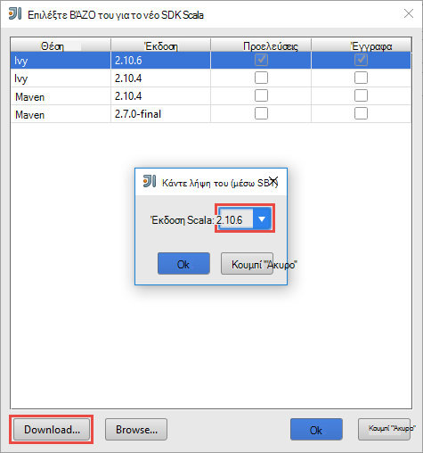
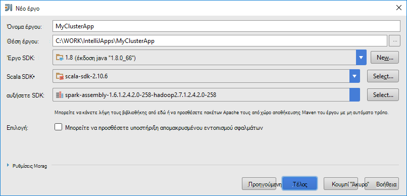
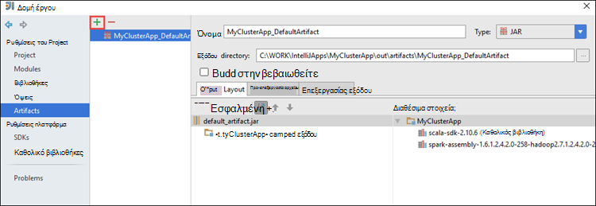
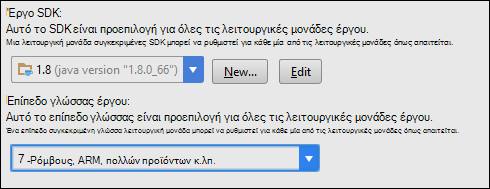
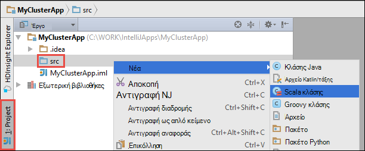

 <properties
    pageTitle="Χρησιμοποιήστε τα εργαλεία HDInsight Κιτ εργαλείων Azure για IntelliJ απομακρυσμένα σφαλμάτων σε εφαρμογές που εκτελούνται στο συμπλεγμάτων τους HDInsight | Microsoft Azure"
    description="Μάθετε πώς να χρησιμοποιήσετε εργαλεία HDInsight του Κιτ εργαλείων Azure για IntelliJ απομακρυσμένα σφαλμάτων σε εφαρμογές που εκτελούνται σε συμπλεγμάτων HDInsight τους."
    services="hdinsight"
    documentationCenter=""
    authors="nitinme"
    manager="jhubbard"
    editor="cgronlun"
    tags="azure-portal"/>

<tags
    ms.service="hdinsight"
    ms.workload="big-data"
    ms.tgt_pltfrm="na"
    ms.devlang="na"
    ms.topic="article"
    ms.date="09/09/2016"
    ms.author="nitinme"/>

# Χρησιμοποιήστε τα εργαλεία HDInsight Κιτ εργαλείων Azure για IntelliJ για τον εντοπισμό σφαλμάτων εφαρμογών τους απομακρυσμένα σε σύμπλεγμα Linux τους HDInsight

Σε αυτό το άρθρο παρέχει οδηγίες βήμα προς βήμα σχετικά με τον τρόπο για να χρησιμοποιήσετε τα εργαλεία HDInsight του Κιτ εργαλείων Azure για IntelliJ για να υποβάλετε μια εργασία τους σε σύμπλεγμα HDInsight τους και, στη συνέχεια, εντοπισμού σφαλμάτων το από απόσταση από τον επιτραπέζιο υπολογιστή. Για να γίνει αυτό, πρέπει να εκτελέσετε τα παρακάτω βήματα υψηλού επιπέδου:

1. Δημιουργία μιας τοποθεσίας σε τοποθεσία ή σημείου σε τοποθεσία Azure εικονικού δικτύου. Τα βήματα σε αυτό το έγγραφο που λαμβάνεται ως δεδομένο ότι χρησιμοποιείτε ένα δίκτυο-τοποθεσίας.

2. Δημιουργήστε ένα σύμπλεγμα τους στο Azure HDInsight που είναι μέρος το εικονικό δίκτυο Azure--τοποθεσίας.

3. Επαληθεύστε τη συνδεσιμότητα μεταξύ του headnode σύμπλεγμα και της επιφάνειας εργασίας σας.

4. Δημιουργία μιας εφαρμογής Scala σε ΓΕΝΙΚΉ IntelliJ και ρυθμίστε τις παραμέτρους του για απομακρυσμένο εντοπισμό σφαλμάτων.

5. Εκτέλεση και εντοπισμός σφαλμάτων της εφαρμογής.

##Προαπαιτούμενα στοιχεία

* Μια συνδρομή του Azure. Ανατρέξτε στο θέμα [λήψη Azure δωρεάν δοκιμαστικής έκδοσης](https://azure.microsoft.com/documentation/videos/get-azure-free-trial-for-testing-hadoop-in-hdinsight/).

* Ένα σύμπλεγμα Apache τους σε HDInsight Linux. Για οδηγίες, ανατρέξτε στο θέμα [Δημιουργία τους Apache συμπλεγμάτων στο Azure HDInsight](hdinsight-apache-spark-jupyter-spark-sql.md).
 
* Κιτ ανάπτυξης Java Oracle. Μπορείτε να το εγκαταστήσετε από [εδώ](http://www.oracle.com/technetwork/java/javase/downloads/jdk8-downloads-2133151.html).
 
* IntelliJ ΙΔΈΑ. Σε αυτό το άρθρο χρησιμοποιεί την έκδοση 15.0.1. Μπορείτε να το εγκαταστήσετε από [εδώ](https://www.jetbrains.com/idea/download/).
 
* Εργαλεία HDInsight Azure Κιτ εργαλείων για IntelliJ. Εργαλεία HDInsight για IntelliJ είναι διαθέσιμα ως μέρος του Κιτ εργαλείων Azure για IntelliJ. Για οδηγίες σχετικά με την εγκατάσταση του Κιτ εργαλείων Azure, ανατρέξτε στο θέμα [κατά την εγκατάσταση του Κιτ εργαλείων Azure για IntelliJ](../azure-toolkit-for-intellij-installation.md).

* Σύνδεση στο Azure της συνδρομής σας IntelliJ ΙΔΈΑ. Ακολουθήστε τις οδηγίες [εδώ](hdinsight-apache-spark-intellij-tool-plugin.md#log-into-your-azure-subscription).
 
* Κατά την εκτέλεση της εφαρμογής Scala τους για απομακρυσμένο εντοπισμό σφαλμάτων σε υπολογιστή με Windows, μπορεί να λάβετε μια εξαίρεση όπως περιγράφεται σε [ΤΟΥΣ-2356](https://issues.apache.org/jira/browse/SPARK-2356) που προκύπτει εξαιτίας ενός που λείπουν WinUtils.exe στα Windows. Για να επιλύσετε αυτό το σφάλμα, πρέπει να [κάνετε λήψη το εκτελέσιμο αρχείο από εδώ](http://public-repo-1.hortonworks.com/hdp-win-alpha/winutils.exe) σε μια θέση όπως **C:\WinUtils\bin**. Στη συνέχεια, πρέπει να προσθέσετε μια μεταβλητή περιβάλλοντος **HADOOP_HOME** και ορίστε την τιμή της μεταβλητής σε **C\WinUtils**.

## Βήμα 1: Δημιουργία μιας Azure εικονικού δικτύου

Ακολουθήστε τις οδηγίες από την παρακάτω συνδέσεις για να δημιουργήσετε ένα δίκτυο εικονικού Azure και, στη συνέχεια, επιβεβαιώστε τη συνδεσιμότητα μεταξύ της επιφάνειας εργασίας και Azure εικονικού δικτύου.

* [Δημιουργήστε μια VNet με μια σύνδεση VPN--τοποθεσίας με πύλη Azure](../vpn-gateway/vpn-gateway-howto-site-to-site-resource-manager-portal.md)
* [Δημιουργήστε μια VNet με μια σύνδεση VPN--τοποθεσίας με χρήση του PowerShell](../vpn-gateway/vpn-gateway-create-site-to-site-rm-powershell.md)
* [Ρυθμίσετε μια σύνδεση σημείου σε τοποθεσία σε ένα εικονικό δίκτυο με χρήση του PowerShell](../vpn-gateway/vpn-gateway-howto-point-to-site-rm-ps.md)

## Βήμα 2: Δημιουργήστε ένα σύμπλεγμα HDInsight τους

Μπορείτε, επίσης, θα πρέπει να δημιουργήσετε ένα σύμπλεγμα Apache τους στον Azure HDInsight που είναι μέρος του Azure εικονικού δικτύου που έχετε δημιουργήσει. Χρησιμοποιήστε τις πληροφορίες που είναι διαθέσιμες στο [βάσει δημιουργία Linux συμπλεγμάτων σε HDInsight](hdinsight-hadoop-provision-linux-clusters.md). Ως μέρος της ρύθμισης παραμέτρων προαιρετικά, επιλέξτε το εικονικό δίκτυο Azure που δημιουργήσατε στο προηγούμενο βήμα.

## Βήμα 3: Επαλήθευση τη συνδεσιμότητα μεταξύ του headnode σύμπλεγμα και της επιφάνειας εργασίας σας

1. Λήψη της διεύθυνσης IP του το headnode. Άνοιγμα Ambari περιβάλλοντος εργασίας Χρήστη για το σύμπλεγμα. Από το σύμπλεγμα blade, κάντε κλικ στην επιλογή **πίνακα εργαλείων**.

    

2. Το περιβάλλον εργασίας Χρήστη Ambari, από την επάνω δεξιά γωνία, κάντε κλικ στην επιλογή **κεντρικών υπολογιστών**.

    

3. Θα πρέπει να μπορείτε να δείτε μια λίστα με headnodes εργαζόμενου κόμβους και κόμβους zookeeper. Το headnodes έχουν το **hn*** πρόθεμα. Κάντε κλικ στην επιλογή του πρώτου headnode.

    

4. Στο κάτω μέρος της σελίδας που ανοίγει από το πλαίσιο **Σύνοψη** , αντιγράψτε τη διεύθυνση IP του headnode και το όνομα κεντρικού υπολογιστή.

    

5. Συμπεριλάβετε τη διεύθυνση IP και το όνομα κεντρικού υπολογιστή από το headnode στο αρχείο **hosts** στον υπολογιστή από το σημείο που θέλετε να εκτελέσετε και απομακρυσμένα εντοπισμού σφαλμάτων τις εργασίες τους. Αυτό θα σας επιτρέψει να επικοινωνήσετε με το headnode χρησιμοποιώντας τη διεύθυνση IP, καθώς και το όνομα κεντρικού υπολογιστή.

    1. Ανοίξτε ένα σημειωματάριο με αναβαθμισμένα δικαιώματα. Από το μενού αρχείο, κάντε κλικ στην επιλογή **Άνοιγμα** και, στη συνέχεια, μεταβείτε στη θέση του αρχείου hosts. Σε υπολογιστή με Windows, είναι `C:\Windows\System32\Drivers\etc\hosts`.

    2. Προσθέστε τα εξής στο αρχείο **hosts** .

            # For headnode0
            192.xxx.xx.xx hn0-nitinp
            192.xxx.xx.xx hn0-nitinp.lhwwghjkpqejawpqbwcdyp3.gx.internal.cloudapp.net

            # For headnode1
            192.xxx.xx.xx hn1-nitinp
            192.xxx.xx.xx hn1-nitinp.lhwwghjkpqejawpqbwcdyp3.gx.internal.cloudapp.net

5. Από τον υπολογιστή που είναι συνδεδεμένοι στο δίκτυο εικονικού Azure που χρησιμοποιείται από το HDInsight σύμπλεγμα, βεβαιωθείτε ότι μπορείτε να κάνετε ping τόσο το headnodes χρησιμοποιώντας τη διεύθυνση IP, καθώς και το όνομα κεντρικού υπολογιστή.

6. SSH σε το headnode σύμπλεγμα χρησιμοποιώντας τις οδηγίες από [σύνδεση σε ένα σύμπλεγμα HDInsight χρησιμοποιώντας SSH](hdinsight-hadoop-linux-use-ssh-windows.md#connect-to-a-linux-based-hdinsight-cluster). Από το headnode σύμπλεγμα, ping της διεύθυνσης IP του στον επιτραπέζιο υπολογιστή. Θα πρέπει να μπορείτε να ελέγξετε τη συνδεσιμότητα τόσο στις διευθύνσεις IP που έχουν εκχωρηθεί σε έναν υπολογιστή, μία για τη σύνδεση δικτύου και τον άλλο για το Azure εικονικού δικτύου που είναι συνδεδεμένος στον υπολογιστή.

7. Επαναλάβετε τα βήματα για καθώς και τα άλλα headnode. 

## Βήμα 4: Δημιουργία εφαρμογής Scala τους χρησιμοποιώντας τα εργαλεία HDInsight στο Κιτ εργαλείων Azure για IntelliJ και ρυθμίστε τις παραμέτρους του για απομακρυσμένο εντοπισμό σφαλμάτων

1. Εκκίνηση IntelliJ ΙΔΈΑ και δημιουργήστε ένα νέο έργο. Στο νέο παράθυρο διαλόγου του project, κάντε τις ακόλουθες επιλογές και, στη συνέχεια, κάντε κλικ στο κουμπί **Επόμενο**.

    

    * Από το αριστερό παράθυρο, επιλέξτε **HDInsight**.
    * Στο δεξιό παράθυρο, επιλέξτε **τους σε HDInsight (Scala)**.
    * Κάντε κλικ στο κουμπί **Επόμενο**.

2. Στο επόμενο παράθυρο, δώστε τις λεπτομέρειες του έργου.

    * Δώστε ένα όνομα έργου και μια θέση έργου.
    * Για το **Project SDK**, βεβαιωθείτε ότι παρέχουν μια έκδοση Java μεγαλύτερο από 7.
    * Για **Scala SDK**, κάντε κλικ στην επιλογή **Δημιουργία**, κάντε κλικ στην επιλογή **λήψη**και, στη συνέχεια, επιλέξτε την έκδοση του Scala για να χρησιμοποιήσετε. **Βεβαιωθείτε ότι δεν χρησιμοποιείτε την έκδοση 2.11.x**. Αυτό το δείγμα χρησιμοποιεί την έκδοση **2.10.6**.

        

    * Για **Τους SDK**, κάντε λήψη και χρήση του SDK από [εδώ](http://go.microsoft.com/fwlink/?LinkID=723585&clcid=0x409). Μπορείτε επίσης να αγνοήσετε αυτό και να χρησιμοποιήσετε το [αποθετήριο Maven τους](http://mvnrepository.com/search?q=spark) αντί για αυτό, ωστόσο, βεβαιωθείτε ότι έχετε επιλέξει το αποθετήριο δεξιά maven εγκατεστημένο για να αναπτύξετε τις εφαρμογές σας τους. (Για παράδειγμα, πρέπει να βεβαιωθείτε ότι έχετε επιλέξει το τμήμα ροής τους εγκατασταθεί Εάν χρησιμοποιείτε ροή τους; Επίσης, βεβαιωθείτε ότι χρησιμοποιείτε το αποθετήριο δεδομένων που έχει επισημανθεί ως Scala 2.10 - μην χρησιμοποιείτε το αποθετήριο δεδομένων έχει επισημανθεί ως Scala 2.11.)

        

    * Κάντε κλικ στο κουμπί **Τέλος**.

3. Το έργο τους δημιουργεί αυτόματα ένα αντικείμενο για εσάς. Για να δείτε το αντικείμενο, ακολουθήστε τα παρακάτω βήματα.

    1. Από το μενού **αρχείο** , κάντε κλικ στην επιλογή **Project δομή**.
    2. Στο παράθυρο διαλόγου **Δομής του Project** , κάντε κλικ στην επιλογή **αντικείμενα** για να δείτε το προεπιλεγμένο αντικείμενο που έχει δημιουργηθεί.

        

    Μπορείτε επίσης να δημιουργήσετε το δικό σας αντικείμενο bly κάνοντας κλικ στο το **+** εικονίδιο, επισήμανση στην παραπάνω εικόνα.

4. Στο παράθυρο διαλόγου **Δομής του Project** , κάντε κλικ στο **έργο**. Εάν το **Έργο SDK** έχει οριστεί σε 1.8, βεβαιωθείτε ότι το **επίπεδο γλώσσας έργου** έχει ρυθμιστεί **7 - ρόμβους, κλπ πολλών προϊόντων, ARM,**.

    

4. Προσθήκη βιβλιοθηκών στο έργο σας. Για να προσθέσετε μια βιβλιοθήκη, κάντε δεξί κλικ το όνομα του έργου στο δέντρο έργου και, στη συνέχεια, κάντε κλικ στην επιλογή **Άνοιγμα ρυθμίσεων λειτουργική μονάδα**. Στο παράθυρο διαλόγου **Δομή έργου** , από το αριστερό παράθυρο, κάντε κλικ στην επιλογή **βιβλιοθήκες**, κάντε κλικ (+) σύμβολο και, στη συνέχεια, κάντε κλικ στην επιλογή **Από το Maven**. 

     

    Στο παράθυρο διαλόγου **Λήψη σε βιβλιοθήκη από το αποθετήριο Maven** , αναζήτηση και προσθέστε τις ακόλουθες βιβλιοθήκες.

    * `org.scalatest:scalatest_2.10:2.2.1`
    * `org.apache.hadoop:hadoop-azure:2.7.1`

5. Αντιγραφή `yarn-site.xml` και `core-site.xml` από το headnode σύμπλεγμα και να την προσθέσετε στο έργο. Χρησιμοποιήστε τις παρακάτω εντολές για να αντιγράψετε τα αρχεία. Μπορείτε να χρησιμοποιήσετε [Cygwin](https://cygwin.com/install.html) για να εκτελέσετε τα παρακάτω `scp` εντολές για να αντιγράψετε τα αρχεία από το headnodes σύμπλεγμα.

        scp <ssh user name>@<headnode IP address or host name>://etc/hadoop/conf/core-site.xml .

    Επειδή Έχουμε ήδη προσθέσει τη διεύθυνση IP headnode σύμπλεγμα και ονόματα της κεντρικούς υπολογιστές αρχείων στην επιφάνεια εργασίας, μπορούμε να χρησιμοποιήσουμε τις εντολές **scp** με τον ακόλουθο τρόπο.

        scp sshuser@hn0-nitinp:/etc/hadoop/conf/core-site.xml .
        scp sshuser@hn0-nitinp:/etc/hadoop/conf/yarn-site.xml .

    Προσθήκη αυτών των αρχείων στο έργο σας, αντιγράφοντας κάτω από το φάκελο **/src** στη δομή του έργου, για παράδειγμα `<your project directory>\src`.

6. Ενημέρωση του `core-site.xml` για να κάνετε τις ακόλουθες αλλαγές.

    1. `core-site.xml`περιλαμβάνει το κρυπτογραφημένο κλειδί με το λογαριασμό χώρου αποθήκευσης που σχετίζεται με το σύμπλεγμα. Στο το `core-site.xml` που προσθέσατε στο έργο, αντικαταστήστε το κρυπτογραφημένο κλειδί με τον αριθμό-κλειδί πραγματικό μέγεθος αποθήκευσης που σχετίζεται με τον προεπιλεγμένο λογαριασμό χώρου αποθήκευσης. Ανατρέξτε στο θέμα [Διαχείριση του χώρου αποθήκευσης πλήκτρων πρόσβασης](../storage/storage-create-storage-account.md#manage-your-storage-account).

            <property>
                <name>fs.azure.account.key.hdistoragecentral.blob.core.windows.net</name>
                <value>access-key-associated-with-the-account</value>
            </property>

    2. Καταργήστε τις ακόλουθες καταχωρήσεις από την `core-site.xml`.

            <property>
                <name>fs.azure.account.keyprovider.hdistoragecentral.blob.core.windows.net</name>
                <value>org.apache.hadoop.fs.azure.ShellDecryptionKeyProvider</value>
            </property>

            <property>
                <name>fs.azure.shellkeyprovider.script</name>
                <value>/usr/lib/python2.7/dist-packages/hdinsight_common/decrypt.sh</value>
            </property>

            <property>
                <name>net.topology.script.file.name</name>
                <value>/etc/hadoop/conf/topology_script.py</value>
            </property>

    3. Αποθηκεύστε το αρχείο.

7. Προσθέστε την κλάση κύριες για την εφαρμογή σας. Από την **Εξερεύνηση έργου**, κάντε δεξί κλικ **src**, επιλέξτε **Δημιουργία**και, στη συνέχεια, κάντε κλικ στην επιλογή **Scala τάξης**.

    

8. Στο παράθυρο διαλόγου **Δημιουργία νέας κλάσης Scala** , δώστε ένα όνομα, επιλέξτε **είδος** **αντικειμένου**, και, στη συνέχεια, κάντε κλικ στο κουμπί **OK**.

    

9. Στο το `MyClusterAppMain.scala` αρχείου, επικολλήστε τον ακόλουθο κώδικα. Αυτός ο κώδικας δημιουργεί το τους περιβάλλοντος και εκκινήσεις μια `executeJob` μέθοδο από το `SparkSample` αντικειμένου.

        import org.apache.spark.{SparkConf, SparkContext}

        object SparkSampleMain {
          def main (arg: Array[String]): Unit = {
            val conf = new SparkConf().setAppName("SparkSample")
                                      .set("spark.hadoop.validateOutputSpecs", "false")
            val sc = new SparkContext(conf)
        
            SparkSample.executeJob(sc,
                                   "wasbs:///HdiSamples/HdiSamples/SensorSampleData/hvac/HVAC.csv",
                                   "wasbs:///HVACOut")
          }
        }

10. Επαναλάβετε τα βήματα 8 και 9 παραπάνω για να προσθέσετε ένα νέο αντικείμενο Scala που ονομάζεται `SparkSample`. Σε αυτή την κατηγορία, προσθέστε τον ακόλουθο κώδικα. Αυτός ο κωδικός διαβάζει τα δεδομένα από το HVAC.csv (διαθέσιμο σε όλους τους HDInsight συμπλεγμάτων), ανακτά τις γραμμές που έχουν μόνο ένα ψηφίο στη στήλη έβδομη σε το CSV και εγγράφει το αποτέλεσμα στο **/HVACOut** κάτω από το προεπιλεγμένο κοντέινερ χώρου αποθήκευσης για το σύμπλεγμα.

        import org.apache.spark.SparkContext
    
        object SparkSample {
          def executeJob (sc: SparkContext, input: String, output: String): Unit = {
            val rdd = sc.textFile(input)
        
            //find the rows which have only one digit in the 7th column in the CSV
            val rdd1 =  rdd.filter(s => s.split(",")(6).length() == 1)
        
            val s = sc.parallelize(rdd.take(5)).cartesian(rdd).count()
            println(s)
        
            rdd1.saveAsTextFile(output)
            //rdd1.collect().foreach(println)
          }
        
        }

11. Επαναλάβετε τα βήματα 8 και 9 παραπάνω για να προσθέσετε μια νέα κλάσης που ονομάζεται `RemoteClusterDebugging`. Αυτή η κλάση εφαρμόζει το πλαίσιο δοκιμής τους που χρησιμοποιείται για τον εντοπισμό σφαλμάτων εφαρμογών. Προσθέστε τον ακόλουθο κώδικα για την `RemoteClusterDebugging` τάξης.

        import org.apache.spark.{SparkConf, SparkContext}
        import org.scalatest.FunSuite
        
        class RemoteClusterDebugging extends FunSuite {
        
          test("Remote run") {
            val conf = new SparkConf().setAppName("SparkSample")
                                      .setMaster("yarn-client")
                                      .set("spark.yarn.am.extraJavaOptions", "-Dhdp.version=2.4")
                                      .set("spark.yarn.jar", "wasbs:///hdp/apps/2.4.2.0-258/spark-assembly-1.6.1.2.4.2.0-258-hadoop2.7.1.2.4.2.0-258.jar")
                                      .setJars(Seq("""C:\WORK\IntelliJApps\MyClusterApp\out\artifacts\MyClusterApp_DefaultArtifact\default_artifact.jar"""))
                                      .set("spark.hadoop.validateOutputSpecs", "false")
            val sc = new SparkContext(conf)
        
            SparkSample.executeJob(sc,
              "wasbs:///HdiSamples/HdiSamples/SensorSampleData/hvac/HVAC.csv",
              "wasbs:///HVACOut")
          }
        }

    Μερικά σημαντικά πράγματα που πρέπει να λάβετε υπόψη εδώ:
    
    * Για `.set("spark.yarn.jar", "wasbs:///hdp/apps/2.4.2.0-258/spark-assembly-1.6.1.2.4.2.0-258-hadoop2.7.1.2.4.2.0-258.jar")`, βεβαιωθείτε ότι είναι διαθέσιμη του χώρου αποθήκευσης συμπλέγματος στην καθορισμένη διαδρομή συγκρότησης τους ΒΆΖΟ.
    * Για `setJars`, καθορίστε τη θέση όπου θα δημιουργηθεί βάζο το αντικείμενο. Συνήθως είναι `<Your IntelliJ project directory>\out\<project name>_DefaultArtifact\default_artifact.jar`. 

11. Στο το `RemoteClusterDebugging` κλάση, κάντε δεξί κλικ το `test` λέξη-κλειδί και επιλέξτε **Δημιουργία ρύθμισης παραμέτρων RemoteClusterDebugging**.

    

12. Στο παράθυρο διαλόγου, δώστε ένα όνομα για τη ρύθμιση παραμέτρων και επιλέξτε το **είδος ελέγχου** ως **το όνομα δοκιμής**. Αφήστε όλες οι υπόλοιπες τιμές ως προεπιλεγμένο, κάντε κλικ στην επιλογή **εφαρμογή**και, στη συνέχεια, κάντε κλικ στο κουμπί **OK**.

    

13. Τώρα θα πρέπει να βλέπετε μια **Απομακρυσμένη εκτέλεση** ρύθμιση παραμέτρων αναπτυσσόμενη λίστα στη γραμμή μενού. 

    

## Βήμα 5: Εκτέλεση της εφαρμογής σε κατάσταση εντοπισμού σφαλμάτων

1. Στο έργο σας IntelliJ ΙΔΈΑ, ανοίξτε `SparkSample.scala` και να δημιουργήσετε ένα σημείο διακοπής δίπλα στο στοιχείο 'val rdd1'. Στο αναδυόμενο μενού για να δημιουργήσετε ένα σημείο διακοπής, επιλέξτε **γραμμή στη συνάρτηση executeJob**.

    

2. Κάντε κλικ στο κουμπί **Εκτέλεση εντοπισμός σφαλμάτων** δίπλα της **Απομακρυσμένης εκτέλεση** ρύθμισης παραμέτρων μετακινηθείτε προς τα κάτω για να ξεκινήσει η εκτέλεση της εφαρμογής.

    

3. Κατά την εκτέλεση του προγράμματος φτάσει το σημείο διακοπής, θα πρέπει να βλέπετε μια καρτέλα **προγράμματος εντοπισμού σφαλμάτων** στο κάτω τμήμα του παραθύρου.

    

4. Κάντε κλικ στην επιλογή το (**+**) εικονίδιο για να προσθέσετε μια παρακολούθησης, όπως φαίνεται στην παρακάτω εικόνα. 

    

    Εδώ, επειδή η εφαρμογή κατάτμηση πριν από τη μεταβλητή `rdd1` που δημιουργήθηκε χρησιμοποιώντας αυτό παρακολούθησης μπορούμε να δούμε τι είναι η 5 πρώτων γραμμών στη μεταβλητή `rdd`. Πατήστε το πλήκτρο **ENTER**.

    

    Τι βλέπετε στην παραπάνω εικόνα είναι ότι κατά το χρόνο εκτέλεσης, που θα μπορούσε να ερωτήματος terrabytes δεδομένων και ο εντοπισμός σφαλμάτων πώς σας εξελίσσεται εφαρμογής. Για παράδειγμα, στο αποτέλεσμα φαίνεται στην παραπάνω εικόνα, μπορείτε να δείτε ότι η πρώτη γραμμή του αποτελέσματος είναι μια επικεφαλίδα. Με βάση αυτό, μπορείτε να τροποποιήσετε κώδικα της εφαρμογής σας για να παραλείψετε τη γραμμή κεφαλίδων, εάν είναι απαραίτητο.

5. Τώρα μπορείτε να κάνετε κλικ στο εικονίδιο του **Προγράμματος βιογραφικού σημειώματος** για να συνεχίσετε με την εκτέλεση της εφαρμογής.

    

6. Εάν η εφαρμογή ολοκληρωθεί με επιτυχία, θα πρέπει να βλέπετε το αποτέλεσμα όπως το εξής.

    

 

## Δείτε επίσης

* [Επισκόπηση: Apache τους σε Azure HDInsight](hdinsight-apache-spark-overview.md)

### Σενάρια

* [Τους με το BI: Εκτέλεση ανάλυσης αλληλεπιδραστικών δεδομένων με χρήση τους σε HDInsight με εργαλεία Επιχειρηματικής ευφυΐας](hdinsight-apache-spark-use-bi-tools.md)

* [Τους με μηχανικής εκμάθησης: χρήση τους σε HDInsight για την ανάλυση δόμησης θερμοκρασίας με τη χρήση δεδομένων HVAC](hdinsight-apache-spark-ipython-notebook-machine-learning.md)

* [Τους με μηχανικής εκμάθησης: χρήση τους σε HDInsight πρόβλεψη της εστίασης στα αποτελέσματα ελέγχου](hdinsight-apache-spark-machine-learning-mllib-ipython.md)

* [Τους ροής: Χρήση τους σε HDInsight για τη δημιουργία εφαρμογών σε πραγματικό χρόνο ροής](hdinsight-apache-spark-eventhub-streaming.md)

* [Ανάλυση καταγραφής τοποθεσία Web χρησιμοποιώντας τους στο HDInsight](hdinsight-apache-spark-custom-library-website-log-analysis.md)

### Δημιουργία και εκτέλεση εφαρμογών

* [Δημιουργήστε μια μεμονωμένη εφαρμογή χρησιμοποιώντας Scala](hdinsight-apache-spark-create-standalone-application.md)

* [Απομακρυσμένη εκτέλεση εργασιών σε ένα σύμπλεγμα τους χρησιμοποιώντας Λίβιος](hdinsight-apache-spark-livy-rest-interface.md)

### Εργαλεία και επεκτάσεις

* [Χρησιμοποιήστε εργαλεία HDInsight Κιτ εργαλείων Azure για IntelliJ για να δημιουργήσετε και να υποβάλετε τους Scala εφαρμογών](hdinsight-apache-spark-intellij-tool-plugin.md)

* [Χρησιμοποιήστε εργαλεία HDInsight Κιτ εργαλείων Azure για Έκλειψη για να δημιουργήσετε τους εφαρμογές](hdinsight-apache-spark-eclipse-tool-plugin.md)

* [Χρήση Zeppelin σημειωματάρια με ένα σύμπλεγμα τους σε HDInsight](hdinsight-apache-spark-use-zeppelin-notebook.md)

* [Διαθέσιμο για Jupyter σημειωματαρίου στο σύμπλεγμα τους για HDInsight πυρήνων](hdinsight-apache-spark-jupyter-notebook-kernels.md)

* [Χρήση εξωτερικών πακέτων με σημειωματάρια Jupyter](hdinsight-apache-spark-jupyter-notebook-use-external-packages.md)

* [Εγκατάσταση Jupyter στον υπολογιστή σας και να συνδεθείτε με ένα σύμπλεγμα HDInsight τους](hdinsight-apache-spark-jupyter-notebook-install-locally.md)

### Διαχείριση πόρων

* [Διαχείριση πόρων για το σύμπλεγμα Apache τους στο Azure HDInsight](hdinsight-apache-spark-resource-manager.md)

* [Παρακολούθηση και εντοπισμού σφαλμάτων εργασίες που εκτελείται σε ένα σύμπλεγμα Apache τους στο HDInsight](hdinsight-apache-spark-job-debugging.md)
