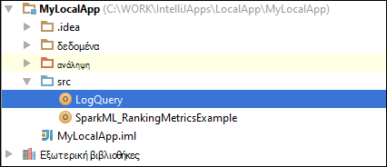

 <properties
    pageTitle="Δημιουργία Scala τους εφαρμογών χρησιμοποιώντας εργαλεία HDInsight στο Κιτ εργαλείων Azure για IntelliJ | Microsoft Azure"
    description="Μάθετε πώς μπορείτε να δημιουργήσετε μια μεμονωμένη εφαρμογή τους για να εκτελεστεί σε συμπλεγμάτων HDInsight τους."
    services="hdinsight"
    documentationCenter=""
    authors="nitinme"
    manager="jhubbard"
    editor="cgronlun"
    tags="azure-portal"/>

<tags
    ms.service="hdinsight"
    ms.workload="big-data"
    ms.tgt_pltfrm="na"
    ms.devlang="na"
    ms.topic="article"
    ms.date="09/09/2016"
    ms.author="nitinme"/>

# Χρησιμοποιήστε τα εργαλεία HDInsight Κιτ εργαλείων Azure για IntelliJ για να δημιουργήσετε εφαρμογές για το σύμπλεγμα Linux τους HDInsight τους

Σε αυτό το άρθρο παρέχει οδηγίες βήμα προς βήμα στην ανάπτυξη εφαρμογές τους που έχουν δημιουργηθεί στο Scala και υποβολή να μια τους HDInsight συμπλέγματος χρησιμοποιώντας HDInsight εργαλεία στο Κιτ εργαλείων Azure για IntelliJ.  Μπορείτε να χρησιμοποιήσετε τα εργαλεία με διαφορετικούς τρόπους:

* Για να αναπτύξετε και να υποβάλετε μια αίτηση Scala τους σε ένα σύμπλεγμα HDInsight τους
* Για να αποκτήσετε πρόσβαση του Azure HDInsight τους πόρους συμπλέγματος
* Για να αναπτύξετε και να εκτελέσετε μια εφαρμογή τους Scala τοπικά

Μπορείτε επίσης να ακολουθήσετε ένα βίντεο [εδώ](https://mix.office.com/watch/1nqkqjt5xonza) για να ξεκινήσετε.

>[AZURE.IMPORTANT] Αυτό το εργαλείο μπορεί να χρησιμοποιηθεί για να δημιουργήσετε και να υποβάλετε αιτήσεις μόνο για ένα σύμπλεγμα HDInsight τους στην Linux.

##Προαπαιτούμενα στοιχεία

* Μια συνδρομή του Azure. Ανατρέξτε στο θέμα [λήψη Azure δωρεάν δοκιμαστικής έκδοσης](https://azure.microsoft.com/documentation/videos/get-azure-free-trial-for-testing-hadoop-in-hdinsight/).

* Ένα σύμπλεγμα Apache τους σε HDInsight Linux. Για οδηγίες, ανατρέξτε στο θέμα [Δημιουργία τους Apache συμπλεγμάτων στο Azure HDInsight](hdinsight-apache-spark-jupyter-spark-sql.md).

* Κιτ ανάπτυξης Java Oracle. Μπορείτε να το εγκαταστήσετε από [εδώ](http://www.oracle.com/technetwork/java/javase/downloads/jdk8-downloads-2133151.html).

* IntelliJ ΙΔΈΑ. Σε αυτό το άρθρο χρησιμοποιεί την έκδοση 15.0.1. Μπορείτε να το εγκαταστήσετε από [εδώ](https://www.jetbrains.com/idea/download/).

## Εγκατάσταση εργαλείων HDInsight στο Azure Κιτ εργαλείων για IntelliJ

Εργαλεία HDInsight για IntelliJ είναι διαθέσιμη ως μέρος του Κιτ εργαλείων Azure για IntelliJ. Για οδηγίες σχετικά με την εγκατάσταση του Κιτ εργαλείων Azure, ανατρέξτε στο θέμα [κατά την εγκατάσταση του Κιτ εργαλείων Azure για IntelliJ](../azure-toolkit-for-intellij-installation.md).

## Συνδεθείτε με τη συνδρομή σας στο Azure

1. Εκκινήστε το IDE IntelliJ και ανοίξτε την Εξερεύνηση Azure. Από το μενού **προβολής** στο IDE, κάντε κλικ στην επιλογή **Εργαλείο Windows** και, στη συνέχεια, κάντε κλικ στην επιλογή **Εξερεύνηση Azure**.

    

2. Κάντε δεξί κλικ στον κόμβο **Azure** στην **Εξερεύνηση Azure**και, στη συνέχεια, κάντε κλικ στην επιλογή **Διαχείριση εγγραφών**.

3. Στο παράθυρο διαλόγου **Διαχείριση εγγραφών** , κάντε κλικ στην επιλογή **Είσοδος** και εισαγάγετε τα διαπιστευτήριά σας Azure.

    

4. Αφού έχετε συνδεθεί, το παράθυρο διαλόγου **Διαχείριση εγγραφών** παραθέτει όλες τις συνδρομές Azure που σχετίζεται με τα διαπιστευτήρια. Κάντε κλικ στο κουμπί **Κλείσιμο** στο παράθυρο διαλόγου.

5. Στην καρτέλα **Azure Explorer** , αναπτύξτε **HDInsight** για να δείτε το HDInsight τους συμπλεγμάτων κάτω από τη συνδρομή σας.

    

6. Περαιτέρω, μπορείτε να επεκτείνετε έναν κόμβο όνομα συμπλέγματος για να δείτε τους πόρους (π.χ. λογαριασμοί χώρου αποθήκευσης) που σχετίζεται με το σύμπλεγμα.

    

## Εκτέλεση μιας εφαρμογής Scala τους σε ένα σύμπλεγμα HDInsight τους

1. Εκκίνηση IntelliJ ΙΔΈΑ και δημιουργήστε ένα νέο έργο. Στο νέο παράθυρο διαλόγου του project, κάντε τις ακόλουθες επιλογές και, στη συνέχεια, κάντε κλικ στο κουμπί **Επόμενο**.

    

    * Από το αριστερό παράθυρο, επιλέξτε **HDInsight**.
    * Στο δεξιό παράθυρο, επιλέξτε **τους σε HDInsight (Scala)**.
    * Κάντε κλικ στο κουμπί **Επόμενο**.

2. Στο επόμενο παράθυρο, δώστε τις λεπτομέρειες του έργου.

    * Δώστε ένα όνομα έργου και μια θέση έργου.
    * Για το **Project SDK**, βεβαιωθείτε ότι παρέχουν μια έκδοση Java μεγαλύτερο από 7.
    * Για **Scala SDK**, κάντε κλικ στην επιλογή **Δημιουργία**, κάντε κλικ στην επιλογή **λήψη**και, στη συνέχεια, επιλέξτε την έκδοση του Scala για να χρησιμοποιήσετε. **Βεβαιωθείτε ότι δεν χρησιμοποιείτε την έκδοση 2.11.x**. Αυτό το δείγμα χρησιμοποιεί την έκδοση **2.10.6**.

        

    * Για **Τους SDK**, κάντε λήψη και χρήση του SDK από [εδώ](http://go.microsoft.com/fwlink/?LinkID=723585&clcid=0x409). Μπορείτε επίσης να αγνοήσετε αυτό και να χρησιμοποιήσετε το [αποθετήριο Maven τους](http://mvnrepository.com/search?q=spark) αντί για αυτό, ωστόσο, βεβαιωθείτε ότι έχετε επιλέξει το αποθετήριο δεξιά maven εγκατεστημένο για να αναπτύξετε τις εφαρμογές σας τους. (Για παράδειγμα, πρέπει να βεβαιωθείτε ότι έχετε επιλέξει το τμήμα ροής τους εγκατασταθεί Εάν χρησιμοποιείτε ροή τους; Επίσης, βεβαιωθείτε ότι χρησιμοποιείτε το αποθετήριο δεδομένων που έχει επισημανθεί ως Scala 2.10 - μην χρησιμοποιείτε το αποθετήριο δεδομένων έχει επισημανθεί ως Scala 2.11.)

        

    * Κάντε κλικ στο κουμπί **Τέλος**.

3. Το έργο τους δημιουργεί αυτόματα ένα αντικείμενο για εσάς. Για να δείτε το αντικείμενο, ακολουθήστε τα παρακάτω βήματα.

    1. Από το μενού **αρχείο** , κάντε κλικ στην επιλογή **Project δομή**.
    2. Στο παράθυρο διαλόγου **Δομής του Project** , κάντε κλικ στην επιλογή **αντικείμενα** για να δείτε το προεπιλεγμένο αντικείμενο που έχει δημιουργηθεί.

        

    Μπορείτε επίσης να δημιουργήσετε το δικό σας αντικείμενο bly κάνοντας κλικ στο το **+** εικονίδιο, επισήμανση στην παραπάνω εικόνα.

4. Στο παράθυρο διαλόγου **Δομής του Project** , κάντε κλικ στο **έργο**. Εάν το **Έργο SDK** έχει οριστεί σε 1.8, βεβαιωθείτε ότι το **επίπεδο γλώσσας έργου** έχει ρυθμιστεί **7 - ρόμβους, κλπ πολλών προϊόντων, ARM,**.

    

5. Προσθέστε τον πηγαίο κώδικα της εφαρμογής.

    1. Από την **Εξερεύνηση έργου**, κάντε δεξί κλικ **src**, επιλέξτε **Δημιουργία**και, στη συνέχεια, κάντε κλικ στην επιλογή **Scala τάξης**.

        

    2. Στο παράθυρο διαλόγου **Δημιουργία νέας κλάσης Scala** , δώστε ένα όνομα, επιλέξτε **είδος** **αντικειμένου**, και, στη συνέχεια, κάντε κλικ στο κουμπί **OK**.

        

    3. Στο αρχείο **MyClusterApp.scala** , επικολλήστε τον ακόλουθο κώδικα. Αυτός ο κωδικός διαβάζει τα δεδομένα από το HVAC.csv (διαθέσιμο σε όλους τους HDInsight συμπλεγμάτων), ανακτά τις γραμμές που έχουν μόνο ένα ψηφίο στη στήλη έβδομη σε το CSV και εγγράφει το αποτέλεσμα στο **/HVACOut** κάτω από το προεπιλεγμένο κοντέινερ χώρου αποθήκευσης για το σύμπλεγμα.

            import org.apache.spark.SparkConf
            import org.apache.spark.SparkContext

            object MyClusterApp{
              def main (arg: Array[String]): Unit = {
                val conf = new SparkConf().setAppName("MyClusterApp")
                val sc = new SparkContext(conf)

                val rdd = sc.textFile("wasbs:///HdiSamples/HdiSamples/SensorSampleData/hvac/HVAC.csv")

                //find the rows which have only one digit in the 7th column in the CSV
                val rdd1 =  rdd.filter(s => s.split(",")(6).length() == 1)

                rdd1.saveAsTextFile("wasbs:///HVACOut")
              }

            }

5. Εκτελέστε την εφαρμογή σε ένα σύμπλεγμα HDInsight τους.

    1. Από την **Εξερεύνηση έργου**, κάντε δεξί κλικ στο όνομα του έργου και, στη συνέχεια, επιλέξτε **Υποβολή εφαρμογή τους με το HDInsight**.

        

    2. Θα σας ζητηθεί να εισαγάγετε τα διαπιστευτήριά σας Azure συνδρομής. Στο παράθυρο διαλόγου **Υποβολής τους** , δώστε τις παρακάτω τιμές.

        * Για **τους συμπλεγμάτων (μόνο Linux)**, επιλέξτε το σύμπλεγμα HDInsight τους στην οποία θέλετε να εκτελέσετε την εφαρμογή σας.

        * Χρειάζεστε είτε επιλέξτε ένα αντικείμενο από το έργο IntelliJ ή επιλέξτε μία από σκληρό δίσκο.

        * Σε σχέση με το πλαίσιο κειμένου **όνομα κλάσης κύριες** , κάντε κλικ στα αποσιωπητικά ( ), επιλέξτε την κύρια κλάση στο αρχείο προέλευσης κώδικα της εφαρμογής σας και, στη συνέχεια, κάντε κλικ στο κουμπί **OK**.

            

        * Επειδή τον κώδικα της εφαρμογής σε αυτό το παράδειγμα δεν απαιτείται κάποια ορίσματα γραμμής εντολής ή αναφορά βάζα των ή αρχεία, μπορείτε να αφήσετε κενό τα υπόλοιπα πλαίσια κειμένου.

        * Μετά την παροχή όλες οι εισροές, το παράθυρο διαλόγου θα πρέπει να μοιάζει με την παρακάτω.

            

        * Κάντε κλικ στην επιλογή **Υποβολή**.

    3. Στην καρτέλα **Υποβολής τους** στο κάτω μέρος του παραθύρου θα αρχίσουν να εμφανίζει την πρόοδο. Μπορείτε επίσης να διακόψετε την εφαρμογή, κάνοντας κλικ στο κόκκινο κουμπί στο παράθυρο "Τους υποβολής".

        

    Στην επόμενη ενότητα, μπορείτε να μάθετε πώς μπορείτε να μεταβείτε στη εργασία εξόδου χρησιμοποιώντας τα εργαλεία HDInsight στο Κιτ εργαλείων Azure για IntelliJ.

## Πρόσβαση και να διαχειριστείτε τους HDInsight συμπλεγμάτων χρησιμοποιώντας τα εργαλεία HDInsight στο Κιτ εργαλείων Azure για IntelliJ

Μπορείτε να εκτελέσετε διάφορες λειτουργίες χρησιμοποιώντας τα εργαλεία HDInsight που είναι μέρος του Κιτ εργαλείων Azure για IntelliJ.

### Πρόσβαση στην προβολή έργου απευθείας από τα εργαλεία HDInsight

1. Από την **Εξερεύνηση Azure**, αναπτύξτε το στοιχείο **HDInsight**, αναπτύξτε το όνομα του συμπλέγματος τους και, στη συνέχεια, κάντε κλικ στην επιλογή **εργασίες**.

2. Στο δεξιό παράθυρο, στην καρτέλα **Προβολή εργασία τους** εμφανίζει όλες τις εφαρμογές που έχουν εκτελούνται στο σύμπλεγμα. Επιλέξτε το όνομα της εφαρμογής για το οποίο θέλετε να δείτε περισσότερες λεπτομέρειες.

    

3. Τα πλαίσια για **Το μήνυμα σφάλματος**, **Εργασία εξόδου**, **Λίβιος αρχεία καταγραφής από την εργασία**και **Αρχεία καταγραφής από το πρόγραμμα οδήγησης τους** συμπληρώνονται με βάση την εφαρμογή που επιλέγετε.

4. Μπορείτε επίσης να ανοίξετε το **Περιβάλλον εργασίας Χρήστη ιστορικού τους** και το **Περιβάλλον εργασίας Χρήστη ΝΉΜΑΤΑ** (σε επίπεδο εφαρμογής), κάνοντας κλικ στα αντίστοιχα κουμπιά στο επάνω μέρος της οθόνης.

### Πρόσβαση στο διακομιστή ιστορικού τους

1. Από την **Εξερεύνηση Azure**, αναπτύξτε **HDInsight**, κάντε δεξιό κλικ στο όνομά σας σύμπλεγμα τους και, στη συνέχεια, επιλέξτε **Άνοιγμα περιβάλλον εργασίας Χρήστη ιστορικό τους**. Όταν σας ζητηθεί, πληκτρολογήστε τα διαπιστευτήρια διαχειριστή για το σύμπλεγμα. Πρέπει να έχετε καθορίσει αυτά κατά την προμήθεια του συμπλέγματος.

2. Στον πίνακα εργαλείων του διακομιστή ιστορικού τους, μπορείτε να δείτε για την εφαρμογή που μόλις τελειώσετε εκτελείται, χρησιμοποιώντας το όνομα της εφαρμογής. Στο παραπάνω κώδικα, ορίζετε το όνομα εφαρμογής χρησιμοποιώντας `val conf = new SparkConf().setAppName("MyClusterApp")`. Επομένως, το όνομα της εφαρμογής τους ήταν **MyClusterApp**.

### Εκκίνηση της πύλης Ambari

Από την **Εξερεύνηση Azure**, αναπτύξτε **HDInsight**, κάντε δεξιό κλικ στο όνομά σας σύμπλεγμα τους και, στη συνέχεια, επιλέξτε **Άνοιγμα πύλη διαχείρισης του συμπλέγματος (Ambari)**. Όταν σας ζητηθεί, πληκτρολογήστε τα διαπιστευτήρια διαχειριστή για το σύμπλεγμα. Πρέπει να έχετε καθορίσει αυτά κατά την προμήθεια του συμπλέγματος.

### Διαχείριση των συνδρομών Azure

Από προεπιλογή, τα εργαλεία HDInsight παραθέτει των συμπλεγμάτων τους από όλες τις συνδρομές σας Azure. Εάν χρειάζεται, μπορείτε να καθορίσετε τις συνδρομές για την οποία θέλετε να έχετε πρόσβαση στο σύμπλεγμα. Από την **Εξερεύνηση Azure**, κάντε δεξί κλικ στον ριζικό κόμβο **Azure** και, στη συνέχεια, κάντε κλικ στην επιλογή **Διαχείριση εγγραφών**. Από το παράθυρο διαλόγου, καταργήστε την επιλογή των πλαισίων ελέγχου σε σχέση με τη συνδρομή που δεν θέλετε να έχετε πρόσβαση και, στη συνέχεια, κάντε κλικ στο κουμπί **Κλείσιμο**. Μπορείτε επίσης να επιλέξετε **Αποσύνδεση** εάν θέλετε να αποσυνδεθείτε από τη συνδρομή σας στο Azure.

## Εκτέλεση μιας εφαρμογής Scala τους τοπικά

Μπορείτε να χρησιμοποιήσετε τα εργαλεία HDInsight στο Κιτ εργαλείων Azure για IntelliJ να εκτελούν εφαρμογές Scala τους τοπικά σε σας σταθμούς εργασίας. Συνήθως, όπως εφαρμογές δεν πρέπει να αποκτήσει πρόσβαση σε πόρους συμπλέγματος όπως κοντέινερ χώρου αποθήκευσης και μπορεί να είναι εκτέλεση και ελεγχθεί τοπικά.

### Προϋπόθεση

Κατά την εκτέλεση της τοπικής εφαρμογής Scala τους σε έναν υπολογιστή Windows, μπορεί να λάβετε μια εξαίρεση όπως περιγράφεται σε [ΤΟΥΣ-2356](https://issues.apache.org/jira/browse/SPARK-2356) που προκύπτει εξαιτίας ενός που λείπουν WinUtils.exe στα Windows. Για να επιλύσετε αυτό το σφάλμα, πρέπει να [κάνετε λήψη το εκτελέσιμο αρχείο από εδώ](http://public-repo-1.hortonworks.com/hdp-win-alpha/winutils.exe) σε μια θέση όπως **C:\WinUtils\bin**. Στη συνέχεια, πρέπει να προσθέσετε μια μεταβλητή περιβάλλοντος **HADOOP_HOME** και ορίστε την τιμή της μεταβλητής σε **C\WinUtils**.

### Εκτέλεση μιας τοπικής εφαρμογής Scala τους  

1. Εκκίνηση IntelliJ ΙΔΈΑ και δημιουργήστε ένα νέο έργο. Στο νέο παράθυρο διαλόγου του project, κάντε τις ακόλουθες επιλογές και, στη συνέχεια, κάντε κλικ στο κουμπί **Επόμενο**.

    

    * Από το αριστερό παράθυρο, επιλέξτε **HDInsight**.
    * Στο δεξιό παράθυρο, επιλέξτε **τους στο δείγμα εκτέλεση HDInsight τοπικό (Scala)**.
    * Κάντε κλικ στο κουμπί **Επόμενο**.

2. Στο επόμενο παράθυρο, δώστε τις λεπτομέρειες του έργου.

    * Δώστε ένα όνομα έργου και μια θέση έργου.
    * Για το **Project SDK**, βεβαιωθείτε ότι παρέχουν μια έκδοση Java μεγαλύτερο από 7.
    * Για **Scala SDK**, κάντε κλικ στην επιλογή **Δημιουργία**, κάντε κλικ στην επιλογή **λήψη**και, στη συνέχεια, επιλέξτε την έκδοση του Scala για να χρησιμοποιήσετε. **Βεβαιωθείτε ότι δεν χρησιμοποιείτε την έκδοση 2.11.x**. Αυτό το δείγμα χρησιμοποιεί την έκδοση **2.10.6**.

        

    * Για **Τους SDK**, κάντε λήψη και χρήση του SDK από [εδώ](http://go.microsoft.com/fwlink/?LinkID=723585&clcid=0x409). Μπορείτε επίσης να αγνοήσετε αυτό και να χρησιμοποιήσετε το [αποθετήριο Maven τους](http://mvnrepository.com/search?q=spark) αντί για αυτό, ωστόσο, βεβαιωθείτε ότι έχετε επιλέξει το αποθετήριο δεξιά maven εγκατεστημένο για να αναπτύξετε τις εφαρμογές σας τους. (Για παράδειγμα, πρέπει να βεβαιωθείτε ότι έχετε επιλέξει το τμήμα ροής τους εγκατασταθεί Εάν χρησιμοποιείτε ροή τους; Επίσης, βεβαιωθείτε ότι χρησιμοποιείτε το αποθετήριο δεδομένων που έχει επισημανθεί ως Scala 2.10 - μην χρησιμοποιείτε το αποθετήριο δεδομένων έχει επισημανθεί ως Scala 2.11.)

        

    * Κάντε κλικ στο κουμπί **Τέλος**.

3. Το πρότυπο προσθέτει ένα δείγμα κώδικα (**LogQuery**) κάτω από το φάκελο **src** που μπορείτε να εκτελέσετε τοπικά στον υπολογιστή σας.

    

4.  Κάντε δεξί κλικ στη γραμμή εφαρμογής **LogQuery** και, στη συνέχεια, κάντε κλικ στην επιλογή **"Εκτέλεση 'LogQuery'"**. Θα δείτε το αποτέλεσμα ως εξής στην καρτέλα " **Εκτέλεση** " στο κάτω μέρος.

    

## Μετατροπή υπάρχουσες εφαρμογές IntelliJ ΙΔΈΑ για να χρησιμοποιήσετε τα εργαλεία HDInsight του Κιτ εργαλείων Azure για IntelliJ

Μπορείτε επίσης να μετατρέψετε τις υπάρχουσες εφαρμογές Scala τους δημιουργήθηκε σε ΓΕΝΙΚΉ IntelliJ ώστε να είναι συμβατές με τα εργαλεία HDInsight στο Κιτ εργαλείων Azure για IntelliJ. Αυτό θα σας επιτρέψει να χρησιμοποιήσετε το εργαλείο για να υποβάλλουν τις αιτήσεις σε ένα σύμπλεγμα HDInsight τους. Μπορείτε να το κάνετε, ακολουθώντας τα παρακάτω βήματα:

1. Για μια υπάρχουσα Scala τους appliction που δημιουργήθηκε με χρήση IntelliJ ΙΔΈΑ, ανοίξτε το αρχείο συσχετισμένη .iml.
2. Στο επίπεδο ριζικού, θα δείτε ένα στοιχείο **λειτουργική μονάδα** ως εξής:

        <module org.jetbrains.idea.maven.project.MavenProjectsManager.isMavenModule="true" type="JAVA_MODULE" version="4">

3. Επεξεργαστείτε το στοιχείο για να προσθέσετε `UniqueKey="HDInsightTool"` ώστε το στοιχείο **λειτουργική μονάδα** μοιάζει με τα εξής:

        <module org.jetbrains.idea.maven.project.MavenProjectsManager.isMavenModule="true" type="JAVA_MODULE" version="4" UniqueKey="HDInsightTool">

4. Αποθηκεύστε τις αλλαγές. Εφαρμογή σας τώρα πρέπει να είναι συμβατά με τα εργαλεία HDInsight στο Κιτ εργαλείων Azure για IntelliJ. Μπορείτε να το ελέγξετε κάνοντας δεξί κλικ στο όνομα του έργου στο Project Explorer. Στο αναδυόμενο μενού τώρα θα πρέπει να έχετε την επιλογή για να **Υποβάλετε αίτηση τους με το HDInsight**.

## Αντιμετώπιση προβλημάτων

### "Χρησιμοποιήστε ένα μεγαλύτερο μέγεθος σωρού" σφάλμα στον τοπικό εκτέλεση

Στο 1.6 τους, εάν χρησιμοποιείτε μια έκδοση 32 bit SDK Java κατά την τοπική λειτουργία, που μπορεί να αντιμετωπίσετε τα ακόλουθα σφάλματα:

    Exception in thread "main" java.lang.IllegalArgumentException: System memory 259522560 must be at least 4.718592E8. Please use a larger heap size.
        at org.apache.spark.memory.UnifiedMemoryManager$.getMaxMemory(UnifiedMemoryManager.scala:193)
        at org.apache.spark.memory.UnifiedMemoryManager$.apply(UnifiedMemoryManager.scala:175)
        at org.apache.spark.SparkEnv$.create(SparkEnv.scala:354)
        at org.apache.spark.SparkEnv$.createDriverEnv(SparkEnv.scala:193)
        at org.apache.spark.SparkContext.createSparkEnv(SparkContext.scala:288)
        at org.apache.spark.SparkContext.<init>(SparkContext.scala:457)
        at LogQuery$.main(LogQuery.scala:53)
        at LogQuery.main(LogQuery.scala)
        at sun.reflect.NativeMethodAccessorImpl.invoke0(Native Method)
        at sun.reflect.NativeMethodAccessorImpl.invoke(NativeMethodAccessorImpl.java:57)
        at sun.reflect.DelegatingMethodAccessorImpl.invoke(DelegatingMethodAccessorImpl.java:43)
        at java.lang.reflect.Method.invoke(Method.java:606)
        at com.intellij.rt.execution.application.AppMain.main(AppMain.java:144)

Αυτό συμβαίνει επειδή το μέγεθος σωρού δεν είναι αρκετά μεγάλος, για τους για να εκτελέσετε, εφόσον τους απαιτεί τουλάχιστον 471MB (μπορείτε να λάβετε περισσότερες λεπτομέρειες από [ΤΟΥΣ 12081](https://issues.apache.org/jira/browse/SPARK-12081) εάν θέλετε). Μια απλή λύση είναι να χρησιμοποιήσετε μια SDK Java 64-bit. Μπορείτε επίσης να αλλάξετε τις ρυθμίσεις JVM στο IntelliJ, προσθέτοντας τις ακόλουθες επιλογές:

    -Xms128m -Xmx512m -XX:MaxPermSize=300m -ea

## Σχόλια και γνωστά θέματα

Προς το παρόν προβολή τους εξόδους άμεσα δεν υποστηρίζεται και Εργαζόμαστε για αυτό το θέμα.

Εάν έχετε οποιοδήποτε προτάσεις ή σχολίων ή εάν αντιμετωπίσετε προβλήματα κατά τη χρήση αυτού του εργαλείου, μην διστάσεις να αποθέσετε μας ένα μήνυμα ηλεκτρονικού ταχυδρομείου στο hdivstool στο microsoft dot com.

## Δείτε επίσης

* [Επισκόπηση: Apache τους σε Azure HDInsight](hdinsight-apache-spark-overview.md)

### Σενάρια

* [Τους με το BI: Εκτέλεση ανάλυσης αλληλεπιδραστικών δεδομένων με χρήση τους σε HDInsight με εργαλεία Επιχειρηματικής ευφυΐας](hdinsight-apache-spark-use-bi-tools.md)

* [Τους με μηχανικής εκμάθησης: χρήση τους σε HDInsight για την ανάλυση δόμησης θερμοκρασίας με τη χρήση δεδομένων HVAC](hdinsight-apache-spark-ipython-notebook-machine-learning.md)

* [Τους με μηχανικής εκμάθησης: χρήση τους σε HDInsight πρόβλεψη της εστίασης στα αποτελέσματα ελέγχου](hdinsight-apache-spark-machine-learning-mllib-ipython.md)

* [Τους ροής: Χρήση τους σε HDInsight για τη δημιουργία εφαρμογών σε πραγματικό χρόνο ροής](hdinsight-apache-spark-eventhub-streaming.md)

* [Ανάλυση καταγραφής τοποθεσία Web χρησιμοποιώντας τους στο HDInsight](hdinsight-apache-spark-custom-library-website-log-analysis.md)

### Δημιουργία και εκτέλεση εφαρμογών

* [Δημιουργήστε μια μεμονωμένη εφαρμογή χρησιμοποιώντας Scala](hdinsight-apache-spark-create-standalone-application.md)

* [Απομακρυσμένη εκτέλεση εργασιών σε ένα σύμπλεγμα τους χρησιμοποιώντας Λίβιος](hdinsight-apache-spark-livy-rest-interface.md)

### Εργαλεία και επεκτάσεις

* [Εργαλεία HDInsight χρήση του Κιτ εργαλείων Azure για IntelliJ για τον εντοπισμό σφαλμάτων αυξήσετε εφαρμογές από απόσταση](hdinsight-apache-spark-intellij-tool-plugin-debug-jobs-remotely.md)

* [Χρησιμοποιήστε εργαλεία HDInsight Κιτ εργαλείων Azure για Έκλειψη για να δημιουργήσετε τους εφαρμογές](hdinsight-apache-spark-eclipse-tool-plugin.md)

* [Χρήση Zeppelin σημειωματάρια με ένα σύμπλεγμα τους σε HDInsight](hdinsight-apache-spark-use-zeppelin-notebook.md)

* [Διαθέσιμο για Jupyter σημειωματαρίου στο σύμπλεγμα τους για HDInsight πυρήνων](hdinsight-apache-spark-jupyter-notebook-kernels.md)

* [Χρήση εξωτερικών πακέτων με σημειωματάρια Jupyter](hdinsight-apache-spark-jupyter-notebook-use-external-packages.md)

* [Εγκατάσταση Jupyter στον υπολογιστή σας και να συνδεθείτε με ένα σύμπλεγμα HDInsight τους](hdinsight-apache-spark-jupyter-notebook-install-locally.md)

### Διαχείριση πόρων

* [Διαχείριση πόρων για το σύμπλεγμα Apache τους στο Azure HDInsight](hdinsight-apache-spark-resource-manager.md)

* [Παρακολούθηση και εντοπισμού σφαλμάτων εργασίες που εκτελείται σε ένα σύμπλεγμα Apache τους στο HDInsight](hdinsight-apache-spark-job-debugging.md)
