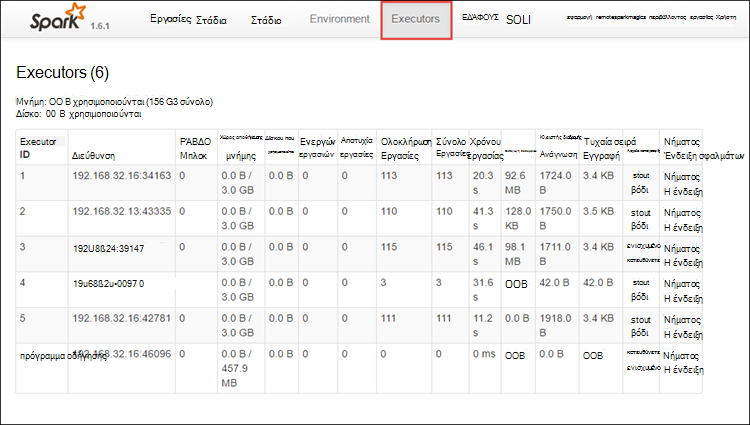
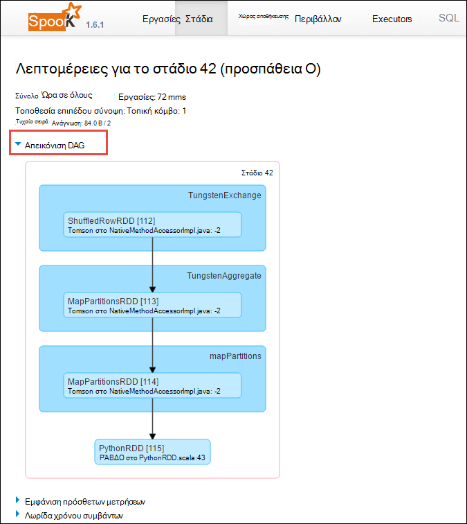

<properties 
    pageTitle="Παρακολούθηση και ο εντοπισμός σφαλμάτων εργασίες που εκτελούνται στο τους Apache συμπλέγματος στο HDInsight | Microsoft Azure" 
    description="Χρήση ΝΉΜΑΤΑ περιβάλλοντος εργασίας Χρήστη, τους περιβάλλοντος εργασίας Χρήστη και τους ιστορικού διακομιστή για την παρακολούθηση και εντοπισμός σφαλμάτων εργασίες που εκτελούνται σε ένα σύμπλεγμα τους στο Azure HDInsight" 
    services="hdinsight" 
    documentationCenter="" 
    authors="nitinme" 
    manager="jhubbard" 
    editor="cgronlun"
    tags="azure-portal"/>

<tags 
    ms.service="hdinsight" 
    ms.workload="big-data" 
    ms.tgt_pltfrm="na" 
    ms.devlang="na" 
    ms.topic="article" 
    ms.date="08/25/2016" 
    ms.author="nitinme"/>

# Παρακολούθηση και ο εντοπισμός σφαλμάτων εργασίες που εκτελούνται στο σύμπλεγμα Apache τους στο HDInsight Linux

Σε αυτό το άρθρο θα μάθετε πώς μπορείτε να παρακολουθείτε και να διορθώσετε τους εργασίες χρησιμοποιώντας το περιβάλλον εργασίας Χρήστη ΝΉΜΑΤΑ, τους περιβάλλοντος εργασίας Χρήστη και ο διακομιστής ιστορικό τους. Για αυτό το άρθρο, θα σας θα ξεκινήσει μια εργασία τους χρησιμοποιώντας ένα σημειωματάριο που είναι διαθέσιμες με το σύμπλεγμα τους, **υπολογιστή εκμάθησης: ανάλυση πρόβλεψης σε τρόφιμα επιθεώρησης δεδομένων με τη χρήση MLLib**. Μπορείτε να χρησιμοποιήσετε τα παρακάτω βήματα για να παρακολουθείτε μια εφαρμογή που έχετε υποβάλει χρησιμοποιώντας καθώς και τυχόν άλλες προσέγγιση για παράδειγμα, **υποβολή τους**.

##Προαπαιτούμενα στοιχεία

Πρέπει να έχετε τα εξής:

- Μια συνδρομή του Azure. Ανατρέξτε στο θέμα [λήψη Azure δωρεάν δοκιμαστικής έκδοσης](https://azure.microsoft.com/documentation/videos/get-azure-free-trial-for-testing-hadoop-in-hdinsight/).
- Ένα σύμπλεγμα Apache τους σε HDInsight Linux. Για οδηγίες, ανατρέξτε στο θέμα [Δημιουργία τους Apache συμπλεγμάτων στο Azure HDInsight](hdinsight-apache-spark-jupyter-spark-sql.md).
- Θα πρέπει να έχετε ξεκινήσει να εκτελεί το Σημειωματάριο, **[υπολογιστή εκμάθησης: ανάλυση πρόβλεψης σε τρόφιμα επιθεώρησης δεδομένων με τη χρήση MLLib](hdinsight-apache-spark-machine-learning-mllib-ipython.md)**. Για οδηγίες σχετικά με τον τρόπο για να εκτελέσετε αυτό το Σημειωματάριο, ακολουθήστε τη σύνδεση.  

## Παρακολουθήστε μια εφαρμογή στο περιβάλλον εργασίας Χρήστη του ΝΉΜΑΤΑ

1. Εκκινήστε το περιβάλλον εργασίας Χρήστη του ΝΉΜΑΤΑ. Από το σύμπλεγμα blade, κάντε κλικ στην επιλογή **Πίνακας εργαλείων σύμπλεγμα**και, στη συνέχεια, κάντε κλικ στην επιλογή **ΝΉΜΑΤΑ**.

    

    >[AZURE.TIP] Εναλλακτικά, μπορείτε επίσης να εκκινήσετε το περιβάλλον εργασίας Χρήστη ΝΉΜΑΤΑ από το περιβάλλον εργασίας Χρήστη του Ambari. Για να εμφανίσετε το περιβάλλον εργασίας Χρήστη Ambari, από το σύμπλεγμα blade, κάντε κλικ στην επιλογή **Πίνακας εργαλείων σύμπλεγμα**και, στη συνέχεια, κάντε κλικ στην επιλογή **Πίνακας εργαλείων σύμπλεγμα HDInsight**. Από το περιβάλλον εργασίας Χρήστη του Ambari, κάντε κλικ στην επιλογή **ΝΉΜΑΤΑ**, κάντε κλικ στην επιλογή **Γρήγορες συνδέσεις**, κάντε κλικ στην επιλογή Διαχείριση ενεργό πόρων και, στη συνέχεια, κάντε κλικ στην επιλογή **ResourceManager περιβάλλοντος εργασίας Χρήστη**.  

3. Επειδή τα αποτελέσματα της εργασίας τους, χρησιμοποιώντας Jupyter σημειωματάρια, η εφαρμογή έχει το όνομα **remotesparkmagics** (αυτό είναι το όνομα για όλες τις εφαρμογές που ξεκινούν από τα σημειωματάρια). Κάντε κλικ στην επιλογή το Αναγνωριστικό εφαρμογής σε σχέση με το όνομα της εφαρμογής για να λάβετε περισσότερες πληροφορίες σχετικά με την εργασία. Έτσι ανοίγει την προβολή της εφαρμογής.

    

    Οι εφαρμογές που ξεκινούν από τα σημειωματάρια Jupyter, η κατάσταση είναι πάντα **ΕΚΤΕΛΕΊΤΑΙ** μέχρι να κλείσετε το Σημειωματάριο.

4. Από την προβολή εφαρμογή, μπορείτε να κάνετε Διερεύνηση μετά βρείτε τα κοντέινερ που σχετίζεται με την εφαρμογή και τα αρχεία καταγραφής (stdout stderr). Μπορείτε επίσης να εκκινήσετε το περιβάλλον εργασίας Χρήστη τους επιλέγοντας τη σύνδεση που αντιστοιχεί στο **Παρακολούθηση της διεύθυνσης URL**, όπως φαίνεται παρακάτω. 

    

## Παρακολουθήστε μια εφαρμογή στο περιβάλλον εργασίας Χρήστη του τους

Το περιβάλλον εργασίας χρήστη τους, μπορείτε να κάνετε Διερεύνηση σε τις εργασίες τους που έχουν δημιουργηθεί από την εφαρμογή που ξεκινήσατε νωρίτερα.

1. Για να εμφανίσετε το περιβάλλον εργασίας Χρήστη τους, από την προβολή της εφαρμογής, κάντε κλικ στη σύνδεση σε σχέση με την **Παρακολούθηση της διεύθυνσης URL**, όπως φαίνεται στην την εικόνα της οθόνης παραπάνω. Μπορείτε να δείτε όλες τις εργασίες τους που ξεκινούν από την εφαρμογή που εκτελείται στο Σημειωματάριο Jupyter.

    

2. Κάντε κλικ στην καρτέλα **Executors** για να δείτε τις πληροφορίες επεξεργασίας και αποθήκευσης για κάθε executor. Επίσης, μπορείτε να ανακτήσετε στοίβας κλήσεων, κάνοντας κλικ στη σύνδεση **Νήματος ένδειξης** .

    
 
3. Κάντε κλικ στην καρτέλα **στάδια** για να δείτε τα στάδια που σχετίζονται με την εφαρμογή.

    

    Κάθε στάδιο μπορεί να έχει πολλές εργασίες για την οποία μπορείτε να προβάλετε εκτέλεσης στατιστικά στοιχεία, όπως φαίνεται παρακάτω.

     

4. Από τη σελίδα λεπτομερειών στάδιο, μπορείτε να εκκινήσετε DAG απεικόνισης. Ανάπτυξη της σύνδεσης **DAG απεικόνισης** στο επάνω μέρος της σελίδας, όπως φαίνεται παρακάτω.

    

    Άμεση Aclyic γραφήματος ή DAG αντιπροσωπεύει τις διάφορες καταστάσεις στην εφαρμογή. Κάθε μπλε πλαίσιο στο γράφημα αντιπροσωπεύει μια λειτουργία τους κλήση από την εφαρμογή.

5. Από τη σελίδα λεπτομερειών στάδιο, μπορείτε επίσης να εκκινήσετε την εφαρμογή προβολή λωρίδας χρόνου. Ανάπτυξη της σύνδεσης **Λωρίδα χρόνου συμβάντων** στο επάνω μέρος της σελίδας, όπως φαίνεται παρακάτω.

    

    Αυτό εμφανίζει τα συμβάντα τους στη φόρμα μιας λωρίδας χρόνου. Προβολή λωρίδας χρόνου είναι διαθέσιμη σε τρία επίπεδα, σε έργα, μέσα σε μια εργασία και μέσα σε ένα στάδιο. Στην παραπάνω εικόνα καταγράφει την προβολή λωρίδας χρόνου για ένα συγκεκριμένο στάδιο.

    >[AZURE.TIP] Εάν επιλέξετε το πλαίσιο ελέγχου **Ενεργοποίηση μεγέθυνση** , μπορείτε να κάνετε κύλιση αριστερά ή προς τα δεξιά κατά μήκος της προβολής λωρίδας χρόνου.

6. Άλλες καρτέλες στο περιβάλλον εργασίας Χρήστη του τους παρέχουν χρήσιμες πληροφορίες σχετικά με την παρουσία του καθώς και τους.

    * Καρτέλα "Αποθήκευση" - Εάν η εφαρμογή σας δημιουργεί μια RDDs, μπορείτε να βρείτε πληροφορίες σχετικά με αυτές στην καρτέλα "Αποθήκευση".
    * Καρτέλα περιβάλλοντος - αυτή η καρτέλα παρέχει πολλές χρήσιμες πληροφορίες σχετικά με την παρουσία τους όπως το 
        * Έκδοση Scala
        * Αρχείο καταγραφής συμβάντων καταλόγου που σχετίζεται με το σύμπλεγμα
        * Αριθμός πυρήνων executor για την εφαρμογή
        * Κ.λπ.

## Βρείτε πληροφορίες σχετικά με τις ολοκληρωμένες εργασίες χρησιμοποιώντας το διακομιστή ιστορικού τους

Μόλις ολοκληρωθεί μια εργασία, τις πληροφορίες σχετικά με την εργασία παραμένει στο διακομιστή ιστορικό τους.

1. Για να ξεκινήσετε το διακομιστή ιστορικού τους, από το σύμπλεγμα blade, κάντε κλικ στην επιλογή **Πίνακας εργαλείων σύμπλεγμα**και, στη συνέχεια, κάντε κλικ στην επιλογή **Διακομιστή ιστορικό τους**.

    

    >[AZURE.TIP] Εναλλακτικά, μπορείτε επίσης να εκκινήσετε τους ιστορικού διακομιστή περιβάλλοντος εργασίας Χρήστη του από το περιβάλλον εργασίας Χρήστη του Ambari. Για να εμφανίσετε το περιβάλλον εργασίας Χρήστη Ambari, από το σύμπλεγμα blade, κάντε κλικ στην επιλογή **Πίνακας εργαλείων σύμπλεγμα**και, στη συνέχεια, κάντε κλικ στην επιλογή **Πίνακας εργαλείων σύμπλεγμα HDInsight**. Από το περιβάλλον εργασίας Χρήστη του Ambari, κάντε κλικ στην επιλογή **τους**, κάντε κλικ στην επιλογή **Γρήγορες συνδέσεις**και, στη συνέχεια, κάντε κλικ στην επιλογή **Τους ιστορικού διακομιστή περιβάλλοντος εργασίας Χρήστη**.

2. Θα δείτε όλες τις ολοκληρωμένες εφαρμογές που παρατίθενται. Κάντε κλικ στην επιλογή Αναγνωριστικό εφαρμογής για να κάνετε Διερεύνηση σε μια εφαρμογή για περισσότερες πληροφορίες.

    
    

## Δείτε επίσης

* [Επισκόπηση: Apache τους σε Azure HDInsight](hdinsight-apache-spark-overview.md)

### Σενάρια

* [Τους με το BI: Εκτέλεση ανάλυσης αλληλεπιδραστικών δεδομένων με χρήση τους σε HDInsight με εργαλεία Επιχειρηματικής ευφυΐας](hdinsight-apache-spark-use-bi-tools.md)

* [Τους με μηχανικής εκμάθησης: χρήση τους σε HDInsight για την ανάλυση δόμησης θερμοκρασίας με τη χρήση δεδομένων HVAC](hdinsight-apache-spark-ipython-notebook-machine-learning.md)

* [Τους με μηχανικής εκμάθησης: χρήση τους σε HDInsight πρόβλεψη τροφίμων στα αποτελέσματα ελέγχου](hdinsight-apache-spark-machine-learning-mllib-ipython.md)

* [Τους ροής: Χρήση τους σε HDInsight για τη δημιουργία εφαρμογών σε πραγματικό χρόνο ροής](hdinsight-apache-spark-eventhub-streaming.md)

* [Ανάλυση καταγραφής τοποθεσία Web χρησιμοποιώντας τους στο HDInsight](hdinsight-apache-spark-custom-library-website-log-analysis.md)

### Δημιουργία και εκτέλεση εφαρμογών

* [Δημιουργήστε μια μεμονωμένη εφαρμογή χρησιμοποιώντας Scala](hdinsight-apache-spark-create-standalone-application.md)

* [Απομακρυσμένη εκτέλεση εργασιών σε ένα σύμπλεγμα τους χρησιμοποιώντας Λίβιος](hdinsight-apache-spark-livy-rest-interface.md)

### Εργαλεία και επεκτάσεις

* [Χρησιμοποιήστε HDInsight εργαλεία προσθήκης για IntelliJ ΙΔΈΑ για να δημιουργήσετε και να υποβάλετε τους Scala εφαρμογών](hdinsight-apache-spark-intellij-tool-plugin.md)

* [Χρησιμοποιήστε HDInsight εργαλεία προσθήκης για IntelliJ ΙΔΈΑ για τον εντοπισμό σφαλμάτων εφαρμογών τους από απόσταση](hdinsight-apache-spark-intellij-tool-plugin-debug-jobs-remotely.md)

* [Χρήση Zeppelin σημειωματάρια με ένα σύμπλεγμα τους σε HDInsight](hdinsight-apache-spark-use-zeppelin-notebook.md)

* [Διαθέσιμο για Jupyter σημειωματαρίου στο σύμπλεγμα τους για HDInsight πυρήνων](hdinsight-apache-spark-jupyter-notebook-kernels.md)

* [Χρήση εξωτερικών πακέτων με σημειωματάρια Jupyter](hdinsight-apache-spark-jupyter-notebook-use-external-packages.md)

* [Εγκατάσταση Jupyter στον υπολογιστή σας και να συνδεθείτε με ένα σύμπλεγμα HDInsight τους](hdinsight-apache-spark-jupyter-notebook-install-locally.md)

### Διαχείριση πόρων

* [Διαχείριση πόρων για το σύμπλεγμα Apache τους στο Azure HDInsight](hdinsight-apache-spark-resource-manager.md)
