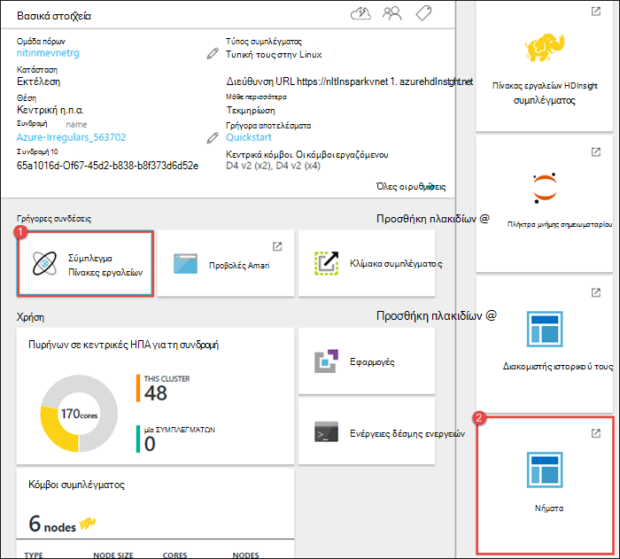
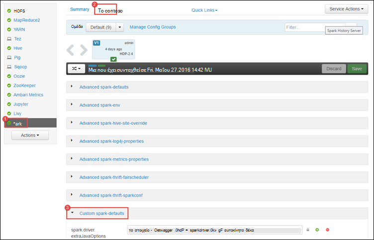
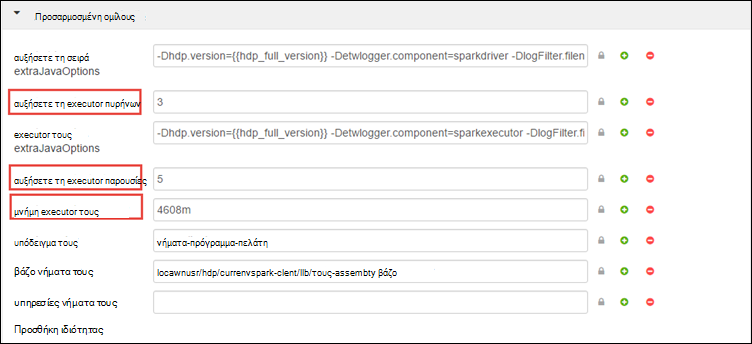
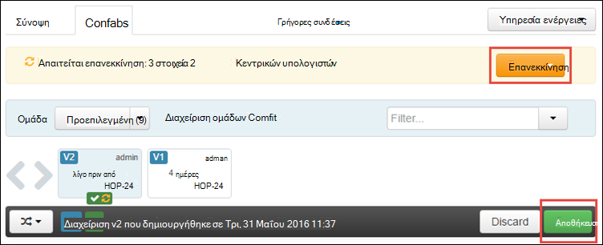
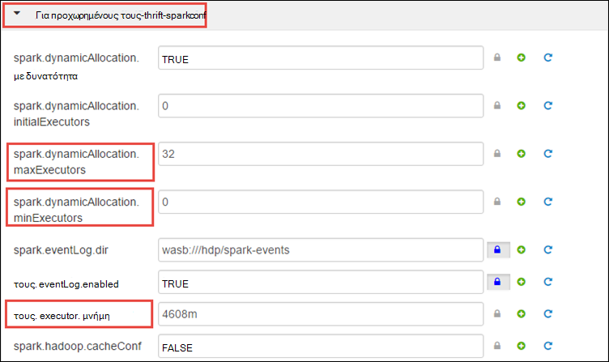
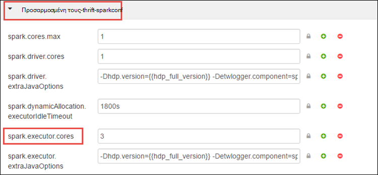
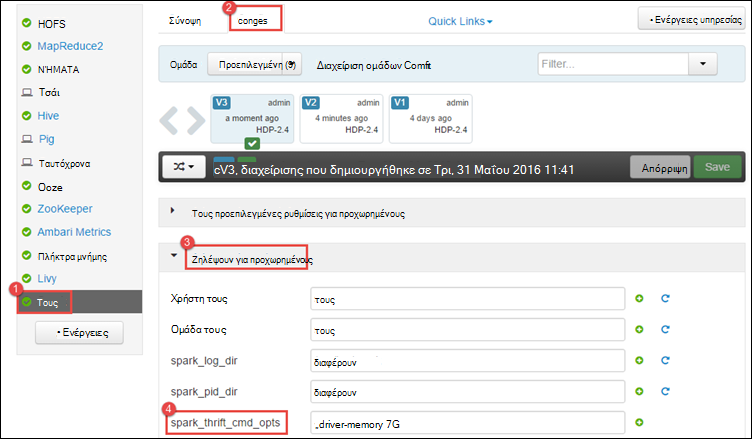
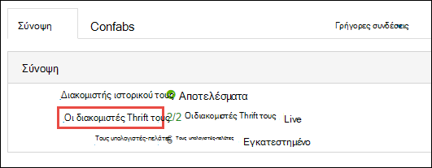
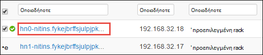
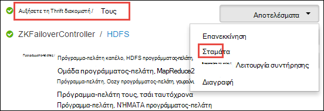

<properties 
    pageTitle="Χρήση της διαχείρισης πόρων για να δεσμεύσετε πόρους στο σύμπλεγμα Apache τους στο HDInsight | Microsoft Azure" 
    description="Μάθετε πώς μπορείτε να χρησιμοποιήσετε τη διαχείριση πόρων για τους συμπλεγμάτων σε HDInsight για καλύτερες επιδόσεις." 
    services="hdinsight" 
    documentationCenter="" 
    authors="nitinme" 
    manager="jhubbard" 
    editor="cgronlun"
    tags="azure-portal"/>

<tags 
    ms.service="hdinsight" 
    ms.workload="big-data" 
    ms.tgt_pltfrm="na" 
    ms.devlang="na" 
    ms.topic="article" 
    ms.date="08/25/2016" 
    ms.author="nitinme"/>

# Διαχείριση πόρων για το σύμπλεγμα Apache τους σε HDInsight Linux

Σε αυτό το άρθρο θα μάθετε πώς να αποκτήσετε πρόσβαση των διασυνδέσεων όπως Ambari περιβάλλοντος εργασίας Χρήστη, ΝΉΜΑΤΑ περιβάλλοντος εργασίας Χρήστη, και ο διακομιστής ιστορικού τους που σχετίζεται με το σύμπλεγμά σας τους. Μπορείτε, επίσης, θα μάθετε σχετικά με τον τρόπο με ακρίβεια τη ρύθμιση παραμέτρων του συμπλέγματος για βέλτιστη απόδοση.

**Προαπαιτούμενα στοιχεία:**

Πρέπει να έχετε τα εξής:

- Μια συνδρομή του Azure. Ανατρέξτε στο θέμα [λήψη Azure δωρεάν δοκιμαστικής έκδοσης](https://azure.microsoft.com/documentation/videos/get-azure-free-trial-for-testing-hadoop-in-hdinsight/).
- Ένα σύμπλεγμα Apache τους σε HDInsight Linux. Για οδηγίες, ανατρέξτε στο θέμα [Δημιουργία τους Apache συμπλεγμάτων στο Azure HDInsight](hdinsight-apache-spark-jupyter-spark-sql.md).

## Πώς να εκκίνηση του περιβάλλοντος εργασίας Χρήστη Web Ambari;

1. Από την [Πύλη Azure](https://portal.azure.com/), από την startboard, κάντε κλικ στο πλακίδιο για το σύμπλεγμα τους (εάν καρφιτσωμένα αυτό για να το startboard). Μπορείτε επίσης να μεταβείτε σε το σύμπλεγμά σας στην περιοχή **Αναζήτηση όλων** > **Συμπλεγμάτων HDInsight**. 
 
2. Από το σύμπλεγμα blade τους, κάντε κλικ στην επιλογή **πίνακα εργαλείων**. Όταν σας ζητηθεί, πληκτρολογήστε τα διαπιστευτήρια διαχειριστή για το σύμπλεγμα τους.

    ![Εκκίνηση Ambari] (./media/hdinsight-apache-spark-resource-manager/hdispark.cluster.launch.dashboard.png "Εκκίνηση της διαχείρισης πόρων")

3. Αυτό θα πρέπει να εκκινήστε Ambari Web περιβάλλον εργασίας Χρήστη του, όπως φαίνεται παρακάτω.

    ![Ambari Web περιβάλλοντος εργασίας Χρήστη] (./media/hdinsight-apache-spark-resource-manager/ambari-web-ui.png "Ambari Web περιβάλλοντος εργασίας Χρήστη")   

## Πώς να εκκίνηση διακομιστή ιστορικού τους;

1. Από την [Πύλη Azure](https://portal.azure.com/), από την startboard, κάντε κλικ στο πλακίδιο για το σύμπλεγμα τους (εάν καρφιτσωμένα αυτό για να το startboard).

2. Από το σύμπλεγμα blade, στην περιοχή **Γρήγορες συνδέσεις**, κάντε κλικ στην επιλογή **Σύμπλεγμα πίνακα εργαλείων**. Στο το blade **Σύμπλεγμα πίνακα εργαλείων** , κάντε κλικ **Διακομιστή ιστορικό τους**.

    ![Διακομιστής ιστορικού τους] (./media/hdinsight-apache-spark-resource-manager/launch-history-server.png "Διακομιστής ιστορικού τους")

    Όταν σας ζητηθεί, πληκτρολογήστε τα διαπιστευτήρια διαχειριστή για το σύμπλεγμα τους.

## Πώς να εκκίνηση περιβάλλον εργασίας Χρήστη του νήματα;

Μπορείτε να χρησιμοποιήσετε το περιβάλλον εργασίας Χρήστη ΝΉΜΑΤΑ για την εποπτεία εφαρμογών που εκτελούνται τη συγκεκριμένη στιγμή στο σύμπλεγμα τους. 

1. Από το σύμπλεγμα blade, κάντε κλικ στην επιλογή **Πίνακας εργαλείων σύμπλεγμα**και, στη συνέχεια, κάντε κλικ στην επιλογή **ΝΉΜΑΤΑ**.

    

    >[AZURE.TIP] Εναλλακτικά, μπορείτε επίσης να εκκινήσετε το περιβάλλον εργασίας Χρήστη ΝΉΜΑΤΑ από το περιβάλλον εργασίας Χρήστη του Ambari. Για να εμφανίσετε το περιβάλλον εργασίας Χρήστη Ambari, από το σύμπλεγμα blade, κάντε κλικ στην επιλογή **Πίνακας εργαλείων σύμπλεγμα**και, στη συνέχεια, κάντε κλικ στην επιλογή **Πίνακας εργαλείων σύμπλεγμα HDInsight**. Από το περιβάλλον εργασίας Χρήστη του Ambari, κάντε κλικ στην επιλογή **ΝΉΜΑΤΑ**, κάντε κλικ στην επιλογή **Γρήγορες συνδέσεις**, κάντε κλικ στην επιλογή Διαχείριση ενεργό πόρων και, στη συνέχεια, κάντε κλικ στην επιλογή **ResourceManager περιβάλλοντος εργασίας Χρήστη**.

## Τι είναι η ρύθμιση παραμέτρων του συμπλέγματος βέλτιστη για να εκτελέσετε τους εφαρμογές;

Οι τρεις βασικές παράμετροι που μπορούν να χρησιμοποιηθούν για τη ρύθμιση παραμέτρων τους ανάλογα με τις απαιτήσεις της εφαρμογής είναι `spark.executor.instances`, `spark.executor.cores`, και `spark.executor.memory`. Ένα Executor είναι μια διαδικασία εκκίνηση μιας εφαρμογής τους. Εκτελείται στον κόμβο εργαζόμενου και είναι υπεύθυνος για την εκτέλεση των εργασιών για την εφαρμογή. Ο προεπιλεγμένος αριθμός executors και τα μεγέθη executor για κάθε σύμπλεγμα υπολογίζεται με βάση τον αριθμό των κόμβους εργασίας και το μέγεθος κόμβο εργασίας. Αυτά είναι αποθηκευμένα σε `spark-defaults.conf` σε τους κόμβους κεφαλής σύμπλεγμα. 

Οι τρεις παράμετροι μπορούν να ρυθμιστούν στο επίπεδο συμπλέγματος (για όλες τις εφαρμογές που εκτελούνται στο σύμπλεγμα) ή μπορεί να καθοριστεί για κάθε μεμονωμένη εφαρμογή καθώς και.

### Αλλάξτε τις παραμέτρους χρησιμοποιώντας Ambari περιβάλλον εργασίας Χρήστη

1. Από το περιβάλλον εργασίας Χρήστη του Ambari κάντε κλικ στην επιλογή **τους**, κάντε κλικ στην επιλογή **διαμορφώσεων**και, στη συνέχεια, αναπτύξτε το στοιχείο **προσαρμοσμένη τις προεπιλεγμένες ρυθμίσεις τους**.

    

2. Οι προεπιλεγμένες τιμές είναι καλό να έχετε 4 τους εφαρμογές εκτελούνται ταυτόχρονα στο σύμπλεγμα. Μπορείτε να κάνετε αλλαγές αυτές τις τιμές από το περιβάλλον εργασίας χρήστη, όπως φαίνεται παρακάτω.

    

3. Κάντε κλικ στο κουμπί **Αποθήκευση** για να αποθηκεύσετε τις αλλαγές ρύθμισης παραμέτρων. Στο επάνω μέρος της σελίδας, θα σας ζητηθεί να κάνετε επανεκκίνηση όλων των υπηρεσιών που επηρεάζεται. Κάντε κλικ στο κουμπί **επανεκκίνηση**.

    

### Αλλάξτε τις παραμέτρους για μια εφαρμογή που εκτελείται στο Σημειωματάριο Jupyter

Για εφαρμογές που εκτελούνται στο Σημειωματάριο Jupyter, μπορείτε να χρησιμοποιήσετε το `%%configure` μαγικός για να κάνετε τις αλλαγές ρύθμισης παραμέτρων. Ιδανικά, πρέπει να κάνετε αυτές τις αλλαγές στην αρχή της εφαρμογής, πριν να εκτελέσετε το πρώτο κελί κώδικα. Αυτό εξασφαλίζει ότι η ρύθμιση παραμέτρων εφαρμόζεται για την περίοδο λειτουργίας Λίβιος, όταν το λαμβάνει δημιουργήθηκε. Εάν θέλετε να αλλάξετε τις ρυθμίσεις σε μεταγενέστερο στάδιο στην εφαρμογή, πρέπει να χρησιμοποιήσετε το `-f` παραμέτρου. Ωστόσο, με αυτόν τον τρόπο όλα την πρόοδο της εφαρμογής θα χαθούν.

Το παρακάτω τμήμα κώδικα δείχνει πώς μπορείτε να αλλάξετε τις ρυθμίσεις για μια εφαρμογή που εκτελείται στο Jupyter.

    %%configure 
    {"executorMemory": "3072M", "executorCores": 4, “numExecutors”:10}

Ρύθμιση παραμέτρων πρέπει να διαβιβαστεί στο ως συμβολοσειρά JSON και πρέπει να είναι στην επόμενη γραμμή μετά η μαγεία, όπως φαίνεται στη στήλη παράδειγμα. 

### Αλλαγή τις παραμέτρους για μια εφαρμογή που υποβάλλεται χρησιμοποιώντας τους υποβολή

Παρακολούθηση εντολών είναι ένα παράδειγμα του πώς μπορείτε να αλλάξετε τη ρύθμιση παραμέτρων για μια εφαρμογή δέσμης που υποβάλλεται χρησιμοποιώντας `spark-submit`.

    spark-submit --class <the application class to execute> --executor-memory 3072M --executor-cores 4 –-num-executors 10 <location of application jar file> <application parameters>

### Αλλαγή των παραμέτρων μιας εφαρμογής που υποβάλλεται με καμπύλη

Παρακολούθηση εντολή είναι ένα παράδειγμα του τρόπου για να αλλάξετε τη ρύθμιση παραμέτρων για μια εφαρμογή δέσμης που έχει υποβληθεί με χρήση καμπύλη.

    curl -k -v -H 'Content-Type: application/json' -X POST -d '{"file":"<location of application jar file>", "className":"<the application class to execute>", "args":[<application parameters>], "numExecutors":10, "executorMemory":"2G", "executorCores":5' localhost:8998/batches

### Πώς μπορώ να αλλάξω αυτές τις παραμέτρους σε ένα διακομιστή Thrift τους;

Διακομιστής Thrift τους παρέχει πρόσβαση JDBC/ODBC σε ένα σύμπλεγμα τους και χρησιμοποιείται για την υπηρεσία ερωτήματα SQL τους. Εργαλεία όπως το Power BI, Tableau κ.λπ. Χρησιμοποιήστε το πρωτόκολλο ODBC επικοινωνία με τους Thrift διακομιστή για την εκτέλεση ερωτημάτων SQL τους ως εφαρμογή τους. Όταν δημιουργείται ένα σύμπλεγμα τους, ξεκινούν δύο παρουσίες του διακομιστή Thrift τους, ένα σε κάθε κεφαλής κόμβο. Κάθε διακομιστή Thrift τους είναι ορατό ως εφαρμογή τους στο περιβάλλον εργασίας Χρήστη του ΝΉΜΑΤΑ. 

Διακομιστής Thrift τους χρησιμοποιεί εκχώρησης δυναμικής executor τους και επομένως το `spark.executor.instances` δεν χρησιμοποιείται. Αντί για αυτό, χρησιμοποιεί τους Thrift διακομιστής `spark.dynamicAllocation.minExecutors` και `spark.dynamicAllocation.maxExecutors` για να καθορίσετε το πλήθος των executor. Οι παράμετροι `spark.executor.cores` και `spark.executor.memory` χρησιμοποιείται για να τροποποιήσετε το μέγεθος executor. Μπορείτε να αλλάξετε αυτές τις παραμέτρους, όπως φαίνεται παρακάτω.

* Αναπτύξτε την κατηγορία **για προχωρημένους τους-thrift-sparkconf** για να ενημερώσετε τις παραμέτρους `spark.dynamicAllocation.minExecutors`, `spark.dynamicAllocation.maxExecutors`, και `spark.executor.memory`.

     

* Αναπτύξτε την κατηγορία **προσαρμοσμένη τους-thrift-sparkconf** για να ενημερώσετε την παράμετρο `spark.executor.cores`.

    

### Πώς μπορώ να αλλάξω το πρόγραμμα οδήγησης μνήμης του διακομιστή Thrift τους;

Μνήμη του προγράμματος οδήγησης διακομιστή Thrift τους είναι έχει ρυθμιστεί ώστε να 25% του μεγέθους RAM κεφαλής κόμβου, εφόσον το συνολικό μέγεθος RAM του κεφαλής κόμβου είναι μεγαλύτερο από 14GB. Μπορείτε να χρησιμοποιήσετε το περιβάλλον εργασίας Χρήστη Ambari για να αλλάξετε τη ρύθμιση παραμέτρων μνήμης πρόγραμμα οδήγησης, όπως φαίνεται παρακάτω.

* Από το περιβάλλον εργασίας Χρήστη του Ambari κάντε κλικ στην επιλογή **τους**, κάντε κλικ στην επιλογή **διαμορφώσεων**, αναπτύξτε **τους φάκελος για προχωρημένους**και, στη συνέχεια, δώστε την τιμή για το **spark_thrift_cmd_opts**.

    

## Να μην χρησιμοποιείτε BI με σύμπλεγμα τους. Πώς να ανάκτηση τους πόρους;

Επειδή χρησιμοποιούμε δυναμική εκχώρηση τους, οι μόνο πόροι που καταναλώνεται από διακομιστή thrift είναι οι πόροι για την εφαρμογή δύο υποδείγματα. Για να ανακτήσετε αυτούς τους πόρους που πρέπει να διακόψετε τις υπηρεσίες Thrift διακομιστή που εκτελούνται στο σύμπλεγμα.

1. Το περιβάλλον εργασίας Χρήστη Ambari, από το αριστερό παράθυρο, κάντε κλικ στην επιλογή **τους**.

2. Στην επόμενη σελίδα, κάντε κλικ στην επιλογή **Διακομιστές Thrift τους**.

    

3. Θα πρέπει να δείτε τα δύο headnodes στον οποίο εκτελείται το διακομιστή Thrift τους. Κάντε κλικ σε ένα από τα headnodes.

    

4. Στην επόμενη σελίδα εμφανίζει σε λίστα όλες τις υπηρεσίες που εκτελούνται σε συγκεκριμένη headnode. Από τη λίστα, κάντε κλικ στο αναπτυσσόμενο κουμπί δίπλα τους Thrift διακομιστή και, στη συνέχεια, κάντε κλικ στην επιλογή **Διακοπή**.

    

5. Επαναλάβετε αυτά τα βήματα στον καθώς και τα άλλα headnode.

## Σημειωματάριά μου Jupyter δεν εκτελούνται όπως αναμένεται. Πώς μπορώ να επανεκκινήσετε την υπηρεσία;

1. Εκκινήστε το περιβάλλον εργασίας Χρήστη του Ambari Web όπως φαίνεται παραπάνω. Από το αριστερό παράθυρο περιήγησης, κάντε κλικ στην επιλογή **Jupyter**, κάντε κλικ στην επιλογή **Υπηρεσία ενέργειες**και, στη συνέχεια, κάντε κλικ στην επιλογή **Επανεκκινήστε όλα**. Αυτό θα ξεκινήσει η υπηρεσία Jupyter σε όλα τα headnodes.

    ![Επανεκκινήστε το Jupyter] (./media/hdinsight-apache-spark-resource-manager/restart-jupyter.png "Επανεκκινήστε το Jupyter")

    

## Δείτε επίσης

* [Επισκόπηση: Apache τους σε Azure HDInsight](hdinsight-apache-spark-overview.md)

### Σενάρια

* [Τους με το BI: Εκτέλεση ανάλυσης αλληλεπιδραστικών δεδομένων με χρήση τους σε HDInsight με εργαλεία Επιχειρηματικής ευφυΐας](hdinsight-apache-spark-use-bi-tools.md)

* [Τους με μηχανικής εκμάθησης: χρήση τους σε HDInsight για την ανάλυση δόμησης θερμοκρασίας με τη χρήση δεδομένων HVAC](hdinsight-apache-spark-ipython-notebook-machine-learning.md)

* [Τους με μηχανικής εκμάθησης: χρήση τους σε HDInsight πρόβλεψη της εστίασης στα αποτελέσματα ελέγχου](hdinsight-apache-spark-machine-learning-mllib-ipython.md)

* [Τους ροής: Χρήση τους σε HDInsight για τη δημιουργία εφαρμογών σε πραγματικό χρόνο ροής](hdinsight-apache-spark-eventhub-streaming.md)

* [Ανάλυση καταγραφής τοποθεσία Web χρησιμοποιώντας τους στο HDInsight](hdinsight-apache-spark-custom-library-website-log-analysis.md)

### Δημιουργία και εκτέλεση εφαρμογών

* [Δημιουργήστε μια μεμονωμένη εφαρμογή χρησιμοποιώντας Scala](hdinsight-apache-spark-create-standalone-application.md)

* [Απομακρυσμένη εκτέλεση εργασιών σε ένα σύμπλεγμα τους χρησιμοποιώντας Λίβιος](hdinsight-apache-spark-livy-rest-interface.md)

### Εργαλεία και επεκτάσεις

* [Χρησιμοποιήστε HDInsight εργαλεία προσθήκης για IntelliJ ΙΔΈΑ για να δημιουργήσετε και να υποβάλετε τους Scala εφαρμογών](hdinsight-apache-spark-intellij-tool-plugin.md)

* [Χρησιμοποιήστε HDInsight εργαλεία προσθήκης για IntelliJ ΙΔΈΑ για τον εντοπισμό σφαλμάτων εφαρμογών τους από απόσταση](hdinsight-apache-spark-intellij-tool-plugin-debug-jobs-remotely.md)

* [Χρήση Zeppelin σημειωματάρια με ένα σύμπλεγμα τους σε HDInsight](hdinsight-apache-spark-use-zeppelin-notebook.md)

* [Διαθέσιμο για Jupyter σημειωματαρίου στο σύμπλεγμα τους για HDInsight πυρήνων](hdinsight-apache-spark-jupyter-notebook-kernels.md)

* [Χρήση εξωτερικών πακέτων με σημειωματάρια Jupyter](hdinsight-apache-spark-jupyter-notebook-use-external-packages.md)

* [Εγκατάσταση Jupyter στον υπολογιστή σας και να συνδεθείτε με ένα σύμπλεγμα HDInsight τους](hdinsight-apache-spark-jupyter-notebook-install-locally.md)

### Διαχείριση πόρων

* [Παρακολούθηση και εντοπισμού σφαλμάτων εργασίες που εκτελείται σε ένα σύμπλεγμα Apache τους στο HDInsight](hdinsight-apache-spark-job-debugging.md)

[hdinsight-versions]: hdinsight-component-versioning.md
[hdinsight-upload-data]: hdinsight-upload-data.md
[hdinsight-storage]: hdinsight-hadoop-use-blob-storage.md

[azure-purchase-options]: http://azure.microsoft.com/pricing/purchase-options/
[azure-member-offers]: http://azure.microsoft.com/pricing/member-offers/
[azure-free-trial]: http://azure.microsoft.com/pricing/free-trial/
[azure-management-portal]: https://manage.windowsazure.com/
[azure-create-storageaccount]: storage-create-storage-account.md 
