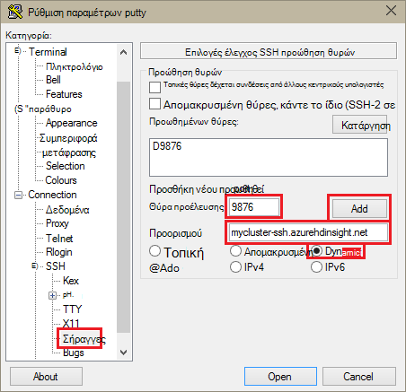
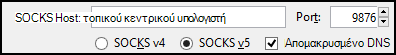
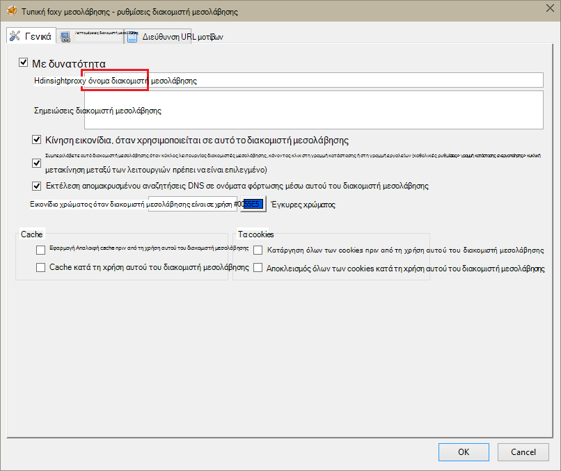
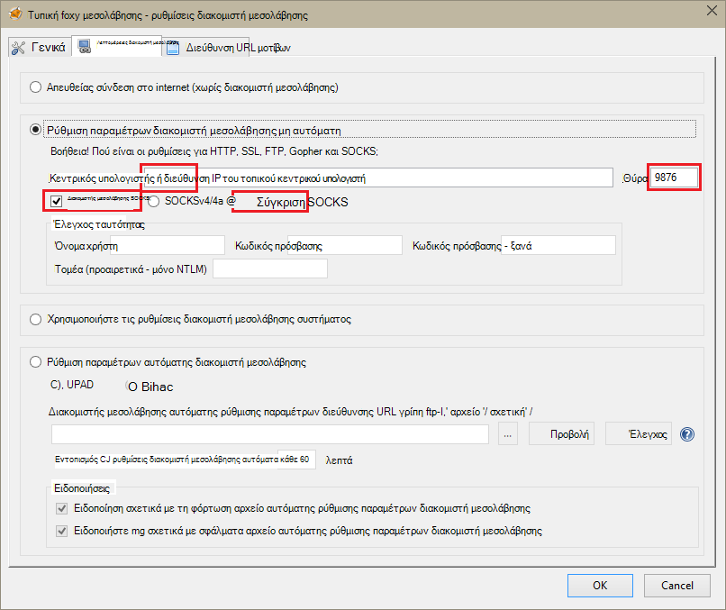
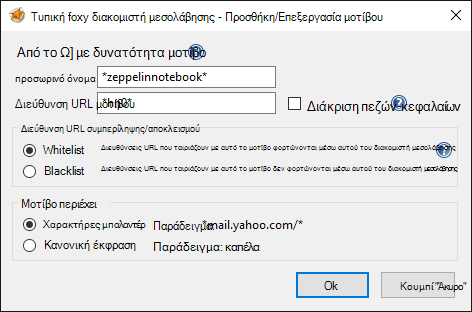
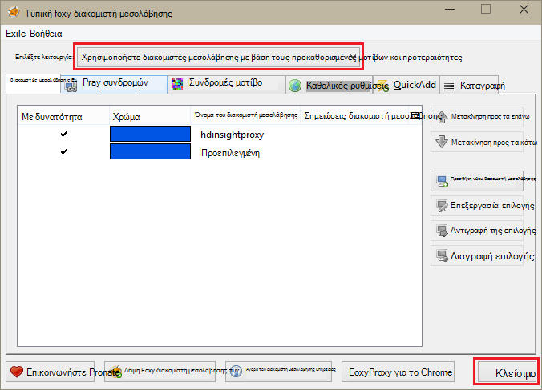

<properties 
    pageTitle="Εγκατάσταση Zeppelin σημειωματάρια για τους Apache σύμπλεγμα σε HDInsight Linux | Microsoft Azure" 
    description="Οδηγίες βήμα προς βήμα σχετικά με τον τρόπο για να εγκαταστήσετε και να χρησιμοποιήσετε Zeppelin σημειωματάρια με τους συμπλεγμάτων σε HDInsight Linux." 
    services="hdinsight" 
    documentationCenter="" 
    authors="nitinme" 
    manager="jhubbard" 
    editor="cgronlun"/>

<tags 
    ms.service="hdinsight" 
    ms.workload="big-data" 
    ms.tgt_pltfrm="na" 
    ms.devlang="na" 
    ms.topic="article" 
    ms.date="10/28/2016" 
    ms.author="nitinme"/>

# Εγκατάσταση Zeppelin σημειωματάρια για τους Apache σύμπλεγμα σε HDInsight Linux

Μάθετε πώς να εγκαταστήσετε το Zeppelin σημειωματάρια σε συμπλεγμάτων Apache τους και πώς μπορείτε να χρησιμοποιήσετε τα σημειωματάρια Zeppelin για να εκτελέσετε εργασίες τους.

> [AZURE.IMPORTANT] Τώρα είναι διαθέσιμες από προεπιλογή με τους συμπλεγμάτων Zeppelin σημειωματάρια. Δεν χρειάζεται να ρητά να τις εγκαταστήσετε πλέον σε ένα σύμπλεγμα τους. Για περισσότερες πληροφορίες, ανατρέξτε στο θέμα [Χρήση Zeppelin σημειωματάρια με τους Apache σύμπλεγμα σε HDInsight Linux](hdinsight-apache-spark-zeppelin-notebook.md). 

**Προαπαιτούμενα στοιχεία:**

* Προτού ξεκινήσετε αυτό το πρόγραμμα εκμάθησης, πρέπει να έχετε μια συνδρομή του Azure. Ανατρέξτε στο θέμα [λήψη Azure δωρεάν δοκιμαστικής έκδοσης](https://azure.microsoft.com/documentation/videos/get-azure-free-trial-for-testing-hadoop-in-hdinsight/).
* Ένα σύμπλεγμα Apache τους. Για οδηγίες, ανατρέξτε στο θέμα [Δημιουργία τους Apache συμπλεγμάτων στο Azure HDInsight](hdinsight-apache-spark-jupyter-spark-sql.md).
* Ένα πρόγραμμα-πελάτη SSH. Για διανομή Linux και Unix ή Macintosh OS X, το `ssh` εντολή παρέχεται με το λειτουργικό σύστημα. Για Windows, συνιστάται να [PuTTY](http://www.chiark.greenend.org.uk/~sgtatham/putty/download.html)

    > [AZURE.NOTE] Εάν θέλετε να χρησιμοποιήσετε ένα πρόγραμμα-πελάτη SSH εκτός από `ssh` ή PuTTY, ανατρέξτε στην τεκμηρίωση για το πρόγραμμα-πελάτη σχετικά με τον τρόπο για να επιτύχετε διοχέτευση SSH.

* Ένα πρόγραμμα περιήγησης web που μπορούν να ρυθμιστούν για να χρησιμοποιήσετε ένα διακομιστή μεσολάβησης SOCKS

* __(προαιρετικό)__: μια προσθήκη όπως [FoxyProxy](http://getfoxyproxy.org/,) που μπορούν να εφαρμοστούν κανόνες που δρομολόγηση μόνο συγκεκριμένα αιτήσεις μέσω της διοχέτευσης.

    > [AZURE.WARNING] Χωρίς προσθήκη όπως FoxyProxy, οι αιτήσεις όλα μέσω του προγράμματος περιήγησης μπορεί να δρομολογούνται μέσω της διοχέτευσης. Αυτό μπορεί να έχει ως αποτέλεσμα πιο αργά τη φόρτωση των σελίδων web στο πρόγραμμα περιήγησης.

## Εγκατάσταση Zeppelin σε ένα σύμπλεγμα τους

Μπορείτε να εγκαταστήσετε Zeppelin σε ένα σύμπλεγμα τους με χρήση δέσμης ενεργειών. Ενέργεια δέσμη ενεργειών χρησιμοποιεί προσαρμοσμένων δεσμών ενεργειών για την εγκατάσταση των στοιχείων σε ένα σύμπλεγμα που δεν είναι διαθέσιμες από προεπιλογή. Μπορείτε να χρησιμοποιήσετε την προσαρμοσμένη δέσμη ενεργειών για την εγκατάσταση Zeppelin από την πύλη Azure, χρησιμοποιώντας το HDInsight .NET SDK ή με χρήση του Azure PowerShell. Μπορείτε να χρησιμοποιήσετε τη δέσμη ενεργειών για την εγκατάσταση Zeppelin είτε ως τμήμα της δημιουργίας σύμπλεγμα ή μετά το σύμπλεγμα βρίσκεται σε λειτουργία. Συνδέσεις στις παρακάτω ενότητες παρέχουν τις οδηγίες σχετικά με τον τρόπο για να το κάνετε. 

### Με την πύλη Azure

Για οδηγίες σχετικά με τη χρήση της πύλης Azure για να εκτελέσετε την ενέργεια δέσμη ενεργειών για την εγκατάσταση Zeppelin, ανατρέξτε στο θέμα [Προσαρμογή HDInsight συμπλεγμάτων με χρήση δέσμης ενεργειών](hdinsight-hadoop-customize-cluster-linux.md#use-a-script-action-from-the-azure-portal). Πρέπει να κάνετε ορισμένες αλλαγές στις οδηγίες σε αυτό το άρθρο.

* Πρέπει να χρησιμοποιήσετε τη δέσμη ενεργειών για την εγκατάσταση Zeppelin. Η προσαρμοσμένη δέσμη ενεργειών για την εγκατάσταση Zeppelin σε ένα σύμπλεγμα τους σε HDInsight είναι διαθέσιμο από τις παρακάτω συνδέσεις:
    * Για τους 1.6.0 συμπλεγμάτων-`https://hdiconfigactions.blob.core.windows.net/linuxincubatorzeppelinv01/install-zeppelin-spark160-v01.sh`
    * Για τους 1.5.2 συμπλεγμάτων-`https://hdiconfigactions.blob.core.windows.net/linuxincubatorzeppelinv01/install-zeppelin-spark151-v01.sh`

* Πρέπει να εκτελέσετε την ενέργεια δέσμη ενεργειών μόνο από το headnode.

* Η δέσμη ενεργειών δεν χρειάζεται να οποιεσδήποτε παραμέτρους. 

### Χρήση HDInsight .NET SDK

Για οδηγίες σχετικά με τη χρήση HDInsight .NET SDK για να εκτελέσετε την ενέργεια δέσμη ενεργειών για την εγκατάσταση Zeppelin, ανατρέξτε στο θέμα [Προσαρμογή HDInsight συμπλεγμάτων με χρήση δέσμης ενεργειών](hdinsight-hadoop-customize-cluster-linux.md#use-a-script-action-from-the-hdinsight-net-sdk). Πρέπει να κάνετε ορισμένες αλλαγές στις οδηγίες σε αυτό το άρθρο.

* Πρέπει να χρησιμοποιήσετε τη δέσμη ενεργειών για την εγκατάσταση Zeppelin. Η προσαρμοσμένη δέσμη ενεργειών για την εγκατάσταση Zeppelin σε ένα σύμπλεγμα τους στο HDInsight είναι διαθέσιμο από τις παρακάτω συνδέσεις:
    * Για τους 1.6.0 συμπλεγμάτων-`https://hdiconfigactions.blob.core.windows.net/linuxincubatorzeppelinv01/install-zeppelin-spark160-v01.sh`
    * Για τους 1.5.2 συμπλεγμάτων-`https://hdiconfigactions.blob.core.windows.net/linuxincubatorzeppelinv01/install-zeppelin-spark151-v01.sh`

* Η δέσμη ενεργειών δεν χρειάζεται να οποιεσδήποτε παραμέτρους. 

* Ορισμός του τύπου σύμπλεγμα που δημιουργείτε για να τους.

### Χρήση του Azure PowerShell

Χρησιμοποιήστε το παρακάτω τμήμα κώδικα του PowerShell για να δημιουργήσετε ένα σύμπλεγμα τους στην HDInsight Linux με Zeppelin εγκατεστημένο. Ανάλογα με την έκδοση του συμπλέγματος τους που έχετε, πρέπει να ενημερώσετε το παρακάτω, για να συμπεριλάβετε στη σύνδεση για την αντίστοιχη προσαρμοσμένη δέσμη ενεργειών PowerShell τμήμα κώδικα. 

* Για τους 1.6.0 συμπλεγμάτων-`https://hdiconfigactions.blob.core.windows.net/linuxincubatorzeppelinv01/install-zeppelin-spark160-v01.sh`
* Για τους 1.5.2 συμπλεγμάτων-`https://hdiconfigactions.blob.core.windows.net/linuxincubatorzeppelinv01/install-zeppelin-spark151-v01.sh`

[AZURE.INCLUDE [upgrade-powershell](../../includes/hdinsight-use-latest-powershell.md)]

    Login-AzureRMAccount
    
    # PROVIDE VALUES FOR THE VARIABLES
    $clusterAdminUsername="admin"
    $clusterAdminPassword="<<password>>"
    $clusterSshUsername="adminssh"
    $clusterSshPassword="<<password>>"
    $clusterName="<<clustername>>"
    $clusterContainerName=$clusterName
    $resourceGroupName="<<resourceGroupName>>"
    $location="<<region>>"
    $storage1Name="<<storagename>>"
    $storage1Key="<<storagekey>>"
    $subscriptionId="<<subscriptionId>>"
    
    Select-AzureRmSubscription -SubscriptionId $subscriptionId
    
    $passwordAsSecureString=ConvertTo-SecureString $clusterAdminPassword -AsPlainText -Force
    $clusterCredential=New-Object System.Management.Automation.PSCredential ($clusterAdminUsername, $passwordAsSecureString)
    $passwordAsSecureString=ConvertTo-SecureString $clusterSshPassword -AsPlainText -Force
    $clusterSshCredential=New-Object System.Management.Automation.PSCredential ($clusterSshUsername, $passwordAsSecureString)
    
    $azureHDInsightConfigs= New-AzureRmHDInsightClusterConfig -ClusterType Spark
    $azureHDInsightConfigs.DefaultStorageAccountKey = $storage1Key
    $azureHDInsightConfigs.DefaultStorageAccountName = "$storage1Name.blob.core.windows.net"
    
    Add-AzureRMHDInsightScriptAction -Config $azureHDInsightConfigs -Name "Install Zeppelin" -NodeType HeadNode -Parameters "void" -Uri "https://hdiconfigactions.blob.core.windows.net/linuxincubatorzeppelinv01/install-zeppelin-spark151-v01.sh"
    
    New-AzureRMHDInsightCluster -Config $azureHDInsightConfigs -OSType Linux -HeadNodeSize "Standard_D12" -WorkerNodeSize "Standard_D12" -ClusterSizeInNodes 2 -Location $location -ResourceGroupName $resourceGroupName -ClusterName $clusterName -HttpCredential $clusterCredential -DefaultStorageContainer $clusterContainerName -SshCredential $clusterSshCredential -Version "3.3"
 
## Ρύθμιση SSH διοχέτευση για να αποκτήσετε πρόσβαση σε ένα σημειωματάριο Zeppelin

Θα χρησιμοποιήσετε σήραγγες SSH για να αποκτήσετε πρόσβαση στα σημειωματάρια Zeppelin εκτελείται σε σύμπλεγμα τους σε HDInsight Linux. Τα παρακάτω βήματα δείχνουν πώς μπορείτε να δημιουργήσετε μια διοχέτευση SSH χρησιμοποιώντας ssh γραμμής εντολών (Linux) και PuTTY (Windows).

### Δημιουργήστε μια διοχέτευση χρησιμοποιώντας την εντολή SSH (Linux)

Χρησιμοποιήστε την παρακάτω εντολή για να δημιουργήσετε μια SSH διοχέτευσης χρησιμοποιώντας το `ssh` εντολή. Αντικαταστήστε το __όνομα ΧΡΉΣΤΗ__ με έναν χρήστη SSH για το σύμπλεγμα HDInsight και αντικαταστήστε __CLUSTERNAME__ με το όνομα του συμπλέγματος HDInsight

    ssh -C2qTnNf -D 9876 USERNAME@CLUSTERNAME-ssh.azurehdinsight.net

Αυτό δημιουργεί μια σύνδεση που δρομολογεί την κίνηση σε τοπική θύρα 9876 στο σύμπλεγμα μέσω SSH. Οι επιλογές είναι:

* **D 9876** - την τοπική θύρα που θα δρομολογείτε την κίνηση μέσω της διοχέτευσης.

* **C** - συμπίεση όλα τα δεδομένα, επειδή η κυκλοφορία web είναι κυρίως κείμενο.

* **2** - ισχύ SSH για να δοκιμάσετε πρωτόκολλο έκδοση 2.

* **οι ερωτήσεις** - λειτουργία χωρίς μηνύματα.

* **T** - απενεργοποίηση ψευδο-tty εκχώρησης, επειδή θα προωθήσουμε απλώς μια θύρα.

* **n** - αποτροπή ανάγνωσης του STDIN, επειδή θα προωθήσουμε απλώς μια θύρα.

* **N** - δεν να εκτελέσετε μια εντολή απομακρυσμένου, επειδή θα προωθήσουμε απλώς μια θύρα.

* **f** - εκτελείται στο παρασκήνιο.

Εάν έχετε ρυθμίσει το σύμπλεγμα με έναν αριθμό-κλειδί SSH, ίσως χρειαστεί Χρησιμοποιήστε το `-i` παραμέτρου και καθορίστε τη διαδρομή προς το ιδιωτικό κλειδί SSH.

Μόλις ολοκληρωθεί η εντολή, κυκλοφορία αποστέλλεται στη θύρα 9876 στον τοπικό υπολογιστή θα δρομολογούνται μέσω Secure Sockets Layer (SSL) στο σύμπλεγμα κεντρικών κόμβο και φαίνεται ότι προέρχονται εκεί.

### Δημιουργήστε μια διοχέτευση χρησιμοποιώντας PuTTY (Windows)

Χρησιμοποιήστε τα ακόλουθα βήματα για να δημιουργήσετε μια διοχέτευση SSH χρησιμοποιώντας PuTTY.

1. Ανοίξτε PuTTY και εισαγάγετε τις πληροφορίες σύνδεσης. Εάν δεν είστε εξοικειωμένοι με PuTTY, ανατρέξτε στο θέμα [Χρήση SSH με βάσει Linux Hadoop σε HDInsight από το Windows](hdinsight-hadoop-linux-use-ssh-windows.md) για πληροφορίες σχετικά με το πώς μπορείτε να το χρησιμοποιήσετε με το HDInsight.

2. Στην ενότητα " **κατηγορία** " στα αριστερά του παραθύρου διαλόγου, ανάπτυξη **σύνδεσης**, αναπτύξτε **SSH**και, στη συνέχεια, επιλέξτε **σήραγγες**.

3. Δώστε τις ακόλουθες πληροφορίες στη φόρμα **Έλεγχος προώθηση θυρών SSH επιλογές** :

    * **Θύρα προέλευσης** - στη θύρα του υπολογιστή-πελάτη που θέλετε να προωθήσετε. Για παράδειγμα, **9876**.

    * **Προορισμός** - το SSH διεύθυνση για το σύμπλεγμα βάσει Linux HDInsight. Για παράδειγμα, **mycluster ssh.azurehdinsight.net**.

    * **Δυναμική** - ενεργοποιεί τη δρομολόγηση δυναμικής διακομιστή μεσολάβησης SOCKS.

    

4. Κάντε κλικ στο κουμπί **Προσθήκη** για να προσθέσετε τις ρυθμίσεις και, στη συνέχεια, κάντε κλικ στην επιλογή **Άνοιγμα** για να ανοίξετε μια σύνδεση SSH.

5. Όταν σας ζητηθεί, συνδεθείτε στο διακομιστή. Θα δημιουργήσετε μια περίοδο λειτουργίας SSH και ενεργοποίηση της διοχέτευσης.

### Χρήση της διοχέτευσης από το πρόγραμμα περιήγησης

> [AZURE.NOTE] Τα βήματα σε αυτήν την ενότητα, χρησιμοποιήστε το πρόγραμμα περιήγησης FireFox, όπως είναι διαθέσιμα για συστήματα Linux, Unix, Macintosh OS X και Windows. Άλλα σύγχρονα προγράμματα περιήγησης όπως Google Chrome, Microsoft Edge ή Apple Safari πρέπει να λειτουργεί καλά; Ωστόσο, η προσθήκη FoxyProxy χρησιμοποιείται σε ορισμένα βήματα ενδέχεται να μην είναι διαθέσιμη για όλα τα προγράμματα περιήγησης.

1. Ρυθμίστε τις παραμέτρους του προγράμματος περιήγησης για να χρησιμοποιήσετε **localhost:9876** ως ένα διακομιστή μεσολάβησης **SOCKS v5** . Παρακάτω θα δείτε πώς φαίνονται οι ρυθμίσεις Firefox. Εάν χρησιμοποιείτε μια διαφορετική θύρα από 9876, αλλάξτε τη θύρα σε αυτόν που χρησιμοποιήσατε:

    

    > [AZURE.NOTE] Επιλογή **Απομακρυσμένο DNS** επιλύει αιτήσεις συστήματος ονομάτων τομέα (DNS) με τη χρήση του συμπλέγματος HDInsight. Εάν αυτό δεν είναι επιλεγμένο, θα επιλυθεί τοπικά DNS.

2. Επαληθεύστε ότι κίνηση δρομολογούνται μέσω της διοχέτευσης από vising μιας τοποθεσίας, όπως [http://www.whatismyip.com/](http://www.whatismyip.com/) με τις ρυθμίσεις διακομιστή μεσολάβησης ενεργοποιηθεί και να απενεργοποιηθεί στο Firefox. Ενώ οι ρυθμίσεις είναι ενεργοποιημένες, θα είναι η διεύθυνση IP για έναν υπολογιστή στο κέντρο δεδομένων Microsoft Azure.

### Επεκτάσεις του προγράμματος περιήγησης

Κατά τη ρύθμιση των παραμέτρων του προγράμματος περιήγησης για να χρησιμοποιήσετε τη διοχέτευση λειτουργεί, συνήθως δεν θέλετε για να δρομολογείτε όλη την κυκλοφορία μέσω της διοχέτευσης. Επεκτάσεις του προγράμματος περιήγησης όπως [FoxyProxy](http://getfoxyproxy.org/) υποστηρίζει αντιστοιχία για αιτήσεις URL μοτίβου (τυπική FoxyProxy ή συν μόνο), έτσι ώστε μόνο οι αιτήσεις για συγκεκριμένες διευθύνσεις URL θα σταλεί μέσω της διοχέτευσης.

Εάν έχετε εγκαταστήσει FoxyProxy τυπική, χρησιμοποιήστε τα παρακάτω βήματα για να ρυθμίσετε τις παραμέτρους της για να προωθήσετε την κυκλοφορία μόνο για το HDInsight μέσω της διοχέτευσης.

1. Ανοίξτε την επέκταση FoxyProxy στο πρόγραμμα περιήγησης. Για παράδειγμα, στο Firefox, επιλέξτε το εικονίδιο FoxyProxy δίπλα στο πεδίο διεύθυνση.

    

2. Επιλέξτε **Προσθήκη νέου διακομιστή μεσολάβησης**, επιλέξτε την καρτέλα **Γενικά** και, στη συνέχεια, πληκτρολογήστε ένα όνομα διακομιστή μεσολάβησης του **HDInsightProxy**.

    

3. Επιλέξτε την καρτέλα **Λεπτομέρειες διακομιστή μεσολάβησης** και συμπληρώστε τα παρακάτω πεδία:

    * **Κεντρικού υπολογιστή ή τη διεύθυνση IP** - αυτός είναι τοπικού κεντρικού υπολογιστή, επειδή χρησιμοποιούμε διοχέτευση SSH στον τοπικό υπολογιστή.

    * **Θύρα** - είναι η θύρα που χρησιμοποιείται για τη διοχέτευση SSH.

    * **Διακομιστής μεσολάβησης SOCKS** - επιλέξτε αυτό το στοιχείο για να ενεργοποιήσετε το πρόγραμμα περιήγησης για να χρησιμοποιήσετε τη διοχέτευση ως ένα διακομιστή μεσολάβησης.

    * **SOCKS v5** - επιλέξτε αυτό το στοιχείο για να ρυθμίσετε την απαιτούμενη έκδοση για το διακομιστή μεσολάβησης.

    

4. Επιλέξτε την καρτέλα **Μοτίβα διεύθυνση URL** και, στη συνέχεια, επιλέξτε **Προσθήκη νέου μοτίβο**. Χρησιμοποιήστε τα ακόλουθα για να ορίσετε το μοτίβο και, στη συνέχεια, κάντε κλικ στο κουμπί **OK**:

    * **Μοτίβο όνομα** - **zeppelinnotebook** - αυτό είναι απλώς ένα φιλικό όνομα για το μοτίβο.

    * **Διεύθυνση URL μοτίβο** - **\*hn0** * - ορίζει ένα μοτίβο που να ταιριάζει με το εσωτερικό πλήρως προσδιορισμένο όνομα τομέα του τελικού σημείου όπου φιλοξενούνται τα σημειωματάρια Zeppelin. Επειδή Zeppelin σημειωματάρια είναι διαθέσιμη μόνο σε το headnode0 του συμπλέγματος και το τελικό σημείο είναι συνήθως `http://hn0-<string>.internal.cloudapp.net`, χρησιμοποιώντας το μοτίβο * *hn0** να διασφαλίσετε ότι η αίτηση θα ανακατευθύνεται στο τελικό σημείο Zeppelin.

        

4. Κάντε κλικ στο **κουμπί OK** για να προσθέσετε το διακομιστή μεσολάβησης και κλείστε τις **Ρυθμίσεις του διακομιστή μεσολάβησης**.

5. Στο επάνω μέρος του παραθύρου διαλόγου FoxyProxy, αλλαγή σε **διακομιστές μεσολάβησης χρήση με βάση τους προκαθορισμένες μοτίβα και προτεραιότητες** **Επιλέξτε λειτουργία** και, στη συνέχεια, κάντε κλικ στο κουμπί **Κλείσιμο**.

    

Αφού ακολουθήσετε αυτά τα βήματα, μόνο οι αιτήσεις για διευθύνσεις URL που περιέχουν τη συμβολοσειρά __hn0__ θα δρομολογούνται μέσω της διοχέτευσης SSL. 

## Πρόσβαση στο Σημειωματάριο Zeppelin

Όταν έχετε SSH διοχέτευση εγκατάστασης, μπορείτε να χρησιμοποιήσετε τα παρακάτω βήματα για να αποκτήσετε πρόσβαση Zeppelin σημειωματαρίου στο σύμπλεγμα τους, ακολουθώντας τα παρακάτω βήματα. Σε αυτήν την ενότητα, θα δείτε πώς μπορείτε να εκτελέσετε % sql και δηλώσεις hive %.

1. Από το πρόγραμμα περιήγησης web, ανοίξτε το τελικό σημείο παρακάτω:

        http://hn0-myspar:9995

    * **hn0** υποδηλώνει headnode0
    * **myspar** είναι τα έξι πρώτα γράμματα του ονόματος του συμπλέγματος τους.
    * **9995** είναι η θύρα όπου Zeppelin σημειωματάριο είναι προσβάσιμα.

2. Δημιουργήστε ένα νέο σημειωματάριο. Από το παράθυρο κεφαλίδα, κάντε κλικ στο **Σημειωματάριο**και, στη συνέχεια, κάντε κλικ στην επιλογή **Δημιουργία νέας σημείωσης**.

    ![Δημιουργία νέου σημειωματαρίου Zeppelin] (./media/hdinsight-apache-spark-use-zeppelin-notebook/hdispark.createnewnote.png "Δημιουργία νέου σημειωματαρίου Zeppelin")

    Στην ίδια σελίδα, κάτω από την επικεφαλίδα **Σημειωματάριο** , θα πρέπει να μπορείτε να δείτε ένα νέο σημειωματάριο με το όνομα που ξεκινούν με **XXXXXXXXX Σημείωση**. Κάντε κλικ στο νέο σημειωματάριο.

3. Στη σελίδα του web για το νέο σημειωματάριο, κάντε κλικ στην επικεφαλίδα και αλλάξτε το όνομα του σημειωματαρίου, εάν θέλετε να. Πατήστε το πλήκτρο ENTER για να αποθηκεύσετε την αλλαγή του ονόματος. Επίσης, βεβαιωθείτε ότι η κεφαλίδα Σημειωματάριο εμφανίζει την κατάσταση μια **σύνδεση** στην επάνω δεξιά γωνία.

    ![Κατάσταση Zeppelin σημειωματαρίου] (./media/hdinsight-apache-spark-use-zeppelin-notebook/hdispark.newnote.connected.png "Κατάσταση Zeppelin σημειωματαρίου")

### Εκτέλεση προτάσεις SQL

4. Φόρτωση του δείγματος δεδομένων σε ένα προσωρινό πίνακα. Όταν δημιουργείτε ένα σύμπλεγμα τους σε HDInsight, το δείγμα αρχείου δεδομένων, **hvac.csv**, αντιγράφεται στο λογαριασμό συσχετισμένη χώρου αποθήκευσης στην περιοχή **\HdiSamples\SensorSampleData\hvac**.

    Στο κενό παραγράφου που δημιουργούνται από προεπιλογή για το νέο σημειωματάριο, επικολλήστε το εξής τμήμα κώδικα.

        // Create an RDD using the default Spark context, sc
        val hvacText = sc.textFile("wasbs:///HdiSamples/HdiSamples/SensorSampleData/hvac/HVAC.csv")
        
        // Define a schema
        case class Hvac(date: String, time: String, targettemp: Integer, actualtemp: Integer, buildingID: String)
        
        // Map the values in the .csv file to the schema
        val hvac = hvacText.map(s => s.split(",")).filter(s => s(0) != "Date").map(
            s => Hvac(s(0), 
                    s(1),
                    s(2).toInt,
                    s(3).toInt,
                    s(6)
            )
        ).toDF()
        
        // Register as a temporary table called "hvac"
        hvac.registerTempTable("hvac")
        
    Πατήστε το **συνδυασμό πλήκτρων SHIFT + ENTER** ή κάντε κλικ στο κουμπί " **αναπαραγωγή** " για την παράγραφο για να εκτελέσετε το τμήμα κώδικα. Η κατάσταση στη δεξιά γωνία της παραγράφου πρέπει να προόδου από είστε ΈΤΟΙΜΟΙ, σε ΕΚΚΡΕΜΌΤΗΤΑ, ΕΚΤΕΛΕΊΤΑΙ σε ΟΛΟΚΛΗΡΩΜΈΝΗ. Το αποτέλεσμα εμφανίζεται στο κάτω μέρος της παραγράφου. Το στιγμιότυπο οθόνης έχει τα εξής:

    ![Δημιουργία προσωρινό πίνακα από ανεπεξέργαστα δεδομένα] (./media/hdinsight-apache-spark-use-zeppelin-notebook/hdispark.note.loaddDataintotable.png "Δημιουργία προσωρινό πίνακα από ανεπεξέργαστα δεδομένα")

    Μπορείτε επίσης να δώσετε έναν τίτλο για κάθε παράγραφο. Από τη δεξιά γωνία, κάντε κλικ στο εικονίδιο **Ρυθμίσεις** και, στη συνέχεια, κάντε κλικ στην επιλογή **Εμφάνιση τίτλου**.

5. Τώρα, μπορείτε να εκτελέσετε προτάσεις SQL τους στον πίνακα **hvac** . Επικολλήστε το ακόλουθο ερώτημα νέας παραγράφου. Το ερώτημα ανακτά το Αναγνωριστικό δόμησης και τη διαφορά μεταξύ του προορισμού και του πραγματικού θερμοκρασίες για κάθε κατασκευή σε μια δεδομένη ημερομηνία. Πατήστε το **συνδυασμό πλήκτρων SHIFT + ENTER**.

        %sql
        select buildingID, (targettemp - actualtemp) as temp_diff, date 
        from hvac
        where date = "6/1/13" 

    Η πρόταση **% sql** στην αρχή ενημερώνει το Σημειωματάριο για να χρησιμοποιήσετε το πρόγραμμα μεταγλώττισης SQL τους. Μπορείτε να δείτε τα καθορισμένα προγράμματα μετάφρασης από την καρτέλα **διερμηνείας** στην κεφαλίδα του σημειωματαρίου.

    Το παρακάτω στιγμιότυπο οθόνης εμφανίζει το αποτέλεσμα.

    ![Εκτέλεσης μιας πρότασης SQL τους, χρησιμοποιώντας το Σημειωματάριο] (./media/hdinsight-apache-spark-use-zeppelin-notebook/hdispark.note.sparksqlquery1.png "Εκτέλεσης μιας πρότασης SQL τους, χρησιμοποιώντας το Σημειωματάριο")

     Κάντε κλικ στην επιλογή Εμφάνιση επιλογών (επισημαίνεται με ορθογώνιο) για να κάνετε εναλλαγή μεταξύ διαφορετικές αναπαραστάσεις για το ίδιο αποτέλεσμα. Κάντε κλικ στην επιλογή **Ρυθμίσεις** για να επιλέξετε ποιες consitutes το κλειδί και τιμές στο αποτέλεσμα. Την εικόνα της οθόνης, επάνω από χρησιμοποιεί **buildingID** ως το κλειδί και το μέσο όρο των **temp_diff** ως η τιμή.

    
6. Μπορείτε επίσης να εκτελέσετε προτάσεις SQL τους χρήση μεταβλητών στο ερώτημα. Το επόμενο τμήμα κώδικα δείχνει πώς μπορείτε να ορίσετε μια μεταβλητή, **Temp**, στο ερώτημα με τις πιθανές τιμές που θέλετε να ερωτήματος με. Πρώτη φορά που εκτελείτε το ερώτημα, μια αναπτυσσόμενη λίστα συμπληρώνεται αυτόματα με τις τιμές που καθορίσατε για τη μεταβλητή.

        %sql
        select buildingID, date, targettemp, (targettemp - actualtemp) as temp_diff
        from hvac
        where targettemp > "${Temp = 65,65|75|85}" 

    Επικόλληση αυτό τμήματος κώδικα σε μια νέα παράγραφο και πατήστε το **συνδυασμό πλήκτρων SHIFT + ENTER**. Το παρακάτω στιγμιότυπο οθόνης εμφανίζει το αποτέλεσμα.

    ![Εκτέλεσης μιας πρότασης SQL τους, χρησιμοποιώντας το Σημειωματάριο] (./media/hdinsight-apache-spark-use-zeppelin-notebook/hdispark.note.sparksqlquery2.png "Εκτέλεσης μιας πρότασης SQL τους, χρησιμοποιώντας το Σημειωματάριο")

    Οι επόμενες ερωτήματα, μπορείτε να επιλέξετε μια νέα τιμή από την αναπτυσσόμενη λίστα και να εκτελέσετε ξανά το ερώτημα. Κάντε κλικ στην επιλογή **Ρυθμίσεις** για να επιλέξετε ποιες consitutes το κλειδί και τιμές στο αποτέλεσμα. Η καταγραφή της οθόνης παραπάνω χρησιμοποιεί **buildingID** ως το κλειδί, τον μέσο όρο των **temp_diff** ως η τιμή και **targettemp** ως ομάδα.

7. Επανεκκινήστε το πρόγραμμα μεταγλώττισης τους SQL για έξοδο από την εφαρμογή. Κάντε κλικ στην καρτέλα **μεταφραστή** στο επάνω μέρος, καθώς και για το πρόγραμμα μετατροπής τους, κάντε κλικ στο κουμπί **επανεκκίνηση**.

    ![Επανεκκινήστε το intepreter Zeppelin] (./media/hdinsight-apache-spark-use-zeppelin-notebook/hdispark.zeppelin.restart.interpreter.png "Επανεκκινήστε το intepreter Zeppelin")

### Εκτέλεση δηλώσεις ομάδας

1. Από το Σημειωματάριο Zeppelin, κάντε κλικ στο κουμπί **μεταφραστή** .

    ![Ενημέρωση Hive μεταφραστής] (./media/hdinsight-apache-spark-use-zeppelin-notebook/zeppelin-update-hive-interpreter-1.png "Ενημέρωση Hive μεταφραστής")

2. Για το πρόγραμμα μεταγλώττισης **ομάδας** , κάντε κλικ στην επιλογή **Επεξεργασία**.

    ![Ενημέρωση Hive διερμηνείας] (./media/hdinsight-apache-spark-use-zeppelin-notebook/zeppelin-update-hive-interpreter-2.png "Ενημέρωση Hive διερμηνείας")

    Ενημερώστε τις ακόλουθες ιδιότητες.

    * Ορισμός **default.password** τον κωδικό πρόσβασης που έχετε καθορίσει για το χρήστη admin κατά τη δημιουργία του συμπλέγματος HDInsight τους.
    * Ορίστε **default.url** σε `jdbc:hive2://<spark_cluster_name>.azurehdinsight.net:443/default;ssl=true?hive.server2.transport.mode=http;hive.server2.thrift.http.path=/hive2`. Αντικατάσταση ** \<spark_cluster_name >** με το όνομα του συμπλέγματος τους.
    * Ορίστε **default.user** στο όνομα του χρήστη διαχείρισης που καθορίσατε κατά τη δημιουργία του συμπλέγματος. Για παράδειγμα, *διαχείρισης*.

3. Κάντε κλικ στην επιλογή **Αποθήκευση** και όταν σας ζητηθεί να επανεκκινήσετε το πρόγραμμα μεταγλώττισης ομάδας, κάντε κλικ στο κουμπί **OK**.

4. Δημιουργήστε ένα νέο σημειωματάριο και εκτελέστε την ακόλουθη πρόταση για μια λίστα όλων των πινάκων hive στο σύμπλεγμα.

        %hive
        SHOW TABLES

    Από προεπιλογή, ένα σύμπλεγμα HDInsight διαθέτει ένα δείγμα πίνακα που ονομάζεται **hivesampletable** , ώστε να πρέπει να βλέπετε το παρακάτω αποτέλεσμα.

    ![Hive εξόδου] (./media/hdinsight-apache-spark-use-zeppelin-notebook/zeppelin-update-hive-interpreter-3.png "Hive εξόδου")

5. Εκτελέστε την ακόλουθη πρόταση για μια λίστα των εγγραφών του πίνακα.

        %hive
        SELECT * FROM hivesampletable LIMIT 5

    Θα πρέπει να το αποτέλεσμα όπως το εξής.

    ![Hive εξόδου] (./media/hdinsight-apache-spark-use-zeppelin-notebook/zeppelin-update-hive-interpreter-4.png "Hive εξόδου")

## Δείτε επίσης

* [Επισκόπηση: Apache τους σε Azure HDInsight](hdinsight-apache-spark-overview.md)

### Σενάρια

* [Τους με το BI: Εκτέλεση ανάλυσης αλληλεπιδραστικών δεδομένων με χρήση τους σε HDInsight με εργαλεία Επιχειρηματικής ευφυΐας](hdinsight-apache-spark-use-bi-tools.md)

* [Τους με μηχανικής εκμάθησης: χρήση τους σε HDInsight για την ανάλυση δόμησης θερμοκρασίας με τη χρήση δεδομένων HVAC](hdinsight-apache-spark-ipython-notebook-machine-learning.md)

* [Τους με μηχανικής εκμάθησης: χρήση τους σε HDInsight πρόβλεψη της εστίασης στα αποτελέσματα ελέγχου](hdinsight-apache-spark-machine-learning-mllib-ipython.md)

* [Τους ροής: Χρήση τους σε HDInsight για τη δημιουργία εφαρμογών σε πραγματικό χρόνο ροής](hdinsight-apache-spark-eventhub-streaming.md)

* [Ανάλυση καταγραφής τοποθεσία Web χρησιμοποιώντας τους στο HDInsight](hdinsight-apache-spark-custom-library-website-log-analysis.md)

### Δημιουργία και εκτέλεση εφαρμογών

* [Δημιουργήστε μια μεμονωμένη εφαρμογή χρησιμοποιώντας Scala](hdinsight-apache-spark-create-standalone-application.md)

* [Απομακρυσμένη εκτέλεση εργασιών σε ένα σύμπλεγμα τους χρησιμοποιώντας Λίβιος](hdinsight-apache-spark-livy-rest-interface.md)

### Εργαλεία και επεκτάσεις

* [Χρησιμοποιήστε HDInsight εργαλεία προσθήκης για IntelliJ ΙΔΈΑ για να δημιουργήσετε και να υποβάλετε τους Scala εφαρμογών](hdinsight-apache-spark-intellij-tool-plugin.md)

* [Χρησιμοποιήστε HDInsight εργαλεία προσθήκης για IntelliJ ΙΔΈΑ για τον εντοπισμό σφαλμάτων εφαρμογών τους από απόσταση](hdinsight-apache-spark-intellij-tool-plugin-debug-jobs-remotely.md)

* [Διαθέσιμο για Jupyter σημειωματαρίου στο σύμπλεγμα τους για HDInsight πυρήνων](hdinsight-apache-spark-jupyter-notebook-kernels.md)

* [Χρήση εξωτερικών πακέτων με σημειωματάρια Jupyter](hdinsight-apache-spark-jupyter-notebook-use-external-packages.md)

* [Εγκατάσταση Jupyter στον υπολογιστή σας και να συνδεθείτε με ένα σύμπλεγμα HDInsight τους](hdinsight-apache-spark-jupyter-notebook-install-locally.md)

### Διαχείριση πόρων

* [Διαχείριση πόρων για το σύμπλεγμα Apache τους στο Azure HDInsight](hdinsight-apache-spark-resource-manager.md)

* [Παρακολούθηση και εντοπισμού σφαλμάτων εργασίες που εκτελείται σε ένα σύμπλεγμα Apache τους στο HDInsight](hdinsight-apache-spark-job-debugging.md)

[hdinsight-versions]: hdinsight-component-versioning.md
[hdinsight-upload-data]: hdinsight-upload-data.md
[hdinsight-storage]: hdinsight-hadoop-use-blob-storage.md

[azure-purchase-options]: http://azure.microsoft.com/pricing/purchase-options/
[azure-member-offers]: http://azure.microsoft.com/pricing/member-offers/
[azure-free-trial]: http://azure.microsoft.com/pricing/free-trial/
[azure-management-portal]: https://manage.windowsazure.com/
[azure-create-storageaccount]: storage-create-storage-account.md 

