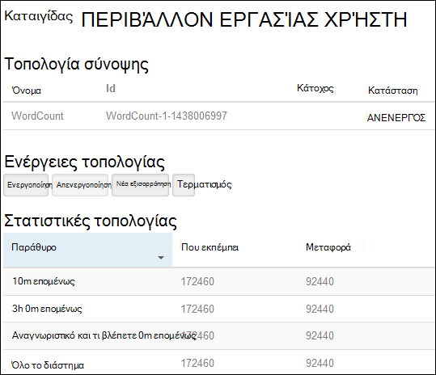
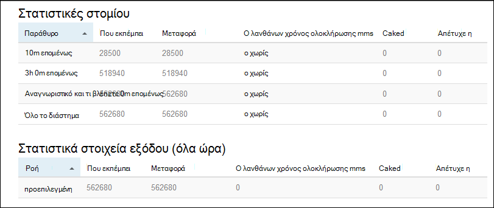

<properties
    pageTitle="Πρόγραμμα εκμάθησης καταιγίδας Apache: γρήγορα αποτελέσματα με το Linux βάσει καταιγίδας στην HDInsight | Microsoft Azure"
    description="Γρήγορα αποτελέσματα με την ανάλυση δεδομένων μεγάλο με καταιγίδας Apache και τα δείγματα καταιγίδας Starter στην βάσει Linux HDInsight. Μάθετε πώς μπορείτε να χρησιμοποιήσετε καταιγίδας την επεξεργασία δεδομένων σε πραγματικό χρόνο."
    keywords="καταιγίδας Apache, πρόγραμμα εκμάθησης καταιγίδας apache, ανάλυση δεδομένων μεγάλο, καταιγίδας starter"
    services="hdinsight"
    documentationCenter=""
    authors="Blackmist"
    manager="jhubbard"
    editor="cgronlun"/>

<tags
   ms.service="hdinsight"
   ms.devlang="java"
   ms.topic="get-started-article"
   ms.tgt_pltfrm="na"
   ms.workload="big-data"
   ms.date="10/12/2016"
   ms.author="larryfr"/>

# Πρόγραμμα εκμάθησης καταιγίδας Apache: γρήγορα αποτελέσματα με τα δείγματα Starter καταιγίδας για ανάλυση δεδομένων μεγάλο σε HDInsight

Καταιγίδας Apache είναι ένα σύστημα μεταβλητού μεγέθους, ανοχή, κατανέμεται, σε πραγματικό χρόνο κατά τον υπολογισμό για την επεξεργασία ροών δεδομένων. Με καταιγίδας στην Azure HDInsight, μπορείτε να δημιουργήσετε ένα σύμπλεγμα καταιγίδας βασίζεται στο cloud που πραγματοποιεί ανάλυση μεγάλο δεδομένα σε πραγματικό χρόνο.

> [AZURE.NOTE] Τα βήματα σε αυτό το άρθρο δημιουργία ένα σύμπλεγμα βάσει Linux HDInsight. Για τα βήματα για τη δημιουργία μιας καταιγίδας βασίζεται σε Windows σε σύμπλεγμα HDInsight, ανατρέξτε στο θέμα [καταιγίδας Apache πρόγραμμα εκμάθησης: γρήγορα αποτελέσματα με το δείγμα Starter καταιγίδας χρησιμοποιώντας την ανάλυση δεδομένων σε HDInsight](hdinsight-apache-storm-tutorial-get-started.md)

## Προαπαιτούμενα στοιχεία

[AZURE.INCLUDE [delete-cluster-warning](../../includes/hdinsight-delete-cluster-warning.md)]

Πρέπει να έχετε τα ακόλουθα για να ολοκληρωθεί με επιτυχία αυτό το πρόγραμμα εκμάθησης καταιγίδας Apache:

- **Azure μια συνδρομή**. Ανατρέξτε στο θέμα [λήψη Azure δωρεάν δοκιμαστικής έκδοσης](https://azure.microsoft.com/documentation/videos/get-azure-free-trial-for-testing-hadoop-in-hdinsight/).

- **Εξοικείωση με SSH και SCP**. Για περισσότερες πληροφορίες σχετικά με τη χρήση SSH και SCP με το HDInsight, ανατρέξτε στα παρακάτω:

    - **Προγράμματα-πελάτες του Linux, Unix ή OS X**: ανατρέξτε στο θέμα [Χρήση SSH με βάσει Linux Hadoop σε HDInsight από Linux, OS X ή Unix](hdinsight-hadoop-linux-use-ssh-unix.md)

    - **Προγράμματα-πελάτες των Windows**: ανατρέξτε στο θέμα [Χρήση SSH με βάσει Linux Hadoop σε HDInsight από το Windows](hdinsight-hadoop-linux-use-ssh-windows.md)

### Απαιτήσεις για στοιχείο ελέγχου πρόσβασης

[AZURE.INCLUDE [access-control](../../includes/hdinsight-access-control-requirements.md)]

## Δημιουργήστε ένα σύμπλεγμα καταιγίδας

Σε αυτήν την ενότητα, μπορείτε να δημιουργήσετε ένα σύμπλεγμα έκδοση 3.2 HDInsight (καταιγίδας έκδοση 0.9.3) χρησιμοποιώντας ένα πρότυπο από διαχειριστή πόρων Azure. Για πληροφορίες σχετικά με τις εκδόσεις HDInsight και τους SLA, ανατρέξτε στο θέμα [Διαχείριση εκδόσεων στοιχείου HDInsight](hdinsight-component-versioning.md). Για άλλες μεθόδους δημιουργίας σύμπλεγμα, ανατρέξτε στο θέμα [Δημιουργία HDInsight συμπλεγμάτων](hdinsight-hadoop-provision-linux-clusters.md).

1. Κάντε κλικ στην παρακάτω εικόνα για να ανοίξετε το πρότυπο στην πύλη του Azure.         

    
    
    Το πρότυπο βρίσκεται σε δημόσια blob κοντέινερ, *https://hditutorialdata.blob.core.windows.net/armtemplates/create-linux-based-storm-cluster-in-hdinsight.json*. 
   
2. Από το blade παραμέτρους, εισαγάγετε τα εξής:

    - **ClusterName**: Πληκτρολογήστε ένα όνομα για το σύμπλεγμα Hadoop που θα δημιουργήσετε.
    - **Σύμπλεγμα όνομα σύνδεσης και τον κωδικό πρόσβασης**: το προεπιλεγμένο όνομα σύνδεσης είναι διαχειριστής.
    - **SSH όνομα χρήστη και τον κωδικό πρόσβασης**.
    
    Γράψτε αυτές τις τιμές.  Θα χρειαστείτε τα αργότερα στην εκμάθηση.

    > [AZURE.NOTE] SSH χρησιμοποιείται για απομακρυσμένη πρόσβαση στο σύμπλεγμα HDInsight χρησιμοποιώντας μια γραμμή εντολών. Το όνομα χρήστη και κωδικό πρόσβασης που χρησιμοποιείτε εδώ χρησιμοποιείται κατά τη σύνδεση στο σύμπλεγμα μέσω SSH. Επίσης, το όνομα χρήστη SSH πρέπει να είναι μοναδικό, όπως δημιουργεί ένα λογαριασμό χρήστη σε όλους τους κόμβους συμπλέγματος HDInsight. Τα παρακάτω είναι ορισμένες από τα ονόματα των λογαριασμών δεσμευμένο για χρήση από τις υπηρεσίες στο σύμπλεγμα και δεν μπορεί να χρησιμοποιηθεί ως το όνομα χρήστη SSH:
    >
    > ριζικό κατάλογο, hdiuser, καταιγίδας, hbase, ubuntu, zookeeper, hdfs, νήματα, mapred, hbase, hive, oozie, falcon, sqoop, διαχείρισης, tez, hcat, hdinsight zookeeper.

    > Για περισσότερες πληροφορίες σχετικά με τη χρήση SSH με το HDInsight, ανατρέξτε σε ένα από τα ακόλουθα άρθρα:

    > * [Χρήση SSH με βάσει Linux Hadoop σε HDInsight από Linux, Unix ή λειτουργικό σύστημα OS X](hdinsight-hadoop-linux-use-ssh-unix.md)
    > * [Χρήση SSH με βάσει Linux Hadoop σε HDInsight από το Windows](hdinsight-hadoop-linux-use-ssh-windows.md)

    
3, κάντε κλικ στο κουμπί **OK** για να αποθηκεύσετε τις παραμέτρους.

4 από την **Ανάπτυξη προσαρμοσμένης** blade, κάντε κλικ στο πλαίσιο αναπτυσσόμενης λίστας **ομάδα πόρων** και, στη συνέχεια, κάντε κλικ στην επιλογή **Δημιουργία** για να δημιουργήσετε μια νέα ομάδα πόρων. Η ομάδα πόρων είναι ένα κοντέινερ που ομαδοποιεί το σύμπλεγμα, ο λογαριασμός εξαρτώμενα χώρου αποθήκευσης και άλλων πόρων συνδεδεμένων.

Διαχειριστής, κάντε κλικ στην επιλογή **νομική τους όρους**και, στη συνέχεια, κάντε κλικ στην επιλογή **Δημιουργία**.

6 κάντε κλικ στην επιλογή **Δημιουργία**. Θα δείτε ένα νέο πλακίδιο με τίτλο Submitting ανάπτυξης για ανάπτυξη προτύπου. Διαρκεί περίπου περίπου 20 λεπτά για να δημιουργήσετε το σύμπλεγμα και βάση δεδομένων SQL.

##Εκτέλεση ενός δείγματος καταιγίδας Starter στην HDInsight

Τα παραδείγματα [καταιγίδας starter](https://github.com/apache/storm/tree/master/examples/storm-starter) περιλαμβάνονται στο σύμπλεγμα HDInsight. Στα παρακάτω βήματα, θα μπορείτε να εκτελέσετε το παράδειγμα WordCount.

1. Συνδεθείτε με το σύμπλεγμα HDInsight χρησιμοποιώντας SSH:

        ssh USERNAME@CLUSTERNAME-ssh.azurehdinsight.net
        
    Εάν χρησιμοποιούσατε έναν κωδικό πρόσβασης για την ασφάλιση λογαριασμού χρήστη SSH, θα σας ζητηθεί για να το εισαγάγετε. Εάν χρησιμοποιείτε ένα δημόσιο κλειδί, ίσως χρειαστεί να χρησιμοποιήσετε το `-i` παραμέτρου για να καθορίσετε το αντίστοιχο ιδιωτικό κλειδί. Για παράδειγμα, `ssh -i ~/.ssh/id_rsa USERNAME@CLUSTERNAME-ssh.azurehdinsight.net`.
        
    Για περισσότερες πληροφορίες σχετικά με τη χρήση SSH με βάσει Linux HDInsight, ανατρέξτε στα ακόλουθα άρθρα:
    
    * [Χρήση SSH με βάσει Linux Hadoop σε HDInsight από Linux, Unix ή λειτουργικό σύστημα OS X](hdinsight-hadoop-linux-use-ssh-unix.md)

    * [Χρήση SSH με βάσει Linux Hadoop σε HDInsight από το Windows](hdinsight-hadoop-linux-use-ssh-windows)

2. Χρησιμοποιήστε την ακόλουθη εντολή για να ξεκινήσετε μια τοπολογία παράδειγμα:

        storm jar /usr/hdp/current/storm-client/contrib/storm-starter/storm-starter-topologies-*.jar storm.starter.WordCountTopology wordcount
        
    > [AZURE.NOTE] Το `*` τμήμα του ονόματος αρχείου χρησιμοποιείται ώστε να συμφωνεί με τον αριθμό έκδοσης, το οποίο αλλάζει καθώς ενημερώνεται HDInsight.

    Αυτό θα ξεκινήσει η τοπολογία WordCount παράδειγμα στο σύμπλεγμα, με το φιλικό όνομα 'wordcount'. Το τυχαία θα δημιουργήσει προτάσεων και να μετρήσετε την εμφάνιση κάθε λέξης σε τις προτάσεις.

    > [AZURE.NOTE] Κατά την υποβολή τοπολογία στο σύμπλεγμα, πρέπει πρώτα να αντιγράψετε το αρχείο βάζο που περιέχει το σύμπλεγμα πριν από τη χρήση του `storm` εντολή. Αυτό μπορεί να πραγματοποιηθεί χρησιμοποιώντας το `scp` εντολής από το πρόγραμμα-πελάτη όπου βρίσκεται το αρχείο. Για παράδειγμα,`scp FILENAME.jar USERNAME@CLUSTERNAME-ssh.azurehdinsight.net:FILENAME.jar`
    >
    > Το παράδειγμα WordCount και άλλα παραδείγματα starter καταιγίδας, περιλαμβάνονται ήδη στη το σύμπλεγμά σας στο `/usr/hdp/current/storm-client/contrib/storm-starter/`.

##Παρακολούθηση της τοπολογίας

Περιβάλλον εργασίας Χρήστη του καταιγίδας παρέχει μια διασύνδεση web για την εργασία με εκτελούνται τοπολογίες και περιλαμβάνεται στην το σύμπλεγμά σας HDInsight.

Χρησιμοποιήστε τα ακόλουθα βήματα για την παρακολούθηση της τοπολογίας χρησιμοποιώντας το περιβάλλον εργασίας Χρήστη καταιγίδας:

1. Ανοίξτε ένα πρόγραμμα περιήγησης web για να https://CLUSTERNAME.azurehdinsight.net/stormui, όπου __CLUSTERNAME__ είναι το όνομα του συμπλέγματος. Αυτό θα ανοίξει το περιβάλλον εργασίας Χρήστη καταιγίδας.

    > [AZURE.NOTE] Εάν σας ζητηθεί να δώσετε ένα όνομα χρήστη και τον κωδικό πρόσβασης, πληκτρολογήστε τη Διαχείριση συμπλέγματος (διαχειριστές) και τον κωδικό πρόσβασης που χρησιμοποιήσατε κατά τη δημιουργία του συμπλέγματος.

2. Στην περιοχή **τοπολογία σύνοψης**, επιλέξτε την καταχώρηση **wordcount** στη στήλη **όνομα** . Αυτό θα εμφανίσει περισσότερες πληροφορίες σχετικά με την τοπολογία.

    

    Αυτή η σελίδα παρέχει τις ακόλουθες πληροφορίες:

    * **Στατιστικές τοπολογία** - βασικές πληροφορίες σχετικά με τις επιδόσεις τοπολογία, οργανωμένες σε των windows.

        > [AZURE.NOTE] Επιλέγοντας ένα συγκεκριμένο χρόνο παράθυρο αλλάζει το χρονικό διάστημα για πληροφορίες που εμφανίζονται σε άλλες ενότητες της σελίδας.

    * **Spouts** - βασικές πληροφορίες σχετικά με την spouts, όπως το τελευταίο σφάλμα που επιστρέφονται από κάθε στομίου.

    * **Μπουλονιών** - βασικές πληροφορίες σχετικά με τα στοιχεία.

    * **Ρύθμιση παραμέτρων τοπολογίας** - λεπτομερείς πληροφορίες σχετικά με τη ρύθμιση παραμέτρων της τοπολογίας.

    Αυτή η σελίδα παρέχει επίσης ενέργειες που μπορούν να ληφθούν την τοπολογία:

    * **Ενεργοποίηση** - επεξεργασία βιογραφικά σημειώματα μια τοπολογία απενεργοποιημένη.

    * **Απενεργοποίηση** - διακόπτει προσωρινά μια τοπολογία εκτελείται.

    * **Νέα εξισορρόπηση** - προσαρμόζει τον παραλληλισμό των της τοπολογίας. Θα πρέπει να νέα εξισορρόπηση εκτελείται τοπολογίες, αφού έχετε αλλάξει τον αριθμό των κόμβους του συμπλέγματος. Αυτό σας επιτρέπει την τοπολογία για να προσαρμόσετε παραλληλισμό για την αποζημίωση για τον αριθμό αυξημένη/μειώθηκε κόμβους του συμπλέγματος. Για περισσότερες πληροφορίες, ανατρέξτε στο θέμα [Κατανόηση τον παραλληλισμό των μια τοπολογία καταιγίδας](http://storm.apache.org/documentation/Understanding-the-parallelism-of-a-Storm-topology.html).

    * **Τερματισμός** - τερματίζει μια τοπολογία καταιγίδας μετά το καθορισμένο χρονικό όριο.

3. Από αυτήν τη σελίδα, επιλέξτε μια καταχώρηση από την ενότητα **Spouts** ή **μπουλονιών** . Αυτό θα εμφανίσει πληροφορίες σχετικά με το επιλεγμένο στοιχείο.

    

    Αυτή η σελίδα εμφανίζει τις ακόλουθες πληροφορίες:

    * **Στατιστικές στομίου/κεραυνό** - βασικές πληροφορίες σχετικά με τις επιδόσεις του στοιχείου, οργανωμένες σε των windows.

        > [AZURE.NOTE] Επιλέγοντας ένα συγκεκριμένο χρόνο παράθυρο αλλάζει το χρονικό διάστημα για πληροφορίες που εμφανίζονται σε άλλες ενότητες της σελίδας.

    * **Στατιστικές εισαγωγής** (μόνο βίδας) - πληροφορίες σχετικά με τα στοιχεία που αγροτικά προϊόντα που καταναλώνεται από η ράβδος δεδομένων.

    * **Στατιστικές εξόδου** - πληροφορίες σχετικά με δεδομένα που εκπέμπει αυτό κεραυνό.

    * **Executors** - πληροφορίες σχετικά με τις εμφανίσεις αυτού του στοιχείου.

    * **Σφάλματα** - σφάλματα που δημιουργήθηκαν με αυτό το στοιχείο.

4. Όταν προβάλετε τις λεπτομέρειες ενός στομίου ή κεραυνό, επιλέξτε μια καταχώρηση από τη στήλη **θύρας** στην ενότητα **Executors** για να δείτε λεπτομέρειες για μια συγκεκριμένη παρουσία του στοιχείου.

        2015-01-27 14:18:02 b.s.d.task [INFO] Emitting: split default ["with"]
        2015-01-27 14:18:02 b.s.d.task [INFO] Emitting: split default ["nature"]
        2015-01-27 14:18:02 b.s.d.executor [INFO] Processing received message source: split:21, stream: default, id: {}, [snow]
        2015-01-27 14:18:02 b.s.d.task [INFO] Emitting: count default [snow, 747293]
        2015-01-27 14:18:02 b.s.d.executor [INFO] Processing received message source: split:21, stream: default, id: {}, [white]
        2015-01-27 14:18:02 b.s.d.task [INFO] Emitting: count default [white, 747293]
        2015-01-27 14:18:02 b.s.d.executor [INFO] Processing received message source: split:21, stream: default, id: {}, [seven]
        2015-01-27 14:18:02 b.s.d.task [INFO] Emitting: count default [seven, 1493957]

    Από αυτά τα δεδομένα, μπορείτε να δείτε ότι το word **επτά** Παρουσιάστηκε 1493957 ώρες. Που είναι πόσες φορές έχει αντιμετώπισε αφότου ξεκίνησε αυτή τοπολογίας.

##Διακοπή της τοπολογίας

Επιστρέψτε στη σελίδα **σύνοψης τοπολογίας** για την καταμέτρηση λέξεων τοπολογία και, στη συνέχεια, επιλέξτε το κουμπί **τερματισμού** από την ενότητα **τοπολογία ενέργειες** . Όταν σας ζητηθεί, καταχωρήστε τον αριθμό 10 για το δευτερολέπτων αναμονής πριν από τη διακοπή της τοπολογίας. Μετά το χρονικό όριο, της τοπολογίας δεν θα εμφανίζεται πλέον όταν επισκέπτεστε την ενότητα **Καταιγίδας περιβάλλοντος εργασίας Χρήστη** του πίνακα εργαλείων.

##Διαγραφή του συμπλέγματος

[AZURE.INCLUDE [delete-cluster-warning](../../includes/hdinsight-delete-cluster-warning.md)]

##Επόμενα βήματα

Σε αυτό το πρόγραμμα εκμάθησης καταιγίδας Apache χρησιμοποιούσατε το Starter καταιγίδας για να μάθετε τον τρόπο δημιουργίας μιας καταιγίδας σε σύμπλεγμα HDInsight και χρησιμοποιήστε τον πίνακα εργαλείων καταιγίδας για να αναπτύξετε, παρακολούθηση και διαχείριση τοπολογίες καταιγίδας. Στη συνέχεια, μάθετε πώς μπορείτε να [βασίζεται σε ανάπτυξη Java τοπολογίες χρησιμοποιώντας Maven](hdinsight-storm-develop-java-topology.md).

Εάν είστε ήδη εξοικειωμένοι με ανάπτυξη τοπολογίες βάσει Java και θέλετε να αναπτύξετε μια υπάρχουσα τοπολογία με το HDInsight, ανατρέξτε στο θέμα [ανάπτυξη και διαχείριση τοπολογίες καταιγίδας Apache στην HDInsight](hdinsight-storm-deploy-monitor-topology-linux.md).

Εάν είστε προγραμματιστής .NET, μπορείτε να δημιουργήσετε C# ή υβριδικό C# / τοπολογίες Java με χρήση του Visual Studio. Για περισσότερες πληροφορίες, ανατρέξτε στο θέμα [Ανάπτυξη C# τοπολογίες για Apache καταιγίδας στην HDInsight χρησιμοποιώντας τα εργαλεία Hadoop για το Visual Studio](hdinsight-storm-develop-csharp-visual-studio-topology.md).

Για παράδειγμα τοπολογίες που μπορούν να χρησιμοποιηθούν με καταιγίδας στην HDInsight, ανατρέξτε στα παρακάτω παραδείγματα:

    * [Παράδειγμα τοπολογίες για καταιγίδας στην HDInsight](hdinsight-storm-example-topology.md)

[apachestorm]: https://storm.incubator.apache.org
[stormdocs]: http://storm.incubator.apache.org/documentation/Documentation.html
[stormstarter]: https://github.com/apache/storm/tree/master/examples/storm-starter
[stormjavadocs]: https://storm.incubator.apache.org/apidocs/
[azureportal]: https://manage.windowsazure.com/
[hdinsight-provision]: hdinsight-provision-clusters.md
[preview-portal]: https://portal.azure.com/
