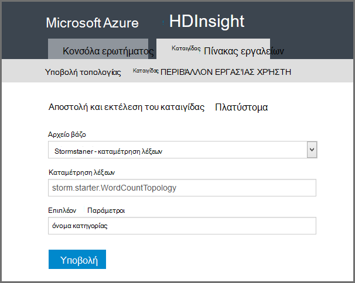

<properties
    pageTitle="Πρόγραμμα εκμάθησης καταιγίδας Apache: γρήγορα αποτελέσματα με το καταιγίδας | Microsoft Azure"
    description="Γρήγορα αποτελέσματα με την ανάλυση δεδομένων μεγάλο με καταιγίδας Apache και τα δείγματα καταιγίδας Starter στην HDInsight. Μάθετε πώς μπορείτε να χρησιμοποιήσετε καταιγίδας την επεξεργασία δεδομένων σε πραγματικό χρόνο."
    keywords="καταιγίδας Apache, πρόγραμμα εκμάθησης καταιγίδας apache, ανάλυση δεδομένων μεγάλο, καταιγίδας starter"
    services="hdinsight"
    documentationCenter=""
    authors="Blackmist"
    manager="jhubbard"
    editor="cgronlun"
    tags="azure-portal"/>

<tags
   ms.service="hdinsight"
   ms.devlang="java"
   ms.topic="article"
   ms.tgt_pltfrm="na"
   ms.workload="big-data"
   ms.date="09/07/2016"
   ms.author="larryfr"/>

# Πρόγραμμα εκμάθησης καταιγίδας Apache: γρήγορα αποτελέσματα με τα δείγματα Starter καταιγίδας για ανάλυση δεδομένων μεγάλο σε HDInsight

Καταιγίδας Apache είναι ένα σύστημα μεταβλητού μεγέθους, ανοχή, κατανεμημένες, σε πραγματικό χρόνο κατά τον υπολογισμό για την επεξεργασία ροών δεδομένων. Με καταιγίδας στο Microsoft Azure HDInsight, μπορείτε να δημιουργήσετε ένα σύμπλεγμα καταιγίδας βασίζεται στο cloud που πραγματοποιεί ανάλυση μεγάλο δεδομένα σε πραγματικό χρόνο. 

> [AZURE.NOTE] Τα βήματα σε αυτό το άρθρο δημιουργία ένα σύμπλεγμα HDInsight που βασίζεται στα Windows. Για τα βήματα για τη δημιουργία μιας καταιγίδας Linux βασίζεται σε σύμπλεγμα HDInsight, ανατρέξτε στο θέμα [καταιγίδας Apache πρόγραμμα εκμάθησης: γρήγορα αποτελέσματα με το δείγμα Starter καταιγίδας χρησιμοποιώντας την ανάλυση δεδομένων σε HDInsight](hdinsight-apache-storm-tutorial-get-started-linux.md)

## Προαπαιτούμενα στοιχεία

[AZURE.INCLUDE [delete-cluster-warning](../../includes/hdinsight-delete-cluster-warning.md)]

Πρέπει να έχετε τα ακόλουθα για να ολοκληρωθεί με επιτυχία αυτό το πρόγραμμα εκμάθησης καταιγίδας Apache:

- **Azure μια συνδρομή**. Ανατρέξτε στο θέμα [λήψη Azure δωρεάν δοκιμαστικής έκδοσης](https://azure.microsoft.com/documentation/videos/get-azure-free-trial-for-testing-hadoop-in-hdinsight/).

### Απαιτήσεις για στοιχείο ελέγχου πρόσβασης

[AZURE.INCLUDE [access-control](../../includes/hdinsight-access-control-requirements.md)]

## Δημιουργήστε ένα σύμπλεγμα καταιγίδας

Καταιγίδας στην HDInsight χρησιμοποιεί χώρο αποθήκευσης αντικειμένων Blob του Azure για την αποθήκευση αρχείων καταγραφής και τοπολογίες υποβληθεί στο σύμπλεγμα. Χρησιμοποιήστε τα ακόλουθα βήματα για να δημιουργήσετε ένα λογαριασμό Azure χώρου αποθήκευσης για χρήση με το σύμπλεγμά σας:

1. Είσοδος στην [πύλη του Azure][preview-portal].

2. Επιλέξτε **ΔΗΜΙΟΥΡΓΊΑ**, επιλέξτε __Ανάλυση δεδομένων__και, στη συνέχεια, επιλέξτε __HDInsight__.

    

3. Πληκτρολογήστε ένα __όνομα συμπλέγματος__. Εάν είναι διαθέσιμη, εμφανίζεται ένα πράσινο σημάδι ελέγχου δίπλα στο __Όνομα του συμπλέγματος__ .

4. Εάν έχετε περισσότερες από μία συνδρομές, επιλέξτε την καταχώρηση __συνδρομή__ για να επιλέξετε τη συνδρομή Azure που θα χρησιμοποιηθεί για το σύμπλεγμα.

5.  Χρησιμοποιήστε την __Επιλογή τύπου για το σύμπλεγμα__ για να επιλέξετε ένα σύμπλεγμα __καταιγίδας__ . Για το __λειτουργικό σύστημα__, επιλέξτε Windows. Για __Σύμπλεγμα επίπεδο__, επιλέξτε ΤΥΠΙΚΉ. Τέλος, χρησιμοποιήστε το κουμπί επιλογής για να αποθηκεύσετε αυτές τις ρυθμίσεις.

    

5. Για την __Ομάδα πόρων__, μπορείτε να μας την αναπτυσσόμενη λίστα για να δείτε μια λίστα με τις υπάρχουσες ομάδες του πόρου και, στη συνέχεια, επιλέξτε μία για να δημιουργήσετε το σύμπλεγμα στο. Ή μπορείτε να επιλέξετε την εντολή __Δημιουργία__ και, στη συνέχεια, πληκτρολογήστε το όνομα της νέας ομάδας πόρων. Εμφανίζεται ένα πράσινο σημάδι ελέγχου για να υποδείξετε εάν είναι διαθέσιμο το νέο όνομα της ομάδας.

6. Επιλέξτε __τα διαπιστευτήρια__και, στη συνέχεια, πληκτρολογήστε ένα __Όνομα χρήστη σύνδεσης σύμπλεγμα__ και __Κωδικό πρόσβασης στο σύμπλεγμα__. Τέλος, χρησιμοποιήστε την __επιλογή__ για να ορίσει τα διαπιστευτήρια. Σύνδεση απομακρυσμένης επιφάνειας εργασίας δεν θα χρησιμοποιηθεί σε αυτό το έγγραφο, ώστε να μπορείτε να αφήσετε απενεργοποιημένο.

    

6. Για το __Αρχείο προέλευσης δεδομένων__, μπορείτε να επιλέξετε την καταχώρηση για να επιλέξετε μια υπάρχουσα προέλευση δεδομένων, ή δημιουργήστε ένα νέο.

    

    Προς το παρόν, μπορείτε να επιλέξετε ένα λογαριασμό Azure χώρου αποθήκευσης ως προέλευση δεδομένων για ένα σύμπλεγμα HDInsight. Χρησιμοποιήστε τα ακόλουθα για να κατανοήσετε τις καταχωρήσεις σε blade την __Προέλευση δεδομένων__ .

    - __Επιλογή μεθόδου__: ορίσετε την επιλογή __από όλες τις συνδρομές__ για να ενεργοποιήσετε την περιήγηση σε λογαριασμούς χώρου αποθήκευσης σε όλες τις συνδρομές σας. Ρύθμιση __Πλήκτρο πρόσβασης__ εάν θέλετε να εισαγάγετε το __Όνομα χώρου αποθήκευσης__ και το __Πλήκτρο πρόσβασης__ από έναν υπάρχοντα λογαριασμό του χώρου αποθήκευσης.

    - __Δημιουργία νέου__: Χρησιμοποιήστε αυτήν την επιλογή για να δημιουργήσετε ένα νέο λογαριασμό του χώρου αποθήκευσης. Χρησιμοποιήστε το πεδίο που εμφανίζεται για να εισαγάγετε το όνομα του λογαριασμού χώρου αποθήκευσης. Ένα πράσινο σημάδι ελέγχου εμφανίζεται εάν το όνομα είναι διαθέσιμη.

    - __Επιλέξτε προεπιλεγμένο κοντέινερ__: Χρησιμοποιήστε αυτήν την επιλογή για να εισαγάγετε το όνομα του προεπιλεγμένου κοντέινερ για να χρησιμοποιήσετε για το σύμπλεγμα. Μπορείτε να πληκτρολογήσετε οποιοδήποτε όνομα εδώ, συνιστάται να χρησιμοποιείτε το ίδιο όνομα ως το σύμπλεγμα, ώστε να μπορείτε εύκολα να αναγνωρίσετε ότι το κοντέινερ χρησιμοποιείται για αυτό το συγκεκριμένο σύμπλεγμα.

    - __Θέση__: τη γεωγραφική περιοχή που θα είναι το λογαριασμό χώρου αποθήκευσης είναι στο ή θα δημιουργηθεί στο.

        > [AZURE.IMPORTANT] Επιλογή της θέση για την προέλευση δεδομένων προεπιλογή ρυθμίζει επίσης στη θέση του συμπλέγματος HDInsight. Το σύμπλεγμα και προεπιλεγμένο αρχείο προέλευσης δεδομένων πρέπει να βρίσκεται στην ίδια περιοχή.

    - __Επιλέξτε__: Χρησιμοποιήστε αυτήν την επιλογή για να αποθηκεύσετε τη ρύθμιση παραμέτρων της προέλευσης δεδομένων.

7. Επιλέξτε __Βαθμίδες τιμολόγησης κόμβο__ για να εμφανίσετε πληροφορίες σχετικά με τους κόμβους που θα δημιουργηθεί για αυτό το σύμπλεγμα. Από προεπιλογή, τον αριθμό των κόμβους εργασίας έχει οριστεί σε __4__. Ρύθμιση σε __1__, καθώς αυτό είναι αρκετά μεγάλο για αυτό το πρόγραμμα εκμάθησης και μειώνει το κόστος του συμπλέγματος. Το εκτιμώμενο κόστος του συμπλέγματος εμφανίζεται στο κάτω μέρος αυτό blade.

    

    Χρησιμοποιήστε την __επιλογή__ για να αποθηκεύσετε τις πληροφορίες __Βαθμίδες τιμολόγησης κόμβο__ .

8. Επιλέξτε __προαιρετική ρύθμιση παραμέτρων__. Αυτό blade σάς επιτρέπει να επιλέξτε την έκδοση σύμπλεγμα, καθώς και άλλες προαιρετικές ρυθμίσεις όπως η συμμετοχή σε __Εικονικού δικτύου__.

    

9. Βεβαιωθείτε ότι είναι επιλεγμένο __Καρφίτσωμα στην Startboard__ και, στη συνέχεια, επιλέξτε __Δημιουργία__. Αυτό δημιουργεί το σύμπλεγμα και προσθέτει ένα πλακίδιο για αυτήν την Startboard της πύλης Azure. Το εικονίδιο δηλώνει ότι προμήθεια το σύμπλεγμα και αλλαγές για να εμφανιστεί το εικονίδιο HDInsight μία φορά προμήθεια έχει ολοκληρωθεί.

  	| Κατά την προμήθεια του | Προμήθεια ολοκλήρωσης |
  	| ------------------ | --------------------- |
  	|  |  |

    > [AZURE.NOTE] Θα χρειαστεί κάποιος χρόνος για το σύμπλεγμα να δημιουργηθεί, συνήθως είναι περίπου 15 λεπτά. Χρησιμοποιήστε το πλακίδιο στην το Startboard ή την καταχώρηση __ειδοποιήσεις__ στην αριστερή πλευρά της σελίδας, για να ελέγξετε τη διαδικασία προετοιμασίας.

## Εκτέλεση ενός δείγματος καταιγίδας Starter στην HDInsight

Αυτό το πρόγραμμα εκμάθησης καταιγίδας Apache παρουσιάζει ανάλυση μεγάλο δεδομένα με τα δείγματα καταιγίδας Starter στην GitHub.

Κάθε καταιγίδας σε σύμπλεγμα HDInsight συνοδεύεται από τον πίνακα εργαλείων καταιγίδας, το οποίο μπορούν να χρησιμοποιηθούν για την αποστολή και να εκτελέσετε τοπολογίες καταιγίδας σε σύμπλεγμα. Κάθε σύμπλεγμα περιλαμβάνει επίσης τοπολογίες δείγμα που μπορούν να εκτελεστούν απευθείας από τον πίνακα εργαλείων καταιγίδας.

### Σύνδεση με τον πίνακα εργαλείων

Πίνακας εργαλείων βρίσκεται στην **https://&lt;clustername >.azurehdinsight.net//**, όπου **clustername** είναι το όνομα του συμπλέγματος. Μπορείτε επίσης να βρείτε μια σύνδεση για τον πίνακα εργαλείων, επιλέγοντας το σύμπλεγμα από το Startboard και επιλέγοντας τη σύνδεση __πίνακα εργαλείων__ στο επάνω μέρος του blade.

> [AZURE.NOTE] Κατά τη σύνδεση με τον πίνακα εργαλείων, θα σας ζητηθεί να εισαγάγετε ένα όνομα χρήστη και τον κωδικό πρόσβασης. Αυτό είναι το όνομα του διαχειριστή (**Διαχείριση**) και τον κωδικό πρόσβασης που χρησιμοποιείται κατά τη δημιουργία του συμπλέγματος.

Όταν ο πίνακας εργαλείων καταιγίδας έχει φορτώσει, θα δείτε τη φόρμα **Υποβολής τοπολογίας** .

Στη φόρμα **Υποβολή τοπολογία** μπορεί να χρησιμοποιηθεί για την αποστολή και εκτελέστε .jar αρχεία τα οποία περιέχουν τοπολογίες καταιγίδας. Περιλαμβάνει επίσης αρκετές βασικές δείγματα που παρέχονται με το σύμπλεγμα.

### Εκτελέστε το δείγμα καταμέτρηση λέξεων από το έργο Starter καταιγίδας στο GitHub

Τα δείγματα που παρέχονται με το σύμπλεγμα περιλαμβάνουν πολλές παραλλαγές μια τοπολογία μετρώντας από το word. Αυτά τα δείγματα περιλαμβάνουν μια **spout** που εκπέμπει τυχαία προτάσεων και **μπουλονιών** που αλλαγής κάθε πρότασης σε μεμονωμένες λέξεις και, στη συνέχεια, μετρήσετε πόσες φορές Παρουσιάστηκε κάθε λέξη. Αυτά τα δείγματα προέρχονται από τα [δείγματα καταιγίδας Starter](https://github.com/apache/storm/tree/master/examples/storm-starter), που είναι μέρος του Apache καταιγίδας.

Ακολουθήστε τα παρακάτω βήματα για να εκτελέσετε ένα δείγμα Starter καταιγίδας:

1. Επιλέξτε **StormStarter - WordCount** από την αναπτυσσόμενη λίστα **Βάζων αρχείου** . Αυτό συμπληρώνει τα πεδία **Όνομα κλάσης** και **Πρόσθετες παραμέτρους** με τις παραμέτρους για αυτό το δείγμα.

    

    * **Όνομα κλάσης** - την κλάση στο αρχείο .jar που υποβάλλει της τοπολογίας.
    * **Πρόσθετες παράμετροι** - οποιεσδήποτε παραμέτρους απαιτούνται από της τοπολογίας. Σε αυτό το παράδειγμα, το πεδίο χρησιμοποιείται για την παροχή ένα φιλικό όνομα για την τοπολογία που έχει υποβληθεί.

2. Κάντε κλικ στην επιλογή **Υποβολή**. Μετά από ένα λεπτό, το πεδίο **αποτέλεσμα** εμφανίζει την εντολή που χρησιμοποιείται για την υποβολή της εργασίας, καθώς και τα αποτελέσματα της εντολής. Το πεδίο **σφάλματος** εμφανίζει τυχόν σφάλματα που προκύπτουν σε την υποβολή της τοπολογίας.

    

    > [AZURE.NOTE] Τα αποτελέσματα δεν υποδεικνύουν ότι η τοπολογία έχει ολοκληρωθεί - **μια καταιγίδας τοπολογία, όταν ξεκινήσει, εκτελείται μέχρι να διακόψετε αυτήν.** Η τοπολογία καταμέτρηση λέξεων δημιουργεί τυχαία προτάσεων και διατηρεί μια καταμέτρηση του πόσες φορές συναντά κάθε λέξη, μέχρι να διακόψετε την.

### Παρακολούθηση της τοπολογίας

Περιβάλλον εργασίας Χρήστη του καταιγίδας μπορεί να χρησιμοποιηθεί για την παρακολούθηση της τοπολογίας.

1. Επιλέξτε **Καταιγίδας περιβάλλοντος εργασίας Χρήστη** από το επάνω μέρος του πίνακα εργαλείων καταιγίδας. Αυτό εμφανίζει συνοπτικές πληροφορίες για το σύμπλεγμα και όλες τοπολογίες εκτελείται.

    

    Από τη σελίδα παραπάνω, μπορείτε να δείτε την ώρα της τοπολογίας έχει ενεργό, καθώς και τον αριθμό των εργαζομένων, executors και οι εργασίες που χρησιμοποιείται.

    > [AZURE.NOTE] Στήλη " **όνομα** " περιέχει το φιλικό όνομα που δόθηκε νωρίτερα μέσω του πεδίου **Πρόσθετες παραμέτρους** .

4. Στην περιοχή **τοπολογία σύνοψης**, επιλέξτε την καταχώρηση **wordcount** στη στήλη **όνομα** . Αυτό εμφανίζει περισσότερες πληροφορίες σχετικά με την τοπολογία.

    

    Αυτή η σελίδα παρέχει τις ακόλουθες πληροφορίες:

    * **Στατιστικές τοπολογία** - βασικές πληροφορίες σχετικά με τις επιδόσεις τοπολογία, οργανωμένες σε των windows.

        > [AZURE.NOTE] Επιλέγοντας ένα συγκεκριμένο χρόνο παράθυρο αλλάζει το χρονικό διάστημα για πληροφορίες που εμφανίζονται σε άλλες ενότητες της σελίδας.

    * **Spouts** - βασικές πληροφορίες σχετικά με την spouts, όπως το τελευταίο σφάλμα που επιστρέφονται από κάθε στομίου.

    * **Μπουλονιών** - βασικές πληροφορίες σχετικά με τα στοιχεία.

    * **Ρύθμιση παραμέτρων τοπολογίας** - λεπτομερείς πληροφορίες σχετικά με τη ρύθμιση παραμέτρων της τοπολογίας.

    Αυτή η σελίδα παρέχει επίσης ενέργειες που μπορούν να ληφθούν την τοπολογία:

    * **Ενεργοποίηση** - επεξεργασία βιογραφικά σημειώματα μια τοπολογία απενεργοποιημένη.

    * **Απενεργοποίηση** - διακόπτει προσωρινά μια τοπολογία εκτελείται.

    * **Νέα εξισορρόπηση** - προσαρμόζει τον παραλληλισμό των της τοπολογίας. Θα πρέπει να νέα εξισορρόπηση εκτελείται τοπολογίες, αφού έχετε αλλάξει τον αριθμό των κόμβους του συμπλέγματος. Αυτό σας επιτρέπει την τοπολογία για να προσαρμόσετε παραλληλισμό για την αποζημίωση για τον αριθμό αυξημένη/μειώθηκε κόμβους του συμπλέγματος. Για περισσότερες πληροφορίες, ανατρέξτε στο θέμα [Κατανόηση τον παραλληλισμό των μια τοπολογία καταιγίδας](http://storm.apache.org/documentation/Understanding-the-parallelism-of-a-Storm-topology.html).

    * **Τερματισμός** - τερματίζει μια τοπολογία καταιγίδας μετά το καθορισμένο χρονικό όριο.

5. Από αυτήν τη σελίδα, επιλέξτε μια καταχώρηση από την ενότητα **Spouts** ή **μπουλονιών** . Εμφανίζει πληροφορίες σχετικά με το επιλεγμένο στοιχείο.

    

    Αυτή η σελίδα εμφανίζει τις ακόλουθες πληροφορίες:

    * **Στατιστικές στομίου/κεραυνό** - βασικές πληροφορίες σχετικά με τις επιδόσεις του στοιχείου, οργανωμένες σε των windows.

        > [AZURE.NOTE] Επιλέγοντας ένα συγκεκριμένο χρόνο παράθυρο αλλάζει το χρονικό διάστημα για πληροφορίες που εμφανίζονται σε άλλες ενότητες της σελίδας.

    * **Στατιστικές εισαγωγής** (μόνο βίδας) - πληροφορίες σχετικά με τα στοιχεία που αγροτικά προϊόντα που καταναλώνεται από η ράβδος δεδομένων.

    * **Στατιστικές εξόδου** - πληροφορίες σχετικά με δεδομένα που εκπέμπει αυτό κεραυνό.

    * **Executors** - πληροφορίες σχετικά με τις εμφανίσεις αυτού του στοιχείου.

    * **Σφάλματα** - σφάλματα που δημιουργήθηκαν με αυτό το στοιχείο.

5. Όταν προβάλετε τις λεπτομέρειες ενός στομίου ή κεραυνό, επιλέξτε μια καταχώρηση από τη στήλη **θύρας** στην ενότητα **Executors** για να δείτε λεπτομέρειες για μια συγκεκριμένη παρουσία του στοιχείου.

        2015-01-27 14:18:02 b.s.d.task [INFO] Emitting: split default ["with"]
        2015-01-27 14:18:02 b.s.d.task [INFO] Emitting: split default ["nature"]
        2015-01-27 14:18:02 b.s.d.executor [INFO] Processing received message source: split:21, stream: default, id: {}, [snow]
        2015-01-27 14:18:02 b.s.d.task [INFO] Emitting: count default [snow, 747293]
        2015-01-27 14:18:02 b.s.d.executor [INFO] Processing received message source: split:21, stream: default, id: {}, [white]
        2015-01-27 14:18:02 b.s.d.task [INFO] Emitting: count default [white, 747293]
        2015-01-27 14:18:02 b.s.d.executor [INFO] Processing received message source: split:21, stream: default, id: {}, [seven]
        2015-01-27 14:18:02 b.s.d.task [INFO] Emitting: count default [seven, 1493957]

    Από αυτά τα δεδομένα, μπορείτε να δείτε ότι το word **επτά** Παρουσιάστηκε 1,493,957 ώρες. Που είναι πόσες φορές έχει αντιμετώπισε αφότου ξεκίνησε αυτή τοπολογίας.

### Διακοπή της τοπολογίας

Επιστροφή στη σελίδα **σύνοψης τοπολογίας** για την καταμέτρηση λέξεων τοπολογία και, στη συνέχεια, επιλέξτε **τερματισμού** από την ενότητα **τοπολογία ενέργειες** . Όταν σας ζητηθεί, καταχωρήστε τον αριθμό 10 για το δευτερολέπτων αναμονής πριν από τη διακοπή της τοπολογίας. Μετά το χρονικό όριο, της τοπολογίας δεν εμφανίζεται πλέον όταν επισκέπτεστε την ενότητα **Καταιγίδας περιβάλλοντος εργασίας Χρήστη** του πίνακα εργαλείων.

##Διαγραφή του συμπλέγματος

[AZURE.INCLUDE [delete-cluster-warning](../../includes/hdinsight-delete-cluster-warning.md)]

## Σύνοψη

Σε αυτό το πρόγραμμα εκμάθησης καταιγίδας Apache χρησιμοποιούσατε το Starter καταιγίδας για να μάθετε τον τρόπο δημιουργίας μιας καταιγίδας σε σύμπλεγμα HDInsight και χρησιμοποιήστε τον πίνακα εργαλείων καταιγίδας για να αναπτύξετε, παρακολούθηση και διαχείριση τοπολογίες καταιγίδας.

## Επόμενα βήματα

* **Εργαλεία HDInsight για το Visual Studio** - HDInsight εργαλεία σάς επιτρέπει να χρησιμοποιήστε το Visual Studio για να υποβάλετε, παρακολούθηση και διαχείριση καταιγίδας τοπολογίες παρόμοιο με τον πίνακα εργαλείων καταιγίδας που αναφέρονται παραπάνω. Εργαλεία HDInsight επίσης παρέχει τη δυνατότητα να δημιουργήσουν τοπολογίες C# καταιγίδας και περιλαμβάνει τοπολογίες δείγμα που μπορείτε να αναπτύξετε και να εκτελέσετε στο το σύμπλεγμά σας.

    Για περισσότερες πληροφορίες, ανατρέξτε στο θέμα [Γρήγορα αποτελέσματα χρησιμοποιώντας τα εργαλεία HDInsight για το Visual Studio](hdinsight-hadoop-visual-studio-tools-get-started.md).

* **Δείγματα αρχείων** - το HDInsight καταιγίδας συμπλέγματος παρέχει διάφορα παραδείγματα στον κατάλογο **%STORM_HOME%\contrib** . Κάθε παράδειγμα θα πρέπει να περιλαμβάνουν τα εξής:

    * Ο κωδικός προέλευσης - για παράδειγμα, καταιγίδας-starter-0.9.1.2.1.5.0-επιφορτισμένος-sources.jar

    * Τα έγγραφα Java - για παράδειγμα, καταιγίδας-starter-0.9.1.2.1.5.0-επιφορτισμένος-javadoc.jar

    * Παράδειγμα - για παράδειγμα, storm-starter-0.9.1.2.1.5.0-2057-jar-with-dependencies.jar

    Χρησιμοποιήστε την εντολή 'βάζο' για την εξαγωγή του πηγαίου κώδικα ή Java έγγραφα. Για παράδειγμα, ' καταιγίδας - xvf βάζο-starter-0.9.1.2.1.5.0.2057-javadoc.jar'.

    > [AZURE.NOTE] Έγγραφα Java αποτελούνται από ιστοσελίδες. Μόλις που έχουν εξαχθεί, χρησιμοποιήστε ένα πρόγραμμα περιήγησης για να προβάλετε το αρχείο **index.html** .

    Για να αποκτήσετε πρόσβαση σε αυτά τα δείγματα, πρέπει να ενεργοποίηση απομακρυσμένης επιφάνειας εργασίας για το καταιγίδας σε σύμπλεγμα HDInsight και, στη συνέχεια, αντιγράψτε τα αρχεία από **%STORM_HOME%\contrib**.

* Το ακόλουθο έγγραφο περιέχει μια λίστα με άλλα παραδείγματα που μπορούν να χρησιμοποιηθούν με καταιγίδας στην HDInsight:

    * [Παράδειγμα τοπολογίες για καταιγίδας στην HDInsight](hdinsight-storm-example-topology.md)

[apachestorm]: https://storm.incubator.apache.org
[stormdocs]: http://storm.incubator.apache.org/documentation/Documentation.html
[stormstarter]: https://github.com/apache/storm/tree/master/examples/storm-starter
[stormjavadocs]: https://storm.incubator.apache.org/apidocs/
[azureportal]: https://manage.windowsazure.com/
[hdinsight-provision]: hdinsight-provision-clusters.md
[preview-portal]: https://portal.azure.com/
