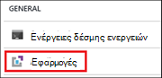
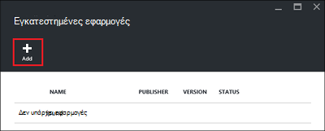
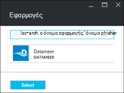
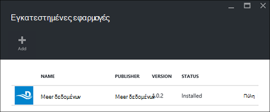

<properties
    pageTitle="Εγκατάσταση των εφαρμογών Hadoop σε HDInsight | Microsoft Azure"
    description="Μάθετε πώς να εγκαταστήσετε τις εφαρμογές HDInsight σε εφαρμογές HDInsight."
    services="hdinsight"
    documentationCenter=""
    authors="mumian"
    manager="jhubbard"
    editor="cgronlun"
    tags="azure-portal"/>

<tags
    ms.service="hdinsight"
    ms.devlang="na"
    ms.topic="hero-article"
    ms.tgt_pltfrm="na"
    ms.workload="big-data"
    ms.date="09/14/2016"
    ms.author="jgao"/>

# Εγκατάσταση των εφαρμογών του HDInsight

Μια εφαρμογή του HDInsight είναι μια εφαρμογή που οι χρήστες μπορούν να εγκαταστήσουν σε ένα σύμπλεγμα βάσει Linux HDInsight. Αυτές οι εφαρμογές μπορούν να αναπτυχθούν από τη Microsoft, ανεξάρτητων προμηθευτών λογισμικού (ISV) ή με τον εαυτό σας. Σε αυτό το άρθρο, θα μάθετε πώς να εγκαταστήσετε μια δημοσιευμένη εφαρμογή. Για την εγκατάσταση του τη δική σας εφαρμογή, ανατρέξτε στο θέμα [εγκατάσταση προσαρμοσμένες εφαρμογές HDInsight](hdinsight-apps-install-custom-applications.md). 

Αυτήν τη στιγμή δεν υπάρχει μία δημοσιευμένη εφαρμογή:

- **Datameer**: [Datameer](http://www.datameer.com/documentation/display/DAS50/Home?ls=Partners&lsd=Microsoft&c=Partners&cd=Microsoft) προσφέρει τους αναλυτές ένα αλληλεπιδραστικό τρόπο για να ανακαλύψετε, να αναλύσετε και να οπτικοποιήσουν τα αποτελέσματα σε μεγάλο δεδομένα. Έλκει πρόσθετων προελεύσεων δεδομένων εύκολα για τον εντοπισμό νέων σχέσεων και να λάβετε τις απαντήσεις που χρειάζεστε γρήγορα.

>[AZURE.NOTE] Datameer είναι αυτήν τη στιγμή υποστηρίζεται μόνο από το Azure HDInsight έκδοση 3.2 συμπλεγμάτων.

Τις οδηγίες που παρέχονται σε αυτό το άρθρο Χρησιμοποιήστε Azure πύλη. Επίσης, μπορείτε να εξαγάγετε το πρότυπο διαχείρισης πόρων Azure από την πύλη ή να αποκτήσετε ένα αντίγραφο του προτύπου για τη διαχείριση πόρων από προμηθευτές και να χρησιμοποιήσετε Azure PowerShell και Azure CLI για να αναπτύξετε το πρότυπο.  Ανατρέξτε στο θέμα [Δημιουργία Linux βάσει Hadoop συμπλεγμάτων στο HDInsight με τη χρήση προτύπων από διαχειριστή πόρων](hdinsight-hadoop-create-linux-clusters-arm-templates.md).

## Προαπαιτούμενα στοιχεία

Εάν θέλετε να εγκαταστήσετε τις εφαρμογές HDInsight σε ένα υπάρχον σύμπλεγμα HDInsight, πρέπει να έχετε ένα σύμπλεγμα HDInsight. Για να δημιουργήσετε μια λίστα, ανατρέξτε στο θέμα [Δημιουργία συμπλεγμάτων](hdinsight-hadoop-linux-tutorial-get-started.md#create-cluster). Μπορείτε επίσης να εγκαταστήσετε τις εφαρμογές HDInsight όταν δημιουργείτε ένα σύμπλεγμα HDInsight.

## Εγκατάσταση των εφαρμογών σε υπάρχουσα συμπλεγμάτων

Η παρακάτω διαδικασία δείχνει πώς μπορείτε να εγκαταστήσετε εφαρμογές HDInsight σε ένα υπάρχον σύμπλεγμα HDInsight.

**Για να εγκαταστήσετε μια εφαρμογή HDInsight**

1. Είσοδος στην [πύλη του Azure](https://portal.azure.com).
2. Κάντε κλικ στην επιλογή **HDInsight συμπλεγμάτων** στο αριστερό μενού.  Εάν δεν το βλέπετε, κάντε κλικ στην επιλογή **Αναζήτηση**και, στη συνέχεια, κάντε κλικ στην επιλογή **Συμπλεγμάτων HDInsight**.
3. Κάντε κλικ σε ένα σύμπλεγμα HDInsight.  Εάν δεν έχετε ένα, πρέπει να δημιουργήσετε ένα πρώτο.  ανατρέξτε στο θέμα [Δημιουργία συμπλεγμάτων](hdinsight-hadoop-linux-tutorial-get-started.md#create-cluster).
4. Από το blade **Ρυθμίσεις** , κάντε κλικ στην επιλογή **εφαρμογές** κάτω από την κατηγορία **Γενικά** . Το blade **Εγκατασταθεί εφαρμογές** παραθέτει όλες τις εγκατεστημένες εφαρμογές. 

    

5. Κάντε κλικ στην επιλογή **Προσθήκη** από το μενού blade. 

    

    Βλέπετε μια λίστα των υπαρχουσών εφαρμογών HDInsight.

    

6. Κάντε κλικ σε μία από τις εφαρμογές, αποδεχτείτε τους όρους της νομικές και, στη συνέχεια, κάντε κλικ στην **επιλογή**.

Μπορείτε να δείτε την κατάσταση εγκατάστασης από τις ειδοποιήσεις της πύλης (κάντε κλικ στο εικονίδιο κουδουνιού στο επάνω μέρος της πύλης). Μετά την εγκατάσταση της εφαρμογής, η εφαρμογή θα εμφανιστεί στην το blade εγκατασταθεί εφαρμογές.

## Εγκατάσταση των εφαρμογών κατά τη δημιουργία συμπλέγματος

Έχετε την επιλογή για την εγκατάσταση εφαρμογών HDInsight, όταν δημιουργείτε ένα σύμπλεγμα. Κατά τη διαδικασία, HDInsight εφαρμογές είναι εγκατεστημένα μετά το σύμπλεγμα δημιουργείται και είναι σε κατάσταση λειτουργίας. Η παρακάτω διαδικασία δείχνει πώς να εγκαταστήσετε τις εφαρμογές HDInsight, όταν δημιουργείτε ένα σύμπλεγμα.

**Για να εγκαταστήσετε μια εφαρμογή HDInsight**

1. Είσοδος στην [πύλη του Azure](https://portal.azure.com).
2. Κάντε κλικ στην επιλογή **ΔΗΜΙΟΥΡΓΊΑ**, κάντε κλικ στην επιλογή **δεδομένα + αναλυτικών στοιχείων**και, στη συνέχεια, κάντε κλικ στην επιλογή **HDInsight**.
3. Πληκτρολογήστε **Το όνομα συμπλέγματος**: αυτό το όνομα πρέπει να είναι μοναδικό καθολικά.
4. Κάντε κλικ στην **εγγραφή** για να επιλέξετε τη συνδρομή Azure που θα χρησιμοποιηθεί για το σύμπλεγμα.
5. Κάντε κλικ στην **επιλογή σύμπλεγμα τύπο**και, στη συνέχεια, επιλέξτε:

    - **Τύπος σύμπλεγμα**: Εάν δεν γνωρίζετε τι πρέπει να επιλέξετε, επιλέξτε **Hadoop**. Είναι τα πιο δημοφιλή τύπος σύμπλεγμα.
    - **Λειτουργικό σύστημα**: Επιλέξτε **Linux**.
    - **Έκδοση**: Χρησιμοποιήστε την προεπιλεγμένη έκδοση, εάν δεν γνωρίζετε τι πρέπει να επιλέξετε. Για περισσότερες πληροφορίες, ανατρέξτε στο θέμα [εκδόσεις σύμπλεγμα HDInsight](hdinsight-component-versioning.md).
    - **Επίπεδο σύμπλεγμα**: Azure HDInsight παρέχει το προσφορές cloud μεγάλο δεδομένων σε δύο κατηγορίες: τυπική σειρά και Premium σειρά. Για περισσότερες πληροφορίες, ανατρέξτε στο θέμα [βαθμίδες σύμπλεγμα](hdinsight-hadoop-provision-linux-clusters.md#cluster-tiers).
6. Κάντε κλικ στην επιλογή **εφαρμογές**, κάντε κλικ σε μία από τις εφαρμογές δημοσιευμένη και, στη συνέχεια, κάντε κλικ στην **επιλογή**.
6. Κάντε κλικ στην επιλογή **διαπιστευτήρια** και, στη συνέχεια, πληκτρολογήστε έναν κωδικό πρόσβασης για το χρήστη του διαχειριστή. Μπορείτε, επίσης, πρέπει να εισαγάγετε ένα **Όνομα SSH χρήστη** και έναν **κωδικό ΠΡΌΣΒΑΣΗΣ** ή **ΔΗΜΌΣΙΟ ΚΛΕΙΔΊ**, το οποίο θα χρησιμοποιηθεί για τον έλεγχο ταυτότητας χρήστη SSH. Χρήση ενός δημόσιου κλειδιού είναι η προτεινόμενη προσέγγιση. Κάντε κλικ στην **επιλογή** κάτω, για να αποθηκεύσετε τη ρύθμιση παραμέτρων διαπιστευτήρια.
8. Κάντε κλικ στην επιλογή **Αρχείου προέλευσης δεδομένων**, επιλέξτε ένα από τα υπάρχοντα λογαριασμό του χώρου αποθήκευσης ή δημιουργήστε έναν νέο λογαριασμό χώρου αποθήκευσης που θα χρησιμοποιηθεί ως του προεπιλεγμένου λογαριασμού χώρου αποθήκευσης για το σύμπλεγμα.
9. Κάντε κλικ στην **Ομάδα πόρων** για να επιλέξετε μια υπάρχουσα ομάδα πόρων ή κάντε κλικ στην επιλογή **Δημιουργία** για να δημιουργήσετε μια νέα ομάδα πόρων

10. Στην blade το **Νέο σύμπλεγμα HDInsight** , βεβαιωθείτε ότι είναι επιλεγμένο **Pin για να Startboard** και, στη συνέχεια, κάντε κλικ στην επιλογή **Δημιουργία**. 

## Λίστα εγκατεστημένων εφαρμογών HDInsight και ιδιότητες

Η πύλη Εμφανίζει μια λίστα με τις εγκατεστημένες εφαρμογές HDInsight για ένα σύμπλεγμα και οι ιδιότητες του κάθε εγκατεστημένη εφαρμογή.

**Για να λίστα HDInsight εφαρμογής και εμφάνιση των ιδιοτήτων**

1. Είσοδος στην [πύλη του Azure](https://portal.azure.com).
2. Κάντε κλικ στην επιλογή **HDInsight συμπλεγμάτων** στο αριστερό μενού.  Εάν δεν το βλέπετε, κάντε κλικ στην επιλογή **Αναζήτηση**και, στη συνέχεια, κάντε κλικ στην επιλογή **Συμπλεγμάτων HDInsight**.
3. Κάντε κλικ σε ένα σύμπλεγμα HDInsight.
4. Από το blade **Ρυθμίσεις** , κάντε κλικ στην επιλογή **εφαρμογές** κάτω από την κατηγορία **Γενικά** . Το blade εγκατασταθεί εφαρμογές παραθέτει όλες τις εγκατεστημένες εφαρμογές. 

    

5. Κάντε κλικ σε μία από τις εγκατεστημένες εφαρμογές για να εμφανίσετε την ιδιότητα. Οι λίστες blade ιδιότητα:

    - Όνομα εφαρμογής: το όνομα της εφαρμογής.
    - Κατάσταση: την κατάσταση της εφαρμογής. 
    - Ιστοσελίδα: Η διεύθυνση URL της εφαρμογής web που έχετε αναπτύξει στον κόμβο άκρη εάν υπάρχει κάποια. Τα διαπιστευτήρια που είναι το ίδιο με τα διαπιστευτήρια του χρήστη HTTP που έχετε ρυθμίσει τις παραμέτρους για το σύμπλεγμα.
    - Τελικό σημείο HTTP: τα διαπιστευτήρια που είναι το ίδιο με τα διαπιστευτήρια του χρήστη HTTP που έχετε ρυθμίσει τις παραμέτρους για το σύμπλεγμα. 
    - Τελικό σημείο SSH: μπορείτε να χρησιμοποιήσετε [SSH](hdinsight-hadoop-linux-use-ssh-unix.md) για να συνδεθείτε με τον κόμβο άκρο. Τα διαπιστευτήρια SSH είναι το ίδιο με τα διαπιστευτήρια του χρήστη SSH που έχετε ρυθμίσει τις παραμέτρους για το σύμπλεγμα.

6. Για να διαγράψετε μια εφαρμογή, κάντε δεξί κλικ στην εφαρμογή και, στη συνέχεια, κάντε κλικ στην επιλογή **Διαγραφή** από το μενού περιβάλλοντος.

## Σύνδεση με την άκρη κόμβου

Μπορείτε να συνδεθείτε στον κόμβο άκρη χρησιμοποιώντας HTTP και SSH. Μπορείτε να βρείτε τις πληροφορίες τελικό σημείο από την [πύλη](#list-installed-hdinsight-apps-and-properties). Για περισσότερες πληροφορίες σχετικά με τη χρήση SSH, ανατρέξτε στο θέμα [Χρήση SSH με βάσει Linux Hadoop σε HDInsight από Linux, Unix, ή OS X](hdinsight-hadoop-linux-use-ssh-unix.md). 

Τα διαπιστευτήρια ορίου HTTP είναι τα διαπιστευτήρια του χρήστη HTTP που έχετε ρυθμίσει τις παραμέτρους για το σύμπλεγμα HDInsight; τα διαπιστευτήρια τελικού σημείου SSH είναι τα διαπιστευτήρια SSH που έχετε ρυθμίσει τις παραμέτρους για το σύμπλεγμα HDInsight.

## Αντιμετώπιση προβλημάτων

Ανατρέξτε στο θέμα [Αντιμετώπιση προβλημάτων με την εγκατάσταση](hdinsight-apps-install-custom-applications.md#troubleshoot-the-installation).

## Επόμενα βήματα

- [Εγκατάσταση προσαρμοσμένες εφαρμογές HDInsight](hdinsight-apps-install-custom-applications.md): Μάθετε πώς να αναπτύξετε μια μη δημοσιευμένη εφαρμογή HDInsight με το HDInsight.
- [Δημοσίευση HDInsight εφαρμογές](hdinsight-apps-publish-applications.md): Μάθετε πώς μπορείτε να δημοσιεύσετε τις προσαρμοσμένες εφαρμογές HDInsight με το Azure Marketplace.
- [MSDN: εγκατάσταση μιας εφαρμογής HDInsight](https://msdn.microsoft.com/library/mt706515.aspx): Μάθετε πώς μπορείτε να ορίσετε τις εφαρμογές HDInsight.
- [Προσαρμογή Linux βάσει HDInsight συμπλεγμάτων με χρήση δέσμης ενεργειών](hdinsight-hadoop-customize-cluster-linux.md): Μάθετε πώς μπορείτε να χρησιμοποιήσετε την ενέργεια δέσμη ενεργειών για να εγκαταστήσετε πρόσθετες εφαρμογές.
- [Δημιουργία Linux βάσει Hadoop συμπλεγμάτων στο HDInsight με τη χρήση προτύπων για τη διαχείριση πόρων](hdinsight-hadoop-create-linux-clusters-arm-templates.md): Μάθετε πώς μπορείτε να καλέσετε πρότυπα διαχείρισης πόρων για να δημιουργήσετε συμπλεγμάτων HDInsight.
- [Χρησιμοποιήστε τους κόμβους κενή άκρη HDInsight](hdinsight-apps-use-edge-node.md): Μάθετε πώς να χρησιμοποιείτε έναν κόμβο κενή άκρη για πρόσβαση σε σύμπλεγμα HDInsight, δοκιμή HDInsight εφαρμογών και φιλοξενίας εφαρμογές HDInsight.

