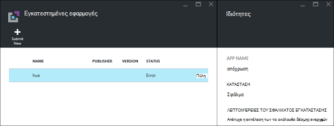
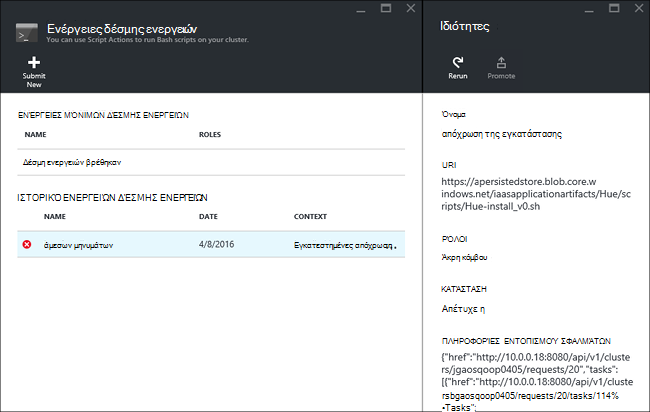

<properties
    pageTitle="Εγκατάσταση των εφαρμογών Hadoop σε HDInsight | Microsoft Azure"
    description="Μάθετε πώς να εγκαταστήσετε τις εφαρμογές HDInsight σε εφαρμογές HDInsight."
    services="hdinsight"
    documentationCenter=""
    authors="mumian"
    manager="jhubbard"
    editor="cgronlun"
    tags="azure-portal"/>

<tags
    ms.service="hdinsight"
    ms.devlang="na"
    ms.topic="hero-article"
    ms.tgt_pltfrm="na"
    ms.workload="big-data"
    ms.date="09/14/2016"
    ms.author="jgao"/>

# Εγκατάσταση προσαρμοσμένες εφαρμογές HDInsight

Μια εφαρμογή του HDInsight είναι μια εφαρμογή που χρήστες μπορούν να εγκαταστήσουν σε ένα σύμπλεγμα βάσει Linux HDInsight.  Αυτές οι εφαρμογές μπορούν να αναπτυχθούν από τη Microsoft, ανεξάρτητων προμηθευτών λογισμικού (ISV) ή με τον εαυτό σας. Σε αυτό το άρθρο, θα μάθετε πώς να εγκαταστήσετε μια εφαρμογή HDInsight που δεν έχουν δημοσιευτεί στην πύλη του Azure στην HDInsight. Η εφαρμογή θα εγκαταστήσετε είναι [απόχρωση](http://gethue.com/). 

Άλλα σχετικά άρθρα:

- [Εγκατάσταση HDInsight εφαρμογές](hdinsight-apps-install-applications.md): Μάθετε πώς μπορείτε να εγκαταστήσετε μια εφαρμογή HDInsight σε σας συμπλεγμάτων.
- [Δημοσίευση HDInsight εφαρμογές](hdinsight-apps-publish-applications.md): Μάθετε πώς μπορείτε να δημοσιεύσετε τις προσαρμοσμένες εφαρμογές HDInsight με το Azure Marketplace.
- [MSDN: εγκατάσταση μιας εφαρμογής HDInsight](https://msdn.microsoft.com/library/mt706515.aspx): Μάθετε πώς μπορείτε να ορίσετε τις εφαρμογές HDInsight.

 
## Προαπαιτούμενα στοιχεία

Εάν θέλετε να εγκαταστήσετε τις εφαρμογές HDInsight σε ένα υπάρχον σύμπλεγμα HDInsight, πρέπει να έχετε ένα σύμπλεγμα HDInsight. Για να δημιουργήσετε μια λίστα, ανατρέξτε στο θέμα [Δημιουργία συμπλεγμάτων](hdinsight-hadoop-linux-tutorial-get-started.md#create-cluster). Μπορείτε επίσης να εγκαταστήσετε τις εφαρμογές HDInsight όταν δημιουργείτε ένα σύμπλεγμα HDInsight.

## Εγκατάσταση των εφαρμογών του HDInsight

Εφαρμογές HDInsight μπορεί να εγκατασταθεί όταν δημιουργείτε ένα σύμπλεγμα ή σε ένα υπάρχον σύμπλεγμα HDInsight. Για τον ορισμό πρότυπα διαχείρισης πόρων Azure, ανατρέξτε στο θέμα [MSDN: εγκατάσταση μιας εφαρμογής HDInsight](https://msdn.microsoft.com/library/mt706515.aspx).

Τα αρχεία που απαιτούνται για την ανάπτυξη αυτής της εφαρμογής (απόχρωση):

- [azuredeploy.JSON](https://github.com/hdinsight/Iaas-Applications/blob/master/Hue/azuredeploy.json): Η διαχείριση πόρων προτύπου για την εγκατάσταση της εφαρμογής HDInsight. Ανατρέξτε στο θέμα [MSDN: εγκατάσταση μιας εφαρμογής HDInsight](https://msdn.microsoft.com/library/mt706515.aspx) για την ανάπτυξη το δικό σας πρότυπο διαχείρισης πόρων.
- [απόχρωση install_v0.sh](https://github.com/hdinsight/Iaas-Applications/blob/master/Hue/scripts/Hue-install_v0.sh): Η δέσμη ενεργειών ενέργεια να καλείται από το πρότυπο διαχείρισης πόρων για τη ρύθμιση παραμέτρων στον κόμβο άκρο. 
- [απόχρωση binaries.tgz](https://hdiconfigactions.blob.core.windows.net/linuxhueconfigactionv01/hue-binaries-14-04.tgz): το δυαδικό αρχείο απόχρωση που ονομάζεται από hui install_v0.sh. 
- [απόχρωση-δυαδικά δεδομένα-14-04.tgz](https://hdiconfigactions.blob.core.windows.net/linuxhueconfigactionv01/hue-binaries-14-04.tgz): το δυαδικό αρχείο απόχρωση που ονομάζεται από hui install_v0.sh. 
- [webwasb tomcat.tar.gz](https://hdiconfigactions.blob.core.windows.net/linuxhueconfigactionv01/webwasb-tomcat.tar.gz): δείγμα εφαρμογής web (Tomcat) που ονομάζεται από hui install_v0.sh.

**Για να εγκαταστήσετε απόχρωση σε ένα υπάρχον σύμπλεγμα HDInsight**

1. Κάντε κλικ στην παρακάτω εικόνα για να συνδεθείτε Azure και ανοίξτε το πρότυπο διαχείρισης πόρων στην πύλη του Azure. 

    

    Αυτό το κουμπί ανοίγει ένα πρότυπο από διαχειριστή πόρων στην πύλη του Azure.  Το πρότυπο διαχείρισης πόρων βρίσκεται στο [https://github.com/hdinsight/Iaas-Applications/tree/master/Hue](https://github.com/hdinsight/Iaas-Applications/tree/master/Hue).  Για να μάθετε πώς να συντάξετε αυτό το πρότυπο διαχείρισης πόρων, ανατρέξτε στο θέμα [MSDN: εγκατάσταση μιας εφαρμογής HDInsight](https://msdn.microsoft.com/library/mt706515.aspx).
    
2. Από το blade **παραμέτρους** , εισαγάγετε τα εξής:

    - **ClusterName**: Πληκτρολογήστε το όνομα του συμπλέγματος όπου θέλετε να εγκαταστήσετε την εφαρμογή. Αυτό το σύμπλεγμα πρέπει να είναι ένα υπάρχον σύμπλεγμα.
    
3. Κάντε κλικ στο **κουμπί OK** για να αποθηκεύσετε τις παραμέτρους.
4. Από την **Ανάπτυξη προσαρμοσμένης** blade, εισαγάγετε **ομάδα πόρων**.  Η ομάδα πόρων είναι ένα κοντέινερ που ομαδοποιεί το σύμπλεγμα, ο λογαριασμός εξαρτώμενα χώρου αποθήκευσης και άλλοι πόροι. Απαιτείται για να χρησιμοποιήσετε την ίδια ομάδα πόρων ως το σύμπλεγμα.
5. Κάντε κλικ στην επιλογή **νομική τους όρους**και, στη συνέχεια, κάντε κλικ στην επιλογή **Δημιουργία**.
6. Επιβεβαιώστε το πλαίσιο ελέγχου **Pin στον πίνακα εργαλείων** είναι επιλεγμένο και, στη συνέχεια, κάντε κλικ στην επιλογή **Δημιουργία**. Μπορείτε να δείτε την κατάσταση εγκατάστασης από το πλακίδιο καρφιτσωμένα στη πύλης πίνακα εργαλείων και την ειδοποίηση πύλης (κάντε κλικ στο εικονίδιο κουδουνιού στο επάνω μέρος της πύλης).  Χρειάζονται περίπου 10 λεπτά για να εγκαταστήσετε την εφαρμογή.

**Για να εγκαταστήσετε το απόχρωση κατά τη δημιουργία ενός συμπλέγματος**

1. Κάντε κλικ στην παρακάτω εικόνα για να συνδεθείτε Azure και ανοίξτε το πρότυπο διαχείρισης πόρων στην πύλη του Azure. 

    

    Αυτό το κουμπί ανοίγει ένα πρότυπο από διαχειριστή πόρων στην πύλη του Azure.  Το πρότυπο διαχείρισης πόρων βρίσκεται στο [https://hditutorialdata.blob.core.windows.net/hdinsightapps/create-linux-based-hadoop-cluster-in-hdinsight.json](https://hditutorialdata.blob.core.windows.net/hdinsightapps/create-linux-based-hadoop-cluster-in-hdinsight.json).  Για να μάθετε πώς να συντάξετε αυτό το πρότυπο διαχείρισης πόρων, ανατρέξτε στο θέμα [MSDN: εγκατάσταση μιας εφαρμογής HDInsight](https://msdn.microsoft.com/library/mt706515.aspx).

2. Ακολουθήστε τις οδηγίες για να δημιουργήσετε σύμπλεγμα και εγκαταστήσετε απόχρωση. Για περισσότερες πληροφορίες σχετικά με τη δημιουργία συμπλεγμάτων HDInsight, ανατρέξτε στο θέμα [Δημιουργία Linux βάσει Hadoop συμπλεγμάτων στο HDInsight](hdinsight-hadoop-provision-linux-clusters.md).

Εκτός από την πύλη του Azure, μπορείτε επίσης να χρησιμοποιήσετε [Azure PowerShell](hdinsight-hadoop-create-linux-clusters-arm-templates.md#deploy-with-powershell) και [Azure CLI](hdinsight-hadoop-create-linux-clusters-arm-templates.md#deploy-with-azure-cli) για να καλέσετε πρότυπα διαχείρισης πόρων.

## Επικυρώστε την εγκατάσταση

Μπορείτε να ελέγξετε την κατάσταση της εφαρμογής στην πύλη του Azure για να επικυρώσετε την εγκατάσταση της εφαρμογής. Επιπλέον, μπορείτε να επίσης επικυρώσετε όλες HTTP προέρχονται τα τελικά σημεία του με τον αναμενόμενο τρόπο και η ιστοσελίδα, εάν υπάρχει ένα:

**Για να ανοίξετε την πύλη απόχρωση**

1. Είσοδος στην [πύλη του Azure](https://portal.azure.com).
2. Κάντε κλικ στην επιλογή **HDInsight συμπλεγμάτων** στο αριστερό μενού.  Εάν δεν το βλέπετε, κάντε κλικ στην επιλογή **Αναζήτηση**και, στη συνέχεια, κάντε κλικ στην επιλογή **Συμπλεγμάτων HDInsight**.
3. Κάντε κλικ στην επιλογή το σύμπλεγμα όπου έχετε εγκαταστήσει την εφαρμογή.
4. Από το blade **Ρυθμίσεις** , κάντε κλικ στην επιλογή **εφαρμογές** κάτω από την κατηγορία **Γενικά** . Βλέπετε **απόχρωση** που αναφέρονται σε το blade **Εγκατασταθεί εφαρμογές** .
5. Κάντε κλικ στην επιλογή **απόχρωση** από τη λίστα για να εμφανίσετε τις ιδιότητες.  
6. Κάντε κλικ στη σύνδεση ιστοσελίδας για την επικύρωση της τοποθεσίας Web; Ανοίξτε το τελικό σημείο HTTP σε ένα πρόγραμμα περιήγησης για να επικυρώσετε web απόχρωση περιβάλλοντος εργασίας Χρήστη, ανοίξτε το τελικό σημείο SSH χρησιμοποιώντας [PuTTY](hdinsight-hadoop-linux-use-ssh-windows.md) ή άλλα [προγράμματα-πελάτες SSH](hdinsight-hadoop-linux-use-ssh-unix.md).
 
## Αντιμετώπιση προβλημάτων κατά την εγκατάσταση

Μπορείτε να ελέγξετε την κατάσταση εγκατάστασης εφαρμογών από την πύλη ειδοποίηση (κάντε κλικ στο εικονίδιο κουδουνιού στο επάνω μέρος της πύλης). 

Εάν αποτύχει μια εγκατάσταση της εφαρμογής, μπορείτε να δείτε τα μηνύματα σφάλματος και πληροφορίες από 3 ψηφίων εντοπισμού σφαλμάτων:

- Εφαρμογές HDInsight: γενικές πληροφορίες.

    Ανοίξτε το σύμπλεγμα από την πύλη και κάντε κλικ στην επιλογή εφαρμογές από το blade ρυθμίσεις:

    

- Ενέργεια δέσμη ενεργειών HDInsight: Εάν το μήνυμα σφάλματος των εφαρμογών του HDInsight υποδηλώνει αποτυχία ενέργεια δέσμης ενεργειών, θα εμφανιστούν περισσότερες λεπτομέρειες σχετικά με την αποτυχία της δέσμης ενεργειών στο παράθυρο ενέργειες δέσμης ενεργειών.

    Κάντε κλικ στην επιλογή δέσμης ενεργειών από το blade ρυθμίσεις. Ιστορικό ενέργεια δέσμη ενεργειών εμφανίζει τα μηνύματα σφάλματος

    
    
- Ambari Web περιβάλλοντος εργασίας Χρήστη: Εάν η δέσμη ενεργειών εγκατάσταση ήταν η αιτία της αποτυχίας, χρησιμοποιήστε Ambari περιβάλλοντος εργασίας Χρήστη Web για να ελέγξετε πλήρη αρχεία καταγραφής σχετικά με τις δέσμες ενεργειών εγκατάστασης.

    Για περισσότερες πληροφορίες, ανατρέξτε στο θέμα [Αντιμετώπιση προβλημάτων](hdinsight-hadoop-customize-cluster-linux.md#troubleshooting).

## Κατάργηση HDInsight εφαρμογές

Υπάρχουν πολλοί τρόποι για να διαγράψετε τις εφαρμογές HDInsight.

### Χρήση πύλης

**Για να καταργήσετε μια εφαρμογή με την πύλη**

1. Είσοδος στην [πύλη του Azure](https://portal.azure.com).
2. Κάντε κλικ στην επιλογή **HDInsight συμπλεγμάτων** στο αριστερό μενού.  Εάν δεν το βλέπετε, κάντε κλικ στην επιλογή **Αναζήτηση**και, στη συνέχεια, κάντε κλικ στην επιλογή **Συμπλεγμάτων HDInsight**.
3. Κάντε κλικ στην επιλογή το σύμπλεγμα όπου έχετε εγκαταστήσει την εφαρμογή.
4. Από το blade **Ρυθμίσεις** , κάντε κλικ στην επιλογή **εφαρμογές** κάτω από την κατηγορία **Γενικά** . Βλέπετε μια λίστα των εγκατεστημένων εφαρμογών. Για αυτό το πρόγραμμα εκμάθησης, **απόχρωση** που αναφέρονται σε το blade **Εγκατασταθεί εφαρμογές** .
5. Κάντε δεξί κλικ στην εφαρμογή που θέλετε να καταργήσετε και, στη συνέχεια, κάντε κλικ στην επιλογή **Διαγραφή**.
6. Κάντε κλικ στο κουμπί **Ναι** για επιβεβαίωση.

Από την πύλη, μπορείτε να διαγράψετε το σύμπλεγμα ή να διαγράψετε την ομάδα των πόρων που περιέχει την εφαρμογή.

### Χρήση του Azure PowerShell

Χρήση του Azure PowerShell, να διαγράψετε το σύμπλεγμα ή να διαγράψετε την ομάδα των πόρων. Ανατρέξτε στο θέμα [Διαγραφή συμπλεγμάτων με χρήση του Azure PowerShell](hdinsight-administer-use-powershell.md#delete-clusters).

### Χρήση του Azure CLI

Χρήση Azure CLI, να διαγράψετε το σύμπλεγμα ή να διαγράψετε την ομάδα των πόρων. Ανατρέξτε στο θέμα [Διαγραφή συμπλεγμάτων χρησιμοποιώντας Azure CLI](hdinsight-administer-use-command-line.md#delete-clusters).

## Επόμενα βήματα

- [MSDN: εγκατάσταση μιας εφαρμογής HDInsight](https://msdn.microsoft.com/library/mt706515.aspx): Μάθετε πώς μπορείτε να αναπτύξετε πρότυπα διαχείρισης πόρων για την ανάπτυξη εφαρμογών HDInsight.
- [Εγκατάσταση HDInsight εφαρμογές](hdinsight-apps-install-applications.md): Μάθετε πώς μπορείτε να εγκαταστήσετε μια εφαρμογή HDInsight σε σας συμπλεγμάτων.
- [Δημοσίευση HDInsight εφαρμογές](hdinsight-apps-publish-applications.md): Μάθετε πώς μπορείτε να δημοσιεύσετε τις προσαρμοσμένες εφαρμογές HDInsight με το Azure Marketplace.
- [Προσαρμογή Linux βάσει HDInsight συμπλεγμάτων με χρήση δέσμης ενεργειών](hdinsight-hadoop-customize-cluster-linux.md): Μάθετε πώς μπορείτε να χρησιμοποιήσετε την ενέργεια δέσμη ενεργειών για να εγκαταστήσετε πρόσθετες εφαρμογές.
- [Δημιουργία Linux βάσει Hadoop συμπλεγμάτων στο HDInsight με τη χρήση προτύπων για τη διαχείριση πόρων](hdinsight-hadoop-create-linux-clusters-arm-templates.md): Μάθετε πώς μπορείτε να καλέσετε πρότυπα διαχείρισης πόρων για να δημιουργήσετε συμπλεγμάτων HDInsight.
- [Χρησιμοποιήστε τους κόμβους κενή άκρη HDInsight](hdinsight-apps-use-edge-node.md): Μάθετε πώς να χρησιμοποιείτε έναν κόμβο κενή άκρη για πρόσβαση σε σύμπλεγμα HDInsight, δοκιμή HDInsight εφαρμογών και φιλοξενίας εφαρμογές HDInsight.
