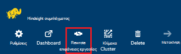
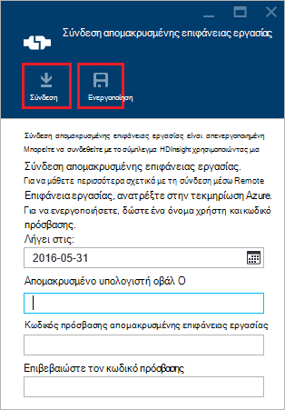
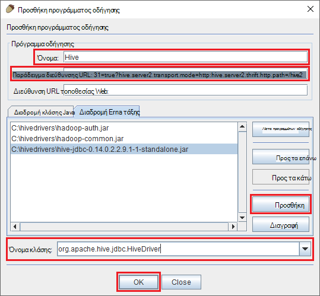
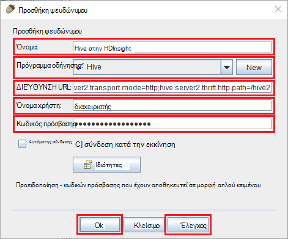
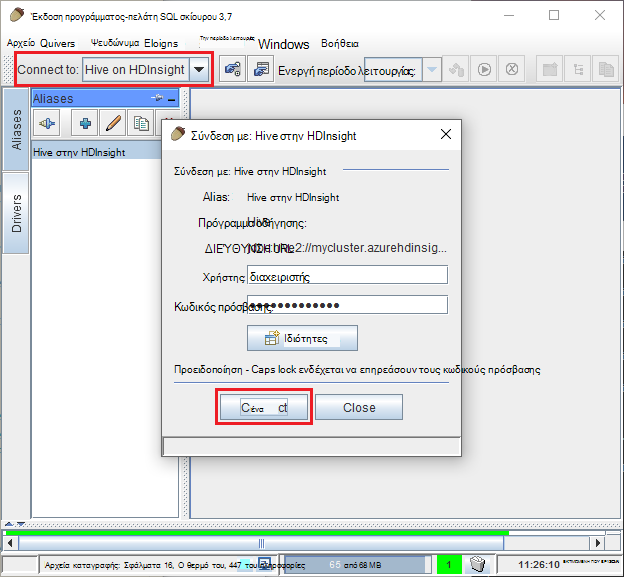
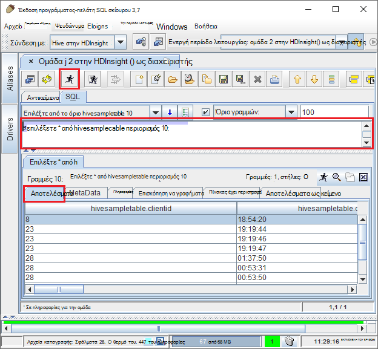

<properties
 pageTitle="Χρήση JDBC ερώτημα Hive στην Azure HDInsight"
 description="Μάθετε πώς μπορείτε να χρησιμοποιήσετε JDBC για να συνδεθείτε με ομάδα στο Azure HDInsight και απομακρυσμένα εκτέλεση ερωτημάτων σε δεδομένα που είναι αποθηκευμένα στο cloud."
 services="hdinsight"
 documentationCenter=""
 authors="Blackmist"
 manager="jhubbard"
 editor="cgronlun"
    tags="azure-portal"/>

<tags
 ms.service="hdinsight"
 ms.devlang="java"
 ms.topic="article"
 ms.tgt_pltfrm="na"
 ms.workload="big-data"
 ms.date="08/23/2016"
 ms.author="larryfr"/>

#Σύνδεση σε ομάδα στο Azure HDInsight χρησιμοποιώντας το πρόγραμμα οδήγησης Hive JDBC

[AZURE.INCLUDE [ODBC-JDBC-selector](../../includes/hdinsight-selector-odbc-jdbc.md)]

Σε αυτό το έγγραφο, θα μάθετε πώς να χρησιμοποιείτε JDBC από μια εφαρμογή Java για απομακρυσμένα υποβολή ερωτημάτων ομάδας σε ένα σύμπλεγμα HDInsight. Θα μάθετε πώς μπορείτε να συνδεθείτε από το πρόγραμμα-πελάτη σκίουρου SQL και πώς μπορείτε να συνδεθείτε μέσω προγραμματισμού από Java.

Για περισσότερες πληροφορίες σχετικά με το περιβάλλον εργασίας Hive JDBC, ανατρέξτε στο θέμα [HiveJDBCInterface](https://cwiki.apache.org/confluence/display/Hive/HiveJDBCInterface).

##Προαπαιτούμενα στοιχεία

Για να ολοκληρώσετε τα βήματα σε αυτό το άρθρο, θα χρειαστείτε τα εξής:

* Hadoop σε σύμπλεγμα HDInsight. Θα λειτουργούν συμπλεγμάτων βάσει Linux είτε βασίζεται στα Windows.

* [Σκίουρου SQL](http://squirrel-sql.sourceforge.net/). Σκίουρου είναι μια εφαρμογή προγράμματος-πελάτη JDBC.

Για να δημιουργήσετε και να εκτελέσετε την εφαρμογή Java παράδειγμα συνδεδεμένες με αυτό το άρθρο, θα χρειαστείτε τα εξής.

* Το [Κιτ προγραμματιστής Java (JDK) έκδοση 7](https://www.oracle.com/technetwork/java/javase/downloads/jdk7-downloads-1880260.html) ή νεότερη έκδοση.

* [Apache Maven](https://maven.apache.org). Maven είναι ένα έργο Δημιουργία συστήματος για τα έργα Java που χρησιμοποιείται από το έργο που έχει συσχετιστεί με αυτό το άρθρο.

##Συμβολοσειρά σύνδεσης

JDBC συνδέσεων σε ένα σύμπλεγμα HDInsight στην Azure πραγματοποιούνται πάνω από 443 και της κυκλοφορίας μέσω SSL. Η δημόσια πύλη που των συμπλεγμάτων καθίσετε πίσω από ανακατευθύνει την κυκλοφορία θύρας στην οποία HiveServer2 στην πραγματικότητα ακρόαση σε. Επομένως, μια συμβολοσειρά σύνδεσης τυπικές θέλετε τα εξής:

    jdbc:hive2://CLUSTERNAME.azurehdinsight.net:443/default;ssl=true?hive.server2.transport.mode=http;hive.server2.thrift.http.path=/hive2

Αντικαταστήστε __CLUSTERNAME__ με το όνομα του συμπλέγματος HDInsight.

##Έλεγχος ταυτότητας

Κατά τη δημιουργία της σύνδεσης, πρέπει να μπορείτε να χρησιμοποιήσετε το όνομα διαχειριστή συμπλέγματος HDInsight και τον κωδικό πρόσβασης για τον έλεγχο ταυτότητας για την πύλη σύμπλεγμα. Κατά τη σύνδεση από προγράμματα-πελάτες JDBC όπως σκίουρου SQL, πρέπει να εισαγάγετε το όνομα διαχειριστή και τον κωδικό πρόσβασης στις ρυθμίσεις του προγράμματος-πελάτη.

Από μια εφαρμογή Java, πρέπει να χρησιμοποιήσετε το όνομα και τον κωδικό πρόσβασης κατά τη δημιουργία μιας σύνδεσης. Για παράδειγμα, ο ακόλουθος κώδικας Java ανοίγει μια νέα σύνδεση χρησιμοποιώντας τη συμβολοσειρά σύνδεσης, το όνομα διαχειριστή και τον κωδικό πρόσβασης:

    DriverManager.getConnection(connectionString,clusterAdmin,clusterPassword);

##Σύνδεση με το SQL σκίουρου προγράμματος-πελάτη

Σκίουρου SQL είναι ένα πρόγραμμα-πελάτη JDBC που μπορούν να χρησιμοποιηθούν για την εκτέλεση ερωτημάτων ομάδα με το σύμπλεγμά σας HDInsight. Ακολουθήστε τα παρακάτω βήματα λαμβάνεται ως δεδομένο ότι έχετε ήδη εγκαταστήσει το SQL σκίουρου και θα σας καθοδηγήσει μέσω τη λήψη και τη ρύθμιση των παραμέτρων των προγραμμάτων οδήγησης για ομάδα.

1. Αντιγράψτε τα προγράμματα οδήγησης Hive JDBC από το σύμπλεγμά σας HDInsight.

    * Για __βάσει Linux HDInsight__, χρησιμοποιήστε τα ακόλουθα βήματα για να κάνετε λήψη των αρχείων απαιτείται βάζο.

        1. Δημιουργία ενός νέου καταλόγου που θα περιέχει τα αρχεία. Για παράδειγμα, `mkdir hivedriver`.

        2. Από μια γραμμή εντολών, πάρτι, PowerShell ή άλλες γραμμή εντολών, αλλάξτε τον κατάλογο νέου καταλόγου και χρησιμοποιήστε τις παρακάτω εντολές για να αντιγράψετε τα αρχεία από το σύμπλεγμα HDInsight.

                scp USERNAME@CLUSTERNAME:/usr/hdp/current/hive-client/lib/hive-jdbc*standalone.jar .
                scp USERNAME@CLUSTERNAME:/usr/hdp/current/hadoop-client/hadoop-common.jar .
                scp USERNAME@CLUSTERNAME:/usr/hdp/current/hadoop-client/hadoop-auth.jar .

            Αντικαταστήστε το __όνομα ΧΡΉΣΤΗ__ με το όνομα του λογαριασμού χρήστη SSH για το σύμπλεγμα. Αντικαταστήστε __CLUSTERNAME__ με το όνομα του συμπλέγματος HDInsight.

            > [AZURE.NOTE] Σε περιβάλλοντα των Windows, θα πρέπει να χρησιμοποιήσετε το βοηθητικό πρόγραμμα PSCP αντί scp. Μπορείτε να κάνετε λήψη του από το [http://www.chiark.greenend.org.uk/~sgtatham/putty/download.html](http://www.chiark.greenend.org.uk/~sgtatham/putty/download.html).

    * Για το __HDInsight που βασίζεται στα Windows__, χρησιμοποιήστε τα ακόλουθα βήματα για να κάνετε λήψη των αρχείων βάζο.

        1. Από την πύλη Azure, επιλέξτε το σύμπλεγμά σας HDInsight και, στη συνέχεια, επιλέξτε το εικονίδιο __Απομακρυσμένης επιφάνειας εργασίας__ .

            

        2. Σε το blade απομακρυσμένης επιφάνειας εργασίας, χρησιμοποιήστε το κουμπί __σύνδεση__ για να συνδεθείτε με το σύμπλεγμα. Εάν δεν είναι ενεργοποιημένη η απομακρυσμένη επιφάνεια εργασίας, χρησιμοποιήστε τη φόρμα για να δώσετε ένα όνομα χρήστη και τον κωδικό πρόσβασης, στη συνέχεια, επιλέξτε το στοιχείο __Ενεργοποίηση__ για την ενεργοποίηση της απομακρυσμένης επιφάνειας εργασίας για το σύμπλεγμα.

            

            Αφού επιλέξετε τη __σύνδεση__, θα γίνει λήψη ενός αρχείου .rdp. Χρησιμοποιήστε αυτό το αρχείο για να ξεκινήσετε το πρόγραμμα-πελάτη απομακρυσμένης επιφάνειας εργασίας. Όταν σας ζητηθεί, χρησιμοποιήστε το όνομα χρήστη και κωδικός πρόσβασης που πληκτρολογήσατε για πρόσβαση απομακρυσμένης επιφάνειας εργασίας.

        3. Μετά τη σύνδεση, αντιγράψτε τα ακόλουθα αρχεία από την περίοδο λειτουργίας απομακρυσμένης επιφάνειας εργασίας στον υπολογιστή σας. Περικλείστε τους σε έναν τοπικό κατάλογο με όνομα `hivedriver`.

            * C:\apps\dist\hive-0.14.0.2.2.9.1-7\lib\hive-JDBC-0.14.0.2.2.9.1-7-Standalone.jar
            * C:\apps\dist\hadoop-2.6.0.2.2.9.1-7\share\hadoop\common\hadoop-Common-2.6.0.2.2.9.1-7.jar
            * C:\apps\dist\hadoop-2.6.0.2.2.9.1-7\share\hadoop\common\lib\hadoop-auth-2.6.0.2.2.9.1-7.jar

            > [AZURE.NOTE] Οι αριθμοί έκδοσης που περιλαμβάνονται στη διαδρομές και ονόματα αρχείων μπορεί να διαφέρει για το σύμπλεγμά σας.

        4. Τερματίζει την περίοδο λειτουργίας απομακρυσμένης επιφάνειας εργασίας, αφού ολοκληρώσετε την αντιγραφή των αρχείων.

3. Εκκινήστε την εφαρμογή σκίουρου SQL. Από το αριστερό τμήμα του παραθύρου, επιλέξτε __προγράμματα οδήγησης__.

    

4. Από τα εικονίδια στο επάνω μέρος του παραθύρου διαλόγου __προγράμματα οδήγησης__ , επιλέξτε το __+__ εικονίδιο για να δημιουργήσετε ένα νέο πρόγραμμα οδήγησης.

    

5. Στο παράθυρο διαλόγου Προσθήκη πρόγραμμα οδήγησης, προσθέστε τις ακόλουθες πληροφορίες.

    * __Όνομα__: Hive
    * __Παράδειγμα διεύθυνσης URL__: jdbc:hive2://localhost:443/default;ssl=true?hive.server2.transport.mode=http;hive.server2.thrift.http.path=/hive2
    * __Επιπλέον διαδρομής κλάσεων__: Χρησιμοποιήστε το κουμπί Προσθήκη για να προσθέσετε τα αρχεία βάζο ληφθεί προηγουμένως
    * __Όνομα κλάσης__: org.apache.hive.jdbc.HiveDriver

    

    Κάντε κλικ στο __κουμπί OK__ για να αποθηκεύσετε αυτές τις ρυθμίσεις.

6. Στην αριστερή πλευρά του παραθύρου SQL σκίουρου, επιλέξτε __ψευδώνυμα__. Στη συνέχεια, κάντε κλικ στην επιλογή το __+__ εικονίδιο για να δημιουργήσετε ένα νέο ψευδώνυμο σύνδεσης.

    

7. Χρησιμοποιήστε τις παρακάτω τιμές για το παράθυρο διαλόγου __Προσθήκη ψευδώνυμου__ .

    * __Όνομα__: Hive στην HDInsight
    * __Πρόγραμμα οδήγησης__: Χρησιμοποιήστε την αναπτυσσόμενη λίστα για να επιλέξετε το πρόγραμμα οδήγησης __Hive__
    * __Διεύθυνση URL__: jdbc:hive2://CLUSTERNAME.azurehdinsight.net:443/default;ssl=true?hive.server2.transport.mode=http;hive.server2.thrift.http.path=/hive2

        Αντικαταστήστε __CLUSTERNAME__ με το όνομα του συμπλέγματος HDInsight.

    * __Όνομα χρήστη__: το όνομα λογαριασμού σύνδεσης συμπλέγματος για το σύμπλεγμά σας HDInsight. Η προεπιλογή είναι `admin`.
    * __Κωδικός πρόσβασης__: Ο κωδικός πρόσβασης για το λογαριασμό σύνδεσης σύμπλεγμα. Πρόκειται για έναν κωδικό πρόσβασης που παρείχατε κατά τη δημιουργία του συμπλέγματος HDInsight.

    

    Χρησιμοποιήστε το κουμπί __Δοκιμή__ για να βεβαιωθείτε ότι λειτουργεί η σύνδεση. Όταν __σύνδεση σε: Hive στην HDInsight__ εμφανίζεται το παράθυρο διαλόγου, επιλέξτε __σύνδεση__ για να εκτελέσετε τον έλεγχο. Εάν η δοκιμή ολοκληρωθεί με επιτυχία, θα εμφανιστεί ένα παράθυρο διαλόγου __σύνδεση ολοκληρώθηκε με επιτυχία__ .

    Χρησιμοποιήστε το κουμπί __Ok__ στο κάτω μέρος του παραθύρου διαλόγου __Προσθήκη ψευδωνύμου__ για να αποθηκεύσετε το ψευδώνυμο σύνδεσης.

8. Από την αναπτυσσόμενη λίστα __σύνδεση με__ στο επάνω μέρος του σκίουρου SQL, επιλέξτε __την ομάδα στην HDInsight__. Όταν σας ζητηθεί, επιλέξτε __σύνδεση__.

    

9. Μετά τη σύνδεση, εισαγάγετε το παρακάτω ερώτημα στο παράθυρο διαλόγου του ερωτήματος SQL και, στη συνέχεια, επιλέξτε το εικονίδιο __Εκτέλεση__ . Στην περιοχή αποτελέσματα θα πρέπει να εμφανίζουν τα αποτελέσματα του ερωτήματος.

        select * from hivesampletable limit 10;

    

##Σύνδεση από ένα παράδειγμα εφαρμογής Java

Ένα παράδειγμα της χρήσης ενός πελάτη Java ερώτημα Hive στην HDInsight είναι διαθέσιμη από την [https://github.com/Azure-Samples/hdinsight-java-hive-jdbc](https://github.com/Azure-Samples/hdinsight-java-hive-jdbc). Ακολουθήστε τις οδηγίες στο αποθετήριο δεδομένων για να δημιουργήσετε και να εκτελέσετε το δείγμα.

##Αντιμετώπιση προβλημάτων

### Μη αναμενόμενο σφάλμα κατά την προσπάθεια για να ανοίξετε μια σύνδεση SQL.

__Συμπτώματα__: κατά τη σύνδεση σε ένα σύμπλεγμα HDInsight που είναι η έκδοση 3.3 ή 3.4, ενδέχεται να εμφανιστεί ένα μήνυμα σφάλματος που εμφανίστηκε μη αναμενόμενο σφάλμα. Η παρακολούθηση στοίβας για αυτό το σφάλμα θα ξεκινήσει με τις ακόλουθες γραμμές:

    java.util.concurrent.ExecutionException: java.lang.RuntimeException: java.lang.NoSuchMethodError: org.apache.commons.codec.binary.Base64.<init>(I)V
    at java.util.concurrent.FutureTas...(FutureTask.java:122)
    at java.util.concurrent.FutureTask.get(FutureTask.java:206)

__Αιτία__: αυτό το σφάλμα οφείλεται σε μια ασυμφωνία στην έκδοση του αρχείου commons codec.jar χρησιμοποιείται από σκίουρου και αυτό απαιτείται από το Hive JDBC στοιχεία που έχουν ληφθεί από το HDInsight σύμπλεγμα.

__Ανάλυση__: για να διορθώσετε αυτό το σφάλμα, χρησιμοποιήστε τα ακόλουθα βήματα.

1. Κάντε λήψη του αρχείου βάζο commons κωδικοποιητή από το σύμπλεγμά σας HDInsight.

        scp USERNAME@CLUSTERNAME:/usr/hdp/current/hive-client/lib/commons-codec*.jar ./commons-codec.jar

2. Έξοδος από σκίουρου και, στη συνέχεια, μεταβείτε στον κατάλογο όπου είναι εγκατεστημένο το σκίουρου στο σύστημά σας. Στον κατάλογο σκίουρου, κάτω από το `lib` καταλόγου, αντικαταστήστε το υπάρχον commons codec.jar με αυτήν που έχουν ληφθεί από το HDInsight σύμπλεγμα.

3. Επανεκκινήστε σκίουρου. Το σφάλμα δεν είναι πλέον πρέπει να πραγματοποιείται κατά τη σύνδεση με την ομάδα στην HDInsight.

##Επόμενα βήματα

Τώρα που μάθατε πώς μπορείτε να χρησιμοποιήσετε JDBC ώστε να λειτουργεί με την ομάδα, χρησιμοποιήστε τις παρακάτω συνδέσεις για να εξερευνήσετε άλλους τρόπους για να εργαστείτε με Azure HDInsight.

* [Αποστολή δεδομένων σε HDInsight](hdinsight-upload-data.md)
* [Χρήση της ομάδας με το HDInsight](hdinsight-use-hive.md)
* [Χρήση γουρούνι με HDInsight](hdinsight-use-pig.md)
* [Χρήση MapReduce εργασίες με το HDInsight](hdinsight-use-mapreduce.md)
