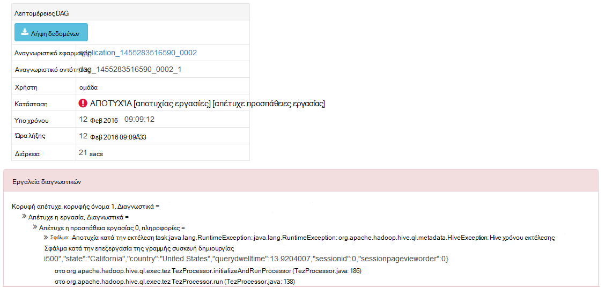

<properties
pageTitle="Χρήση της προβολής Tez Ambari με HDInsight | Azure"
description="Μάθετε πώς μπορείτε να χρησιμοποιήσετε την προβολή Ambari Tez για τον εντοπισμό σφαλμάτων έργα Tez HDInsight."
services="hdinsight"
documentationCenter=""
authors="Blackmist"
manager="jhubbard"
editor="cgronlun"/>

<tags
ms.service="hdinsight"
ms.devlang="na"
ms.topic="article"
ms.tgt_pltfrm="na"
ms.workload="big-data"
ms.date="10/04/2016"
ms.author="larryfr"/>

# Χρήση των προβολών Ambari για τον εντοπισμό σφαλμάτων έργα Tez HDInsight

Το περιβάλλον εργασίας Χρήστη Ambari Web για το HDInsight περιέχει μια προβολή Tez που μπορούν να χρησιμοποιηθούν για την κατανόηση και εντοπισμός σφαλμάτων εργασίες που χρησιμοποιούν Tez ως το μηχανισμό εκτέλεσης. Η προβολή Tez σάς επιτρέπει να απεικόνιση της εργασίας όπως το γράφημα συνδεδεμένο στοιχείων, εμβάθυνση σε κάθε στοιχείο και ανάκτησης στατιστικών στοιχείων και πληροφορίες σύνδεσης.

> [AZURE.NOTE] Οι πληροφορίες σε αυτό το έγγραφο είναι συγκεκριμένη για συμπλεγμάτων βάσει Linux HDInsight. Για πληροφορίες σχετικά με τον εντοπισμό σφαλμάτων Tez εργασίες χρησιμοποιώντας HDInsight που βασίζεται στα Windows, ανατρέξτε στο θέμα [χρήση του περιβάλλοντος εργασίας Χρήστη του Tez για τον εντοπισμό σφαλμάτων έργα Tez HDInsight που βασίζεται στα Windows](hdinsight-debug-tez-ui.md).

## Προαπαιτούμενα στοιχεία

* Ένα σύμπλεγμα βάσει Linux HDInsight. Για οδηγίες σχετικά με τη δημιουργία ενός νέου συμπλέγματος, ανατρέξτε στο θέμα [Γρήγορα αποτελέσματα με το HDInsight βάσει Linux](hdinsight-hadoop-linux-tutorial-get-started.md).

* Σύγχρονο πρόγραμμα περιήγησης που υποστηρίζει HTML5.

## Κατανόηση των Tez

Tez είναι μια επεκτάσιμη πλαίσιο για την επεξεργασία δεδομένων σε Hadoop που παρέχει μεγαλύτερη ταχύτητες από παραδοσιακά MapReduce επεξεργασίας. Για συμπλεγμάτων βάσει Linux HDInsight, είναι ο προεπιλεγμένος μηχανισμός για την ομάδα.

Κατά την υποβολή εργασίας για να Tez, δημιουργεί μια άμεση μη κυκλικό Graph (DAG) που περιγράφει τη σειρά εκτέλεσης από τις ενέργειες που απαιτούνται από την εργασία. Μεμονωμένες ενέργειες ονομάζονται κορυφών και εκτέλεση ενός τμήματος τη συνολική εργασία. Η πραγματική εκτέλεση των εργασιών που περιγράφεται από κορυφής ονομάζεται μια εργασία και μπορεί να διανεμηθούν σε πολλούς κόμβους του συμπλέγματος.

### Κατανόηση της προβολής Tez

Η προβολή Tez παρέχει πληροφορίες σχετικά με τις διαδικασίες που εκτελούνται, ή που έχουν προηγουμένως εκτελέσατε χρησιμοποιώντας Tez. Σας επιτρέπει να προβάλετε το DAG που δημιουργούνται με Tez, πώς κατανέμεται μεταξύ συμπλεγμάτων, μετρητές όπως μνήμη που χρησιμοποιείται από εργασίες και κορυφές και πληροφοριών σφάλματος. Αυτό μπορεί να προσφέρουν χρήσιμες πληροφορίες στα ακόλουθα σενάρια:

* Παρακολούθηση μεγάλη διάρκεια εκτέλεσης επεξεργάζεται, προβολή της προόδου του χάρτη και μείωση εργασίες.

* Την ανάλυση δεδομένων ιστορικού για επιτυχή ή αποτυχίας διαδικασίες για να μάθετε πώς θα μπορούσε να βελτιωθεί επεξεργασίας ή γιατί απέτυχε.

## Δημιουργία μιας DAG

Η προβολή Tez μόνο θα περιέχουν δεδομένα, εάν μια εργασία που χρησιμοποιεί το μηχανισμό Tez εκτελείται τη συγκεκριμένη στιγμή ή έχει εκτελέσατε στο παρελθόν. Απλή Hive ερωτήματα μπορεί συνήθως να επιλυθεί χωρίς τη χρήση Tez, ωστόσο πιο σύνθετα ερωτήματα που κάνουν το φιλτράρισμα, ομαδοποίηση, ταξινόμηση, συνδέσμους, κ.λπ., συνήθως απαιτούν Tez.

Χρησιμοποιήστε τα παρακάτω βήματα για να εκτελέσετε ένα ερώτημα ομάδα που θα εκτελείται χρησιμοποιώντας Tez.

1. Στο πρόγραμμα περιήγησης web, μεταβείτε στις επιλογές https://CLUSTERNAME.azurehdinsight.net, όπου __CLUSTERNAME__ είναι το όνομα του συμπλέγματος HDInsight.

2. Από το μενού στο επάνω μέρος της σελίδας, επιλέξτε το εικονίδιο __προβολές__ . Έτσι μοιάζει με μια σειρά των τετραγώνων. Στην αναπτυσσόμενη λίστα που εμφανίζεται, επιλέξτε __την ομάδα προβολή__. 

    

3. Όταν προβάλετε την ομάδα φορτία, επικολλήστε το εξής στο πρόγραμμα επεξεργασίας ερωτήματος και, στη συνέχεια, κάντε κλικ στην επιλογή __Εκτέλεση__.

        select market, state, country from hivesampletable where deviceplatform='Android' group by market, country, state;
    
    Μόλις ολοκληρωθεί η εργασία, θα πρέπει να βλέπετε το αποτέλεσμα εμφανίζεται στην ενότητα __Διαδικασία αποτελέσματα του ερωτήματος__ . Τα αποτελέσματα θα πρέπει να είναι παρόμοιο με το εξής
    
        market  state       country
        en-GB   Hessen      Germany
        en-GB   Kingston    Jamaica
        
4. Επιλέξτε την καρτέλα __αρχείο καταγραφής__ . Θα δείτε πληροφορίες παρόμοιο με το εξής:
    
        INFO : Session is already open
        INFO :

        INFO : Status: Running (Executing on YARN cluster with App id application_1454546500517_0063)

    Αποθηκεύστε την τιμή __αναγνωριστικό εφαρμογής__ , όπως θα χρησιμοποιηθεί στην επόμενη ενότητα.

## Χρήση της προβολής Tez

1. Από το μενού στο επάνω μέρος της σελίδας, επιλέξτε το εικονίδιο __προβολές__ . Στην αναπτυσσόμενη λίστα που εμφανίζεται, επιλέξτε __Προβολή Tez__.

    

2. Κατά τη φόρτωση της προβολής Tez, θα δείτε μια λίστα με DAGs που εκτελούνται τη συγκεκριμένη στιγμή ή να έχουν εκτελέσατε στο σύμπλεγμα. Η προεπιλεγμένη προβολή περιλαμβάνει το όνομα Dag, αναγνωριστικό, υποβάλλοντος, κατάσταση, ώρα έναρξης, ώρα λήξης, διάρκεια, Αναγνωριστικό εφαρμογής και ουρά. Μπορείτε να προσθέσετε περισσότερες στήλες με χρήση του εικονιδίου γραναζιού στη δεξιά πλευρά της σελίδας.

    

3. Εάν έχετε μόνο μία καταχώρηση, θα για το ερώτημα που εκτελέσατε στην προηγούμενη ενότητα. Εάν έχετε πολλές εγγραφές, μπορείτε να κάνετε αναζήτηση, πληκτρολογώντας το Αναγνωριστικό εφαρμογής στο πεδίο __Αναγνωριστικό εφαρμογής__ και, στη συνέχεια, πατήστε το πλήκτρο enter.

4. Επιλέξτε το __Όνομα Dag__. Αυτό θα εμφανίσει πληροφορίες σχετικά με το DAG, καθώς και την επιλογή για να κάνετε λήψη μιας zip JSON αρχείων που περιέχουν πληροφορίες σχετικά με το DAG.

    

5. Επάνω από τις __Λεπτομέρειες DAG__ είναι πολλές συνδέσεις που μπορούν να χρησιμοποιηθούν για να εμφανίσετε πληροφορίες σχετικά με το DAG.

    * __Μετρητές DAG__ εμφανίζει πληροφορίες μετρητές για αυτό DAG.
    
    * __Προβολή με γραφικά__ εμφανίζει μια γραφική αναπαράσταση των αυτό DAG.
    
    * __Όλες τις κορυφές__ εμφανίζει μια λίστα των κορυφών σε αυτό DAG.
    
    * __Όλες οι εργασίες__ εμφανίζει μια λίστα με τις εργασίες σε όλες τις κορυφές σε αυτό DAG.
    
    * __Όλα TaskAttempts__ εμφανίζει πληροφορίες σχετικά με τις προσπάθειες για την εκτέλεση εργασιών για αυτό DAG.
    
    > [AZURE.NOTE] Εάν πραγματοποιείτε κύλιση την εμφάνιση της στήλης για κορυφών, εργασίες και TaskAttempts, παρατηρήστε ότι δεν υπάρχουν συνδέσεις για να προβάλετε __μετρητές__ και να __προβάλετε ή να κάνετε λήψη αρχείων καταγραφής__ για κάθε γραμμή.

    Εάν υπήρχε αποτυχία με την εργασία, τις λεπτομέρειες DAG θα εμφανίζουν την κατάσταση απέτυχε, μαζί με συνδέσεις για πληροφορίες σχετικά με την εργασία απέτυχε. Εργαλεία διαγνωστικών πληροφοριών θα εμφανίζονται κάτω από τις λεπτομέρειες DAG.
    
    

7. Επιλέξτε __προβολή με γραφικά__. Αυτό εμφανίζει μια γραφική αναπαράσταση του DAG. Μπορείτε να τοποθετήσετε το δείκτη του ποντικιού επάνω από κάθε κορυφής στην προβολή για να εμφανίσετε πληροφορίες σχετικά με αυτό.

    

8. Κάνοντας κλικ στο κορυφής θα φόρτωση __Κορυφής λεπτομέρειες__ για αυτό το στοιχείο. Κάντε κλικ στο στην κορυφή __χάρτη 1__ για να εμφανίσετε λεπτομέρειες για αυτό το στοιχείο.

    

9. Σημειώστε ότι τώρα έχετε συνδέσεις στο επάνω μέρος της σελίδας που σχετίζονται με κορυφές και εργασίες.

    > [AZURE.NOTE] Μπορείτε επίσης να φτάνουν στο αυτήν τη σελίδα επιστρέφοντας __DAG__λεπτομέρειες, επιλέγοντας __Κορυφής λεπτομέρειες__και, στη συνέχεια, επιλέγοντας την κορυφή __χάρτη 1__ .

    * __Κορυφή μετρητές__ εμφανίζει πληροφορίες μετρητή για αυτό κορυφής.
    
    * __Εργασίες__ εμφανίζει εργασίες για αυτό κορυφής.
    
    * __Εργασία προσπαθεί__ εμφανίζει πληροφορίες σχετικά με τις προσπάθειες για την εκτέλεση εργασιών για αυτό κορυφής.
    
    * __Προελεύσεις & δέκτες__ εμφανίζει προελεύσεις δεδομένων και δέκτες για αυτό κορυφής.

    > [AZURE.NOTE] Ως με το προηγούμενο μενού, μπορείτε να κάνετε κύλιση την εμφάνιση της στήλης για τις εργασίες, προσπάθειες εργασιών, και προελεύσεις & Sinks__ για να εμφανίσετε συνδέσεις σε περισσότερες πληροφορίες για κάθε στοιχείο.

10. Επιλέξτε __εργασίες__και, στη συνέχεια, επιλέξτε το στοιχείο με το όνομα __00_000000__. Αυτό θα εμφανίσει __Λεπτομέρειες εργασίας__ για αυτήν την εργασία. Από αυτή την οθόνη, μπορείτε να προβάλετε __Μετρητές εργασιών__ και __Εργασιών προσπάθειες__.

    

## Επόμενα βήματα

Τώρα που μάθατε πώς μπορείτε να χρησιμοποιήσετε την προβολή Tez, μάθετε περισσότερα σχετικά με τη [Χρήση ομάδας σε HDInsight](hdinsight-use-hive.md).

Για πιο λεπτομερείς πληροφορίες στην Tez, ανατρέξτε στη [σελίδα Tez στο Hortonworks](http://hortonworks.com/hadoop/tez/).

Για περισσότερες πληροφορίες σχετικά με τη χρήση Ambari με το HDInsight, ανατρέξτε στο θέμα [Διαχείριση HDInsight συμπλεγμάτων χρησιμοποιώντας το περιβάλλον εργασίας Χρήστη Web Ambari](hdinsight-hadoop-manage-ambari.md)
