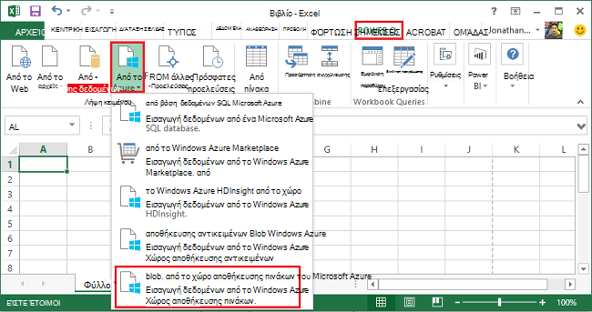
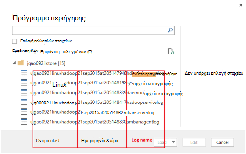
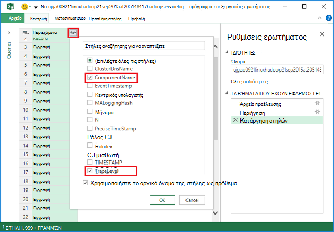
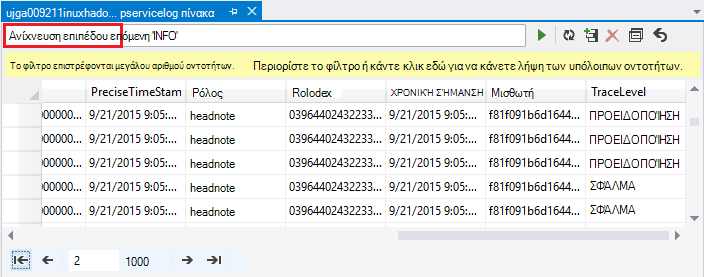
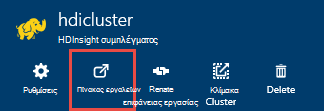
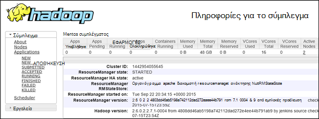

<properties
    pageTitle="Εντοπισμός σφαλμάτων Hadoop σε HDInsight: προβολή αρχείων καταγραφής και ερμηνεία μηνύματα σφάλματος | Microsoft Azure"
    description="Μάθετε σχετικά με τα μηνύματα σφάλματος που ενδέχεται να εμφανιστούν όταν διαχειρίζεστε HDInsight χρήση του PowerShell και τα βήματα που μπορείτε να ακολουθήσετε για να ανακτήσετε."
    services="hdinsight"
    tags="azure-portal"
    editor="cgronlun"
    manager="jhubbard"
    authors="mumian"
    documentationCenter=""/>

<tags
    ms.service="hdinsight"
    ms.workload="big-data"
    ms.tgt_pltfrm="na"
    ms.devlang="na"
    ms.topic="article"
    ms.date="09/02/2016"
    ms.author="jgao"/>

# Ανάλυση HDInsight αρχείων καταγραφής

Κάθε σύμπλεγμα Hadoop στο Azure HDInsight διαθέτει λογαριασμό Azure χώρου αποθήκευσης που χρησιμοποιείται ως το προεπιλεγμένο σύστημα αρχείων. Το λογαριασμό χώρου αποθήκευσης είναι αναφέρονται ως του προεπιλεγμένου λογαριασμού χώρου αποθήκευσης. Σύμπλεγμα χρησιμοποιεί το χώρο αποθήκευσης πινάκων του Azure και το χώρο αποθήκευσης αντικειμένων Blob στην τον προεπιλεγμένο λογαριασμό χώρου αποθήκευσης για να αποθηκεύσετε τα αρχεία καταγραφής.  Για να βρείτε τον προεπιλεγμένο λογαριασμό χώρου αποθήκευσης για το σύμπλεγμά σας, ανατρέξτε στο θέμα [Διαχείριση Hadoop συμπλεγμάτων στο HDInsight](hdinsight-administer-use-management-portal.md#find-the-default-storage-account). Τα αρχεία καταγραφής διατηρούνται στο λογαριασμό χώρου αποθήκευσης, ακόμα και μετά από τη διαγραφή του συμπλέγματος.

##Αρχεία καταγραφής γραμμένο σε πίνακες Azure

Τα αρχεία καταγραφής γραμμένο σε πίνακες Azure παρέχουν ένα επίπεδο πληροφορίες για ό, τι συμβαίνει με ένα σύμπλεγμα HDInsight.

Όταν δημιουργείτε ένα σύμπλεγμα HDInsight, 6 πίνακες δημιουργούνται αυτόματα για συμπλεγμάτων Linux βασίζεται στο χώρο αποθήκευσης πινάκων του προεπιλεγμένου:

- hdinsightagentlog
- SYSLOG
- daemonlog
- hadoopservicelog
- ambariserverlog
- ambariagentlog

3 οι πίνακες δημιουργούνται για συμπλεγμάτων που βασίζεται σε Windows:

- Setuplog: αρχείο καταγραφής συμβάντων/εξαιρέσεων αντιμετώπισε στο προμήθεια/ρύθμιση συμπλεγμάτων HDInsight.
- hadoopinstalllog: αρχείο καταγραφής συμβάντων/εξαιρέσεων αντιμετώπισε κατά την εγκατάσταση του Hadoop στο σύμπλεγμα. Αυτός ο πίνακας ενδέχεται να είναι χρήσιμη για τον εντοπισμό σφαλμάτων σε θέματα που σχετίζονται με συμπλεγμάτων που δημιουργήθηκαν με προσαρμοσμένες παραμέτρους.
- hadoopservicelog: αρχείο καταγραφής συμβάντων/εξαιρέσεων καταγράφονται από όλες τις υπηρεσίες Hadoop. Αυτός ο πίνακας ενδέχεται να είναι χρήσιμη για τον εντοπισμό σφαλμάτων σε θέματα που σχετίζονται με αποτυχίες των εργασιών σε συμπλεγμάτων HDInsight.

Τα ονόματα αρχείων πίνακα είναι **u<ClusterName>DDMonYYYYatHHMMSSsss<TableName>**.

Σε αυτούς τους πίνακες περιλαμβάνει τα παρακάτω πεδία:

- ClusterDnsName
- ΌνομαΣτοιχείου είναι
- EventTimestamp
- Κεντρικός υπολογιστής
- MALoggingHash
- Μήνυμα
- N
- PreciseTimeStamp
- Ρόλος
- RowIndex
- Μισθωτή
- ΧΡΟΝΙΚΉ ΣΉΜΑΝΣΗ
- TraceLevel

### Εργαλεία για να αποκτήσετε πρόσβαση στα αρχεία καταγραφής

Υπάρχουν πολλά εργαλεία που είναι διαθέσιμες για την πρόσβαση σε δεδομένα σε αυτούς τους πίνακες:

-  Visual Studio
-  Εξερεύνηση Azure χώρου αποθήκευσης
-  Power Query για Excel

#### Χρησιμοποιήσετε το Power Query για Excel

Power Query μπορεί να εγκατασταθεί από [www.microsoft.com/en-us/download/details.aspx?id=39379]( http://www.microsoft.com/en-us/download/details.aspx?id=39379). Δείτε τη σελίδα λήψης για τις απαιτήσεις συστήματος

**Για να χρησιμοποιήσετε το Power Query για να ανοίξετε και να αναλύσετε το αρχείο καταγραφής υπηρεσίας**

1. Ανοίξτε το **Microsoft Excel**.
2. Από το μενού **Power Query** , κάντε κλικ στην επιλογή **Από το Azure**και, στη συνέχεια, κάντε κλικ στην επιλογή **Αποθήκευση από το Microsoft Azure πίνακα**.
 
    
3. Πληκτρολογήστε το όνομα λογαριασμού του χώρου αποθήκευσης. Αυτό είναι το σύντομο όνομα ή το FQDN.
4. Πληκτρολογήστε το κλειδί λογαριασμού χώρου αποθήκευσης. Βλέπετε μια λίστα με τους πίνακες:

    
5. Δεξί κλικ στον πίνακα hadoopservicelog στο **πρόγραμμα** περιήγησης και επιλέξτε **Επεξεργασία**. Βλέπετε 4 στήλες. Προαιρετικά, διαγράψτε τις στήλες **Partition κλειδί**, **Κλειδί γραμμής**και **χρονικής σήμανσης** επιλέγοντάς τις και, στη συνέχεια, κάνοντας κλικ στην επιλογή **Κατάργηση στηλών** από τις επιλογές στην κορδέλα.
6. Κάντε κλικ στο εικονίδιο ανάπτυξης στη στήλη "περιεχόμενο" για να επιλέξετε τις στήλες που θέλετε να εισαγάγετε στο υπολογιστικού φύλλου του Excel. Για αυτήν την επίδειξη, που Διάλεξα TraceLevel και ΌνομαΣτοιχείου είναι: το να δώσετε σε εμένα ορισμένες βασικές πληροφορίες στον οποίο στοιχεία είχαν θέματα.

    
7. Κάντε κλικ στο **κουμπί OK** για να εισαγάγετε τα δεδομένα.
8. Επιλέξτε τις στήλες **TraceLevel**ρόλο και **ΌνομαΣτοιχείου είναι** και, στη συνέχεια, κάντε κλικ στην επιλογή **Ομαδοποίηση κατά** στοιχείου ελέγχου στην κορδέλα.
9. Κάντε κλικ στο **κουμπί OK** στο παράθυρο διαλόγου ομαδοποίηση κατά
10. Κάντε κλικ στην επιλογή** Εφαρμογή & Κλείσιμο**.
 
Τώρα, μπορείτε να χρησιμοποιήσετε Excel για φιλτράρισμα και ταξινόμηση σύμφωνα με τις ανάγκες. Εμφανώς, ενδέχεται να θέλετε να συμπεριλάβετε άλλες στήλες (π.χ., μήνυμα) για να κάνετε Διερεύνηση σε θέματα όταν προκύπτουν, αλλά επιλογή και την ομαδοποίηση των στηλών που περιγράφεται παραπάνω παρέχει μια ικανοποιητική εικόνα του τι συμβαίνει με τις υπηρεσίες Hadoop. Η ίδια ιδέα μπορούν να εφαρμοστούν με τους πίνακες setuplog και hadoopinstalllog.

#### Χρησιμοποιήστε το Visual Studio

**Για να χρησιμοποιήσετε το Visual Studio**

1. Ανοίξτε το Visual Studio.
2. Από το μενού **Προβολή** , κάντε κλικ στην επιλογή **Εξερεύνηση Cloud**. Ή απλώς κάντε κλικ στην επιλογή **CTRL +\, CTRL + X**.
3. Από την **Εξερεύνηση Cloud**, επιλέξτε **Τύπους πόρων**.  Οι άλλες διαθέσιμες είναι **Ομάδες πόρων**.
4. Αναπτύξτε **Τους λογαριασμούς χώρου αποθήκευσης**, τον προεπιλεγμένο λογαριασμό χώρου αποθήκευσης για το σύμπλεγμά σας και, στη συνέχεια, **πίνακες**.
5. Κάντε διπλό κλικ **hadoopservicelog**.
6. Προσθήκη ενός φίλτρου. Για παράδειγμα:
    
        TraceLevel eq 'ERROR'

    

    Για περισσότερες πληροφορίες σχετικά με τη δημιουργία φίλτρων, ανατρέξτε στο θέμα [Δημιουργία συμβολοσειρών φίλτρου για το πρόγραμμα σχεδίασης πίνακα](../vs-azure-tools-table-designer-construct-filter-strings.md).
 
##Αρχεία καταγραφής γραμμένο με το χώρο αποθήκευσης αντικειμένων Blob του Azure

[Τα αρχεία καταγραφής γραμμένο σε πίνακες Azure](#log-written-to-azure-tables) παρέχουν ένα επίπεδο πληροφορίες για ό, τι συμβαίνει με ένα σύμπλεγμα HDInsight. Ωστόσο, σε αυτούς τους πίνακες δεν παρέχουν αρχεία καταγραφής επιπέδου εργασίας, που μπορεί να είναι χρήσιμο στις Διερεύνηση περαιτέρω προβλήματα όταν προκύπτουν. Για να παρέχετε το επόμενο επίπεδο λεπτομερειών, συμπλεγμάτων HDInsight έχουν ρυθμιστεί για να γράψετε αρχεία καταγραφής από την εργασία στο λογαριασμό σας χώρο αποθήκευσης αντικειμένων Blob για οποιαδήποτε εργασία που έχει υποβληθεί μέσω Templeton. Πρακτικά, αυτό σημαίνει ότι για έργα που υποβάλλεται χρησιμοποιώντας τα cmdlet του Microsoft Azure PowerShell ή τα .NET εργασία υποβολής API, δεν οι εργασίες που έχουν υποβληθεί μέσω RDP/εντολών-γραμμή πρόσβαση στο σύμπλεγμα. 

Για να προβάλετε τα αρχεία καταγραφής, ανατρέξτε στο θέμα [εφαρμογή Access ΝΉΜΑΤΑ συνδέεται με βάση Linux HDInsight](hdinsight-hadoop-access-yarn-app-logs-linux.md).

Για περισσότερες πληροφορίες σχετικά με τα αρχεία καταγραφής εφαρμογών, ανατρέξτε στο θέμα [Διαχείριση χρήστης συνδέεται Simplifying και την πρόσβαση σε ΝΉΜΑΤΑ](http://hortonworks.com/blog/simplifying-user-logs-management-and-access-in-yarn/).
 
 
## Προβολή αρχείων καταγραφής εύρυθμης λειτουργίας και εργασία συμπλέγματος

###Πρόσβαση στο περιβάλλον εργασίας Χρήστη Hadoop

Από την πύλη Azure, κάντε κλικ στην επιλογή ένα όνομα συμπλέγματος HDInsight για να ανοίξετε το σύμπλεγμα blade. Από το σύμπλεγμα blade, κάντε κλικ στην επιλογή **πίνακα εργαλείων**.

Όταν σας ζητηθεί, πληκτρολογήστε τα διαπιστευτήρια διαχειριστή συμπλέγματος. Στην κονσόλα ερωτήματος που ανοίγει, κάντε κλικ στην επιλογή **Hadoop περιβάλλοντος εργασίας Χρήστη**.

###Πρόσβαση στο περιβάλλον εργασίας Χρήστη νήματος

Από την πύλη Azure, κάντε κλικ στην επιλογή ένα όνομα συμπλέγματος HDInsight για να ανοίξετε το σύμπλεγμα blade. Από το σύμπλεγμα blade, κάντε κλικ στην επιλογή **πίνακα εργαλείων**. Όταν σας ζητηθεί, πληκτρολογήστε τα διαπιστευτήρια διαχειριστή συμπλέγματος. Στην κονσόλα ερωτήματος που ανοίγει, κάντε κλικ στην επιλογή **ΝΉΜΑΤΑ περιβάλλοντος εργασίας Χρήστη**.

Μπορείτε να χρησιμοποιήσετε το περιβάλλον εργασίας Χρήστη ΝΉΜΑΤΑ για να κάνετε τα εξής:

* **Λάβετε σύμπλεγμα κατάσταση**. Από το αριστερό παράθυρο, αναπτύξτε **σύμπλεγμα**και κάντε κλικ στην επιλογή **σχετικά με το**. Αυτό παρουσίαση συμπλέγματος λεπτομέρειες κατάστασης όπως έχει εκχωρηθεί μνήμη, πυρήνων χρησιμοποιούνται, σύνολο κατάστασης στη Διαχείριση πόρων συμπλέγματος, σύμπλεγμα έκδοση κ.λπ.

    

* **Λάβετε κατάσταση κόμβο**. Από το αριστερό παράθυρο, αναπτύξτε **σύμπλεγμα**και κάντε κλικ στο κουμπί **κόμβοι**. Αυτό παραθέτει όλους τους κόμβους του συμπλέγματος, διεύθυνση HTTP κάθε κόμβο, τους πόρους που έχουν εκχωρηθεί σε κάθε κόμβο, κ.λπ.

* **Παρακολούθηση κατάστασης εργασίας**. Από το αριστερό παράθυρο, αναπτύξτε **σύμπλεγμα**και, στη συνέχεια, κάντε κλικ στην επιλογή **εφαρμογές** για μια λίστα όλων των εργασιών στο σύμπλεγμα. Εάν θέλετε να δείτε εργασίες σε ένα συγκεκριμένο μέλος (όπως νέα, που έχει υποβληθεί, εκτέλεση, κ.λπ.), κάντε κλικ στην κατάλληλη σύνδεση στην περιοχή **εφαρμογές**. Επιπλέον, μπορείτε να επιλέξετε το όνομα της εργασίας για να μάθετε περισσότερα σχετικά με την εργασία όπως όπως το αποτέλεσμα, αρχεία καταγραφής, κ.λπ.

###Πρόσβαση στο περιβάλλον εργασίας Χρήστη του HBase

Από την πύλη Azure, κάντε κλικ στην επιλογή ένα όνομα συμπλέγματος HDInsight HBase για να ανοίξετε το σύμπλεγμα blade. Από το σύμπλεγμα blade, κάντε κλικ στην επιλογή **πίνακα εργαλείων**. Όταν σας ζητηθεί, πληκτρολογήστε τα διαπιστευτήρια διαχειριστή συμπλέγματος. Στην κονσόλα ερωτήματος που ανοίγει, κάντε κλικ στην επιλογή **HBase περιβάλλοντος εργασίας Χρήστη**.

## Κωδικοί σφάλματος HDInsight

Τα μηνύματα σφάλματος αναλυτικών σε αυτήν την ενότητα παρέχονται για να βοηθήσουν τους χρήστες του Hadoop στο Azure HDInsight Κατανόηση συνθήκες πιθανό σφάλμα που που μπορεί να αντιμετωπίζουν όταν διαχειρίζεστε την υπηρεσία χρησιμοποιώντας Azure PowerShell και για να υποδείξει ότι αυτά τα βήματα που πρέπει να λαμβάνονται για την ανάκτηση από το σφάλμα.

Ορισμένα από αυτά τα μηνύματα σφάλματος μπορεί επίσης να προβληθούν στην πύλη του Azure όταν χρησιμοποιείται για τη Διαχείριση συμπλεγμάτων HDInsight. Άλλα μηνύματα σφάλματος που ενδέχεται να συναντήσετε, αλλά υπάρχουν λιγότερο λεπτομερής λόγω τους περιορισμούς στις τα πιθανά σε αυτό το περιβάλλον Ενέργειες επιδιόρθωσης. Άλλα μηνύματα σφάλματος παρέχονται στο τα περιβάλλοντα όπου το μετριασμού είναι εμφανή. 

### AtleastOneSqlMetastoreMustBeProvided
- **Περιγραφή**: Δώστε λεπτομέρειες βάσης δεδομένων Azure SQL για τουλάχιστον ένα στοιχείο για να χρησιμοποιήσετε προσαρμοσμένες ρυθμίσεις για την ομάδα και Oozie metastores.
- **Μετριασμού**: Ο χρήστης πρέπει να δώσετε μια έγκυρη metastore SQL Azure και προσπαθήστε ξανά.  

### AzureRegionNotSupported
- **Περιγραφή**: δεν ήταν δυνατή η δημιουργία συμπλέγματος στην περιοχή *nameOfYourRegion*. Χρησιμοποιήστε μια έγκυρη περιοχή HDInsight και επαναλάβετε την αίτηση.
- **Μετριασμού**: πελάτη πρέπει να δημιουργήσετε τη περιοχή συμπλέγματος που υποστηρίζει επί του παρόντος: νοτιοανατολικής Ασίας, Δυτική Ευρώπη, Βόρειας Ευρώπης, Ανατολικής η.π.α. ή Δυτική ΗΠΑ.  

### ClusterContainerRecordNotFound
- **Περιγραφή**: Ο διακομιστής δεν μπόρεσε να βρει την εγγραφή ζητήθηκε σύμπλεγμα.  
- **Μετριασμού**: Επανάληψη της λειτουργίας.

### ClusterDnsNameInvalidReservedWord
- **Περιγραφή**: συμπλέγματος DNS όνομα *yourDnsName* δεν είναι έγκυρη. Βεβαιωθείτε ότι το όνομα ξεκινά και τελειώνει με αλφαριθμητικό και μπορεί να περιέχει μόνο '-' ειδικού χαρακτήρα  
- **Μετριασμού**: Βεβαιωθείτε ότι έχετε χρησιμοποιήσει ένα έγκυρο όνομα DNS για το σύμπλεγμά σας που ξεκινά και τελειώνει με αλφαριθμητικό και περιέχει χωρίς ειδικών χαρακτήρων εκτός από την παύλα '-' και, στη συνέχεια, επαναλάβετε τη λειτουργία.

### ClusterNameUnavailable
- **Περιγραφή**: όνομα σύμπλεγμα *yourClusterName* δεν είναι διαθέσιμη. Επιλέξτε ένα άλλο όνομα.  
- **Μετριασμού**: Ο χρήστης πρέπει να καθορίσετε μια clustername που είναι μοναδικό και δεν υπάρχει και προσπαθήστε ξανά. Εάν ο χρήστης χρησιμοποιεί την πύλη, το περιβάλλον εργασίας Χρήστη θα σας ειδοποιήσει τους εάν ένα όνομα συμπλέγματος χρησιμοποιείται ήδη στη διάρκεια των βημάτων Δημιουργία.

### ClusterPasswordInvalid
- **Περιγραφή**: σύμπλεγμα κωδικού πρόσβασης δεν είναι έγκυρα. Κωδικός πρόσβασης πρέπει να είναι τουλάχιστον 10 χαρακτήρων και πρέπει να περιέχει τουλάχιστον έναν αριθμό, κεφαλαίο γράμμα, πεζό και ειδικός χαρακτήρας χωρίς κενά διαστήματα και δεν πρέπει να περιέχει το όνομα χρήστη ως τμήμα του.  
- **Μετριασμού**: παρέχει έναν κωδικό πρόσβασης έγκυρη σύμπλεγμα και επαναλάβετε τη λειτουργία.

### ClusterUserNameInvalid
- **Περιγραφή**: σύμπλεγμα όνομα χρήστη δεν είναι έγκυρα. Βεβαιωθείτε ότι όνομα χρήστη δεν περιέχει ειδικούς χαρακτήρες ή κενά διαστήματα.  
- **Μετριασμού**: δώστε ένα όνομα χρήστη έγκυρη σύμπλεγμα και επαναλάβετε τη λειτουργία.

### ClusterUserNameInvalidReservedWord
- **Περιγραφή**: συμπλέγματος DNS όνομα *yourDnsClusterName* δεν είναι έγκυρη. Βεβαιωθείτε ότι το όνομα ξεκινά και τελειώνει με αλφαριθμητικό και μπορεί να περιέχει μόνο '-' ειδικού χαρακτήρα  
- **Μετριασμού**: παρέχει ένα έγκυρο όνομα χρήστη συμπλέγματος DNS και επαναλάβετε τη λειτουργία.

### ContainerNameMisMatchWithDnsName
- **Περιγραφή**: το όνομα του κοντέινερ στο URI *yourcontainerURI* και όνομα DNS *yourDnsName* στο σώμα αίτησης πρέπει να είναι η ίδια.  
- **Μετριασμού**: Βεβαιωθείτε ότι το όνομα του κοντέινερ και το όνομα του DNS σας είναι τα ίδια και προσπαθήστε ξανά τη λειτουργία.

### DataNodeDefinitionNotFound
- **Περιγραφή**: ρύθμιση παραμέτρων του συμπλέγματος δεν είναι έγκυρη. Δεν μπορείτε να βρείτε οποιαδήποτε ορισμών δεδομένων κόμβου μέγεθος κόμβο.  
- **Μετριασμού**: Επανάληψη της λειτουργίας.

### DeploymentDeletionFailure
- **Περιγραφή**: Απέτυχε η διαγραφή της ανάπτυξης για το σύμπλεγμα  
- **Μετριασμού**: προσπαθήστε ξανά τη λειτουργία διαγραφής.

### DnsMappingNotFound
- **Περιγραφή**: σφάλμα ρύθμισης παραμέτρων υπηρεσίας. Απαιτούμενες πληροφορίες αντιστοίχισης DNS δεν βρέθηκε.  
- **Μετριασμού**: διαγραφή σύμπλεγμα και δημιουργήστε ένα νέο σύμπλεγμα.

### DuplicateClusterContainerRequest
- **Περιγραφή**: αναπαραγωγή προσπάθεια δημιουργίας κοντέινερ σύμπλεγμα. Υπάρχει εγγραφή για *nameOfYourContainer* , αλλά δεν αντιστοιχούν με τις Etags.
- **Μετριασμού**: Πληκτρολογήστε ένα μοναδικό όνομα για το κοντέινερ και προσπαθήστε ξανά τη λειτουργία δημιουργίας.

### DuplicateClusterInHostedService
- **Περιγραφή**: υπηρεσία *nameOfYourHostedService* περιέχει ήδη ένα σύμπλεγμα. Μια υπηρεσία δεν μπορεί να περιέχει πολλές συμπλεγμάτων  
- **Μετριασμού**: κεντρικού υπολογιστή του συμπλέγματος σε άλλη υπηρεσία.

### FailureToUpdateDeploymentStatus
- **Περιγραφή**: Ο διακομιστής δεν ήταν δυνατή η ενημέρωση της κατάστασης της ανάπτυξης συμπλέγματος.  
- **Μετριασμού**: Επανάληψη της λειτουργίας. Εάν συμβαίνει αυτό πολλές φορές, επικοινωνήστε με CSS.

### HdiRestoreClusterAltered
- **Περιγραφή**: σύμπλεγμα *yourClusterName* έχει διαγραφεί ως μέρος της συντήρησης. Δημιουργήστε ξανά το σύμπλεγμα.
- **Μετριασμού**: Δημιουργήστε ξανά το σύμπλεγμα.

### HeadNodeConfigNotFound
- **Περιγραφή**: ρύθμιση παραμέτρων του συμπλέγματος δεν είναι έγκυρη. Απαιτείται ρύθμιση παραμέτρων κεφαλής κόμβου που δεν βρίσκονται σε μεγέθη κόμβο.
- **Μετριασμού**: Επανάληψη της λειτουργίας.

### HostedServiceCreationFailure
- **Περιγραφή**: δεν είναι δυνατή η δημιουργία υπηρεσία *nameOfYourHostedService*. Δοκιμάστε ξανά την πρόσκληση.  
- **Μετριασμού**: προσπαθήστε ξανά.

### HostedServiceHasProductionDeployment
- **Περιγραφή**: υπηρεσία *nameOfYourHostedService* έχει ήδη μια ανάπτυξη παραγωγής. Μια υπηρεσία δεν μπορεί να περιέχει πολλές αναπτύξεις παραγωγής. Επαναλάβετε το ερώτημα με ένα σύμπλεγμα διαφορετικό όνομα.
- **Μετριασμού**: Χρησιμοποιήστε ένα όνομα διαφορετικό σύμπλεγμα και προσπαθήστε ξανά.

### HostedServiceNotFound
- **Περιγραφή**: φιλοξενούνται υπηρεσίας *nameOfYourHostedService* για το σύμπλεγμα δεν ήταν δυνατό να βρεθεί.  
- **Μετριασμού**: Εάν το σύμπλεγμα είναι σε κατάσταση σφάλματος, διαγράψτε το και, στη συνέχεια, προσπαθήστε ξανά.

### HostedServiceWithNoDeployment
- **Περιγραφή**: υπηρεσία *nameOfYourHostedService* έχει καμία συσχετισμένη ανάπτυξης.  
- **Μετριασμού**: Εάν το σύμπλεγμα είναι σε κατάσταση σφάλματος, διαγράψτε το και, στη συνέχεια, προσπαθήστε ξανά.

### InsufficientResourcesCores
- **Περιγραφή**: το SubscriptionId *yourSubscriptionId* δεν διαθέτει πυρήνων προς τα αριστερά για να δημιουργήσετε σύμπλεγμα *yourClusterName*. Υποχρεωτικά: *resourcesRequired*, διαθέσιμος: *resourcesAvailable*.  
- **Μετριασμού**: αποδεσμεύσετε πόρους στη συνδρομή σας ή αύξηση τους πόρους που είναι διαθέσιμες για τη συνδρομή και προσπαθήστε να δημιουργήσετε ξανά το σύμπλεγμα.

### InsufficientResourcesHostedServices
- **Περιγραφή**: Αναγνωριστικό συνδρομής *yourSubscriptionId* δεν έχει όριο για μια νέα HostedService για να δημιουργήσετε σύμπλεγμα *yourClusterName*.  
- **Μετριασμού**: αποδεσμεύσετε πόρους στη συνδρομή σας ή αύξηση τους πόρους που είναι διαθέσιμες για τη συνδρομή και προσπαθήστε να δημιουργήσετε ξανά το σύμπλεγμα.

### InternalErrorRetryRequest
- **Περιγραφή**: Παρουσιάστηκε εσωτερικό σφάλμα στο διακομιστή. Δοκιμάστε ξανά την πρόσκληση.  
- **Μετριασμού**: προσπαθήστε ξανά.

### InvalidAzureStorageLocation
- **Περιγραφή**: θέση αποθήκευσης Azure *dataRegionName* δεν είναι έγκυρη θέση. Βεβαιωθείτε ότι η περιοχή είναι σωστά και προσπαθήστε ξανά να αίτηση.
- **Μετριασμού**: Επιλέξτε μια θέση αποθήκευσης που υποστηρίζει το HDInsight, ελέγξτε ότι το σύμπλεγμά σας βρίσκεται από κοινού και επαναλάβετε τη λειτουργία.

### InvalidNodeSizeForDataNode
- **Περιγραφή**: μέγεθος δεν είναι έγκυρη Εικονική για τους κόμβους δεδομένων. Υποστηρίζεται μόνο 'Μεγάλο Εικονική' μέγεθος για όλους τους κόμβους δεδομένων.  
- **Μετριασμού**: Καθορίστε το μέγεθος υποστηριζόμενες κόμβου για τον κόμβο δεδομένων και δοκιμάστε τη λειτουργία ξανά.

### InvalidNodeSizeForHeadNode
- **Περιγραφή**: μέγεθος δεν είναι έγκυρη Εικονική για κεφαλής κόμβο. Υποστηρίζεται μόνο 'ExtraLarge Εικονική' μέγεθος για κεφαλής κόμβο.  
- **Μετριασμού**: Καθορίστε το μέγεθος υποστηριζόμενες κόμβου για τον κόμβο κεφαλής και επαναλάβετε τη λειτουργία

### InvalidRightsForDeploymentDeletion
- **Περιγραφή**: Αναγνωριστικό συνδρομής *yourSubscriptionId* που χρησιμοποιείται δεν έχετε επαρκή δικαιώματα για να εκτελέσετε τη λειτουργία διαγραφής για το σύμπλεγμα *yourClusterName*.  
- **Μετριασμού**: Εάν το σύμπλεγμα είναι σε κατάσταση σφάλματος, αποθέστε το και, στη συνέχεια, προσπαθήστε ξανά.  

### InvalidStorageAccountBlobContainerName
- **Περιγραφή**: εξωτερικής αποθήκευσης λογαριασμού blob κοντέινερ όνομα *yourContainerName* δεν είναι έγκυρη. Βεβαιωθείτε ότι το όνομα ξεκινά με ένα γράμμα και περιέχει μόνο πεζά γράμματα, αριθμούς και παύλας.  
- **Μετριασμού**: Καθορίστε ένα όνομα κοντέινερ αντικειμένων blob λογαριασμό έγκυρη χώρου αποθήκευσης και επαναλάβετε τη λειτουργία.

### InvalidStorageAccountConfigurationSecretKey
- **Περιγραφή**: ρύθμιση παραμέτρων για το λογαριασμό εξωτερικής αποθήκευσης *yourStorageAccountName* απαιτείται για την μυστικού κλειδιού λεπτομέρειες θα οριστεί.  
- **Μετριασμού**: Καθορίστε ένα έγκυρο κλειδί μυστικού για το λογαριασμό χώρου αποθήκευσης και επαναλάβετε τη λειτουργία.

### InvalidVersionHeaderFormat
- **Περιγραφή**: κεφαλίδα έκδοση *yourVersionHeader* δεν είναι έγκυρη μορφή εεεε-μμ-ηη.  
- **Μετριασμού**: Καθορίστε μια έγκυρη μορφή για την κεφαλίδα της έκδοσης και προσπαθήστε ξανά.

### MoreThanOneHeadNode
- **Περιγραφή**: ρύθμιση παραμέτρων του συμπλέγματος δεν είναι έγκυρη. Βρείτε περισσότερες από μία ρύθμιση παραμέτρων κεφαλής κόμβου.  
- **Μετριασμού**: επεξεργασία της ρύθμισης παραμέτρων, ώστε να έχει καθοριστεί έναν κόμβο κεφαλίδας που onloy.

### OperationTimedOutRetryRequest
- **Περιγραφή**: Η λειτουργία δεν ήταν δυνατό να ολοκληρωθεί εντός του χρόνου ρητά ή δυνατόν επιχειρεί το μέγιστο "Επανάληψη". Δοκιμάστε ξανά την πρόσκληση.  
- **Μετριασμού**: προσπαθήστε ξανά.

### ParameterNullOrEmpty
- **Περιγραφή**: η παράμετρος *yourParameterName* δεν είναι μηδενική ή κενή.  
- **Μετριασμού**: Καθορίστε μια έγκυρη τιμή για την παράμετρο.

### PreClusterCreationValidationFailure
- **Περιγραφή**: ένα ή περισσότερα από τα δεδομένα εισόδου αίτηση δημιουργίας συμπλέγματος δεν είναι έγκυρο. Βεβαιωθείτε ότι οι τιμές εισαγωγής είναι σωστά και προσπαθήστε ξανά να αίτηση.  
- **Μετριασμού**: Βεβαιωθείτε ότι οι τιμές εισαγωγής είναι σωστά και προσπαθήστε ξανά να αίτηση.

### RegionCapabilityNotAvailable
- **Περιγραφή**: περιοχή η δυνατότητα δεν είναι διαθέσιμη για την περιοχή *yourRegionName* και Αναγνωριστικό συνδρομής *yourSubscriptionId*.  
- **Μετριασμού**: Καθορίστε μια περιοχή που υποστηρίζει συμπλεγμάτων HDInsight. Οι περιοχές στο κοινό υποστηριζόμενες είναι: νοτιοανατολικής Ασίας, Δυτική Ευρώπη, Βόρειας Ευρώπης, Ανατολικής η.π.α. ή Δυτική ΗΠΑ.

### StorageAccountNotColocated
- **Περιγραφή**: λογαριασμού χώρου αποθήκευσης *yourStorageAccountName* βρίσκεται στην περιοχή *currentRegionName*. Αυτό πρέπει να είναι ίδια με την περιοχή σύμπλεγμα *yourClusterRegionName*.  
- **Μετριασμού**: μπορείτε να καθορίσετε ένα λογαριασμό του χώρου αποθήκευσης στο στην ίδια περιοχή, η οποία βρίσκεται το σύμπλεγμά σας ή εάν τα δεδομένα σας είναι ήδη στο λογαριασμό χώρου αποθήκευσης, δημιουργήστε ένα νέο σύμπλεγμα στην ίδια περιοχή ως τα υπάρχοντα λογαριασμό του χώρου αποθήκευσης. Εάν χρησιμοποιείτε την πύλη, το περιβάλλον εργασίας Χρήστη θα σας ειδοποιήσει τους αυτού του ζητήματος εκ των προτέρων.

### SubscriptionIdNotActive
- **Περιγραφή**: δεδομένο Αναγνωριστικό συνδρομής *yourSubscriptionId* δεν είναι ενεργή.  
- **Μετριασμού**: εκ νέου ενεργοποίηση της συνδρομής σας ή να λάβετε μια νέα συνδρομή έγκυρη.

### SubscriptionIdNotFound
- **Περιγραφή**: δεν ήταν δυνατή η εύρεση Αναγνωριστικό συνδρομής *yourSubscriptionId* .  
- **Μετριασμού**: Βεβαιωθείτε ότι το Αναγνωριστικό συνδρομής είναι έγκυρη και επαναλάβετε τη λειτουργία.

### UnableToResolveDNS
- **Περιγραφή**: δεν είναι δυνατή η επίλυση DNS *yourDnsUrl*. Βεβαιωθείτε ότι παρέχεται την πλήρως προσδιορισμένη διεύθυνση URL για το τελικό σημείο blob.  
- **Μετριασμού**: δίνετε μια διεύθυνση URL έγκυρη blob. Η διεύθυνση URL πρέπει να είναι πλήρως έγκυρη, συμπεριλαμβανομένων των ξεκινώντας με *http://* και λήξης στο *.com*.

### UnableToVerifyLocationOfResource
- **Περιγραφή**: δεν είναι δυνατή η επαλήθευση θέση του πόρου *yourDnsUrl*. Βεβαιωθείτε ότι παρέχεται την πλήρως προσδιορισμένη διεύθυνση URL για το τελικό σημείο blob.  
- **Μετριασμού**: δίνετε μια διεύθυνση URL έγκυρη blob. Η διεύθυνση URL πρέπει να είναι πλήρως έγκυρη, συμπεριλαμβανομένων των ξεκινώντας με *http://* και λήξης στο *.com*.

### VersionCapabilityNotAvailable
- **Περιγραφή**: έκδοση η δυνατότητα δεν είναι διαθέσιμη για την έκδοση *specifiedVersion* και Αναγνωριστικό συνδρομής *yourSubscriptionId*.  
- **Μετριασμού**: Επιλέξτε μια έκδοση που είναι διαθέσιμη και επαναλάβετε τη λειτουργία.

### VersionNotSupported
- **Περιγραφή**: έκδοση *specifiedVersion* δεν υποστηρίζονται.
- **Μετριασμού**: Επιλέξτε μια έκδοση που υποστηρίζεται και επαναλάβετε τη λειτουργία.

### VersionNotSupportedInRegion
- **Περιγραφή**: δεν είναι διαθέσιμη στην περιοχή Azure *specifiedRegion*έκδοση *specifiedVersion* .  
- **Μετριασμού**: Επιλέξτε μια έκδοση που υποστηρίζεται στο της περιοχής που καθορίζεται και επαναλάβετε τη λειτουργία.

### WasbAccountConfigNotFound
- **Περιγραφή**: ρύθμιση παραμέτρων του συμπλέγματος δεν είναι έγκυρη. Απαιτείται WASB ρύθμιση παραμέτρων λογαριασμού δεν βρίσκονται σε εξωτερικές λογαριασμών.  
- **Μετριασμού**: Βεβαιωθείτε ότι ο λογαριασμός υπάρχει και είναι σωστά που καθορίζεται στη ρύθμιση των παραμέτρων και επαναλάβετε τη λειτουργία.

## Επόμενα βήματα

- [Χρήση των προβολών Ambari για τον εντοπισμό σφαλμάτων έργα Tez HDInsight](hdinsight-debug-ambari-tez-view.md)
- [Ενεργοποίηση σωρού ενδείξεις Hadoop υπηρεσίες βάσει Linux HDInsight](hdinsight-hadoop-collect-debug-heap-dump-linux.md)
- [Διαχείριση συμπλεγμάτων HDInsight με τη χρήση του περιβάλλοντος εργασίας Χρήστη Web Ambari](hdinsight-hadoop-manage-ambari.md)
