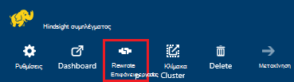
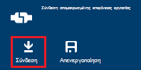
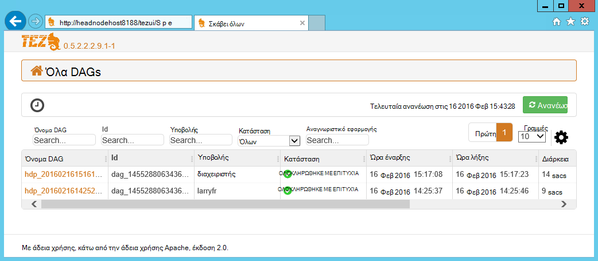
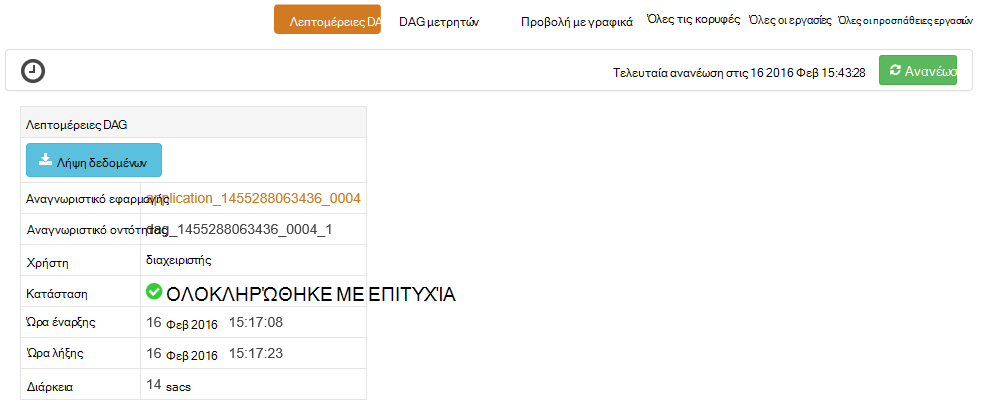
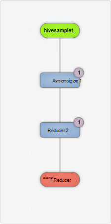
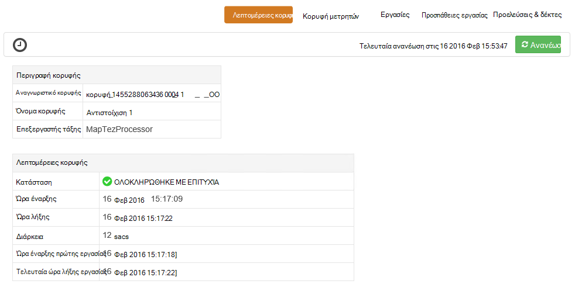
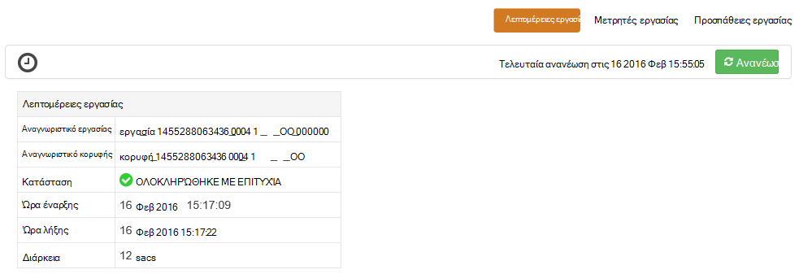

<properties
pageTitle="Χρήση του περιβάλλοντος εργασίας Χρήστη Tez με HDInsight που βασίζεται σε Windows | Azure"
description="Μάθετε πώς μπορείτε να χρησιμοποιήσετε το περιβάλλον εργασίας Χρήστη Tez για τον εντοπισμό σφαλμάτων έργα Tez HDInsight HDInsight που βασίζεται στα Windows."
services="hdinsight"
documentationCenter=""
authors="Blackmist"
manager="jhubbard"
editor="cgronlun"/>

<tags
ms.service="hdinsight"
ms.devlang="na"
ms.topic="article"
ms.tgt_pltfrm="na"
ms.workload="big-data"
ms.date="10/04/2016"
ms.author="larryfr"/>

# Χρησιμοποιήστε το περιβάλλον εργασίας Χρήστη Tez για τον εντοπισμό σφαλμάτων έργα Tez HDInsight που βασίζεται σε Windows

Περιβάλλον εργασίας Χρήστη του Tez είναι μια ιστοσελίδα που μπορεί να χρησιμοποιηθεί για να κατανοήσετε και να διορθώσετε εργασίες που χρησιμοποιούν Tez ως το μηχανισμό εκτέλεσης στην συμπλεγμάτων HDInsight που βασίζεται στα Windows. Περιβάλλον εργασίας Χρήστη του Tez σάς επιτρέπει να απεικόνιση της εργασίας όπως το γράφημα συνδεδεμένο στοιχείων, εμβάθυνση σε κάθε στοιχείο και ανάκτησης στατιστικών στοιχείων και πληροφορίες σύνδεσης.

> [AZURE.NOTE] Οι πληροφορίες σε αυτό το έγγραφο είναι συγκεκριμένη για συμπλεγμάτων HDInsight που βασίζεται στα Windows. Για πληροφορίες σχετικά με την προβολή και τον εντοπισμό σφαλμάτων Tez στην βάσει Linux HDInsight, ανατρέξτε στο θέμα [Χρήση Ambari προβολές για τον εντοπισμό σφαλμάτων έργα Tez HDInsight](hdinsight-debug-ambari-tez-view.md).

## Προαπαιτούμενα στοιχεία

* Ένα σύμπλεγμα HDInsight που βασίζεται στα Windows. Για οδηγίες σχετικά με τη δημιουργία ενός νέου συμπλέγματος, ανατρέξτε στο θέμα [Γρήγορα αποτελέσματα με το HDInsight που βασίζεται στα Windows](hdinsight-hadoop-tutorial-get-started-windows.md).

    > [AZURE.IMPORTANT] Περιβάλλον εργασίας Χρήστη του Tez είναι διαθέσιμη μόνο σε HDInsight που βασίζεται σε Windows συμπλεγμάτων δημιουργήθηκε μετά τις 8 Φεβρουαρίου 2016.

* Ένα πρόγραμμα-πελάτη βασίζεται σε Windows απομακρυσμένης επιφάνειας εργασίας.

## Κατανόηση των Tez

Tez είναι μια επεκτάσιμη πλαίσιο για την επεξεργασία δεδομένων σε Hadoop που παρέχει μεγαλύτερη ταχύτητες από παραδοσιακά MapReduce επεξεργασίας. Για συμπλεγμάτων HDInsight που βασίζεται στα Windows, είναι μια προαιρετική μηχανισμός που μπορείτε να ενεργοποιήσετε για ομάδα, χρησιμοποιώντας την ακόλουθη εντολή ως μέρος του ερωτήματός σας ομάδα:

    set hive.execution.engine=tez;

Κατά την υποβολή εργασίας για να Tez, δημιουργεί μια άμεση μη κυκλικό Graph (DAG) που περιγράφει τη σειρά εκτέλεσης από τις ενέργειες που απαιτούνται από την εργασία. Μεμονωμένες ενέργειες ονομάζονται κορυφών και εκτέλεση ενός τμήματος τη συνολική εργασία. Η πραγματική εκτέλεση των εργασιών που περιγράφεται από κορυφής ονομάζεται μια εργασία και μπορεί να διανεμηθούν σε πολλούς κόμβους του συμπλέγματος.

### Κατανόηση περιβάλλοντος εργασίας Χρήστη του Tez

Περιβάλλον εργασίας Χρήστη του Tez είναι μια ιστοσελίδα παρέχει πληροφορίες σχετικά με τις διαδικασίες που εκτελούνται, ή που έχουν προηγουμένως εκτελέσατε χρησιμοποιώντας Tez. Σας επιτρέπει να προβάλετε το DAG που δημιουργούνται με Tez, πώς κατανέμεται μεταξύ συμπλεγμάτων, μετρητές όπως μνήμη που χρησιμοποιείται από εργασίες και κορυφών και πληροφοριών σφάλματος. Αυτό μπορεί να προσφέρουν χρήσιμες πληροφορίες στα ακόλουθα σενάρια:

* Παρακολούθηση μεγάλη διάρκεια εκτέλεσης επεξεργάζεται, προβολή της προόδου του χάρτη και μείωση εργασίες.

* Την ανάλυση δεδομένων ιστορικού για επιτυχή ή αποτυχίας διαδικασίες για να μάθετε πώς θα μπορούσε να βελτιωθεί επεξεργασίας ή γιατί απέτυχε.

## Δημιουργία μιας DAG

Περιβάλλον εργασίας Χρήστη του Tez μόνο θα περιέχουν δεδομένα, εάν μια εργασία που χρησιμοποιεί το μηχανισμό Tez εκτελείται τη συγκεκριμένη στιγμή ή έχει εκτελέσατε στο παρελθόν. Απλή Hive ερωτήματα μπορεί συνήθως να επιλυθεί χωρίς τη χρήση Tez, ωστόσο πιο σύνθετα ερωτήματα που κάνουν το φιλτράρισμα, ομαδοποίηση, ταξινόμηση, συνδέσμους, κ.λπ., συνήθως απαιτούν Tez.

Χρησιμοποιήστε τα παρακάτω βήματα για να εκτελέσετε ένα ερώτημα ομάδα που θα εκτελείται χρησιμοποιώντας Tez.

1. Στο πρόγραμμα περιήγησης web, μεταβείτε στις επιλογές https://CLUSTERNAME.azurehdinsight.net, όπου __CLUSTERNAME__ είναι το όνομα του συμπλέγματος HDInsight.

2. Από το μενού στο επάνω μέρος της σελίδας, επιλέξτε πρόγραμμα __Επεξεργασίας ομάδας__. Αυτό θα εμφανίσει μια σελίδα με το ακόλουθο παράδειγμα ερώτημα.

        Select * from hivesampletable

    Διαγραφή του ερωτήματος παράδειγμα και να το αντικαταστήσετε με τα εξής.

        set hive.execution.engine=tez;
        select market, state, country from hivesampletable where deviceplatform='Android' group by market, country, state;

3. Επιλέξτε το κουμπί " __Υποβολή__ ". Στην ενότητα __Εργασία περιόδου λειτουργίας__ στο κάτω μέρος της σελίδας θα εμφανίζει την κατάσταση του ερωτήματος. Όταν η κατάσταση αλλάζει σε __ολοκληρώθηκε__, επιλέξτε τη σύνδεση __Προβολή λεπτομερειών__ για να προβάλετε τα αποτελέσματα. Το __Αποτέλεσμα του έργου__ πρέπει να είναι παρόμοια με τα εξής:
        
        en-GB   Hessen      Germany
        en-GB   Kingston    Jamaica
        en-GB   Nairobi Area    Kenya

## Χρήση του περιβάλλοντος εργασίας Χρήστη του Tez

> [AZURE.NOTE] Περιβάλλον εργασίας Χρήστη του Tez διατίθεται μόνο από την επιφάνεια εργασίας της κεφαλίδας κόμβους συμπλέγματος, ώστε να πρέπει να χρησιμοποιήσετε απομακρυσμένης επιφάνειας εργασίας για να συνδεθείτε με τους κόμβους κεφαλίδας.

1. Από την [πύλη του Azure](https://portal.azure.com), επιλέξτε το σύμπλεγμά σας HDInsight. Από το επάνω μέρος του blade HDInsight, επιλέξτε το εικονίδιο __Απομακρυσμένης επιφάνειας εργασίας__ . Αυτό θα εμφανίσει το blade απομακρυσμένης επιφάνειας εργασίας

    

2. Από το blade απομακρυσμένης επιφάνειας εργασίας, επιλέξτε __σύνδεση__ για να συνδεθείτε με τον κόμβο κεφαλής συμπλέγματος. Όταν σας ζητηθεί, χρησιμοποιήστε το όνομα χρήστη σύμπλεγμα απομακρυσμένης επιφάνειας εργασίας και τον κωδικό πρόσβασης για τον έλεγχο ταυτότητας της σύνδεσης.

    

    > [AZURE.NOTE] Εάν δεν έχετε ενεργοποιήσει τη σύνδεση απομακρυσμένης επιφάνειας εργασίας, δώστε ένα όνομα χρήστη, τον κωδικό πρόσβασης και ημερομηνία λήξης και, στη συνέχεια, επιλέξτε το στοιχείο " __Ενεργοποίηση__ " για την ενεργοποίηση της απομακρυσμένης επιφάνειας εργασίας. Όταν έχει ενεργοποιηθεί, χρησιμοποιήστε τα προηγούμενα βήματα για να συνδεθείτε.

3. Μετά τη σύνδεση, ανοίξτε τον Internet Explorer της απομακρυσμένης επιφάνειας εργασίας, επιλέξτε το εικονίδιο γραναζιού στην επάνω δεξιά γωνία του προγράμματος περιήγησης και, στη συνέχεια, επιλέξτε __Ρυθμίσεις προβολής συμβατότητας__.

4. Από το κάτω μέρος __Ρυθμίσεις προβολής συμβατότητας__, καταργήστε την επιλογή από το πλαίσιο ελέγχου για __τις τοποθεσίες intranet εμφάνισης στην προβολή συμβατότητας__ και __λίστες συμβατότητας του Microsoft χρήση__και, στη συνέχεια, επιλέξτε __Κλείσιμο__.

5. Στον Internet Explorer, αναζητήστε http://headnodehost:8188/tezui #/. Αυτό θα εμφανίσει το περιβάλλον εργασίας Χρήστη Tez

    

    Κατά τη φόρτωση του περιβάλλοντος εργασίας Χρήστη Tez, θα δείτε μια λίστα με DAGs που εκτελούνται τη συγκεκριμένη στιγμή ή να έχουν εκτελέσατε στο σύμπλεγμα. Η προεπιλεγμένη προβολή περιλαμβάνει το όνομα Dag, αναγνωριστικό, υποβάλλοντος, κατάσταση, ώρα έναρξης, ώρα λήξης, διάρκεια, Αναγνωριστικό εφαρμογής και ουρά. Μπορείτε να προσθέσετε περισσότερες στήλες με χρήση του εικονιδίου γραναζιού στη δεξιά πλευρά της σελίδας.

    Εάν έχετε μόνο μία καταχώρηση, θα για το ερώτημα που εκτελέσατε στην προηγούμενη ενότητα. Εάν έχετε πολλές εγγραφές, μπορείτε να πραγματοποιήσετε αναζήτηση μέσω εισαγωγής κριτηρίων αναζήτησης στα πεδία επάνω από το DAGs και έπειτα πατήστε __Enter__.

4. Επιλέξτε το __Όνομα Dag__ για την πιο πρόσφατη καταχώρηση DAG. Αυτό θα εμφανίσει πληροφορίες σχετικά με το DAG, καθώς και την επιλογή για να κάνετε λήψη μιας zip JSON αρχείων που περιέχουν πληροφορίες σχετικά με το DAG.

    

5. Επάνω από τις __Λεπτομέρειες DAG__ είναι πολλές συνδέσεις που μπορούν να χρησιμοποιηθούν για να εμφανίσετε πληροφορίες σχετικά με το DAG.

    * __Μετρητές DAG__ εμφανίζει πληροφορίες μετρητές για αυτό DAG.
    
    * __Προβολή με γραφικά__ εμφανίζει μια γραφική αναπαράσταση των αυτό DAG.
    
    * __Όλες τις κορυφές__ εμφανίζει μια λίστα των κορυφών σε αυτό DAG.
    
    * __Όλες οι εργασίες__ εμφανίζει μια λίστα με τις εργασίες σε όλες τις κορυφές σε αυτό DAG.
    
    * __Όλα TaskAttempts__ εμφανίζει πληροφορίες σχετικά με τις προσπάθειες για την εκτέλεση εργασιών για αυτό DAG.
    
    > [AZURE.NOTE] Εάν πραγματοποιείτε κύλιση την εμφάνιση της στήλης για κορυφών, εργασίες και TaskAttempts, παρατηρήστε ότι δεν υπάρχουν συνδέσεις για να προβάλετε __μετρητές__ και να __προβάλετε ή να κάνετε λήψη αρχείων καταγραφής__ για κάθε γραμμή.

    Εάν υπήρχε αποτυχία με την εργασία, τις λεπτομέρειες DAG θα εμφανίζουν την κατάσταση απέτυχε, μαζί με συνδέσεις για πληροφορίες σχετικά με την εργασία απέτυχε. Εργαλεία διαγνωστικών πληροφοριών θα εμφανίζονται κάτω από τις λεπτομέρειες DAG.

7. Επιλέξτε __προβολή με γραφικά__. Αυτό εμφανίζει μια γραφική αναπαράσταση του DAG. Μπορείτε να τοποθετήσετε το δείκτη του ποντικιού επάνω από κάθε κορυφής στην προβολή για να εμφανίσετε πληροφορίες σχετικά με αυτό.

    

8. Κάνοντας κλικ στο κορυφής θα φόρτωση __Κορυφής λεπτομέρειες__ για αυτό το στοιχείο. Κάντε κλικ στο στην κορυφή __χάρτη 1__ για να εμφανίσετε λεπτομέρειες για αυτό το στοιχείο. Επιλέξτε __Επιβεβαίωση__ για να επιβεβαιώσετε την περιήγηση.

    

9. Σημειώστε ότι τώρα έχετε συνδέσεις στο επάνω μέρος της σελίδας που σχετίζονται με κορυφές και εργασίες.

    > [AZURE.NOTE] Μπορείτε επίσης να φτάνουν στο αυτήν τη σελίδα επιστρέφοντας __DAG__λεπτομέρειες, επιλέγοντας __Κορυφής λεπτομέρειες__και, στη συνέχεια, επιλέγοντας την κορυφή __χάρτη 1__ .

    * __Κορυφή μετρητές__ εμφανίζει πληροφορίες μετρητή για αυτό κορυφής.
    
    * __Εργασίες__ εμφανίζει εργασίες για αυτό κορυφής.
    
    * __Εργασία προσπαθεί__ εμφανίζει πληροφορίες σχετικά με τις προσπάθειες για την εκτέλεση εργασιών για αυτό κορυφής.
    
    * __Προελεύσεις & δέκτες__ εμφανίζει προελεύσεις δεδομένων και δέκτες για αυτό κορυφής.

    > [AZURE.NOTE] Ως με το προηγούμενο μενού, μπορείτε να κάνετε κύλιση την εμφάνιση της στήλης για τις εργασίες, προσπάθειες εργασιών, και προελεύσεις & Sinks__ για να εμφανίσετε συνδέσεις σε περισσότερες πληροφορίες για κάθε στοιχείο.

10. Επιλέξτε __εργασίες__και, στη συνέχεια, επιλέξτε το στοιχείο με το όνομα __00_000000__. Αυτό θα εμφανίσει __Λεπτομέρειες εργασίας__ για αυτήν την εργασία. Από αυτή την οθόνη, μπορείτε να προβάλετε __Μετρητές εργασιών__ και __Εργασιών προσπάθειες__.

    

## Επόμενα βήματα

Τώρα που μάθατε πώς μπορείτε να χρησιμοποιήσετε την προβολή Tez, μάθετε περισσότερα σχετικά με τη [Χρήση ομάδας σε HDInsight](hdinsight-use-hive.md).

Για πιο λεπτομερείς πληροφορίες στην Tez, ανατρέξτε στη [σελίδα Tez στο Hortonworks](http://hortonworks.com/hadoop/tez/).
